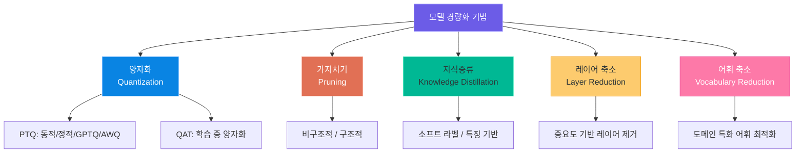
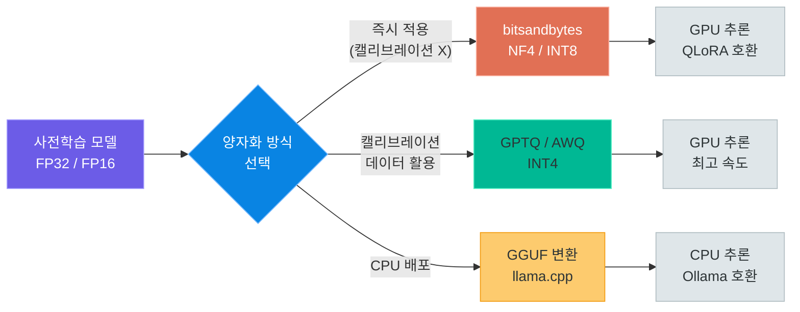
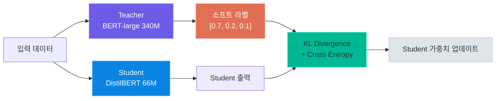
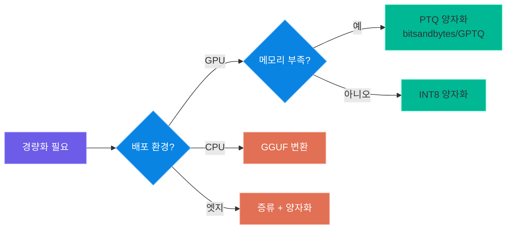

# 모델 경량화와 최적화

> 대규모 언어 모델을 실전에 배포하기 위한 경량화 기법 -- 양자화, 가지치기, 지식증류, 레이어 축소, 어휘 축소까지 모델 크기와 성능의 트레이드오프를 이해하고 최적의 전략을 설계합니다

---

## 1. 왜 모델 경량화가 필요한가

### 대형 모델의 현실적 제약

대규모 언어 모델(LLM)은 뛰어난 성능을 보여주지만, 실제 서비스에 배포하려면 다음과 같은 현실적 제약에 직면합니다.

| 제약 요소 | 문제 | 구체적 수치 예시 |
|---|---|---|
| **메모리** | GPU VRAM이 부족하여 모델을 로드할 수 없음 | 7B 모델 FP32 = 28GB, RTX 4090 = 24GB |
| **비용** | 고성능 GPU 임대/구매 비용이 높음 | A100 80GB 시간당 약 $2~4 (클라우드) |
| **추론 지연** | 토큰 생성 속도가 느려 사용자 경험 저하 | 7B FP32 CPU 추론: 약 2~5 tokens/sec |
| **에너지** | 전력 소비가 크고 탄소 배출이 증가함 | A100 1장 TDP: 300~400W |
| **엣지 배포** | 모바일/IoT 기기에 모델을 올릴 수 없음 | 스마트폰 RAM: 6~12GB |

예를 들어, Llama 2 70B 모델을 FP32로 로드하려면 약 280GB의 메모리가 필요하지만, 4bit 양자화하면 약 35GB로 줄일 수 있습니다.

### 경량화 vs 파인튜닝 vs 프롬프트 엔지니어링

| 비교 항목 | 프롬프트 엔지니어링 | 파인튜닝 (LoRA/QLoRA) | 경량화 (Optimization) |
|---|---|---|---|
| **목적** | 모델의 출력을 유도 | 모델의 행동을 변경 | 모델의 크기/속도를 개선 |
| **모델 변경** | 없음 | 가중치 일부 업데이트 | 가중치 정밀도/구조 변경 |
| **학습 필요** | 불필요 | 필요 (데이터 + GPU) | 기법에 따라 다름 |
| **효과** | 출력 품질 개선 | 도메인 성능 향상 | 메모리/속도 개선 |
| **적용 시점** | 추론 시 | 학습 후 배포 | 학습 후 또는 추론 시 |
| **비용** | 매우 낮음 | 중간 | 낮음~중간 |
| **품질 영향** | 없음 | 개선 가능 | 약간의 손실 가능 |

> **핵심 포인트:** 경량화는 "모델이 무엇을 하는가"를 바꾸는 것이 아니라, "모델이 얼마나 효율적으로 동작하는가"를 개선하는 것입니다. 파인튜닝으로 성능을 높인 후, 경량화로 배포 효율을 개선하는 것이 일반적인 워크플로우입니다.

### 경량화 기법 전체 맵

이 강의에서 다루는 경량화 기법의 전체 구조를 살펴봅니다.



각 기법은 독립적으로 적용할 수도 있고, 여러 기법을 조합하여 더 큰 효과를 얻을 수도 있습니다.

---

## 2. 양자화 (Quantization)

### 개념: 가중치 정밀도 축소

**양자화(Quantization)**는 모델의 가중치와 활성화 값을 더 적은 비트 수로 표현하는 기법입니다. 원래 32비트 부동소수점(FP32)으로 저장된 가중치를 16비트(FP16/BF16), 8비트(INT8), 4비트(INT4)로 변환하면 모델 크기가 비례하여 줄어듭니다.

```
원본 가중치 (FP32):  0.12345678 → 32비트 (4바이트)
FP16 양자화:         0.1235     → 16비트 (2바이트)  -- 크기 1/2
INT8 양자화:         31         → 8비트  (1바이트)  -- 크기 1/4
INT4 양자화:         3          → 4비트  (0.5바이트) -- 크기 1/8
```

양자화의 핵심 원리는 **스케일 팩터(scale)**와 **제로 포인트(zero point)**를 사용한 선형 매핑입니다: `q = round((x - zero_point) / scale)`, 역양자화: `x_approx = q * scale + zero_point`.

### 비트별 메모리와 품질 비교

| 정밀도 | 비트 수 | 7B 모델 크기 | 상대 품질 | 추론 속도 (상대) | 적합한 환경 |
|---|---|---|---|---|---|
| FP32 | 32bit | ~28GB | 100% (기준) | 1.0x | 학습, 연구 |
| FP16/BF16 | 16bit | ~14GB | ~99.9% | 1.5~2.0x | GPU 추론 (기본) |
| INT8 | 8bit | ~7GB | ~99% | 1.5~2.5x | GPU 추론 (절약) |
| INT4 (NF4) | 4bit | ~3.5GB | ~95~97% | 2.0~3.0x | GPU 제한 환경 |
| INT4 (GPTQ) | 4bit | ~3.5GB | ~96~98% | 2.5~3.5x | GPU 대량 추론 |
| GGUF Q4_K_M | 4bit | ~3.5GB | ~95~97% | 1.0~1.5x | CPU 추론 |

### Post-Training Quantization (PTQ) vs Quantization-Aware Training (QAT)

양자화는 **적용 시점**에 따라 크게 두 가지로 분류됩니다.

**PTQ (Post-Training Quantization)**는 이미 학습이 완료된 모델에 양자화를 적용하는 방식입니다. 추가 학습이 필요 없어 빠르고 간편하지만, 정밀도 손실이 QAT보다 클 수 있습니다.

**QAT (Quantization-Aware Training)**는 학습 과정에서 양자화 효과를 시뮬레이션하여 모델이 낮은 정밀도에 적응하도록 학습하는 방식입니다. PTQ보다 품질이 높지만, 추가 학습 비용이 발생합니다.

| 비교 항목 | PTQ | QAT |
|---|---|---|
| **적용 시점** | 학습 완료 후 | 학습 중 |
| **추가 학습** | 불필요 | 필요 |
| **품질 손실** | 상대적으로 큼 | 상대적으로 작음 |
| **구현 복잡도** | 낮음 | 높음 |
| **적용 속도** | 수 분 | 수 시간~수 일 |
| **대표 도구** | GPTQ, AWQ, bitsandbytes | QAT (PyTorch), GGML |
| **권장 상황** | 빠른 배포, 프로토타입 | 품질이 중요한 프로덕션 |

### 동적 양자화 vs 정적 양자화

PTQ는 다시 **동적(Dynamic)**과 **정적(Static)** 양자화로 나뉩니다.

**동적 양자화**는 추론 시점에 가중치를 실시간으로 양자화합니다. 캘리브레이션 데이터가 필요 없어 즉시 적용할 수 있습니다. **정적 양자화**는 소량의 캘리브레이션 데이터로 활성화 값의 범위를 미리 측정하여 최적의 스케일 팩터를 사전에 계산합니다.

| 비교 항목 | 동적 양자화 | 정적 양자화 |
|---|---|---|
| **캘리브레이션 데이터** | 불필요 | 필요 (100~1000 샘플) |
| **양자화 대상** | 가중치만 | 가중치 + 활성화 |
| **추론 속도** | 보통 | 빠름 |
| **정확도** | 보통 | 높음 |
| **구현 용이성** | 매우 간단 | 보통 |

### 실습: PyTorch 동적 양자화

리포지토리의 `3.local/2.mymodel/3.quantization_save.py`를 참조한 양자화 실습입니다. PyTorch의 `quantize_dynamic`을 사용하여 선형 계층의 가중치를 INT8로 변환합니다.

```python
# quantization_dynamic.py -- PyTorch 동적 양자화 실습
# 참조: 3.local/2.mymodel/3.quantization_save.py

import os, torch
from transformers import AutoModelForSequenceClassification, AutoTokenizer

# 1. 원본 모델 로드
model_name = "bert-base-uncased"
model = AutoModelForSequenceClassification.from_pretrained(model_name)
tokenizer = AutoTokenizer.from_pretrained(model_name)

original_size = sum(p.numel() * p.element_size() for p in model.parameters())
print(f"원본 모델 크기: {original_size / 1024 / 1024:.1f} MB")

# 2. 동적 양자화 적용 (선형 계층만 INT8 변환)
quantized_model = torch.quantization.quantize_dynamic(
    model, {torch.nn.Linear}, dtype=torch.qint8
)

quantized_size = sum(p.numel() * p.element_size() for p in quantized_model.parameters())
print(f"양자화 모델 크기: {quantized_size / 1024 / 1024:.1f} MB")
print(f"크기 감소율: {(1 - quantized_size / original_size) * 100:.1f}%")

# 3. 양자화 모델 저장 (PyTorch 방식 -- HuggingFace save_pretrained()는 FP32만 지원)
save_path = "./quantized_model"
os.makedirs(save_path, exist_ok=True)
torch.save({
    "model_state_dict": quantized_model.state_dict(),
    "classifier_weight": model.classifier.weight.detach().cpu(),
    "classifier_bias": model.classifier.bias.detach().cpu(),
}, f"{save_path}/pytorch_model.bin")
tokenizer.save_pretrained(save_path)

# 4. 추론 테스트
quantized_model.eval()
for text in ["I love this product!", "This is terrible."]:
    inputs = tokenizer(text, return_tensors="pt")
    with torch.no_grad():
        prediction = torch.argmax(quantized_model(**inputs).logits, dim=-1).item()
    print(f"  입력: {text} -> 예측: {['NEGATIVE', 'POSITIVE'][prediction]}")
```

### 양자화 모델 로드 및 추론

저장된 양자화 모델을 로드할 때는 동일한 구조를 먼저 생성한 뒤 가중치를 로드해야 합니다. 자세한 코드는 `3.local/2.mymodel/3.quantization_load.py`를 참조하세요. 핵심 흐름은 다음과 같습니다.

```python
# quantization_load.py -- 양자화 모델 로드 핵심 흐름
# 참조: 3.local/2.mymodel/3.quantization_load.py

# 1. 동일 구조의 모델을 생성하고 양자화 적용
model = AutoModelForSequenceClassification.from_pretrained("bert-base-uncased")
model = torch.quantization.quantize_dynamic(model, {torch.nn.Linear}, dtype=torch.qint8)

# 2. 저장된 가중치 로드 (strict=False 필수)
checkpoint = torch.load("./quantized_model/pytorch_model.bin")
model.load_state_dict(checkpoint["model_state_dict"], strict=False)

# 3. 분류기 가중치 복원 후 추론
model.classifier.weight = torch.nn.Parameter(checkpoint["classifier_weight"])
model.classifier.bias = torch.nn.Parameter(checkpoint["classifier_bias"])
model.eval()
```

### BitsAndBytes 4bit 양자화 (GPU 환경)

GPU 환경에서는 `bitsandbytes` 라이브러리를 사용하여 4bit/8bit 양자화로 모델을 로드할 수 있습니다. 이 방식은 HuggingFace `transformers`와 직접 연동되어 가장 간편합니다.

```python
# bnb_quantization.py -- bitsandbytes 4bit 양자화
bnb_config = BitsAndBytesConfig(
    load_in_4bit=True,                     # 4bit 양자화 활성화
    bnb_4bit_quant_type="nf4",             # NormalFloat4 (정규분포 최적화)
    bnb_4bit_compute_dtype=torch.bfloat16, # 연산 시 bfloat16 사용
    bnb_4bit_use_double_quant=True,        # 이중 양자화 (추가 메모리 절약)
)

model = AutoModelForCausalLM.from_pretrained(
    "Qwen/Qwen2.5-7B-Instruct", quantization_config=bnb_config, device_map="auto"
)
print(f"모델 메모리: {model.get_memory_footprint() / 1024**3:.2f} GB")
# 7B 모델: FP16 ~14GB -> 4bit ~3.5GB
```

### bitsandbytes vs GPTQ vs AWQ 비교

4bit 양자화를 지원하는 대표적인 세 가지 도구를 비교합니다.

| 비교 항목 | bitsandbytes (NF4) | GPTQ | AWQ |
|---|---|---|---|
| **양자화 방식** | NormalFloat4 | 레이어별 최적 양자화 | 활성화 기반 가중치 양자화 |
| **캘리브레이션** | 불필요 | 필요 (128~1024 샘플) | 필요 (128~1024 샘플) |
| **양자화 시간** | 즉시 (로드 시) | 수 분~수 시간 | 수 분~수 시간 |
| **추론 속도** | 보통 | 빠름 | 가장 빠름 |
| **품질** | 좋음 | 매우 좋음 | 매우 좋음 |
| **QLoRA 호환** | 예 | 예 | 예 |
| **CPU 추론** | 불가 (CUDA 필요) | 불가 | 불가 |
| **주요 장점** | 설정 간편, 즉시 적용 | 높은 품질 | 최고 추론 속도 |
| **주요 단점** | 추론 속도 보통 | 양자화 시간 소요 | 양자화 시간 소요 |
| **라이브러리** | `bitsandbytes` | `auto-gptq` | `autoawq` |

HuggingFace Hub에서 이미 GPTQ/AWQ로 양자화된 모델을 바로 로드할 수 있습니다.

```python
# GPTQ 양자화 모델: TheBloke/Llama-2-7B-Chat-GPTQ
# AWQ 양자화 모델: TheBloke/Llama-2-7B-Chat-AWQ
model = AutoModelForCausalLM.from_pretrained("TheBloke/Llama-2-7B-Chat-GPTQ", device_map="auto")
```

### 양자화 흐름 다이어그램



> **핵심 포인트:** 양자화는 가장 널리 사용되는 경량화 기법입니다. GPU 환경에서 빠르게 적용하려면 `bitsandbytes`(NF4)를, 최고 추론 속도가 필요하면 `AWQ`를, CPU 환경이라면 `GGUF`를 선택하세요. 4bit 양자화만으로도 원본 대비 약 95~97%의 품질을 유지하면서 메모리를 1/8로 줄일 수 있습니다.

---

## 3. 가지치기 (Pruning)

### 개념: 불필요한 가중치 제거

**가지치기(Pruning)**는 모델에서 중요하지 않은 가중치, 뉴런, 또는 레이어를 제거하여 모델을 경량화하는 기법입니다. 나무에서 불필요한 가지를 잘라내는 것처럼, 모델의 성능에 크게 기여하지 않는 파라미터를 제거합니다.

핵심 가정은 **복권 가설(Lottery Ticket Hypothesis)**에 기반합니다. 대규모 신경망 내에는 원본과 동등한 성능을 낼 수 있는 작은 부분 네트워크가 존재한다는 이론입니다.

### 비구조적 가지치기 vs 구조적 가지치기

**비구조적 가지치기(Unstructured Pruning)**는 개별 가중치 값을 0으로 만듭니다. 실제 속도 향상은 희소 행렬 연산 지원 하드웨어가 필요합니다. **구조적 가지치기(Structured Pruning)**는 뉴런, 채널, 헤드 등 구조적 단위를 통째로 제거하여 즉시 크기/속도 개선을 얻습니다.

| 비교 항목 | 비구조적 가지치기 | 구조적 가지치기 |
|---|---|---|
| **제거 단위** | 개별 가중치 | 뉴런, 채널, 헤드, 레이어 |
| **희소성 패턴** | 불규칙 (랜덤) | 규칙적 (행/열 단위) |
| **실제 크기 감소** | 희소 포맷 필요 | 즉시 감소 |
| **실제 속도 향상** | 희소 연산 지원 필요 | 즉시 향상 |
| **성능 손실** | 적음 | 상대적으로 큼 |
| **구현 복잡도** | 낮음 | 높음 |
| **대표 기법** | L1-norm, Movement | 채널 프루닝, 헤드 프루닝 |

```
원본 가중치:                 비구조적 (50%):              구조적 (열 단위):
0.5  0.1  0.8  0.3         0.5  0.0  0.8  0.0          0.5  --  0.8  --
0.2  0.9  0.1  0.7         0.0  0.9  0.0  0.7          0.2  --  0.1  --
0.6  0.0  0.4  0.2         0.6  0.0  0.4  0.0          0.6  --  0.4  --
0.1  0.8  0.3  0.5         0.0  0.8  0.0  0.5          0.1  --  0.3  --
                           (개별 0 제거, 불규칙)         (열 통째로 제거, 규칙적)
```

### L1-norm 기반 가지치기

L1-norm 가지치기는 가장 직관적인 방법으로, 가중치의 절대값(L1-norm)이 작은 것을 중요하지 않다고 판단하여 제거합니다.

```python
# pruning_l1.py -- L1-norm 기반 비구조적 가지치기
# 참조: 3.local/2.mymodel/5.pruning.py

import torch
import torch.nn.utils.prune as prune
from transformers import AutoModelForSequenceClassification

# 1. 원본 모델 로드
model = AutoModelForSequenceClassification.from_pretrained("bert-base-uncased")

# 2. L1 비구조적 가지치기 (선형 계층의 50% 가중치 제거)
for name, module in model.named_modules():
    if isinstance(module, torch.nn.Linear):
        prune.l1_unstructured(module, name="weight", amount=0.5)

# 3. 희소성 확인
total_zeros = sum((m.weight == 0).sum().item() for _, m in model.named_modules() if isinstance(m, torch.nn.Linear))
total_elements = sum(m.weight.numel() for _, m in model.named_modules() if isinstance(m, torch.nn.Linear))
print(f"전체 희소성: {total_zeros / total_elements * 100:.1f}%")

# 4. 가지치기 영구 적용 및 저장
for name, module in model.named_modules():
    if isinstance(module, torch.nn.Linear):
        prune.remove(module, "weight")  # 마스크를 가중치에 영구 적용

model.save_pretrained("./pruned_model")
```

### Movement Pruning

Movement Pruning은 학습 과정에서 가중치의 **변화 방향(movement)**을 기준으로 가지치기를 결정합니다. 0으로 이동하는 가중치는 불필요하다고 판단하여 제거합니다. L1-norm 방식보다 파인튜닝 후 더 좋은 성능을 보이는 것으로 알려져 있습니다.

```python
# Movement 점수 업데이트 핵심 공식
# score_update = -weight * weight.grad
# 가중치가 0 방향으로 이동하면 점수가 감소 -> 가지치기 대상
# 가중치가 0에서 멀어지면 점수가 증가 -> 유지 대상

# 추론 시:
# mask = (score > threshold).float()
# pruned_weight = weight * mask
```

### 희소성(Sparsity) 비율별 성능 변화

가지치기 비율에 따른 일반적인 성능 변화 패턴입니다. BERT-base 기준 참고 수치입니다.

| 희소성 비율 | 제거된 가중치 | 정확도 유지율 | 실질 속도 향상 | 권장 여부 |
|---|---|---|---|---|
| 0% (원본) | 없음 | 100% | 1.0x | 기준 |
| 30% | 약 3,270만개 | ~99.5% | 1.0~1.1x | 안전 |
| 50% | 약 5,450만개 | ~98~99% | 1.1~1.3x | 권장 |
| 70% | 약 7,630만개 | ~95~97% | 1.3~1.5x | 주의 필요 |
| 90% | 약 9,810만개 | ~85~92% | 1.5~2.0x | 성능 저하 주의 |
| 95% | 약 1억 350만개 | ~70~85% | 2.0x+ | 일반적으로 비권장 |

> **핵심 포인트:** 가지치기는 50~70% 수준까지가 품질 대비 효율이 가장 좋습니다. 비구조적 가지치기로 높은 희소성을 달성해도, 실제 속도 향상은 희소 행렬 연산을 지원하는 하드웨어(NVIDIA Ampere 이상의 sparse tensor core)에서만 얻을 수 있다는 점을 주의하세요. 구조적 가지치기는 어떤 하드웨어에서든 즉시 속도 향상을 제공합니다.

---

## 4. 지식증류 (Knowledge Distillation)

### 개념: Teacher-Student 학습

**지식증류(Knowledge Distillation)**는 크고 성능이 좋은 **Teacher 모델**의 지식을 작고 가벼운 **Student 모델**로 전달하는 기법입니다. 2015년 Hinton et al.이 제안한 이 방법은 모델 경량화의 핵심 기법 중 하나입니다.

핵심 아이디어는 Teacher 모델의 **소프트 출력(soft predictions)**에 담긴 "어두운 지식(dark knowledge)"을 Student 모델이 학습하는 것입니다.



### 소프트 라벨 vs 하드 라벨

**하드 라벨(Hard Label)**은 정답을 one-hot 벡터로 표현합니다. 예를 들어, "고양이" 이미지의 라벨은 `[1, 0, 0]`(고양이, 개, 새)입니다.

**소프트 라벨(Soft Label)**은 Teacher 모델의 확률 분포를 그대로 사용합니다. 예를 들어, `[0.7, 0.2, 0.1]`은 "고양이일 확률 70%, 개일 확률 20%, 새일 확률 10%"라는 정보를 담고 있습니다.

소프트 라벨이 더 많은 정보를 담고 있는 이유는 **클래스 간 관계**를 포함하기 때문입니다. "고양이가 개와 20% 유사하다"는 정보는 하드 라벨로는 전달할 수 없지만, 소프트 라벨에는 자연스럽게 포함됩니다. Temperature `T`를 높이면 분포가 더 부드러워져 클래스 간 관계 정보가 잘 드러납니다 (`T=1: [0.90, 0.07, 0.03]` -> `T=3: [0.55, 0.28, 0.17]`).

### 증류 손실 함수 (KL Divergence)

지식증류의 손실 함수는 **KL Divergence**를 사용하여 Teacher의 소프트 출력과 Student의 출력 분포 간의 차이를 최소화합니다.

```python
# distillation_loss.py -- 지식증류 손실 함수
# 총 손실 = alpha * L_distill (소프트 라벨) + (1-alpha) * L_ce (하드 라벨)

soft_student = F.log_softmax(student_logits / temperature, dim=-1)
soft_teacher = F.softmax(teacher_logits / temperature, dim=-1)

# KL Divergence (T^2 스케일링으로 그래디언트 크기 보정)
distill_loss = F.kl_div(soft_student, soft_teacher, reduction="batchmean") * (temperature ** 2)

# Cross Entropy (하드 라벨)
ce_loss = F.cross_entropy(student_logits, labels)

# 가중 합산
total_loss = alpha * distill_loss + (1 - alpha) * ce_loss
```

### 실습: BERT -> DistilBERT 지식증류

리포지토리의 `3.local/2.mymodel/7.knowledge_distillation.py`를 참조한 지식증류 실습입니다.

```python
# knowledge_distillation.py -- BERT -> DistilBERT 지식증류 핵심 코드
# 참조: 3.local/2.mymodel/7.knowledge_distillation.py

import torch
import torch.nn.functional as F
from torch.utils.data import DataLoader, TensorDataset
from transformers import (
    AutoModelForSequenceClassification,
    DistilBertForSequenceClassification,
    AutoTokenizer,
)

# 1. Teacher & Student 모델 로드
teacher_model = AutoModelForSequenceClassification.from_pretrained("bert-base-uncased")
student_model = DistilBertForSequenceClassification.from_pretrained("distilbert-base-uncased")
teacher_model.eval()  # Teacher는 고정
tokenizer = AutoTokenizer.from_pretrained("bert-base-uncased")
# Teacher: ~109M, Student: ~66M (약 40% 감소)

# 2. 학습 데이터 준비 (실제로는 수천~수만 개 필요)
train_texts = ["This movie is wonderful!", "Terrible waste of time.", ...]
train_labels = torch.tensor([1, 0, ...])
inputs = tokenizer(train_texts, padding=True, truncation=True, return_tensors="pt")
dataloader = DataLoader(TensorDataset(inputs["input_ids"], inputs["attention_mask"], train_labels), batch_size=2)

# 3. 지식증류 학습 루프
optimizer = torch.optim.AdamW(student_model.parameters(), lr=2e-5)
temperature, alpha = 3.0, 0.5

student_model.train()
for epoch in range(5):
    for input_ids, attention_mask, labels in dataloader:
        # Teacher 예측 (그래디언트 불필요)
        with torch.no_grad():
            teacher_logits = teacher_model(input_ids=input_ids, attention_mask=attention_mask).logits

        # Student 예측
        student_logits = student_model(input_ids=input_ids, attention_mask=attention_mask).logits

        # 증류 손실 = KL Divergence (소프트 라벨) + Cross Entropy (하드 라벨)
        soft_student = F.log_softmax(student_logits / temperature, dim=-1)
        soft_teacher = F.softmax(teacher_logits / temperature, dim=-1)
        distill_loss = F.kl_div(soft_student, soft_teacher, reduction="batchmean") * (temperature ** 2)
        ce_loss = F.cross_entropy(student_logits, labels)
        loss = alpha * distill_loss + (1 - alpha) * ce_loss

        optimizer.zero_grad()
        loss.backward()
        optimizer.step()

# 4. Student 모델 저장
student_model.save_pretrained("./distilled_model")
```

### 실제 증류 모델 사례

| 모델 | 원본 (Teacher) | 파라미터 감소 | 속도 향상 | 성능 유지율 |
|---|---|---|---|---|
| **DistilBERT** | BERT-base (110M) | 40% 감소 (66M) | 1.6x 빠름 | 97% |
| **TinyBERT** | BERT-base (110M) | 86% 감소 (15M) | 7.5x 빠름 | 96% |
| **MiniLM** | BERT-base (110M) | 78% 감소 (23M) | 5.0x 빠름 | 99% |
| **DistilGPT-2** | GPT-2 (117M) | 50% 감소 (82M) | 2.0x 빠름 | 95% |
| **TinyLlama** | Llama 2 (7B) | 84% 감소 (1.1B) | 5.0x+ 빠름 | ~90% |

> **핵심 포인트:** 지식증류는 모델의 구조 자체를 바꾸는 기법이므로, 양자화나 가지치기와 달리 "작은 모델을 처음부터 더 잘 학습시키는" 접근입니다. DistilBERT처럼 이미 증류된 모델을 HuggingFace Hub에서 바로 가져다 쓸 수 있어, 직접 증류하지 않아도 그 혜택을 누릴 수 있습니다.

---

## 5. 레이어 축소 (Layer Reduction)

### 개념: 모델 레이어 일부 제거

**레이어 축소(Layer Reduction)**는 Transformer 모델의 인코더/디코더 레이어 중 일부를 제거하여 모델을 경량화하는 기법입니다. 연구에 따르면, 깊은 Transformer 모델에서 모든 레이어가 동일하게 중요한 것은 아니며, 일부 레이어를 제거해도 성능이 크게 저하되지 않는 경우가 많습니다.

### 어떤 레이어를 제거할 것인가

레이어 제거 전략에는 여러 가지가 있습니다.

| 전략 | 설명 | 장점 | 단점 |
|---|---|---|---|
| **상위 레이어 제거** | 마지막 N개 레이어 제거 | 구현 간단 | 고수준 추상화 능력 손실 |
| **하위 레이어 제거** | 처음 N개 레이어 제거 | 고수준 표현 유지 | 기본 특성 추출 손실 |
| **중간 레이어 제거** | 중간 N개 레이어 제거 | 입출력 특성 보존 | 중간 추상화 손실 |
| **중요도 기반 제거** | 중요도 점수 계산 후 하위 레이어 제거 | 성능 최적화 | 계산 비용 발생 |

일반적으로 BERT와 같은 인코더 모델에서는 **상위 레이어를 제거**하는 것이 가장 안전합니다. 하위 레이어는 토큰 수준의 기본 표현을 학습하고, 상위 레이어는 태스크 특화 표현을 학습하는 경향이 있기 때문입니다.

### BERT 레이어 역할 분석

```
입력 토큰
  -> [레이어 1~3]  구문 정보 (품사, 구문 구조)
  -> [레이어 4~8]  의미 정보 (문맥 이해, 관계 파악)
  -> [레이어 9~12] 태스크 특화 (분류, QA 등)  <-- 제거 후보
  -> 출력
```

### 실습: BERT 레이어 축소

리포지토리의 `3.local/2.mymodel/4.layer_reduction.py`를 참조한 실습입니다.

```python
# layer_reduction.py -- BERT 레이어 축소 실습
# 참조: 3.local/2.mymodel/4.layer_reduction.py

from transformers import AutoModelForSequenceClassification, AutoTokenizer

model = AutoModelForSequenceClassification.from_pretrained("bert-base-uncased")
tokenizer = AutoTokenizer.from_pretrained("bert-base-uncased")
original_params = sum(p.numel() for p in model.parameters())

# 상위 6개 레이어 제거 (12 -> 6 레이어, 하위 레이어만 유지)
model.bert.encoder.layer = model.bert.encoder.layer[:6]

reduced_params = sum(p.numel() for p in model.parameters())
print(f"원본: {original_params:,} -> 축소: {reduced_params:,}")
print(f"파라미터 감소율: {(1 - reduced_params / original_params) * 100:.1f}%")

# 축소 모델 저장 (save_pretrained 사용 가능)
model.save_pretrained("./reduced_model")
tokenizer.save_pretrained("./reduced_model")
```

### 레이어 축소 비율별 성능 비교

BERT-base(12 레이어) 기준, 레이어 수에 따른 일반적인 성능 변화입니다.

| 남은 레이어 수 | 제거 비율 | 파라미터 감소 | 추론 속도 향상 | GLUE 점수 유지율 |
|---|---|---|---|---|
| 12 (원본) | 0% | 0% | 1.0x | 100% |
| 9 | 25% | ~22% | ~1.3x | ~98% |
| 6 | 50% | ~44% | ~2.0x | ~95% |
| 4 | 67% | ~58% | ~3.0x | ~90% |
| 3 | 75% | ~65% | ~4.0x | ~85% |
| 2 | 83% | ~72% | ~5.0x | ~75% |

### 레이어 중요도 분석

어떤 레이어를 제거할지 결정하기 위해 각 레이어의 중요도를 분석할 수 있습니다. 인접 레이어 간 코사인 유사도가 높으면 하나를 제거해도 영향이 적습니다.

```python
# layer_importance.py -- 레이어 중요도 분석 (코사인 유사도 기반)
model = AutoModel.from_pretrained("bert-base-uncased", output_hidden_states=True)
model.eval()

inputs = tokenizer("The model has many redundant layers.", return_tensors="pt")
with torch.no_grad():
    hidden_states = model(**inputs).hidden_states  # (13,) -- 임베딩 + 12 레이어

# 인접 레이어 간 코사인 유사도 계산 -> 유사도가 높은 쌍 = 제거 후보
for i in range(1, len(hidden_states)):
    h1 = hidden_states[i - 1].mean(dim=1)
    h2 = hidden_states[i].mean(dim=1)
    similarity = torch.nn.functional.cosine_similarity(h1, h2).item()
    print(f"  레이어 {i-1:2d} <-> {i:2d}: {similarity:.4f}")
```

> **핵심 포인트:** 레이어 축소는 모델 구조를 직접 변경하는 간단하면서도 효과적인 기법입니다. BERT-base에서 6개 레이어로 축소하면 약 2배 빠른 추론을 얻으면서 95% 수준의 성능을 유지할 수 있습니다. 축소 후 파인튜닝을 수행하면 성능 회복이 가능합니다.

---

## 6. 어휘 축소 (Vocabulary Reduction)

### 개념: 임베딩 레이어 최적화

**어휘 축소(Vocabulary Reduction)**는 모델의 토크나이저 어휘(vocabulary)에서 불필요한 토큰을 제거하여 임베딩 레이어의 크기를 줄이는 기법입니다.

Transformer 모델에서 임베딩 레이어는 전체 파라미터의 상당 부분을 차지합니다. 예를 들어, BERT-base의 어휘 크기는 30,522개이고, 임베딩 차원은 768입니다. 임베딩 레이어의 파라미터 수는 `30,522 x 768 = 23,440,896`으로, 전체 110M 파라미터의 약 21%를 차지합니다.

도메인 특화 모델에서는 전체 어휘 중 실제로 사용되는 토큰이 일부에 불과한 경우가 많습니다. 이때 사용하지 않는 토큰을 제거하면 임베딩 레이어 크기를 크게 줄일 수 있습니다.

### 어휘 축소의 효과

| 모델 | 원본 어휘 크기 | 축소 후 어휘 크기 | 임베딩 파라미터 감소 |
|---|---|---|---|
| BERT-base | 30,522 | 10,000 | 67% 감소 (~15.8M 절약) |
| BERT-base | 30,522 | 5,000 | 84% 감소 (~19.6M 절약) |
| GPT-2 | 50,257 | 15,000 | 70% 감소 (~27.0M 절약) |
| Llama 2 | 32,000 | 10,000 | 69% 감소 (~90.1M 절약, dim=4096) |

### 도메인 특화 어휘 최적화

특정 도메인(의료, 법률, 보안 등)에서는 해당 도메인에서 자주 사용되는 토큰만 유지하고 나머지를 제거할 수 있습니다.

```python
# vocab_reduction.py -- 어휘 축소 실습
# 참조: 3.local/2.mymodel/6.vocab_reduction.py

from transformers import AutoTokenizer
from collections import Counter

tokenizer = AutoTokenizer.from_pretrained("bert-base-uncased")
print(f"원본 어휘 크기: {tokenizer.vocab_size:,}")  # 30,522

# 도메인 데이터에서 사용 빈도가 높은 토큰 추출
domain_texts = [
    "The firewall blocked the malicious traffic from the hacker.",
    "Encryption algorithms protect sensitive data from unauthorized access.",
    "Cybersecurity threats include malware, phishing, and ransomware.",
]

token_counter = Counter()
for text in domain_texts:
    token_counter.update(tokenizer.tokenize(text))

# 특수 토큰 + 빈도 상위 N개 토큰만 유지
special_tokens = set(tokenizer.all_special_tokens)
frequent_tokens = {token for token, _ in token_counter.most_common(5000)}
keep_tokens = frequent_tokens | special_tokens

print(f"유지할 토큰 수: {len(keep_tokens):,}")
print(f"어휘 축소율: {(1 - len(keep_tokens) / tokenizer.vocab_size) * 100:.1f}%")
```

### 어휘 축소 시 주의사항

1. **특수 토큰 보존**: `[CLS]`, `[SEP]`, `[PAD]`, `[UNK]` 등 특수 토큰은 반드시 유지해야 합니다
2. **서브워드 체계 유지**: BPE/WordPiece 토크나이저의 서브워드 체계가 깨지면 OOV(Out-of-Vocabulary) 문제가 발생합니다
3. **파인튜닝 필수**: 어휘 축소 후에는 반드시 파인튜닝을 수행하여 성능을 회복해야 합니다
4. **범용성 저하**: 도메인 외 텍스트에 대한 처리 능력이 크게 저하됩니다

> **핵심 포인트:** 어휘 축소는 도메인 특화 모델에서 가장 효과적입니다. BERT-base 기준으로 어휘를 1/3로 줄이면 임베딩 파라미터를 67% 절약할 수 있습니다. 다만, 범용 모델에서는 어휘 축소가 적합하지 않으므로, 특정 도메인에 배포하는 경우에만 고려하세요.

---

## 7. 경량화 전략 비교

### 5개 기법 종합 비교

| 비교 항목 | 양자화 | 가지치기 | 지식증류 | 레이어 축소 | 어휘 축소 |
|---|---|---|---|---|---|
| **크기 감소 효과** | 매우 큼 (1/4~1/8) | 중간 (희소 포맷 필요) | 큼 (모델 자체가 작음) | 큼 (레이어 비례) | 중간 (임베딩만) |
| **속도 향상** | 큼 | 하드웨어 의존 | 큼 | 큼 | 작음 |
| **품질 영향** | 작음 (95~99%) | 중간 (90~99%) | 중간 (90~97%) | 중간 (85~98%) | 도메인 외 큼 |
| **구현 난이도** | 낮음 | 중간 | 높음 | 낮음 | 중간 |
| **추가 학습** | PTQ 불필요 | 재학습 권장 | 필수 | 재학습 권장 | 재학습 필수 |
| **적용 시점** | 학습 후 | 학습 후 | 학습 중 | 학습 후 | 학습 전/후 |
| **조합 가능** | 다른 모든 기법과 | 양자화, 증류와 | 양자화, 가지치기와 | 양자화, 가지치기와 | 양자화와 |
| **대표 도구** | bitsandbytes, GPTQ | PyTorch prune | Hugging Face Trainer | 직접 구현 | 직접 구현 |

### 기법 조합 전략

여러 경량화 기법을 조합하면 개별 기법보다 더 큰 효과를 얻을 수 있습니다.

| 조합 전략 | 예시 | 기대 효과 | 적합한 상황 |
|---|---|---|---|
| **증류 + 양자화** | TinyLlama + INT4 | 크기 90%+ 감소, 속도 5x+ | 엣지 디바이스 배포 |
| **가지치기 + 양자화** | 50% pruning + INT8 | 크기 75% 감소, 속도 3x+ | GPU 메모리 제한 환경 |
| **레이어 축소 + 양자화** | 6/12 레이어 + INT4 | 크기 85%+ 감소, 속도 4x+ | CPU 추론 환경 |
| **증류 + 가지치기 + 양자화** | DistilBERT + prune + INT8 | 최대 경량화 | 모바일/IoT |
| **어휘 축소 + 양자화** | 10K 어휘 + INT4 | 크기 80%+ 감소 | 도메인 특화 엣지 |

```python
# combined_optimization.py -- 레이어 축소 + 양자화 조합 예시
model = AutoModelForSequenceClassification.from_pretrained("bert-base-uncased")
model.bert.encoder.layer = model.bert.encoder.layer[:6]  # 12 -> 6 레이어
model = torch.quantization.quantize_dynamic(model, {torch.nn.Linear}, dtype=torch.qint8)
# 결과: 레이어 축소로 ~44% 파라미터 감소 + 양자화로 메모리 추가 1/4 절감
```

### 의사결정 플로차트

어떤 경량화 기법을 적용해야 할지 결정하는 플로차트입니다.



### 경량화 기법별 적용 우선순위

| 우선순위 | 기법 | 이유 |
|---|---|---|
| 1순위 | 양자화 | 가장 간단하고 효과가 큼. INT4/INT8만으로 메모리 1/4~1/8 절감 |
| 2순위 | 레이어 축소 | 구현 간단, 즉시 속도 향상. 인코더 모델에서 특히 효과적 |
| 3순위 | 가지치기 | 양자화와 병행 가능. 구조적 가지치기는 실질적 속도 향상 |
| 4순위 | 지식증류 | 효과 최고지만 학습 비용 발생. 사전 증류 모델(DistilBERT 등) 활용 권장 |
| 5순위 | 어휘 축소 | 도메인 특화 배포에만 적용. 범용성 크게 저하 |

> **핵심 포인트:** 실무에서는 **양자화를 먼저 적용**하고, 추가 최적화가 필요할 때 다른 기법을 조합하는 것이 가장 효율적입니다. 대부분의 경우 4bit 양자화(bitsandbytes 또는 GGUF)만으로도 충분한 메모리 절감과 속도 향상을 달성할 수 있습니다.

---

## 8. 실전 배포 파이프라인

### 학습에서 배포까지 전체 흐름

모델을 학습한 후 경량화를 적용하고 실제 서비스로 배포하는 전체 파이프라인입니다.

```
사전학습 모델 선택 -> 파인튜닝(LoRA/QLoRA) -> 경량화 적용 -> 평가(원본 대비)
  -> 품질 충분? [예] -> 모델 변환(GGUF/ONNX) -> 서빙(FastAPI/vLLM) -> 모니터링
                [아니오] -> 경량화 수준 조정 -> (반복)
```

### 경량화 후 품질 평가

경량화를 적용한 후에는 반드시 원본 모델과 비교하여 품질 저하가 허용 범위 내인지 확인해야 합니다.

```python
# evaluate_optimization.py -- 경량화 전후 모델 비교 평가

import torch, time
from transformers import AutoModelForSequenceClassification, AutoTokenizer

def evaluate_model(model, tokenizer, test_data):
    """모델의 정확도와 추론 속도를 평가합니다."""
    model.eval()
    correct, total_time = 0, 0
    for text, label in test_data:
        inputs = tokenizer(text, return_tensors="pt", padding=True, truncation=True)
        start = time.time()
        with torch.no_grad():
            outputs = model(**inputs)
        total_time += time.time() - start
        if torch.argmax(outputs.logits, dim=-1).item() == label:
            correct += 1
    return correct / len(test_data) * 100, total_time / len(test_data) * 1000

test_data = [("This product is amazing!", 1), ("Terrible quality.", 0), ...]

# 원본 vs INT8 양자화 vs 6레이어 축소 비교
tokenizer = AutoTokenizer.from_pretrained("bert-base-uncased")
original = AutoModelForSequenceClassification.from_pretrained("bert-base-uncased")
quantized = torch.quantization.quantize_dynamic(
    AutoModelForSequenceClassification.from_pretrained("bert-base-uncased"),
    {torch.nn.Linear}, dtype=torch.qint8)
reduced = AutoModelForSequenceClassification.from_pretrained("bert-base-uncased")
reduced.bert.encoder.layer = reduced.bert.encoder.layer[:6]

for name, m in [("원본 FP32", original), ("INT8 양자화", quantized), ("6레이어", reduced)]:
    acc, ms = evaluate_model(m, tokenizer, test_data)
    print(f"  {name}: 정확도 {acc:.1f}%, 추론 {ms:.1f}ms/sample")
```

### Flask / FastAPI 서빙 연계

경량화된 모델을 Flask 또는 FastAPI로 서빙하는 코드입니다. 기본 서빙 코드는 `3.local/3.huggingface/4.local4_neo27_flask.py`와 `4.local5_neo27_fastapi.py`를 참조하세요.

```python
# optimized_server_flask.py -- 경량화 모델 Flask 서빙
# 참조: 3.local/3.huggingface/4.local4_neo27_flask.py

from flask import Flask, request, jsonify
from transformers import AutoTokenizer, AutoModelForCausalLM, pipeline
import torch

# 경량화된 모델 로드 (동적 양자화 적용)
model_name = "Qwen/Qwen2.5-0.5B-Instruct"
tokenizer = AutoTokenizer.from_pretrained(model_name)
model = AutoModelForCausalLM.from_pretrained(model_name, torch_dtype=torch.float32, device_map="cpu")
model = torch.quantization.quantize_dynamic(model, {torch.nn.Linear}, dtype=torch.qint8)

generator = pipeline("text-generation", model=model, tokenizer=tokenizer,
                      max_new_tokens=128, pad_token_id=tokenizer.eos_token_id)

app = Flask(__name__)

@app.route("/generate", methods=["POST"])
def generate():
    user_input = request.json.get("prompt", "")
    messages = [{"role": "system", "content": "한국어로 답변하세요."}, {"role": "user", "content": user_input}]
    output = generator(messages)[0]["generated_text"][-1]["content"]
    return jsonify({"response": output})

if __name__ == "__main__":
    app.run(port=5000)
```

FastAPI 버전에서는 `lifespan`으로 모델을 서버 시작 시 한 번만 로딩하고, `run_in_executor`로 동기 추론을 비동기로 감쌉니다. 자세한 패턴은 `3.local/3.huggingface/4.local5_neo27_fastapi.py`를 참조하세요.

### 배포 환경별 권장 스택

| 배포 환경 | 경량화 기법 | 서빙 프레임워크 | 모델 포맷 |
|---|---|---|---|
| GPU 서버 (프로덕션) | INT4 양자화 (GPTQ/AWQ) | vLLM, TGI | HuggingFace |
| GPU 서버 (프로토타입) | INT4 (bitsandbytes) | FastAPI + transformers | HuggingFace |
| CPU 서버 | GGUF Q4_K_M | llama-cpp-python | GGUF |
| 로컬 PC (데모) | 동적 양자화 (INT8) | Flask / FastAPI | PyTorch |
| 엣지 디바이스 | 증류 + INT4 + GGUF | Ollama / llama.cpp | GGUF |
| 모바일 | TFLite / CoreML 변환 | 네이티브 런타임 | TFLite / CoreML |

### 배포 파이프라인 자동화

여러 경량화 기법을 순차적으로 적용하는 파이프라인을 구성할 수 있습니다.

```python
# optimization_pipeline.py -- 경량화 파이프라인 자동화 (핵심 흐름)

def optimization_pipeline(model_name, output_dir, quantize=True, reduce_layers=None, prune_amount=None):
    model = AutoModelForSequenceClassification.from_pretrained(model_name)
    tokenizer = AutoTokenizer.from_pretrained(model_name)

    # Step 1: 레이어 축소
    if reduce_layers:
        model.bert.encoder.layer = model.bert.encoder.layer[:reduce_layers]

    # Step 2: 가지치기
    if prune_amount:
        for name, module in model.named_modules():
            if isinstance(module, torch.nn.Linear):
                prune.l1_unstructured(module, name="weight", amount=prune_amount)
                prune.remove(module, "weight")

    # Step 3: 양자화
    if quantize:
        model = torch.quantization.quantize_dynamic(model, {torch.nn.Linear}, dtype=torch.qint8)

    # 저장
    torch.save(model.state_dict(), f"{output_dir}/pytorch_model.bin")
    tokenizer.save_pretrained(output_dir)

# 실행 예시: 레이어 축소 + 30% 가지치기 + INT8 양자화
# optimization_pipeline("bert-base-uncased", "./optimized_bert", quantize=True, reduce_layers=6, prune_amount=0.3)
```

> **핵심 포인트:** 실전 배포에서는 경량화 기법 적용 후 반드시 품질 평가를 수행하고, 허용 가능한 품질 저하 범위 내에서 최대한의 효율을 추구해야 합니다. GPU 프로덕션 환경에서는 vLLM + GPTQ/AWQ 조합이, CPU 환경에서는 GGUF + llama-cpp-python 조합이 현재 업계 표준입니다.

---

## 9. 핵심 정리

### 경량화 체크리스트

모델 경량화 프로젝트를 시작하기 전에 다음 체크리스트를 확인하세요.

**사전 준비:**

- [ ] 배포 환경의 하드웨어 스펙을 확인했는가? (GPU/CPU, VRAM/RAM)
- [ ] 허용 가능한 품질 저하 범위를 정의했는가?
- [ ] 목표 추론 속도(latency)와 처리량(throughput)을 설정했는가?

**기법 선택:**

- [ ] 양자화를 1순위로 검토했는가?
- [ ] 추가 최적화가 필요한 경우 레이어 축소/가지치기를 고려했는가?
- [ ] 엣지 배포라면 지식증류를 검토했는가?
- [ ] 도메인 특화 모델이라면 어휘 축소를 고려했는가?

**평가:**

- [ ] 경량화 전후 성능을 정량적으로 비교했는가?
- [ ] 다양한 입력에 대해 정성적 평가를 수행했는가?
- [ ] 추론 속도와 메모리 사용량을 측정했는가?

**배포:**

- [ ] 배포 환경에 적합한 모델 포맷으로 변환했는가? (GGUF, ONNX 등)
- [ ] 서빙 프레임워크를 선택했는가? (vLLM, FastAPI 등)
- [ ] 배포 후 모니터링 체계를 구축했는가?

### 참조 코드 목록

이 강의에서 참조한 리포지토리 코드 파일 목록입니다.

| 파일 | 기법 | 설명 |
|---|---|---|
| `3.local/2.mymodel/3.quantization_save.py` | 양자화 | PyTorch 동적 양자화 및 저장 |
| `3.local/2.mymodel/3.quantization_load.py` | 양자화 | 양자화 모델 로드 및 추론 |
| `3.local/2.mymodel/5.pruning.py` | 가지치기 | L1-norm 비구조적 가지치기 |
| `3.local/2.mymodel/7.knowledge_distillation.py` | 지식증류 | BERT -> DistilBERT 증류 |
| `3.local/2.mymodel/4.layer_reduction.py` | 레이어 축소 | BERT 상위 레이어 제거 |
| `3.local/2.mymodel/6.vocab_reduction.py` | 어휘 축소 | 도메인 특화 어휘 최적화 |
| `3.local/3.huggingface/4.local4_neo27_flask.py` | 서빙 | Flask 기반 모델 서빙 |
| `3.local/3.huggingface/4.local5_neo27_fastapi.py` | 서빙 | FastAPI 기반 모델 서빙 |

### 요약

| 주제 | 핵심 내용 |
|---|---|
| 경량화 필요성 | 메모리, 비용, 지연 문제 해결을 위한 필수 과정 |
| 양자화 | FP32 -> INT4/INT8로 메모리 1/4~1/8 절감, 가장 실용적 |
| 가지치기 | 불필요한 가중치 제거, 50~70% 희소성이 적정 |
| 지식증류 | Teacher -> Student 학습, DistilBERT 등 사전 증류 모델 활용 |
| 레이어 축소 | 레이어 제거로 즉시 속도 향상, 구현 간단 |
| 어휘 축소 | 도메인 특화 배포에서 임베딩 파라미터 절감 |
| 전략 | 양자화 우선 적용 후 추가 기법 조합 |
| 배포 | GPU -> vLLM + GPTQ/AWQ, CPU -> GGUF + llama.cpp |

> **핵심 포인트:** 모델 경량화의 궁극적 목표는 "허용 가능한 품질 범위 내에서 최소한의 리소스로 최대한의 성능을 달성하는 것"입니다. 양자화를 기본으로 적용하고, 배포 환경과 요구사항에 따라 다른 기법을 추가로 조합하세요.

다음 강의에서는 **AI 모델 평가와 안전성**을 다룹니다. LLM의 편향성, 환각 문제, 그리고 안전한 AI 시스템을 구축하는 방법을 학습합니다.

---
