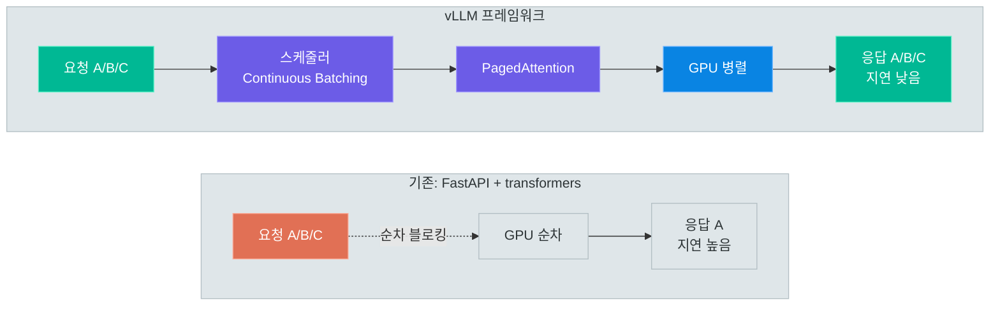
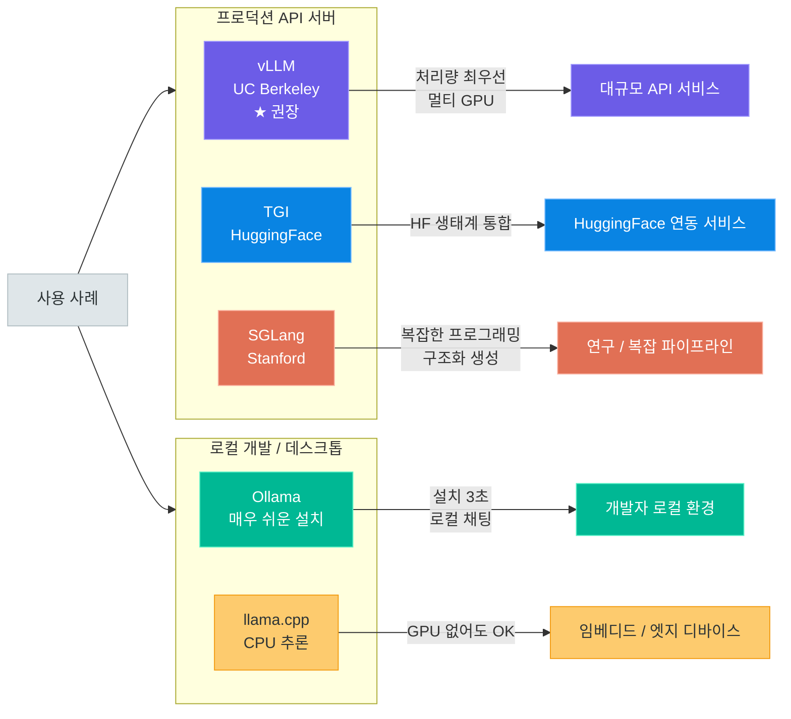
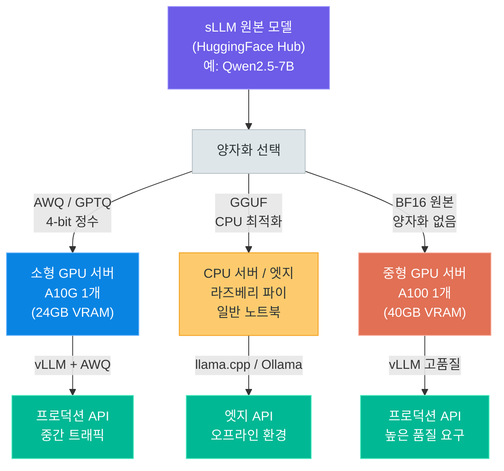

# 추론 프레임워크와 모델 서빙

> vLLM, TGI, SGLang으로 프로덕션 수준의 LLM 추론 서버를 구축하고, sLLM 트렌드를 이해하여 효율적인 AI 서비스를 설계합니다

---

## 1. 왜 추론 프레임워크가 필요한가

### 10강에서 배운 FastAPI 직접 서빙의 한계

10강(HuggingFace 로컬 모델 활용)에서 우리는 `transformers` 라이브러리와 FastAPI를 조합하여 간단한 추론 서버를 만드는 방법을 배웠습니다. 코드는 아래와 같은 패턴이었습니다.

```python
# 10강에서 배운 방식 — 간단하지만 프로덕션에는 부적합
from fastapi import FastAPI
from transformers import pipeline

app = FastAPI()
pipe = pipeline("text-generation", model="Qwen/Qwen2.5-7B-Instruct", device=0)

@app.post("/generate")
def generate(prompt: str):
    result = pipe(prompt, max_new_tokens=256)
    return {"response": result[0]["generated_text"]}
```

이 방식은 개인 실험이나 데모에는 충분하지만, **실제 서비스에 올리는 순간 여러 문제**가 드러납니다.

**동시 요청 처리 불가**

FastAPI는 비동기 웹 프레임워크이지만, `transformers`의 `generate()` 함수는 기본적으로 **동기(synchronous)** 연산입니다. 사용자 A의 요청을 처리하는 동안 GPU는 완전히 점유됩니다. 이때 사용자 B가 요청을 보내면 A의 처리가 끝날 때까지 기다려야 합니다. 동시 사용자가 10명만 돼도 마지막 사용자는 10배 이상의 대기 시간을 겪습니다.

**KV 캐시 메모리 낭비**

LLM 추론에서 **KV 캐시(Key-Value Cache)**는 이전 토큰의 어텐션 키·값 벡터를 저장하여 반복 계산을 피하는 핵심 최적화입니다. 하지만 `transformers`의 기본 구현은 각 요청에 **최대 시퀀스 길이만큼의 메모리를 미리 예약**합니다. 실제로 짧은 답변을 생성해도 긴 메모리 블록을 선점하므로, GPU 메모리의 상당 부분이 낭비됩니다.

**처리량(Throughput)이 절대적으로 낮음**

GPU는 병렬 연산에 특화된 장치입니다. 하지만 순차적으로 한 요청씩 처리하면 GPU의 병렬성을 전혀 활용하지 못합니다. 결과적으로 비싼 GPU를 사용하면서도 CPU 서버 수준의 처리량밖에 달성하지 못합니다.

### 프로덕션 추론의 핵심 과제

LLM 추론 서버가 실제 서비스 수준의 성능을 달성하려면 세 가지 핵심 기술이 필요합니다.

**Continuous Batching (연속 배치)**

전통적인 배치 처리는 같은 크기의 요청을 묶어 함께 처리합니다. 하지만 LLM 요청은 입력 길이도, 생성 토큰 수도 제각각입니다. **Continuous Batching**은 먼저 완료된 요청을 즉시 배치에서 제거하고 대기 중인 새 요청을 끼워 넣는 방식으로, GPU가 항상 최대 활용 상태를 유지하도록 합니다. vLLM이 처음 도입하여 업계 표준이 된 기술입니다.

**KV 캐시 관리**

각 요청에 독립적인 KV 캐시 메모리 공간을 효율적으로 관리해야 합니다. 메모리 파편화 없이 동적으로 할당하고, 요청 완료 후 즉시 반환하며, 여러 요청이 공통 프리픽스(예: 시스템 프롬프트)를 가질 때 캐시를 공유하는 기능이 요구됩니다.

**Tensor Parallelism (텐서 병렬성)**

7B 이상의 대형 모델은 단일 GPU에 올라가지 않는 경우가 많습니다. **텐서 병렬성**은 모델의 가중치 행렬을 여러 GPU에 분산하여 동시에 연산하는 기술입니다. 추론 프레임워크는 이를 자동으로 처리하여 멀티 GPU 확장을 손쉽게 합니다.

### PagedAttention — vLLM의 핵심 혁신

**PagedAttention**은 vLLM이 2023년에 제안한 KV 캐시 관리 방식으로, **운영체제(OS)의 가상 메모리 페이징(paging)** 개념을 LLM 추론에 적용한 것입니다.

기존 방식에서는 각 요청의 KV 캐시를 연속된(contiguous) 메모리 블록에 저장합니다. 이 때문에 다음과 같은 문제가 발생합니다.

- 요청이 실제로 짧게 끝나도 예약된 최대 길이만큼 메모리를 점유
- 서로 다른 요청들이 메모리 공간을 두고 경쟁하면 파편화(fragmentation) 심화
- 메모리 부족으로 동시 처리 가능한 요청 수 제한

PagedAttention은 KV 캐시를 **고정 크기의 블록(block)** 단위로 나누어 비연속적인 메모리 공간에 저장합니다. OS의 페이지 테이블처럼, 논리적 블록 번호를 물리적 메모리 위치로 매핑하는 테이블을 유지합니다. 덕분에 메모리 낭비가 4% 이하로 줄어들고, 동일한 GPU 메모리로 처리할 수 있는 동시 요청 수가 기존 대비 크게(원 논문 기준 최대 약 24배) 증가합니다.

### 처리량 vs 지연시간 트레이드오프

추론 서버 설계에서 가장 중요한 균형점은 다음 두 지표 사이에 있습니다.

| 지표 | 설명 | 최적화 방향 |
|------|------|------------|
| **처리량 (Throughput)** | 단위 시간당 처리 가능한 토큰 또는 요청 수 | 배치 크기 증가, GPU 활용률 극대화 |
| **지연시간 (Latency)** | 요청 시작부터 첫 번째 토큰 수신까지의 시간 (TTFT) | 배치 크기 감소, 우선순위 스케줄링 |

배치를 크게 묶을수록 전체 처리량은 늘어나지만, 대기 시간이 길어져 개별 사용자의 응답 속도가 느려집니다. 채팅 서비스처럼 빠른 응답이 중요한 경우라면 지연시간을, 배치 처리 파이프라인처럼 처리량이 중요한 경우라면 throughput을 우선시합니다.

### FastAPI 직접 서빙 vs vLLM 성능 비교

| 항목 | FastAPI + transformers | vLLM |
|------|----------------------|------|
| **동시 요청 수** | 사실상 1개 (순차 처리) | 수십~수백 개 |
| **처리량 (tokens/sec)** | ~50 tokens/sec | ~2,000+ tokens/sec |
| **GPU 메모리 활용률** | 40~60% (예약 낭비) | 90%+ |
| **KV 캐시 관리** | 없음 (자동 전체 예약) | PagedAttention (페이지 단위) |
| **Continuous Batching** | 없음 | 있음 |
| **구현 복잡도** | 낮음 | 중간 (설치 후 명령어 1줄) |
| **적합한 환경** | 로컬 데모, 프로토타입 | 프로덕션 API 서버 |

### 나이브 서빙 vs 프레임워크 서빙 비교



> **핵심 포인트:** FastAPI + transformers 직접 서빙은 프로토타입 단계에서만 사용하세요. 실제 사용자가 동시 접속하는 서비스라면 반드시 vLLM, TGI 등의 추론 프레임워크를 사용해야 합니다. 성능 차이는 수십 배에 달합니다.

---

## 2. vLLM — 고성능 추론 엔진

### vLLM 개요

**vLLM**은 UC Berkeley의 Sky Computing Lab에서 2023년 개발한 오픈소스 LLM 추론 라이브러리입니다. 현재(2026년 기준) LLM 추론 프레임워크 중 가장 널리 쓰이는 선택지로, 다음과 같은 특징을 갖습니다.

| 항목 | 내용 |
|------|------|
| **개발** | UC Berkeley Sky Computing Lab |
| **라이선스** | Apache 2.0 (상업적 이용 자유) |
| **핵심 기술** | PagedAttention, Continuous Batching |
| **API 호환성** | OpenAI API 완전 호환 |
| **지원 모델** | LLaMA, Qwen, Mistral, Gemma, Phi, 등 100+ |
| **GitHub Stars** | 50,000+ (2026년 기준) |

### 설치

```bash
# vllm_install.sh — vLLM 설치 (CUDA 12.1 환경 기준)
pip install vllm

# 특정 CUDA 버전 지원이 필요한 경우
pip install vllm --extra-index-url https://download.pytorch.org/whl/cu121
```

> **주의:** vLLM은 NVIDIA GPU(CUDA 지원)가 필요합니다. CPU-only 환경에서는 Ollama 또는 llama.cpp를 사용하세요.

### 핵심: OpenAI 호환 API 서버

vLLM의 가장 강력한 장점은 **기존 OpenAI SDK 코드를 그대로 재사용**할 수 있다는 점입니다. `base_url`만 변경하면 로컬 vLLM 서버를 가리키도록 전환됩니다.

```bash
# vllm_serve.sh — 3줄로 프로덕션 수준 서버 시작
pip install vllm

# OpenAI 호환 API 서버 실행 (포트 8000)
vllm serve Qwen/Qwen2.5-7B-Instruct --port 8000

# 기존 OpenAI 코드에서 base_url만 변경하면 끝!
# 모델 다운로드 후 자동으로 서버 시작됨
```

```python
# vllm_openai_client.py — 기존 OpenAI SDK로 vLLM 서버 호출
from openai import OpenAI

# base_url을 vLLM 서버로 변경 (api_key는 임의 값 사용)
client = OpenAI(
    base_url="http://localhost:8000/v1",
    api_key="not-needed",  # vLLM은 인증이 선택사항
)

# 기존 OpenAI 코드와 완전히 동일한 사용법
response = client.chat.completions.create(
    model="Qwen/Qwen2.5-7B-Instruct",  # 서버에 로드된 모델명
    messages=[
        {"role": "system", "content": "당신은 친절한 한국어 AI 어시스턴트입니다."},
        {"role": "user", "content": "파이썬의 GIL이란 무엇인가요?"},
    ],
    temperature=0.7,
    max_completion_tokens=512,
)

print(response.choices[0].message.content)
```

```python
# vllm_streaming.py — 스트리밍 응답 (토큰 단위로 실시간 출력)
from openai import OpenAI

client = OpenAI(base_url="http://localhost:8000/v1", api_key="not-needed")

stream = client.chat.completions.create(
    model="Qwen/Qwen2.5-7B-Instruct",
    messages=[{"role": "user", "content": "머신러닝을 간단히 설명해 주세요."}],
    stream=True,  # 스트리밍 활성화
)

for chunk in stream:
    if chunk.choices[0].delta.content:
        print(chunk.choices[0].delta.content, end="", flush=True)
print()  # 마지막 줄바꿈
```

### vLLM 주요 설정 옵션

`vllm serve` 명령어에서 사용할 수 있는 핵심 옵션들입니다.

| 옵션 | 기본값 | 설명 | 예시 |
|------|--------|------|------|
| `--port` | 8000 | API 서버 포트 | `--port 8080` |
| `--tensor-parallel-size` | 1 | 텐서 병렬성 GPU 수 | `--tensor-parallel-size 4` |
| `--max-model-len` | 모델 기본값 | 최대 컨텍스트 길이 (토큰) | `--max-model-len 8192` |
| `--gpu-memory-utilization` | 0.90 | GPU 메모리 사용 비율 (0~1) | `--gpu-memory-utilization 0.85` |
| `--quantization` | None | 양자화 방식 | `--quantization awq` |
| `--dtype` | auto | 모델 데이터 타입 | `--dtype bfloat16` |
| `--max-num-seqs` | 256 | 동시 처리 최대 시퀀스 수 | `--max-num-seqs 128` |
| `--host` | 0.0.0.0 | 바인딩 호스트 | `--host 127.0.0.1` |
| `--served-model-name` | 모델 경로 | API에서 노출할 모델명 | `--served-model-name my-model` |
| `--enable-lora` | False | LoRA 어댑터 지원 활성화 | `--enable-lora` |

```bash
# vllm_serve_advanced.sh — 실전 서버 실행 예시 (4-GPU, AWQ 양자화)
vllm serve Qwen/Qwen2.5-72B-Instruct-AWQ \
    --port 8000 \
    --tensor-parallel-size 4 \
    --quantization awq \
    --max-model-len 32768 \
    --gpu-memory-utilization 0.92 \
    --max-num-seqs 64 \
    --served-model-name qwen-72b
```

### Offline Batch Inference

API 서버가 아닌 배치 처리 파이프라인에서는 `LLM` 클래스를 직접 사용합니다.

```python
# vllm_batch.py — 오프라인 배치 추론 예시
from vllm import LLM, SamplingParams

# 모델 로드 (처음 실행 시 다운로드)
llm = LLM(
    model="Qwen/Qwen2.5-7B-Instruct",
    tensor_parallel_size=1,        # 사용할 GPU 수
    gpu_memory_utilization=0.90,   # GPU 메모리 활용률
    max_model_len=4096,
)

# 샘플링 파라미터 설정
sampling_params = SamplingParams(
    temperature=0.8,
    top_p=0.95,
    max_tokens=256,
)

# 여러 프롬프트를 한 번에 배치 처리
prompts = [
    "파이썬이란 무엇인가요?",
    "머신러닝과 딥러닝의 차이를 설명해 주세요.",
    "RAG(검색 증강 생성)의 작동 원리는?",
    "트랜스포머 아키텍처의 핵심 아이디어는 무엇인가요?",
]

# 모든 프롬프트를 병렬로 처리
outputs = llm.generate(prompts, sampling_params)

for output in outputs:
    prompt = output.prompt
    generated_text = output.outputs[0].text
    print(f"프롬프트: {prompt[:30]}...")
    print(f"생성 결과: {generated_text[:100]}...")
    print("-" * 50)
```

### vLLM 고급 기능

**구조화된 출력 (Structured Output / JSON Mode)**

```python
# vllm_structured.py — JSON 모드로 구조화된 출력 생성
from openai import OpenAI
from pydantic import BaseModel

client = OpenAI(base_url="http://localhost:8000/v1", api_key="not-needed")

class ProductReview(BaseModel):
    rating: int          # 1~5점
    sentiment: str       # positive / negative / neutral
    summary: str         # 요약 한 문장
    keywords: list[str]  # 핵심 키워드 최대 5개

response = client.chat.completions.parse(
    model="Qwen/Qwen2.5-7B-Instruct",
    messages=[
        {"role": "user", "content": "이 제품 리뷰를 분석해 주세요: '배터리가 오래가고 화면이 선명합니다. 가격 대비 매우 만족!'"},
    ],
    response_format=ProductReview,
)

review = response.choices[0].message.parsed
print(f"평점: {review.rating}/5")
print(f"감성: {review.sentiment}")
print(f"요약: {review.summary}")
print(f"키워드: {', '.join(review.keywords)}")
```

**LoRA 어댑터 핫스왑**

```bash
# LoRA 어댑터를 지원하는 vLLM 서버 실행
vllm serve Qwen/Qwen2.5-7B-Instruct \
    --enable-lora \
    --lora-modules sql-lora=./lora-adapters/sql-adapter \
                   ko-lora=./lora-adapters/korean-adapter
```

```python
# vllm_lora.py — LoRA 어댑터를 동적으로 전환하여 사용
from openai import OpenAI

client = OpenAI(base_url="http://localhost:8000/v1", api_key="not-needed")

# SQL 특화 LoRA 어댑터 사용
sql_response = client.chat.completions.create(
    model="sql-lora",   # LoRA 어댑터 이름으로 모델 지정
    messages=[{"role": "user", "content": "사용자별 월 매출 TOP 5를 조회하는 SQL 작성해줘"}],
)

# 한국어 특화 LoRA 어댑터 사용 (모델 재로드 없이 전환)
ko_response = client.chat.completions.create(
    model="ko-lora",   # 다른 어댑터로 즉시 전환
    messages=[{"role": "user", "content": "한국 전통 문화를 소개해주세요."}],
)
```

**Speculative Decoding**

```bash
# vllm_speculative.sh — 소형 초안 모델로 디코딩 가속
vllm serve Qwen/Qwen2.5-7B-Instruct \
    --speculative-config '{"model": "Qwen/Qwen2.5-0.5B-Instruct", "num_speculative_tokens": 5}'
# 초안 모델(0.5B)이 5개 토큰을 미리 생성하고,
# 메인 모델(7B)이 한 번에 검증하여 2~3배 속도 향상
```

### vLLM 아키텍처


> **핵심 포인트:** vLLM의 스케줄러는 단순한 FIFO 큐가 아닙니다. 요청의 우선순위, 현재 배치 상태, KV 캐시 가용량을 종합적으로 고려하여 어떤 요청을 다음에 처리할지 결정합니다. 이 스케줄러가 Continuous Batching의 핵심입니다.

---

## 3. 추론 프레임워크 비교

### 주요 프레임워크 한눈에 보기



### 프레임워크 상세 비교표

| 항목 | vLLM | TGI | SGLang | Ollama | llama.cpp |
|------|------|-----|--------|--------|-----------|
| **개발사** | UC Berkeley | HuggingFace | Stanford | Ollama Inc | Community |
| **라이선스** | Apache 2.0 | Apache 2.0 | Apache 2.0 | MIT | MIT |
| **핵심 특징** | PagedAttention, Continuous Batching | Flash Attention, Safetensors | RadixAttention, 구조화 생성 | GGUF 내장, 원클릭 | CPU 추론, GGUF |
| **GPU 요구** | CUDA 필수 | CUDA 필수 | CUDA 필수 | 선택 (CPU 가능) | 불필요 |
| **설치 난이도** | 중 (pip) | 중 (Docker) | 중 (pip) | 매우 쉬움 | 중 (빌드) |
| **API 형식** | OpenAI 호환 | OpenAI 호환 | OpenAI 호환 | REST + OpenAI | REST |
| **모델 형식** | HF SafeTensors | HF SafeTensors | HF SafeTensors | GGUF | GGUF |
| **멀티 GPU** | 네이티브 지원 | 지원 | 지원 | 제한적 | 미지원 |
| **LoRA 지원** | 핫스왑 가능 | 지원 | 지원 | 미지원 | 미지원 |
| **처리량** | 매우 높음 | 높음 | 높음 | 보통 | 낮음 |
| **적합한 사용** | 프로덕션 API | HF 통합 서비스 | 연구, 복잡 생성 | 로컬 개발 | 엣지 디바이스 |

### TGI (Text Generation Inference)

**TGI**는 HuggingFace가 개발한 LLM 추론 서버로, HuggingFace 생태계와의 완벽한 통합이 강점입니다.

```bash
# tgi_docker.sh — Docker로 TGI 서버 실행
docker run --gpus all \
    --shm-size 1g \
    -p 8080:80 \
    -v $HOME/.cache/huggingface:/data \
    ghcr.io/huggingface/text-generation-inference:latest \
    --model-id Qwen/Qwen2.5-7B-Instruct \
    --max-input-length 4096 \
    --max-total-tokens 8192
```

TGI의 차별점은 **Flash Attention 2** 기본 지원, **Safetensors** 포맷 우선 로딩, **HuggingFace Hub 토큰 인증** 통합입니다. HuggingFace Inference Endpoints 서비스의 백엔드로도 사용됩니다.

### SGLang

**SGLang(Structured Generation Language)**은 Stanford 대학에서 개발한 프레임워크로, **복잡한 생성 파이프라인**에 특화되어 있습니다.

핵심 기술인 **RadixAttention**은 KV 캐시를 래딕스 트리(Radix Tree) 구조로 관리하여, 공통 프리픽스를 공유하는 여러 요청이 캐시를 효율적으로 재사용합니다. 멀티턴 대화나 동일한 시스템 프롬프트를 사용하는 요청이 많을 때 vLLM보다 높은 처리량을 보이는 경우도 있습니다.

```bash
# sglang_serve.sh — SGLang 서버 실행
pip install "sglang[all]"
python -m sglang.launch_server \
    --model-path Qwen/Qwen2.5-7B-Instruct \
    --port 8000
```

### Ollama — 로컬 개발자용

**Ollama**는 설치와 사용이 가장 간단한 로컬 LLM 실행 도구입니다. 개발자의 노트북에서 빠르게 모델을 테스트하거나, 팀 내 프라이빗 LLM 환경을 구성할 때 최적입니다.

```bash
# ollama_quickstart.sh — Ollama 3줄 시작
curl -fsSL https://ollama.com/install.sh | sh
ollama pull qwen2.5:7b          # 모델 다운로드
ollama run qwen2.5:7b           # 대화형 실행

# API로도 사용 가능 (OpenAI 호환)
ollama serve                    # 백그라운드 서버 실행
```

### llama.cpp — CPU 추론과 엣지 디바이스

**llama.cpp**는 C++로 구현된 초경량 LLM 추론 엔진입니다. GPU 없이도 CPU만으로 모델을 실행할 수 있으며, GGUF(GPT-Generated Unified Format) 양자화 포맷을 표준화한 프로젝트입니다.

라즈베리 파이, 임베디드 리눅스, 구형 노트북 등 GPU가 없는 환경에서 sLLM을 실행할 때 유일한 실용적 선택지입니다.

### 프레임워크 선택 가이드

| 시나리오 | 추천 프레임워크 | 이유 |
|---------|--------------|------|
| 프로덕션 API 서버 (고트래픽) | **vLLM** | 최고 처리량, OpenAI 호환, 멀티 GPU |
| 로컬 개발 / 프로토타이핑 | **Ollama** | 설치 1분, 모델 관리 편리 |
| 연구 / 복잡한 생성 파이프라인 | **SGLang** | RadixAttention, 구조화 생성 최적화 |
| HuggingFace 생태계 통합 | **TGI** | HF Hub 인증, Inference Endpoints |
| GPU 없는 서버 / 엣지 | **llama.cpp** | CPU 추론, 초경량 GGUF |
| 온프레미스 프로덕션 | **vLLM** 또는 **TGI** | 안정성, 커뮤니티 지원 |

> **핵심 포인트:** 처음에는 Ollama로 로컬 테스트를 하고, 프로덕션 배포 시 vLLM으로 전환하는 전략이 가장 효율적입니다. 두 프레임워크 모두 OpenAI API 형식을 지원하므로 코드 변경이 거의 없습니다.

---

## 4. sLLM (Small Language Model) 트렌드

### sLLM이란

**sLLM(Small Language Model)**은 일반적으로 **1B~7B 파라미터** 규모의 소형 언어 모델을 가리킵니다. GPT-4.1, Claude Opus 4.x 같은 초대형 모델과 대비되는 개념입니다.

2024년 이후, sLLM 분야에서 놀라운 발전이 일어났습니다. Microsoft Phi-3, Google Gemma 2, Alibaba Qwen2.5 등이 7B 이하의 파라미터로 이전 세대 70B 모델에 버금가는 성능을 보여주고 있습니다. 이 현상의 배경에는 **데이터 품질 향상**, **지식 증류(Knowledge Distillation)**, **합성 데이터(Synthetic Data)** 학습 기법의 발전이 있습니다.

### 주요 sLLM 비교

| 모델 | 개발사 | 파라미터 | MMLU | 라이선스 | 한국어 지원 | 특징 |
|------|--------|---------|------|---------|-----------|------|
| **Phi-3.5-mini** | Microsoft | 3.8B | 69.0 | MIT | 보통 | 소형 최강, 코드 특화 |
| **Phi-3-medium** | Microsoft | 14B | 78.0 | MIT | 보통 | 추론 능력 우수 |
| **Gemma 2 2B** | Google | 2B | 52.2 | Gemma ToS | 낮음 | 초경량, 효율적 |
| **Gemma 2 9B** | Google | 9B | 71.3 | Gemma ToS | 낮음 | 9B 최상위 성능 |
| **Qwen2.5-3B** | Alibaba | 3B | 65.6 | Apache 2.0 | 좋음 | 다국어, 한국어 강함 |
| **Qwen2.5-7B** | Alibaba | 7B | 74.2 | Apache 2.0 | 좋음 | 상업적 무료, 균형 |
| **Qwen2.5-14B** | Alibaba | 14B | 79.7 | Apache 2.0 | 좋음 | 중형 최강 |
| **Mistral 7B v0.3** | Mistral AI | 7B | 64.2 | Apache 2.0 | 낮음 | 유럽산, 빠른 추론 |
| **LLaMA 3.2 1B** | Meta | 1B | 32.2 | Llama 3.2 | 낮음 | 초소형, 엣지용 |
| **LLaMA 3.2 3B** | Meta | 3B | 63.4 | Llama 3.2 | 낮음 | 소형 멀티모달 |

> **한국어 서비스라면 Qwen2.5 시리즈를 우선 고려하세요.** Alibaba의 Qwen2.5는 한국어 훈련 데이터가 상대적으로 풍부하며, 한국어 벤치마크에서 같은 크기의 다른 모델보다 일관되게 높은 성능을 보입니다.

### sLLM이 적합한 경우

| 상황 | 설명 | 추천 모델 |
|------|------|---------|
| **비용 제약** | 대형 모델 API 비용이 부담 | Qwen2.5-7B, Mistral 7B |
| **개인정보 보호** | 데이터를 외부 서버에 보낼 수 없음 | Qwen2.5-7B, Phi-3.5 |
| **낮은 지연시간** | 실시간 응답이 필수 (게임, 음성) | LLaMA 3.2 1B/3B |
| **엣지 디바이스** | 스마트폰, IoT, 라즈베리 파이 | Gemma 2 2B, LLaMA 3.2 1B |
| **파인튜닝** | 도메인 특화 학습 (11강 LoRA와 연결) | Qwen2.5-7B, Phi-3.5 |
| **고정 태스크** | 분류, 추출, 요약 등 단일 기능 | 어떤 sLLM이든 파인튜닝 후 사용 |

### sLLM이 부적합한 경우

| 상황 | 이유 | 대안 |
|------|------|------|
| **복잡한 다단계 추론** | 수학 증명, 복잡한 코딩 등에서 성능 격차 큼 | GPT-4.1, Claude Sonnet 4.5 |
| **매우 긴 문맥** | 32K+ 토큰 처리 시 성능 저하 | Claude Haiku 4.5 (200K), Gemini 2.5 Pro |
| **다국어 고품질** | 드문 언어에서 할루시네이션 증가 | GPT-4.1, Qwen-72B |
| **범용 지식 깊이** | 전문 분야 질문에 부정확한 답변 | 대형 모델 + RAG (06강 참고) |

### 양자화와 sLLM

**양자화(Quantization)**는 모델 가중치의 데이터 타입을 낮추어 메모리를 줄이고 추론 속도를 높이는 기술입니다. sLLM과 결합하면 GPU 없는 환경에서도 실용적인 추론이 가능합니다.

| 방식 | 형식 | 지원 프레임워크 | 정밀도 손실 | 메모리 절감 | 특징 |
|------|------|--------------|-----------|-----------|------|
| **FP16/BF16** | 16-bit float | 모든 프레임워크 | 없음 | 50% (vs FP32) | 기본 추론 타입 |
| **GPTQ** | 4/8-bit int | vLLM, TGI | 매우 적음 | 75% (4-bit) | 학습 후 양자화, 높은 품질 |
| **AWQ** | 4-bit int | vLLM, TGI | 매우 적음 | 75% (4-bit) | 가중치 중요도 기반, GPTQ보다 빠름 |
| **GGUF** | 2~8-bit | llama.cpp, Ollama | 비트수에 따라 | 60~85% | CPU 추론 최적화, 범용성 |
| **BitsAndBytes** | 4/8-bit | transformers | 적음 | 50~75% | QLoRA 학습에 사용, 동적 양자화 |

```bash
# quantization_comparison.sh — 양자화별 vLLM 서버 실행 예시

# AWQ 양자화 모델 (HuggingFace에서 직접 로드)
vllm serve Qwen/Qwen2.5-7B-Instruct-AWQ \
    --quantization awq \
    --dtype float16

# GPTQ 양자화 모델
vllm serve Qwen/Qwen2.5-7B-Instruct-GPTQ-Int4 \
    --quantization gptq \
    --dtype float16

# 원본 모델을 BitsAndBytes로 실시간 양자화 (품질 우선)
vllm serve Qwen/Qwen2.5-7B-Instruct \
    --quantization bitsandbytes \
    --load-format bitsandbytes \
    --dtype float16
```

### sLLM 배포 아키텍처



> **핵심 포인트:** AWQ 4-bit 양자화된 7B 모델은 24GB VRAM GPU 한 장에서 실행 가능하며, 성능 손실은 1~2% 수준입니다. A10G(AWS), RTX 3090/4090 정도면 충분히 프로덕션 서빙이 가능합니다.

---

## 5. 실전 배포 패턴

### 패턴 1: vLLM + Docker + ECS (07 모듈 연계)

07 모듈에서 학습한 Docker 및 AWS ECS 배포 방식을 vLLM에 적용합니다.

```dockerfile
# Dockerfile.vllm — vLLM 공식 이미지 기반 컨테이너
FROM vllm/vllm-openai:latest

# 환경 변수 설정
ENV MODEL_NAME="Qwen/Qwen2.5-7B-Instruct"
ENV MAX_MODEL_LEN=8192
ENV GPU_MEMORY_UTILIZATION=0.90
ENV TENSOR_PARALLEL_SIZE=1

# HuggingFace 캐시 디렉토리 설정
ENV HF_HOME=/model-cache
VOLUME ["/model-cache"]

# 포트 노출
EXPOSE 8000

# 서버 시작 명령
CMD vllm serve ${MODEL_NAME} \
    --port 8000 \
    --host 0.0.0.0 \
    --max-model-len ${MAX_MODEL_LEN} \
    --gpu-memory-utilization ${GPU_MEMORY_UTILIZATION} \
    --tensor-parallel-size ${TENSOR_PARALLEL_SIZE}
```

```yaml
# docker-compose.vllm.yml — vLLM + Nginx 로드밸런서 구성
version: "3.9"

services:
  vllm-server-1:
    image: vllm/vllm-openai:latest
    command: >
      vllm serve Qwen/Qwen2.5-7B-Instruct
      --port 8000
      --gpu-memory-utilization 0.90
    volumes:
      - hf-cache:/root/.cache/huggingface
    deploy:
      resources:
        reservations:
          devices:
            - driver: nvidia
              device_ids: ["0"]  # GPU 0 할당
              capabilities: [gpu]
    ports:
      - "8001:8000"

  vllm-server-2:
    image: vllm/vllm-openai:latest
    command: >
      vllm serve Qwen/Qwen2.5-7B-Instruct
      --port 8000
      --gpu-memory-utilization 0.90
    volumes:
      - hf-cache:/root/.cache/huggingface
    deploy:
      resources:
        reservations:
          devices:
            - driver: nvidia
              device_ids: ["1"]  # GPU 1 할당
              capabilities: [gpu]
    ports:
      - "8002:8000"

  nginx:
    image: nginx:alpine
    ports:
      - "8000:80"
    volumes:
      - ./nginx.conf:/etc/nginx/nginx.conf:ro
    depends_on:
      - vllm-server-1
      - vllm-server-2

volumes:
  hf-cache:
```

```nginx
# nginx.conf — 2개 vLLM 인스턴스 간 라운드로빈 로드밸런싱
upstream vllm_backend {
    least_conn;                    # 연결 수 기반 로드밸런싱
    server vllm-server-1:8000;
    server vllm-server-2:8000;
}

server {
    listen 80;
    location / {
        proxy_pass http://vllm_backend;
        proxy_read_timeout 300s;   # 긴 생성 시간 허용
        proxy_buffering off;       # 스트리밍 응답을 위해 버퍼링 비활성화
    }
}
```

### 패턴 2: Ollama + FastAPI 래퍼 (개발/프로토타이핑용)

```python
# ollama_wrapper.py — Ollama를 감싸는 FastAPI 서버
from fastapi import FastAPI, HTTPException
from pydantic import BaseModel
from openai import OpenAI
import uvicorn

app = FastAPI(title="LLM API Gateway")

# Ollama 로컬 서버 연결 (ollama serve 실행 필요)
client = OpenAI(
    base_url="http://localhost:11434/v1",
    api_key="ollama",  # Ollama는 api_key를 무시함
)

class ChatRequest(BaseModel):
    message: str
    model: str = "qwen2.5:7b"
    temperature: float = 0.7

class ChatResponse(BaseModel):
    response: str
    model: str
    tokens_used: int

@app.post("/chat", response_model=ChatResponse)
async def chat(request: ChatRequest):
    try:
        completion = client.chat.completions.create(
            model=request.model,
            messages=[
                {"role": "system", "content": "당신은 유용한 AI 어시스턴트입니다."},
                {"role": "user", "content": request.message},
            ],
            temperature=request.temperature,
        )
        return ChatResponse(
            response=completion.choices[0].message.content,
            model=completion.model,
            tokens_used=completion.usage.total_tokens,
        )
    except Exception as e:
        raise HTTPException(status_code=500, detail=str(e))

@app.get("/models")
async def list_models():
    """사용 가능한 Ollama 모델 목록 반환"""
    models = client.models.list()
    return {"models": [m.id for m in models.data]}

if __name__ == "__main__":
    uvicorn.run(app, host="0.0.0.0", port=9000)
```

### 패턴 3: API 게이트웨이 + 모델 라우팅

요청의 복잡도에 따라 소형 모델과 대형 모델을 자동으로 분기하는 패턴입니다. 비용을 크게 절감하면서 품질을 유지하는 실용적인 전략입니다.

```python
# model_router.py — 요청 복잡도에 따른 모델 자동 라우팅
from fastapi import FastAPI
from pydantic import BaseModel
from openai import OpenAI
import re

app = FastAPI(title="Model Router")

# sLLM (vLLM 로컬 서버 — 빠르고 저렴)
small_client = OpenAI(
    base_url="http://localhost:8001/v1",
    api_key="not-needed",
)

# 대형 모델 (클라우드 API — 정확하지만 비쌈)
large_client = OpenAI(api_key="your-openai-api-key")

class RoutedRequest(BaseModel):
    message: str
    force_model: str | None = None  # "small" | "large" | None (자동)

def estimate_complexity(message: str) -> str:
    """메시지 복잡도를 추정하여 라우팅 결정"""
    msg_lower = message.lower()

    # 복잡한 요청 시그널
    complex_signals = [
        len(message) > 500,                              # 매우 긴 질문
        bool(re.search(r"증명|수학|미적분|방정식", msg_lower)),  # 수학
        bool(re.search(r"비교.*분석|장단점.*고려", msg_lower)),   # 심층 분석
        message.count("?") > 3,                          # 복합 질문
        bool(re.search(r"코드.*작성.*테스트", msg_lower)),         # 복잡 코딩
    ]

    complex_count = sum(complex_signals)
    return "large" if complex_count >= 2 else "small"

@app.post("/chat")
async def routed_chat(request: RoutedRequest):
    # 라우팅 결정
    target = request.force_model or estimate_complexity(request.message)

    if target == "small":
        client = small_client
        model = "Qwen/Qwen2.5-7B-Instruct"
    else:
        client = large_client
        model = "gpt-4o-mini"

    response = client.chat.completions.create(
        model=model,
        messages=[{"role": "user", "content": request.message}],
    )

    return {
        "response": response.choices[0].message.content,
        "routed_to": target,
        "model_used": model,
        "cost_tier": "low" if target == "small" else "high",
    }
```

### 비용 최적화: GPU 인스턴스 선택 가이드

| 모델 크기 | 양자화 | 권장 GPU | AWS 인스턴스 | 시간당 비용 (참고) |
|---------|--------|---------|-------------|---------------|
| 1B~3B (fp16) | 불필요 | RTX 3080 / T4 | g4dn.xlarge | $0.5~1 |
| 7B (fp16) | 권장 안함 | A10G 24GB | g5.xlarge | $1.0~1.5 |
| 7B (AWQ 4-bit) | AWQ | T4 16GB | g4dn.xlarge | $0.5~1 |
| 13B (AWQ 4-bit) | AWQ | A10G 24GB | g5.xlarge | $1.0~1.5 |
| 70B (AWQ 4-bit) | AWQ | A100 80GB × 1 | p4d.xlarge | $10~15 |
| 70B (fp16) | 없음 | A100 80GB × 2 | p4d.24xlarge | $30~40 |

> **비용 최적화 팁:** 스팟 인스턴스(Spot Instance)를 활용하면 온디맨드 대비 60~70% 비용 절감이 가능합니다. vLLM은 프로세스가 예상치 못하게 종료되어도 요청 큐가 유지되므로 스팟 인스턴스와 궁합이 좋습니다.

---

## 6. 핵심 정리

### 프레임워크 선택 의사결정 가이드

| 질문 | Yes → | No → |
|------|-------|-------|
| GPU가 없는 환경인가? | llama.cpp | 다음 질문으로 |
| 로컬 개발/테스트 목적인가? | Ollama | 다음 질문으로 |
| HuggingFace Inference Endpoints 사용? | TGI | 다음 질문으로 |
| 복잡한 구조화 생성이 핵심인가? | SGLang | 다음 질문으로 |
| 프로덕션 API, 최고 처리량 필요? | **vLLM** | vLLM (기본 선택) |

### 주요 개념 요약

| 개념 | 설명 | 관련 프레임워크 |
|------|------|--------------|
| **PagedAttention** | KV 캐시를 페이지 단위로 관리, 메모리 낭비 최소화 | vLLM |
| **Continuous Batching** | 완료된 요청을 즉시 빼고 새 요청을 끼워 GPU 항상 가동 | vLLM, TGI, SGLang |
| **Tensor Parallelism** | 모델 가중치를 여러 GPU에 분산하여 대형 모델 실행 | vLLM, TGI |
| **RadixAttention** | KV 캐시를 래딕스 트리로 관리, 공통 프리픽스 공유 | SGLang |
| **Flash Attention** | 메모리 효율적 어텐션 커널, 처리 속도 향상 | TGI, vLLM |
| **GGUF** | CPU 추론을 위한 양자화 파일 포맷 | llama.cpp, Ollama |
| **AWQ** | 가중치 중요도 기반 4-bit 양자화, 빠른 추론 | vLLM, TGI |
| **GPTQ** | 학습 후 양자화, 높은 품질 보존 | vLLM, TGI |
| **sLLM** | 1B~7B 소형 모델, 특정 태스크에 충분한 성능 | 모든 프레임워크 |
| **Speculative Decoding** | 소형 모델로 미리 생성, 대형 모델이 검증하여 가속 | vLLM |

### 이 강의에서 다룬 주요 라이브러리

> 아래 버전은 예제 작성 시점(2026년 기준)의 권장 최소 버전입니다. 최신 버전은 pypi.org에서 확인하세요.

| 라이브러리 | 버전 | 역할 | 설치 |
|-----------|------|------|------|
| `vllm` | 0.8+ | 고성능 LLM 추론 엔진 | `pip install vllm` |
| `openai` | 1.50+ | API 클라이언트 (vLLM 호출) | `pip install openai` |
| `text-generation-inference` | 3.0+ | HuggingFace TGI 서버 | Docker 이미지 |
| `ollama` | 최신 | 로컬 모델 관리 및 실행 | `curl -fsSL https://ollama.com/install.sh \| sh` |
| `fastapi` | 0.115+ | API 게이트웨이 / 래퍼 서버 | `pip install fastapi uvicorn` |

### 강의 전체 흐름과의 연계

이 강의는 **05 모듈 고급 GenAI**의 마지막 강의로, 이전 강의들과 다음과 같이 연결됩니다.

- **10강 (HuggingFace 로컬 모델)** → FastAPI + transformers 직접 서빙의 한계를 확인하고 이 강의로 진화
- **11강 (파인튜닝 LoRA)** → 파인튜닝한 LoRA 어댑터를 vLLM에서 핫스왑하여 서빙
- **12강 (평가와 안전성)** → 추론 서버의 출력을 평가 파이프라인에 연결
- **07 모듈 (Docker/ECS 배포)** → 패턴 1에서 배운 vLLM Docker 컨테이너를 ECS에 배포

### 다음 단계

**06 모듈: 실전 AI 서비스 설계**에서는 이번 강의에서 배운 추론 프레임워크를 실제 서비스 아키텍처에 통합합니다. 구체적으로는 다음을 다룹니다.

- **MLOps 파이프라인:** 모델 학습 → 평가 → 배포 자동화
- **모니터링:** 추론 서버의 지연시간, 처리량, 오류율 관측 (Prometheus + Grafana)
- **A/B 테스트:** 두 모델 버전 간 트래픽 분배 및 성능 비교
- **비용 최적화:** 트래픽 패턴에 따른 자동 스케일링과 스팟 인스턴스 활용
- **실전 서비스 예제:** 고객 지원 봇, 문서 분석 서비스를 end-to-end로 구현

> 이 강의에서 vLLM과 sLLM의 기초를 잘 익혀두면, 06 모듈의 실전 서비스 설계가 훨씬 수월해집니다. 특히 **모델 라우팅 패턴**(패턴 3)은 실제 프로덕션 서비스에서 비용을 50% 이상 절감하는 핵심 전략입니다.

---
