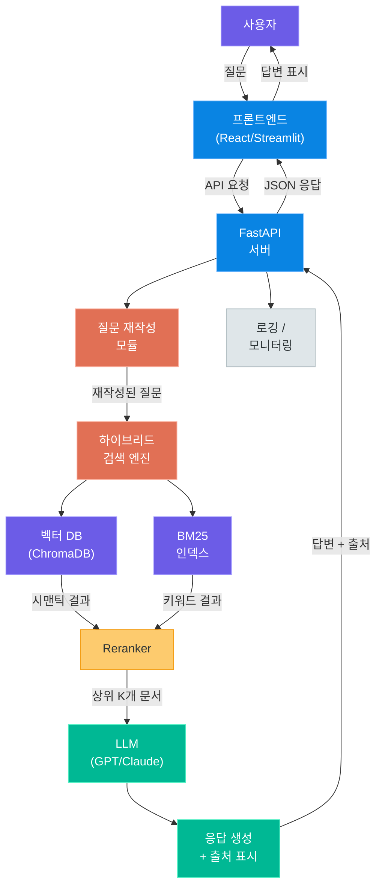
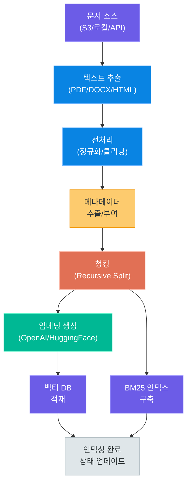
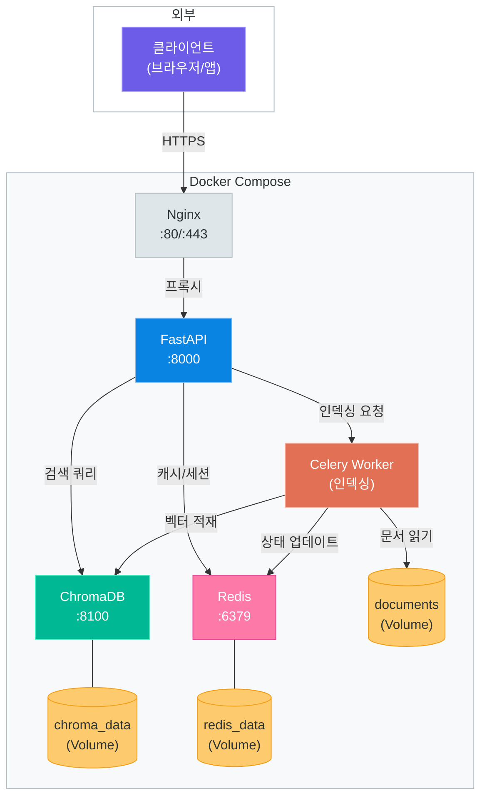
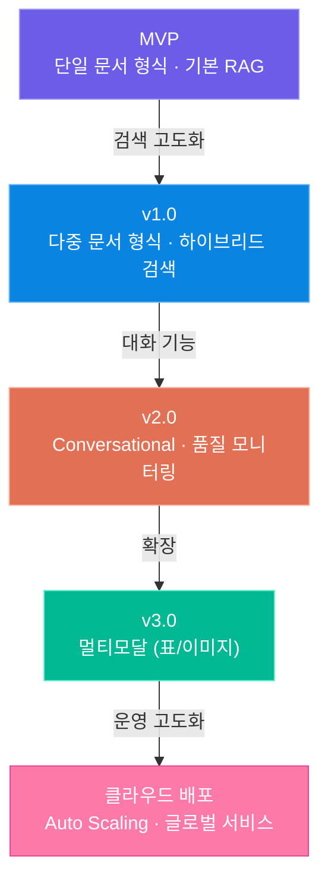

# RAG 기반 문서 Q&A 챗봇 설계

> 사내 문서, 기술 매뉴얼, 고객 FAQ를 자연어로 질문하면 정확한 답변과 출처를 제공하는 Conversational RAG 챗봇 — 인덱싱부터 하이브리드 검색, 품질 모니터링, 운영 배포까지 설계 전반을 다룹니다

---

## 1. 서비스 개요

### RAG 기반 문서 Q&A 챗봇이란

RAG(Retrieval-Augmented Generation) 기반 문서 Q&A 챗봇은 **사전에 구축된 문서 데이터베이스**에서 관련 정보를 검색한 뒤, LLM이 해당 정보를 바탕으로 답변을 생성하는 시스템입니다. 순수 LLM만 사용하는 것과 달리, 조직 내부의 최신 문서를 기반으로 답변하기 때문에 할루시네이션을 크게 줄일 수 있습니다.

이 서비스는 05 모듈에서 학습한 LLM API 호출, 임베딩, 벡터 데이터베이스, RAG 체인 구성 등의 기술을 **실제 서비스 아키텍처**로 확장하는 과정입니다. 개별 기술 요소를 알고 있는 것과, 이를 하나의 안정적인 서비스로 엮어내는 것은 완전히 다른 문제입니다.

### 핵심 사용 사례

| 사용 사례 | 설명 | 주요 사용자 |
|---|---|---|
| 사내 문서 검색 | 사내 위키, 규정집, 매뉴얼에서 답변 생성 | 전 직원 |
| 기술 문서 QA | API 문서, 아키텍처 가이드 기반 기술 질의 | 개발자 |
| 고객 지원 | FAQ, 제품 매뉴얼 기반 고객 문의 자동 응답 | CS 담당자 / 고객 |
| 법률·규정 검색 | 법률 문서, 사내 규정에서 관련 조항 탐색 | 법무팀 / 컴플라이언스 |
| 연구 보조 | 논문, 보고서에서 특정 정보 추출 및 요약 | 연구원 |

> **핵심 포인트:** RAG 챗봇의 가치는 "LLM이 모르는 정보"를 답변할 수 있다는 것입니다. 조직 고유의 지식, 최신 업데이트, 비공개 문서 등 LLM 학습 데이터에 포함되지 않은 정보를 실시간으로 활용합니다.

### 05 모듈 기술의 실전 적용

05 모듈에서 배운 개별 기술들이 이 서비스에서 어떻게 조합되는지 정리합니다.

| 05 모듈 기술 | 본 서비스에서의 역할 |
|---|---|
| LLM API (OpenAI/Claude/Gemini) | 답변 생성, 질문 재작성 |
| 텍스트 임베딩 | 문서 청크의 벡터 변환 |
| 벡터 데이터베이스 | 유사 문서 검색 저장소 |
| RAG 체인 | 검색 + 생성 파이프라인 |
| 프롬프트 엔지니어링 | 시스템 프롬프트, 답변 포맷 제어 |

### 서비스 전체 아키텍처

아래 다이어그램은 사용자의 질문이 들어와서 답변이 반환되기까지의 전체 흐름을 보여줍니다.



전체 시스템은 크게 **질문 처리**, **검색**, **생성**, **모니터링** 네 개의 레이어로 구성됩니다. 각 레이어의 설계와 고려사항을 이어지는 섹션에서 상세히 다루겠습니다.

---

## 2. 문서 인덱싱 파이프라인

### 인덱싱 파이프라인의 역할

RAG 시스템에서 가장 중요한 단계는 **검색 이전**에 있습니다. 아무리 좋은 검색 알고리즘과 LLM을 사용해도, 원본 문서가 제대로 전처리되고 인덱싱되지 않으면 정확한 답변을 기대할 수 없습니다.

인덱싱 파이프라인은 원본 문서를 수집하는 것에서 시작하여, 텍스트 추출, 전처리, 청킹, 임베딩 생성, 벡터 저장소 적재까지의 전 과정을 자동화합니다.

### 파이프라인 흐름



### 문서 수집과 텍스트 추출

지원할 문서 형식별로 적절한 파서를 선택해야 합니다.

| 문서 형식 | 파서 라이브러리 | 특이사항 |
|---|---|---|
| PDF | `PyMuPDF`, `pdfplumber` | 표/이미지 포함 시 레이아웃 파싱 필요 |
| DOCX | `python-docx` | 스타일, 표 구조 보존 가능 |
| HTML | `BeautifulSoup` | 태그 제거 + 구조 유지 균형 필요 |
| Markdown | `markdown-it-py` | 코드 블록 별도 처리 |
| TXT | 내장 `open()` | 인코딩 감지 필수 (chardet) |
| CSV/Excel | `pandas` | 행 단위 또는 시트 단위 청킹 |

> **핵심 포인트:** PDF 파싱은 문서 인덱싱에서 가장 까다로운 부분입니다. 스캔된 PDF는 OCR(Tesseract, EasyOCR)이 필요하고, 표가 포함된 PDF는 `pdfplumber`의 테이블 추출 기능을 활용해야 합니다.

### 전처리 단계

텍스트 추출 후에는 노이즈를 제거하고 정규화하는 전처리가 필요합니다.

```python
# preprocessing.py -- 문서 전처리 핵심 로직
import re
import unicodedata

def clean_text(text: str) -> str:
    """추출된 텍스트 정규화"""
    # 유니코드 정규화 (NFC)
    text = unicodedata.normalize("NFC", text)
    # 연속 공백/줄바꿈 정리
    text = re.sub(r"\n{3,}", "\n\n", text)
    text = re.sub(r" {2,}", " ", text)
    # 헤더/푸터 패턴 제거
    text = re.sub(r"페이지 \d+ / \d+", "", text)
    text = re.sub(r"- \d+ -", "", text)
    return text.strip()

def extract_sections(text: str) -> list[dict]:
    """헤딩 기반 섹션 분할"""
    sections = []
    current = {"title": "서문", "content": ""}
    for line in text.split("\n"):
        if re.match(r"^#{1,3}\s", line) or re.match(r"^\d+\.\s", line):
            if current["content"].strip():
                sections.append(current)
            current = {"title": line.strip(), "content": ""}
        else:
            current["content"] += line + "\n"
    if current["content"].strip():
        sections.append(current)
    return sections
```

### 청킹 전략

청킹은 RAG 성능에 직접적인 영향을 미칩니다. 너무 작은 청크는 문맥을 잃고, 너무 큰 청크는 검색 정밀도를 떨어뜨립니다.

| 청킹 방식 | 설명 | 적합한 상황 |
|---|---|---|
| 고정 크기 (Fixed) | 일정 토큰/문자 수로 분할 | 구조가 없는 평문 |
| 재귀적 분할 (Recursive) | 단락 → 문장 → 단어 순으로 시도 | 일반적인 문서 (권장) |
| 시맨틱 분할 (Semantic) | 의미 변화 지점에서 분할 | 긴 기술 문서 |
| 구조 기반 (Structure) | 헤딩, 섹션 단위로 분할 | 잘 구조화된 문서 |

일반적인 설정값은 다음과 같습니다.

| 파라미터 | 권장값 | 설명 |
|---|---|---|
| chunk_size | 500~1000 토큰 | 너무 크면 검색 정밀도 하락 |
| chunk_overlap | 50~200 토큰 | 문맥 유지를 위한 중첩 |
| separator 우선순위 | `\n\n` → `\n` → `. ` → ` ` | 자연스러운 경계에서 분할 |

### 메타데이터 관리

각 청크에는 반드시 메타데이터를 부착합니다. 메타데이터는 검색 필터링, 출처 표시, 증분 인덱싱의 핵심입니다.

```python
# metadata.py -- 청크 메타데이터 구조
from dataclasses import dataclass, field
from datetime import datetime

@dataclass
class ChunkMetadata:
    doc_id: str              # 원본 문서 고유 ID
    doc_title: str           # 문서 제목
    chunk_index: int         # 문서 내 청크 순서
    total_chunks: int        # 문서의 전체 청크 수
    source_path: str         # 원본 파일 경로
    file_type: str           # pdf, docx, md 등
    created_at: str = field(
        default_factory=lambda: datetime.now().isoformat()
    )
    version: str = "1.0"    # 문서 버전
    department: str = ""     # 부서/카테고리
    access_level: str = "all"  # 접근 권한 레벨
```

### 증분 인덱싱

문서가 추가되거나 수정될 때마다 전체를 다시 인덱싱하는 것은 비효율적입니다. 증분 인덱싱 전략이 필요합니다.

| 전략 | 설명 |
|---|---|
| 해시 기반 변경 감지 | 파일 해시(MD5/SHA256)를 저장하고, 변경된 파일만 재인덱싱 |
| 타임스탬프 기반 | 마지막 인덱싱 시점 이후 수정된 파일만 처리 |
| 버전 관리 | 문서 버전 필드를 두어 구버전 청크 삭제 후 신규 적재 |

```python
# incremental.py -- 증분 인덱싱 핵심 로직
import hashlib
from pathlib import Path

def compute_file_hash(file_path: str) -> str:
    """파일 해시 계산"""
    h = hashlib.sha256()
    with open(file_path, "rb") as f:
        for chunk in iter(lambda: f.read(8192), b""):
            h.update(chunk)
    return h.hexdigest()

def get_changed_files(
    file_paths: list[str],
    hash_store: dict[str, str]
) -> list[str]:
    """변경된 파일만 필터링"""
    changed = []
    for path in file_paths:
        current_hash = compute_file_hash(path)
        if hash_store.get(path) != current_hash:
            changed.append(path)
            hash_store[path] = current_hash
    return changed
```

> **핵심 포인트:** 증분 인덱싱 구현 시 반드시 "삭제된 문서"도 처리해야 합니다. 해시 스토어에는 있지만 파일 시스템에는 없는 문서의 청크를 벡터 DB에서 제거하는 로직이 필요합니다.

---

## 3. 하이브리드 검색 설계

### 왜 하이브리드 검색인가

단일 검색 방식은 각각 명확한 한계를 가지고 있습니다.

| 검색 방식 | 강점 | 약점 |
|---|---|---|
| BM25 (키워드) | 정확한 키워드 매칭, 고유명사/코드 검색에 강함 | 유의어, 의미적 유사성 포착 불가 |
| Dense (시맨틱) | 의미적 유사 문서 검색, 자연어 질문에 강함 | 희귀 용어, 정확한 키워드 매칭에 약함 |
| 하이브리드 (결합) | 양쪽 강점 결합, 다양한 질문 유형에 강건 | 구현 복잡도 증가, 가중치 튜닝 필요 |

하이브리드 검색은 BM25의 키워드 정밀도와 Dense 검색의 의미적 이해력을 결합합니다. 실무에서 단일 검색 방식 대비 10~20% 이상의 검색 품질 향상을 기대할 수 있습니다.

### BM25 검색 구성

BM25(Best Matching 25)는 TF-IDF를 개선한 확률적 정보 검색 알고리즘입니다. 문서 내 단어 빈도(TF)와 역문서 빈도(IDF), 그리고 문서 길이 정규화를 결합합니다.

```python
# bm25_search.py -- BM25 검색 구성
from rank_bm25 import BM25Okapi
from konlpy.tag import Okt

class BM25Index:
    def __init__(self):
        self.okt = Okt()
        self.bm25 = None
        self.documents = []

    def build_index(self, chunks: list[dict]):
        """BM25 인덱스 구축"""
        self.documents = chunks
        tokenized = [
            self.okt.morphs(chunk["content"])
            for chunk in chunks
        ]
        self.bm25 = BM25Okapi(tokenized)

    def search(self, query: str, top_k: int = 10) -> list[dict]:
        """키워드 기반 검색"""
        tokenized_query = self.okt.morphs(query)
        scores = self.bm25.get_scores(tokenized_query)
        top_indices = scores.argsort()[-top_k:][::-1]
        return [
            {**self.documents[i], "bm25_score": float(scores[i])}
            for i in top_indices if scores[i] > 0
        ]
```

> **핵심 포인트:** 한국어 BM25 검색에서는 형태소 분석기 선택이 중요합니다. `Okt`(Open Korean Text)는 범용적이지만, 도메인 특화 용어가 많다면 `Mecab`이 더 나은 성능을 보입니다.

### Dense 검색 구성

Dense 검색은 질문과 문서를 동일한 임베딩 공간에 매핑하여 코사인 유사도로 관련성을 측정합니다.

| 임베딩 모델 | 차원 수 | 한국어 성능 | 비고 |
|---|---|---|---|
| OpenAI `text-embedding-3-small` | 1536 | 우수 | API 비용 발생 |
| OpenAI `text-embedding-3-large` | 3072 | 매우 우수 | 고비용, 최고 성능 |
| `BAAI/bge-m3` | 1024 | 우수 | 오픈소스, 다국어 |
| `intfloat/multilingual-e5-large` | 1024 | 우수 | 오픈소스, 다국어 |
| `jhgan/ko-sroberta-multitask` | 768 | 양호 | 한국어 특화 |

벡터 DB(ChromaDB)를 활용한 Dense 검색 구성은 다음과 같습니다.

```python
# dense_search.py -- 벡터 DB 기반 시맨틱 검색
import chromadb
from chromadb.utils import embedding_functions

class DenseSearchIndex:
    def __init__(self, collection_name: str = "documents"):
        self.client = chromadb.PersistentClient(path="./chroma_db")
        self.ef = embedding_functions.OpenAIEmbeddingFunction(
            model_name="text-embedding-3-small"
        )
        self.collection = self.client.get_or_create_collection(
            name=collection_name,
            embedding_function=self.ef,
            metadata={"hnsw:space": "cosine"}
        )

    def search(self, query: str, top_k: int = 10,
               filters: dict | None = None) -> list[dict]:
        """시맨틱 유사도 검색"""
        where_clause = filters if filters else None
        results = self.collection.query(
            query_texts=[query],
            n_results=top_k,
            where=where_clause
        )
        return self._format_results(results)
```

### 결과 결합과 스코어 정규화

두 검색 결과를 결합할 때는 점수 스케일이 다르므로 정규화가 필요합니다. 대표적인 결합 방법은 다음과 같습니다.

| 결합 방법 | 공식 | 특징 |
|---|---|---|
| 선형 결합 | `alpha * bm25 + (1-alpha) * dense` | 단순하지만 효과적, alpha는 보통 0.3~0.5 |
| RRF (Reciprocal Rank Fusion) | `1 / (k + rank)` 합산 | 순위 기반, 스코어 정규화 불필요 |
| 학습 기반 | ML 모델로 최적 가중치 학습 | 최고 성능, 학습 데이터 필요 |

```python
# hybrid_search.py -- 하이브리드 검색 결합
def reciprocal_rank_fusion(
    bm25_results: list[dict],
    dense_results: list[dict],
    k: int = 60
) -> list[dict]:
    """RRF로 두 검색 결과 결합"""
    rrf_scores = {}

    for rank, doc in enumerate(bm25_results):
        doc_id = doc["doc_id"]
        rrf_scores[doc_id] = rrf_scores.get(doc_id, 0)
        rrf_scores[doc_id] += 1.0 / (k + rank + 1)

    for rank, doc in enumerate(dense_results):
        doc_id = doc["doc_id"]
        rrf_scores[doc_id] = rrf_scores.get(doc_id, 0)
        rrf_scores[doc_id] += 1.0 / (k + rank + 1)

    # 모든 문서 정보를 합치고 RRF 스코어로 정렬
    all_docs = {d["doc_id"]: d for d in bm25_results + dense_results}
    sorted_ids = sorted(rrf_scores, key=rrf_scores.get, reverse=True)
    return [
        {**all_docs[did], "rrf_score": rrf_scores[did]}
        for did in sorted_ids if did in all_docs
    ]
```

### Reranking 단계

하이브리드 검색의 결과를 더욱 정밀하게 정렬하기 위해 Reranker를 추가합니다. Reranker는 Cross-Encoder 모델로, 질문과 문서를 함께 입력받아 관련성 점수를 계산합니다.

| Reranker 모델 | 특징 |
|---|---|
| `BAAI/bge-reranker-v2-m3` | 다국어 지원, 오픈소스 |
| `cross-encoder/ms-marco-MiniLM-L-6-v2` | 경량, 영어 특화 |
| Cohere Rerank API | 고품질, API 호출 방식 |
| Jina Reranker v2 | 다국어, 오픈소스/API |

> **핵심 포인트:** Reranking은 검색 품질을 크게 향상시키지만, 추가 추론 비용이 발생합니다. 일반적으로 하이브리드 검색에서 상위 20~30개를 가져온 뒤, Reranker로 상위 5~10개를 선별하는 2단계 전략을 사용합니다.

### 메타데이터 기반 필터링

검색 전/후에 메타데이터를 활용한 필터링으로 검색 범위를 좁힐 수 있습니다.

| 필터 유형 | 예시 | 적용 시점 |
|---|---|---|
| 부서/카테고리 | `department = "개발팀"` | 검색 전 (Pre-filter) |
| 문서 유형 | `file_type = "pdf"` | 검색 전 |
| 날짜 범위 | `created_at >= "2025-01-01"` | 검색 전 |
| 접근 권한 | `access_level in ["public", "internal"]` | 검색 전 (필수) |
| 최소 유사도 | `score >= 0.7` | 검색 후 (Post-filter) |

---

## 4. Conversational RAG

### 대화형 RAG의 필요성

단순 Q&A와 달리, 실제 사용자는 **연속된 대화**를 통해 정보를 탐색합니다. 예를 들어 다음과 같은 대화를 생각해 봅시다.

```
사용자: 연차 사용 규정이 어떻게 되나요?
챗봇:   [연차 규정 설명...]
사용자: 그러면 입사 1년 미만일 때는요?
챗봇:   ← "그러면"이 연차 사용 규정을 가리킨다는 것을 이해해야 합니다
사용자: 해외 출장 시에도 적용되나요?
챗봇:   ← "적용"이 연차 사용 규정의 적용을 의미한다는 것을 파악해야 합니다
```

"그러면", "그것", "적용" 같은 대명사와 생략된 문맥을 복원하지 않으면, 검색 엔진에 부정확한 쿼리가 전달되어 엉뚱한 문서를 가져오게 됩니다.

### 질문 재작성 (Standalone Question)

대화 이력과 현재 질문을 결합하여, 문맥 없이도 이해 가능한 **독립적인 질문(Standalone Question)**으로 재작성합니다.

```python
# question_rewrite.py -- 질문 재작성 모듈
from anthropic import Anthropic

REWRITE_SYSTEM_PROMPT = """당신은 대화 이력을 분석하여 사용자의
후속 질문을 독립적인 질문으로 재작성하는 전문가입니다.

규칙:
1. 대화 이력의 맥락을 반영하여 대명사/생략을 복원하세요.
2. 재작성된 질문은 대화 이력 없이도 이해 가능해야 합니다.
3. 원래 질문의 의도를 변경하지 마세요.
4. 재작성이 불필요한 질문은 그대로 반환하세요.
5. 재작성된 질문만 출력하세요. 설명은 불필요합니다."""

def rewrite_question(
    client: Anthropic,
    chat_history: list[dict],
    current_question: str
) -> str:
    """대화 이력 기반 질문 재작성"""
    history_text = "\n".join(
        f"{msg['role']}: {msg['content']}"
        for msg in chat_history[-6:]  # 최근 3턴
    )
    response = client.messages.create(
        model="claude-sonnet-4-6",
        max_tokens=200,
        system=REWRITE_SYSTEM_PROMPT,
        messages=[{
            "role": "user",
            "content": f"대화 이력:\n{history_text}\n\n"
                       f"현재 질문: {current_question}"
        }]
    )
    return response.content[0].text
```

### 컨텍스트 윈도우 관리

LLM에 전달하는 컨텍스트 크기는 비용과 성능 모두에 영향을 미칩니다. 효율적인 관리 전략이 필요합니다.

| 구성 요소 | 토큰 예산 배분 (예: 총 8K) |
|---|---|
| 시스템 프롬프트 | ~500 토큰 |
| 대화 이력 (최근 N턴) | ~1500 토큰 |
| 검색된 문서 컨텍스트 | ~4000 토큰 |
| 질문 + 답변 여유분 | ~2000 토큰 |

대화 이력 관리 전략은 크게 세 가지가 있습니다.

| 전략 | 설명 | 장단점 |
|---|---|---|
| 최근 N턴 유지 | 최근 3~5턴만 포함 | 단순하지만 오래된 맥락 소실 |
| 요약 압축 | 오래된 대화를 요약으로 대체 | 맥락 보존 + 토큰 절약 |
| 선택적 포함 | 현재 질문과 관련 높은 턴만 선택 | 최적 품질, 구현 복잡 |

### RAG 체인 구성

질문 재작성, 검색, 답변 생성을 하나의 체인으로 연결합니다.

```python
# rag_chain.py -- Conversational RAG 체인
RAG_SYSTEM_PROMPT = """당신은 제공된 문서를 기반으로 질문에
답변하는 AI 어시스턴트입니다.

규칙:
1. 제공된 문서 내용만 기반으로 답변하세요.
2. 문서에 없는 내용은 "제공된 문서에서 해당 정보를
   찾을 수 없습니다"라고 답하세요.
3. 답변 마지막에 참조한 문서의 출처를 표시하세요.
4. 답변은 명확하고 구조적으로 작성하세요."""

async def conversational_rag(
    question: str,
    chat_history: list[dict],
    retriever,
    llm_client
) -> dict:
    """대화형 RAG 전체 파이프라인"""
    # 1단계: 질문 재작성
    standalone_q = rewrite_question(
        llm_client, chat_history, question
    )

    # 2단계: 하이브리드 검색 + 리랭킹
    search_results = retriever.hybrid_search(
        query=standalone_q, top_k=5
    )

    # 3단계: 컨텍스트 구성
    context = "\n\n---\n\n".join(
        f"[출처: {r['metadata']['doc_title']}]\n{r['content']}"
        for r in search_results
    )

    # 4단계: LLM 답변 생성
    response = llm_client.messages.create(
        model="claude-sonnet-4-6",
        max_tokens=1024,
        system=RAG_SYSTEM_PROMPT,
        messages=[
            *chat_history[-6:],
            {"role": "user", "content": (
                f"참조 문서:\n{context}\n\n"
                f"질문: {question}"
            )}
        ]
    )

    return {
        "answer": response.content[0].text,
        "sources": [
            r["metadata"] for r in search_results
        ],
        "standalone_question": standalone_q
    }
```

### 출처 표시 (Citation)

신뢰할 수 있는 답변을 위해 출처 표시는 필수입니다. 사용자가 답변의 근거를 직접 확인할 수 있어야 합니다.

출처 표시 방식에는 여러 가지가 있습니다.

| 방식 | 예시 | 적합한 상황 |
|---|---|---|
| 문서 제목 링크 | `[인사규정 v2.1](link)` | 원본 문서 접근 가능 시 |
| 인라인 번호 | `연차는 15일입니다 [1]` | 학술/기술 문서 스타일 |
| 접기 블록 | 답변 하단에 참조 문서 미리보기 | UI가 풍부한 웹 앱 |
| 하이라이트 | 원본 문서에서 참조 부분 강조 | 고급 UI |

> **핵심 포인트:** 출처 표시는 단순히 "어떤 문서를 참조했는가"뿐만 아니라, 해당 문서의 어떤 부분이 답변에 사용되었는지를 보여주는 것이 이상적입니다. 이를 통해 사용자가 답변의 정확성을 직접 검증할 수 있습니다.

---

## 5. 품질 모니터링

### 왜 모니터링이 필요한가

RAG 시스템은 배포 후에도 지속적인 품질 관리가 필요합니다. 문서가 업데이트되고, 사용자의 질문 패턴이 변화하며, 모델의 응답 품질이 불안정할 수 있기 때문입니다. "잘 동작하는 것 같다"는 느낌이 아닌, 정량적 지표로 품질을 측정하고 추적해야 합니다.

### 응답 품질 지표

RAG 시스템의 품질을 측정하는 핵심 지표는 크게 세 가지 카테고리로 나눌 수 있습니다.

| 카테고리 | 지표 | 설명 | 측정 방법 |
|---|---|---|---|
| 검색 품질 | Context Relevancy | 검색된 문서가 질문과 관련 있는가 | LLM 평가 / 수동 |
| 검색 품질 | Context Recall | 필요한 정보가 검색 결과에 포함되었는가 | Ground truth 대비 |
| 응답 품질 | Faithfulness | 답변이 검색된 문서에 충실한가 (할루시네이션 여부) | LLM 평가 |
| 응답 품질 | Answer Relevancy | 답변이 질문에 적합한가 | LLM 평가 |
| 시스템 | Latency | 응답 시간 (검색 + 생성) | 타이머 |
| 시스템 | Token Usage | 요청당 토큰 사용량 | API 응답 메타 |

> **핵심 포인트:** Faithfulness(충실도)는 RAG 시스템에서 가장 중요한 지표입니다. 검색된 문서에 없는 내용을 답변에 포함하는 것은 할루시네이션이며, 이를 정기적으로 측정하고 개선해야 합니다.

### LLM-as-Judge 평가

자동화된 품질 평가를 위해 LLM을 평가자로 활용할 수 있습니다. 비용은 들지만, 수동 평가 대비 일관성과 규모 확장성에서 유리합니다.

```python
# evaluator.py -- LLM 기반 품질 평가
FAITHFULNESS_PROMPT = """주어진 컨텍스트와 답변을 분석하여
답변의 충실도를 평가하세요.

컨텍스트: {context}
답변: {answer}

평가 기준:
1. 답변의 모든 주장이 컨텍스트에 근거하는가?
2. 컨텍스트에 없는 정보가 추가되지 않았는가?
3. 숫자, 날짜 등 사실 정보가 정확한가?

다음 JSON 형식으로 응답하세요:
{{"score": 0.0~1.0, "reason": "평가 근거"}}"""

RELEVANCY_PROMPT = """질문과 답변을 분석하여
답변의 관련성을 평가하세요.

질문: {question}
답변: {answer}

평가 기준:
1. 답변이 질문에 직접적으로 대응하는가?
2. 불필요한 정보가 과도하게 포함되지 않았는가?
3. 질문의 의도를 정확히 파악하여 답변했는가?

다음 JSON 형식으로 응답하세요:
{{"score": 0.0~1.0, "reason": "평가 근거"}}"""
```

### 사용자 피드백 수집

자동 평가 외에도 사용자의 직접적인 피드백을 수집하는 것이 중요합니다.

| 피드백 유형 | 수집 방법 | 활용 |
|---|---|---|
| 이진 평가 | 👍/👎 버튼 | 전반적 만족도 트래킹 |
| 상세 피드백 | 불만족 시 사유 선택 | 문제 유형 분류 |
| 정답 제공 | 사용자가 올바른 답변 입력 | 평가 데이터셋 구축 |
| 암묵적 피드백 | 답변 복사, 링크 클릭, 재질문 여부 | 행동 기반 품질 추정 |

### 품질 모니터링 미들웨어

FastAPI 미들웨어로 모든 요청/응답을 자동으로 로깅하고 품질 지표를 기록합니다.

```python
# monitoring.py -- 품질 모니터링 미들웨어
import time
import json
import logging
from dataclasses import dataclass, asdict

logger = logging.getLogger("rag_monitor")

@dataclass
class RAGMetrics:
    request_id: str
    question: str
    standalone_question: str
    retrieval_time_ms: float
    generation_time_ms: float
    total_time_ms: float
    num_retrieved_docs: int
    input_tokens: int
    output_tokens: int
    model: str
    feedback: str | None = None
    faithfulness: float | None = None

class RAGMonitorMiddleware:
    def __init__(self, app, metrics_store):
        self.app = app
        self.store = metrics_store

    async def __call__(self, scope, receive, send):
        if scope["path"] != "/api/chat":
            return await self.app(scope, receive, send)

        start = time.perf_counter()
        # 요청 처리 후 메트릭 수집
        response = await self.app(scope, receive, send)
        elapsed = (time.perf_counter() - start) * 1000

        metrics = RAGMetrics(
            request_id=scope.get("request_id", ""),
            question=scope.get("question", ""),
            standalone_question=scope.get("rewritten", ""),
            retrieval_time_ms=scope.get("retrieval_ms", 0),
            generation_time_ms=scope.get("generation_ms", 0),
            total_time_ms=elapsed,
            num_retrieved_docs=scope.get("num_docs", 0),
            input_tokens=scope.get("input_tokens", 0),
            output_tokens=scope.get("output_tokens", 0),
            model=scope.get("model", "")
        )
        logger.info(json.dumps(asdict(metrics), ensure_ascii=False))
        await self.store.save(metrics)
        return response
```

### 대시보드 핵심 지표

모니터링 대시보드에서 추적해야 할 핵심 지표 목록입니다.

| 지표 | 목표치 | 알림 조건 |
|---|---|---|
| 평균 응답 시간 | < 3초 | > 5초 지속 시 |
| Faithfulness (자동 평가) | > 0.85 | < 0.7 일 때 |
| 사용자 만족도 (👍 비율) | > 80% | < 60% 일 때 |
| 일 평균 질문 수 | 모니터링용 | 급격한 변동 시 |
| "정보 없음" 응답 비율 | < 20% | > 40% 일 때 |
| 평균 토큰 사용량 | 모니터링용 | 급격한 증가 시 |

> **핵심 포인트:** "정보 없음" 응답 비율이 높다면 두 가지 원인을 점검해야 합니다. 첫째, 사용자가 인덱싱되지 않은 문서에 대해 질문하고 있는지(문서 커버리지 문제). 둘째, 문서가 있지만 검색이 실패하고 있는지(검색 품질 문제). 원인에 따라 개선 방향이 완전히 달라집니다.

---

## 6. 운영과 배포

### Docker Compose 서비스 구성

프로덕션 환경에서는 여러 서비스를 컨테이너로 구성하여 배포합니다. 핵심 구성 요소와 그 역할을 정리합니다.

| 서비스 | 이미지 | 역할 | 포트 |
|---|---|---|---|
| api | 커스텀 (FastAPI) | 메인 API 서버 | 8000 |
| chromadb | `chromadb/chroma` | 벡터 데이터베이스 | 8100 |
| redis | `redis:7-alpine` | 캐시, 세션, 대화 이력 | 6379 |
| worker | 커스텀 (Celery) | 비동기 인덱싱 작업 | - |
| nginx | `nginx:alpine` | 리버스 프록시, SSL | 80/443 |



### Docker Compose 설정 스니펫

```yaml
# docker-compose.yml -- 서비스 구성
version: "3.8"

services:
  api:
    build: .
    ports:
      - "8000:8000"
    environment:
      - ANTHROPIC_API_KEY=${ANTHROPIC_API_KEY}
      - CHROMA_HOST=chromadb
      - REDIS_URL=redis://redis:6379/0
    depends_on:
      - chromadb
      - redis
    volumes:
      - documents:/app/documents

  chromadb:
    image: chromadb/chroma:latest
    ports:
      - "8100:8000"
    volumes:
      - chroma_data:/chroma/chroma

  redis:
    image: redis:7-alpine
    ports:
      - "6379:6379"
    volumes:
      - redis_data:/data
    command: redis-server --appendonly yes

  worker:
    build: .
    command: celery -A tasks worker --loglevel=info
    environment:
      - CHROMA_HOST=chromadb
      - REDIS_URL=redis://redis:6379/0
    depends_on:
      - chromadb
      - redis
    volumes:
      - documents:/app/documents

volumes:
  chroma_data:
  redis_data:
  documents:
```

### 스케일링 고려사항

서비스 규모가 커짐에 따라 고려해야 할 스케일링 전략입니다.

| 구성 요소 | 병목 지점 | 스케일링 전략 |
|---|---|---|
| API 서버 | 동시 요청 처리 | 수평 확장 (replicas), 로드밸런서 |
| 벡터 DB | 대용량 벡터 검색 | 샤딩, 분산 벡터 DB (Milvus, Qdrant Cloud) |
| LLM API | API Rate Limit, 비용 | 요청 큐잉, 캐싱, 모델 계층화 |
| 인덱싱 | 대량 문서 처리 시간 | Worker 수평 확장, 배치 처리 |
| 대화 이력 | 동시 세션 수 | Redis 클러스터 |

**LLM 호출 최적화** 전략은 특히 중요합니다.

| 전략 | 설명 | 효과 |
|---|---|---|
| 시맨틱 캐싱 | 유사 질문의 답변 재사용 | 비용 60~80% 절감 |
| 모델 계층화 | 단순 질문은 경량 모델, 복잡한 질문은 고성능 모델 | 비용 최적화 |
| 스트리밍 | SSE로 토큰 단위 스트리밍 | 체감 응답 시간 개선 |
| 배치 처리 | 여러 평가 요청을 묶어 처리 | 처리량 향상 |

```python
# semantic_cache.py -- 시맨틱 캐싱 핵심 구조
import hashlib
import json

class SemanticCache:
    def __init__(self, redis_client, embedder, threshold=0.95):
        self.redis = redis_client
        self.embedder = embedder
        self.threshold = threshold

    async def get(self, question: str) -> dict | None:
        """캐시에서 유사 질문의 답변 검색"""
        q_embedding = self.embedder.embed(question)
        # Redis에서 유사 벡터 검색 (RediSearch)
        cached = await self.redis.ft_search(
            q_embedding, top_k=1
        )
        if cached and cached[0].score >= self.threshold:
            return json.loads(cached[0].payload)
        return None

    async def set(self, question: str, response: dict):
        """질문-답변 쌍 캐시 저장"""
        q_embedding = self.embedder.embed(question)
        key = hashlib.md5(question.encode()).hexdigest()
        await self.redis.hset(key, mapping={
            "embedding": q_embedding.tobytes(),
            "payload": json.dumps(response, ensure_ascii=False)
        })
```

### 보안 고려사항

문서 Q&A 시스템은 민감한 내부 문서를 다루므로 보안이 특히 중요합니다.

| 보안 영역 | 고려사항 | 구현 방안 |
|---|---|---|
| 문서 접근 권한 | 사용자별 접근 가능한 문서 제한 | 메타데이터 기반 필터링, RBAC |
| API 인증 | 미인증 사용자 차단 | JWT 토큰, API Key |
| 데이터 암호화 | 저장/전송 중 데이터 보호 | TLS, 벡터 DB 암호화 |
| 프롬프트 인젝션 | 악의적 프롬프트 차단 | 입력 검증, 가드레일 |
| 감사 로그 | 누가 무엇을 질문했는지 기록 | 전체 요청/응답 로깅 |
| PII 처리 | 개인정보 포함 답변 제어 | PII 탐지 및 마스킹 |

> **핵심 포인트:** 문서 접근 권한은 검색 단계에서 반드시 적용해야 합니다. 사용자 A가 접근할 수 없는 문서의 내용이 답변에 포함되면 심각한 보안 사고가 됩니다. ChromaDB의 `where` 필터를 활용하여 검색 시점에 접근 권한을 강제하세요.

```python
# auth_filter.py -- 접근 권한 기반 검색 필터
def build_access_filter(user: dict) -> dict:
    """사용자 권한에 따른 검색 필터 구성"""
    access_levels = ["public"]  # 공개 문서는 항상 포함

    if user.get("is_employee"):
        access_levels.append("internal")
    if user.get("department"):
        access_levels.append(f"dept_{user['department']}")
    if user.get("is_admin"):
        access_levels.append("confidential")

    return {
        "$or": [
            {"access_level": {"$eq": level}}
            for level in access_levels
        ]
    }
```

---

## 7. 핵심 정리

### 설계 체크리스트

문서 Q&A 챗봇 서비스를 설계하고 구축할 때 아래 체크리스트를 순서대로 점검하세요.

| 단계 | 체크 항목 | 완료 기준 |
|---|---|---|
| 1. 문서 분석 | 대상 문서 형식, 총량, 업데이트 주기 파악 | 문서 인벤토리 작성 |
| 2. 청킹 전략 | 문서 특성에 맞는 청킹 방식 결정 | 샘플 청킹 결과 검증 |
| 3. 임베딩 모델 | 언어, 도메인 특성에 맞는 모델 선정 | 벤치마크 비교 |
| 4. 검색 방식 | 하이브리드 검색 + 리랭킹 구성 | 검색 품질 테스트 통과 |
| 5. 프롬프트 | 시스템 프롬프트, 출처 표시 형식 결정 | 답변 품질 검증 |
| 6. 대화 관리 | 질문 재작성, 이력 관리 전략 결정 | 다턴 대화 테스트 통과 |
| 7. 모니터링 | 품질 지표 정의, 대시보드 구성 | 알림 규칙 설정 |
| 8. 보안 | 접근 권한, 인증, 감사 로그 구현 | 보안 리뷰 통과 |
| 9. 배포 | Docker Compose 구성, CI/CD | 스테이징 환경 검증 |
| 10. 운영 | 증분 인덱싱, 캐싱, 스케일링 전략 | 부하 테스트 통과 |

### 아키텍처 결정 요약

| 설계 결정 | 권장 선택 | 이유 |
|---|---|---|
| 청킹 방식 | Recursive (500~800 토큰) | 범용적, 문맥 보존 |
| 임베딩 | OpenAI `text-embedding-3-small` | 비용 대비 성능 우수 |
| 검색 | 하이브리드 (RRF) + Reranker | 최적 검색 품질 |
| 벡터 DB | ChromaDB (소규모) / Qdrant (대규모) | 규모에 따른 선택 |
| LLM | Claude Sonnet 4.5 (범용) / GPT-4o · GPT-4.1 등 (대안) | 비용 대비 품질 |
| 캐시 | Redis + 시맨틱 캐싱 | 비용 절감 + 응답 속도 |
| 대화 관리 | 최근 3턴 + 질문 재작성 | 단순하고 효과적 |

### 서비스 발전 로드맵



### 07_cloud 모듈에서의 확장

이번 강의에서 설계한 아키텍처는 단일 서버 기반입니다. 07_cloud 모듈에서는 이를 클라우드 환경으로 확장하며 다음 주제들을 다룹니다.

| 확장 주제 | 설명 |
|---|---|
| 컨테이너 오케스트레이션 | Docker Compose에서 Kubernetes로 전환 |
| 매니지드 벡터 DB | ChromaDB에서 Pinecone / Qdrant Cloud로 전환 |
| 서버리스 인덱싱 | AWS Lambda / Cloud Functions로 이벤트 기반 인덱싱 |
| CDN / 엣지 | 글로벌 사용자를 위한 엣지 캐싱 |
| CI/CD | GitHub Actions 기반 자동 배포 파이프라인 |
| 비용 최적화 | Spot 인스턴스, 예약 인스턴스 활용 |

### 다음 강의 예고

이번 강의에서는 **문서 Q&A 챗봇**의 설계 전반을 다루었습니다. 문서 인덱싱, 하이브리드 검색, 대화형 RAG, 품질 모니터링, 운영 배포까지 실전 서비스를 구축하기 위한 아키텍처와 고려사항을 살펴보았습니다.

> **핵심 포인트:** RAG 챗봇 설계에서 가장 중요한 원칙은 "Garbage In, Garbage Out"입니다. 아무리 좋은 LLM과 검색 엔진을 사용해도, 인덱싱 품질이 낮으면 좋은 답변을 기대할 수 없습니다. 문서 전처리와 청킹에 충분한 시간을 투자하세요.

다음 강의에서는 **코드 리뷰 자동화 서비스**를 설계합니다. Git 커밋과 PR을 분석하여 코드 품질, 보안 취약점, 스타일 일관성을 자동으로 검토하는 AI 기반 코드 리뷰 시스템의 아키텍처를 다룰 예정입니다.

---
