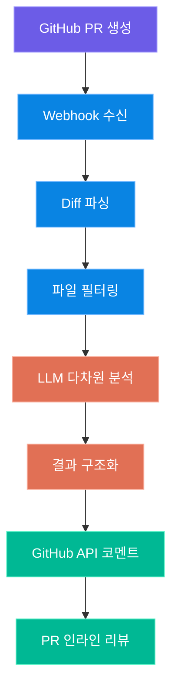
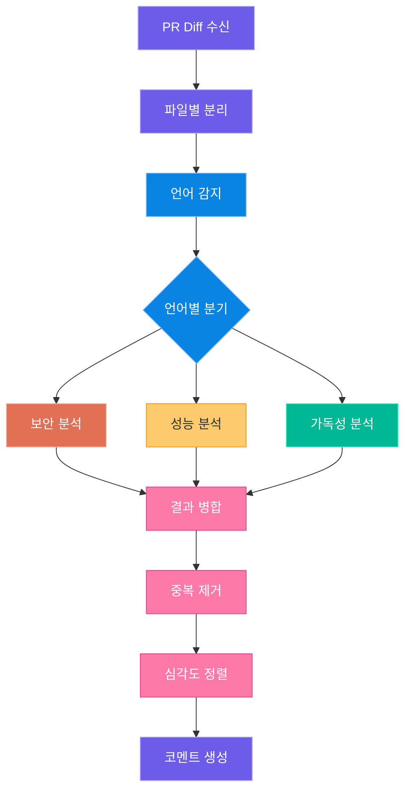
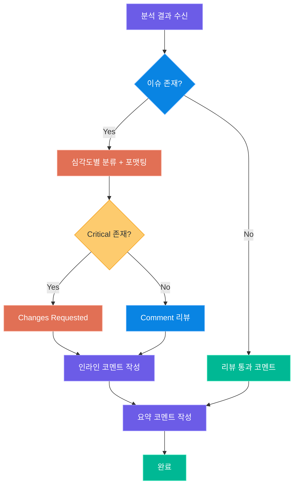
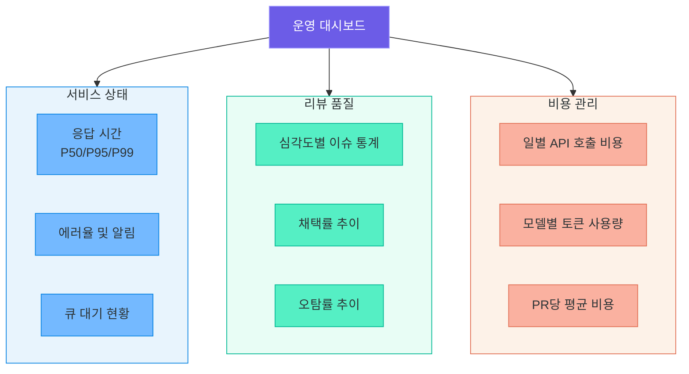

# AI 코드 리뷰 서비스 설계

> PR이 올라오면 LLM이 자동으로 보안, 성능, 가독성을 분석하고 GitHub에 인라인 코멘트를 남기는 — AI 코드 리뷰 서비스의 아키텍처와 설계 원칙을 학습합니다

---

## 1. 서비스 개요

### AI 코드 리뷰 서비스란?

AI 코드 리뷰 서비스는 개발자가 Pull Request(PR)를 생성하면 **자동으로 코드 변경 사항을 분석**하여 리뷰 코멘트를 남기는 시스템입니다. 기존의 정적 분석 도구(ESLint, SonarQube 등)와 달리, LLM을 활용하여 **맥락을 이해한 자연어 리뷰**를 제공합니다.

사람 리뷰어가 놓치기 쉬운 보안 취약점, 성능 병목, 코드 스타일 문제를 자동으로 탐지하며, 개선 방안까지 구체적으로 제안합니다.

### 리뷰 차원

AI 코드 리뷰 서비스는 네 가지 핵심 차원에서 코드를 분석합니다.

| 리뷰 차원 | 분석 내용 | 예시 |
|---|---|---|
| **보안(Security)** | SQL Injection, XSS, 인증 취약점, 민감 정보 노출 | `cursor.execute(f"SELECT * FROM users WHERE id={user_id}")` |
| **성능(Performance)** | N+1 쿼리, 불필요한 반복, 메모리 누수, 비효율적 알고리즘 | 루프 내부에서 매번 DB 커넥션 생성 |
| **가독성(Readability)** | 네이밍 컨벤션, 함수 복잡도, 주석 부족, 매직 넘버 | `if status == 3:` (의미 불명확) |
| **베스트 프랙티스(Best Practice)** | 에러 처리, 로깅, 타입 힌트, 테스트 커버리지 | `except Exception: pass` (무시되는 예외) |

### 전체 아키텍처

서비스의 전체 흐름은 GitHub Webhook에서 시작하여, 서비스 내부에서 diff를 파싱하고, LLM으로 분석한 뒤, 다시 GitHub API를 통해 코멘트를 작성하는 구조입니다.



> **핵심 포인트:** 이 서비스의 가장 큰 가치는 **PR이 머지되기 전에** 잠재적 문제를 발견하는 것입니다. CI/CD 파이프라인에 통합하면 코드 품질 게이트 역할을 수행할 수 있습니다.

### 정적 분석 도구와의 비교

| 비교 항목 | 정적 분석 도구 (ESLint, SonarQube) | AI 코드 리뷰 서비스 |
|---|---|---|
| 분석 방식 | 규칙 기반 패턴 매칭 | LLM 기반 맥락 이해 |
| 리뷰 언어 | 영어 고정 메시지 | 자연어 (한국어 등 다국어) |
| 맥락 이해 | 파일 단위 | PR 전체 변경 맥락 |
| 커스터마이징 | 규칙 설정 파일 수정 | 프롬프트 수정으로 유연 조정 |
| 비용 | 무료 또는 라이선스 비용 | LLM API 호출 비용 |
| 오탐률 | 낮음 (확정적) | 상대적으로 높음 (확률적) |

---

## 2. PR Webhook과 Diff 파싱

### GitHub Webhook 수신

GitHub에서 PR이 생성되거나 업데이트되면 **Webhook**을 통해 서버로 이벤트가 전달됩니다. 서비스는 `pull_request` 이벤트 중 `opened`, `synchronize` 액션만 처리합니다.

Webhook 설정 시 반드시 **Secret**을 지정하고, 수신 측에서 HMAC-SHA256 서명을 검증해야 합니다. 서명 검증 없이 Webhook을 수신하면 악의적인 요청에 의해 서비스가 악용될 수 있습니다.

| Webhook 설정 항목 | 값 |
|---|---|
| **Payload URL** | `https://your-service.com/webhook/github` |
| **Content type** | `application/json` |
| **Secret** | 환경변수로 관리 (`GITHUB_WEBHOOK_SECRET`) |
| **Events** | Pull requests |

### Webhook 핸들러 구현

Webhook을 수신하는 엔드포인트는 서명 검증 후 PR 이벤트를 비동기로 처리합니다.

```python
# webhook_handler.py -- Webhook 수신 및 서명 검증
import hmac
import hashlib
from fastapi import FastAPI, Request, HTTPException

app = FastAPI()

def verify_signature(payload: bytes, signature: str, secret: str) -> bool:
    """GitHub Webhook HMAC-SHA256 서명 검증"""
    expected = hmac.new(
        secret.encode(), payload, hashlib.sha256
    ).hexdigest()
    return hmac.compare_digest(f"sha256={expected}", signature)

@app.post("/webhook/github")
async def handle_webhook(request: Request):
    payload = await request.body()
    signature = request.headers.get("X-Hub-Signature-256", "")

    if not verify_signature(payload, signature, WEBHOOK_SECRET):
        raise HTTPException(status_code=401, detail="Invalid signature")

    event = request.headers.get("X-GitHub-Event")
    data = await request.json()

    if event == "pull_request" and data["action"] in ("opened", "synchronize"):
        await process_pr_review(data["pull_request"])

    return {"status": "ok"}
```

> **핵심 포인트:** `hmac.compare_digest()`를 사용하여 타이밍 공격(timing attack)을 방지합니다. 단순 문자열 비교(`==`)는 보안상 취약합니다.

### PR Diff 파싱

GitHub API에서 PR의 diff를 가져온 후 `unidiff` 라이브러리를 사용하여 변경 내용을 구조화합니다. 파일별로 추가/삭제된 라인을 추출하고, 변경된 코드 블록(hunk)을 식별합니다.

```python
# diff_parser.py -- PR diff 파싱 및 구조화
import httpx
from unidiff import PatchSet

async def fetch_pr_diff(owner: str, repo: str, pr_number: int, token: str):
    """GitHub API에서 PR diff를 가져와 파싱"""
    url = f"https://api.github.com/repos/{owner}/{repo}/pulls/{pr_number}"
    headers = {
        "Authorization": f"token {token}",
        "Accept": "application/vnd.github.v3.diff"
    }
    async with httpx.AsyncClient() as client:
        response = await client.get(url, headers=headers)
        response.raise_for_status()

    patch_set = PatchSet(response.text)
    changes = []
    for patched_file in patch_set:
        file_changes = {
            "filename": patched_file.path,
            "added_lines": [],
            "removed_lines": [],
        }
        for hunk in patched_file:
            for line in hunk:
                if line.is_added:
                    file_changes["added_lines"].append(
                        {"line_no": line.target_line_no, "content": line.value}
                    )
        changes.append(file_changes)
    return changes
```

### 변경 파일 필터링

모든 변경 파일을 리뷰 대상으로 보낼 필요는 없습니다. 테스트 파일, 설정 파일, 자동 생성 파일 등은 리뷰에서 제외하여 비용을 절감하고 노이즈를 줄입니다.

| 필터링 규칙 | 제외 대상 예시 |
|---|---|
| 테스트 파일 | `*_test.py`, `*.spec.js`, `tests/` |
| 설정 파일 | `.env`, `*.yml`, `*.json` (설정용) |
| 자동 생성 파일 | `package-lock.json`, `*.min.js`, `migrations/` |
| 바이너리 파일 | `*.png`, `*.jpg`, `*.pdf` |
| 문서 파일 | `*.md`, `*.rst`, `*.txt` |

```python
# file_filter.py -- 리뷰 대상 파일 필터링
import re

EXCLUDE_PATTERNS = [
    r".*_test\.py$", r".*\.spec\.(js|ts)$",
    r"tests?/.*", r"__tests__/.*",
    r".*\.(yml|yaml|json|toml|ini|cfg)$",
    r"package-lock\.json$", r"yarn\.lock$",
    r".*\.min\.(js|css)$", r"migrations?/.*",
    r".*\.(png|jpg|gif|svg|pdf|ico)$",
    r".*\.(md|rst|txt)$",
]

def should_review(filename: str) -> bool:
    """파일이 리뷰 대상인지 판별"""
    return not any(
        re.match(pattern, filename) for pattern in EXCLUDE_PATTERNS
    )

def filter_changes(changes: list) -> list:
    """리뷰 대상 파일만 필터링"""
    return [c for c in changes if should_review(c["filename"])]
```

> **핵심 포인트:** 필터링 규칙은 프로젝트 특성에 따라 다르게 설정해야 합니다. 예를 들어 인프라 코드를 다루는 팀에서는 YAML 파일도 리뷰 대상에 포함할 수 있습니다.

---

## 3. 다차원 리뷰 프롬프트 설계

### 프롬프트 설계 원칙

LLM에게 효과적인 코드 리뷰를 받기 위해서는 **명확한 역할 지정**, **구체적인 분석 관점**, **출력 형식 지정**이 필요합니다. 프롬프트를 단일 덩어리로 보내는 것보다 차원별로 분리하면 각 관점에서 더 깊이 있는 분석을 얻을 수 있습니다.

| 설계 원칙 | 설명 |
|---|---|
| 역할 지정 | "보안 전문가", "성능 엔지니어" 등 전문가 페르소나 부여 |
| 분석 관점 명시 | 어떤 유형의 문제를 찾아야 하는지 구체적으로 나열 |
| 출력 형식 고정 | JSON 스키마 또는 마크다운 템플릿으로 구조화된 응답 유도 |
| 심각도 기준 제시 | Critical/High/Medium/Low 등급의 판단 기준 명확히 전달 |
| 언어별 특화 | 프로그래밍 언어에 맞는 체크리스트 적용 |

### 보안 리뷰 프롬프트

보안 리뷰는 OWASP Top 10을 기준으로 SQL Injection, XSS, 인증 취약점, 민감 정보 노출 등을 탐지합니다.

```python
# prompts/security.py -- 보안 리뷰 프롬프트 템플릿
SECURITY_REVIEW_PROMPT = """
당신은 10년 경력의 시니어 보안 엔지니어입니다.
다음 코드 변경 사항에서 보안 취약점을 분석하세요.

## 분석 관점
- SQL Injection: 파라미터화되지 않은 쿼리
- XSS: 이스케이프되지 않은 사용자 입력 출력
- 인증/인가: 권한 검증 누락, 세션 관리 문제
- 민감 정보: 하드코딩된 비밀번호, API 키 노출
- 입력 검증: 미검증 사용자 입력

## 출력 형식 (JSON)
[{
  "line": 라인번호,
  "severity": "Critical|High|Medium|Low",
  "category": "취약점 분류",
  "description": "문제 설명",
  "suggestion": "수정 제안 코드"
}]

## 코드 변경 사항
파일: {filename}
```
{code_diff}
```
"""
```

### 성능 리뷰 프롬프트

성능 리뷰는 데이터베이스 쿼리 최적화, 알고리즘 효율성, 메모리 관리 등에 초점을 맞춥니다.

```python
# prompts/performance.py -- 성능 리뷰 프롬프트 템플릿
PERFORMANCE_REVIEW_PROMPT = """
당신은 성능 최적화 전문가입니다.
다음 코드에서 성능 문제를 분석하세요.

## 분석 관점
- N+1 쿼리: 루프 내부 DB 호출
- 불필요한 반복: 최적화 가능한 루프
- 메모리 누수: 닫히지 않는 리소스, 누적 데이터
- 비효율적 자료구조: 리스트 탐색 vs 딕셔너리 조회
- 캐싱 부재: 반복적으로 계산되는 값

## 출력 형식 (JSON)
[{
  "line": 라인번호,
  "severity": "High|Medium|Low",
  "issue": "성능 문제 요약",
  "impact": "예상되는 영향",
  "suggestion": "최적화 방안"
}]
"""
```

### 가독성 리뷰 프롬프트

가독성 리뷰는 코드의 유지보수성과 팀 협업 효율성을 높이기 위한 관점에서 분석합니다.

```python
# prompts/readability.py -- 가독성 리뷰 프롬프트 템플릿
READABILITY_REVIEW_PROMPT = """
당신은 클린 코드 전문가입니다.
다음 코드의 가독성과 유지보수성을 분석하세요.

## 분석 관점
- 네이밍: 변수/함수/클래스 이름의 명확성
- 함수 복잡도: 순환 복잡도, 함수 길이
- 매직 넘버: 의미 불명확한 상수값
- 주석: 필요한 곳에 주석 부재, 불필요한 주석
- 중복 코드: DRY 원칙 위반

## 출력 형식 (JSON)
[{
  "line": 라인번호,
  "severity": "Medium|Low|Info",
  "issue": "가독성 문제 요약",
  "suggestion": "개선 제안"
}]
"""
```

### 언어별 프롬프트 분기

프로그래밍 언어에 따라 분석 관점이 달라져야 합니다. 파일 확장자를 기반으로 언어를 감지하고, 언어별 특화 체크리스트를 프롬프트에 추가합니다.

| 언어 | 확장자 | 특화 체크 항목 |
|---|---|---|
| **Python** | `.py` | f-string SQL, `eval()` 사용, GIL 영향, type hint 누락 |
| **JavaScript** | `.js`, `.ts` | `==` vs `===`, prototype pollution, async/await 미스, XSS |
| **Java** | `.java` | null 처리, 리소스 관리(try-with-resources), thread safety |
| **Go** | `.go` | error 무시, goroutine 누수, defer 위치 |

```python
# language_detector.py -- 언어 감지 및 프롬프트 분기
from pathlib import Path

LANGUAGE_MAP = {
    ".py": "python", ".js": "javascript", ".ts": "typescript",
    ".java": "java", ".go": "go", ".rb": "ruby",
    ".rs": "rust", ".cpp": "cpp", ".c": "c",
}

LANGUAGE_SPECIFIC_CHECKS = {
    "python": [
        "f-string을 SQL 쿼리에 직접 사용하는지 확인",
        "eval(), exec() 사용 여부 확인",
        "type hint 누락 여부 확인",
        "with 문 없이 파일/DB 리소스를 여는지 확인",
    ],
    "javascript": [
        "== 대신 === 사용 여부 확인",
        "innerHTML 직접 할당 여부 (XSS 위험)",
        "Promise 에러 처리 누락 확인",
        "var 대신 const/let 사용 여부 확인",
    ],
    "java": [
        "NullPointerException 가능성 확인",
        "try-with-resources 미사용 확인",
        "synchronized 누락으로 인한 race condition 확인",
        "equals() 대신 == 사용 여부 확인",
    ],
}

def detect_language(filename: str) -> str:
    ext = Path(filename).suffix.lower()
    return LANGUAGE_MAP.get(ext, "unknown")

def get_language_checks(language: str) -> str:
    checks = LANGUAGE_SPECIFIC_CHECKS.get(language, [])
    return "\n".join(f"- {check}" for check in checks)
```

### 리뷰 프로세스 흐름

diff 데이터가 들어오면 언어 감지, 다차원 분석, 결과 종합의 순서로 처리됩니다.



### 다차원 분석 통합

각 차원의 분석 결과를 통합하여 하나의 종합 리뷰를 생성하는 오케스트레이터 패턴입니다. 병렬로 분석을 실행하여 응답 시간을 단축합니다.

```python
# review_orchestrator.py -- 다차원 분석 오케스트레이터
import asyncio

async def run_multidimensional_review(file_changes, llm_client):
    """보안, 성능, 가독성 분석을 병렬로 실행"""
    tasks = [
        analyze_security(file_changes, llm_client),
        analyze_performance(file_changes, llm_client),
        analyze_readability(file_changes, llm_client),
    ]
    results = await asyncio.gather(*tasks)

    all_issues = []
    for dimension_result in results:
        all_issues.extend(dimension_result)

    # 동일 라인에 대한 중복 이슈 제거
    deduplicated = deduplicate_issues(all_issues)
    # 심각도 순으로 정렬 (Critical > High > Medium > Low)
    sorted_issues = sort_by_severity(deduplicated)
    return sorted_issues
```

> **핵심 포인트:** 각 차원의 분석을 **별도 LLM 호출**로 분리하면, 프롬프트당 토큰 수가 줄어들어 분석 정확도가 향상됩니다. 대신 API 호출 비용은 증가하므로, 프로젝트 요구사항에 따라 단일 프롬프트 방식과 적절히 선택해야 합니다.

---

## 4. 보안 취약점 탐지

### OWASP Top 10 기반 체크리스트

OWASP Top 10은 웹 애플리케이션의 가장 심각한 보안 위험 10가지를 정리한 표준입니다. AI 코드 리뷰에서는 이 중 **코드 레벨에서 탐지 가능한 항목**에 집중합니다.

| 순위 | OWASP 항목 | 코드 리뷰 탐지 가능 여부 | 탐지 방법 |
|---|---|---|---|
| A01 | Broken Access Control | 가능 | 인가 검증 코드 존재 여부 확인 |
| A02 | Cryptographic Failures | 가능 | 약한 해시(MD5, SHA1), 하드코딩된 키 |
| A03 | Injection | 가능 | 파라미터화되지 않은 쿼리, eval() |
| A04 | Insecure Design | 부분 가능 | 아키텍처 패턴 분석 |
| A05 | Security Misconfiguration | 부분 가능 | DEBUG=True, CORS 설정 |
| A06 | Vulnerable Components | 불가 | 별도 SCA 도구 필요 |
| A07 | Auth Failures | 가능 | 비밀번호 정책, 세션 관리 |
| A08 | Data Integrity Failures | 부분 가능 | 역직렬화 코드 분석 |
| A09 | Logging Failures | 가능 | 민감 정보 로깅, 로그 부재 |
| A10 | SSRF | 가능 | 외부 URL 요청 시 검증 부재 |

### 패턴 매칭 + LLM 분석 하이브리드 전략

LLM만으로 보안 분석을 수행하면 비용이 많이 들고, 명백한 패턴까지 LLM에 맡기는 것은 비효율적입니다. **빠른 패턴 매칭**으로 명백한 취약점을 먼저 잡고, **LLM 분석**으로 맥락이 필요한 취약점을 탐지하는 하이브리드 전략이 효과적입니다.

| 전략 | 장점 | 단점 | 적합한 케이스 |
|---|---|---|---|
| 패턴 매칭만 | 빠르고 저렴, 오탐 낮음 | 맥락 이해 불가 | `eval()`, 하드코딩된 비밀번호 |
| LLM만 | 맥락 이해, 복잡한 패턴 탐지 | 비용 높음, 오탐 가능 | 비즈니스 로직 취약점 |
| **하이브리드** | 비용 효율 + 정확도 | 구현 복잡도 증가 | 프로덕션 환경 |

```python
# security_analyzer.py -- 패턴 매칭 + LLM 하이브리드 분석
import re

# 즉시 탐지 가능한 위험 패턴 (정규식 기반)
DANGER_PATTERNS = {
    "sql_injection": [
        r'execute\s*\(\s*f["\']',          # f-string SQL
        r'execute\s*\(\s*["\'].*%s',        # % 포맷 SQL
        r'execute\s*\(\s*.*\+\s*',          # 문자열 연결 SQL
    ],
    "hardcoded_secret": [
        r'password\s*=\s*["\'][^"\']+["\']',
        r'api_key\s*=\s*["\'][^"\']+["\']',
        r'secret\s*=\s*["\'][^"\']+["\']',
    ],
    "dangerous_function": [
        r'\beval\s*\(', r'\bexec\s*\(',
        r'pickle\.loads?\s*\(', r'yaml\.load\s*\(',
    ],
}

def pattern_scan(code: str) -> list:
    """정규식 기반 빠른 패턴 스캔"""
    findings = []
    for line_no, line in enumerate(code.split("\n"), 1):
        for category, patterns in DANGER_PATTERNS.items():
            for pattern in patterns:
                if re.search(pattern, line):
                    findings.append({
                        "line": line_no,
                        "category": category,
                        "matched_code": line.strip(),
                        "source": "pattern_match",
                    })
    return findings
```

### 심각도 분류 기준

발견된 취약점은 4단계 심각도로 분류합니다. 심각도에 따라 코멘트의 표시 방식과 우선순위가 결정됩니다.

| 심각도 | 기준 | 대응 | 아이콘 |
|---|---|---|---|
| **Critical** | 즉시 악용 가능, 데이터 유출/손상 위험 | PR 블로킹, 즉시 수정 필수 | `[CRITICAL]` |
| **High** | 특정 조건에서 악용 가능, 보안 정책 위반 | 머지 전 수정 권장 | `[HIGH]` |
| **Medium** | 잠재적 위험, 방어 계층 부족 | 수정 계획 수립 | `[MEDIUM]` |
| **Low** | 모범 사례 미준수, 미미한 위험 | 참고 사항 | `[LOW]` |

```python
# prompts/security_deep.py -- 심각도 포함 보안 분석 프롬프트
SECURITY_DEEP_PROMPT = """
당신은 OWASP 보안 전문가입니다.

## 심각도 판단 기준
- Critical: 인증 없이 원격 코드 실행, SQL Injection으로 전체 DB 접근
- High: 인증된 사용자가 권한 밖 데이터 접근, XSS로 세션 탈취
- Medium: 정보 노출(스택 트레이스), 약한 암호화 사용
- Low: 불필요한 주석의 내부 정보, 디버그 코드 잔존

## 분석 대상 코드
파일: {filename}
언어: {language}

{code_diff}

## 패턴 매칭 사전 탐지 결과
{pattern_findings}

위 사전 탐지 결과를 참고하되, 추가적인 맥락 기반 취약점도 분석하세요.
각 이슈에 대해 심각도, 설명, 구체적인 수정 코드를 포함해주세요.
"""
```

> **핵심 포인트:** 패턴 매칭으로 발견한 결과를 LLM 프롬프트에 함께 전달하면, LLM이 해당 패턴이 실제로 위험한지 **맥락을 고려하여 검증**할 수 있습니다. 예를 들어, `eval()`이 테스트 코드에서 사용된 경우 심각도를 낮출 수 있습니다.

---

## 5. GitHub API 코멘트 작성

### PR 코멘트의 세 가지 유형

GitHub API에서 PR에 코멘트를 남기는 방법은 세 가지가 있습니다. AI 코드 리뷰 서비스에서는 **인라인 리뷰 코멘트**를 주로 사용하고, 전체 요약은 **PR 코멘트**로 작성합니다.

| 코멘트 유형 | API 엔드포인트 | 용도 |
|---|---|---|
| **PR Comment** | `POST /repos/{owner}/{repo}/issues/{pr}/comments` | 전체 리뷰 요약, 통계 |
| **Review Comment** | `POST /repos/{owner}/{repo}/pulls/{pr}/reviews` | 리뷰 승인/변경요청과 함께 코멘트 묶음 |
| **Inline Comment** | `POST /repos/{owner}/{repo}/pulls/{pr}/comments` | 특정 파일의 특정 라인에 코멘트 |

### 인라인 코멘트 작성

인라인 코멘트를 작성하려면 변경된 파일의 **diff 내 위치(position)**를 정확히 계산해야 합니다. `position`은 diff hunk 내에서의 라인 위치를 의미하며, 소스 코드의 라인 번호와는 다릅니다.

```python
# github_commenter.py -- GitHub 인라인 코멘트 작성
import httpx

SEVERITY_BADGES = {
    "Critical": "🔴 **[CRITICAL]**",
    "High": "🟠 **[HIGH]**",
    "Medium": "🟡 **[MEDIUM]**",
    "Low": "🔵 **[LOW]**",
}

async def post_inline_comment(
    owner: str, repo: str, pr_number: int,
    commit_sha: str, filename: str,
    line: int, body: str, token: str
):
    """PR의 특정 파일, 특정 라인에 인라인 코멘트 작성"""
    url = (
        f"https://api.github.com/repos/{owner}/{repo}"
        f"/pulls/{pr_number}/comments"
    )
    headers = {
        "Authorization": f"token {token}",
        "Accept": "application/vnd.github.v3+json",
    }
    payload = {
        "body": body,
        "commit_id": commit_sha,
        "path": filename,
        "line": line,
        "side": "RIGHT",
    }
    async with httpx.AsyncClient() as client:
        resp = await client.post(url, headers=headers, json=payload)
        resp.raise_for_status()
    return resp.json()
```

### 코멘트 포맷팅

리뷰 결과를 개발자가 읽기 쉬운 형식으로 포맷팅합니다. 심각도 뱃지, 카테고리, 설명, 수정 제안 코드를 구조화하여 전달합니다.

```python
# comment_formatter.py -- 리뷰 코멘트 포맷팅
def format_review_comment(issue: dict) -> str:
    """리뷰 이슈를 GitHub 코멘트 마크다운으로 포맷팅"""
    badge = SEVERITY_BADGES.get(issue["severity"], "")
    comment = f"""{badge} {issue['category']}

{issue['description']}

**수정 제안:**
```{issue.get('language', '')}
{issue['suggestion']}
```"""
    return comment

def format_summary_comment(issues: list, pr_info: dict) -> str:
    """전체 리뷰 요약 코멘트 생성"""
    stats = count_by_severity(issues)
    summary = f"""## AI Code Review Summary

| 심각도 | 건수 |
|---|---|
| Critical | {stats.get('Critical', 0)} |
| High | {stats.get('High', 0)} |
| Medium | {stats.get('Medium', 0)} |
| Low | {stats.get('Low', 0)} |
| **합계** | **{len(issues)}** |

분석 파일: {pr_info['files_analyzed']}개
소요 시간: {pr_info['elapsed_time']:.1f}초
"""
    return summary
```

### 코멘트 작성 프로세스

분석 결과를 코멘트로 변환하고 GitHub API를 통해 게시하는 전체 프로세스입니다.



### 리뷰 제출 통합

개별 인라인 코멘트를 **하나의 리뷰(Review)**로 묶어서 제출하면, PR 페이지에서 리뷰가 깔끔하게 표시됩니다. `COMMENT`, `APPROVE`, `REQUEST_CHANGES` 중 적절한 이벤트를 선택합니다.

```python
# review_submitter.py -- 리뷰 제출 통합
async def submit_review(
    owner: str, repo: str, pr_number: int,
    commit_sha: str, issues: list, token: str
):
    """분석된 이슈를 하나의 리뷰로 묶어 제출"""
    has_critical = any(i["severity"] == "Critical" for i in issues)
    event = "REQUEST_CHANGES" if has_critical else "COMMENT"

    comments = []
    for issue in issues:
        comments.append({
            "path": issue["filename"],
            "line": issue["line"],
            "body": format_review_comment(issue),
        })

    url = (
        f"https://api.github.com/repos/{owner}/{repo}"
        f"/pulls/{pr_number}/reviews"
    )
    payload = {
        "commit_id": commit_sha,
        "event": event,
        "body": format_summary_comment(issues, {}),
        "comments": comments,
    }
    # GitHub API 호출로 리뷰 제출
    async with httpx.AsyncClient() as client:
        resp = await client.post(
            url, headers=build_headers(token), json=payload
        )
        resp.raise_for_status()
```

> **핵심 포인트:** GitHub API의 리뷰 코멘트에는 **Rate Limit**이 적용됩니다. 대규모 PR에서 수십 개의 코멘트를 개별 API 호출로 작성하면 제한에 걸릴 수 있으므로, 반드시 **리뷰 묶음(Review)** 방식으로 한 번에 제출하세요.

---

## 6. 품질과 운영

### 오탐(False Positive) 최소화

AI 코드 리뷰에서 가장 큰 과제는 **오탐 관리**입니다. 오탐이 많으면 개발자가 리뷰를 무시하게 되고, 서비스의 신뢰도가 하락합니다.

| 오탐 최소화 전략 | 설명 |
|---|---|
| **맥락 포함** | 변경된 라인만이 아니라 주변 코드(context)도 함께 전달 |
| **프롬프트 튜닝** | "확실한 경우만 보고하라"는 지침 추가 |
| **신뢰도 점수** | LLM에게 각 이슈의 확신도(confidence)를 함께 출력하도록 요청 |
| **피드백 루프** | 개발자가 dismiss한 코멘트를 수집하여 프롬프트 개선 |
| **화이트리스트** | 특정 패턴을 의도적으로 무시하도록 설정 파일 관리 |

```python
# quality_control.py -- 신뢰도 기반 필터링
def filter_by_confidence(issues: list, threshold: float = 0.7):
    """신뢰도가 임계값 이상인 이슈만 필터링"""
    return [
        issue for issue in issues
        if issue.get("confidence", 0) >= threshold
    ]

# 프롬프트에 신뢰도 출력 지침 추가
CONFIDENCE_INSTRUCTION = """
각 이슈에 대해 0.0~1.0 사이의 confidence 점수를 포함하세요.
- 1.0: 확실한 버그/취약점
- 0.7~0.9: 높은 확률로 문제
- 0.4~0.6: 가능성 있음, 맥락에 따라 다를 수 있음
- 0.0~0.3: 스타일 제안, 선호도 차이

confidence가 0.5 미만인 이슈는 보고하지 마세요.
"""
```

### 비용 최적화

LLM API 호출 비용은 토큰 수에 비례합니다. 대규모 PR이나 활발한 리포지토리에서는 비용이 빠르게 증가할 수 있으므로, 여러 최적화 전략을 적용해야 합니다.

| 최적화 전략 | 비용 절감 효과 | 구현 난이도 |
|---|---|---|
| **Diff 크기 제한** | 높음 | 낮음 |
| **파일 필터링** | 중간 | 낮음 |
| **캐싱** | 높음 | 중간 |
| **모델 티어링** | 높음 | 중간 |
| **배치 처리** | 중간 | 높음 |

```python
# cost_optimizer.py -- 비용 최적화 전략
MAX_DIFF_LINES = 500       # 파일당 최대 분석 라인 수
MAX_FILES_PER_PR = 20       # PR당 최대 분석 파일 수
MAX_TOTAL_TOKENS = 100000   # PR당 최대 토큰 수

def apply_cost_limits(changes: list) -> list:
    """비용 제한 적용"""
    # 파일 수 제한 (변경 라인 수가 많은 파일 우선)
    sorted_changes = sorted(
        changes, key=lambda c: len(c["added_lines"]), reverse=True
    )
    limited = sorted_changes[:MAX_FILES_PER_PR]

    # 파일당 라인 수 제한
    for change in limited:
        if len(change["added_lines"]) > MAX_DIFF_LINES:
            change["added_lines"] = change["added_lines"][:MAX_DIFF_LINES]
            change["truncated"] = True

    return limited
```

**모델 티어링**은 심각도에 따라 다른 모델을 사용하는 전략입니다.

| 분석 단계 | 사용 모델 | 이유 |
|---|---|---|
| 1차 스크리닝 | GPT-4o-mini / Claude Haiku | 빠르고 저렴한 초기 분류 |
| 보안 심층 분석 | GPT-4o / Claude Sonnet | 정확한 보안 취약점 탐지 |
| 복잡한 맥락 분석 | Claude Opus | 아키텍처 수준의 분석 필요시 |

### Rate Limiting

서비스 자체의 Rate Limiting과 GitHub API의 Rate Limit을 모두 고려해야 합니다.

| Rate Limit 대상 | 제한 | 대응 전략 |
|---|---|---|
| **GitHub API** | 인증 사용자: 5,000 req/hour | 요청 큐잉, 지수 백오프 |
| **LLM API** | 모델/플랜별 TPM/RPM 제한 | 토큰 예산 관리, 큐잉 |
| **서비스 자체** | 동시 PR 처리 수 제한 | 작업 큐(Redis/Celery) 활용 |

```python
# rate_limiter.py -- 지수 백오프 재시도
import asyncio
from tenacity import retry, wait_exponential, stop_after_attempt

@retry(
    wait=wait_exponential(multiplier=1, min=2, max=60),
    stop=stop_after_attempt(5)
)
async def call_github_api_with_retry(url, headers, payload):
    """지수 백오프로 GitHub API 호출"""
    async with httpx.AsyncClient() as client:
        resp = await client.post(url, headers=headers, json=payload)
        if resp.status_code == 403:  # Rate limit exceeded
            reset_time = int(resp.headers.get("X-RateLimit-Reset", 0))
            # Rate limit 초과 시 예외 발생으로 재시도 트리거
            raise RateLimitExceeded(reset_time)
        resp.raise_for_status()
    return resp.json()
```

### 모니터링

서비스의 건강 상태와 리뷰 품질을 지속적으로 추적하기 위한 핵심 메트릭입니다.

| 메트릭 | 설명 | 목표치 |
|---|---|---|
| **리뷰 응답 시간** | PR 생성 ~ 리뷰 완료 | 5분 이내 |
| **리뷰 수** | 일/주/월별 처리된 PR 수 | - |
| **이슈 발견 수** | 심각도별 발견된 이슈 수 | - |
| **채택률(Adoption Rate)** | 개발자가 수정한 이슈 비율 | 60% 이상 |
| **오탐률(FP Rate)** | dismiss된 코멘트 비율 | 20% 이하 |
| **API 비용** | 일/월별 LLM API 호출 비용 | 예산 이내 |
| **에러율** | 분석 실패 비율 | 1% 이하 |

### 운영 대시보드 구성

운영 대시보드는 서비스 상태, 리뷰 품질, 비용을 한눈에 파악할 수 있도록 구성합니다.



> **핵심 포인트:** 채택률(Adoption Rate)은 서비스 품질의 가장 중요한 지표입니다. 채택률이 낮다면 오탐이 많거나, 리뷰 코멘트가 실질적이지 않다는 의미입니다. 정기적으로 dismiss된 코멘트를 분석하여 프롬프트를 개선해야 합니다.

---

## 7. 핵심 정리

### 설계 체크리스트

AI 코드 리뷰 서비스를 설계할 때 아래 체크리스트를 참고하세요.

| 단계 | 체크 항목 | 상세 |
|---|---|---|
| **Webhook** | 서명 검증 구현 | HMAC-SHA256으로 요청 무결성 확인 |
| **Webhook** | 이벤트 필터링 | `opened`, `synchronize` 액션만 처리 |
| **파싱** | Diff 파싱 라이브러리 선택 | `unidiff` 또는 자체 파서 |
| **파싱** | 파일 필터링 규칙 정의 | 테스트/설정/바이너리 파일 제외 |
| **프롬프트** | 다차원 분석 설계 | 보안, 성능, 가독성 분리 또는 통합 |
| **프롬프트** | 언어별 특화 체크리스트 | Python, JS, Java 등 |
| **프롬프트** | 출력 형식 JSON 스키마 정의 | 구조화된 응답으로 파싱 용이성 확보 |
| **보안** | 패턴 매칭 + LLM 하이브리드 | 비용 효율적 보안 탐지 |
| **보안** | 심각도 분류 기준 명시 | Critical/High/Medium/Low |
| **GitHub** | 리뷰 묶음 제출 | 개별 코멘트가 아닌 Review API 활용 |
| **GitHub** | Rate Limit 대응 | 지수 백오프, 요청 큐잉 |
| **운영** | 오탐 최소화 전략 | 신뢰도 필터링, 피드백 루프 |
| **운영** | 비용 최적화 | diff 크기 제한, 모델 티어링 |
| **운영** | 모니터링 대시보드 | 채택률, 오탐률, 비용 추적 |

### 기술 스택 요약

| 구성 요소 | 권장 기술 | 대안 |
|---|---|---|
| **웹 프레임워크** | FastAPI | Flask, Express.js |
| **LLM** | GPT-4o, Claude Sonnet | Gemini, 로컬 모델 |
| **Diff 파싱** | unidiff (Python) | diff-match-patch |
| **HTTP 클라이언트** | httpx (비동기) | aiohttp, requests |
| **작업 큐** | Celery + Redis | RQ, Dramatiq |
| **모니터링** | Prometheus + Grafana | Datadog, CloudWatch |
| **로깅** | structlog | loguru, Python logging |

### 확장 가능한 개선 방향

서비스가 안정화된 후 고려할 수 있는 확장 방향입니다.

| 확장 방향 | 설명 |
|---|---|
| **자동 수정 제안(Autofix)** | 리뷰 코멘트에 "Apply Suggestion" 버튼을 통한 원클릭 수정 |
| **학습 기반 개선** | 팀의 코딩 스타일과 리뷰 패턴을 학습하여 맞춤형 리뷰 |
| **멀티 리포지토리 지원** | 조직 단위로 모든 리포지토리에 일괄 적용 |
| **리뷰 댓글 대화** | 개발자가 리뷰 코멘트에 질문하면 AI가 추가 설명 |
| **보안 정책 통합** | 조직의 보안 정책 문서를 RAG로 참조하여 리뷰 |
| **PR 크기 경고** | 너무 큰 PR에 대해 분할을 권고 |

### 주의 사항

AI 코드 리뷰 서비스를 도입할 때 반드시 인지해야 할 한계점입니다.

| 한계 | 설명 | 대응 |
|---|---|---|
| **완벽하지 않음** | LLM은 확률 모델이므로 100% 정확하지 않음 | 사람 리뷰와 병행 |
| **코드 유출 위험** | 코드가 외부 LLM API로 전송됨 | 프라이빗 모델 또는 온프레미스 배포 고려 |
| **비용 누적** | 활발한 리포지토리에서 비용이 빠르게 증가 | 비용 예산 설정, 모델 티어링 |
| **맥락 한계** | PR diff만으로는 전체 아키텍처를 이해하기 어려움 | 관련 파일 컨텍스트 추가 제공 |

> **핵심 포인트:** AI 코드 리뷰는 **사람 리뷰어를 대체하는 것이 아니라 보완하는 도구**입니다. 1차 필터로 AI가 명백한 문제를 잡고, 사람 리뷰어는 설계 의도, 비즈니스 로직, 아키텍처 적합성에 집중할 수 있습니다.

### 다음 강의 예고

다음 강의에서는 **시험 채점 자동화 서비스**를 설계합니다. 학생 답안을 LLM이 분석하여 채점하고, 피드백을 자동 생성하는 서비스의 아키텍처와 프롬프트 설계를 다룹니다.

---
