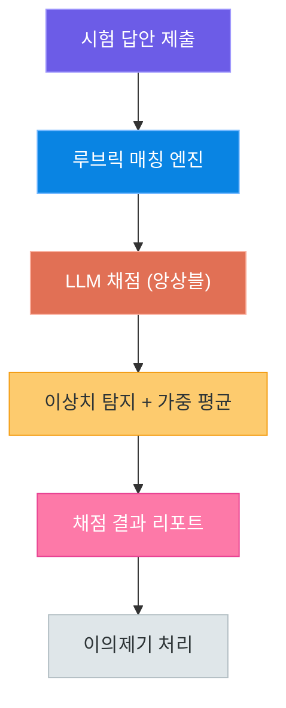
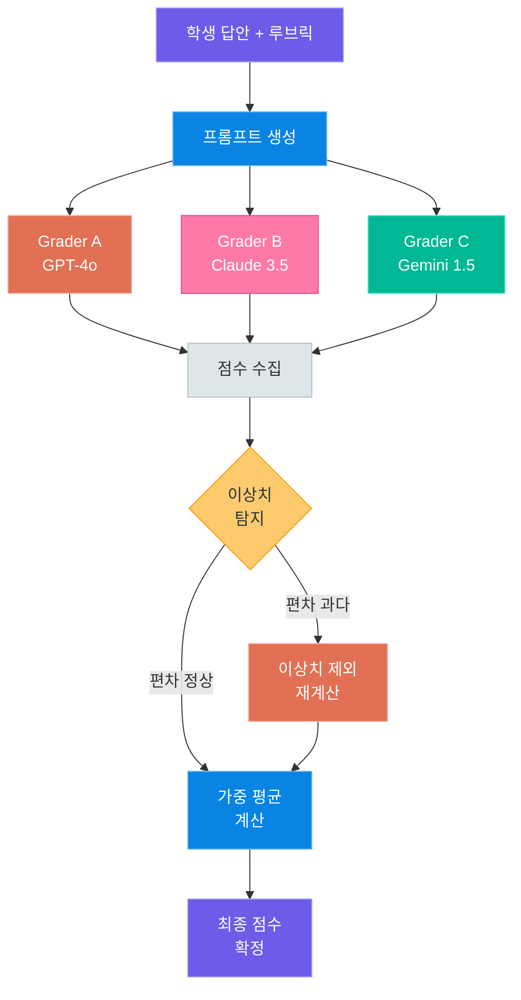
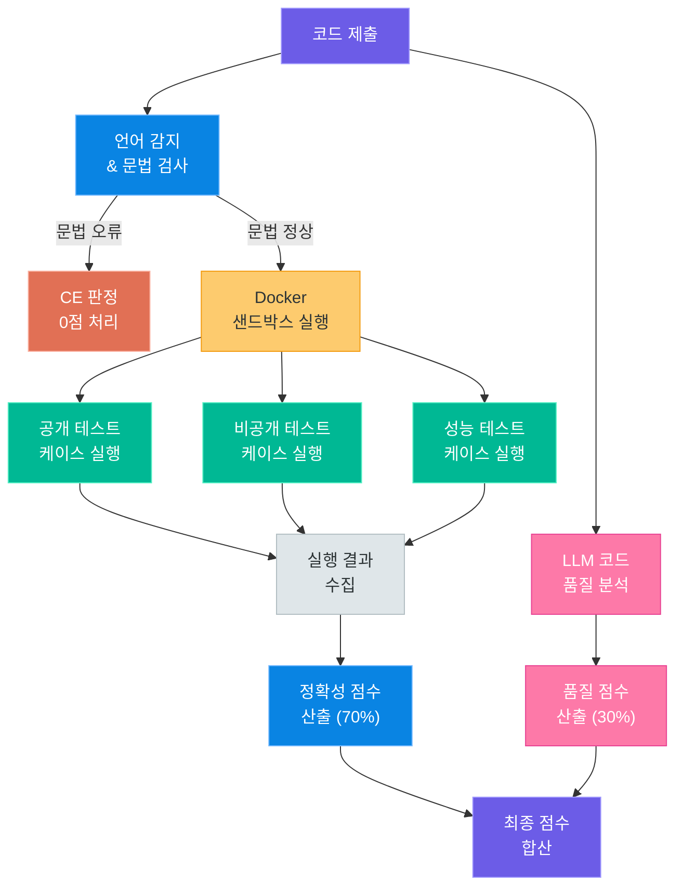
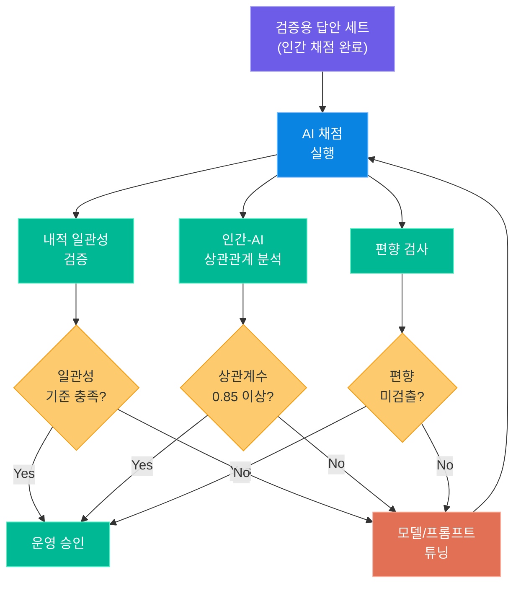

# 시험 채점 자동화 서비스

> 루브릭 기반 서술형 시험 자동 채점 — 공정성과 일관성을 갖춘 AI 채점 시스템을 설계합니다

---

## 1. 서비스 개요

### 왜 AI 채점인가?

대학교 기말고사, 기업 코딩테스트, 공공기관 논술시험 등 서술형 평가의 규모가 커질수록 채점의 **공정성**과 **일관성**을 유지하기 어렵습니다. 인간 채점자는 피로도, 주관적 판단, 시간 압박 등의 요인으로 동일한 답안에 대해서도 서로 다른 점수를 부여할 수 있습니다.

AI 채점 시스템은 이러한 문제를 해결하기 위해 **루브릭(채점 기준표)을 구조화**하고, **여러 LLM을 앙상블**하여 채점의 신뢰성을 높이는 것을 목표로 합니다.

> **핵심 포인트:** AI 채점은 인간 채점자를 "대체"하는 것이 아니라, 1차 채점을 자동화하고 인간이 검토하는 **보조 도구**로 활용됩니다.

### 채점 유형별 특성

| 채점 유형 | 입력 형태 | 평가 기준 | 난이도 |
|---|---|---|---|
| 서술형 답안 | 자연어 텍스트 | 루브릭 항목별 매칭 | 보통 |
| 코딩테스트 | 소스코드 | 정확성 + 코드 품질 | 높음 |
| 논술 | 장문 텍스트 | 논리 구조 + 논거 타당성 | 매우 높음 |
| 단답형 | 짧은 텍스트/키워드 | 정답 매칭 + 유사 표현 | 쉬움 |

### 설계 원칙

서비스 설계 시 반드시 고려해야 할 원칙은 다음과 같습니다.

1. **공정성(Fairness)**: 동일한 답안에 대해 항상 동일한 점수를 부여해야 합니다
2. **일관성(Consistency)**: 채점 기준이 모든 답안에 균일하게 적용되어야 합니다
3. **투명성(Transparency)**: 감점 사유와 배점 근거가 명확히 기록되어야 합니다
4. **이의제기 가능성(Appealability)**: 학생이 결과에 이의를 제기할 수 있는 경로가 존재해야 합니다

### 전체 아키텍처



서술형 답안이 제출되면 루브릭 매칭 엔진이 해당 문항의 채점 기준을 불러오고, 여러 LLM이 독립적으로 채점한 뒤 이상치를 탐지하고 가중 평균으로 최종 점수를 산출합니다. 최종 결과는 리포트 형태로 제공되며, 이의제기 시 재채점 프로세스가 가동됩니다.

---

## 2. 루브릭 인코딩

### 루브릭이란?

루브릭(Rubric)은 **채점 기준을 구조화한 표**입니다. 각 평가 항목에 대해 배점, 충족 조건, 감점 기준, 예시 답안 등을 명확하게 정의합니다. AI 채점의 품질은 루브릭의 정밀도에 직결됩니다.

좋은 루브릭의 조건은 다음과 같습니다.

| 조건 | 설명 | 예시 |
|---|---|---|
| 구체성 | 추상적 표현 대신 측정 가능한 기준 | "핵심 개념 2가지 이상 언급" |
| 계층성 | 만점/부분점수/0점 기준이 명확 | 5점/3점/0점 각각의 조건 정의 |
| 독립성 | 항목 간 중복 평가 없음 | 정확성과 표현력을 분리 |
| 예시 포함 | 각 점수 수준의 답안 예시 | 만점 답안, 중간 답안, 0점 답안 |

### 루브릭 JSON 스키마

루브릭을 LLM이 이해할 수 있는 JSON 형태로 변환합니다. 이 구조가 채점의 기반이 됩니다.

```json
{
  "question_id": "CS101_Q3",
  "question_text": "TCP와 UDP의 차이점을 3가지 이상 서술하시오.",
  "total_points": 10,
  "criteria": [
    {
      "criterion_id": "C1",
      "name": "연결 방식 차이",
      "max_points": 3,
      "levels": [
        {"points": 3, "desc": "연결지향 vs 비연결지향을 정확히 설명"},
        {"points": 1, "desc": "부분적으로 언급했으나 설명 불충분"},
        {"points": 0, "desc": "언급 없음 또는 오류"}
      ]
    },
    {
      "criterion_id": "C2",
      "name": "신뢰성 차이",
      "max_points": 3,
      "levels": [
        {"points": 3, "desc": "재전송, 순서보장, 흐름제어 중 2가지 이상 언급"},
        {"points": 1, "desc": "신뢰성 차이를 언급했으나 구체적 메커니즘 부족"},
        {"points": 0, "desc": "언급 없음"}
      ]
    },
    {
      "criterion_id": "C3",
      "name": "속도/오버헤드 차이",
      "max_points": 2,
      "levels": [
        {"points": 2, "desc": "헤더 크기 또는 처리 속도 차이를 설명"},
        {"points": 1, "desc": "속도 차이만 단순 언급"},
        {"points": 0, "desc": "언급 없음"}
      ]
    },
    {
      "criterion_id": "C4",
      "name": "활용 사례",
      "max_points": 2,
      "levels": [
        {"points": 2, "desc": "각각의 프로토콜 활용 사례를 적절히 제시"},
        {"points": 1, "desc": "한쪽만 사례 제시"},
        {"points": 0, "desc": "사례 없음"}
      ]
    }
  ],
  "example_answers": {
    "full_score": "TCP는 연결지향 프로토콜로 3-way handshake...",
    "mid_score": "TCP는 연결이 필요하고 UDP는 필요 없다...",
    "zero_score": "TCP가 더 좋다."
  }
}
```

> **핵심 포인트:** 루브릭의 `levels` 배열이 핵심입니다. 각 점수 수준별 조건을 명확히 정의해야 LLM이 정확한 채점을 수행할 수 있습니다.

### 프롬프트 조립 패턴

루브릭 JSON과 학생 답안을 결합하여 채점용 프롬프트를 구성합니다. 프롬프트의 구조가 채점 품질을 좌우합니다.

```python
# grading_prompt.py -- 루브릭 기반 채점 프롬프트 조립
def build_grading_prompt(rubric: dict, student_answer: str) -> str:
    """루브릭과 학생 답안을 결합하여 채점 프롬프트를 생성합니다."""
    criteria_text = ""
    for c in rubric["criteria"]:
        criteria_text += f"\n### {c['name']} (배점: {c['max_points']}점)\n"
        for level in c["levels"]:
            criteria_text += f"  - {level['points']}점: {level['desc']}\n"

    prompt = f"""당신은 공정한 시험 채점관입니다.
아래 채점 기준(루브릭)에 따라 학생의 답안을 채점하세요.

## 문제
{rubric['question_text']}

## 채점 기준 (총 {rubric['total_points']}점)
{criteria_text}

## 학생 답안
{student_answer}

## 출력 형식 (반드시 JSON)
{{
  "scores": [
    {{"criterion_id": "C1", "points": 점수, "reason": "근거"}},
    ...
  ],
  "total_score": 총점,
  "feedback": "종합 피드백"
}}
"""
    return prompt
```

### 예시 답안의 활용

루브릭에 포함된 예시 답안은 **Few-Shot 프롬프팅**의 역할을 합니다. 만점 답안, 중간 점수 답안, 0점 답안을 함께 제공하면 LLM이 점수 기준의 스펙트럼을 이해할 수 있습니다.

```python
# example_injection.py -- 예시 답안을 프롬프트에 주입
def inject_examples(prompt: str, examples: dict) -> str:
    """만점/중간/0점 예시 답안을 프롬프트에 추가합니다."""
    example_section = """
## 참고: 점수별 답안 예시
### 만점 답안 예시
{full}

### 중간 점수 답안 예시
{mid}

### 0점 답안 예시
{zero}
""".format(
        full=examples.get("full_score", ""),
        mid=examples.get("mid_score", ""),
        zero=examples.get("zero_score", ""),
    )
    return prompt + example_section
```

예시 답안이 포함된 프롬프트는 그렇지 않은 경우 대비 채점 정확도가 15~25% 향상되는 것으로 보고됩니다. 특히 부분 점수 판정에서 큰 차이를 보입니다.

### 루브릭 버전 관리

운영 중인 시험의 루브릭은 수정이 발생할 수 있습니다. 출제 오류 수정, 이의제기 반영, 채점 기준 보완 등의 이유로 루브릭이 변경되면, 해당 변경 이력을 반드시 기록해야 합니다.

| 관리 항목 | 설명 |
|---|---|
| 버전 번호 | 루브릭 수정 시마다 버전 증가 (v1.0, v1.1, ...) |
| 변경 사유 | 어떤 이유로 수정되었는지 기록 |
| 영향 범위 | 이미 채점된 답안 중 재채점 필요 여부 |
| 승인자 | 루브릭 변경을 승인한 담당자 |

루브릭이 변경되면 해당 버전 이전에 채점된 답안을 새 루브릭으로 재채점할지 결정해야 합니다. 변경 내용이 점수에 영향을 미치는 경우에는 전체 재채점이 필요합니다.

> **핵심 포인트:** 루브릭 변경 이력은 감사(audit) 목적으로도 반드시 보관해야 합니다. 채점 결과에 대한 법적 분쟁 시 어떤 기준으로 채점했는지 증명할 수 있어야 합니다.

---

## 3. 앙상블 채점

### 왜 앙상블인가?

단일 LLM으로 채점할 때의 문제점은 다음과 같습니다.

| 문제 | 설명 | 영향 |
|---|---|---|
| 채점 불안정성 | 동일 답안에 대해 호출마다 다른 점수 | 공정성 훼손 |
| 모델 편향 | 특정 표현 패턴에 과도한 가점/감점 | 일관성 저하 |
| 환각(Hallucination) | 답안에 없는 내용을 있다고 판단 | 정확성 저하 |
| Temperature 민감도 | 설정값에 따라 결과 변동폭 큼 | 재현성 저하 |

이러한 문제를 해결하기 위해 **앙상블 채점** 방식을 도입합니다. 여러 채점자(LLM)가 독립적으로 채점한 뒤, 결과를 종합하여 최종 점수를 결정합니다.

### 3-LLM 앙상블 전략

3개의 LLM을 독립적 채점자로 활용합니다. 각 모델은 동일한 루브릭과 답안을 받지만, 서로 다른 관점에서 채점합니다.

| 채점자 | 모델 | 역할 | Temperature |
|---|---|---|---|
| Grader A | GPT-4o | 기준 충족 여부 엄격 판단 | 0.0 |
| Grader B | Claude 3.5 Sonnet | 논리 흐름과 표현력 중심 | 0.1 |
| Grader C | Gemini 1.5 Pro | 핵심 개념 포함 여부 중심 | 0.0 |

> **핵심 포인트:** 앙상블의 핵심은 **독립성**입니다. 각 채점자가 다른 채점자의 결과를 참조해서는 안 됩니다. 또한 서로 다른 모델을 사용하여 모델 고유의 편향을 상쇄합니다.

### 이상치 탐지

채점자 간 점수 편차가 크면 해당 답안은 **플래그(flag)** 처리됩니다. 편차 기준은 문항의 배점에 비례하여 설정합니다.

```python
# outlier_detection.py -- 채점 이상치 탐지 로직
def detect_outlier(scores: list[int], max_points: int) -> dict:
    """채점 점수 목록에서 이상치를 탐지합니다."""
    avg = sum(scores) / len(scores)
    threshold = max_points * 0.3  # 배점의 30%를 허용 편차로 설정

    deviations = [abs(s - avg) for s in scores]
    max_dev = max(deviations)
    outlier_idx = deviations.index(max_dev) if max_dev > threshold else None

    return {
        "average": round(avg, 2),
        "max_deviation": round(max_dev, 2),
        "threshold": threshold,
        "has_outlier": max_dev > threshold,
        "outlier_grader_index": outlier_idx,
        "scores": scores,
    }
```

### 가중 평균 전략

모든 채점자의 점수를 동일하게 취급하지 않고, 모델의 신뢰도에 기반한 **가중치**를 부여합니다. 가중치는 사전 검증(Calibration) 단계에서 결정됩니다.

| 전략 | 설명 | 적용 시나리오 |
|---|---|---|
| 단순 평균 | 모든 채점자 동일 가중치 | 초기 운영, 검증 전 |
| 신뢰도 가중 | 사전 검증 정확도 기반 가중치 | 충분한 검증 데이터 확보 후 |
| 이상치 제외 | 편차 큰 채점자 제외 후 평균 | 채점자 간 편차 큰 경우 |
| 중앙값 | 중앙값 채택 | 극단값 방어가 중요한 경우 |

```python
# weighted_grading.py -- 가중 평균 채점 로직
def weighted_average(scores: list[int], weights: list[float]) -> float:
    """가중 평균 점수를 계산합니다."""
    assert len(scores) == len(weights), "점수와 가중치 개수가 일치해야 합니다"
    total = sum(s * w for s, w in zip(scores, weights))
    return round(total / sum(weights), 2)


def ensemble_grade(grading_results: list[dict], weights: list[float]) -> dict:
    """앙상블 채점 결과를 종합합니다."""
    criterion_ids = [c["criterion_id"] for c in grading_results[0]["scores"]]
    final_scores = []

    for cid in criterion_ids:
        per_grader = [
            next(s["points"] for s in gr["scores"] if s["criterion_id"] == cid)
            for gr in grading_results
        ]
        outlier_info = detect_outlier(per_grader, max_points=3)

        if outlier_info["has_outlier"]:
            # 이상치 제외 후 재계산
            filtered = [s for i, s in enumerate(per_grader)
                        if i != outlier_info["outlier_grader_index"]]
            filtered_w = [w for i, w in enumerate(weights)
                          if i != outlier_info["outlier_grader_index"]]
            score = weighted_average(filtered, filtered_w)
        else:
            score = weighted_average(per_grader, weights)

        final_scores.append({
            "criterion_id": cid,
            "final_score": score,
            "outlier_flagged": outlier_info["has_outlier"],
        })

    return {"final_scores": final_scores}
```

### 앙상블 채점 프로세스



앙상블 채점에서 가장 중요한 것은 **독립성 보장**입니다. 각 Grader는 다른 Grader의 결과를 참조하지 않으며, 동일한 루브릭과 답안만을 기반으로 채점합니다. 이상치가 탐지되면 해당 채점자의 점수를 제외하고 나머지 채점자의 가중 평균으로 최종 점수를 결정합니다.

---

## 4. 코딩테스트 채점

### 코딩테스트의 특수성

코딩테스트 채점은 서술형 채점과 달리 **코드 실행 결과**라는 객관적 기준이 존재합니다. 그러나 단순히 "맞았다/틀렸다"만으로는 부분 점수 부여, 풀이 접근법 평가, 코드 품질 판단이 불가능합니다.

코딩테스트 채점은 크게 두 축으로 구성됩니다.

| 평가 축 | 평가 방법 | 비중 |
|---|---|---|
| 정확성 평가 | 테스트 케이스 실행 (자동) | 60~70% |
| 품질 평가 | LLM 분석 (반자동) | 30~40% |

### 코드 실행 샌드박스

학생이 제출한 코드를 안전하게 실행하기 위해 **Docker 기반 샌드박스**를 사용합니다. 보안과 리소스 제한이 핵심입니다.

```python
# sandbox_config.py -- Docker 샌드박스 실행 설정
SANDBOX_CONFIG = {
    "image": "python:3.12-slim",
    "memory_limit": "256m",        # 메모리 제한
    "cpu_quota": 50000,            # CPU 사용량 제한 (50%)
    "timeout_seconds": 10,         # 실행 시간 제한
    "network_disabled": True,      # 네트워크 차단
    "read_only_rootfs": True,      # 루트 파일시스템 읽기전용
    "volumes": {
        "/tmp/student_code": {     # 학생 코드 마운트
            "bind": "/app/code",
            "mode": "ro"           # 읽기전용
        },
        "/tmp/test_cases": {       # 테스트 케이스 마운트
            "bind": "/app/tests",
            "mode": "ro"
        }
    }
}
```

> **핵심 포인트:** 샌드박스에서 네트워크는 반드시 차단해야 합니다. 외부 API 호출이나 답안 유출을 방지하기 위함입니다. 메모리와 CPU 제한은 무한 루프나 과도한 리소스 사용을 방어합니다.

### 테스트 케이스 실행 및 판정

테스트 케이스는 **공개 케이스**와 **비공개 케이스**로 나뉩니다. 공개 케이스는 학생에게 결과가 공개되고, 비공개 케이스는 최종 채점에만 사용됩니다.

| 케이스 유형 | 목적 | 공개 여부 | 배점 비중 |
|---|---|---|---|
| 공개 케이스 | 기본 기능 검증 | 결과 공개 | 30% |
| 비공개 케이스 | 엣지 케이스 검증 | 비공개 | 50% |
| 성능 케이스 | 시간/공간 복잡도 검증 | 비공개 | 20% |

```python
# test_runner.py -- 테스트 케이스 실행 및 판정 로직
from dataclasses import dataclass
from enum import Enum


class Verdict(Enum):
    ACCEPTED = "AC"          # 정답
    WRONG_ANSWER = "WA"      # 오답
    TIME_LIMIT = "TLE"       # 시간 초과
    MEMORY_LIMIT = "MLE"     # 메모리 초과
    RUNTIME_ERROR = "RE"     # 런타임 에러
    COMPILE_ERROR = "CE"     # 컴파일 에러


@dataclass
class TestResult:
    case_id: str
    verdict: Verdict
    expected: str
    actual: str
    execution_time_ms: float
    memory_usage_kb: int
```

### LLM 기반 코드 품질 분석

테스트 케이스 실행만으로는 평가할 수 없는 영역을 LLM이 분석합니다. 시간복잡도, 가독성, 풀이 접근법 등을 평가합니다.

```python
# code_quality_prompt.py -- 코드 품질 분석 프롬프트
CODE_QUALITY_PROMPT = """당신은 시니어 소프트웨어 엔지니어이자 코딩테스트 채점관입니다.

## 제출 코드
{student_code}

## 문제 설명
{problem_description}

## 평가 항목 (각 항목 1~5점)
1. **시간복잡도**: 최적 해법 대비 효율성
2. **공간복잡도**: 불필요한 메모리 사용 여부
3. **가독성**: 변수명, 함수 분리, 주석 적절성
4. **풀이 접근법**: 알고리즘 선택의 적절성

## 출력 (JSON)
{{
  "time_complexity": {{"score": 점수, "analysis": "분석"}},
  "space_complexity": {{"score": 점수, "analysis": "분석"}},
  "readability": {{"score": 점수, "analysis": "분석"}},
  "approach": {{"score": 점수, "analysis": "분석"}},
  "total_quality_score": 총점,
  "improvement_suggestions": ["개선 제안 1", "개선 제안 2"]
}}
"""
```

### 다국어 코드 지원

코딩테스트는 Python뿐만 아니라 Java, C++, JavaScript 등 다양한 언어를 지원해야 합니다. 언어별로 Docker 이미지와 실행 환경이 달라지므로, 언어 감지와 환경 매핑이 필요합니다.

| 지원 언어 | Docker 이미지 | 컴파일 필요 | 타임아웃 기본값 |
|---|---|---|---|
| Python 3.12 | `python:3.12-slim` | No | 10초 |
| Java 17 | `eclipse-temurin:17-jdk` | Yes | 15초 |
| C++ 17 | `gcc:13-bookworm` | Yes | 5초 |
| JavaScript | `node:20-slim` | No | 10초 |

컴파일 언어의 경우 컴파일 에러(CE)와 런타임 에러(RE)를 구분해야 합니다. 컴파일 단계에서 실패하면 테스트 케이스 실행 없이 바로 CE 판정을 내립니다.

### 코딩테스트 채점 파이프라인



코딩테스트 채점에서 정확성(테스트 케이스 통과율)과 품질(LLM 분석)은 독립적으로 수행됩니다. 정확성 평가는 완전 자동화되며, 품질 평가만 LLM에 의존합니다. 이 두 가지 점수를 가중 합산하여 최종 점수를 산출합니다.

---

## 5. 이의제기 처리

### 이의제기의 필요성

AI 채점 시스템에서 이의제기 처리는 단순한 부가 기능이 아니라 **시스템 신뢰성의 핵심**입니다. 학생이 자신의 채점 결과에 대해 합리적으로 이의를 제기할 수 있어야 하며, 이 과정이 투명하고 공정해야 합니다.

이의제기가 발생하는 주요 사유는 다음과 같습니다.

| 이의 유형 | 사례 | 처리 방식 |
|---|---|---|
| 정답 누락 | 정답을 작성했으나 인식되지 않음 | 프롬프트 수정 후 재채점 |
| 부분 점수 | 부분 정답인데 0점 처리됨 | 다른 모델로 재채점 |
| 루브릭 오류 | 채점 기준 자체가 모호함 | 루브릭 수정 후 전체 재채점 |
| 주관적 판단 | 서술 방식에 대한 해석 차이 | 인간 검토 에스컬레이션 |

### 이의제기 워크플로

이의제기는 4단계로 처리됩니다.

**1단계 — 자동 재채점**: 다른 모델과 수정된 프롬프트로 재채점을 수행합니다. 원래 채점에 사용되지 않은 모델을 우선 배정합니다.

**2단계 — 결과 비교**: 원래 채점과 재채점 결과를 항목별로 비교합니다. 점수 변동이 있는 항목을 식별합니다.

**3단계 — 자동 판정**: 재채점 결과가 원래 점수보다 높으면 상향 조정을 권고합니다. 동일하면 원래 점수를 확정합니다.

**4단계 — 인간 검토**: 재채점 후에도 점수 차이가 크거나, 학생이 추가 이의를 제기하면 인간 검토관에게 에스컬레이션합니다.

```python
# appeal_process.py -- 이의제기 처리 핵심 로직
from dataclasses import dataclass, field
from enum import Enum
from datetime import datetime


class AppealStatus(Enum):
    SUBMITTED = "submitted"
    AUTO_REGRADING = "auto_regrading"
    COMPARING = "comparing"
    HUMAN_REVIEW = "human_review"
    RESOLVED = "resolved"


@dataclass
class AppealRequest:
    appeal_id: str
    student_id: str
    question_id: str
    original_score: float
    appeal_reason: str
    status: AppealStatus = AppealStatus.SUBMITTED
    regraded_score: float | None = None
    final_score: float | None = None
    reviewer_notes: str = ""
    created_at: datetime = field(default_factory=datetime.now)
```

### 재채점 전략

이의제기 시 재채점은 원래 채점과 **의도적으로 다른 조건**에서 수행합니다. 이를 통해 원래 채점의 편향이나 오류를 탐지할 수 있습니다.

| 변경 요소 | 원래 채점 | 재채점 | 이유 |
|---|---|---|---|
| 모델 | GPT-4o 앙상블 | Claude 3.5 + Gemini | 모델 편향 제거 |
| 프롬프트 | 표준 프롬프트 | 강화된 부분점수 안내 | 부분 점수 민감도 향상 |
| Temperature | 0.0 | 0.0 (동일) | 재현성 유지 |
| 예시 답안 | 포함 | 추가 예시 포함 | 판단 기준 보강 |

```python
# regrading_strategy.py -- 재채점 전략 설정
REGRADE_CONFIG = {
    "models": ["claude-3-5-sonnet", "gemini-1.5-pro"],
    "prompt_modifier": (
        "이 답안은 이의제기가 접수된 답안입니다. "
        "부분 점수를 특히 신중하게 판정하세요. "
        "학생이 핵심 개념을 이해하고 있다는 증거가 있다면 "
        "부분 점수를 적극적으로 부여하세요."
    ),
    "temperature": 0.0,
    "include_additional_examples": True,
    "comparison_threshold": 1.0,  # 1점 이상 차이 시 상향 검토
}
```

### 인간 검토 에스컬레이션

자동 재채점으로 해결되지 않는 경우, 인간 검토관에게 에스컬레이션됩니다. 에스컬레이션 기준은 다음과 같습니다.

1. 원래 채점과 재채점의 총점 차이가 배점의 30% 이상인 경우
2. 학생이 자동 재채점 결과에 대해 2차 이의를 제기한 경우
3. 동일 문항에 대한 이의제기가 전체 응시자의 10% 이상인 경우 (루브릭 문제 가능성)

> **핵심 포인트:** 에스컬레이션 기준 3번은 특히 중요합니다. 특정 문항에 대한 이의제기 비율이 높다면, 이는 개별 답안의 문제가 아니라 루브릭 자체의 문제일 수 있습니다. 이 경우 루브릭을 수정하고 해당 문항 전체를 재채점해야 합니다.

### 이의제기 결과 통보

이의제기 처리가 완료되면, 학생에게 결과를 통보합니다. 통보 내용에는 반드시 다음 항목이 포함되어야 합니다.

| 통보 항목 | 내용 |
|---|---|
| 원래 점수 | 이의제기 이전의 채점 결과 |
| 재채점 점수 | 이의제기 후 재채점 결과 |
| 최종 점수 | 확정된 최종 점수 (상향/유지/하향) |
| 변경 사유 | 점수가 변경된 경우 그 근거 |
| 추가 이의 안내 | 결과에 동의하지 않을 경우 2차 이의 절차 |

점수가 하향 조정되는 경우는 원칙적으로 발생하지 않도록 설계합니다. 이의제기는 학생의 권리이므로, 이의제기로 인해 불이익을 받아서는 안 됩니다.

---

## 6. 신뢰성 검증

### 채점 일관성 검증

AI 채점 시스템의 신뢰성을 보장하기 위해서는 **정량적 검증**이 필수입니다. 동일한 답안을 반복 채점하여 결과의 일관성을 측정합니다.

| 검증 유형 | 방법 | 기대 수준 |
|---|---|---|
| 내적 일관성 | 동일 답안 10회 반복 채점 | 표준편차 0.5점 이하 |
| 외적 일관성 | 서로 다른 모델로 채점 비교 | 상관계수 0.85 이상 |
| 시간 일관성 | 시간차 재채점 (24시간 간격) | 점수 변동 5% 이내 |
| 인간-AI 일치도 | 인간 채점 결과와 비교 | 코헨 카파 0.7 이상 |

### 인간 채점자와의 상관관계 분석

AI 채점 시스템 도입 전에 반드시 수행해야 하는 검증 단계입니다. 인간 전문가가 채점한 답안 세트를 기준으로 AI 채점 결과를 비교합니다.

```python
# correlation_analysis.py -- 인간-AI 채점 상관관계 분석
import statistics


def cohens_kappa(human_scores: list[int], ai_scores: list[int],
                 max_score: int) -> float:
    """코헨 카파 계수를 계산합니다 (단순화 버전)."""
    n = len(human_scores)
    assert n == len(ai_scores), "점수 목록 길이가 일치해야 합니다"

    # 일치율 계산
    agreements = sum(1 for h, a in zip(human_scores, ai_scores) if h == a)
    observed_agreement = agreements / n

    # 우연 일치율 계산
    for score in range(max_score + 1):
        h_freq = human_scores.count(score) / n
        a_freq = ai_scores.count(score) / n
    expected_agreement = sum(
        (human_scores.count(s) / n) * (ai_scores.count(s) / n)
        for s in range(max_score + 1)
    )

    if expected_agreement == 1.0:
        return 1.0
    return (observed_agreement - expected_agreement) / (1 - expected_agreement)


def score_correlation(human_scores: list[int], ai_scores: list[int]) -> dict:
    """인간과 AI 채점 간 상관관계를 분석합니다."""
    n = len(human_scores)
    h_mean = statistics.mean(human_scores)
    a_mean = statistics.mean(ai_scores)

    diffs = [abs(h - a) for h, a in zip(human_scores, ai_scores)]
    return {
        "mean_absolute_error": round(statistics.mean(diffs), 2),
        "max_error": max(diffs),
        "exact_match_rate": round(
            sum(1 for d in diffs if d == 0) / n * 100, 1
        ),
        "within_1_point_rate": round(
            sum(1 for d in diffs if d <= 1) / n * 100, 1
        ),
    }
```

### 편향 검사

AI 채점 시스템이 특정 패턴에 대해 과도한 가점 또는 감점을 부여하는지 검사합니다. 편향 검사는 시스템 운영 중에도 지속적으로 수행되어야 합니다.

검사 대상 편향 유형은 다음과 같습니다.

| 편향 유형 | 설명 | 검사 방법 |
|---|---|---|
| 길이 편향 | 긴 답안에 높은 점수 부여 | 동일 내용 + 다른 길이 비교 |
| 어휘 편향 | 전문 용어 사용 시 과도한 가점 | 동일 내용 + 다른 어휘 수준 비교 |
| 순서 편향 | 특정 서술 순서에 가점 | 동일 내용 + 항목 순서 변경 비교 |
| 형식 편향 | 번호 매기기 등 형식에 가점 | 동일 내용 + 다른 형식 비교 |

```python
# bias_checker.py -- 편향 검사 테스트 생성
BIAS_TEST_TEMPLATES = {
    "length_bias": {
        "short": "TCP는 연결지향, UDP는 비연결지향이다.",
        "long": (
            "TCP(Transmission Control Protocol)는 연결지향적 프로토콜로서, "
            "데이터 전송 전에 3-way handshake를 통해 연결을 수립합니다. "
            "반면 UDP(User Datagram Protocol)는 비연결지향적 프로토콜로, "
            "연결 수립 과정 없이 바로 데이터를 전송합니다."
        ),
        "expected": "동일한 핵심 내용이므로 점수 차이가 1점 이내여야 함",
    },
    "format_bias": {
        "plain": "TCP는 연결지향이고 UDP는 비연결지향이다. 신뢰성도 다르다.",
        "numbered": "1. TCP: 연결지향\n2. UDP: 비연결지향\n3. 신뢰성 차이 존재",
        "expected": "형식만 다르므로 점수 차이가 0.5점 이내여야 함",
    },
}
```

편향 검사 결과 특정 편향이 발견되면, 해당 편향을 상쇄할 수 있도록 프롬프트를 수정합니다. 예를 들어 길이 편향이 발견되면 프롬프트에 "답안의 길이가 아닌 핵심 내용의 포함 여부만을 기준으로 채점하세요"라는 지시를 추가합니다.

### 검증 데이터셋 구성

신뢰성 검증을 위해서는 충분한 규모의 **검증 데이터셋**이 필요합니다. 검증 데이터셋은 다음 조건을 만족해야 합니다.

| 조건 | 기준 | 이유 |
|---|---|---|
| 최소 규모 | 문항당 최소 50개 답안 | 통계적 유의성 확보 |
| 점수 분포 | 만점~0점까지 고르게 분포 | 특정 점수대 편향 방지 |
| 인간 채점 | 2인 이상의 전문가가 독립 채점 | 인간 기준 점수 신뢰성 확보 |
| 다양성 | 서술 스타일, 길이, 형식 다양 | 일반화 성능 검증 |

### 신뢰성 검증 프로세스



검증 프로세스는 **반복적(iterative)**입니다. 일관성, 상관관계, 편향 검사 중 하나라도 기준을 충족하지 못하면 모델이나 프롬프트를 튜닝하고 다시 검증합니다. 모든 기준을 충족해야 운영 환경에 투입할 수 있습니다.

> **핵심 포인트:** 신뢰성 검증은 시스템 배포 전 1회만 수행하는 것이 아닙니다. 모델 업데이트, 루브릭 변경, 새로운 시험 유형 추가 시마다 반드시 재검증해야 합니다. 검증 자동화 파이프라인을 구축하는 것이 권장됩니다.

---

## 7. 핵심 정리

### 설계 체크리스트

시험 채점 자동화 서비스를 설계할 때 반드시 확인해야 할 항목들을 정리합니다.

**루브릭 설계**

| 체크 항목 | 확인 내용 | 완료 |
|---|---|---|
| 구조화 | 루브릭이 JSON 스키마로 변환 가능한가? | [ ] |
| 계층성 | 만점/부분점수/0점 기준이 명확한가? | [ ] |
| 예시 포함 | 각 점수 수준의 예시 답안이 있는가? | [ ] |
| 독립성 | 평가 항목 간 중복이 없는가? | [ ] |

**앙상블 채점**

| 체크 항목 | 확인 내용 | 완료 |
|---|---|---|
| 다중 모델 | 2개 이상의 서로 다른 LLM을 사용하는가? | [ ] |
| 독립 채점 | 각 채점자가 독립적으로 채점하는가? | [ ] |
| 이상치 탐지 | 채점자 간 편차가 큰 경우 플래그하는가? | [ ] |
| 가중 평균 | 신뢰도 기반 가중치를 적용하는가? | [ ] |

**코딩테스트**

| 체크 항목 | 확인 내용 | 완료 |
|---|---|---|
| 샌드박스 | Docker 기반 격리 환경을 사용하는가? | [ ] |
| 보안 제한 | 네트워크 차단, 리소스 제한이 설정되었는가? | [ ] |
| 테스트 분리 | 공개/비공개/성능 케이스가 분리되었는가? | [ ] |
| 품질 분석 | 코드 품질을 LLM으로 분석하는가? | [ ] |

**이의제기 & 신뢰성**

| 체크 항목 | 확인 내용 | 완료 |
|---|---|---|
| 재채점 경로 | 이의제기 시 다른 조건으로 재채점하는가? | [ ] |
| 에스컬레이션 | 인간 검토관 에스컬레이션 경로가 있는가? | [ ] |
| 일관성 검증 | 반복 채점 시 표준편차가 기준 이내인가? | [ ] |
| 편향 검사 | 길이/어휘/순서/형식 편향을 검사했는가? | [ ] |

### 핵심 설계 원칙 요약

서비스를 설계할 때 기억해야 할 핵심 원칙입니다.

1. **루브릭이 전부다**: AI 채점의 품질은 루브릭의 정밀도에 비례합니다. 루브릭 설계에 가장 많은 시간을 투자하세요.

2. **앙상블은 선택이 아닌 필수**: 단일 LLM 채점은 실무에서 사용할 수 없습니다. 최소 2개 이상의 모델을 앙상블하세요.

3. **이의제기를 두려워하지 마세요**: 이의제기 프로세스는 시스템의 약점이 아니라, 신뢰성을 높이는 피드백 루프입니다.

4. **검증 없이 배포하지 마세요**: 인간 채점자와의 상관관계가 0.85 이상이어야 실무 투입이 가능합니다.

5. **코딩테스트는 하이브리드**: 정확성은 자동 실행으로, 품질은 LLM으로 평가하는 이원 구조가 최적입니다.

### 아키텍처 설계 시 고려사항

| 고려사항 | 권장 사항 |
|---|---|
| 확장성 | 비동기 큐(Celery, RabbitMQ) 기반 채점 파이프라인 |
| 비용 최적화 | 단답형은 규칙 기반, 서술형만 LLM 채점 |
| 모니터링 | 채점 소요 시간, 이상치 비율, 이의제기 비율 대시보드 |
| 데이터 보관 | 답안, 채점 결과, 프롬프트, 모델 버전 전체 기록 |
| 보안 | 답안 암호화 저장, 접근 권한 분리, 감사 로그 |

> **핵심 포인트:** 채점 시스템은 "한 번 만들고 끝"이 아닙니다. 모델이 업데이트될 때마다, 새로운 시험 유형이 추가될 때마다 검증-튜닝-재검증 사이클을 반복해야 합니다. 이 과정을 자동화하는 CI/CD 파이프라인을 구축하는 것이 장기적으로 가장 중요합니다.

### 추천 학습 자료

| 주제 | 자료 | 유형 |
|---|---|---|
| LLM 기반 평가 | "LLM-as-a-Judge" 논문 | 학술 논문 |
| 교육 AI | "AI in Education" 서베이 | 리뷰 논문 |
| 자동 채점 | "Automated Essay Scoring" | 기술 블로그 |
| 앙상블 기법 | "Ensemble Methods in ML" | 교과서 |

### 다음 강의 예고

이번 강의에서는 루브릭 기반 서술형 시험 자동 채점 시스템의 설계를 다루었습니다. 루브릭 인코딩, 앙상블 채점, 코딩테스트 채점, 이의제기 처리, 신뢰성 검증까지 채점 서비스의 전체 라이프사이클을 살펴보았습니다.

**다음 강의에서는 AI 검색 엔진을 설계합니다.** 벡터 검색, 시맨틱 랭킹, RAG 파이프라인을 결합하여 사용자의 의도를 이해하는 지능형 검색 시스템의 아키텍처를 학습합니다.

---
