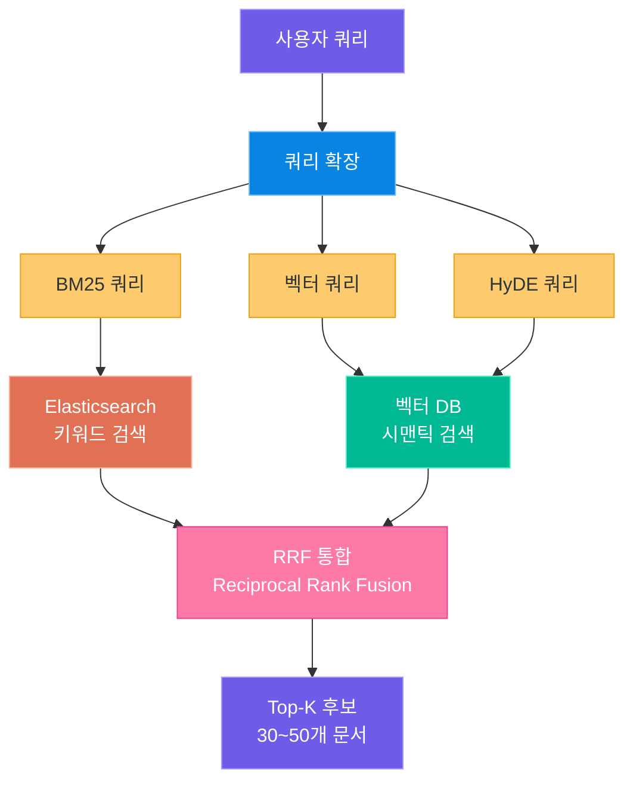
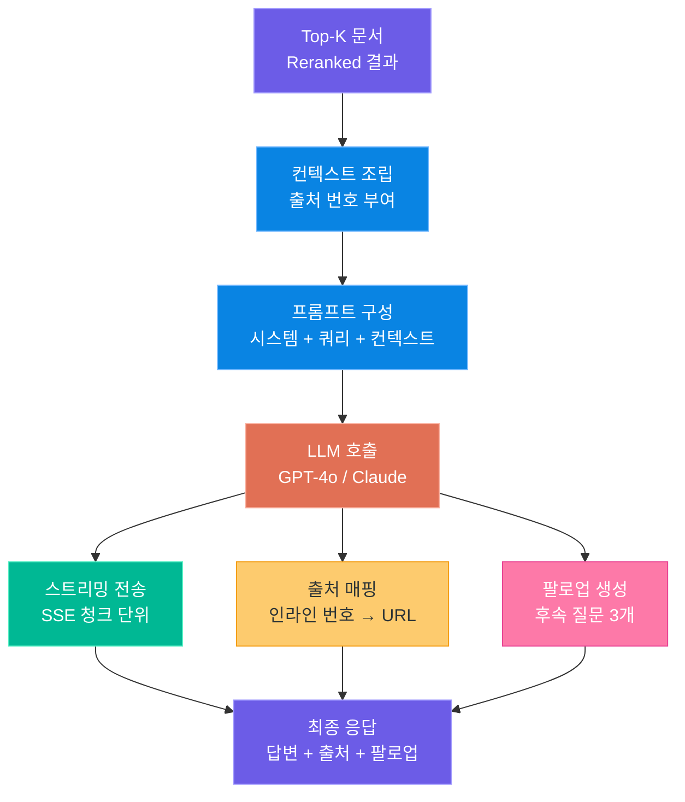
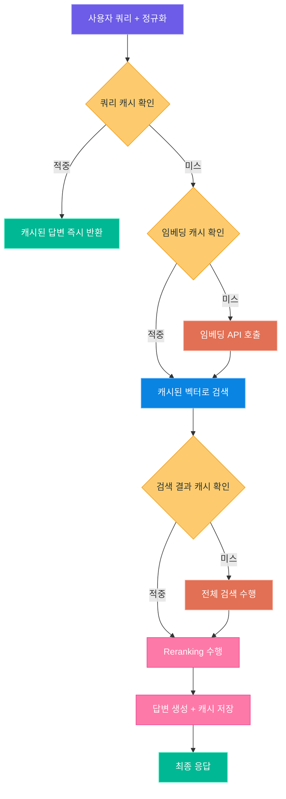

# AI 검색 엔진 서비스 설계

> 키워드 검색을 넘어, 질문에 대한 "답변"을 생성하는 차세대 검색 엔진을 설계합니다

---

## 1. 서비스 개요

### 1.1 AI 검색 엔진이란

기존 검색 엔진은 사용자가 입력한 키워드와 일치하는 문서 **목록**을 보여줍니다.
AI 검색 엔진은 여기서 한 단계 더 나아가, 검색된 문서를 기반으로 **자연어 답변을 생성**합니다.

Perplexity AI, Google AI Overview, Bing Copilot 등이 대표적인 사례입니다.
이들은 공통적으로 **하이브리드 검색**(키워드 + 시맨틱)과 **생성형 답변**(LLM 기반 요약)을 결합합니다.

### 1.2 기존 검색 vs AI 검색

| 구분 | 기존 검색 엔진 | AI 검색 엔진 |
|---|---|---|
| **입력** | 키워드 중심 | 자연어 질문 |
| **결과** | 문서 링크 목록 (10 blue links) | 요약 답변 + 출처 링크 |
| **순위** | TF-IDF / BM25 | 하이브리드 + Reranking |
| **이해** | 단어 매칭 | 의도 파악 + 시맨틱 이해 |
| **후속 동작** | 사용자가 직접 문서를 읽음 | 팔로업 질문 자동 제안 |
| **지연 시간** | ~100ms | ~2-5s (생성 포함) |
| **비용** | 인프라 비용만 | 인프라 + LLM API 비용 |

> **핵심 포인트:** AI 검색 엔진의 핵심 가치는 "사용자가 답을 찾기 위해 여러 문서를 읽어야 하는 수고"를 제거하는 것입니다. 대신 정확한 출처 표시가 필수입니다.

### 1.3 전체 아키텍처

사용자 쿼리가 최종 답변이 되기까지의 전체 흐름입니다.


이 파이프라인의 각 단계를 상세히 설계해 보겠습니다.

### 1.4 핵심 설계 원칙

| 원칙 | 설명 |
|---|---|
| **속도 우선** | 검색 결과는 500ms 이내, 생성 답변은 스트리밍으로 제공 |
| **정확한 출처** | 모든 답변에 인라인 출처 번호와 원본 링크 포함 |
| **Fallback 전략** | LLM 실패 시 기존 검색 결과만 반환 |
| **비용 효율** | 캐싱 + 짧은 프롬프트로 API 비용 최소화 |

---

## 2. 쿼리 처리와 확장

사용자가 입력한 원본 쿼리를 그대로 검색에 사용하면 품질이 떨어집니다.
**쿼리 처리 단계**에서 의도를 파악하고, 검색 품질을 높이기 위해 쿼리를 확장합니다.

### 2.1 쿼리 이해 — 의도 분류

사용자 쿼리를 분석하여 **검색 의도**를 분류합니다.
의도에 따라 검색 전략과 답변 생성 방식이 달라집니다.

| 의도 유형 | 예시 | 검색 전략 |
|---|---|---|
| **정보형 (Informational)** | "트랜스포머 아키텍처란?" | 시맨틱 검색 비중 높임 |
| **탐색형 (Navigational)** | "OpenAI 공식 문서" | 키워드 검색 비중 높임 |
| **비교형 (Comparative)** | "GPT-4 vs Claude 차이" | 양쪽 관련 문서 모두 검색 |
| **절차형 (How-to)** | "FastAPI 배포 방법" | 튜토리얼/가이드 문서 우선 |
| **사실형 (Factual)** | "GPT-4 출시일" | 최신 문서 우선 |

### 2.2 엔티티 추출

쿼리에서 **핵심 엔티티**(사람, 기술, 제품 등)를 추출하면 검색 정확도가 크게 향상됩니다.

```python
# query_entity_extractor.py -- LLM 기반 엔티티 추출
from openai import OpenAI

client = OpenAI()

def extract_entities(query: str) -> dict:
    """쿼리에서 핵심 엔티티를 추출합니다."""
    response = client.chat.completions.create(
        model="gpt-4o-mini",
        response_format={"type": "json_object"},
        messages=[
            {"role": "system", "content": """
쿼리에서 엔티티를 추출하여 JSON으로 반환하세요.
{"intent": "informational|navigational|comparative|howto|factual",
 "entities": [{"name": "...", "type": "person|tech|product|org"}],
 "keywords": ["핵심", "키워드"],
 "time_sensitivity": "high|medium|low"}
"""},
            {"role": "user", "content": query}
        ],
        temperature=0
    )
    return json.loads(response.choices[0].message.content)
```

### 2.3 쿼리 확장 — 동의어와 관련어

원본 쿼리만으로는 관련 문서를 놓칠 수 있습니다.
**동의어, 관련어, 약어 풀이**를 추가하여 검색 범위를 넓힙니다.

```python
# query_expander.py -- 쿼리 확장 로직
def expand_query(query: str, entities: dict) -> dict:
    """원본 쿼리를 다양한 변형으로 확장합니다."""
    response = client.chat.completions.create(
        model="gpt-4o-mini",
        response_format={"type": "json_object"},
        messages=[
            {"role": "system", "content": """
검색 품질을 높이기 위해 쿼리를 확장하세요.
{"expanded_queries": ["확장 쿼리1", "확장 쿼리2"],
 "synonyms": ["동의어1", "동의어2"],
 "bm25_query": "키워드 검색용 쿼리",
 "vector_query": "시맨틱 검색용 자연어 쿼리"}
"""},
            {"role": "user", "content": f"원본: {query}\n엔티티: {entities}"}
        ],
        temperature=0.3
    )
    return json.loads(response.choices[0].message.content)
```

### 2.4 HyDE — 가상 문서 생성

**HyDE(Hypothetical Document Embeddings)**는 쿼리를 직접 임베딩하는 대신,
LLM이 생성한 **가상의 답변 문서**를 임베딩하여 검색하는 기법입니다.

이 방식은 쿼리와 문서 사이의 **임베딩 공간 불일치(gap)** 문제를 해결합니다.
쿼리는 짧고 질문형이지만, 문서는 길고 서술형이기 때문에 임베딩 벡터가 다른 영역에 위치하는 경우가 많습니다.

| 방식 | 임베딩 대상 | 장점 | 단점 |
|---|---|---|---|
| 기본 쿼리 검색 | 원본 쿼리 | 빠름, 비용 없음 | 시맨틱 갭 존재 |
| HyDE | 가상 답변 문서 | 시맨틱 갭 해소 | LLM 호출 비용 + 지연 |
| 하이브리드 | 둘 다 사용 | 최상의 품질 | 복잡도 증가 |

```python
# hyde_generator.py -- HyDE 가상 문서 생성
def generate_hypothetical_document(query: str) -> str:
    """쿼리에 대한 가상의 답변 문서를 생성합니다."""
    response = client.chat.completions.create(
        model="gpt-4o-mini",
        messages=[
            {"role": "system", "content":
                "사용자 질문에 대한 상세한 답변을 작성하세요. "
                "사실 여부와 무관하게 관련 내용을 포함한 "
                "200단어 내외의 문서를 작성합니다."},
            {"role": "user", "content": query}
        ],
        temperature=0.7,
        max_tokens=300
    )
    return response.choices[0].message.content

def hyde_search(query: str, collection) -> list:
    """HyDE를 적용한 벡터 검색을 수행합니다."""
    hypo_doc = generate_hypothetical_document(query)
    hypo_embedding = get_embedding(hypo_doc)
    results = collection.query(
        query_embeddings=[hypo_embedding],
        n_results=10
    )
    return results
```

> **핵심 포인트:** HyDE는 검색 품질을 크게 향상시키지만, LLM 호출로 인해 200-500ms의 추가 지연이 발생합니다. 캐싱과 병렬 처리로 이를 완화해야 합니다.

---

## 3. 하이브리드 검색

단일 검색 방식은 한계가 있습니다.
**키워드 검색**(BM25)과 **시맨틱 검색**(Dense Vector)을 결합하여 상호 보완합니다.

### 3.1 BM25 키워드 검색

BM25는 **단어 빈도(TF)**와 **역문서 빈도(IDF)**를 기반으로 문서 관련성을 계산합니다.
Elasticsearch나 OpenSearch에서 기본 랭킹 알고리즘으로 사용됩니다.

| 파라미터 | 설명 | 기본값 |
|---|---|---|
| **k1** | 단어 빈도 포화도 조절 | 1.2 |
| **b** | 문서 길이 정규화 | 0.75 |
| **TF** | 해당 문서에서 단어 등장 횟수 | - |
| **IDF** | 전체 문서 대비 희소성 | - |

**BM25의 강점과 약점:**

| 강점 | 약점 |
|---|---|
| 정확한 키워드 매칭 | 동의어, 유사 표현 놓침 |
| 고유명사/코드 검색에 강함 | 의미적 유사성 파악 불가 |
| 매우 빠른 속도 (< 10ms) | 짧은 쿼리에서 성능 저하 |
| 인프라 비용 낮음 | 다국어 처리 한계 |

```python
# bm25_search.py -- OpenSearch BM25 검색
from opensearchpy import OpenSearch

os_client = OpenSearch(
    hosts=[{"host": "localhost", "port": 9200}],
    http_auth=("admin", "admin")
)

def bm25_search(query: str, index: str, top_k: int = 20) -> list:
    """BM25 기반 키워드 검색을 수행합니다."""
    body = {
        "size": top_k,
        "query": {
            "multi_match": {
                "query": query,
                "fields": ["title^3", "content", "tags^2"],
                "type": "best_fields",
                "fuzziness": "AUTO"
            }
        },
        "_source": ["title", "content", "url", "timestamp"]
    }
    response = os_client.search(index=index, body=body)
    return [
        {
            "id": hit["_id"],
            "score": hit["_score"],
            "source": "bm25",
            **hit["_source"]
        }
        for hit in response["hits"]["hits"]
    ]
```

### 3.2 Dense Vector 시맨틱 검색

쿼리와 문서를 동일한 임베딩 공간에 매핑하여 **의미적 유사성**으로 검색합니다.
벡터 DB(Chroma, Pinecone, Weaviate 등)를 사용합니다.

| 벡터 DB | 특징 | 적합한 규모 |
|---|---|---|
| **Chroma** | 로컬/프로토타입, Python 네이티브 | ~100만 문서 |
| **Pinecone** | 관리형 SaaS, 스케일링 용이 | ~10억 문서 |
| **Weaviate** | 하이브리드 검색 내장, 자체 호스팅 | ~1억 문서 |
| **Qdrant** | 고성능 Rust 기반, 필터링 강점 | ~1억 문서 |
| **pgvector** | PostgreSQL 확장, 기존 DB 활용 | ~1000만 문서 |

```python
# vector_search.py -- 벡터 DB 시맨틱 검색
import chromadb
from openai import OpenAI

client = OpenAI()
chroma_client = chromadb.HttpClient(host="localhost", port=8000)
collection = chroma_client.get_collection("documents")

def get_embedding(text: str) -> list[float]:
    """텍스트를 임베딩 벡터로 변환합니다."""
    response = client.embeddings.create(
        model="text-embedding-3-small",
        input=text
    )
    return response.data[0].embedding

def vector_search(query: str, top_k: int = 20) -> list:
    """시맨틱 벡터 검색을 수행합니다."""
    query_embedding = get_embedding(query)
    results = collection.query(
        query_embeddings=[query_embedding],
        n_results=top_k,
        include=["documents", "metadatas", "distances"]
    )
    return [
        {
            "id": results["ids"][0][i],
            "score": 1 - results["distances"][0][i],
            "source": "vector",
            "content": results["documents"][0][i],
            **results["metadatas"][0][i]
        }
        for i in range(len(results["ids"][0]))
    ]
```

### 3.3 Reciprocal Rank Fusion (RRF)

두 검색 결과를 결합하는 핵심 알고리즘입니다.
각 결과의 **순위(rank)**를 기반으로 통합 점수를 계산합니다.

**RRF 공식:**

```
RRF_score(d) = Σ 1 / (k + rank_i(d))
```

- `k`는 상수 (보통 60)로, 상위 랭크에 과도한 가중치가 쏠리는 것을 방지합니다
- `rank_i(d)`는 i번째 검색 시스템에서의 문서 d의 순위입니다

```python
# rrf_fusion.py -- Reciprocal Rank Fusion 구현
def reciprocal_rank_fusion(
    result_lists: list[list[dict]],
    k: int = 60,
    weights: list[float] = None
) -> list[dict]:
    """여러 검색 결과를 RRF로 통합합니다."""
    if weights is None:
        weights = [1.0] * len(result_lists)

    fusion_scores = {}
    doc_data = {}

    for list_idx, results in enumerate(result_lists):
        for rank, doc in enumerate(results):
            doc_id = doc["id"]
            rrf_score = weights[list_idx] / (k + rank + 1)

            if doc_id not in fusion_scores:
                fusion_scores[doc_id] = 0
                doc_data[doc_id] = doc
            fusion_scores[doc_id] += rrf_score

    # 통합 점수로 정렬
    sorted_docs = sorted(
        fusion_scores.items(),
        key=lambda x: x[1],
        reverse=True
    )
    return [
        {**doc_data[doc_id], "rrf_score": score}
        for doc_id, score in sorted_docs
    ]
```

> **핵심 포인트:** RRF는 각 검색 시스템의 점수 스케일이 다른 문제를 자연스럽게 해결합니다. BM25 점수(0~30+)와 벡터 유사도(0~1)를 직접 비교할 필요 없이, 순위만으로 통합합니다.

### 3.4 하이브리드 검색 파이프라인



### 3.5 가중치 튜닝 전략

BM25와 벡터 검색의 가중치는 **쿼리 유형**에 따라 동적으로 조절하면 효과적입니다.

| 쿼리 유형 | BM25 가중치 | Vector 가중치 | 이유 |
|---|---|---|---|
| 고유명사 포함 | 1.5 | 0.8 | 정확한 키워드 매칭 중요 |
| 개념/설명 질문 | 0.8 | 1.5 | 시맨틱 이해 중요 |
| 코드 검색 | 2.0 | 0.5 | 정확한 구문 매칭 필수 |
| 일반 질문 | 1.0 | 1.0 | 균형 잡힌 검색 |

---

## 4. Reranking

하이브리드 검색으로 얻은 30~50개의 후보 문서를 **정밀 재평가**하여 상위 5~10개를 선별합니다.
Reranking은 검색 품질에서 **가장 큰 영향을 주는 단계**입니다.

### 4.1 Cross-Encoder 원리

검색 단계의 Bi-Encoder와 달리, Cross-Encoder는 쿼리와 문서를 **동시에 입력**하여 관련성을 판단합니다.

| 구분 | Bi-Encoder (검색용) | Cross-Encoder (Reranking용) |
|---|---|---|
| **입력** | 쿼리, 문서 각각 인코딩 | 쿼리 + 문서 함께 인코딩 |
| **속도** | 매우 빠름 (벡터 비교) | 느림 (쌍별 추론) |
| **정확도** | 보통 | 높음 |
| **활용** | 대량 문서에서 후보 추출 | 후보 중 최종 선별 |
| **규모** | 수백만~수십억 문서 | 30~100개 후보 |

### 4.2 주요 Reranking 모델

| 모델 | 제공자 | 특징 | 비용 |
|---|---|---|---|
| **Cohere Rerank** | Cohere | API 기반, 다국어 지원 | $2/1K 요청 |
| **bge-reranker-v2-m3** | BAAI | 오픈소스, 다국어 | 무료 (자체 호스팅) |
| **ms-marco-MiniLM** | Microsoft | 경량 모델, 영어 특화 | 무료 (자체 호스팅) |
| **Jina Reranker** | Jina AI | API + 오픈소스, 8K 토큰 | $1/1K 요청 |
| **Voyage Rerank** | Voyage AI | 코드 검색에 강점 | $0.5/1K 요청 |

### 4.3 Reranking 구현

```python
# reranker.py -- Cross-Encoder Reranking 파이프라인
import cohere
from sentence_transformers import CrossEncoder

# 방법 1: Cohere Rerank API
co = cohere.Client("YOUR_API_KEY")

def rerank_with_cohere(
    query: str,
    documents: list[dict],
    top_k: int = 10
) -> list[dict]:
    """Cohere Rerank API로 문서를 재순위합니다."""
    doc_texts = [d["content"][:2000] for d in documents]
    response = co.rerank(
        model="rerank-v3.5",
        query=query,
        documents=doc_texts,
        top_n=top_k,
        return_documents=False
    )
    reranked = []
    for result in response.results:
        doc = documents[result.index]
        doc["rerank_score"] = result.relevance_score
        reranked.append(doc)
    return reranked

# 방법 2: 오픈소스 Cross-Encoder (자체 호스팅)
cross_encoder = CrossEncoder("BAAI/bge-reranker-v2-m3")

def rerank_with_cross_encoder(
    query: str,
    documents: list[dict],
    top_k: int = 10
) -> list[dict]:
    """로컬 Cross-Encoder로 문서를 재순위합니다."""
    pairs = [(query, d["content"][:1000]) for d in documents]
    scores = cross_encoder.predict(pairs)
    for i, score in enumerate(scores):
        documents[i]["rerank_score"] = float(score)
    sorted_docs = sorted(
        documents, key=lambda x: x["rerank_score"], reverse=True
    )
    return sorted_docs[:top_k]
```

### 4.4 Top-K 선택 전략

Reranking 후 최종 Top-K를 선택할 때 고려해야 할 사항들입니다.

| 전략 | 설명 | 적용 시점 |
|---|---|---|
| **고정 Top-K** | 항상 상위 K개 선택 (K=5~10) | 기본 전략 |
| **점수 임계값** | 최소 점수 이상인 문서만 선택 | 품질 보장이 필요할 때 |
| **다양성 보장** | 유사 문서 중복 제거 (MMR) | 다양한 관점이 필요할 때 |
| **출처 다양성** | 같은 도메인의 문서 수 제한 | 편향 방지가 필요할 때 |

```python
# top_k_selector.py -- 다양성을 고려한 Top-K 선택
def select_diverse_top_k(
    documents: list[dict],
    top_k: int = 7,
    max_per_domain: int = 3,
    min_score: float = 0.3
) -> list[dict]:
    """다양성과 품질을 모두 고려한 Top-K 선택."""
    domain_counts = {}
    selected = []
    for doc in documents:
        if doc["rerank_score"] < min_score:
            continue
        domain = doc.get("domain", "unknown")
        if domain_counts.get(domain, 0) >= max_per_domain:
            continue
        selected.append(doc)
        domain_counts[domain] = domain_counts.get(domain, 0) + 1
        if len(selected) >= top_k:
            break
    return selected
```

> **핵심 포인트:** Reranking 단계에서 검색 품질의 30~50%가 결정됩니다. Cohere Rerank 같은 API 서비스는 도입이 간편하고, 자체 호스팅 모델(bge-reranker)은 비용과 지연 시간을 줄일 수 있습니다.

---

## 5. 생성형 답변

Reranking으로 선별된 Top-K 문서를 기반으로 **자연어 답변을 생성**합니다.
이 단계가 AI 검색 엔진과 기존 검색 엔진을 구별하는 핵심입니다.

### 5.1 컨텍스트 조립

선별된 문서를 LLM이 이해할 수 있는 **구조화된 컨텍스트**로 변환합니다.

```python
# context_builder.py -- 검색 결과를 LLM 컨텍스트로 조립
def build_context(documents: list[dict]) -> str:
    """검색 결과를 번호가 매겨진 컨텍스트로 조립합니다."""
    context_parts = []
    for i, doc in enumerate(documents, 1):
        title = doc.get("title", "제목 없음")
        content = doc["content"][:1500]  # 토큰 예산 내
        url = doc.get("url", "")
        context_parts.append(
            f"[출처 {i}] {title}\n"
            f"URL: {url}\n"
            f"내용: {content}\n"
        )
    return "\n---\n".join(context_parts)
```

### 5.2 출처 포함 답변 생성 프롬프트

답변 생성의 핵심은 **정확한 출처 표시**입니다.
모든 주장과 사실에 인라인 출처 번호를 포함해야 합니다.

```python
# answer_generator.py -- 출처 포함 답변 생성
ANSWER_SYSTEM_PROMPT = """
당신은 AI 검색 엔진의 답변 생성기입니다.

## 규칙
1. 제공된 검색 결과만을 기반으로 답변하세요
2. 모든 주장에 인라인 출처를 표시하세요: [1], [2] 등
3. 검색 결과에 없는 정보는 "검색 결과에서 확인되지 않았습니다"라고 표시
4. 답변은 구조화하여 작성 (제목, 목록, 강조 등)
5. 마지막에 3개의 팔로업 질문을 제안하세요

## 답변 형식
### 답변
[구조화된 답변 내용 + 인라인 출처]

### 출처
[1] 출처 제목 - URL
[2] 출처 제목 - URL

### 관련 질문
1. 팔로업 질문 1
2. 팔로업 질문 2
3. 팔로업 질문 3
"""

def generate_answer(query: str, documents: list[dict]) -> str:
    """검색 결과 기반으로 출처 포함 답변을 생성합니다."""
    context = build_context(documents)
    response = client.chat.completions.create(
        model="gpt-4o",
        messages=[
            {"role": "system", "content": ANSWER_SYSTEM_PROMPT},
            {"role": "user", "content":
                f"질문: {query}\n\n검색 결과:\n{context}"}
        ],
        temperature=0.3,
        max_tokens=2000
    )
    return response.choices[0].message.content
```

### 5.3 스트리밍 답변 생성

사용자 경험을 위해 답변을 **실시간 스트리밍**으로 전달합니다.
검색에 2-3초, 생성에 2-5초가 걸리므로 전체 대기 시간을 줄여야 합니다.

```python
# streaming_answer.py -- SSE 스트리밍 답변 생성
from fastapi import FastAPI
from fastapi.responses import StreamingResponse

app = FastAPI()

async def stream_answer(query: str, documents: list[dict]):
    """SSE 형식으로 답변을 스트리밍합니다."""
    context = build_context(documents)
    stream = client.chat.completions.create(
        model="gpt-4o",
        messages=[
            {"role": "system", "content": ANSWER_SYSTEM_PROMPT},
            {"role": "user", "content":
                f"질문: {query}\n\n검색 결과:\n{context}"}
        ],
        temperature=0.3,
        stream=True
    )
    for chunk in stream:
        delta = chunk.choices[0].delta
        if delta.content:
            yield f"data: {delta.content}\n\n"
    yield "data: [DONE]\n\n"

@app.get("/search")
async def search(q: str):
    documents = await full_search_pipeline(q)
    return StreamingResponse(
        stream_answer(q, documents),
        media_type="text/event-stream"
    )
```

### 5.4 팔로업 질문 생성

사용자의 탐색을 돕기 위해 **관련 후속 질문**을 자동 생성합니다.
Perplexity AI의 "관련 질문" 기능과 동일한 개념입니다.

```python
# followup_generator.py -- 팔로업 질문 생성
def generate_followup_questions(
    query: str, answer: str
) -> list[str]:
    """답변 기반으로 후속 질문을 생성합니다."""
    response = client.chat.completions.create(
        model="gpt-4o-mini",
        messages=[
            {"role": "system", "content":
                "원본 질문과 답변을 보고 사용자가 "
                "다음으로 궁금해할 후속 질문 3개를 "
                "JSON 배열로 생성하세요."},
            {"role": "user", "content":
                f"질문: {query}\n답변: {answer[:500]}"}
        ],
        temperature=0.5,
        response_format={"type": "json_object"}
    )
    result = json.loads(response.choices[0].message.content)
    return result.get("questions", [])
```

### 5.5 생성형 답변 프로세스



### 5.6 답변 품질 관리

| 품질 요소 | 방법 | 측정 지표 |
|---|---|---|
| **정확성** | 출처 기반 답변만 허용 | Faithfulness 점수 |
| **완전성** | 핵심 정보 누락 검사 | Coverage 점수 |
| **출처 정확도** | 인라인 번호와 실제 내용 매칭 | Citation Accuracy |
| **가독성** | 구조화된 형식 (헤더, 목록) | 사용자 만족도 |
| **환각 방지** | 검색 결과에 없는 정보 차단 | Hallucination Rate |

> **핵심 포인트:** AI 검색 엔진의 답변 품질은 곧 서비스 신뢰도입니다. 출처가 없는 주장이나 검색 결과와 다른 내용(환각)은 반드시 감지하고 차단해야 합니다.

---

## 6. 성능 최적화

AI 검색 엔진은 LLM 호출, 벡터 검색 등 **지연 시간이 긴 작업**이 많습니다.
사용자 체감 속도를 높이기 위한 최적화 전략을 설계합니다.

### 6.1 지연 시간 분석

전체 파이프라인의 단계별 지연 시간을 파악해야 최적화 대상을 정할 수 있습니다.

| 단계 | 평균 지연 | P99 지연 | 최적화 가능성 |
|---|---|---|---|
| 쿼리 확장 (LLM) | 300ms | 800ms | 캐싱, 모델 축소 |
| HyDE (LLM) | 400ms | 1000ms | 캐싱, 병렬 처리 |
| BM25 검색 | 10ms | 50ms | 인덱스 최적화 |
| 벡터 검색 | 30ms | 100ms | 인덱스 타입, 양자화 |
| Reranking | 200ms | 500ms | 배치 처리, GPU |
| 답변 생성 (LLM) | 2000ms | 5000ms | 스트리밍, 캐싱 |
| **전체 (직렬)** | **~3000ms** | **~7500ms** | - |
| **전체 (최적화)** | **~1500ms** | **~3000ms** | 병렬 + 캐싱 |

### 6.2 캐싱 전략

세 가지 레벨의 캐시를 활용하여 반복 요청의 비용과 지연 시간을 대폭 줄입니다.

| 캐시 레벨 | 캐시 키 | 캐시 값 | TTL | 적중률 |
|---|---|---|---|---|
| **쿼리 캐시** | 정규화된 쿼리 해시 | 최종 답변 전체 | 1시간 | 15~25% |
| **임베딩 캐시** | 텍스트 해시 | 임베딩 벡터 | 24시간 | 30~50% |
| **검색 결과 캐시** | 쿼리 + 파라미터 해시 | 검색 결과 목록 | 30분 | 20~35% |

```python
# caching_layer.py -- Redis 기반 다단계 캐싱
import redis
import hashlib
import json
from functools import wraps

redis_client = redis.Redis(host="localhost", port=6379, db=0)

def cache_result(prefix: str, ttl: int = 3600):
    """Redis 기반 캐싱 데코레이터."""
    def decorator(func):
        @wraps(func)
        async def wrapper(*args, **kwargs):
            # 캐시 키 생성
            key_data = f"{prefix}:{args}:{kwargs}"
            cache_key = hashlib.sha256(
                key_data.encode()
            ).hexdigest()
            full_key = f"search:{prefix}:{cache_key}"
            # 캐시 조회
            cached = redis_client.get(full_key)
            if cached:
                return json.loads(cached)
            # 캐시 미스: 원본 함수 실행
            result = await func(*args, **kwargs)
            redis_client.setex(
                full_key, ttl, json.dumps(result)
            )
            return result
        return wrapper
    return decorator

@cache_result(prefix="embedding", ttl=86400)
async def cached_embedding(text: str) -> list[float]:
    """임베딩 결과를 24시간 캐싱합니다."""
    return get_embedding(text)

@cache_result(prefix="search", ttl=1800)
async def cached_search(query: str) -> list[dict]:
    """검색 결과를 30분 캐싱합니다."""
    return await full_search_pipeline(query)
```

### 6.3 비동기 병렬 파이프라인

BM25 검색과 벡터 검색은 **독립적**이므로 병렬로 실행할 수 있습니다.
쿼리 확장과 HyDE 생성도 병렬 처리가 가능합니다.

```python
# async_pipeline.py -- 비동기 병렬 검색 파이프라인
import asyncio

async def parallel_search_pipeline(query: str) -> dict:
    """검색 파이프라인을 병렬로 실행합니다."""
    # 1단계: 쿼리 처리 (병렬)
    entity_task = asyncio.create_task(
        async_extract_entities(query)
    )
    hyde_task = asyncio.create_task(
        async_generate_hyde(query)
    )
    entities, hyde_doc = await asyncio.gather(
        entity_task, hyde_task
    )
    expanded = await async_expand_query(query, entities)

    # 2단계: 검색 (병렬)
    bm25_task = asyncio.create_task(
        async_bm25_search(expanded["bm25_query"])
    )
    vector_task = asyncio.create_task(
        async_vector_search(expanded["vector_query"])
    )
    hyde_search_task = asyncio.create_task(
        async_vector_search_by_embedding(
            get_embedding(hyde_doc)
        )
    )
    bm25_results, vector_results, hyde_results = (
        await asyncio.gather(
            bm25_task, vector_task, hyde_search_task
        )
    )

    # 3단계: 통합 + Reranking
    fused = reciprocal_rank_fusion(
        [bm25_results, vector_results, hyde_results],
        weights=[1.0, 1.2, 0.8]
    )
    reranked = await async_rerank(query, fused[:40])
    top_docs = select_diverse_top_k(reranked, top_k=7)

    return {"documents": top_docs, "entities": entities}
```

### 6.4 P99 500ms 달성 전략

검색 결과 반환(답변 생성 제외)을 P99 500ms 이내로 달성하기 위한 체크리스트입니다.

| 전략 | 효과 | 구현 난이도 |
|---|---|---|
| Redis 쿼리 캐시 | 캐시 적중 시 < 10ms | 낮음 |
| BM25 + Vector 병렬 실행 | 40~60% 시간 절감 | 낮음 |
| 임베딩 캐시 (Redis) | API 호출 제거 (적중 시) | 낮음 |
| 쿼리 확장 + HyDE 병렬 | 50% 시간 절감 | 낮음 |
| Reranker GPU 배치 추론 | 200ms → 50ms | 중간 |
| 벡터 DB HNSW 파라미터 튜닝 | 30ms → 10ms | 중간 |
| 임베딩 양자화 (int8) | 메모리 75% 절감, 속도 향상 | 중간 |
| 전용 추론 서버 (vLLM) | 쿼리 확장 50% 가속 | 높음 |

### 6.5 캐싱 아키텍처



### 6.6 비용 최적화

| 항목 | 비용 요소 | 절감 전략 |
|---|---|---|
| **쿼리 확장** | GPT-4o-mini 호출 | 캐싱 (적중률 15~25%) |
| **HyDE** | GPT-4o-mini 호출 | 캐싱 + 의도별 선택적 적용 |
| **임베딩** | text-embedding-3-small | 캐싱 (적중률 30~50%) |
| **Reranking** | Cohere API 또는 GPU 서버 | 자체 호스팅 모델 전환 |
| **답변 생성** | GPT-4o 호출 (가장 비쌈) | 쿼리 캐시 + 짧은 컨텍스트 |
| **인프라** | Elasticsearch + 벡터 DB + Redis | 적정 규모 산정 + 스팟 인스턴스 |

> **핵심 포인트:** 비용의 70% 이상은 답변 생성(LLM 호출)에서 발생합니다. 쿼리 캐시 적중률을 높이는 것이 비용 절감의 핵심이며, 인기 검색어 사전 캐싱(warm-up)도 효과적입니다.

---

## 7. 핵심 정리

### 7.1 성능 목표

| 지표 | 목표 | 측정 방법 |
|---|---|---|
| **검색 P99 지연** | < 500ms | 검색 결과 반환까지 (생성 제외) |
| **TTFB (첫 바이트)** | < 2s | 스트리밍 첫 청크까지 |
| **전체 응답 완료** | < 5s | 답변 + 출처 + 팔로업까지 |
| **검색 정확도 (MRR@10)** | > 0.7 | 관련 문서가 Top-10에 포함 |
| **답변 Faithfulness** | > 0.9 | 출처 기반 답변 비율 |
| **캐시 적중률** | > 20% | 전체 쿼리 대비 |
| **가용성** | 99.9% | 월간 다운타임 < 43분 |

### 7.2 설계 체크리스트

| 단계 | 체크 항목 | 완료 |
|---|---|---|
| **쿼리 처리** | 의도 분류 구현 | [ ] |
| **쿼리 처리** | 엔티티 추출 구현 | [ ] |
| **쿼리 처리** | 쿼리 확장 로직 구현 | [ ] |
| **쿼리 처리** | HyDE 적용 (선택적) | [ ] |
| **검색** | BM25 인덱스 설계 | [ ] |
| **검색** | 벡터 DB 컬렉션 설계 | [ ] |
| **검색** | RRF 통합 구현 | [ ] |
| **검색** | 가중치 튜닝 전략 수립 | [ ] |
| **Reranking** | Cross-Encoder 모델 선정 | [ ] |
| **Reranking** | Top-K 선택 전략 구현 | [ ] |
| **답변 생성** | 출처 포함 프롬프트 설계 | [ ] |
| **답변 생성** | 스트리밍 응답 구현 | [ ] |
| **답변 생성** | 팔로업 질문 생성 | [ ] |
| **최적화** | 3단계 캐싱 구현 | [ ] |
| **최적화** | 비동기 병렬 파이프라인 | [ ] |
| **최적화** | P99 500ms 달성 검증 | [ ] |

### 7.3 아키텍처 기술 스택 요약

| 계층 | 기술 | 역할 |
|---|---|---|
| **프론트엔드** | Next.js + SSE | 스트리밍 답변 UI |
| **API 서버** | FastAPI (async) | 검색 파이프라인 오케스트레이션 |
| **키워드 검색** | Elasticsearch / OpenSearch | BM25 인덱싱 + 검색 |
| **벡터 검색** | Qdrant / Pinecone | 시맨틱 검색 |
| **Reranker** | Cohere Rerank / bge-reranker | 정밀 재순위 |
| **LLM** | GPT-4o / Claude | 답변 생성, 쿼리 확장 |
| **임베딩** | text-embedding-3-small | 쿼리/문서 벡터화 |
| **캐시** | Redis | 쿼리/임베딩/결과 캐시 |
| **모니터링** | Prometheus + Grafana | 지연 시간, 적중률 추적 |

### 7.4 핵심 교훈

1. **검색 품질이 답변 품질을 결정합니다.** LLM이 아무리 뛰어나도, 관련 없는 문서가 주어지면 좋은 답변을 만들 수 없습니다.
2. **Reranking은 필수입니다.** 하이브리드 검색만으로는 부족하며, Cross-Encoder 재순위가 품질을 크게 향상시킵니다.
3. **출처 표시는 신뢰의 핵심입니다.** 인라인 출처가 없는 AI 답변은 사용자가 검증할 수 없어 신뢰를 잃습니다.
4. **캐싱이 비용과 속도를 결정합니다.** 3단계 캐싱 전략으로 LLM API 비용의 15~25%를 절감할 수 있습니다.
5. **스트리밍은 UX의 핵심입니다.** 전체 응답을 기다리는 것과 실시간으로 답변이 나타나는 것은 체감이 완전히 다릅니다.

> **핵심 포인트:** AI 검색 엔진은 "검색(Retrieval) + 생성(Generation)"의 결합입니다. RAG 패턴의 가장 대표적인 실전 사례이며, 쿼리 처리 → 하이브리드 검색 → Reranking → 생성의 각 단계를 독립적으로 최적화할 수 있는 것이 핵심 설계 원칙입니다.

---

다음 강의에서는 **콘텐츠 생성 서비스**를 설계합니다. 마케팅 카피, 블로그 포스트, 이메일 등 다양한 유형의 콘텐츠를 LLM으로 자동 생성하는 서비스의 아키텍처와 프롬프트 전략을 다룹니다.
