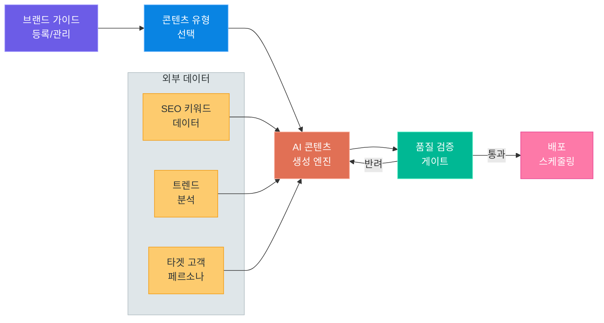
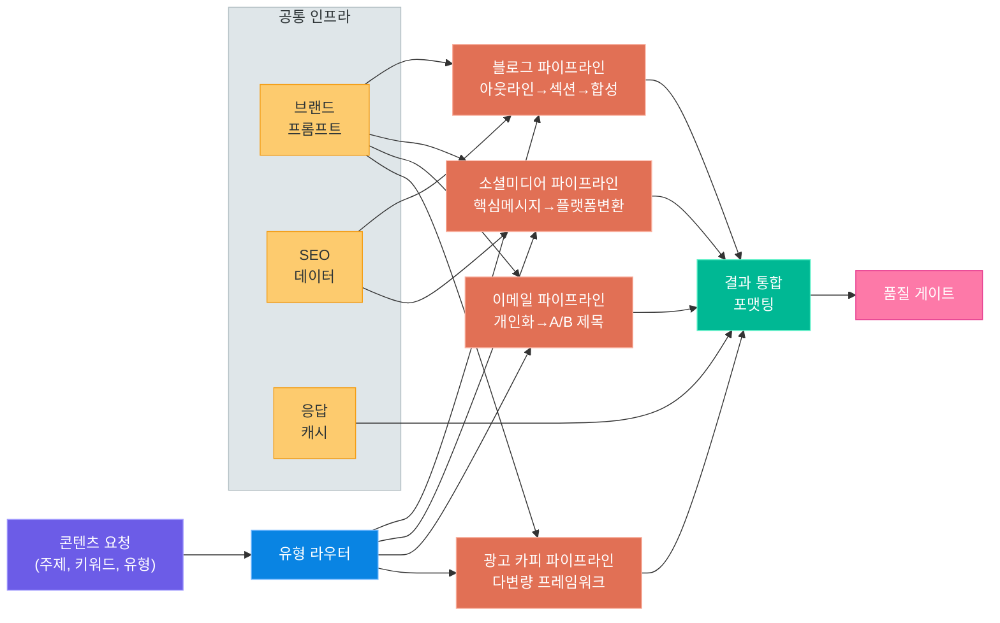
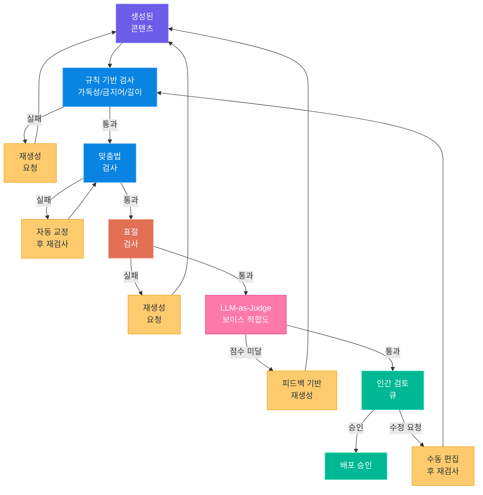
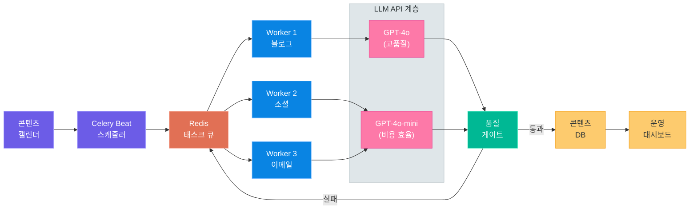

# AI 콘텐츠 생성 서비스 설계

> 브랜드 보이스를 학습한 AI가 블로그, 소셜미디어, 이메일, 광고 카피를 대량으로 생성하고 품질까지 검증하는 서비스 아키텍처를 설계합니다

---

## 1. 서비스 개요

### 1.1 AI 콘텐츠 생성이란

마케팅 팀이 매일 직면하는 현실이 있습니다.
블로그 포스트 2편, 인스타그램 캡션 5개, 뉴스레터 1통, 광고 카피 10벌을 **동시에** 만들어야 합니다.
한 사람이 이 모든 콘텐츠를 일관된 브랜드 톤으로 작성하는 것은 사실상 불가능합니다.

AI 콘텐츠 생성 서비스는 이 문제를 해결합니다.
**브랜드 가이드라인**을 시스템 프롬프트로 변환하고, 콘텐츠 유형별 최적화된 파이프라인을 통해 대량의 콘텐츠를 생성합니다.
생성된 콘텐츠는 자동 품질 게이트를 거쳐 사람의 최종 검토를 받은 뒤 배포됩니다.

### 1.2 현재 시장과 과제

| 구분 | 현황 | 과제 |
|---|---|---|
| **블로그 생성** | GPT 기반 초안 생성 보편화 | 브랜드 톤 유지, 사실 정확성 검증 |
| **소셜미디어** | 플랫폼별 포맷 자동 변환 가능 | 트렌드 반영, 해시태그 최적화 |
| **이메일 마케팅** | 개인화 변수 삽입 자동화 | 스팸 필터 회피, 전환율 최적화 |
| **광고 카피** | A/B 테스트용 다변량 생성 | 법적 규제 준수, 과장 표현 방지 |

> **핵심 포인트:** AI 콘텐츠 생성의 핵심 과제는 "생성" 자체가 아니라 **브랜드 일관성 유지**와 **품질 보증**입니다. 누구나 텍스트를 만들 수 있지만, 브랜드 가치를 담은 텍스트를 안정적으로 만드는 것이 서비스의 차별점입니다.

### 1.3 서비스 전체 아키텍처

이 서비스는 크게 5단계로 구성됩니다.
브랜드 가이드라인 등록부터 콘텐츠 배포까지의 전체 흐름을 먼저 살펴보겠습니다.



각 단계를 이번 강의에서 하나씩 설계해 보겠습니다.

---

## 2. 브랜드 보이스 설계

### 2.1 브랜드 보이스란

브랜드 보이스(Brand Voice)는 브랜드가 고객과 소통할 때 사용하는 **일관된 커뮤니케이션 스타일**입니다.
단순히 "친근하게 써주세요"가 아니라, 아래 세 가지 요소를 체계적으로 정의해야 합니다.

| 요소 | 설명 | 예시 (스타트업 SaaS) |
|---|---|---|
| **톤(Tone)** | 감정적 분위기, 격식 수준 | 전문적이되 친근, 유머 허용, 과장 금지 |
| **어휘(Vocabulary)** | 사용/금지 단어, 전문 용어 수준 | "솔루션" 대신 "방법", "혁신적" 사용 금지 |
| **페르소나(Persona)** | 브랜드가 사람이라면 어떤 사람인가 | 30대 시니어 개발자, 경험 공유하는 멘토 |

### 2.2 브랜드 가이드라인 데이터 구조

브랜드 보이스를 코드로 관리하려면 구조화된 데이터가 필요합니다.
아래는 브랜드 가이드라인을 저장하는 데이터 모델의 핵심 필드입니다.

```python
# brand_voice_schema.py -- 브랜드 보이스 가이드라인 데이터 모델
brand_guide = {
    "brand_name": "TechFlow",
    "tone": {
        "formality": "semi-formal",        # formal / semi-formal / casual
        "emotion": "confident-friendly",    # 자신감 있으면서 친근
        "humor_level": "light",             # none / light / moderate
        "urgency": "low"                    # low / medium / high
    },
    "vocabulary": {
        "preferred": ["효율적인", "직관적인", "실용적인", "검증된"],
        "forbidden": ["혁신적인", "최고의", "완벽한", "획기적인"],
        "jargon_level": "moderate",         # 전문 용어 사용 수준
        "max_sentence_length": 40           # 한 문장 최대 글자 수
    },
    "persona": {
        "age_range": "30-40",
        "role": "시니어 개발자 출신 프로덕트 매니저",
        "speaking_style": "경험을 바탕으로 조언하는 멘토",
        "values": ["실용성", "투명성", "사용자 중심"]
    },
    "content_rules": {
        "cta_style": "soft",                # soft / direct / urgent
        "emoji_usage": "minimal",           # none / minimal / moderate / heavy
        "hashtag_count": {"min": 3, "max": 7}
    }
}
```

### 2.3 시스템 프롬프트 변환

수집된 브랜드 가이드라인을 LLM이 이해할 수 있는 **시스템 프롬프트**로 변환하는 것이 핵심입니다.
단순히 가이드라인을 나열하는 것이 아니라, LLM이 효과적으로 따를 수 있도록 구조화해야 합니다.

```python
# system_prompt_builder.py -- 브랜드 가이드라인 → 시스템 프롬프트 변환
def build_brand_system_prompt(guide: dict) -> str:
    persona = guide["persona"]
    tone = guide["tone"]
    vocab = guide["vocabulary"]

    return f"""당신은 {guide['brand_name']}의 콘텐츠 작성자입니다.

## 페르소나
- {persona['role']}로서 글을 작성합니다
- {persona['speaking_style']}의 태도를 유지합니다
- 핵심 가치: {', '.join(persona['values'])}

## 톤 가이드
- 격식 수준: {tone['formality']}
- 감정 톤: {tone['emotion']}
- 유머: {tone['humor_level']} 수준으로 허용
- 절대 과장하거나 근거 없는 주장을 하지 않습니다

## 어휘 규칙
- 선호 표현: {', '.join(vocab['preferred'])}
- 금지 표현: {', '.join(vocab['forbidden'])}
- 한 문장은 {vocab['max_sentence_length']}자를 넘기지 않습니다
- 전문 용어는 {vocab['jargon_level']} 수준으로 사용합니다

## 필수 규칙
1. 모든 주장에는 근거를 제시합니다
2. 경쟁사를 직접 언급하지 않습니다
3. 사용자의 문제 해결에 초점을 맞춥니다
"""
```

### 2.4 보이스 일관성 유지 전략

대량 생성 환경에서는 LLM의 온도(temperature) 설정, 프롬프트 변동, 모델 업데이트 등으로 인해 보이스가 흔들릴 수 있습니다.
일관성을 유지하기 위한 세 가지 전략을 소개합니다.

| 전략 | 방법 | 효과 |
|---|---|---|
| **Few-shot 앵커링** | 시스템 프롬프트에 3-5개의 "이상적인 콘텐츠" 예시 포함 | 톤과 구조를 명시적으로 시범 |
| **네거티브 프롬프팅** | "이렇게 쓰지 마세요" 예시 포함 | 흔한 실수를 사전 차단 |
| **보이스 스코어링** | 생성 후 LLM-as-Judge로 보이스 적합도 점수 산출 | 기준 이하 콘텐츠를 자동 재생성 |

> **핵심 포인트:** 시스템 프롬프트만으로는 보이스 일관성을 100% 보장할 수 없습니다. **Few-shot 예시 + 사후 검증(LLM-as-Judge)** 조합이 가장 효과적입니다. 특히 금지 표현을 자동으로 탐지하는 후처리 로직은 반드시 포함해야 합니다.

---

## 3. 콘텐츠 유형별 생성 전략

### 3.1 블로그 포스트

블로그는 가장 긴 형태의 콘텐츠입니다.
한 번에 전체를 생성하면 **구조적 일관성**이 떨어지므로, 3단계 파이프라인을 사용합니다.

**1단계: 아웃라인 생성**
- 주제와 키워드를 입력받아 H2/H3 수준의 아웃라인을 생성합니다
- SEO 키워드가 자연스럽게 배치되도록 아웃라인 단계에서 반영합니다

**2단계: 섹션별 생성**
- 아웃라인의 각 섹션을 독립적으로 생성합니다
- 이전 섹션의 요약을 컨텍스트로 전달하여 흐름을 유지합니다

**3단계: 합성 및 마무리**
- 각 섹션을 합치고, 도입부/결론을 다듬습니다
- CTA(Call-to-Action)를 삽입합니다

```python
# blog_generator.py -- 블로그 3단계 파이프라인 핵심 로직
async def generate_blog_post(topic: str, keywords: list, brand_prompt: str):
    # 1단계: 아웃라인 생성
    outline = await llm_call(
        system=brand_prompt,
        user=f"주제: {topic}\n키워드: {', '.join(keywords)}\n"
             f"블로그 포스트의 아웃라인을 H2/H3 수준으로 작성하세요.",
        temperature=0.7
    )

    # 2단계: 섹션별 생성
    sections = parse_outline(outline)
    prev_summary = ""
    generated = []
    for section in sections:
        content = await llm_call(
            system=brand_prompt,
            user=f"이전 내용 요약: {prev_summary}\n"
                 f"작성할 섹션: {section}\n키워드: {', '.join(keywords)}",
            temperature=0.6
        )
        generated.append(content)
        prev_summary = await summarize(content, max_tokens=200)

    # 3단계: 합성 및 마무리
    full_draft = "\n\n".join(generated)
    final = await llm_call(
        system=brand_prompt,
        user=f"아래 블로그 초안의 도입부와 결론을 다듬고 CTA를 추가하세요.\n{full_draft}",
        temperature=0.4
    )
    return final
```

### 3.2 소셜미디어

소셜미디어는 플랫폼마다 **포맷, 길이, 해시태그 규칙**이 다릅니다.
하나의 핵심 메시지에서 플랫폼별 변형을 생성하는 방식이 효율적입니다.

| 플랫폼 | 최적 길이 | 특성 | 포맷 요소 |
|---|---|---|---|
| **인스타그램** | 150-300자 | 감성적, 스토리텔링 | 이모지, 해시태그 5-10개, 줄바꿈 |
| **X (트위터)** | 100-200자 | 간결, 위트 | 해시태그 2-3개, 링크 1개 |
| **링크드인** | 300-600자 | 전문적, 인사이트 | 줄바꿈 많이, 해시태그 3-5개 |
| **페이스북** | 200-400자 | 대화체, 친근 | 이모지, 질문형 마무리 |

```python
# social_media_adapter.py -- 플랫폼별 포맷 변환 프롬프트
PLATFORM_RULES = {
    "instagram": {
        "max_length": 300,
        "style": "감성적이고 스토리텔링 중심. 이모지를 자연스럽게 사용.",
        "hashtag_count": "5-10개",
        "format": "첫 줄에 훅, 중간에 본문, 마지막에 해시태그 블록"
    },
    "twitter": {
        "max_length": 200,
        "style": "간결하고 임팩트 있게. 위트를 살려서.",
        "hashtag_count": "2-3개",
        "format": "한 문장으로 핵심 전달, 해시태그와 링크로 마무리"
    },
    "linkedin": {
        "max_length": 600,
        "style": "전문적이되 접근하기 쉽게. 인사이트 공유 톤.",
        "hashtag_count": "3-5개",
        "format": "훅 → 본문(줄바꿈 활용) → 질문/CTA → 해시태그"
    }
}
```

### 3.3 이메일 마케팅

이메일 마케팅의 핵심은 **개인화(Personalization)** 입니다.
수신자의 이름, 관심사, 이전 행동 데이터를 변수로 삽입하여 개인화된 이메일을 생성합니다.

```python
# email_template.py -- 이메일 개인화 변수 삽입 프롬프트
email_prompt = """
수신자 정보:
- 이름: {recipient_name}
- 관심 분야: {interests}
- 마지막 구매: {last_purchase}
- 세그먼트: {segment}

다음 조건으로 이메일을 작성하세요:
1. 제목줄: 30자 이내, 호기심 유발
2. 프리헤더: 50자 이내, 제목줄 보완
3. 본문: 개인화된 인사 → 가치 제안 → CTA
4. CTA 버튼 텍스트: 행동 유도형, 8자 이내
"""
```

> **핵심 포인트:** 이메일 제목줄의 A/B 테스트는 전환율에 직접적인 영향을 줍니다. 동일한 본문에 대해 제목줄 변형을 5-10개 생성하고, 소규모 그룹에 먼저 발송한 후 성과가 좋은 제목줄로 전체 발송하는 패턴이 효과적입니다.

### 3.4 광고 카피

광고 카피는 짧지만 가장 까다로운 콘텐츠입니다.
A/B 테스트를 위해 하나의 소재에서 **다변량(Multi-variant)** 카피를 생성합니다.

```python
# ad_copy_generator.py -- A/B 테스트용 다변량 광고 카피 생성
ad_prompt = """
제품: {product_name}
핵심 가치: {value_proposition}
타겟: {target_audience}

다음 프레임워크별로 각 3개씩 광고 카피를 생성하세요:

1. AIDA (Attention-Interest-Desire-Action)
   - 헤드라인: 25자 이내
   - 본문: 90자 이내

2. PAS (Problem-Agitate-Solution)
   - 헤드라인: 25자 이내
   - 본문: 90자 이내

3. BAB (Before-After-Bridge)
   - 헤드라인: 25자 이내
   - 본문: 90자 이내

각 카피에 고유 ID를 부여하고 JSON 형식으로 출력하세요.
"""
```

### 3.5 콘텐츠 유형별 파이프라인

각 콘텐츠 유형이 공통 인프라를 어떻게 공유하는지 아래 다이어그램으로 확인할 수 있습니다.



---

## 4. SEO 최적화

### 4.1 키워드 리서치 통합

AI 콘텐츠 생성에서 SEO 최적화는 선택이 아닌 필수입니다.
키워드 리서치 데이터를 생성 파이프라인에 통합하면, **처음부터 검색에 최적화된 콘텐츠**를 만들 수 있습니다.

키워드 데이터의 주요 필드는 다음과 같습니다.

| 필드 | 설명 | 활용 |
|---|---|---|
| **primary_keyword** | 메인 타겟 키워드 | 제목, H1, 메타 디스크립션에 반드시 포함 |
| **secondary_keywords** | 관련 키워드 3-5개 | H2, 본문에 자연스럽게 분산 배치 |
| **search_volume** | 월간 검색량 | 우선순위 결정에 활용 |
| **difficulty** | 경쟁 난이도 (0-100) | 롱테일 vs 빅 키워드 전략 결정 |
| **search_intent** | 검색 의도 (정보/거래/탐색) | 콘텐츠 톤과 CTA 유형 결정 |

```python
# seo_keyword_integration.py -- 키워드 리서치 데이터를 프롬프트에 통합
def build_seo_prompt(keyword_data: dict) -> str:
    primary = keyword_data["primary_keyword"]
    secondary = keyword_data["secondary_keywords"]
    intent = keyword_data["search_intent"]

    return f"""
## SEO 키워드 가이드

### 필수 키워드
- 메인 키워드: "{primary}"
  → 제목, 첫 문단, 결론에 자연스럽게 포함
  → 키워드 밀도: 전체 텍스트의 1-2%

### 보조 키워드
{chr(10).join(f'- "{kw}"' for kw in secondary)}
  → H2 헤딩 또는 본문에 각 1-2회 사용

### 검색 의도: {intent}
{'→ 정보 제공 중심으로 작성. 상세한 설명과 예시 포함.' if intent == 'informational'
 else '→ 제품/서비스 비교, 구매 결정에 도움이 되는 정보 중심.' if intent == 'commercial'
 else '→ 직접적인 행동 유도 CTA 포함.'}

### 주의사항
- 키워드를 억지로 넣지 않습니다. 자연스러운 문맥에서 사용합니다.
- 키워드 스터핑(과도한 반복)은 절대 금지합니다.
"""
```

### 4.2 메타 디스크립션 및 헤딩 최적화

검색 결과 페이지(SERP)에서 클릭률을 결정하는 두 가지 요소는 **제목 태그(Title Tag)** 와 **메타 디스크립션**입니다.
AI가 본문을 생성한 후, 별도의 프롬프트로 메타데이터를 최적화합니다.

| 메타데이터 | 최적 길이 | 최적화 포인트 |
|---|---|---|
| **Title Tag** | 50-60자 | 메인 키워드 앞쪽 배치, 파이프(\|) 구분자 사용 |
| **Meta Description** | 150-160자 | 메인 키워드 포함, 행동 유도 문구, 숫자/데이터 포함 |
| **H1** | 30-50자 | Title Tag와 유사하되 자연어로 다듬기 |
| **H2** | 20-40자 | 보조 키워드 포함, 질문형 활용 |

```python
# seo_metadata_generator.py -- 본문 기반 SEO 메타데이터 자동 생성
seo_meta_prompt = """
아래 블로그 본문을 분석하여 SEO 메타데이터를 생성하세요.

메인 키워드: {primary_keyword}

## 출력 형식 (JSON)
{{
  "title_tag": "50-60자, 메인 키워드를 앞쪽에 배치",
  "meta_description": "150-160자, 행동 유도형 문장",
  "h1": "본문 제목으로 적합한 자연어 헤딩",
  "h2_suggestions": ["보조 키워드를 포함한 H2 헤딩 3-5개"],
  "slug": "url-friendly-slug",
  "og_title": "소셜 공유용 제목 (60자 이내)",
  "og_description": "소셜 공유용 설명 (100자 이내)"
}}

## 본문
{content}
"""
```

### 4.3 내부 링크 제안

SEO에서 **내부 링크(Internal Link)** 는 사이트 구조를 강화하고 페이지 권한을 분배하는 중요한 요소입니다.
기존 콘텐츠 목록을 컨텍스트로 제공하면, AI가 적절한 내부 링크 위치를 제안할 수 있습니다.

```python
# internal_link_suggester.py -- 기존 콘텐츠 기반 내부 링크 제안
def suggest_internal_links(new_content: str, existing_pages: list) -> str:
    pages_context = "\n".join(
        f"- [{p['title']}]({p['url']}): {p['summary']}"
        for p in existing_pages
    )

    prompt = f"""아래 새 콘텐츠에 내부 링크를 제안하세요.

## 기존 페이지 목록
{pages_context}

## 새 콘텐츠
{new_content}

## 출력 형식
각 제안에 대해:
1. 링크를 삽입할 텍스트(앵커 텍스트)
2. 연결할 기존 페이지 URL
3. 삽입 위치(몇 번째 문단)
4. 연관성 점수(1-10)
"""
    return prompt
```

> **핵심 포인트:** SEO 최적화는 콘텐츠 생성의 **사전 단계(키워드 리서치)** 와 **사후 단계(메타데이터, 내부 링크)** 양쪽에서 이루어져야 합니다. 생성 중에는 키워드를 자연스럽게 녹이고, 생성 후에는 메타데이터를 별도로 최적화하는 2단계 접근이 효과적입니다.

---

## 5. 품질 게이트

### 5.1 자동 품질 검사

AI가 생성한 콘텐츠를 그대로 배포할 수는 없습니다.
자동화된 품질 검사 파이프라인을 통해 기본적인 품질 기준을 먼저 확인합니다.

| 검사 항목 | 도구/방법 | 기준 |
|---|---|---|
| **가독성 점수** | 평균 문장 길이, 한자어 비율 | 문장 평균 30자 이하, 한자어 20% 이하 |
| **오탈자 검사** | 맞춤법 검사 API (부산대 맞춤법 등) | 오류 0건 |
| **금지어 탐지** | 정규식 + 브랜드 가이드라인 | 금지 표현 0건 |
| **키워드 밀도** | 토큰 카운트 기반 | 메인 키워드 1-2% |
| **콘텐츠 길이** | 글자 수 카운트 | 유형별 최소/최대 범위 이내 |
| **링크 유효성** | HTTP HEAD 요청 | 모든 링크 200 응답 |

```python
# quality_gate.py -- 자동 품질 검사 로직
class QualityGate:
    def __init__(self, brand_guide: dict):
        self.forbidden_words = brand_guide["vocabulary"]["forbidden"]
        self.max_sentence_len = brand_guide["vocabulary"]["max_sentence_length"]

    def check_readability(self, text: str) -> dict:
        sentences = text.split(".")
        avg_len = sum(len(s.strip()) for s in sentences if s.strip()) / max(len(sentences), 1)
        return {
            "check": "readability",
            "passed": avg_len <= self.max_sentence_len,
            "avg_sentence_length": round(avg_len, 1),
            "threshold": self.max_sentence_len
        }

    def check_forbidden_words(self, text: str) -> dict:
        found = [w for w in self.forbidden_words if w in text]
        return {
            "check": "forbidden_words",
            "passed": len(found) == 0,
            "found": found
        }

    def check_keyword_density(self, text: str, keyword: str) -> dict:
        total_chars = len(text)
        keyword_count = text.count(keyword)
        density = (keyword_count * len(keyword)) / max(total_chars, 1) * 100
        return {
            "check": "keyword_density",
            "passed": 0.5 <= density <= 3.0,
            "density_percent": round(density, 2)
        }

    def run_all(self, text: str, keyword: str) -> list:
        return [
            self.check_readability(text),
            self.check_forbidden_words(text),
            self.check_keyword_density(text, keyword),
        ]
```

### 5.2 LLM-as-Judge: 브랜드 보이스 적합도

규칙 기반 검사로는 잡을 수 없는 **톤, 뉘앙스, 브랜드 적합도**를 평가하기 위해 LLM을 판정자(Judge)로 활용합니다.
별도의 LLM 호출로 생성된 콘텐츠를 브랜드 가이드라인 기준으로 점수를 매깁니다.

```python
# llm_judge.py -- LLM-as-Judge 브랜드 보이스 평가
judge_prompt = """
당신은 브랜드 콘텐츠 품질 평가 전문가입니다.
아래 브랜드 가이드라인을 기준으로 콘텐츠를 평가하세요.

## 브랜드 가이드라인
{brand_guidelines}

## 평가할 콘텐츠
{content}

## 평가 기준 (각 항목 1-10점)

1. **톤 적합도**: 브랜드의 톤 가이드에 맞는가?
2. **어휘 적합도**: 선호/금지 표현 규칙을 따르는가?
3. **페르소나 일관성**: 정의된 페르소나와 일치하는가?
4. **메시지 명확성**: 핵심 메시지가 명확히 전달되는가?
5. **CTA 효과성**: 행동 유도가 자연스럽고 효과적인가?

## 출력 형식 (JSON)
{{
  "scores": {{
    "tone": 8,
    "vocabulary": 9,
    "persona": 7,
    "clarity": 8,
    "cta": 6
  }},
  "total": 38,
  "max_total": 50,
  "pass": true,
  "feedback": "구체적인 개선 피드백",
  "rewrite_suggestions": ["수정이 필요한 부분과 제안"]
}}

pass 기준: total >= 35 (70%)
"""
```

### 5.3 인간 검토 워크플로

자동 품질 게이트를 통과한 콘텐츠라도, 최종 배포 전에는 사람의 검토가 필요합니다.
인간 검토 워크플로는 콘텐츠 유형과 리스크 수준에 따라 다르게 설계합니다.

| 리스크 수준 | 콘텐츠 유형 | 검토 프로세스 |
|---|---|---|
| **높음** | 광고 카피, 법적 문구 | 작성자 → 브랜드 매니저 → 법무팀 → 배포 |
| **중간** | 블로그, 이메일 | 작성자 → 에디터 → 배포 |
| **낮음** | 소셜미디어 캡션 | 자동 품질 게이트 통과 시 자동 배포 |

### 5.4 표절 검사

AI가 학습 데이터를 그대로 출력하는 **기억 역류(memorization)** 문제가 있습니다.
표절 검사는 법적 리스크를 방지하기 위해 반드시 포함해야 합니다.

표절 검사의 주요 접근 방식은 다음과 같습니다.

| 방식 | 설명 | 장단점 |
|---|---|---|
| **N-gram 비교** | 생성 텍스트의 n-gram을 웹 검색으로 비교 | 빠르지만 패러프레이징에 약함 |
| **임베딩 유사도** | 문장 임베딩으로 기존 콘텐츠와 유사도 측정 | 의미적 유사성 탐지 가능, 비용 발생 |
| **외부 API** | Copyscape, Originality.ai 등 | 가장 정확하지만 비용이 높음 |

```python
# plagiarism_checker.py -- 임베딩 기반 표절 검사 핵심 로직
async def check_plagiarism(text: str, reference_db, threshold: float = 0.92):
    """생성된 텍스트를 문장 단위로 분리하여 표절 검사"""
    sentences = split_sentences(text)
    embeddings = await get_embeddings(sentences)

    flagged = []
    for i, (sent, emb) in enumerate(zip(sentences, embeddings)):
        matches = reference_db.similarity_search(emb, top_k=3)
        for match in matches:
            if match.score >= threshold:
                flagged.append({
                    "sentence_index": i,
                    "sentence": sent,
                    "similar_source": match.text,
                    "similarity": round(match.score, 4),
                    "source_url": match.metadata.get("url", "unknown")
                })

    return {
        "total_sentences": len(sentences),
        "flagged_count": len(flagged),
        "plagiarism_rate": len(flagged) / max(len(sentences), 1),
        "passed": len(flagged) == 0,
        "details": flagged
    }
```

### 5.5 품질 게이트 파이프라인

모든 검사가 어떤 순서로 실행되는지 아래 다이어그램에서 확인할 수 있습니다.
비용이 낮은 검사부터 실행하여, 초기 단계에서 불합격 콘텐츠를 빠르게 걸러냅니다.



> **핵심 포인트:** 품질 게이트는 **비용 순서대로** 설계합니다. 정규식 기반 규칙 검사(무료)를 가장 먼저 실행하고, LLM-as-Judge(비용 발생)는 마지막에 실행합니다. 이렇게 하면 불합격 콘텐츠에 불필요한 LLM 비용을 소모하지 않습니다.

---

## 6. 대량 생성과 운영

### 6.1 배치 처리 아키텍처

마케팅 팀이 한 번에 100개의 소셜미디어 포스트를 생성해야 한다면, 동기식 처리로는 시간이 너무 오래 걸립니다.
**비동기 태스크 큐**를 활용한 배치 처리 아키텍처가 필요합니다.

```python
# batch_processor.py -- Celery 기반 배치 콘텐츠 생성 태스크
from celery import Celery, group

app = Celery("content_gen", broker="redis://localhost:6379/0")

@app.task(bind=True, max_retries=3, rate_limit="30/m")
def generate_single_content(self, content_request: dict):
    """단일 콘텐츠 생성 태스크 (rate_limit으로 API 호출 제한)"""
    try:
        result = call_llm_api(
            system_prompt=content_request["brand_prompt"],
            user_prompt=content_request["generation_prompt"],
            model=content_request.get("model", "gpt-4o-mini")
        )
        quality_result = run_quality_gate(result, content_request)
        if not quality_result["passed"]:
            # 품질 미달 시 재시도
            raise self.retry(countdown=10)
        return {"status": "success", "content": result, "quality": quality_result}
    except LLMAPIError as e:
        raise self.retry(exc=e, countdown=30)

def batch_generate(requests: list[dict]) -> str:
    """여러 콘텐츠 생성 요청을 병렬로 처리"""
    job = group(generate_single_content.s(req) for req in requests)
    result = job.apply_async()
    return result.id  # 배치 작업 ID 반환
```

### 6.2 스케줄링: 콘텐츠 캘린더 연동

콘텐츠 캘린더와 연동하면, **예약된 날짜에 맞춰 자동으로 콘텐츠를 생성하고 검토 큐에 넣는** 워크플로를 구현할 수 있습니다.

| 타이밍 | 자동화 항목 | 설명 |
|---|---|---|
| **D-7** | 키워드 리서치 | 최신 검색 트렌드 반영 |
| **D-5** | 콘텐츠 생성 | 배치 처리로 초안 생성 |
| **D-3** | 품질 검사 | 자동 게이트 + LLM-as-Judge |
| **D-2** | 인간 검토 | 에디터에게 검토 요청 알림 |
| **D-0** | 자동 배포 | 승인된 콘텐츠 자동 발행 |

```python
# content_scheduler.py -- 콘텐츠 캘린더 기반 자동 스케줄링
from celery.schedules import crontab

app.conf.beat_schedule = {
    "generate-weekly-blog": {
        "task": "tasks.batch_generate_from_calendar",
        "schedule": crontab(hour=9, minute=0, day_of_week=1),  # 매주 월요일 9시
        "args": ({"content_type": "blog", "lookahead_days": 7},)
    },
    "generate-daily-social": {
        "task": "tasks.batch_generate_from_calendar",
        "schedule": crontab(hour=7, minute=0),  # 매일 7시
        "args": ({"content_type": "social", "lookahead_days": 3},)
    },
}
```

### 6.3 비용 관리: 모델별 트레이드오프

대량 생성 서비스에서 LLM API 비용은 운영비의 핵심입니다.
콘텐츠 유형별로 **비용 대비 품질이 최적인 모델**을 선택하는 전략이 필요합니다.

| 콘텐츠 유형 | 추천 모델 | 이유 | 예상 비용(1건) |
|---|---|---|---|
| **블로그 (2000자)** | GPT-4o | 긴 글의 구조적 일관성 필요 | ~$0.03 |
| **소셜미디어 캡션** | GPT-4o-mini | 짧은 텍스트, 비용 효율 | ~$0.002 |
| **이메일 제목줄** | GPT-4o-mini | 짧은 변형 다량 생성 | ~$0.001 |
| **광고 카피** | GPT-4o | 정교한 표현력 필요 | ~$0.02 |
| **LLM-as-Judge** | GPT-4o | 판정 정확도가 중요 | ~$0.01 |

> **핵심 포인트:** 월간 콘텐츠 1,000건 기준으로, 모든 콘텐츠에 GPT-4o를 사용하면 약 $30이지만, 유형별 최적 모델을 적용하면 약 $10으로 줄일 수 있습니다. 소셜미디어와 이메일 제목처럼 짧고 단순한 콘텐츠에는 경량 모델을 적극 활용하세요.

### 6.4 배치 처리 아키텍처 다이어그램

전체 배치 처리 시스템의 구성 요소와 데이터 흐름을 정리합니다.



---

## 7. 핵심 정리

### 7.1 AI 콘텐츠 생성 서비스 설계 체크리스트

이번 강의에서 다룬 핵심 설계 요소를 체크리스트로 정리합니다.
서비스를 설계하거나 검토할 때 아래 항목을 확인하세요.

#### 브랜드 보이스 설계

| 체크 항목 | 설명 | 상태 |
|---|---|---|
| 톤/어휘/페르소나 정의 | 3요소가 구조화된 데이터로 관리되는가 | |
| 시스템 프롬프트 변환 | 브랜드 가이드가 LLM 프롬프트로 자동 변환되는가 | |
| Few-shot 앵커링 | 이상적인 예시가 프롬프트에 포함되는가 | |
| 네거티브 프롬프팅 | 금지 패턴이 명시적으로 지시되는가 | |

#### 콘텐츠 생성 파이프라인

| 체크 항목 | 설명 | 상태 |
|---|---|---|
| 유형별 파이프라인 분리 | 블로그/소셜/이메일/광고가 각각 최적화되었는가 | |
| SEO 키워드 통합 | 키워드 리서치가 생성 파이프라인에 반영되는가 | |
| 메타데이터 자동 생성 | Title, Meta Description이 자동 최적화되는가 | |
| 내부 링크 제안 | 기존 콘텐츠와의 연결이 자동 제안되는가 | |

#### 품질 게이트

| 체크 항목 | 설명 | 상태 |
|---|---|---|
| 규칙 기반 검사 | 가독성, 금지어, 키워드 밀도가 자동 검사되는가 | |
| 맞춤법 검사 | 오탈자가 자동으로 탐지/교정되는가 | |
| 표절 검사 | AI 기억 역류에 의한 표절이 탐지되는가 | |
| LLM-as-Judge | 브랜드 보이스 적합도가 자동 평가되는가 | |
| 인간 검토 워크플로 | 리스크 수준별 검토 프로세스가 설계되었는가 | |

#### 운영 인프라

| 체크 항목 | 설명 | 상태 |
|---|---|---|
| 배치 처리 | Celery 등 비동기 큐로 대량 생성이 가능한가 | |
| 스케줄링 | 콘텐츠 캘린더와 자동 연동되는가 | |
| 모델 비용 최적화 | 유형별 최적 모델이 선택되는가 | |
| 모니터링 | 생성 성공률, 품질 점수, 비용이 추적되는가 | |

### 7.2 설계 시 흔한 실수와 대응

| 실수 | 왜 문제인가 | 대응 방안 |
|---|---|---|
| 모든 콘텐츠에 동일 프롬프트 사용 | 유형별 최적화 불가, 품질 편차 | 유형별 전용 프롬프트 템플릿 관리 |
| 품질 검사 없이 자동 배포 | 브랜드 훼손, 법적 리스크 | 최소 3단계 품질 게이트 적용 |
| 비용 관리 미수립 | 예상치 못한 API 비용 폭증 | 유형별 모델 선택 + rate limit 설정 |
| 브랜드 가이드 미갱신 | 시간이 지나면 브랜드 톤이 변화 | 분기별 가이드라인 리뷰 프로세스 |
| 표절 검사 미적용 | 저작권 침해 소송 리스크 | 임베딩 기반 + 외부 API 이중 검사 |

### 7.3 핵심 아키텍처 패턴 요약

이번 강의에서 설계한 서비스의 핵심 패턴을 정리합니다.

| 패턴 | 적용 위치 | 효과 |
|---|---|---|
| **프롬프트 팩토리** | 브랜드 가이드 → 시스템 프롬프트 | 가이드 변경 시 프롬프트 자동 갱신 |
| **파이프라인 분기** | 콘텐츠 유형별 라우팅 | 유형별 최적화된 생성 전략 적용 |
| **다단계 생성** | 블로그: 아웃라인→섹션→합성 | 긴 콘텐츠의 구조적 일관성 확보 |
| **비용 순서 게이트** | 품질 검사 단계 설계 | 불필요한 LLM 비용 절감 |
| **비동기 배치** | Celery + Redis 태스크 큐 | 대량 생성의 확장성 확보 |

> **핵심 포인트:** AI 콘텐츠 생성 서비스의 핵심은 "AI가 글을 쓴다"가 아니라 **"브랜드의 목소리로 일관되게, 대량으로, 품질을 보장하며"** 글을 쓴다는 것입니다. 이를 위해 브랜드 보이스 설계, 유형별 파이프라인, 다단계 품질 게이트, 배치 처리 인프라가 유기적으로 결합되어야 합니다.

### 7.4 다음 강의 안내

이번 강의에서는 AI가 콘텐츠를 **생성하는 서비스**를 설계했습니다.
다음 강의에서는 이 콘텐츠 생성 엔진을 포함한 다양한 AI 기능을 **SaaS로 서비스하기 위한 모델 관리 플랫폼**을 설계합니다.

다음 강의에서 다룰 핵심 주제는 다음과 같습니다.
- 멀티 모델 라우팅: 요청에 따라 최적의 LLM을 자동 선택
- API 게이트웨이: 인증, 과금, Rate Limiting 통합 관리
- 모델 버전 관리: 프롬프트와 모델 버전의 추적/롤백
- SaaS 과금 모델: 토큰 기반 vs 기능 기반 과금 설계

---
