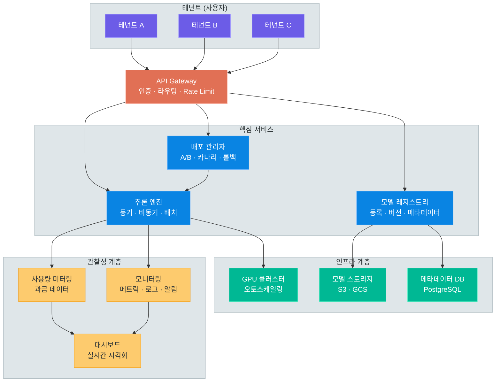
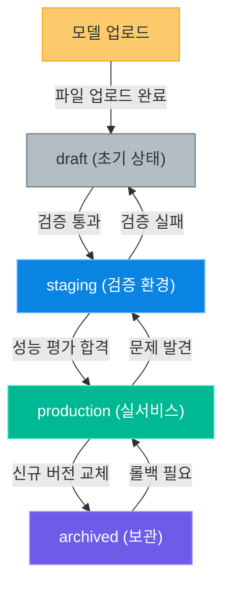
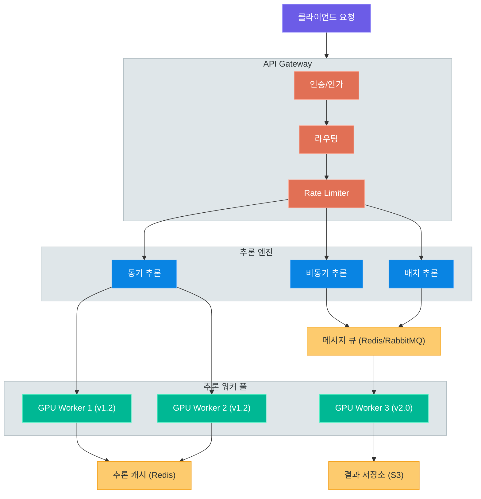
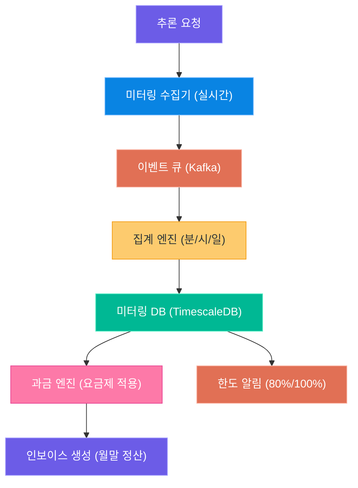
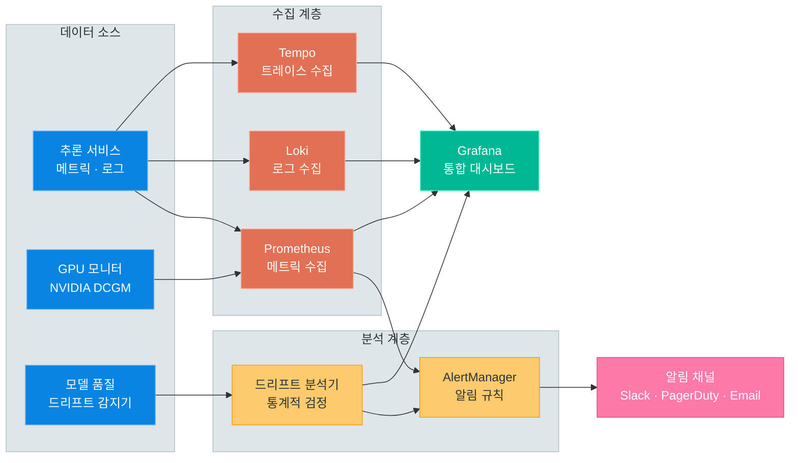

# 모델 관리 및 추론 SaaS 서비스 설계

> 모델 등록부터 버전 관리, 추론 서빙, 과금, 모니터링까지 — MLOps SaaS 플랫폼을 설계하는 데 필요한 핵심 아키텍처와 전략을 학습합니다

---

## 1. 서비스 개요

### MLOps SaaS란 무엇인가

**MLOps SaaS**란 머신러닝 모델의 전체 라이프사이클을 클라우드 기반 서비스로 제공하는 플랫폼을 의미합니다. 사용자는 자신이 학습한 모델을 등록하고, 버전을 관리하며, API를 통해 추론을 수행하고, 사용량에 따라 과금되는 통합 환경을 이용합니다.

기존에는 모델을 학습한 뒤 서빙하려면 인프라 구축, 컨테이너화, 로드밸런싱, 모니터링 등을 직접 구성해야 했습니다. MLOps SaaS는 이 모든 과정을 추상화하여 개발자가 **모델 개발에만 집중**할 수 있도록 합니다.

### 대표 서비스 비교

| 서비스 | 특징 | 강점 | 주요 사용 사례 |
|--------|------|------|----------------|
| **Replicate** | 커뮤니티 모델 마켓플레이스 | 원클릭 배포, GPU 자동 할당 | 이미지 생성, 오픈소스 LLM |
| **Hugging Face Inference Endpoints** | Hub 생태계 통합 | 모델 허브 연동, 다양한 프레임워크 | NLP, 트랜스포머 모델 |
| **AWS SageMaker** | 엔터프라이즈급 MLOps | 전체 ML 파이프라인, 보안/컴플라이언스 | 대규모 프로덕션 배포 |
| **Google Vertex AI** | GCP 네이티브 | AutoML, 파이프라인 자동화 | 멀티모달, 커스텀 모델 |
| **Azure ML** | 엔터프라이즈 통합 | Active Directory 연동, 하이브리드 클라우드 | 기업 내부 AI 서비스 |

### 핵심 기능 목록

MLOps SaaS 플랫폼이 제공해야 하는 핵심 기능은 다음과 같습니다.

| 영역 | 핵심 기능 | 설명 |
|------|-----------|------|
| **모델 관리** | 모델 등록, 버전 관리, 메타데이터 | 모델 파일 업로드와 이력 추적 |
| **추론 서빙** | 동기/비동기 API, 배치 추론 | 실시간 및 대량 추론 처리 |
| **인프라** | 오토스케일링, GPU 관리 | 트래픽에 따른 자원 자동 조정 |
| **보안** | 다중 테넌트, 인증/인가 | 테넌트 격리와 API 키 관리 |
| **배포** | A/B 테스트, 카나리 배포, 롤백 | 안전한 모델 교체 전략 |
| **과금** | 사용량 미터링, 요금제 관리 | 토큰/요청/시간 기반 과금 |
| **모니터링** | 레이턴시, 에러율, 드리프트 감지 | 실시간 서비스 상태 관찰 |

### 전체 아키텍처



> **핵심 포인트:** MLOps SaaS는 "모델을 학습한 다음에 무엇을 할 것인가?"라는 질문에 대한 종합적인 해답입니다. 모델 등록부터 서빙, 과금, 모니터링까지 전체 파이프라인을 단일 플랫폼에서 제공합니다.

---

## 2. 다중 테넌트 설계

### 멀티 테넌시의 필요성

SaaS 플랫폼에서 **멀티 테넌시(Multi-Tenancy)**는 하나의 애플리케이션 인스턴스로 여러 고객(테넌트)을 동시에 서비스하는 아키텍처입니다. MLOps SaaS에서 멀티 테넌시는 특히 중요합니다. 각 테넌트는 자신만의 모델, 데이터, API 키를 보유하며, 다른 테넌트의 리소스에 절대 접근할 수 없어야 합니다.

멀티 테넌시를 도입하는 핵심 이유는 다음과 같습니다.

- **비용 효율**: 인프라를 공유하여 테넌트당 운영 비용을 낮춥니다
- **운영 효율**: 단일 코드베이스로 모든 테넌트를 관리합니다
- **빠른 온보딩**: 새 테넌트 추가 시 별도 인프라 구축이 불필요합니다
- **일관된 업데이트**: 플랫폼 업데이트가 모든 테넌트에 동시 적용됩니다

반면 주의해야 할 위험 요소도 존재합니다.

- **Noisy Neighbor 문제**: 한 테넌트의 과도한 사용이 다른 테넌트에 영향
- **보안 경계**: 테넌트 간 데이터 유출 가능성
- **커스터마이징 제한**: 테넌트별 특수 요구사항 수용 어려움

### 테넌트 격리 전략

테넌트 격리는 보안의 핵심입니다. 격리 수준에 따라 세 가지 전략이 존재합니다.

| 전략 | 격리 수준 | 비용 | 관리 복잡도 | 적합 시나리오 |
|------|-----------|------|-------------|---------------|
| **DB 인스턴스 분리** | 최고 | 높음 | 높음 | 엔터프라이즈, 규제 산업 |
| **스키마 분리** | 중간 | 중간 | 중간 | 중간 규모 SaaS |
| **행 수준 격리 (RLS)** | 기본 | 낮음 | 낮음 | 스타트업, MVP |

**DB 인스턴스 분리**는 테넌트마다 별도의 데이터베이스 인스턴스를 운영합니다. 완벽한 격리를 보장하지만, 테넌트 수가 늘어날수록 운영 비용이 급격히 증가합니다.

**스키마 분리**는 하나의 데이터베이스 안에서 테넌트별 스키마를 생성합니다. PostgreSQL의 `CREATE SCHEMA tenant_abc` 같은 방식으로 논리적 격리를 제공합니다.

**행 수준 격리(Row-Level Security, RLS)**는 모든 테넌트가 같은 테이블을 공유하되, `tenant_id` 컬럼과 정책으로 접근을 제어합니다. 가장 비용 효율적이지만, 설계 실수 시 데이터 유출 위험이 있습니다.

### API 키/인증 체계

MLOps SaaS의 인증 체계는 보통 다음과 같은 계층 구조를 가집니다.

| 인증 요소 | 역할 | 예시 |
|-----------|------|------|
| **API 키** | 테넌트 식별 + 기본 인증 | `sk-tenant-abc-xxxx` |
| **시크릿 키** | 관리 작업 인증 | 모델 등록/삭제, 설정 변경 |
| **JWT 토큰** | 세션 기반 사용자 인증 | 대시보드 접근, 웹 UI |
| **OAuth 2.0** | 서드파티 통합 | CI/CD 파이프라인 연동 |

API 키는 요청 헤더에 포함되어 전달되며, 미들웨어에서 키의 유효성을 검증하고 해당 테넌트의 컨텍스트를 설정합니다. API 키의 보안을 위해 다음 원칙을 지켜야 합니다.

- API 키는 해싱하여 저장합니다 (평문 저장 금지)
- 키 로테이션(갱신) 기능을 제공합니다
- 키별 권한 범위(scope)를 설정할 수 있어야 합니다
- 키 사용 이력을 감사 로그로 기록합니다

### 테넌트별 리소스 할당과 제한

각 테넌트는 요금제에 따라 다른 리소스 제한을 가집니다. 이를 통해 한 테넌트의 과도한 사용이 다른 테넌트에 영향을 미치는 것을 방지합니다.

| 리소스 | Free | Pro | Enterprise |
|--------|------|-----|------------|
| 모델 등록 수 | 3 | 50 | 무제한 |
| 동시 추론 요청 | 5 | 100 | 커스텀 |
| GPU 인스턴스 | 공유 | 전용 1개 | 전용 N개 |
| 모델 파일 크기 | 1GB | 10GB | 100GB |
| API 호출/분 | 60 | 1,000 | 커스텀 |

### 테넌트 미들웨어 구현

```python
# middleware/tenant.py -- 테넌트 인증 및 컨텍스트 설정 미들웨어
from fastapi import Request, HTTPException
from functools import wraps
import hashlib

class TenantContext:
    """요청별 테넌트 정보를 저장하는 컨텍스트"""
    def __init__(self, tenant_id: str, plan: str, rate_limit: int):
        self.tenant_id = tenant_id
        self.plan = plan
        self.rate_limit = rate_limit

async def tenant_middleware(request: Request, call_next):
    api_key = request.headers.get("X-API-Key")
    if not api_key:
        raise HTTPException(status_code=401, detail="API key required")

    # API 키로 테넌트 조회
    tenant = await get_tenant_by_api_key(api_key)
    if not tenant:
        raise HTTPException(status_code=403, detail="Invalid API key")

    # Rate Limit 검사
    current_usage = await get_current_rate(tenant.tenant_id)
    if current_usage >= tenant.rate_limit:
        raise HTTPException(status_code=429, detail="Rate limit exceeded")

    # 요청 컨텍스트에 테넌트 정보 주입
    request.state.tenant = TenantContext(
        tenant_id=tenant.tenant_id,
        plan=tenant.plan,
        rate_limit=tenant.rate_limit,
    )
    response = await call_next(request)
    return response
```

> **핵심 포인트:** 멀티 테넌시 설계에서 가장 중요한 것은 **격리와 효율의 균형**입니다. 초기에는 행 수준 격리(RLS)로 시작하되, 엔터프라이즈 고객에게는 스키마 분리 또는 DB 인스턴스 분리를 제공하는 하이브리드 전략이 현실적입니다.

---

## 3. 모델 레지스트리

### 모델 레지스트리의 역할

모델 레지스트리는 MLOps SaaS의 핵심 컴포넌트입니다. 소프트웨어 개발에서 Git이 코드 버전을 관리하듯, 모델 레지스트리는 ML 모델의 전체 이력을 관리합니다. 사용자가 학습한 모델을 플랫폼에 등록하고, 메타데이터를 관리하며, 서빙 가능한 상태로 배포하는 전체 흐름을 담당합니다.

모델 레지스트리가 없으면 다음과 같은 문제가 발생합니다.

- 어떤 모델이 현재 프로덕션에서 서빙 중인지 알 수 없습니다
- 이전 버전으로 롤백하고 싶어도 해당 모델 파일을 찾을 수 없습니다
- 모델 성능이 왜 갑자기 변했는지 원인을 추적할 수 없습니다
- 여러 팀이 동일한 모델을 중복으로 학습하고 등록합니다

### 모델 등록 프로세스

모델 등록은 단순한 파일 업로드가 아닙니다. 모델 파일의 무결성 검증, 포맷 호환성 확인, 메타데이터 추출까지 자동으로 수행됩니다.

모델을 등록할 때 필요한 핵심 정보는 다음과 같습니다.

| 필드 | 필수 | 설명 | 예시 |
|------|------|------|------|
| `name` | O | 모델 이름 (테넌트 내 고유) | `sentiment-classifier` |
| `framework` | O | 모델 프레임워크 | `pytorch`, `tensorflow`, `onnx` |
| `task_type` | O | 모델 태스크 유형 | `text-classification`, `text-generation` |
| `model_file` | O | 모델 가중치 파일 | `.pt`, `.safetensors`, `.onnx` |
| `config` | X | 모델 설정 파일 | `config.json`, `tokenizer.json` |
| `description` | X | 모델 설명 | 한국어 감성 분류 모델 v2 |
| `tags` | X | 검색/분류용 태그 | `["korean", "sentiment", "bert"]` |

### 버전 관리: Semantic Versioning

모델 버전 관리는 소프트웨어의 Semantic Versioning(SemVer)을 차용합니다. 다만 ML 모델의 특성을 반영하여 의미를 확장합니다.

| 버전 구분 | 변경 대상 | 호환성 | 예시 |
|-----------|-----------|--------|------|
| **Major (X.0.0)** | 모델 아키텍처 변경 | 비호환 (입출력 스키마 변경) | `1.0.0 → 2.0.0` |
| **Minor (0.X.0)** | 재학습, 데이터 추가 | 호환 (동일 입출력) | `1.0.0 → 1.1.0` |
| **Patch (0.0.X)** | 양자화, 최적화 | 호환 (동일 결과 기대) | `1.1.0 → 1.1.1` |

각 버전에는 메타데이터가 함께 저장되어 추적성을 보장합니다. 메타데이터에는 다음과 같은 정보가 포함됩니다.

| 메타데이터 | 설명 | 예시 |
|------------|------|------|
| `dataset_hash` | 학습 데이터셋의 해시값 | `sha256:a1b2c3...` |
| `metrics` | 평가 메트릭 | `{"accuracy": 0.94, "f1": 0.91}` |
| `hyperparameters` | 학습 하이퍼파라미터 | `{"lr": 0.001, "epochs": 10}` |
| `created_at` | 버전 생성 일시 | `2026-04-20T09:30:00Z` |
| `created_by` | 생성자 | `user@company.com` |
| `parent_version` | 이전 버전 참조 | `1.0.0` |
| `commit_hash` | 학습 코드의 Git 커밋 | `abc1234` |

### 모델 상태 관리

모델은 생성부터 폐기까지 명확한 상태 전이를 거칩니다. 각 상태에서 허용되는 작업과 전이 조건을 정의하는 것이 중요합니다.

| 상태 | 설명 | 허용 작업 | 전이 대상 |
|------|------|-----------|-----------|
| **draft** | 업로드 직후 초기 상태 | 수정, 삭제, 검증 | staging |
| **staging** | 테스트/검증 환경 배포 | 테스트 추론, 성능 평가 | production, draft |
| **production** | 실서비스 배포 완료 | 실 추론 서빙 | archived, staging |
| **archived** | 더 이상 서빙하지 않음 | 조회만 가능 | production (복원) |

### 모델 라이프사이클 상태 다이어그램



### 모델 등록 API 스키마

```python
# schemas/model.py -- 모델 등록/조회 API 스키마 정의
from pydantic import BaseModel, Field
from enum import Enum
from datetime import datetime

class Framework(str, Enum):
    PYTORCH = "pytorch"
    TENSORFLOW = "tensorflow"
    ONNX = "onnx"
    HUGGINGFACE = "huggingface"

class ModelStatus(str, Enum):
    DRAFT = "draft"
    STAGING = "staging"
    PRODUCTION = "production"
    ARCHIVED = "archived"

class ModelCreateRequest(BaseModel):
    name: str = Field(..., min_length=3, max_length=64, pattern=r"^[a-z0-9-]+$")
    framework: Framework
    task_type: str = Field(..., description="text-classification, text-generation 등")
    description: str | None = None
    tags: list[str] = Field(default_factory=list)
    config: dict | None = None

class ModelVersionResponse(BaseModel):
    model_id: str
    version: str
    status: ModelStatus
    framework: Framework
    created_at: datetime
    metrics: dict | None = None
    file_size_mb: float
    download_url: str | None = None
```

> **핵심 포인트:** 모델 레지스트리는 "코드의 Git"에 해당합니다. 모든 변경 이력을 추적하고, 상태 전이를 통해 안전한 배포를 보장합니다. Semantic Versioning을 적용하면 모델 업데이트의 영향 범위를 명확히 전달할 수 있습니다.

---

## 4. 추론 엔진

### 추론 엔진의 역할

추론 엔진은 MLOps SaaS에서 가장 핵심적인 런타임 컴포넌트입니다. 등록된 모델을 메모리에 로드하고, 사용자의 요청을 받아 예측 결과를 반환합니다. 높은 처리량(throughput)과 낮은 지연 시간(latency)을 동시에 달성하는 것이 설계의 핵심 과제입니다.

추론 엔진이 해결해야 하는 핵심 문제는 다음과 같습니다.

- **콜드 스타트**: 모델을 처음 로드할 때 수십 초가 소요될 수 있습니다. 사전 로딩(pre-warming)과 모델 캐싱으로 완화합니다.
- **메모리 관리**: 대형 LLM은 수십 GB의 GPU 메모리를 차지합니다. 여러 모델을 효율적으로 로드/언로드하는 전략이 필요합니다.
- **동시성**: 다수의 동시 요청을 처리하면서도 개별 요청의 레이턴시를 유지해야 합니다.
- **이기종 모델 지원**: PyTorch, TensorFlow, ONNX 등 다양한 프레임워크의 모델을 통합 서빙해야 합니다.

### 동기/비동기 추론 API

추론 API는 사용 사례에 따라 두 가지 모드를 제공합니다.

| 모드 | 특징 | 응답 방식 | 적합 사례 |
|------|------|-----------|-----------|
| **동기 추론** | 요청 즉시 응답 | HTTP 200 + 결과 | 실시간 챗봇, 감성 분석 |
| **비동기 추론** | 작업 제출 후 폴링/웹훅 | HTTP 202 + job_id | 대용량 이미지 생성, 배치 처리 |

동기 추론은 사용자가 결과를 즉시 기대하는 상황에 적합합니다. 요청이 들어오면 모델에 입력을 전달하고, 추론이 완료될 때까지 연결을 유지한 뒤 결과를 반환합니다.

비동기 추론은 처리 시간이 긴 작업에 사용됩니다. 요청 접수 후 즉시 `job_id`를 반환하고, 클라이언트는 이를 사용해 상태를 폴링하거나 웹훅 콜백을 설정합니다.

### 오토스케일링: 요청량 기반 인스턴스 조정

트래픽 패턴은 예측하기 어렵습니다. 오토스케일링은 현재 요청량과 리소스 사용률을 기반으로 추론 인스턴스 수를 자동 조정합니다.

| 메트릭 | 스케일 아웃 조건 | 스케일 인 조건 |
|--------|------------------|----------------|
| **요청 큐 길이** | 큐 대기 > 100건 | 큐 대기 < 10건 |
| **GPU 사용률** | 사용률 > 80% (5분간) | 사용률 < 30% (10분간) |
| **응답 지연** | P99 > 5초 | P99 < 1초 |
| **에러율** | 에러율 > 5% | 에러율 < 0.1% |

스케일링에는 쿨다운 기간을 설정하여 플래핑(짧은 시간에 반복적 스케일 아웃/인)을 방지합니다. 일반적으로 스케일 아웃 쿨다운은 3분, 스케일 인 쿨다운은 10분이 권장됩니다.

또한 **예약 스케일링(Scheduled Scaling)**도 고려해야 합니다. 트래픽 패턴이 예측 가능한 경우(예: 업무 시간에 집중), 사전에 인스턴스를 확보하여 콜드 스타트를 방지할 수 있습니다.

- **사전 확장**: 예상 피크 30분 전에 인스턴스 확보
- **점진적 축소**: 피크 종료 후 단계적으로 인스턴스 제거
- **최소 인스턴스**: 야간/주말에도 최소 1대 유지 (콜드 스타트 방지)

### 배치 추론: 대량 요청 큐 처리

배치 추론은 수천~수만 건의 입력 데이터를 한꺼번에 처리할 때 사용됩니다. 개별 API 호출 대비 비용 효율적이며, GPU 활용률을 극대화할 수 있습니다.

배치 추론의 처리 흐름은 다음과 같습니다.

1. 사용자가 입력 데이터를 CSV/JSON 파일로 업로드합니다
2. 시스템이 입력을 청크 단위로 분할합니다
3. 각 청크가 추론 워커에 분배됩니다
4. 결과가 수집되어 출력 파일로 병합됩니다
5. 완료 시 웹훅 또는 이메일로 알림을 전송합니다

배치 추론과 동기 추론의 차이를 정리하면 다음과 같습니다.

| 비교 항목 | 동기 추론 | 배치 추론 |
|-----------|-----------|-----------|
| **응답 시간** | 밀리초~초 | 분~시간 |
| **입력 크기** | 단건~수건 | 수천~수만 건 |
| **비용** | 건당 과금 | 볼륨 할인 적용 |
| **GPU 활용률** | 변동적 | 최대화 가능 |
| **우선순위** | 높음 (즉시 처리) | 낮음 (큐 대기 가능) |
| **결과 전달** | HTTP 응답 | 파일 다운로드 / 웹훅 |

### GPU/CPU 인스턴스 관리

모델 유형과 요구 성능에 따라 적절한 인스턴스를 선택합니다.

| 인스턴스 유형 | GPU | 메모리 | 적합 모델 | 비용 (시간당) |
|---------------|-----|--------|-----------|---------------|
| **CPU Basic** | 없음 | 8GB | 경량 분류 모델, 규칙 기반 | $ |
| **GPU Small** | T4 (16GB) | 32GB | BERT, 소형 생성 모델 | $$ |
| **GPU Medium** | A10G (24GB) | 64GB | Llama-7B, Stable Diffusion | $$$ |
| **GPU Large** | A100 (80GB) | 128GB | Llama-70B, 대형 LLM | $$$$ |
| **GPU Cluster** | 멀티 A100 | 256GB+ | 초거대 모델, 분산 추론 | $$$$$ |

### 추론 엔진 아키텍처



### 추론 API 엔드포인트 설계

```python
# api/inference.py -- 동기/비동기 추론 엔드포인트
from fastapi import APIRouter, Request, BackgroundTasks
from pydantic import BaseModel

router = APIRouter(prefix="/v1/models")

class InferenceRequest(BaseModel):
    inputs: str | list[str]
    parameters: dict | None = None  # temperature, max_tokens 등

class InferenceResponse(BaseModel):
    model_id: str
    version: str
    outputs: list[dict]
    usage: dict  # tokens_used, compute_ms 등

@router.post("/{model_id}/predict")
async def sync_predict(model_id: str, req: InferenceRequest, request: Request):
    """동기 추론 — 결과를 즉시 반환"""
    tenant = request.state.tenant
    model = await load_model(model_id, tenant.tenant_id)
    result = await model.predict(req.inputs, req.parameters)
    await record_usage(tenant.tenant_id, model_id, result.usage)
    return InferenceResponse(
        model_id=model_id,
        version=model.version,
        outputs=result.outputs,
        usage=result.usage,
    )

@router.post("/{model_id}/predict/async")
async def async_predict(model_id: str, req: InferenceRequest, request: Request):
    """비동기 추론 — job_id를 즉시 반환"""
    tenant = request.state.tenant
    job_id = await enqueue_job(tenant.tenant_id, model_id, req)
    return {"job_id": job_id, "status": "queued", "poll_url": f"/v1/jobs/{job_id}"}
```

> **핵심 포인트:** 추론 엔진 설계의 핵심은 **모드 분리(동기/비동기/배치)**와 **자원 효율(오토스케일링, 캐시)**입니다. GPU는 가장 비싼 자원이므로, 모델 로딩 최적화와 배치 집약을 통해 활용률을 극대화해야 합니다.

---

## 5. A/B 테스트와 배포 전략

### 왜 안전한 배포가 필요한가

ML 모델의 업데이트는 일반 소프트웨어 배포보다 위험도가 높습니다. 코드 변경과 달리, 모델 품질은 입력 데이터에 따라 크게 달라지며, 동일한 테스트셋에서 좋은 성능을 보이더라도 실 트래픽에서 예상치 못한 결과를 낼 수 있습니다.

일반 소프트웨어와 ML 모델 배포의 차이를 비교하면 다음과 같습니다.

| 관점 | 소프트웨어 배포 | ML 모델 배포 |
|------|----------------|--------------|
| **테스트** | 유닛 테스트로 정확성 검증 가능 | 테스트셋 성능이 실 성능을 보장하지 않음 |
| **실패 감지** | 에러/예외로 즉시 감지 | 품질 저하가 서서히 나타날 수 있음 |
| **롤백 판단** | 명확한 기준 (크래시, 에러) | 통계적 분석 필요 (정확도, 드리프트) |
| **환경 의존성** | 런타임/라이브러리 | 데이터 분포, 입력 패턴 |

이러한 불확실성을 관리하기 위해 점진적 배포 전략이 필수적입니다.

### Canary 배포: 트래픽 점진적 전환

카나리 배포는 새 모델 버전을 소수의 트래픽에만 먼저 노출시켜 문제가 없는지 확인한 후, 점차 전체 트래픽으로 확장하는 전략입니다.

| 단계 | 트래픽 비율 | 기간 | 판단 기준 |
|------|-------------|------|-----------|
| 1단계 | 기존 95% / 신규 5% | 1시간 | 에러율 < 1%, 레이턴시 정상 |
| 2단계 | 기존 80% / 신규 20% | 6시간 | 품질 메트릭 유지 |
| 3단계 | 기존 50% / 신규 50% | 24시간 | A/B 비교 통계적 유의성 |
| 4단계 | 기존 0% / 신규 100% | - | 전체 전환 완료 |

각 단계에서 모니터링 지표가 임계값을 초과하면 자동으로 이전 버전으로 롤백됩니다.

### A/B 테스트: 모델 버전 간 성능 비교

A/B 테스트는 두 개 이상의 모델 버전을 동시에 운영하며 실 트래픽 기반으로 성능을 비교하는 방법입니다. 카나리 배포가 안전성 검증에 초점을 맞춘다면, A/B 테스트는 품질 비교에 초점을 맞춥니다.

A/B 테스트에서 비교하는 핵심 메트릭은 다음과 같습니다.

| 메트릭 | 설명 | 측정 방법 |
|--------|------|-----------|
| **정확도/품질** | 모델 예측의 정확성 | 사용자 피드백, 라벨 대비 정확도 |
| **레이턴시** | 응답 소요 시간 | P50, P95, P99 백분위 |
| **처리량** | 단위 시간당 처리 건수 | RPS (Requests Per Second) |
| **비용 효율** | 추론당 비용 | 토큰 사용량, GPU 시간 |
| **사용자 만족도** | 최종 사용자 경험 | 클릭률, 리텐션, 명시적 평가 |

테스트 결과의 **통계적 유의성**을 확인하는 것이 중요합니다. 충분한 트래픽이 축적되기 전에 결론을 내리면 잘못된 판단을 할 수 있습니다. 일반적으로 95% 신뢰 구간(p-value < 0.05)을 기준으로 합니다.

### 롤백 전략

문제가 감지되었을 때 신속하게 이전 안정 버전으로 되돌리는 능력은 프로덕션 안정성의 핵심입니다.

| 롤백 유형 | 트리거 | 소요 시간 | 동작 |
|-----------|--------|-----------|------|
| **자동 롤백** | 에러율/레이턴시 임계값 초과 | 즉시 (< 1분) | 트래픽 라우팅을 이전 버전으로 전환 |
| **수동 롤백** | 운영자 판단 | 수분 | 대시보드에서 원클릭 롤백 |
| **스냅샷 복원** | 심각한 장애 | 수십 분 | 전체 환경을 이전 스냅샷으로 복원 |

롤백 시 가장 중요한 것은 **이전 버전의 모델이 즉시 서빙 가능한 상태**로 유지되는 것입니다. 이를 위해 프로덕션에서 교체된 모델은 일정 기간(보통 7일) 동안 warm standby 상태로 유지합니다.

### A/B 라우팅 로직

```python
# routing/ab_router.py -- A/B 테스트 트래픽 라우팅 로직
import hashlib
import random
from dataclasses import dataclass

@dataclass
class ModelVariant:
    model_id: str
    version: str
    weight: int  # 트래픽 가중치 (%)

class ABRouter:
    def __init__(self, variants: list[ModelVariant]):
        self.variants = variants
        total = sum(v.weight for v in variants)
        assert total == 100, f"가중치 합이 100이어야 합니다 (현재: {total})"

    def route(self, request_id: str) -> ModelVariant:
        """결정적(deterministic) 라우팅 — 동일 요청은 동일 모델로"""
        hash_val = int(hashlib.md5(request_id.encode()).hexdigest(), 16)
        bucket = hash_val % 100

        cumulative = 0
        for variant in self.variants:
            cumulative += variant.weight
            if bucket < cumulative:
                return variant
        return self.variants[-1]

# 사용 예시
router = ABRouter([
    ModelVariant("sentiment-v1", "1.2.0", weight=80),
    ModelVariant("sentiment-v2", "2.0.0", weight=20),
])
selected = router.route(request_id="user-123-req-456")
```

> **핵심 포인트:** 모델 배포에서 "한 번에 전부 교체"는 가장 위험한 전략입니다. 카나리 배포로 안전성을 검증하고, A/B 테스트로 품질을 비교한 후, 자동 롤백 메커니즘으로 실패를 대비하는 것이 프로덕션 수준의 배포 전략입니다.

---

## 6. 과금과 사용량 추적

### 과금 모델 유형

MLOps SaaS의 과금은 사용 패턴에 따라 여러 방식을 조합할 수 있습니다. 핵심은 사용자가 사용한 만큼 공정하게 과금하면서도 예측 가능한 비용 구조를 제공하는 것입니다.

| 과금 모델 | 과금 단위 | 적합 사례 | 장점 | 단점 |
|-----------|-----------|-----------|------|------|
| **토큰 기반** | 입력/출력 토큰 수 | LLM, 텍스트 생성 | 사용량 정비례 | 비용 예측 어려움 |
| **요청 기반** | API 호출 횟수 | 분류, 감지 모델 | 단순 명확 | 요청 복잡도 무시 |
| **컴퓨팅 시간** | GPU/CPU 초 단위 | 이미지 생성, 커스텀 | 자원 사용 정비례 | 모델 효율에 불이익 |
| **하이브리드** | 기본료 + 종량제 | 범용 | 안정 수익 + 유연성 | 설계 복잡 |

실제 서비스에서는 **하이브리드 모델**이 가장 많이 사용됩니다. 기본 요금으로 최소 리소스를 보장하고, 초과 사용분은 종량제로 과금합니다.

과금 모델을 선택할 때 고려해야 할 기준은 다음과 같습니다.

- **측정 가능성**: 해당 단위를 정확하게 측정할 수 있는가?
- **사용자 예측성**: 사용자가 비용을 미리 예측할 수 있는가?
- **공정성**: 많이 사용하는 사용자가 더 많이 지불하는 구조인가?
- **단순성**: 사용자가 과금 체계를 쉽게 이해할 수 있는가?

OpenAI, Anthropic 등의 LLM 서비스가 토큰 기반 과금을 채택한 것은 측정 가능성과 공정성 측면에서 가장 합리적이기 때문입니다.

### 사용량 미터링

정확한 과금을 위해 모든 API 호출의 리소스 사용량을 실시간으로 기록해야 합니다. 미터링 시스템은 다음 데이터를 수집합니다.

| 수집 데이터 | 설명 | 저장 위치 |
|-------------|------|-----------|
| `request_id` | 요청 고유 식별자 | 로그 |
| `tenant_id` | 테넌트 식별자 | 미터링 DB |
| `model_id` | 사용 모델 | 미터링 DB |
| `input_tokens` | 입력 토큰 수 | 미터링 DB |
| `output_tokens` | 출력 토큰 수 | 미터링 DB |
| `compute_ms` | 처리 소요 시간 (ms) | 미터링 DB |
| `gpu_type` | 사용 GPU 유형 | 미터링 DB |
| `timestamp` | 요청 시각 | 모든 곳 |

미터링 데이터는 실시간 스트림으로 수집되어 집계 파이프라인을 거칩니다. 원시 데이터는 감사(audit) 목적으로 장기 보관하고, 집계 데이터는 과금 및 대시보드에 활용합니다.

미터링 시스템 설계 시 중요한 원칙은 다음과 같습니다.

- **비동기 수집**: 미터링 로직이 추론 응답 시간에 영향을 주지 않아야 합니다
- **멱등성**: 동일 이벤트가 중복 전송되더라도 사용량이 이중 집계되지 않아야 합니다
- **내결함성**: 미터링 시스템 장애 시에도 추론 서비스는 정상 동작해야 합니다
- **감사 가능성**: 모든 원시 이벤트를 보관하여 과금 분쟁 시 근거로 활용합니다

### 요금제 설계

| 구분 | Free | Pro | Enterprise |
|------|------|-----|------------|
| **월 기본료** | $0 | $49 | 별도 협의 |
| **포함 요청** | 1,000건/월 | 50,000건/월 | 무제한 |
| **포함 토큰** | 100K 토큰 | 5M 토큰 | 무제한 |
| **초과 요청 단가** | 불가 (차단) | $0.001/건 | 볼륨 할인 |
| **초과 토큰 단가** | 불가 (차단) | $0.01/1K 토큰 | 볼륨 할인 |
| **GPU 유형** | 공유 CPU | T4 공유 | 전용 A100 |
| **SLA** | 없음 | 99.5% | 99.99% |
| **지원** | 커뮤니티 | 이메일 | 전담 매니저 |

### 사용량 미터링 미들웨어

```python
# middleware/metering.py -- 추론 사용량을 기록하는 미들웨어
import time
from datetime import datetime, timezone

class UsageMeter:
    def __init__(self, storage_backend):
        self.storage = storage_backend

    async def record(self, tenant_id: str, model_id: str, usage: dict):
        """사용량 레코드를 미터링 스토리지에 기록"""
        record = {
            "tenant_id": tenant_id,
            "model_id": model_id,
            "input_tokens": usage.get("input_tokens", 0),
            "output_tokens": usage.get("output_tokens", 0),
            "compute_ms": usage.get("compute_ms", 0),
            "gpu_type": usage.get("gpu_type", "cpu"),
            "timestamp": datetime.now(timezone.utc).isoformat(),
        }
        # 비동기로 미터링 큐에 전송 (추론 응답을 블록하지 않음)
        await self.storage.enqueue(record)

    async def get_monthly_summary(self, tenant_id: str) -> dict:
        """월간 사용량 요약 조회"""
        return await self.storage.aggregate(
            tenant_id=tenant_id,
            period="monthly",
            metrics=["total_requests", "total_tokens", "total_compute_ms"],
        )
```

### 과금 파이프라인



> **핵심 포인트:** 과금 시스템의 핵심 원칙은 **"미터링과 과금의 분리"**입니다. 미터링은 모든 사용량을 정확하게 기록하는 것에 집중하고, 과금 엔진은 요금제 정책을 적용하여 비용을 산출합니다. 두 시스템을 분리하면 요금제 변경이 미터링 로직에 영향을 주지 않습니다.

---

## 7. 모니터링과 관찰성

### 왜 모니터링이 특별히 중요한가

MLOps SaaS에서 모니터링의 중요성은 일반 웹 서비스보다 훨씬 큽니다. 일반 웹 서비스는 "정상 동작"과 "장애"의 구분이 비교적 명확합니다. 하지만 ML 모델은 에러 없이 200 응답을 반환하면서도 **품질이 서서히 저하될 수 있습니다**. 이를 감지하지 못하면 사용자 경험이 악화되고, 원인을 파악하기까지 오랜 시간이 걸립니다.

따라서 MLOps 모니터링은 두 가지 차원을 동시에 관찰해야 합니다.

- **시스템 건강(System Health)**: 서비스가 정상적으로 응답하고 있는가?
- **모델 건강(Model Health)**: 모델이 올바른 품질의 결과를 반환하고 있는가?

### 관찰성(Observability)의 세 축

MLOps SaaS 모니터링은 전통적인 인프라 모니터링에 더해 **모델 품질 관찰**이라는 고유한 차원이 추가됩니다. 관찰성의 세 축은 다음과 같습니다.

| 축 | 수집 대상 | 도구 예시 | 질문 |
|----|-----------|-----------|------|
| **메트릭** | 수치 지표 (레이턴시, RPS, 에러율) | Prometheus, Datadog | "지금 시스템이 얼마나 바쁜가?" |
| **로그** | 이벤트 기록 (요청/응답, 에러) | ELK Stack, Loki | "무엇이 일어났는가?" |
| **트레이스** | 요청 흐름 추적 (서비스 간) | Jaeger, Tempo | "왜 이 요청이 느린가?" |

### 추론 지표 설계

추론 서비스에서 반드시 수집해야 하는 핵심 메트릭은 다음과 같습니다.

| 메트릭 | 설명 | 임계값 (예시) | 알림 조건 |
|--------|------|---------------|-----------|
| **레이턴시 P50** | 중간값 응답 시간 | < 200ms | > 500ms (5분간) |
| **레이턴시 P99** | 최악 1% 응답 시간 | < 2s | > 5s (5분간) |
| **처리량 (RPS)** | 초당 요청 수 | 모델별 상이 | 급격한 변화 감지 |
| **에러율** | 5xx 응답 비율 | < 0.1% | > 1% (3분간) |
| **GPU 메모리** | GPU VRAM 사용량 | < 90% | > 95% |
| **큐 대기 시간** | 비동기 작업 대기 시간 | < 30s | > 120s |
| **모델 로딩 시간** | 콜드 스타트 시간 | < 30s | > 60s |

### 모델 품질 드리프트 감지

모델 품질은 시간이 지나면서 저하될 수 있습니다. 이를 **모델 드리프트(Model Drift)**라고 합니다. 드리프트는 두 가지 유형으로 나뉩니다.

| 드리프트 유형 | 원인 | 감지 방법 | 대응 |
|---------------|------|-----------|------|
| **데이터 드리프트** | 입력 데이터 분포 변화 | 입력 피처 통계 모니터링 | 모델 재학습 |
| **컨셉 드리프트** | 입력-출력 관계 변화 | 예측 정확도 추적 | 모델 재설계 |

데이터 드리프트를 감지하려면 학습 시 입력 데이터의 통계(평균, 분산, 분포)를 기록해 두고, 실시간 추론 입력과 비교합니다. 통계적 검정(KS 테스트, PSI 등)을 사용하여 분포 변화를 수치화할 수 있습니다.

컨셉 드리프트는 실제 라벨(ground truth)과 비교해야 감지할 수 있으므로, 사용자 피드백 수집이나 지연 라벨링(delayed labeling) 파이프라인이 필요합니다.

드리프트 대응 전략은 심각도에 따라 다릅니다.

| 드리프트 심각도 | PSI 값 | 대응 |
|-----------------|--------|------|
| **정상** | < 0.1 | 모니터링 유지 |
| **경고** | 0.1 ~ 0.25 | 알림 발송, 원인 분석 |
| **심각** | > 0.25 | 자동 재학습 트리거 또는 이전 모델 롤백 |

### 대시보드 설계

MLOps SaaS 대시보드는 여러 관점을 제공해야 합니다.

| 대시보드 | 대상 사용자 | 핵심 지표 |
|----------|-------------|-----------|
| **시스템 개요** | 플랫폼 운영자 | 전체 RPS, 에러율, GPU 활용률 |
| **테넌트별 현황** | 플랫폼 운영자 | 테넌트별 사용량, 비용, SLA 현황 |
| **모델 성능** | ML 엔지니어 | 정확도, 드리프트 점수, 추론 시간 |
| **사용량/비용** | 테넌트 (고객) | 이번 달 사용량, 예상 비용, 한도 현황 |
| **알림 내역** | 운영자/고객 | 장애 이력, 알림 발생/해소 기록 |

### 모니터링 스택



> **핵심 포인트:** MLOps 모니터링은 기존 인프라 모니터링(메트릭, 로그, 트레이스)에 **모델 품질 모니터링(드리프트 감지)**을 더한 것입니다. 모델 드리프트를 조기에 감지하면 품질 저하가 사용자에게 영향을 미치기 전에 대응할 수 있습니다.

---

## 8. 핵심 정리

### 전체 아키텍처 복습

이번 강의에서 다룬 모든 컴포넌트가 어떻게 연결되는지 전체 그림을 다시 한 번 정리합니다.

| 계층 | 컴포넌트 | 역할 | 핵심 기술 |
|------|----------|------|-----------|
| **접점** | API Gateway | 인증, 라우팅, Rate Limit | Kong, AWS API Gateway |
| **서비스** | 모델 레지스트리 | 모델 CRUD, 버전 관리 | FastAPI, PostgreSQL |
| **서비스** | 추론 엔진 | 모델 로딩, 예측 실행 | Triton, TorchServe |
| **서비스** | 배포 관리자 | A/B, 카나리, 롤백 | Kubernetes, Istio |
| **데이터** | 미터링 | 사용량 수집, 집계 | Kafka, TimescaleDB |
| **관찰** | 모니터링 | 메트릭, 로그, 알림 | Prometheus, Grafana |

### 설계 체크리스트

MLOps SaaS 플랫폼을 설계할 때 검토해야 할 핵심 항목들을 정리합니다.

#### 아키텍처 기초

| 체크 항목 | 핵심 질문 | 검증 방법 |
|-----------|-----------|-----------|
| 멀티 테넌시 | 테넌트 간 데이터가 완벽히 격리되는가? | 크로스 테넌트 접근 테스트 |
| API 설계 | RESTful 원칙을 따르며 버전 관리가 되는가? | API 스펙 리뷰 (OpenAPI) |
| 인증/인가 | API 키, JWT, RBAC이 적절히 구현되었는가? | 보안 감사 |
| Rate Limiting | 테넌트별 요청 제한이 정확히 동작하는가? | 부하 테스트 |

#### 모델 관리

| 체크 항목 | 핵심 질문 | 검증 방법 |
|-----------|-----------|-----------|
| 버전 관리 | 모든 모델 변경이 추적 가능한가? | 이력 조회 |
| 상태 관리 | draft/staging/production/archived 전이가 명확한가? | 상태 전이 다이어그램 검증 |
| 롤백 | 이전 버전으로 즉시 롤백이 가능한가? | 롤백 드릴 |
| 메타데이터 | 학습 데이터셋, 메트릭, 하이퍼파라미터가 기록되는가? | 메타데이터 조회 |

#### 추론 서빙

| 체크 항목 | 핵심 질문 | 검증 방법 |
|-----------|-----------|-----------|
| 레이턴시 | SLA 목표 레이턴시를 충족하는가? | 부하 테스트, P99 측정 |
| 오토스케일링 | 트래픽 급증 시 자동으로 확장되는가? | 스파이크 테스트 |
| 배치 처리 | 대량 요청을 효율적으로 처리하는가? | 배치 성능 벤치마크 |
| 캐싱 | 동일 요청에 대한 캐시가 동작하는가? | 캐시 히트율 모니터링 |

#### 배포 전략

| 체크 항목 | 핵심 질문 | 검증 방법 |
|-----------|-----------|-----------|
| 카나리 배포 | 소수 트래픽으로 신규 모델을 검증할 수 있는가? | 카나리 배포 시뮬레이션 |
| A/B 테스트 | 모델 간 성능을 통계적으로 비교할 수 있는가? | A/B 테스트 결과 분석 |
| 자동 롤백 | 이상 감지 시 자동으로 롤백이 실행되는가? | 장애 주입 테스트 |

#### 과금과 모니터링

| 체크 항목 | 핵심 질문 | 검증 방법 |
|-----------|-----------|-----------|
| 미터링 정확성 | 모든 사용량이 누락 없이 기록되는가? | 미터링 로그 vs 실제 호출 수 비교 |
| 과금 정확성 | 요금제별 과금이 정확한가? | 과금 시뮬레이션 |
| 한도 알림 | 사용량 80%/100% 도달 시 알림이 발송되는가? | 한도 도달 시나리오 테스트 |
| 드리프트 감지 | 모델 품질 저하를 자동으로 감지하는가? | 의도적 드리프트 주입 테스트 |
| 대시보드 | 핵심 메트릭이 실시간으로 시각화되는가? | 대시보드 접근성 테스트 |

### 기술 스택 추천

| 영역 | 추천 기술 | 대안 |
|------|-----------|------|
| **API 프레임워크** | FastAPI | Flask, Django REST |
| **추론 서빙** | Triton Inference Server | TorchServe, TF Serving |
| **컨테이너** | Docker + Kubernetes | ECS, Cloud Run |
| **메시지 큐** | Kafka | RabbitMQ, Redis Streams |
| **메트릭** | Prometheus + Grafana | Datadog, New Relic |
| **로그** | Loki | ELK Stack |
| **트레이스** | Tempo / Jaeger | Zipkin |
| **모델 저장소** | S3 / GCS | MinIO |
| **메타데이터 DB** | PostgreSQL | MySQL |
| **캐시** | Redis | Memcached |
| **미터링 DB** | TimescaleDB | InfluxDB |

### 확장 고려사항

플랫폼이 성장하면서 추가로 고려해야 할 사항들도 정리합니다.

| 주제 | 고려사항 | 접근 방향 |
|------|----------|-----------|
| **글로벌 배포** | 여러 리전에 걸친 추론 서빙 | CDN + 리전별 GPU 클러스터 |
| **규제 대응** | GDPR, 개인정보보호법 준수 | 데이터 레지던시, 암호화, 감사 로그 |
| **멀티 클라우드** | AWS/GCP/Azure 동시 지원 | Kubernetes 기반 추상화 |
| **엣지 추론** | 온디바이스 추론 지원 | 모델 양자화, ONNX 변환 |
| **마켓플레이스** | 테넌트 간 모델 공유/판매 | 모델 라이선스 관리, 수익 분배 |

### 전체 학습 요약

이번 강의에서 학습한 MLOps SaaS의 핵심 설계 원칙을 요약합니다.

| 영역 | 핵심 원칙 | 한 줄 요약 |
|------|-----------|------------|
| **멀티 테넌시** | 격리와 효율의 균형 | RLS로 시작, 엔터프라이즈는 스키마 분리 |
| **모델 레지스트리** | 추적성과 상태 관리 | SemVer + 라이프사이클 상태 머신 |
| **추론 엔진** | 모드 분리와 자원 효율 | 동기/비동기/배치 + 오토스케일링 |
| **배포 전략** | 점진적 검증 | 카나리 → A/B → 전환 + 자동 롤백 |
| **과금** | 미터링과 과금의 분리 | 정확한 수집 → 유연한 정책 적용 |
| **모니터링** | 인프라 + 모델 품질 | 메트릭/로그/트레이스 + 드리프트 감지 |

> **핵심 포인트:** MLOps SaaS는 단순히 모델을 API로 노출하는 것이 아닙니다. 다중 테넌트 격리, 안전한 배포 전략, 정확한 과금, 모델 품질 관찰까지 — 프로덕션 수준의 ML 서비스를 운영하기 위한 종합적인 플랫폼 엔지니어링입니다.

이 모든 요소를 처음부터 완벽하게 구현할 필요는 없습니다. MVP 단계에서는 단일 테넌트, 동기 추론, 기본 모니터링으로 시작하고, 서비스가 성장함에 따라 멀티 테넌시, 오토스케일링, 과금 시스템을 점진적으로 추가하는 것이 현실적인 접근입니다.

다음 강의에서는 **AI 에이전트 서비스**를 설계합니다. LLM이 도구를 사용하고, 계획을 세우고, 자율적으로 작업을 수행하는 에이전트 아키텍처의 핵심 패턴과 설계 원칙을 학습하겠습니다.

---
