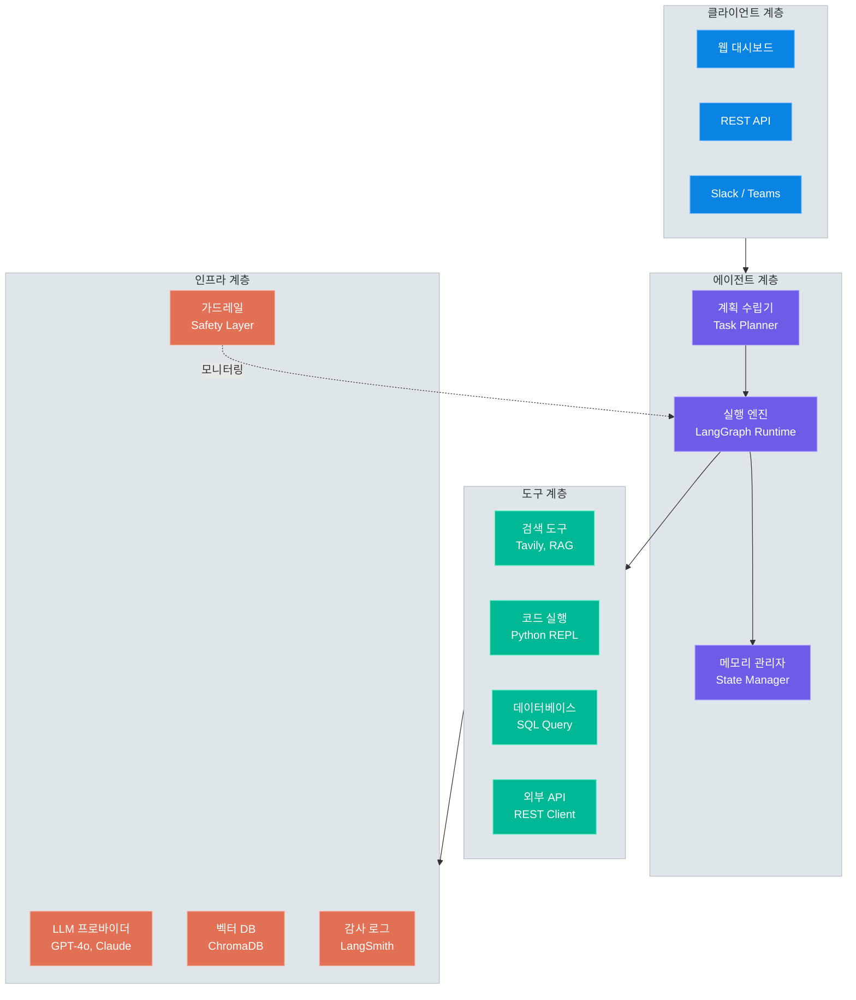
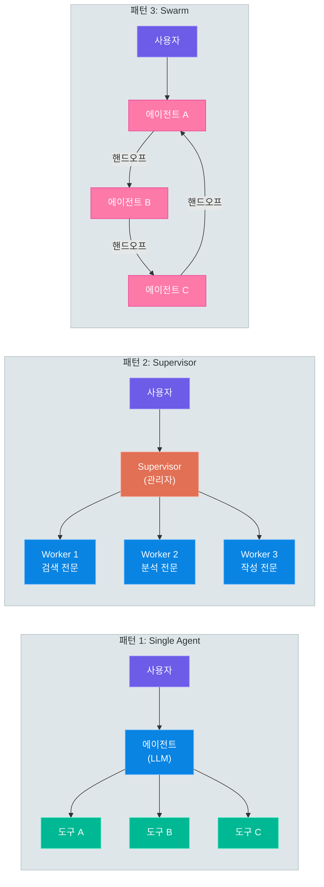
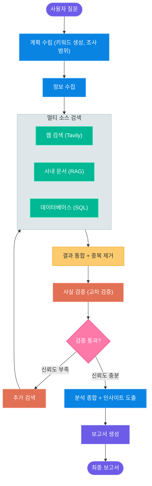
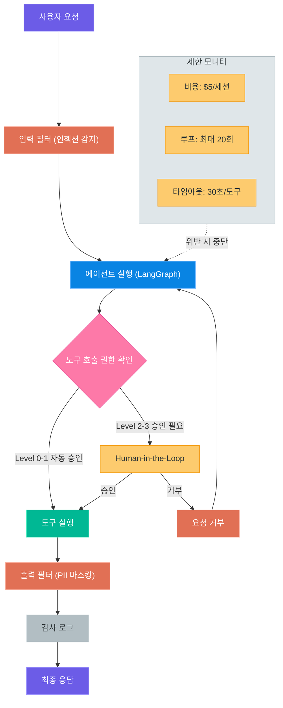
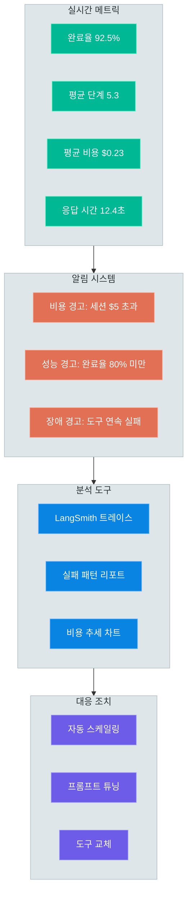

# AI 에이전트 서비스

> 스스로 계획하고, 도구를 사용하며, 결과를 검증하는 자율 AI 시스템 — 05~06 모듈에서 학습한 LLM, RAG, LangGraph 기술을 통합하여 프로덕션 수준의 AI 에이전트 서비스를 설계합니다

---

## 1. 서비스 개요

### AI 에이전트란 무엇인가

AI 에이전트(Agent)는 단순히 질문에 답변하는 챗봇을 넘어, **스스로 목표를 분석하고, 계획을 수립하며, 도구를 활용하여 작업을 수행하는 자율적인 AI 시스템**입니다. 기존의 LLM 애플리케이션이 "입력 → 출력"의 단방향 파이프라인이었다면, 에이전트는 **관찰(Observe) → 사고(Think) → 행동(Act)의 반복적 루프**를 통해 복잡한 작업을 자율적으로 수행합니다.

비유하자면, 기존 LLM 애플리케이션이 "지시한 대로 요리하는 로봇"이었다면, AI 에이전트는 "냉장고를 확인하고, 레시피를 검색하고, 재료를 조합하여 최적의 메뉴를 만들어내는 AI 셰프"에 가깝습니다.

### 챗봇 vs 파이프라인 vs 에이전트

| 구분 | 챗봇 | RAG 파이프라인 | AI 에이전트 |
|------|------|----------------|-------------|
| **자율성** | 사용자 입력에 반응 | 정해진 흐름 실행 | 스스로 판단하고 행동 |
| **도구 사용** | 없음 | 검색기 고정 | 상황에 맞는 도구 동적 선택 |
| **계획 수립** | 없음 | 없음 | 하위 작업 분해 및 순서 결정 |
| **반복 실행** | 단일 턴 | 단일 패스 | 목표 달성까지 반복 |
| **에러 대응** | 불가 | 제한적 | 실패 시 대안 탐색 |
| **상태 관리** | 대화 히스토리 | 없음 | 복잡한 상태 그래프 |

### 05~06 모듈 기술 스택 통합

이전 강의에서 학습한 기술들이 에이전트 서비스에서 어떻게 활용되는지 살펴보겠습니다.

| 모듈 | 학습 내용 | 에이전트에서의 역할 |
|------|-----------|---------------------|
| 05-01~03 | OpenAI, Claude, Gemini API | 에이전트의 두뇌 (LLM 추론 엔진) |
| 05-04~05 | 프롬프트 엔지니어링, 컨텍스트 엔지니어링 | 에이전트 지시문 및 상태 설계 |
| 05-06 | RAG 시스템 | 에이전트의 지식 검색 도구 |
| 05-07 | LangChain LCEL | 에이전트 체인 구성 기반 |
| 06-01~06 | 서비스 설계 및 패턴 | 에이전트 서비스 아키텍처 참조 |

### 에이전트 유형 분류

실무에서 활용되는 주요 에이전트 유형은 다음과 같습니다.

| 유형 | 주요 기능 | 대표 도구 | 난이도 |
|------|-----------|-----------|--------|
| **리서치 에이전트** | 정보 수집, 분석, 보고서 생성 | 웹 검색, 문서 분석 | 중 |
| **업무자동화 에이전트** | 이메일 처리, 데이터 입력, 스케줄링 | 이메일 API, 캘린더, DB | 중~상 |
| **코딩 에이전트** | 코드 생성, 리뷰, 디버깅 | 코드 실행, 파일 시스템 | 상 |
| **데이터분석 에이전트** | 데이터 탐색, 시각화, 인사이트 도출 | Python REPL, SQL, 차트 생성 | 중 |
| **고객지원 에이전트** | 문의 분류, 답변 생성, 이슈 에스컬레이션 | RAG, 티켓 시스템, CRM | 중 |

### 에이전트 서비스 전체 아키텍처



> **핵심 포인트:** AI 에이전트 서비스는 클라이언트, 에이전트, 도구, 인프라의 4계층으로 구성됩니다. 에이전트 계층의 계획 수립기가 작업을 분해하고, 실행 엔진(LangGraph)이 도구를 호출하며, 가드레일이 전 과정을 모니터링합니다.

---

## 2. 에이전트 아키텍처 패턴

### 왜 아키텍처 패턴이 중요한가

에이전트 서비스를 설계할 때 가장 먼저 결정해야 할 사항은 **아키텍처 패턴**입니다. 단일 에이전트로 충분한 경우에 멀티 에이전트를 도입하면 불필요한 복잡성과 비용이 발생하고, 반대로 복잡한 작업에 단일 에이전트를 사용하면 품질과 안정성이 저하됩니다.

### 패턴 1 — Single Agent

**Single Agent**는 하나의 LLM이 모든 도구에 접근하여 작업을 수행하는 가장 기본적인 패턴입니다. 구현이 간단하고 오버헤드가 적지만, 도구의 수가 많아지면 LLM이 적절한 도구를 선택하는 데 혼란을 겪을 수 있습니다.

**적합한 시나리오:**
- 도구가 10개 이내인 간단한 작업
- 명확하게 정의된 단일 도메인 작업
- 비용 최적화가 중요한 경우

**한계:**
- 도구가 많아지면 도구 선택 정확도 저하
- 복잡한 멀티 도메인 작업에 부적합
- 프롬프트가 길어져 컨텍스트 윈도우 압박

### 패턴 2 — Multi-Agent Supervisor

**Supervisor 패턴**은 중앙의 **관리자 에이전트(Supervisor)**가 작업을 분석하여 적절한 **전문 에이전트(Worker)**에게 위임하는 방식입니다. 05-09강에서 학습한 LangGraph의 `StateGraph`를 활용하여 구현합니다.

**적합한 시나리오:**
- 도메인이 명확히 구분되는 복합 작업
- 중앙 집중식 제어가 필요한 경우
- 각 에이전트의 전문성이 뚜렷한 경우

**한계:**
- Supervisor가 병목이 될 수 있음
- Supervisor의 라우팅 결정이 잘못되면 전체 실패
- Worker 수가 많아지면 관리 복잡성 증가

### 패턴 3 — Multi-Agent Swarm

**Swarm 패턴**은 중앙 관리자 없이 에이전트들이 **직접 핸드오프(Handoff)**하는 분산형 구조입니다. 각 에이전트가 자신의 능력 범위를 벗어나는 작업을 만나면, 적합한 다른 에이전트에게 제어권을 넘깁니다.

**적합한 시나리오:**
- 작업 흐름이 유동적이고 예측하기 어려운 경우
- 에이전트 간 협업이 동적으로 변화하는 경우
- 단일 실패 지점(Single Point of Failure)을 피하고 싶은 경우

**한계:**
- 핸드오프 무한 루프 위험
- 전체 작업 상태 파악이 어려움
- 디버깅과 모니터링이 복잡

### 패턴 선택 가이드

| 기준 | Single Agent | Supervisor | Swarm |
|------|-------------|------------|-------|
| **작업 복잡도** | 낮음 | 중~높음 | 높음 |
| **도구 수** | < 10개 | 10~30개 | 제한 없음 |
| **에이전트 독립성** | 해당 없음 | 낮음 (중앙 제어) | 높음 (자율) |
| **비용** | 낮음 | 중간 | 높음 |
| **구현 난이도** | 쉬움 | 중간 | 어려움 |
| **디버깅 용이성** | 쉬움 | 중간 | 어려움 |
| **확장성** | 낮음 | 중간 | 높음 |

### 3가지 아키텍처 패턴 비교



### Supervisor 패턴 구현 스니펫

```python
# supervisor_agent.py -- Supervisor 패턴 기본 구조
from langgraph.graph import StateGraph, MessagesState
from langchain_openai import ChatOpenAI
from typing import Literal

llm = ChatOpenAI(model="gpt-4o")

def supervisor_node(state: MessagesState) -> dict:
    """Supervisor가 다음 실행할 Worker를 결정"""
    system_prompt = """당신은 작업 관리자입니다.
    사용자의 요청을 분석하여 적절한 전문가에게 위임하세요.
    - researcher: 정보 검색이 필요한 경우
    - analyst: 데이터 분석이 필요한 경우
    - writer: 문서 작성이 필요한 경우
    - FINISH: 작업이 완료된 경우"""

    response = llm.invoke([
        {"role": "system", "content": system_prompt},
        *state["messages"]
    ])
    return {"next": response.content}

# StateGraph에 Supervisor + Worker 노드 등록
graph = StateGraph(MessagesState)
graph.add_node("supervisor", supervisor_node)
graph.add_node("researcher", researcher_node)
graph.add_node("analyst", analyst_node)
graph.add_node("writer", writer_node)
```

> **핵심 포인트:** 에이전트 아키텍처 선택은 작업 복잡도, 도구 수, 비용 제약을 종합적으로 고려해야 합니다. 대부분의 프로젝트는 Single Agent로 시작하여, 복잡도가 증가하면 Supervisor 패턴으로 발전시키는 점진적 접근이 효과적입니다.

---

## 3. 도구(Tool) 설계

### 도구가 에이전트의 핵심인 이유

에이전트의 능력은 **사용할 수 있는 도구의 품질**에 의해 결정됩니다. LLM 자체는 추론과 텍스트 생성만 가능하지만, 도구를 통해 검색, 계산, API 호출, 파일 처리 등 실질적인 행동을 수행할 수 있습니다. 따라서 도구 설계는 에이전트 서비스의 성패를 좌우하는 핵심 요소입니다.

### 좋은 도구의 4원칙

| 원칙 | 설명 | 나쁜 예 | 좋은 예 |
|------|------|---------|---------|
| **명확한 이름** | 도구의 기능을 정확히 설명하는 이름 | `process_data` | `search_customer_orders` |
| **정확한 설명** | LLM이 언제 사용할지 판단할 수 있는 설명 | "데이터 처리" | "고객 ID로 최근 주문 내역을 검색합니다" |
| **엄격한 스키마** | 입력/출력의 타입과 제약 조건 명시 | `Any` 타입 | `customer_id: str, limit: int = 10` |
| **견고한 에러 처리** | 실패 시 LLM이 이해할 수 있는 에러 메시지 | `raise Exception` | `"주문을 찾을 수 없습니다. 고객 ID를 확인해 주세요"` |

### 도구 카테고리 분류

에이전트가 사용하는 도구는 크게 4가지 카테고리로 나뉩니다.

**1) 내장 도구 (Built-in Tools)**

LangChain/LangGraph 생태계에서 바로 사용할 수 있는 도구입니다.

| 도구 | 용도 | 패키지 |
|------|------|--------|
| Tavily Search | 웹 검색 | `langchain-community` |
| Wikipedia | 백과사전 검색 | `langchain-community` |
| Python REPL | 코드 실행 | `langchain-experimental` |
| File System | 파일 읽기/쓰기 | `langchain-community` |
| SQL Database | DB 쿼리 | `langchain-community` |

**2) RAG 도구 (Retrieval Tools)**

05-06강에서 구축한 RAG 시스템을 에이전트의 도구로 통합합니다.

| 도구 | 용도 | 활용 시나리오 |
|------|------|---------------|
| Vector Search | 유사 문서 검색 | 사내 문서 기반 답변 |
| Hybrid Search | BM25 + 벡터 결합 | 키워드 + 의미 검색 |
| Multi-Index | 다중 인덱스 검색 | 도메인별 문서 구분 |

**3) 외부 API 도구 (External API Tools)**

외부 서비스와 연동하는 커스텀 도구입니다.

| 도구 | 용도 | 대상 API |
|------|------|----------|
| Email Tool | 이메일 발송/조회 | Gmail, Outlook API |
| Calendar Tool | 일정 조회/생성 | Google Calendar |
| CRM Tool | 고객 정보 조회 | Salesforce, HubSpot |
| Notification Tool | 알림 발송 | Slack, Teams Webhook |

**4) 커스텀 분석 도구**

특정 업무 도메인에 특화된 분석 도구입니다.

| 도구 | 용도 | 구현 방식 |
|------|------|-----------|
| Data Analyzer | 통계 분석, 시각화 | pandas + matplotlib |
| Report Generator | 보고서 생성 | Jinja2 템플릿 |
| Sentiment Analyzer | 감성 분석 | NLP 모델 호출 |

### 도구 권한 관리

에이전트가 도구를 호출할 때, 도구의 **위험도**에 따라 승인 레벨을 차등 적용해야 합니다.

| 레벨 | 위험도 | 도구 예시 | 승인 방식 |
|------|--------|-----------|-----------|
| Level 0 | 읽기 전용 | 검색, 조회 | 자동 승인 |
| Level 1 | 낮은 위험 | 파일 생성, 초안 작성 | 자동 승인 + 로깅 |
| Level 2 | 중간 위험 | 이메일 발송, DB 수정 | 사용자 확인 후 실행 |
| Level 3 | 높은 위험 | 결제, 계정 삭제 | 관리자 승인 필수 |

### 도구 레지스트리 설계

```python
# tool_registry.py -- 도구 레지스트리 구현
from langchain_core.tools import tool
from pydantic import BaseModel, Field
from enum import IntEnum

class PermissionLevel(IntEnum):
    READ_ONLY = 0      # 자동 승인
    LOW_RISK = 1       # 자동 승인 + 로깅
    MEDIUM_RISK = 2    # 사용자 확인
    HIGH_RISK = 3      # 관리자 승인

class ToolMetadata(BaseModel):
    name: str
    permission_level: PermissionLevel
    max_calls_per_session: int = 50
    timeout_seconds: int = 30

class ToolRegistry:
    def __init__(self):
        self._tools: dict[str, ToolMetadata] = {}

    def register(self, func, metadata: ToolMetadata):
        self._tools[metadata.name] = metadata
        return tool(func)

    def check_permission(self, tool_name: str) -> PermissionLevel:
        return self._tools[tool_name].permission_level
```

```python
# tool_definition.py -- 도구 정의 예시
@tool
def search_web(query: str) -> str:
    """웹에서 최신 정보를 검색합니다.

    Args:
        query: 검색할 키워드 또는 질문
    Returns:
        검색 결과 요약 텍스트
    """
    # Tavily 검색 API 호출
    results = tavily_client.search(query, max_results=5)
    return format_results(results)

@tool
def execute_sql(query: str, database: str = "analytics") -> str:
    """데이터베이스에서 SQL 쿼리를 실행합니다.

    Args:
        query: 실행할 SELECT SQL 쿼리 (읽기 전용)
        database: 대상 데이터베이스 이름
    Returns:
        쿼리 결과를 JSON 형태로 반환
    """
    if not query.strip().upper().startswith("SELECT"):
        return "오류: 읽기 전용 쿼리만 허용됩니다."
    return db.execute(query).to_json()
```

> **핵심 포인트:** 도구 설계의 핵심은 "LLM이 도구를 올바르게 선택하고 올바르게 사용할 수 있도록" 이름, 설명, 스키마를 명확히 정의하는 것입니다. 또한 도구의 위험도에 따라 권한 레벨을 설정하여, 높은 위험 도구는 반드시 사람의 승인을 거치도록 설계해야 합니다.

---

## 4. 리서치 에이전트 설계

### 리서치 에이전트의 목표

리서치 에이전트는 **정보 수집 → 분석 → 보고서 생성**의 워크플로를 자동화합니다. 사용자가 "경쟁사 A의 최근 전략 변화를 분석해 줘"라고 요청하면, 에이전트가 웹 검색, 문서 분석, 사실 검증을 거쳐 구조화된 보고서를 생성합니다.

### 리서치 워크플로 단계

| 단계 | 수행 작업 | 사용 도구 | 산출물 |
|------|-----------|-----------|--------|
| 1. 계획 수립 | 검색 키워드 생성, 조사 범위 결정 | LLM 추론 | 리서치 계획서 |
| 2. 정보 수집 | 다중 소스에서 관련 정보 수집 | 웹 검색, RAG, DB | 원시 자료 목록 |
| 3. 사실 검증 | 교차 검증으로 정보 신뢰성 확인 | 웹 검색, LLM 추론 | 검증된 사실 목록 |
| 4. 분석 종합 | 수집된 정보를 분석, 인사이트 도출 | LLM 추론, 데이터 분석 | 분석 결과 |
| 5. 보고서 생성 | 구조화된 보고서 작성 | LLM 생성, 템플릿 | 최종 보고서 |

### 멀티 소스 검색 전략

리서치 에이전트의 품질은 **다양한 소스에서 정보를 수집하는 능력**에 달려 있습니다.

| 소스 | 강점 | 약점 | 활용 시나리오 |
|------|------|------|---------------|
| **웹 검색** | 최신 정보, 광범위 | 신뢰성 불확실 | 최신 뉴스, 트렌드 |
| **사내 문서 (RAG)** | 높은 신뢰성, 도메인 특화 | 범위 제한, 업데이트 지연 | 사내 정책, 기술 문서 |
| **데이터베이스** | 정확한 수치, 구조화 | 해석 필요, 접근 권한 | 매출, 고객 데이터 |
| **학술 논문** | 높은 신뢰성, 깊은 분석 | 접근 제한, 전문 용어 | 기술 조사, R&D |

### 사실 검증 (Fact-Checking) 메커니즘

리서치 에이전트에서 가장 중요한 단계 중 하나는 **사실 검증**입니다. LLM의 할루시네이션 위험을 줄이기 위해 다음과 같은 검증 전략을 적용합니다.

| 검증 방법 | 설명 | 신뢰도 향상 효과 |
|-----------|------|-------------------|
| **교차 검증** | 동일 정보를 2개 이상의 소스에서 확인 | 높음 |
| **출처 명시** | 모든 주장에 출처 URL 첨부 | 중간 |
| **시간 검증** | 정보의 최신성 확인 (날짜 기반 필터) | 중간 |
| **수치 검증** | 통계/수치 데이터의 합리성 검토 | 높음 |

### 리서치 에이전트 그래프 구성

```python
# research_agent.py -- 리서치 에이전트 그래프
from langgraph.graph import StateGraph, END
from typing import TypedDict, Annotated

class ResearchState(TypedDict):
    query: str                      # 사용자 질문
    plan: list[str]                 # 검색 계획
    raw_sources: list[dict]         # 수집된 원시 자료
    verified_facts: list[dict]      # 검증된 사실
    analysis: str                   # 분석 결과
    report: str                     # 최종 보고서
    iteration: int                  # 현재 반복 횟수

def plan_research(state: ResearchState) -> dict:
    """검색 키워드와 조사 범위를 결정"""
    prompt = f"다음 주제에 대해 조사 계획을 수립하세요: {state['query']}"
    plan = llm.invoke(prompt)
    return {"plan": plan.content.split("\n")}

def gather_sources(state: ResearchState) -> dict:
    """멀티 소스에서 정보를 수집"""
    sources = []
    for keyword in state["plan"]:
        web_results = search_web.invoke(keyword)
        rag_results = rag_retriever.invoke(keyword)
        sources.extend(web_results + rag_results)
    return {"raw_sources": sources}

def verify_facts(state: ResearchState) -> dict:
    """교차 검증으로 사실 확인"""
    verified = []
    for source in state["raw_sources"]:
        verification = cross_check(source)
        if verification["is_reliable"]:
            verified.append(source)
    return {"verified_facts": verified}

# 그래프 구성
graph = StateGraph(ResearchState)
graph.add_node("plan", plan_research)
graph.add_node("gather", gather_sources)
graph.add_node("verify", verify_facts)
graph.add_node("analyze", analyze_findings)
graph.add_node("report", generate_report)

graph.set_entry_point("plan")
graph.add_edge("plan", "gather")
graph.add_edge("gather", "verify")
graph.add_edge("verify", "analyze")
graph.add_edge("analyze", "report")
graph.add_edge("report", END)
```

### 리서치 에이전트 워크플로



> **핵심 포인트:** 리서치 에이전트의 차별점은 **사실 검증 단계**에 있습니다. 단순히 검색 결과를 요약하는 것이 아니라, 교차 검증을 통해 정보의 신뢰성을 확인한 후 보고서를 생성합니다. 신뢰도가 부족하면 추가 검색을 수행하는 반복 루프가 품질을 보장합니다.

---

## 5. 업무 자동화 에이전트

### 업무 자동화의 핵심 가치

업무 자동화 에이전트는 사람이 반복적으로 수행하는 정형화된 업무를 AI가 대신 처리하는 시스템입니다. 단순한 RPA(Robotic Process Automation)와 달리, AI 에이전트는 **비정형 데이터를 이해하고 판단**할 수 있어 훨씬 넓은 범위의 업무를 자동화할 수 있습니다.

| 구분 | 전통적 RPA | AI 에이전트 자동화 |
|------|-----------|-------------------|
| 입력 데이터 | 정형 데이터만 | 비정형 + 정형 모두 |
| 규칙 정의 | 사람이 규칙 코딩 | LLM이 맥락 이해 |
| 예외 처리 | 규칙 외 상황 실패 | 유연하게 대응 |
| 유지보수 | 규칙 변경 시 코드 수정 | 프롬프트 조정 |

### 시나리오 1 — 이메일 처리 자동화

이메일 처리 에이전트는 수신 이메일을 **분류 → 요약 → 답장 초안 생성** 순서로 처리합니다.

| 단계 | 입력 | 처리 내용 | 출력 |
|------|------|-----------|------|
| 1. 수신 | 이메일 원문 | IMAP/Gmail API로 수신 | 이메일 객체 |
| 2. 분류 | 이메일 본문 | 긴급도, 카테고리, 담당자 판별 | 분류 라벨 |
| 3. 요약 | 이메일 본문 | 핵심 내용 3줄 요약 | 요약 텍스트 |
| 4. 답장 초안 | 분류 + 요약 + 맥락 | 적절한 톤과 내용으로 답장 | 답장 초안 |
| 5. 검토 | 답장 초안 | 사람이 확인/수정 후 발송 | 최종 답장 |

### 시나리오 2 — 비정형 문서 구조화

비정형 문서(영수증, 계약서, 보고서 등)를 읽어 구조화된 데이터로 변환하는 작업입니다.

| 문서 유형 | 추출 정보 | 출력 형식 |
|-----------|-----------|-----------|
| 영수증 | 날짜, 금액, 품목, 업체명 | JSON / DB 레코드 |
| 계약서 | 계약 당사자, 기간, 조건, 금액 | 구조화된 요약 |
| 이력서 | 이름, 경력, 기술 스택, 학력 | 표준 양식 |
| 회의록 | 참석자, 안건, 결정사항, 후속 작업 | 요약 보고서 |

### 시나리오 3 — 스케줄링 자동화

여러 참석자의 일정을 조율하여 최적의 미팅 시간을 찾는 에이전트입니다.

| 기능 | 설명 | 연동 API |
|------|------|----------|
| 일정 조회 | 참석자별 빈 시간 확인 | Google Calendar |
| 최적 시간 탐색 | 조건(시간대, 선호도)에 맞는 슬롯 | LLM 추론 |
| 초대 발송 | 미팅 초대 메일 자동 발송 | Gmail API |
| 리마인더 | 미팅 전 알림 발송 | Slack Webhook |

### 이메일 자동화 에이전트 구조

```python
# email_agent.py -- 이메일 자동화 에이전트
from langgraph.graph import StateGraph, END
from typing import TypedDict

class EmailState(TypedDict):
    email_raw: str           # 원본 이메일
    category: str            # 분류 결과
    urgency: str             # 긴급도 (high/medium/low)
    summary: str             # 요약
    draft_reply: str         # 답장 초안
    approved: bool           # 사람 승인 여부

def classify_email(state: EmailState) -> dict:
    """이메일을 카테고리와 긴급도로 분류"""
    prompt = f"""이메일을 분석하여 분류하세요.
    카테고리: [문의, 불만, 제안, 정보, 스팸]
    긴급도: [high, medium, low]

    이메일: {state['email_raw']}"""
    result = llm.invoke(prompt)
    return parse_classification(result.content)

def summarize_email(state: EmailState) -> dict:
    """이메일 핵심 내용을 3줄로 요약"""
    prompt = f"다음 이메일을 3줄로 요약하세요:\n{state['email_raw']}"
    summary = llm.invoke(prompt)
    return {"summary": summary.content}

def draft_reply(state: EmailState) -> dict:
    """맥락에 맞는 답장 초안을 생성"""
    prompt = f"""다음 이메일에 대한 답장 초안을 작성하세요.
    카테고리: {state['category']}
    요약: {state['summary']}
    원본: {state['email_raw']}"""
    reply = llm.invoke(prompt)
    return {"draft_reply": reply.content}

def route_by_urgency(state: EmailState) -> str:
    """긴급도에 따라 분기"""
    if state["urgency"] == "high":
        return "human_review"
    return "auto_send"

# 그래프 조립
graph = StateGraph(EmailState)
graph.add_node("classify", classify_email)
graph.add_node("summarize", summarize_email)
graph.add_node("draft", draft_reply)
graph.add_node("human_review", human_review_node)
graph.add_node("auto_send", auto_send_node)

graph.set_entry_point("classify")
graph.add_edge("classify", "summarize")
graph.add_edge("summarize", "draft")
graph.add_conditional_edges("draft", route_by_urgency)
graph.add_edge("human_review", END)
graph.add_edge("auto_send", END)
```

> **핵심 포인트:** 업무 자동화 에이전트는 기존 RPA와 달리 비정형 데이터를 이해할 수 있어 적용 범위가 넓습니다. 다만 이메일 발송, 일정 변경 등 **되돌릴 수 없는 작업**은 반드시 Human-in-the-Loop을 적용하여 사람의 확인을 거쳐야 합니다.

---

## 6. 안전성과 제어

### 에이전트 안전성의 중요성

에이전트는 자율적으로 행동하기 때문에, 적절한 안전장치 없이 운영하면 **심각한 문제**가 발생할 수 있습니다. 에이전트 안전성은 단순히 "있으면 좋은" 기능이 아니라, 프로덕션 서비스의 **필수 요구사항**입니다.

### 주요 안전성 위험

| 위험 유형 | 설명 | 발생 시나리오 | 영향도 |
|-----------|------|---------------|--------|
| **도구 오남용** | 의도하지 않은 도구 호출 | LLM이 삭제 도구를 잘못 선택 | 치명적 |
| **무한 루프** | 에이전트가 종료 조건을 만족시키지 못함 | 검증 단계에서 계속 실패 | 높음 (비용) |
| **비용 폭주** | 과도한 LLM 호출로 비용 급증 | 복잡한 작업에 수백 회 반복 | 높음 (비용) |
| **데이터 유출** | 민감 정보를 외부 도구에 전달 | 내부 문서를 웹 검색에 노출 | 치명적 |
| **할루시네이션 전파** | 잘못된 정보를 기반으로 행동 | 허위 데이터로 보고서 작성 | 중간~높음 |
| **프롬프트 인젝션** | 악의적 입력으로 에이전트 조작 | 사용자가 시스템 프롬프트 우회 | 치명적 |

### 가드레일 (Guardrails) 설계

가드레일은 에이전트의 행동을 안전한 범위 내로 제한하는 **방어 메커니즘**입니다.

**1) 도구 호출 제한**

| 제한 항목 | 설정 예시 | 목적 |
|-----------|-----------|------|
| 세션당 최대 도구 호출 횟수 | 50회 | 무한 루프 방지 |
| 단일 도구 최대 호출 횟수 | 10회 | 특정 도구 남용 방지 |
| 도구별 타임아웃 | 30초 | 무응답 방지 |
| 동시 도구 호출 수 | 3개 | 리소스 보호 |

**2) 비용 상한**

| 제한 항목 | 설정 예시 | 초과 시 행동 |
|-----------|-----------|-------------|
| 세션당 최대 비용 | $5.00 | 에이전트 중단 + 알림 |
| 시간당 최대 비용 | $10.00 | 신규 세션 차단 |
| 월간 최대 비용 | $500.00 | 서비스 일시 중지 |

**3) 콘텐츠 필터링**

| 필터 유형 | 대상 | 처리 방식 |
|-----------|------|-----------|
| 입력 필터 | 사용자 입력 | 프롬프트 인젝션 감지 및 차단 |
| 출력 필터 | LLM 출력 | 민감 정보(PII) 마스킹 |
| 도구 입력 필터 | 도구 파라미터 | SQL 인젝션, 경로 탈출 방지 |

### Human-in-the-Loop (HITL) 설계

위험도가 높은 행동을 수행하기 전에 **사람의 승인**을 요구하는 메커니즘입니다.

| HITL 트리거 | 예시 행동 | 승인 방식 |
|-------------|-----------|-----------|
| 높은 위험 도구 호출 | 이메일 발송, DB 수정 | Slack 알림 → 승인 버튼 |
| 비용 임계값 초과 | 세션 비용 $3 초과 | 대시보드 알림 |
| 불확실한 판단 | LLM 신뢰도 < 0.7 | 사람에게 에스컬레이션 |
| 첫 실행 작업 | 새로운 도구 조합 | 수동 모니터링 |

### 감사 로그 (Audit Log) 설계

에이전트의 **모든 행동을 기록**하여 사후 분석과 디버깅에 활용합니다.

| 로그 항목 | 내용 | 활용 목적 |
|-----------|------|-----------|
| 세션 ID | 고유 세션 식별자 | 작업 추적 |
| 타임스탬프 | 각 행동의 시간 | 성능 분석 |
| 노드 이름 | 실행된 그래프 노드 | 워크플로 분석 |
| 도구 호출 | 도구 이름, 입력, 출력 | 도구 사용 패턴 |
| LLM 호출 | 프롬프트, 응답, 토큰 수 | 비용 및 품질 분석 |
| 에러 정보 | 에러 타입, 메시지, 스택 트레이스 | 장애 분석 |

### 안전성 미들웨어

```python
# safety_middleware.py -- 안전성 미들웨어 구현
import time
from dataclasses import dataclass, field
from typing import Any

@dataclass
class SafetyConfig:
    max_tool_calls: int = 50
    max_cost_per_session: float = 5.0
    tool_timeout: int = 30
    max_iterations: int = 20

@dataclass
class SessionTracker:
    tool_call_count: int = 0
    total_cost: float = 0.0
    iteration_count: int = 0
    audit_log: list = field(default_factory=list)

class SafetyMiddleware:
    def __init__(self, config: SafetyConfig):
        self.config = config
        self.sessions: dict[str, SessionTracker] = {}

    def check_before_tool_call(
        self, session_id: str, tool_name: str, args: dict
    ) -> tuple[bool, str]:
        tracker = self.sessions[session_id]

        # 도구 호출 횟수 제한
        if tracker.tool_call_count >= self.config.max_tool_calls:
            return False, "도구 호출 횟수 한도 초과"

        # 비용 제한
        if tracker.total_cost >= self.config.max_cost_per_session:
            return False, "세션 비용 한도 초과"

        # 반복 횟수 제한
        if tracker.iteration_count >= self.config.max_iterations:
            return False, "최대 반복 횟수 초과"

        # 감사 로그 기록
        tracker.audit_log.append({
            "timestamp": time.time(),
            "action": "tool_call",
            "tool": tool_name,
            "args": args,
        })
        tracker.tool_call_count += 1
        return True, "승인"
```

### 안전성 제어 계층



> **핵심 포인트:** 에이전트 안전성은 **입력 필터 → 도구 권한 확인 → Human-in-the-Loop → 출력 필터 → 감사 로그**의 다중 계층으로 구현합니다. 어느 한 계층만으로는 충분하지 않으며, 모든 계층이 함께 작동해야 프로덕션 수준의 안전성을 확보할 수 있습니다.

---

## 7. 운영과 모니터링

### 에이전트 운영의 특수성

에이전트 서비스의 운영은 일반적인 웹 서비스 운영과 다른 특수성을 가지고 있습니다. 에이전트는 **비결정적(Non-deterministic)**이며, 동일한 입력에도 다른 결과를 낼 수 있고, 실행 경로가 매번 달라질 수 있습니다.

| 일반 서비스 | 에이전트 서비스 |
|-------------|-----------------|
| 결정적 로직 | 비결정적 LLM 추론 |
| 고정된 실행 경로 | 동적 실행 경로 |
| 일정한 응답 시간 | 가변적 응답 시간 (1초~수 분) |
| 명확한 성공/실패 | 부분적 성공, 품질 스펙트럼 |
| CPU/메모리 기반 비용 | LLM 토큰 기반 비용 |

### 핵심 성능 지표 (KPI)

에이전트 서비스의 건강 상태를 파악하기 위한 핵심 지표입니다.

| 지표 | 정의 | 정상 범위 | 경고 임계값 |
|------|------|-----------|-------------|
| **태스크 완료율** | 성공 완료 / 전체 요청 | > 90% | < 80% |
| **평균 단계 수** | 태스크당 그래프 노드 실행 수 | 3~8단계 | > 15단계 |
| **평균 비용** | 태스크당 LLM API 비용 | $0.05~0.50 | > $2.00 |
| **평균 응답 시간** | 요청 → 최종 응답 | 5~30초 | > 120초 |
| **도구 호출 성공률** | 성공 호출 / 전체 호출 | > 95% | < 85% |
| **HITL 비율** | 사람 개입 / 전체 요청 | < 10% | > 30% |

### 실패 분석과 복구 전략

에이전트 실패는 크게 4가지 유형으로 분류됩니다.

| 실패 유형 | 원인 | 복구 전략 | 예방 방법 |
|-----------|------|-----------|-----------|
| **도구 실패** | API 타임아웃, 서비스 장애 | 재시도 → 대체 도구 → 에러 보고 | 서킷 브레이커, 폴백 도구 |
| **LLM 실패** | 레이트 리밋, 모델 장애 | 대기 후 재시도 → 대체 모델 | 다중 프로바이더, 큐잉 |
| **로직 실패** | 무한 루프, 잘못된 판단 | 반복 제한, 강제 종료 | 루프 감지, 최대 반복 설정 |
| **품질 실패** | 부정확한 결과, 할루시네이션 | 검증 단계, 사람 리뷰 | 사실 검증, 출력 검증기 |

### LangSmith / LangFuse 연동

에이전트의 모든 실행 과정을 추적하고 분석하기 위해 **관찰성(Observability)** 도구를 연동합니다.

| 도구 | 주요 기능 | 장점 | 비용 |
|------|-----------|------|------|
| **LangSmith** | 트레이싱, 평가, 데이터셋 관리 | LangChain 네이티브 통합 | 유료 ($39/월~) |
| **LangFuse** | 트레이싱, 프롬프트 관리 | 오픈소스, 셀프 호스팅 가능 | 무료 (셀프호스팅) |

```python
# monitoring_setup.py -- LangSmith 추적 설정
import os

# LangSmith 환경 변수 설정
os.environ["LANGCHAIN_TRACING_V2"] = "true"
os.environ["LANGCHAIN_API_KEY"] = "ls-..."
os.environ["LANGCHAIN_PROJECT"] = "agent-service-prod"

# 커스텀 메트릭 수집
from langsmith import Client

client = Client()

def log_agent_metrics(session_id, metrics):
    """에이전트 메트릭을 LangSmith에 기록"""
    client.create_run(
        name="agent_metrics",
        run_type="chain",
        inputs={"session_id": session_id},
        outputs=metrics,
        extra={"metadata": {
            "task_completed": metrics["completed"],
            "total_cost": metrics["cost"],
            "steps": metrics["step_count"],
        }}
    )
```

### 운영 대시보드



> **핵심 포인트:** 에이전트 서비스 운영의 핵심은 **관찰성(Observability)**입니다. LangSmith나 LangFuse를 통해 모든 실행 과정을 추적하고, 태스크 완료율, 비용, 응답 시간 등 핵심 지표를 실시간으로 모니터링하여 문제를 조기에 발견해야 합니다.

---

## 8. 핵심 정리

### 05~06 모듈 학습 경로 회고

지금까지 **05 GenAI 심화**와 **06 GenAI 응용** 모듈을 통해 AI 서비스 개발의 전체 과정을 학습했습니다. 각 단계가 어떻게 연결되는지 되돌아보겠습니다.

| 순서 | 강의 | 핵심 학습 내용 | 다음 단계와의 연결 |
|------|------|----------------|-------------------|
| 05-01 | OpenAI 심화 | GPT-4o API, Function Calling | LLM 기반 도구 호출의 기초 |
| 05-02 | Claude API | Anthropic API, XML 프롬프트 | 멀티 프로바이더 전략 |
| 05-03 | Gemini API | Google AI API, 긴 컨텍스트 | 대용량 문서 처리 |
| 05-04 | 프롬프트 엔지니어링 | 코드 기반 프롬프트 설계 | 에이전트 지시문 설계 |
| 05-05 | 컨텍스트 엔지니어링 | 상태 관리, 메모리 전략 | 에이전트 상태 설계 |
| 05-06 | RAG 시스템 | 문서 검색 파이프라인 | 에이전트의 검색 도구 |
| 05-07 | LangChain LCEL | Runnable 체인 조합 | 에이전트 체인 구성 |
| 05-08 | 멀티모달 AI | 이미지/음성/영상 처리 | 멀티모달 에이전트 도구 |
| 06-01~06 | 서비스 설계 | 다양한 AI 서비스 패턴 | 에이전트 서비스 아키텍처 |
| **06-07** | **AI 에이전트 서비스** | **자율 AI 시스템 설계** | **클라우드 배포 (07 모듈)** |

### 이번 강의 핵심 요약

| 주제 | 핵심 내용 |
|------|-----------|
| 에이전트 개요 | 관찰→사고→행동의 자율 루프, 기존 챗봇/파이프라인과의 차이 |
| 아키텍처 패턴 | Single Agent, Supervisor, Swarm — 복잡도에 따라 선택 |
| 도구 설계 | 명확한 이름/설명/스키마, 권한 레벨 관리 |
| 리서치 에이전트 | 멀티 소스 검색 + 사실 검증의 반복 루프 |
| 업무 자동화 | 이메일/문서/스케줄링 — RPA를 넘는 유연한 자동화 |
| 안전성 | 다중 계층 가드레일 + HITL + 감사 로그 |
| 운영 | 관찰성 도구, KPI 모니터링, 실패 복구 전략 |

### 에이전트 서비스 설계 체크리스트

서비스를 설계할 때 다음 체크리스트를 활용하세요.

| 단계 | 확인 항목 | 완료 |
|------|-----------|------|
| 1. 요구사항 | 에이전트가 해결할 구체적 문제 정의 | [ ] |
| 2. 아키텍처 | Single/Supervisor/Swarm 패턴 선택 | [ ] |
| 3. 도구 설계 | 필요한 도구 목록, 권한 레벨 결정 | [ ] |
| 4. 안전성 | 가드레일 정책, HITL 트리거 정의 | [ ] |
| 5. 테스트 | 다양한 시나리오별 동작 검증 | [ ] |
| 6. 모니터링 | KPI 정의, 알림 설정, 관찰성 도구 연동 | [ ] |
| 7. 비용 관리 | 세션/시간/월 단위 비용 상한 설정 | [ ] |
| 8. 배포 | 클라우드 인프라, 스케일링 전략 | [ ] |

### 다음 단계 — 07 Cloud 모듈

06 모듈에서 설계한 AI 서비스들을 실제 사용자에게 제공하려면, **클라우드 인프라에 배포**해야 합니다. 07 Cloud 모듈에서는 다음 내용을 학습합니다.

| 주제 | 내용 |
|------|------|
| 컨테이너화 | Docker로 AI 서비스 패키징 |
| 오케스트레이션 | Kubernetes 기반 서비스 운영 |
| 클라우드 배포 | AWS/GCP에 AI 서비스 배포 |
| CI/CD | 자동 빌드/테스트/배포 파이프라인 |
| 모니터링 | 프로덕션 레벨 모니터링 구축 |

> **핵심 포인트:** 07 Cloud 모듈에서는 이 서비스들을 클라우드에 배포하는 방법을 배웁니다. Docker 컨테이너로 패키징하고, Kubernetes로 운영하며, CI/CD 파이프라인으로 자동화하는 전 과정을 다룹니다.

### 06 모듈을 마치며

06 GenAI 응용 모듈의 모든 강의를 완료하셨습니다. 이 모듈에서는 LLM API를 활용한 다양한 서비스 설계 패턴을 학습하고, 마지막으로 AI 에이전트라는 가장 진보된 형태의 AI 서비스를 설계했습니다.

05 모듈에서 **기술의 기초**를 다졌다면, 06 모듈에서는 그 기술을 **실제 서비스로 구현하는 방법**을 배웠습니다. 이제 여러분은 LLM API 호출부터 RAG 파이프라인, 에이전트 시스템까지 — AI 서비스 개발의 전체 스택을 이해하고 있습니다.

다음 07 Cloud 모듈에서는 이 서비스들을 실제 세상에 배포하는 방법을 학습합니다. 설계에서 운영까지, 완전한 AI 서비스 개발 여정의 마지막 단계를 함께 걸어가겠습니다.

---
