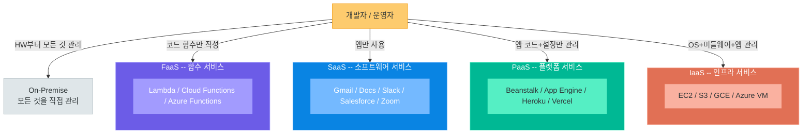
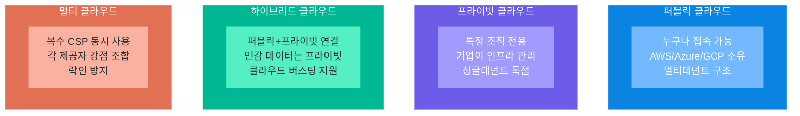
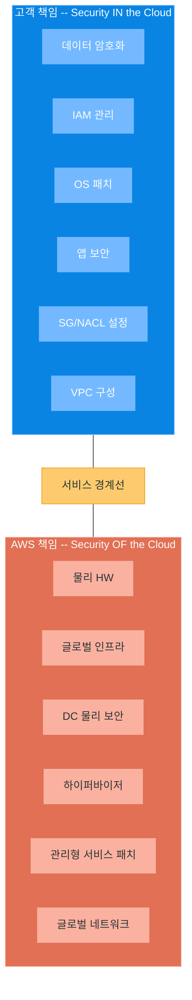
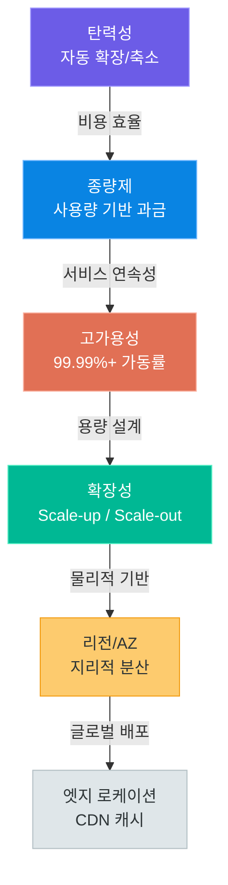

# 클라우드 컴퓨팅 기초

> 서버를 직접 사지 않아도 됩니다 — 클라우드 컴퓨팅의 본질부터 서비스 모델, 배포 모델, 공동 책임 모델까지 클라우드 시대 개발자가 반드시 알아야 할 기초 개념을 체계적으로 정리합니다

---

## 1. 클라우드 컴퓨팅이란?

### 정의

**클라우드 컴퓨팅(Cloud Computing)**이란 인터넷을 통해 컴퓨팅 자원(서버, 스토리지, 네트워크, 데이터베이스, 소프트웨어 등)을 필요한 만큼, 필요한 시간만큼 빌려 사용하고 사용한 만큼만 비용을 지불하는 IT 인프라 공급 모델입니다.

"클라우드(Cloud)"라는 이름은 인터넷을 구름 모양으로 표현하던 네트워크 다이어그램 관습에서 유래했습니다. 과거에는 인터넷 너머의 복잡한 인프라를 구체적으로 그리지 않고 구름 하나로 추상화했는데, 클라우드 컴퓨팅도 그 복잡한 인프라를 사용자에게 보이지 않게 추상화한다는 개념에서 이름을 가져왔습니다.

미국 국립표준기술연구소(NIST)의 공식 정의에 따르면, 클라우드 컴퓨팅은 다음 다섯 가지 핵심 특성을 갖습니다.

| 핵심 특성 | 영문 | 설명 |
|-----------|------|------|
| **주문형 셀프 서비스** | On-demand Self-service | 관리자 개입 없이 필요한 순간 즉시 자원을 프로비저닝 |
| **광대역 네트워크 접속** | Broad Network Access | 스마트폰, PC, 서버 등 다양한 기기에서 인터넷으로 접근 |
| **자원 풀링** | Resource Pooling | 다수 고객이 물리 자원을 공유하되 논리적으로는 격리 |
| **신속한 탄력성** | Rapid Elasticity | 수요 변화에 따라 빠르게 자원을 확장하거나 축소 |
| **측정 가능한 서비스** | Measured Service | 사용량을 실시간으로 측정하고 그에 따라 과금 |

### 클라우드 컴퓨팅의 등장 배경

인터넷 초창기인 1990년대만 해도 서비스를 운영하려면 직접 서버를 구입하고, 데이터센터를 임차하고, 네트워크를 설정하고, 전문 인력을 채용해야 했습니다. 이는 막대한 초기 투자를 요구했기 때문에 스타트업이나 소규모 팀이 새로운 아이디어를 빠르게 시험하기 어려웠습니다.

클라우드 컴퓨팅의 역사적 흐름을 살펴보면 다음과 같습니다.

| 연도 | 사건 | 의의 |
|------|------|------|
| **1999년** | Salesforce 설립 | 최초의 SaaS 개념, 브라우저로 CRM 제공 |
| **2002년** | AWS 출시 (스토리지·컴퓨팅) | 클라우드 서비스의 씨앗 |
| **2006년** | AWS EC2, S3 정식 출시 | 현대 IaaS 클라우드의 시작 |
| **2008년** | Google App Engine 출시 | PaaS 개념의 대중화 |
| **2010년** | Microsoft Azure 출시 | 기업 시장의 클라우드 진입 |
| **2011년** | OpenStack 오픈소스화 | 프라이빗 클라우드 보급 |
| **2016년** | AWS 서울 리전 개설 | 국내 클라우드 본격화 |
| **2023년~** | AI/ML 클라우드 서비스 폭발적 성장 | 생성형 AI와 클라우드 결합 |

2006년 아마존이 AWS를 출시하면서 패러다임이 완전히 바뀌었습니다. 아마존은 자사 쇼핑몰을 운영하기 위해 구축한 대규모 인프라를 외부에 빌려주는 사업을 시작했고, 이것이 현대 클라우드 산업의 시작점입니다. 초기 AWS 고객 중 하나였던 넷플릭스는 2008년 데이터베이스 장애 이후 클라우드로의 전환을 결정하고, 7년에 걸쳐 모든 인프라를 AWS로 이전하여 오늘날 스트리밍 서비스의 90% 이상을 클라우드에서 운영합니다.

```
클라우드 이전: "서버를 사고 → 운영체제를 설치하고 → 네트워크를 설정하고 →
               보안을 구성하고 → ... → 몇 달 뒤에 서비스 출시"

클라우드 이후: "AWS 콘솔에서 클릭 몇 번 → 5분 만에 서버 준비 완료 → 즉시 서비스 출시"
```

### On-Premise vs 클라우드 상세 비교

**On-Premise(온프레미스)**란 기업이 자체 데이터센터나 서버실에 하드웨어를 직접 구매·설치·운영하는 방식입니다. 클라우드가 등장하기 전의 전통적인 IT 운영 방식이며, 지금도 규제가 엄격한 산업이나 대기업 일부에서는 온프레미스를 유지합니다.

| 비교 항목 | On-Premise | 클라우드 |
|-----------|------------|----------|
| **초기 비용** | 매우 높음 (서버 구매, 데이터센터 임차, 네트워크 장비) | 거의 없음 (사용한 만큼만 지불) |
| **운영 비용** | 전기요금, 냉방, 유지보수 인력, 하드웨어 교체 | 사용량 기반 과금, 관리 부담 없음 |
| **확장성** | 서버 주문 → 납품 대기 (수 주~수 개월 소요) | 클릭 몇 번으로 수 분 내 자원 확장 |
| **배포 속도** | 물리 서버 세팅부터 수 주 이상 소요 | 콘솔 또는 API로 수 분 내 구축 |
| **유지보수** | 직접 관리 (HW 교체, OS 패치, 보안 업데이트) | 클라우드 제공자가 인프라 관리, 고객은 앱에 집중 |
| **데이터 통제력** | 완전한 통제 (물리 서버가 내 건물 안) | 제공자 데이터센터에 저장 (보안 정책 확인 필요) |
| **가용성** | 이중화 구성 직접 설계 및 구축 필요 | 기본 제공 (Multi-AZ, 자동 복구 등) |
| **글로벌 배포** | 각 국가에 데이터센터 구축 필요 (천문학적 비용) | 리전 선택만으로 글로벌 서비스 즉시 가능 |
| **보안 책임** | 전적으로 기업 책임 | 공동 책임 모델 (하드웨어는 제공자, 데이터는 고객) |
| **컴플라이언스** | 내부 감사로 직접 관리 | 제공자가 ISO27001, SOC2 등 인증 보유 |
| **신기술 도입** | 별도 구매·설치 필요 | AI/ML, 서버리스 등 최신 서비스 즉시 활용 |
| **전문 인력** | 인프라 엔지니어 상시 필요 | 개발자 중심으로 운영 가능 |
| **적합한 상황** | 데이터 주권 엄격, 고정적 대용량 워크로드 | 가변적 트래픽, 빠른 출시, 글로벌 확장 |

> **핵심 포인트:** 클라우드가 항상 정답은 아닙니다. 초대형 기업이 예측 가능한 고정 워크로드를 장기 운영한다면 온프레미스가 더 경제적일 수 있습니다. 실제로 트위터(현 X)는 클라우드에서 자체 데이터센터로 역이전한 사례가 있습니다. 그러나 대부분의 스타트업과 중소기업, 트래픽 변동이 큰 서비스에는 클라우드가 압도적으로 유리합니다.

### 실제 비용 비교 사례

신규 스타트업이 월 평균 1,000명의 동시 사용자를 처리하는 웹 서비스를 구축한다고 가정합니다.

| 구분 | On-Premise | AWS 클라우드 |
|------|------------|-------------|
| 초기 투자 | 서버 3대 × 300만 원 + 랙 임차 + 네트워크 장비 ≈ 약 2,000만 원 | 0원 |
| 월 운영비 | 전기료, 인터넷, 유지보수 인력 ≈ 약 100~150만 원 | EC2 + RDS + 로드밸런서 ≈ 약 30~50만 원 |
| 트래픽 급증 시 | 추가 서버 구매·설치 (수 주 소요, 수백만 원 추가 투자) | Auto Scaling으로 수 분 내 자동 확장 |
| 개발 환경 | 전용 서버 24시간 운영 필요 | 필요할 때만 켜고 끔 (비용 90% 절감 가능) |
| 총 1년 비용 | 2,000만 원 + 1,400만 원 = 약 3,400만 원 | 약 400~600만 원 |

### 클라우드 도입 시 고려사항

클라우드가 항상 최선은 아닙니다. 도입 전 다음 사항을 반드시 검토해야 합니다.

**도입 전 필수 검토 항목:**

| 검토 항목 | 질문 | 판단 기준 |
|-----------|------|-----------|
| **데이터 주권** | 개인정보보호법, 금융감독규정 등 데이터 국내 저장 의무가 있는가? | 의무가 있으면 국내 리전 또는 프라이빗 필수 |
| **트래픽 예측성** | 워크로드가 안정적이고 예측 가능한가? | 고정 워크로드는 온프레미스 또는 Reserved Instance 유리 |
| **기술 부채** | 기존 레거시 시스템과의 통합이 필요한가? | 마이그레이션 비용과 복잡도 충분히 계산 |
| **팀 역량** | 클라우드 운영 경험이 있는 인력이 있는가? | 없다면 교육 또는 MSP 파트너 도움 고려 |
| **규제 컴플라이언스** | 산업별 규제(ISMS, PCI-DSS, HIPAA 등)가 있는가? | 해당 규제 인증을 보유한 클라우드 제공자 선택 |

**클라우드 전환 성공 사례:**
- **넷플릭스:** 7년에 걸쳐 모든 인프라를 AWS로 이전. 배포 주기를 월 1회에서 하루 수백 회로 단축
- **삼성화재:** 보험 데이터를 클라우드로 이전하여 신규 서비스 출시 기간을 6개월에서 2주로 단축
- **배달의민족:** AWS 기반으로 주문 폭증 시 자동 확장, 코로나 기간 트래픽 급증에도 무중단 운영

---

## 2. 서비스 모델

### 4가지 서비스 모델 개요

클라우드 서비스는 고객이 관리해야 하는 영역의 범위에 따라 크게 4가지 모델로 나뉩니다. 상위 모델로 갈수록 고객의 관리 부담이 줄어들고, 클라우드 제공자가 더 많은 책임을 집니다.



### 서비스 모델별 상세 비교

| 항목 | On-Premise | IaaS | PaaS | SaaS | FaaS |
|------|------------|------|------|------|------|
| **관리 범위** | 전체 (HW~앱) | 가상화 위 (OS~앱) | OS 위 (앱만) | 사용만 | 함수 코드만 |
| **유연성** | 최고 | 높음 | 중간 | 낮음 | 중간 |
| **운영 부담** | 최고 | 높음 | 중간 | 없음 | 매우 낮음 |
| **초기 설정** | 복잡·오래 걸림 | 복잡 | 단순 | 즉시 사용 | 단순 |
| **확장성** | 수동 (서버 구매) | 수동/자동 선택 | 자동 | 자동 | 완전 자동 |
| **비용 구조** | 고정 (CAPEX) | 시간/용량 (OPEX) | 사용량 기반 | 구독 (월정액) | 요청 수 기반 |
| **콜드 스타트** | 없음 | 없음 | 없음 | 없음 | 있음 (초기 지연) |
| **대표 서비스** | 자체 서버실 | EC2, GCE, S3 | Beanstalk, Heroku | Gmail, Slack | Lambda, Functions |

### IaaS (Infrastructure as a Service)

**IaaS**는 가상 서버(VM), 스토리지, 네트워크 같은 순수 인프라를 제공하는 서비스입니다. 고객은 운영체제부터 그 위에 설치되는 미들웨어, 애플리케이션까지 모두 직접 관리합니다. 온프레미스와 가장 유사한 경험을 제공하면서도 물리적 하드웨어 구매의 부담이 없습니다.

- **대표 서비스:** AWS EC2(가상 서버), AWS S3(오브젝트 스토리지), AWS VPC(가상 네트워크), Google Compute Engine, Azure Virtual Machines
- **사용 사례:** 커스텀 OS 또는 특수 소프트웨어가 필요한 환경, 기존 온프레미스를 클라우드로 이전(Lift-and-Shift), GPU 서버가 필요한 AI 학습 환경
- **적합한 팀:** 인프라 엔지니어가 있는 중대형 팀, 완전한 제어권이 필요한 프로젝트

```
IaaS 실제 사용 흐름:
  1. AWS 콘솔에서 EC2 인스턴스 유형 선택 (예: t3.medium)
  2. AMI(운영체제 이미지) 선택 (예: Ubuntu 22.04)
  3. 인스턴스 시작 → SSH로 접속
  4. apt install python3 nginx postgresql ... (직접 설치)
  5. 앱 배포 및 서비스 설정
```

### PaaS (Platform as a Service)

**PaaS**는 애플리케이션 실행에 필요한 런타임 환경(언어, 웹 서버, DB 연결 등)을 플랫폼으로 제공합니다. 개발자는 코드와 앱 설정에만 집중할 수 있으며, 서버 구성이나 OS 관리는 제공자가 처리합니다.

- **대표 서비스:** AWS Elastic Beanstalk, Google App Engine, Heroku, Vercel, Render, Railway
- **사용 사례:** 스타트업의 빠른 MVP 출시, 인프라 전문가 없는 소규모 팀, 표준화된 웹 앱 배포, CI/CD 자동화가 필요한 팀
- **적합한 팀:** 인프라 전문가가 없는 소규모 팀, 코드에만 집중하고 싶은 개발 중심 팀

```
PaaS 실제 사용 흐름:
  1. Elastic Beanstalk 환경 생성 (플랫폼: Python 3.11)
  2. requirements.txt, Procfile 작성
  3. eb deploy 한 줄 명령 실행
  → Beanstalk이 자동으로 EC2 프로비저닝, Nginx 설정,
    앱 배포, 로드 밸런서 연결, Auto Scaling 설정 처리
```

### SaaS (Software as a Service)

**SaaS**는 완성된 소프트웨어 자체를 인터넷으로 제공합니다. 고객은 설치나 설정 없이 바로 사용하며, 제공자가 인프라부터 애플리케이션까지 모두 관리합니다. 개발자에게는 직접 구축할 필요 없이 기능을 빌리는 관점에서 이해합니다.

- **대표 서비스:** Gmail, Google Docs, Slack, Salesforce, Zoom, GitHub, Notion, Figma
- **사용 사례:** 업무용 협업 도구, 이메일·화상회의·CRM 등 범용 소프트웨어, 인증·결제 같은 복잡한 기능을 API로 제공받는 경우
- **B2B SaaS 관점:** 개발자 관점에서는 스스로 SaaS를 구축하는 것이 이 과정의 궁극적 목표 중 하나입니다.

```
SaaS 활용 예 (개발자 관점):
  - 인증: Auth0, Clerk (직접 구축하지 않고 API로 붙임)
  - 결제: Toss Payments, Stripe
  - 이메일 발송: SendGrid, Mailgun
  - 분석: Google Analytics, Mixpanel
  - 에러 추적: Sentry
```

### FaaS (Function as a Service) — 서버리스

**FaaS**는 개별 함수 단위로 코드를 실행하는 서비스입니다. 서버를 완전히 추상화하고, 이벤트가 발생할 때만 코드가 실행되므로 유휴 시간에는 비용이 전혀 발생하지 않습니다. "서버리스(Serverless)"라고도 부르지만, 서버가 없는 것이 아니라 개발자가 서버를 의식하지 않아도 된다는 의미입니다.

- **대표 서비스:** AWS Lambda, Google Cloud Functions, Azure Functions, Vercel Serverless Functions
- **사용 사례:** 파일 업로드 이벤트 처리(썸네일 생성), 웹훅(Webhook) 처리, 정기적 배치 작업, API 게이트웨이 백엔드, 이미지·데이터 변환 파이프라인
- **장점:** 운영 부담 0, 요청이 없으면 비용도 0, 트래픽에 따른 완전 자동 확장
- **단점:** 콜드 스타트(초기 응답 지연), 실행 시간 제한(Lambda 최대 15분), 상태 저장 불가

```
FaaS 활용 예:
  1. S3에 이미지 업로드
  2. S3 이벤트가 Lambda 함수 자동 트리거
  3. Lambda가 이미지 리사이즈 후 썸네일을 S3에 저장
  4. Lambda 종료 → 비용 0 (요청이 없는 시간은 무료)
```

AWS Lambda 요금 예시: 요청 100만 건당 약 0.20달러, 월 100만 건 이하는 무료 티어 제공

> **핵심 포인트:** "피자에 비유한 서비스 모델" — 온프레미스는 모든 재료를 직접 사서 만드는 것, IaaS는 밀키트를 구매해 직접 조리, PaaS는 테이크아웃 피자를 사서 집에서 먹기, SaaS는 피자집 매장에서 먹는 것, FaaS는 조각 피자를 먹은 조각 수만큼만 계산하는 것입니다.

### 서비스 모델 선택 실전 가이드

개발 프로젝트 상황별 서비스 모델 선택 예시입니다.

| 상황 | 추천 모델 | 구체적 서비스 |
|------|-----------|--------------|
| 개인 포트폴리오 사이트 (정적) | PaaS / SaaS | Vercel, Netlify (무료 티어 활용) |
| 스타트업 MVP (서버 필요) | PaaS | Heroku, Render, Elastic Beanstalk |
| 이미지·파일 처리 파이프라인 | FaaS | AWS Lambda + S3 트리거 |
| 대규모 AI 학습 클러스터 | IaaS | EC2 GPU 인스턴스 (p4d, p3) |
| 팀 협업·커뮤니케이션 | SaaS | Slack, Notion, GitHub |
| 정기 배치 작업 (매일 오전 2시) | FaaS | Lambda + EventBridge Scheduler |
| 전사 ERP 시스템 | PaaS 또는 IaaS | Azure App Service, EC2 |
| 완전한 커스텀 인프라 | IaaS | EC2 + VPC + RDS + ELB |

**생성형 AI 서비스 구축 시 전형적인 서비스 모델 조합:**

```
사용자 인증:    SaaS  (Clerk, Auth0)
웹 프론트엔드:  PaaS  (Vercel, Amplify)
API 백엔드:     PaaS  (Elastic Beanstalk) 또는 IaaS (EC2)
LLM API 호출:  SaaS  (OpenAI API, Anthropic API, AWS Bedrock)
벡터 DB:       SaaS  (Pinecone) 또는 IaaS (EC2에 자체 설치)
파일 처리:      FaaS  (Lambda)
관계형 DB:     IaaS  (RDS)
캐시:           IaaS  (ElastiCache)
```

---

## 3. 배포 모델

### 4가지 배포 모델 비교

클라우드 인프라를 누가 소유하고, 어디에 구축하며, 누가 접근할 수 있는지에 따라 4가지 배포 모델이 있습니다.



### 퍼블릭 클라우드 (Public Cloud)

AWS, Azure, GCP 같은 대형 제공자가 인프라를 소유하고 인터넷을 통해 누구에게나 제공하는 방식입니다. 오늘날 "클라우드"라고 하면 일반적으로 퍼블릭 클라우드를 의미합니다.

| 구분 | 내용 |
|------|------|
| **장점** | 초기 비용 없음, 즉시 사용, 무한 확장성, 전 세계 리전, 최신 기술 즉시 활용 |
| **단점** | 물리 서버 위치 직접 통제 불가, 장기 사용 시 비용 누적, 인터넷 연결 필수 |
| **비용 모델** | 종량제 (On-Demand), 예약 구매 (Reserved), 경매형 (Spot) |
| **적합 사례** | 스타트업, 트래픽 가변적 서비스, 글로벌 서비스, AI/ML 워크로드, 개발·테스트 환경 |

### 프라이빗 클라우드 (Private Cloud)

특정 조직 전용으로 구축된 클라우드 환경입니다. 자체 데이터센터에 OpenStack 같은 기술로 구축하거나, AWS Outposts처럼 전용 하드웨어를 데이터센터에 설치하는 방식도 있습니다.

| 구분 | 내용 |
|------|------|
| **장점** | 완전한 데이터 통제권, 물리적 보안 통제, 규제 준수 용이, 성능 예측 가능 |
| **단점** | 높은 초기 구축 비용, 전문 인력 필요, 확장성 제한, 유연성 낮음 |
| **구축 방법** | OpenStack, VMware vSphere, AWS Outposts, Nutanix |
| **적합 사례** | 금융기관, 병원, 정부기관, 국방, 보안 규제가 엄격한 기업 |

**국내 금융권 사례:** 시중 은행들은 핵심 계정계 시스템을 자체 데이터센터(프라이빗)에 운영하면서, 비대면 채널(모바일 뱅킹 앱, 웹 등)은 점진적으로 퍼블릭 클라우드로 이전하는 하이브리드 전략을 채택합니다.

### 하이브리드 클라우드 (Hybrid Cloud)

퍼블릭 클라우드와 프라이빗 클라우드(또는 온프레미스)를 전용 네트워크(AWS Direct Connect, Azure ExpressRoute 등)로 연결하여 사용하는 방식입니다.

| 구분 | 내용 |
|------|------|
| **장점** | 민감 데이터는 프라이빗 보관, 유연한 확장, 레거시 시스템 연동, 점진적 전환 가능 |
| **단점** | 두 환경 연결 복잡성 증가, 관리 포인트 분산, 네트워크 지연 가능, 보안 정책 일관성 유지 어려움 |
| **연결 기술** | AWS Direct Connect(전용 회선), VPN, Azure ExpressRoute |
| **적합 사례** | 클라우드 전환 과도기, 보안 민감 데이터 + 일반 워크로드 혼재, 대형 금융사·제조사 |

**클라우드 버스팅(Cloud Bursting):** 평소에는 프라이빗 클라우드에서 처리하다가 트래픽이 급증하면 자동으로 퍼블릭 클라우드 자원을 추가로 사용하는 패턴입니다.

### 멀티 클라우드 (Multi-Cloud)

두 개 이상의 퍼블릭 클라우드 제공자를 동시에 사용하는 전략입니다. 제공자별 최적 서비스를 조합하거나 특정 제공자에 대한 의존성을 줄이기 위해 사용합니다.

| 구분 | 내용 |
|------|------|
| **장점** | 특정 제공자 락인 방지, 각 제공자 강점 활용, 장애 대비, 지역 규제 충족 |
| **단점** | 관리 복잡도 증가, 학습 비용 증가, 비용 최적화 어려움, 데이터 이동 비용 발생 |
| **관리 도구** | Terraform(인프라 코드화), Kubernetes(컨테이너 이식성), Anthos(GCP 멀티클라우드) |
| **적합 사례** | 글로벌 대기업, 제공자 락인 우려, AI는 GCP + 일반 인프라는 AWS 조합 |

### 배포 모델 종합 비교표

| 항목 | 퍼블릭 | 프라이빗 | 하이브리드 | 멀티 클라우드 |
|------|--------|----------|-----------|--------------|
| **데이터 통제** | 낮음 | 최고 | 높음 | 중간 |
| **초기 비용** | 없음 | 높음 | 중간 | 없음~낮음 |
| **확장성** | 무제한 | 제한적 | 유연 | 무제한 |
| **관리 복잡도** | 낮음 | 높음 | 높음 | 매우 높음 |
| **규제 준수** | 중간 | 최고 | 높음 | 중간 |
| **권장 대상** | 스타트업·일반 기업 | 금융·의료·국방 | 대기업 전환기 | 글로벌 대기업 |

---

## 4. 공동 책임 모델

### AWS 공동 책임 모델이란?

클라우드 환경에서 보안과 운영 책임은 클라우드 제공자와 고객 사이에 명확히 나뉩니다. AWS는 이를 **공동 책임 모델(Shared Responsibility Model)**이라고 정의합니다. 이 모델을 제대로 이해하지 못하면 보안 사고의 원인을 잘못 판단하거나, 해야 할 보안 조치를 빠뜨리게 됩니다.

**핵심 원칙:**
- **AWS 책임:** 클라우드의 보안(Security **OF** the Cloud) — 인프라 자체를 안전하게 운영
- **고객 책임:** 클라우드에서의 보안(Security **IN** the Cloud) — 클라우드 위에서 실행되는 것들을 안전하게 관리



### 고객 책임 영역 — 반드시 직접 관리해야 하는 것들

고객이 직접 관리하고 보안을 책임져야 하는 영역입니다. AWS가 대신 해주지 않으므로 반드시 주의해야 합니다. 실제 보안 사고의 대부분은 이 영역에서 발생합니다.

| 책임 항목 | 구체적 내용 | 자주 발생하는 보안 실수 |
|-----------|------------|------------------------|
| **데이터 암호화** | S3 서버 측 암호화, RDS 암호화, TLS 전송 암호화 | S3 버킷을 퍼블릭으로 설정해 데이터 전체 유출 |
| **IAM 관리** | 사용자·그룹·역할·정책 설계 및 최소 권한 원칙 적용 | 루트 계정을 일상적으로 사용, AdministratorAccess를 모든 사람에게 부여 |
| **OS 패치** | EC2 인스턴스의 운영체제 보안 업데이트 | OS 패치를 미루다 알려진 취약점(Log4Shell 등)으로 공격받음 |
| **앱 보안** | SQL 인젝션, XSS, CSRF, 인증·인가 취약점 방지 | 사용자 입력을 검증 없이 SQL에 직접 삽입 |
| **Security Group** | EC2 인바운드·아웃바운드 규칙 설정 (최소 허용) | SSH 포트(22)를 전체 인터넷(0.0.0.0/0)에 개방 |
| **VPC 설계** | 네트워크 격리, 서브넷 구분 (퍼블릭/프라이빗) | 데이터베이스를 퍼블릭 서브넷에 배치 |
| **MFA 설정** | 루트 계정 및 IAM 사용자에 다단계 인증 활성화 | MFA 없이 패스워드만으로 계정 보호 |
| **액세스 키 관리** | 장기 액세스 키 대신 IAM Role 사용, 주기적 교체 | 코드에 액세스 키를 하드코딩하여 GitHub에 업로드 |

### AWS 책임 영역 — AWS가 책임지는 것들

AWS가 책임지고 관리하는 영역입니다. 고객이 직접 접근하거나 수정할 수 없으며, AWS SLA(서비스 수준 협약)를 통해 가용성을 보장합니다.

| 책임 항목 | 구체적 내용 |
|-----------|------------|
| **물리 보안** | 데이터센터 위치 비공개, 24시간 보안 요원, 생체 인식 출입 통제, CCTV |
| **하드웨어 관리** | 서버, 스토리지, 네트워크 스위치의 구매·설치·교체·폐기·파기 |
| **가상화 격리** | 하이퍼바이저(KVM 기반) 보안으로 고객 간 VM 완전 격리 |
| **글로벌 인프라** | 전 세계 30+ 리전, 90+ 가용 영역의 가용성 설계 및 보장 |
| **관리형 서비스** | RDS OS 패치, Lambda 런타임 업데이트, S3 내부 보안 등 |
| **글로벌 네트워크** | AWS 전용 광케이블 백본 네트워크 운영 및 DDoS 방어 |

### 서비스 모델별 책임 범위 변화

고객의 책임 범위는 서비스 모델에 따라 달라집니다. 상위 모델일수록 AWS(제공자)의 책임이 커지고, 고객의 관리 범위가 줄어듭니다.

| 책임 항목 | On-Premise | IaaS(EC2) | PaaS(Beanstalk) | SaaS(Gmail) |
|-----------|------------|-----------|-----------------|-------------|
| 고객 데이터 | 고객 | 고객 | 고객 | 고객 |
| 애플리케이션 코드 | 고객 | 고객 | 고객 | 제공자 |
| 런타임 / 미들웨어 | 고객 | 고객 | 제공자 | 제공자 |
| 운영체제 | 고객 | 고객 | 제공자 | 제공자 |
| 가상화 레이어 | 고객 | 제공자 | 제공자 | 제공자 |
| 물리 서버 / 스토리지 | 고객 | 제공자 | 제공자 | 제공자 |
| 네트워크 장비 | 고객 | 제공자 | 제공자 | 제공자 |
| 데이터센터 시설 | 고객 | 제공자 | 제공자 | 제공자 |

> **핵심 포인트:** 공동 책임 모델의 가장 중요한 교훈은 "AWS를 쓴다고 해서 보안이 자동으로 해결되지 않는다"는 것입니다. 실제 클라우드 보안 사고 사례의 상당수가 고객의 잘못된 설정(Misconfiguration)으로 발생합니다. 2019년 Capital One 해킹 사건(1억 명 개인정보 유출)도 IAM Role의 과도한 권한 설정과 SSRF 취약점의 결합이 원인이었습니다.

### 클라우드 보안 체크리스트 (초보자 필수 확인)

AWS를 처음 사용할 때 반드시 설정해야 할 보안 항목들입니다.

| 우선순위 | 항목 | 설정 방법 | 미설정 시 위험 |
|----------|------|-----------|--------------|
| **1 (즉시)** | 루트 계정 MFA 활성화 | IAM 콘솔 → 루트 계정 MFA 추가 | 루트 계정 탈취 시 모든 자원 접근 가능 |
| **2 (즉시)** | 루트 계정 액세스 키 삭제 | IAM → 보안 자격 증명 → 액세스 키 삭제 | 키 유출 시 무한 청구 가능 |
| **3 (즉시)** | 결제 알림 설정 | Billing → 알림 → 비용 임계값 설정 | 예상치 못한 대규모 청구 |
| **4 (필수)** | IAM 사용자 생성 후 루트 대신 사용 | IAM → 사용자 생성 → 필요한 권한만 부여 | 루트 계정 노출 위험 |
| **5 (필수)** | S3 버킷 퍼블릭 접근 차단 | S3 → 버킷 → 퍼블릭 액세스 차단 설정 | 민감한 데이터 인터넷에 노출 |
| **6 (권장)** | CloudTrail 활성화 | CloudTrail → 추적 생성 | AWS API 호출 기록 없어 보안 감사 불가 |
| **7 (권장)** | IAM 액세스 어드바이저 점검 | IAM → 사용자/역할 → 액세스 어드바이저 | 불필요한 권한 방치 |

---

## 5. 클라우드의 장점과 핵심 개념

### 클라우드 핵심 개념 전체 구조



### 탄력성 (Elasticity)

**탄력성**이란 서비스 부하에 따라 컴퓨팅 자원을 자동으로 확장(Scale-out)하거나 축소(Scale-in)하는 능력입니다. 클라우드의 가장 핵심적인 가치 중 하나입니다.

**실제 사례 — 쿠팡 블랙프라이데이 이벤트:**

```
평상시(오전 2시):  서버 10대, 초당 1,000건 처리, 월 50만 원
이벤트 당일 오전 10시: 주문 폭증, 초당 50,000건 필요
  → AWS Auto Scaling이 서버를 자동으로 500대로 확장 (수 분 내)
이벤트 종료 오후 6시: 트래픽 감소
  → Auto Scaling이 자동으로 다시 10대로 축소
  → 불필요한 비용 없음
```

온프레미스였다면? 500대의 서버를 미리 구매해 365일 24시간 운영해야 하며, 이벤트 외 기간에는 대부분의 서버가 놀게 됩니다.

**AWS Auto Scaling 구성 요소:**

| 구성 요소 | 역할 |
|-----------|------|
| **Auto Scaling Group** | 동일한 EC2 인스턴스 집합, 최소·최대·원하는 용량 설정 |
| **Scaling Policy** | 언제 확장/축소할지 정의 (CPU 70% 이상이면 추가) |
| **Launch Template** | 새 인스턴스를 시작할 때 사용할 AMI, 유형, 보안 그룹 정의 |
| **CloudWatch Alarm** | 메트릭 임계값 초과 시 Scaling Policy 트리거 |

### 종량제 (Pay-as-you-go)

사용한 자원의 양에 따라서만 비용을 지불합니다. 온프레미스처럼 미래 최대 트래픽을 기준으로 서버를 구매하고 평소에는 놀리는 낭비가 없습니다.

| 비용 항목 | 온프레미스 | 클라우드 종량제 |
|-----------|------------|----------------|
| 서버 유휴 시간 | 동일 비용 계속 발생 | 0원 (또는 최소 비용) |
| 트래픽 폭증 시 | 미리 구매한 것만 사용 | 사용량만큼 추가 과금 |
| 야간·주말 | 동일 비용 발생 | 서버 축소하면 비용 절감 |
| 개발·실험 환경 | 24시간 운영 비용 | 사용 시간만 과금 |
| 예측 실패 시 | 과잉 투자 또는 용량 부족 | 실제 사용량에 자동 대응 |

**AWS 비용 절감 옵션:**

| 구매 방식 | 할인율 | 조건 | 적합 상황 |
|-----------|--------|------|-----------|
| **On-Demand** | 없음 | 언제든 시작·중단 | 개발, 실험, 불규칙 트래픽 |
| **Reserved Instance** | 최대 72% | 1년 또는 3년 약정 | 안정적인 기본 워크로드 |
| **Spot Instance** | 최대 90% | 중단 가능 (경매 방식) | 배치 처리, 빅데이터, 내결함성 작업 |
| **Savings Plan** | 최대 66% | 사용량($/시간) 약정 | EC2 + Lambda + Fargate 혼합 사용 |

### 고가용성 (High Availability)

**고가용성(HA)**이란 서비스가 예상치 못한 장애에도 계속 운영되도록 설계하는 개념입니다. "얼마나 안 죽느냐"를 숫자로 표현합니다.

| 가용성 수준 | 연간 허용 다운타임 | 월간 허용 다운타임 | 수준 |
|-------------|-------------------|-------------------|------|
| **99%** (Two 9s) | 3일 15시간 36분 | 7시간 18분 | 개발·테스트 환경 |
| **99.9%** (Three 9s) | 8시간 46분 | 43분 | 일반 웹 서비스 |
| **99.99%** (Four 9s) | 52분 36초 | 4분 22초 | 네이버·카카오 수준 |
| **99.999%** (Five 9s) | 5분 15초 | 26초 | 금융·통신 시스템 |

AWS가 고가용성 구현에 제공하는 도구들:

| AWS 서비스 | 역할 |
|------------|------|
| **Elastic Load Balancer (ELB)** | 여러 서버로 트래픽 분산, 장애 서버 자동 제외 |
| **Multi-AZ 배포** | 서로 다른 데이터센터에 동일 서비스 운영 |
| **RDS Multi-AZ** | DB를 두 AZ에 동기 복제, 장애 시 자동 Failover |
| **Route 53 헬스체크** | 엔드포인트 상태 확인, 장애 리전으로 DNS 자동 전환 |
| **Auto Scaling** | 장애 인스턴스 자동 교체 |

### 확장성 (Scalability)

서비스 성장에 따라 처리 용량을 늘릴 수 있는 능력입니다. 두 방향이 있습니다.

| 방식 | 설명 | 예시 | 장점 | 단점 |
|------|------|------|------|------|
| **수직 확장 (Scale-up)** | 하나의 서버 사양을 높임 | EC2 t3.micro(2core) → r6i.8xlarge(32core) | 구현이 단순 | 상한선 있음, 재시작 필요, 비용 비선형 증가 |
| **수평 확장 (Scale-out)** | 서버 대수를 늘림 | EC2 1대 → 10대 → 100대 | 이론상 무한 확장, 비용 선형 증가 | Stateless 설계 필요 |

클라우드에서는 수평 확장이 훨씬 유리합니다. 로드 밸런서(ALB)와 Auto Scaling Group을 결합하면 트래픽에 따라 서버 수가 자동으로 조정됩니다.

**수평 확장을 위한 핵심 설계 원칙 — Stateless(무상태):**

```
잘못된 설계 (Stateful):
  사용자 세션을 각 서버 메모리에 저장
  → 서버 A에서 로그인한 사용자가 서버 B로 요청하면 세션 없음 → 로그아웃됨
  → Auto Scaling으로 서버를 추가해도 세션 일관성 깨짐

올바른 설계 (Stateless):
  세션을 Redis(외부 상태 저장소)에 저장
  → 어느 서버가 처리해도 Redis에서 동일한 세션 조회
  → Auto Scaling으로 서버를 언제든 추가·제거 가능
```

### 리전 (Region)과 가용 영역 (AZ: Availability Zone)

AWS 인프라는 지리적으로 독립된 여러 위치에 분산되어 있어, 자연 재해나 대형 장애에도 서비스가 지속될 수 있습니다.

| 개념 | 설명 | 개수 (2025년 기준) |
|------|------|-------------------|
| **리전 (Region)** | 지리적으로 떨어진 독립 데이터센터 클러스터 | 전 세계 30+ 리전 |
| **가용 영역 (AZ)** | 리전 내 독립적인 데이터센터 1~3개 묶음 | 리전당 평균 3~4개 AZ |
| **로컬 존 (Local Zone)** | 대도시 근처의 소규모 인프라 거점 | 미국·유럽 주요 도시 |
| **엣지 로케이션** | CDN 캐시 포인트 | 전 세계 400+ 위치 |

```
AWS 글로벌 인프라 계층:
  리전 (ap-northeast-2 = 서울)
    ├── 가용 영역 A (ap-northeast-2a) ← 서울 A 데이터센터
    ├── 가용 영역 B (ap-northeast-2b) ← 서울 B 데이터센터
    ├── 가용 영역 C (ap-northeast-2c) ← 서울 C 데이터센터
    └── 가용 영역 D (ap-northeast-2d) ← 서울 D 데이터센터
        각 AZ는 독립적인 전력, 냉방, 네트워크, 홍수·지진 대비 설계
```

**Multi-AZ 배포의 의미:** 동일 리전 내 2개 이상의 AZ에 자원을 분산하면, 하나의 데이터센터 전체가 화재나 정전으로 멈춰도 다른 AZ에서 서비스가 계속됩니다. RDS Multi-AZ는 주 DB를 AZ-A에, 대기 DB를 AZ-B에 동기 복제해 두었다가 AZ-A 장애 시 자동으로 AZ-B의 대기 DB를 활성화합니다.

**리전 선택 기준:**

| 기준 | 설명 | 예시 |
|------|------|------|
| **사용자 위치** | 대상 사용자와 가까운 리전 선택 → 낮은 레이턴시 | 한국 사용자 → ap-northeast-2 (서울) |
| **법적 요건** | 데이터 주권, 개인정보보호법, 금융 규제 | 국내 개인정보 → 국내 리전 또는 국내 클라우드 |
| **서비스 가용성** | 필요한 AWS 서비스가 해당 리전에서 제공되는가? | 일부 최신 AI 서비스는 us-east-1에서만 제공 |
| **비용** | 리전마다 서비스 가격이 다름 (미국 버지니아가 가장 저렴) | 비용 최적화 시 us-east-1 고려 |
| **재해 복구** | 주 리전과 DR 리전을 지리적으로 분리 | 서울 (주) + 일본 도쿄 (DR) |

### 엣지 로케이션 (Edge Location)

전 세계 사용자에게 낮은 지연시간(Latency)으로 콘텐츠를 제공하기 위해, 사용자와 지리적으로 가까운 곳에 설치된 캐시 서버입니다.

**작동 원리:**

```
원본 서버: 미국 us-east-1 (버지니아)
서울 사용자가 이미지를 요청할 때:

[엣지 로케이션 없는 경우]
사용자(서울) → 원본 서버(버지니아): 약 150ms 지연

[CloudFront 엣지 로케이션 사용]
사용자(서울) → 서울 엣지 로케이션: 약 5ms 지연
서울 엣지에 캐시 있으면 → 즉시 응답 (원본 서버 조회 없음)
서울 엣지에 캐시 없으면 → 원본에서 가져온 후 캐시 저장 → 다음 요청부터 빠르게
```

- **AWS CloudFront:** 전 세계 400+ 엣지 로케이션에서 정적 콘텐츠, 동영상, API 응답 캐시
- **비용 효과:** 원본 서버로의 트래픽 감소 → EC2 및 데이터 전송 비용 절감
- **보안 기능:** DDoS 방어(AWS Shield), WAF 통합, HTTPS 강제

> **핵심 포인트:** 탄력성과 수평 확장을 효과적으로 활용하려면 앱을 Stateless(무상태)하게 설계해야 합니다. 또한 데이터가 저장되는 리전을 선택할 때는 법적 데이터 주권 요구사항(예: 개인정보보호법상 국내 저장 요건)을 반드시 확인해야 합니다.

### 클라우드 네이티브 설계 원칙 — 12-Factor App

클라우드 환경을 최대로 활용하기 위한 애플리케이션 설계 원칙인 **12-Factor App**을 개발자 관점에서 요약합니다.

| 원칙 | 설명 | 클라우드 관련성 |
|------|------|----------------|
| **코드베이스** | 하나의 코드베이스, 여러 환경에 배포 | Git으로 관리, 동일 코드로 dev/prod 배포 |
| **의존성 명시** | 의존성을 명시적으로 선언·격리 | requirements.txt, Dockerfile로 환경 재현 |
| **설정 외부화** | 설정을 환경 변수로 분리 | AWS Secrets Manager, 환경 변수로 DB 주소 관리 |
| **백엔드 서비스** | DB·캐시를 연결된 리소스로 취급 | RDS, ElastiCache를 설정만 바꿔 연결 |
| **빌드·릴리스·실행 분리** | 각 단계를 엄격히 분리 | CI/CD 파이프라인으로 자동화 |
| **프로세스 무상태** | 프로세스는 Stateless, 데이터는 외부 저장 | 세션을 Redis에 저장, Auto Scaling 전제 |
| **포트 바인딩** | 서비스를 포트 바인딩으로 노출 | EC2의 8000번 포트 → ALB로 트래픽 연결 |
| **동시성** | 프로세스 모델로 스케일 아웃 | Auto Scaling Group으로 수평 확장 |
| **폐기 가능성** | 빠른 시작·종료, 우아한 종료 | 인스턴스 교체 시 서비스 중단 없이 처리 |
| **개발·프로덕션 일치** | 개발·스테이징·프로덕션 환경 최대한 동일하게 | Docker, IaC(Terraform)로 환경 일관성 |
| **로그** | 로그를 이벤트 스트림으로 처리 | CloudWatch Logs, ELK Stack 연동 |
| **관리 프로세스** | 관리 작업을 일회성 프로세스로 실행 | Lambda로 DB 마이그레이션, 배치 작업 실행 |

이 원칙들은 클라우드 환경에서 앱을 탄력적이고 안정적으로 운영하기 위한 실용적 지침입니다. 특히 **6번 프로세스 무상태**는 Auto Scaling의 전제 조건이므로 반드시 기억해야 합니다.

---

## 6. 주요 클라우드 제공자 비교

### 글로벌 시장 현황 (2025년 기준)

클라우드 시장은 세 개의 대형 제공자(Big Three)가 대부분을 점유하는 과점 구조입니다. 2025년 현재 글로벌 클라우드 시장 규모는 연간 약 7,000억 달러를 돌파했습니다.

| 제공자 | 점유율 | 전략적 강점 | 대표 특화 분야 |
|--------|--------|------------|---------------|
| **AWS (Amazon)** | 약 31% | 가장 넓은 서비스 포트폴리오, 가장 많은 레퍼런스 | 범용 클라우드, 게임, 미디어 |
| **Azure (Microsoft)** | 약 25% | 기업 MS 제품 통합, Active Directory 연동 | 기업용 IT, .NET 생태계 |
| **GCP (Google)** | 약 12% | AI/ML 최강, Kubernetes 원조, 빅데이터 | AI·데이터 분석·Kubernetes |
| **Alibaba Cloud** | 약 4% | 중국·동남아 시장 강자 | 중국 사업 진출 기업 |
| **기타** | 약 28% | Oracle, IBM, Naver Cloud 등 지역 특화 | 특정 산업·지역 |

### AWS / Azure / GCP 상세 비교

| 비교 항목 | AWS | Azure | GCP |
|-----------|-----|-------|-----|
| **출시 연도** | 2006년 (최초) | 2010년 | 2008년 |
| **서비스 수** | 200+ (최다) | 200+ | 100+ |
| **리전 수** | 30+ | 60+ (지역 구분 방식 차이) | 40+ |
| **컴퓨팅** | EC2, Fargate, EKS | Azure VM, AKS | Compute Engine, GKE, Cloud Run |
| **서버리스** | Lambda | Azure Functions | Cloud Functions, Cloud Run |
| **스토리지** | S3, EBS, EFS, Glacier | Blob Storage, Azure Disk | Cloud Storage, Persistent Disk |
| **관계형 DB** | RDS, Aurora | SQL Database, Synapse | Cloud SQL, Spanner |
| **NoSQL DB** | DynamoDB | Cosmos DB | Bigtable, Firestore |
| **AI/ML 플랫폼** | SageMaker, Bedrock | Azure OpenAI, ML Studio | Vertex AI, TPU, Gemini API |
| **Kubernetes** | EKS | AKS | GKE (원조, 가장 성숙) |
| **CDN** | CloudFront | Azure CDN | Cloud CDN |
| **IAM** | AWS IAM | Microsoft Entra ID | Cloud IAM |
| **서울 리전** | 2016년 개설 | 2017년 개설 | 2020년 개설 |
| **주요 강점** | 가장 넓은 생태계, 레퍼런스 풍부 | 기업 MS 제품 연동, 하이브리드 | 빅데이터·AI, K8s, 가격 경쟁력 |
| **주요 약점** | 복잡한 요금 구조, 러닝 커브 높음 | AWS 대비 일부 서비스 성숙도 낮음 | 기업 지원 영업력 상대적 약세 |

### 서비스별 선택 가이드

| 사용 시나리오 | 추천 제공자 | 이유 |
|--------------|------------|------|
| **스타트업 · 일반 웹 서비스** | AWS | 레퍼런스 가장 많음, 커뮤니티 활성, 취업 시장에서 경험 가치 |
| **기업용 Microsoft 365 연동** | Azure | Active Directory 통합, Teams·SharePoint 연동 자연스러움 |
| **AI/ML · 빅데이터** | GCP | Vertex AI, BigQuery, TPU, GKE 완성도 |
| **Kubernetes 중심 아키텍처** | GCP(GKE) 또는 AWS(EKS) | GKE는 원조, EKS는 AWS 생태계와 통합 용이 |
| **게임 서비스** | AWS | GameLift, CloudFront, 광범위한 리전 커버리지 |
| **동영상 스트리밍** | AWS | MediaConvert, CloudFront, Elemental 미디어 스택 |
| **생성형 AI 서비스 구축** | AWS(Bedrock) 또는 GCP(Vertex AI) | Claude·GPT·Gemini API 관리형 서비스 제공 |
| **국내 금융·공공 규제** | Naver Cloud, KT Cloud | 국내 데이터 주권, 국내 컴플라이언스 인증, 한국어 지원 |

### 국내 클라우드 시장 현황

국내 시장에서는 글로벌 빅쓰리 외에도 국내 사업자들이 활발히 경쟁하며, 특히 공공기관과 금융권에서 국내 제공자의 점유율이 높습니다.

| 제공자 | 특징 | 강점 | 주요 고객군 |
|--------|------|------|------------|
| **네이버 클라우드** | 국내 최대 IT 기업 운영 | 국내 법령 완전 준수, 한국어 콘솔·지원 | 공공기관, 중견기업 |
| **KT 클라우드** | 통신사 기반 인프라 | 안정적 전국 네트워크, 공공기관 레퍼런스 | 공공·의료·교육 |
| **NHN 클라우드** | 게임 기업(NHN) 출신 | 게임·커머스·교육 특화, 공공 인프라 | 게임사, 쇼핑몰 |
| **카카오 클라우드** | 카카오 계열사 운영 | 카카오 생태계 연동, 스타트업 친화 | 스타트업, IT 기업 |

### 학습 우선순위 결정

이 강의 시리즈에서는 **AWS를 중심으로 학습**합니다. 그 이유는 다음과 같습니다.

1. **시장 점유율 1위** — 가장 많은 기업이 사용하므로 실무 적용 가능성 최고
2. **가장 풍부한 학습 자료** — 한국어 공식 문서, 유튜브 강의, 커뮤니티 모두 AWS가 압도적
3. **취업 시장에서의 가치** — 구인공고에 AWS 경험을 요구하는 비율이 다른 제공자보다 훨씬 높음
4. **생성형 AI 연동** — Amazon Bedrock으로 Claude, Titan 등 주요 LLM을 쉽게 연동 가능
5. **기술 전이 용이** — AWS를 이해하면 Azure, GCP는 개념이 유사하여 빠르게 익힐 수 있음

### AWS 주요 서비스 카테고리 미리보기

이후 강의에서 본격적으로 학습할 AWS 서비스들의 전체 그림을 미리 살펴봅니다.

| 카테고리 | 주요 서비스 | 역할 |
|----------|------------|------|
| **컴퓨팅** | EC2, Lambda, ECS, EKS, Fargate | 애플리케이션 실행 |
| **스토리지** | S3, EBS, EFS, Glacier | 데이터 저장 |
| **데이터베이스** | RDS, Aurora, DynamoDB, ElastiCache | 데이터 관리 |
| **네트워킹** | VPC, Route 53, CloudFront, ELB, Direct Connect | 네트워크 인프라 |
| **보안·인증** | IAM, KMS, WAF, Shield, Cognito, Secrets Manager | 보안 및 접근 제어 |
| **개발자 도구** | CodeCommit, CodeBuild, CodeDeploy, CodePipeline | CI/CD |
| **모니터링** | CloudWatch, CloudTrail, X-Ray | 운영 가시성 |
| **AI/ML** | SageMaker, Bedrock, Rekognition, Transcribe | 인공지능 서비스 |
| **메시징** | SQS, SNS, EventBridge, Kinesis | 이벤트·메시지 처리 |
| **컨테이너** | ECR, ECS, EKS | 컨테이너 관리 |

이 강의 시리즈(모듈 07)에서는 EC2, S3, VPC, RDS, IAM, ELB, Auto Scaling, CloudWatch, Lambda를 핵심적으로 다룹니다. 나머지 서비스들은 사용 목적에 따라 필요 시 참고 학습합니다.

> **핵심 포인트:** 클라우드 제공자 선택은 종교가 아닙니다. 비즈니스 요구사항, 팀 역량, 비용, 규제 요건을 종합적으로 고려해야 합니다. 그러나 학습 출발점으로는 AWS가 가장 효율적입니다.

---

## 7. 핵심 정리

### 클라우드 컴퓨팅이 생성형 AI 개발에 미치는 영향

생성형 AI 시대에 클라우드는 더 핵심적인 역할을 맡게 되었습니다. AI 모델 학습과 추론에 필요한 GPU 클러스터를 직접 구매·운영하는 것은 사실상 불가능하며, 클라우드를 통해 접근하는 것이 현실적인 방법입니다.

| AI 개발 단계 | 온프레미스 | 클라우드 |
|-------------|------------|----------|
| **모델 학습** | A100 GPU 서버 구매 (1억 원 이상), 수개월 대기 | EC2 P4d 인스턴스를 시간 단위로 빌려 즉시 시작 |
| **모델 서빙** | GPU 서버 24시간 운영 (유휴 시간에도 비용 발생) | 추론 요청이 있을 때만 Lambda 또는 SageMaker 사용 |
| **LLM API 활용** | 자체 모델 운영 불가 (비용·전문성) | Bedrock, OpenAI API, Claude API 즉시 연동 |
| **벡터 DB 운영** | 별도 서버 구축 필요 | Amazon OpenSearch, Aurora pgvector 관리형 서비스 |
| **실험 환경** | GPU 서버 공유로 순서 대기 | 각자 독립 환경을 원하는 시간에 즉시 사용 |

이 강의 시리즈에서 만들게 될 생성형 AI 서비스들은 대부분 클라우드 위에서 운영됩니다. 클라우드 기초를 탄탄히 이해해야 이후 AI 서비스 배포와 운영을 효과적으로 수행할 수 있습니다.

---

### 개념 요약 테이블

| 핵심 개념 | 내용 요약 | 실무 중요도 |
|-----------|-----------|------------|
| **클라우드 정의 (NIST)** | 주문형·자원풀링·탄력성·측정 가능한 서비스 5대 특성 | 기초 이해 필수 |
| **On-Premise vs 클라우드** | 초기 비용·배포 속도·확장성에서 클라우드가 압도적 유리 | 프로젝트 인프라 결정 |
| **IaaS** | 가상 서버·스토리지 제공, OS부터 직접 관리. AWS EC2 대표 | 백엔드 개발자 필수 |
| **PaaS** | 런타임 플랫폼 제공, 코드만 배포. Elastic Beanstalk 대표 | 빠른 배포 시 유용 |
| **SaaS** | 완성 소프트웨어 제공. Gmail, Slack 대표 | 업무 도구로 이미 사용 |
| **FaaS** | 함수 단위 실행, 이벤트 기반, 비용 효율. Lambda 대표 | 서버리스 아키텍처 |
| **퍼블릭 클라우드** | AWS·Azure·GCP. 유연하고 저렴. 스타트업 최적 | 가장 흔한 선택 |
| **프라이빗 클라우드** | 전용 환경. 금융·의료·국방 필수 | 규제 산업 |
| **하이브리드 클라우드** | 온프레미스 + 클라우드 연결, 점진적 전환 시 | 대기업 전환 전략 |
| **멀티 클라우드** | 복수 제공자 병행, 락인 방지, 각 강점 활용 | 글로벌 대기업 |
| **공동 책임 모델** | AWS: 물리 인프라. 고객: 데이터·IAM·OS·앱 보안 | 보안 설계 핵심 |
| **탄력성** | 트래픽에 따라 자동 확장·축소. Auto Scaling 핵심 | 비용 최적화 |
| **고가용성** | Multi-AZ, 로드 밸런서로 장애에도 서비스 지속 | SLA 보장 |
| **수평 확장** | 서버 대수 증가, Stateless 설계 전제 | 대규모 서비스 필수 |
| **리전 / AZ** | 지리적 분산. AZ 간 장애 격리로 가용성 보장 | 아키텍처 설계 기초 |
| **엣지 로케이션** | CDN 캐시. 전 세계 사용자에게 빠른 응답 | 글로벌 서비스 필수 |
| **AWS 시장 점유율** | 약 31%로 세계 1위. 가장 많은 서비스와 레퍼런스 | 학습 우선순위 |

### 클라우드 초보자가 가장 자주 저지르는 실수 5가지

클라우드를 처음 배울 때 피해야 할 대표적인 실수들입니다.

**실수 1: 루트 계정을 일상적으로 사용**

```
잘못된 방식: AWS 콘솔에 루트 이메일로 로그인하여 모든 작업 수행
올바른 방식: IAM 사용자를 만들고 필요한 권한만 부여하여 사용
이유: 루트 계정이 탈취되면 계정의 모든 자원에 완전한 접근이 가능
```

**실수 2: EC2 종료(Terminate) vs 중지(Stop) 혼동**

```
Stop(중지): EC2 인스턴스를 멈추지만 EBS 볼륨은 유지됨
            → 데이터 보존, 재시작 가능, EBS 비용은 계속 발생
Terminate(종료): 인스턴스와 기본 EBS 볼륨까지 삭제됨
               → 데이터 영구 손실! (실수로 클릭하면 복구 불가)
```

**실수 3: S3 버킷 퍼블릭 노출**

```
개발 중 편의를 위해 S3 버킷을 퍼블릭으로 설정 → 배포 시 변경 잊음
→ 고객 데이터, API 키, 개인정보가 인터넷에 공개
방지: S3 Block Public Access를 계정 수준에서 활성화
```

**실수 4: 실험 후 자원 삭제를 잊음**

```
학습용으로 EC2, RDS를 시작하고 삭제를 잊으면 → 수십만 원의 예상치 못한 청구
방지: AWS Budgets 비용 알림 설정, 실험 후 반드시 콘솔에서 자원 확인
```

**실수 5: 액세스 키를 코드에 하드코딩**

```python
# 절대 하지 말아야 할 코드
import boto3
client = boto3.client(
    's3',
    aws_access_key_id='AKIA...',      # GitHub에 올리면 즉시 탐지됨
    aws_secret_access_key='wJalrX...' # 자동화 봇이 수 초 만에 악용 가능
)

# 올바른 방법: IAM Role(EC2) 또는 환경 변수 사용
client = boto3.client('s3')  # IAM Role에서 자동으로 자격 증명 가져옴
```

### Key Takeaways

1. **클라우드는 선택이 아닌 기본 인프라입니다.** 2025년 현재 새로 구축되는 서비스의 대다수는 클라우드 위에서 운영됩니다. 클라우드 없이 현대적인 백엔드 개발을 논하기 어렵습니다.

2. **서비스 모델은 관리 범위의 트레이드오프입니다.** 더 많은 제어권(IaaS)을 원하면 더 많은 관리 책임을 져야 합니다. 상황에 맞는 모델을 선택하는 판단력이 중요합니다.

3. **보안은 공동 책임입니다.** AWS가 물리 인프라는 보호하지만, IAM 권한 관리·S3 접근 제어·Security Group·OS 패치는 개발자가 반드시 직접 처리해야 합니다.

4. **탄력성을 위해 Stateless 설계가 필수입니다.** 세션을 서버 로컬에 저장하면 Auto Scaling이 무의미해집니다. 외부 상태 저장소(Redis 등)를 활용해야 진정한 클라우드 네이티브 앱이 됩니다.

5. **AWS를 먼저, 깊게 배우세요.** 시장 점유율 1위, 가장 많은 학습 자료와 취업 기회. AWS를 잘 이해하면 Azure나 GCP로 전환도 어렵지 않습니다.

### 다음 단계

다음 강의 **`02_aws_overview_and_iam.md` — AWS 개요와 IAM**에서는 이번 강의에서 학습한 클라우드 기초 위에 AWS의 실제 서비스 구조와 계정 보안의 핵심인 IAM을 집중적으로 다룹니다.

다음 강의에서 다룰 내용:

- AWS 글로벌 인프라 심화 (리전 선택 기준, AZ 활용 패턴)
- AWS 콘솔, CLI, SDK 사용법 및 환경 구성
- **IAM (Identity and Access Management) 핵심 개념**
  - 루트 계정 vs IAM 사용자 vs 역할(Role) 차이
  - 그룹, 정책(Policy) 작성법과 최소 권한(Least Privilege) 원칙
  - 인스턴스 프로파일 및 서비스 역할(Service Role)
  - MFA(다단계 인증) 설정 방법
- AWS 계정 보안 모범 사례 (10가지 필수 체크리스트)
- 실습: IAM 사용자 생성 → 그룹 설정 → 정책 연결 → MFA 활성화

이번 강의에서 "클라우드란 무엇인가"와 "왜 AWS를 써야 하는가"를 이해했다면, 다음 강의 **AWS 개요와 IAM**에서는 실제 AWS 계정을 처음 만들고 안전하게 설정하는 방법을 실습하며 본격적인 클라우드 여정을 시작합니다. 특히 IAM은 모든 AWS 서비스의 기반이 되는 핵심 보안 서비스이므로, 다음 강의의 내용을 꼭 숙지하고 이후 단계로 진행하시기 바랍니다.

### 이번 강의 학습 체크리스트

다음 강의로 넘어가기 전에 아래 항목들을 스스로 확인해 보세요.

| 번호 | 확인 항목 | 자신 있게 설명할 수 있나요? |
|------|-----------|---------------------------|
| 1 | 클라우드 컴퓨팅의 5가지 핵심 특성 (NIST 정의) | |
| 2 | On-Premise와 클라우드의 차이점 3가지 이상 | |
| 3 | IaaS, PaaS, SaaS, FaaS 각각의 특징과 대표 서비스 | |
| 4 | 퍼블릭·프라이빗·하이브리드·멀티 클라우드 차이 | |
| 5 | AWS 공동 책임 모델에서 고객이 책임지는 것들 | |
| 6 | 탄력성(Elasticity)과 확장성(Scalability)의 차이 | |
| 7 | 수직 확장과 수평 확장의 차이, 클라우드에서 선호되는 방식 | |
| 8 | 리전(Region)과 가용 영역(AZ)의 관계 | |
| 9 | 엣지 로케이션(Edge Location)의 역할과 사용 서비스 | |
| 10 | AWS, Azure, GCP 각각의 대표 강점 | |

모든 항목에 자신 있게 답할 수 있다면 다음 강의로 진행하세요. 불확실한 항목이 있다면 해당 섹션을 다시 복습합니다.

---
