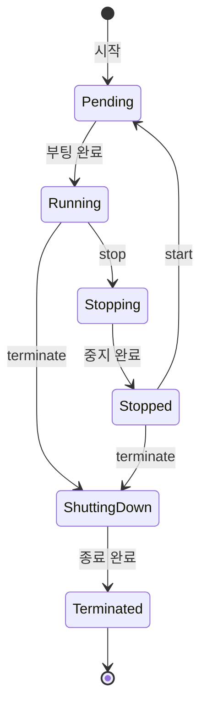
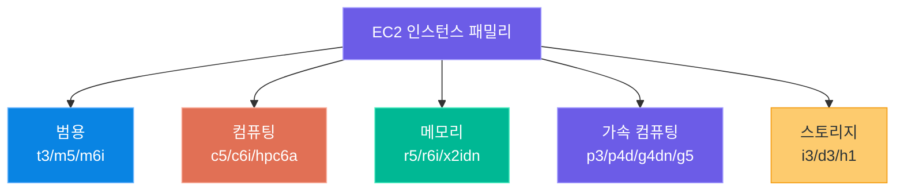
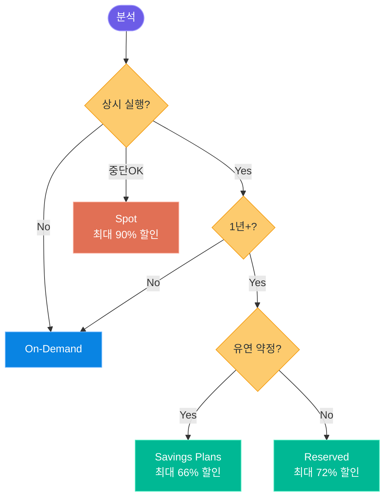
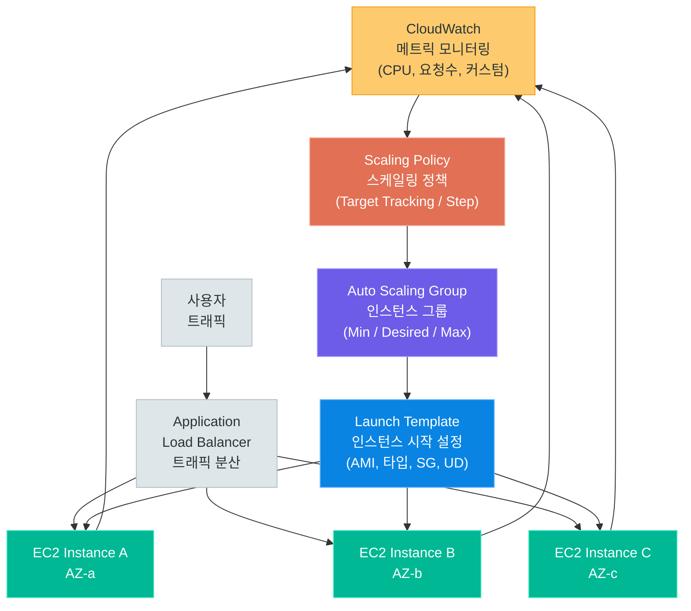

# EC2 심화

> AWS의 핵심 컴퓨팅 서비스 — 인스턴스 패밀리, 요금 체계, Auto Scaling, GPU 서빙까지 완전 정복

---

## 1. EC2 개요

### 가상 서버란 무엇인가

**Amazon EC2(Elastic Compute Cloud)**는 AWS 클라우드에서 제공하는 가상 서버 서비스입니다. 물리적 서버를 직접 구매하거나 운영할 필요 없이, 필요한 사양의 서버를 수 분 안에 시작하고 사용한 만큼만 비용을 지불할 수 있습니다.

```
전통적인 서버 방식         EC2 방식
─────────────────          ─────────────────
서버 구매 (수백만원)  →    클릭 한 번으로 시작
설치/설정 (수일)      →    수 분 내 가동
용량 예측 어려움      →    필요 시 즉시 확장/축소
하드웨어 관리 필요    →    AWS가 인프라 관리
초기 투자비용 높음    →    사용한 만큼만 과금
```

### EC2의 핵심 특징

| 특징 | 설명 |
|------|------|
| **탄력성 (Elastic)** | CPU, 메모리, 스토리지를 필요에 따라 즉시 조정 |
| **다양한 인스턴스 타입** | 범용, 컴퓨팅, 메모리, GPU 등 400개 이상의 인스턴스 타입 |
| **글로벌 인프라** | 전 세계 30+ 리전, 100+ 가용 영역에서 사용 가능 |
| **다양한 OS 지원** | Amazon Linux, Ubuntu, CentOS, Windows 등 |
| **보안** | VPC, 보안 그룹, IAM, 키페어로 다층 보안 구성 |
| **통합성** | S3, RDS, ELB, CloudWatch 등 AWS 서비스와 긴밀히 통합 |

> **핵심 포인트:** EC2는 단순한 가상 머신이 아닙니다. 스토리지(EBS), 네트워크(VPC), 로드 밸런서(ALB), 자동 확장(ASG) 등과 결합해 완전한 서버 인프라를 구성하는 기반 서비스입니다.

---

### 인스턴스 생명주기 (Instance Lifecycle)

EC2 인스턴스는 생성부터 종료까지 여러 상태를 거칩니다. 각 상태를 정확히 이해해야 비용 관리와 운영을 올바르게 할 수 있습니다.



### 상태별 상세 설명

| 상태 | 영문명 | 설명 | 과금 여부 |
|------|--------|------|-----------|
| **대기** | Pending | 인스턴스가 시작 중, 하이퍼바이저에 할당 중 | 미과금 |
| **실행 중** | Running | 정상 가동 상태, SSH 접속 가능 | **과금** |
| **중지 중** | Stopping | 중지 명령 실행 후 셧다운 진행 중 | 미과금 |
| **중지됨** | Stopped | 인스턴스 중지, EBS 데이터 유지 | EBS만 과금 |
| **재시작 중** | Rebooting | OS 수준 재부팅 (IP 주소 유지) | **과금** |
| **종료 중** | Shutting-down | terminate 명령 후 종료 진행 중 | 미과금 |
| **종료됨** | Terminated | 완전히 종료, 복구 불가 | 미과금 |

### 상태 전환 AWS CLI 명령어

```bash
# 인스턴스 시작
aws ec2 start-instances --instance-ids i-1234567890abcdef0

# 인스턴스 중지 (재시작 가능, EBS 유지)
aws ec2 stop-instances --instance-ids i-1234567890abcdef0

# 인스턴스 재부팅
aws ec2 reboot-instances --instance-ids i-1234567890abcdef0

# 인스턴스 종료 (완전 삭제)
aws ec2 terminate-instances --instance-ids i-1234567890abcdef0

# 인스턴스 상태 조회
aws ec2 describe-instance-status --instance-ids i-1234567890abcdef0

# 실행 중인 모든 인스턴스 목록
aws ec2 describe-instances \
    --filters "Name=instance-state-name,Values=running" \
    --query "Reservations[*].Instances[*].[InstanceId,InstanceType,PublicIpAddress]" \
    --output table
```

> **핵심 포인트:** `stop`(중지)과 `terminate`(종료)를 혼동하면 안 됩니다. `stop`은 중지 후 재시작이 가능하지만, `terminate`는 인스턴스와 기본 EBS 볼륨이 삭제되어 복구할 수 없습니다. 프로덕션 환경에서는 종료 방지(Termination Protection) 설정을 반드시 활성화하세요.

---

## 2. 인스턴스 패밀리

### 인스턴스 명명 규칙

EC2 인스턴스 타입명에는 일정한 규칙이 있습니다.

```
m  6  i  d  n  .  2xlarge
│  │  │  │  │     └── 크기
│  │  │  │  └──── 네트워크 최적화 (n: 향상된 네트워크)
│  │  │  └───── 추가 스토리지 (d: NVMe SSD)
│  │  └────── 프로세서 제조사 (i: Intel, a: AMD, g: Graviton ARM)
│  └───────── 세대 (숫자가 높을수록 최신)
└──────────── 인스턴스 패밀리 (m: 범용, c: 컴퓨팅, r: 메모리, g: GPU...)
```

**프로세서 접미사 의미:**

| 접미사 | 의미 | 예시 |
|--------|------|------|
| (없음) | Intel Xeon | m5.xlarge |
| **a** | AMD EPYC | m5a.xlarge |
| **g** | AWS Graviton (ARM) | m6g.xlarge |
| **i** | Intel Ice Lake | m6i.xlarge |
| **n** | 향상된 네트워크 대역폭 | m5n.xlarge |
| **d** | 로컬 NVMe SSD 포함 | m5d.xlarge |
| **z** | 고주파수 (High frequency) | m5zn.xlarge |

### 인스턴스 패밀리 전체 구조



---

### 범용 인스턴스 (General Purpose)

#### T 시리즈 — 버스트형 범용

T 시리즈는 **CPU 크레딧** 방식으로 동작합니다. 평소에는 낮은 CPU 사용률을 유지하다가 필요할 때 누적된 크레딧을 사용해 성능을 끌어올립니다.

| 타입 | 특징 | 주요 사용 사례 |
|------|------|--------------|
| **t3** | Intel Skylake, 버스트 지원 | 개발/테스트 서버, 소규모 웹 앱 |
| **t3a** | AMD EPYC, t3 대비 10% 저렴 | 비용 민감 개발 환경 |
| **t4g** | AWS Graviton2 (ARM), 최대 40% 저렴 | 컨테이너, 마이크로서비스 |

**T4g 사용 시 주의:** ARM 아키텍처이므로 소프트웨어 호환성 확인 필요. Python, Node.js, Java는 대부분 호환됨.

#### M 시리즈 — 균형잡힌 범용

CPU, 메모리, 네트워크 성능이 균형 잡혀 있는 가장 범용적인 시리즈입니다.

| 타입 | 프로세서 | 특징 | 사용 사례 |
|------|---------|------|---------|
| **m5** | Intel Xeon Platinum | 검증된 안정성 | 중규모 앱 서버, API 서버 |
| **m5a** | AMD EPYC 7000 | m5 대비 10% 저렴 | 비용 최적화 워크로드 |
| **m6i** | Intel Ice Lake | m5 대비 15% 성능 향상 | 엔터프라이즈 앱, DB |
| **m6a** | AMD EPYC 3세대 | 가격 대비 성능 우수 | 빌드 서버, 배치 처리 |
| **m6g** | AWS Graviton2 | 가격 대비 성능 40% 향상 | 웹 서버, 컨테이너, 마이크로서비스 |
| **m7g** | AWS Graviton3 | m6g 대비 25% 성능 향상 | 최신 ARM 워크로드 |

---

### 컴퓨팅 최적화 (Compute Optimized)

CPU 성능이 가장 중요한 워크로드에 적합합니다. 메모리 대비 vCPU 비율이 높습니다.

| 타입 | 프로세서 | vCPU:메모리 비율 | 사용 사례 |
|------|---------|----------------|---------|
| **c5** | Intel Xeon Platinum 8000 | 1:2 | 배치 처리, 과학 계산 |
| **c5a** | AMD EPYC 7002 | 1:2 | 비용 효율 컴퓨팅 |
| **c6i** | Intel Ice Lake | 1:2 | 고주파수 컴퓨팅 |
| **c6a** | AMD EPYC 3세대 | 1:2 | HPC, 게임 서버 |
| **c6g** | AWS Graviton2 | 1:2 | 웹 서버, 컨테이너 |
| **c7g** | AWS Graviton3 | 1:2 | 미디어 인코딩, HPC |
| **hpc6a** | AMD EPYC | 전용 HPC 클러스터 | 과학 시뮬레이션, HPC |

**AI/ML에서의 활용:** LLM 추론 시 CPU 전처리 및 후처리, 텍스트 임베딩 배치 처리, 모델 로딩 서버 등에 c6i 계열이 효율적입니다.

---

### 메모리 최적화 (Memory Optimized)

메모리 집약적 워크로드 전용. 인메모리 데이터베이스, 캐싱, 빅데이터 처리에 적합합니다.

| 타입 | 최대 메모리 | 특징 | 사용 사례 |
|------|------------|------|---------|
| **r5** | 768 GiB | 표준 메모리 최적화 | Redis, Elasticsearch, SAP |
| **r5a** | 768 GiB | AMD 기반, 10% 절감 | 메모리 집약 앱 |
| **r6i** | 1,024 GiB | Intel Ice Lake | 대용량 인메모리 DB |
| **r6g** | 512 GiB | Graviton2, 비용 효율 | 오픈소스 DB, 캐시 |
| **x2idn** | 3,904 GiB | NVMe SSD 포함 | 인메모리 데이터베이스 |
| **x2iedn** | 3,904 GiB | 향상된 네트워크 | SAP HANA, Sybase |
| **u-6tb1** | 6,144 GiB | 초대용량 메모리 | 대규모 SAP, 인메모리 분석 |
| **u-24tb1** | 24,576 GiB | AWS 최대 메모리 | 초대형 인메모리 워크로드 |

**AI/ML 활용:** 대형 언어 모델을 CPU 인퍼런스로 서빙할 때(llama.cpp, GGUF 포맷), 벡터 데이터베이스(Pinecone self-hosted, Weaviate), 대용량 임베딩 캐시 등에 r6i 계열이 유용합니다.

---

### GPU 인스턴스 (Accelerated Computing) — AI 핵심

AI/ML 워크로드의 핵심은 GPU 인스턴스입니다. 학습(Training)과 추론(Inference)에 따라 최적의 인스턴스가 다릅니다.

| 타입 | GPU | GPU 메모리 | 주요 용도 |
|------|-----|-----------|---------|
| **p3.2xlarge** | 1x NVIDIA V100 | 16 GiB | ML 학습 (소규모) |
| **p3.8xlarge** | 4x NVIDIA V100 | 64 GiB | ML 학습 (중규모) |
| **p3.16xlarge** | 8x NVIDIA V100 | 128 GiB | ML 학습 (대규모) |
| **p3dn.24xlarge** | 8x NVIDIA V100 (32G) | 256 GiB | 분산 학습 |
| **p4d.24xlarge** | 8x NVIDIA A100 (40G) | 320 GiB | 초대규모 모델 학습 |
| **p4de.24xlarge** | 8x NVIDIA A100 (80G) | 640 GiB | LLM 파인튜닝 |
| **g4dn.xlarge** | 1x NVIDIA T4 | 16 GiB | AI 추론, 소규모 |
| **g4dn.12xlarge** | 4x NVIDIA T4 | 64 GiB | AI 추론, 배치 |
| **g5.xlarge** | 1x NVIDIA A10G | 24 GiB | AI 추론/학습 |
| **g5.48xlarge** | 8x NVIDIA A10G | 192 GiB | 멀티 GPU 추론 |
| **dl1.24xlarge** | 8x Habana Gaudi | 256 GiB | DL 학습 (비용 효율) |
| **trn1.2xlarge** | 1x AWS Trainium | 32 GiB | AWS 학습 특화 |
| **inf1.xlarge** | 1x AWS Inferentia | 8 GiB | 초저비용 추론 |
| **inf2.xlarge** | 1x AWS Inferentia2 | 32 GiB | 고성능 추론 |

**AI 서비스 시나리오별 추천 인스턴스:**

| 시나리오 | 추천 인스턴스 | 이유 |
|---------|-------------|------|
| 소규모 모델 추론 서비스 | g4dn.xlarge | T4 GPU, 비용 효율적 |
| 중규모 LLM 추론 (7B~13B) | g5.xlarge ~ g5.2xlarge | A10G 24GB, 충분한 VRAM |
| 대형 LLM 추론 (70B+) | g5.48xlarge, p4d.24xlarge | 멀티 GPU, 대용량 VRAM |
| LLM 파인튜닝 (LoRA) | g5.12xlarge, p3.8xlarge | 충분한 VRAM, NVLink |
| 대규모 사전학습 | p4de.24xlarge, trn1.32xlarge | 최고 성능, AWS 최적화 |
| 비용 최적 추론 | inf2.xlarge, g4dn.xlarge | 낮은 단가, Spot 활용 |

---

### 스토리지 최적화 (Storage Optimized)

| 타입 | 스토리지 | 특징 | 사용 사례 |
|------|---------|------|---------|
| **i3.large** | 1x 475 GiB NVMe SSD | 고IOPS | Cassandra, MongoDB |
| **i3.16xlarge** | 8x 1,900 GiB NVMe SSD | 초고IOPS | 고성능 DB, 캐시 |
| **i3en.24xlarge** | 8x 7,500 GiB NVMe SSD | 초대용량 SSD | 데이터 레이크 |
| **i4i.32xlarge** | 8x 3,750 GiB NVMe SSD | 4세대 IOPS | 고성능 OLTP |
| **d3.8xlarge** | 24x 2,000 GiB HDD | 고밀도 HDD | Hadoop, 로그 저장 |
| **h1.16xlarge** | 8x 2,000 GiB HDD | 맵리듀스 최적화 | HDFS, 빅데이터 |

---

## 3. 인스턴스 크기와 스펙

### 크기 체계 이해

```
nano < micro < small < medium < large < xlarge < 2xlarge < 4xlarge < 8xlarge < 12xlarge < 16xlarge < 24xlarge < 32xlarge < 48xlarge < metal
```

일반적으로 크기가 두 배 커질 때마다 vCPU, 메모리, 네트워크 대역폭이 대략 두 배 증가합니다.

---

### t3 시리즈 전체 스펙 표

| 인스턴스 타입 | vCPU | 메모리 (GiB) | 네트워크 (Gbps) | EBS 대역폭 (Mbps) | 시간당 요금 (서울) |
|-------------|------|------------|--------------|-----------------|--------------|
| t3.nano | 2 | 0.5 | 최대 5 | 최대 1,024 | $0.0052 |
| t3.micro | 2 | 1 | 최대 5 | 최대 1,024 | $0.0104 |
| t3.small | 2 | 2 | 최대 5 | 최대 1,024 | $0.0208 |
| t3.medium | 2 | 4 | 최대 5 | 최대 1,024 | $0.0416 |
| t3.large | 2 | 8 | 최대 5 | 최대 1,024 | $0.0832 |
| t3.xlarge | 4 | 16 | 최대 5 | 최대 2,048 | $0.1664 |
| t3.2xlarge | 8 | 32 | 최대 5 | 최대 2,048 | $0.3328 |

**CPU 크레딧 기준 (t3):**

| 인스턴스 타입 | 초기 크레딧 | 크레딧 획득/시간 | 최대 누적 크레딧 | 기준 CPU 활용률 |
|-------------|-----------|--------------|--------------|-------------|
| t3.nano | 144 | 6 | 144 | 5% |
| t3.micro | 144 | 12 | 288 | 10% |
| t3.small | 144 | 24 | 576 | 20% |
| t3.medium | 144 | 24 | 576 | 20% |
| t3.large | 144 | 36 | 864 | 30% |
| t3.xlarge | 288 | 96 | 2,304 | 40% |
| t3.2xlarge | 576 | 192 | 4,608 | 40% |

> **핵심 포인트:** t3 시리즈는 기본적으로 **Unlimited 모드**가 활성화되어 있어, 크레딧이 부족해도 추가 비용을 내고 CPU를 계속 사용할 수 있습니다. 예상치 못한 높은 CPU 사용이 발생하면 추가 과금이 발생하므로 CloudWatch로 모니터링하세요.

---

### m6i 시리즈 전체 스펙 표

| 인스턴스 타입 | vCPU | 메모리 (GiB) | 네트워크 (Gbps) | EBS 대역폭 (Gbps) | 시간당 요금 (서울) |
|-------------|------|------------|--------------|-----------------|--------------|
| m6i.large | 2 | 8 | 최대 12.5 | 최대 10 | $0.128 |
| m6i.xlarge | 4 | 16 | 최대 12.5 | 최대 10 | $0.256 |
| m6i.2xlarge | 8 | 32 | 최대 12.5 | 최대 10 | $0.512 |
| m6i.4xlarge | 16 | 64 | 최대 12.5 | 최대 10 | $1.024 |
| m6i.8xlarge | 32 | 128 | 12.5 | 10 | $2.048 |
| m6i.12xlarge | 48 | 192 | 18.75 | 15 | $3.072 |
| m6i.16xlarge | 64 | 256 | 25 | 20 | $4.096 |
| m6i.24xlarge | 96 | 384 | 37.5 | 30 | $6.144 |
| m6i.32xlarge | 128 | 512 | 50 | 40 | $8.192 |
| m6i.metal | 128 | 512 | 50 | 40 | $8.192 |

---

### c6i 시리즈 전체 스펙 표

| 인스턴스 타입 | vCPU | 메모리 (GiB) | 네트워크 (Gbps) | EBS 대역폭 (Gbps) | 시간당 요금 (서울) |
|-------------|------|------------|--------------|-----------------|--------------|
| c6i.large | 2 | 4 | 최대 12.5 | 최대 10 | $0.108 |
| c6i.xlarge | 4 | 8 | 최대 12.5 | 최대 10 | $0.216 |
| c6i.2xlarge | 8 | 16 | 최대 12.5 | 최대 10 | $0.432 |
| c6i.4xlarge | 16 | 32 | 최대 12.5 | 최대 10 | $0.864 |
| c6i.8xlarge | 32 | 64 | 12.5 | 10 | $1.728 |
| c6i.12xlarge | 48 | 96 | 18.75 | 15 | $2.592 |
| c6i.16xlarge | 64 | 128 | 25 | 20 | $3.456 |
| c6i.24xlarge | 96 | 192 | 37.5 | 30 | $5.184 |
| c6i.32xlarge | 128 | 256 | 50 | 40 | $6.912 |
| c6i.metal | 128 | 256 | 50 | 40 | $6.912 |

---

### g4dn 시리즈 전체 스펙 표 (AI 추론 최적)

| 인스턴스 타입 | vCPU | 메모리 (GiB) | GPU (T4) | GPU 메모리 (GiB) | 로컬 NVMe (GiB) | 네트워크 (Gbps) | 시간당 요금 (서울) |
|-------------|------|------------|---------|----------------|--------------|--------------|--------------|
| g4dn.xlarge | 4 | 16 | 1 | 16 | 125 | 최대 25 | $0.736 |
| g4dn.2xlarge | 8 | 32 | 1 | 16 | 225 | 최대 25 | $1.052 |
| g4dn.4xlarge | 16 | 64 | 1 | 16 | 225 | 최대 25 | $1.686 |
| g4dn.8xlarge | 32 | 128 | 1 | 16 | 900 | 25 | $3.044 |
| g4dn.12xlarge | 48 | 192 | 4 | 64 | 900 | 50 | $5.016 |
| g4dn.16xlarge | 64 | 256 | 1 | 16 | 900 | 50 | $5.984 |
| g4dn.metal | 96 | 384 | 8 | 128 | 3,840 | 100 | $11.720 |

---

### g5 시리즈 전체 스펙 표 (AI 추론/소규모 학습)

| 인스턴스 타입 | vCPU | 메모리 (GiB) | GPU (A10G) | GPU 메모리 (GiB) | 로컬 NVMe (GiB) | 네트워크 (Gbps) | 시간당 요금 (서울) |
|-------------|------|------------|-----------|----------------|--------------|--------------|--------------|
| g5.xlarge | 4 | 16 | 1 | 24 | 250 | 최대 10 | $1.212 |
| g5.2xlarge | 8 | 32 | 1 | 24 | 450 | 최대 10 | $1.518 |
| g5.4xlarge | 16 | 64 | 1 | 24 | 600 | 최대 25 | $2.130 |
| g5.8xlarge | 32 | 128 | 1 | 24 | 900 | 25 | $3.354 |
| g5.12xlarge | 48 | 192 | 4 | 96 | 3,800 | 40 | $7.086 |
| g5.16xlarge | 64 | 256 | 1 | 24 | 1,900 | 25 | $5.802 |
| g5.24xlarge | 96 | 384 | 4 | 96 | 3,800 | 50 | $10.614 |
| g5.48xlarge | 192 | 768 | 8 | 192 | 7,600 | 100 | $21.218 |

---

### r6i 시리즈 스펙 표 (메모리 최적화)

| 인스턴스 타입 | vCPU | 메모리 (GiB) | 네트워크 (Gbps) | EBS 대역폭 (Gbps) | 시간당 요금 (서울) |
|-------------|------|------------|--------------|-----------------|--------------|
| r6i.large | 2 | 16 | 최대 12.5 | 최대 10 | $0.168 |
| r6i.xlarge | 4 | 32 | 최대 12.5 | 최대 10 | $0.336 |
| r6i.2xlarge | 8 | 64 | 최대 12.5 | 최대 10 | $0.672 |
| r6i.4xlarge | 16 | 128 | 최대 12.5 | 최대 10 | $1.344 |
| r6i.8xlarge | 32 | 256 | 12.5 | 10 | $2.688 |
| r6i.12xlarge | 48 | 384 | 18.75 | 15 | $4.032 |
| r6i.16xlarge | 64 | 512 | 25 | 20 | $5.376 |
| r6i.24xlarge | 96 | 768 | 37.5 | 30 | $8.064 |
| r6i.32xlarge | 128 | 1,024 | 50 | 40 | $10.752 |

---

## 4. 요금 체계

### EC2 요금 모델 비교



---

### On-Demand 요금

사용한 만큼만 지불하는 가장 기본적인 요금 모델입니다.

| 항목 | 내용 |
|------|------|
| **과금 단위** | 초 단위 (최소 60초) — Linux/macOS |
| **Windows** | 시간 단위 (시작 시간 기준) |
| **약정** | 없음 |
| **사용 사례** | 단기 워크로드, 개발/테스트, 예측 불가능한 트래픽 |
| **장점** | 유연성 최고, 즉시 시작/중지 |
| **단점** | 요금이 가장 비쌈 |

```bash
# 실행 중인 인스턴스 요금 확인 (Cost Explorer API)
aws ce get-cost-and-usage \
    --time-period Start=2025-01-01,End=2025-01-31 \
    --granularity MONTHLY \
    --metrics "BlendedCost" \
    --group-by Type=DIMENSION,Key=SERVICE \
    --filter '{"Dimensions": {"Key": "SERVICE", "Values": ["Amazon EC2"]}}'
```

---

### Reserved Instance (예약 인스턴스)

1년 또는 3년 약정을 통해 최대 72% 할인을 받는 요금 모델입니다.

| 구분 | 선결제 유형 | 할인율 (1년) | 할인율 (3년) |
|------|-----------|------------|------------|
| **전액 선결제** | All Upfront | ~40% | ~60~72% |
| **부분 선결제** | Partial Upfront | ~35% | ~55~65% |
| **선결제 없음** | No Upfront | ~30% | ~45~55% |

**RI 범위(Scope):**

| 범위 | 설명 | 유연성 |
|------|------|-------|
| **Regional** | 특정 리전 내 어떤 AZ에서도 적용 | 높음 |
| **Zonal** | 특정 AZ에 고정, 용량 예약 보장 | 낮음 |

**RI 유형:**

| 유형 | 설명 | 유연성 |
|------|------|-------|
| **Standard RI** | 특정 인스턴스 패밀리, 크기 고정 | 낮음 (할인 최대) |
| **Convertible RI** | 패밀리/크기/OS 변경 가능 | 높음 (할인 약간 낮음) |

---

### Spot Instance

미사용 EC2 용량을 경매 방식으로 제공하는 최대 90% 할인 요금 모델입니다.

**핵심 특성:**

```
- 온디맨드 대비 최대 90% 저렴
- AWS가 용량 필요 시 2분 예고 후 중단 가능
- 중단 전 Spot Interruption Notice 제공
- 중단 후 재시작 가능 (상태 저장 설계 권장)
- Spot Fleet으로 여러 인스턴스 타입 조합 가능
```

**Spot 적합 워크로드:**

| 적합 | 부적합 |
|------|-------|
| 배치 ML 학습 | 온라인 트랜잭션 처리 (OLTP) |
| 데이터 처리/분석 | 지속적 API 서버 |
| 렌더링 팜 | 실시간 게임 서버 |
| CI/CD 빌드 | 단일 포인트 장애 불가 |
| 분산 ML 추론 (체크포인트) | 스테이트풀 세션 |

```bash
# Spot 가격 히스토리 조회
aws ec2 describe-spot-price-history \
    --instance-types g4dn.xlarge \
    --product-descriptions "Linux/UNIX" \
    --start-time 2025-01-01T00:00:00 \
    --region ap-northeast-2 \
    --query "SpotPriceHistory[*].[Timestamp,SpotPrice,AvailabilityZone]" \
    --output table

# Spot 인스턴스 요청
aws ec2 request-spot-instances \
    --instance-count 1 \
    --type "one-time" \
    --launch-specification '{
        "ImageId": "ami-0c6e5afdd23291f73",
        "InstanceType": "g4dn.xlarge",
        "KeyName": "my-keypair",
        "SecurityGroupIds": ["sg-12345678"]
    }'
```

---

### Savings Plans

인스턴스 타입에 관계없이 시간당 지출 약정으로 할인받는 유연한 요금 모델입니다.

| 구분 | Compute Savings Plans | EC2 Instance Savings Plans |
|------|---------------------|--------------------------|
| **할인율** | 최대 66% | 최대 72% |
| **유연성** | 패밀리, 리전, OS 자유 변경 | 리전 내 크기, OS 변경 가능 |
| **약정** | 1년 또는 3년 | 1년 또는 3년 |
| **적용 범위** | EC2, Lambda, Fargate | 특정 EC2 패밀리 내 |

---

### 실제 월간 비용 계산 예시 — t3.medium 기준

**시나리오: 개발 서버 1대를 1개월(744시간) 운영**

```
인스턴스: t3.medium (2 vCPU, 4 GiB RAM)
리전: 서울 (ap-northeast-2)
OS: Amazon Linux 2023
EBS: gp3 20 GiB
데이터 전송: 10 GiB (아웃바운드)
```

| 항목 | 계산 | 비용 |
|------|------|------|
| EC2 On-Demand (24시간×31일) | $0.0416 × 744시간 | $30.95 |
| EBS gp3 20 GiB | $0.0912/GiB × 20 GiB | $1.82 |
| EBS 스냅샷 없음 | - | $0.00 |
| 데이터 전송 (인바운드) | 무료 | $0.00 |
| 데이터 전송 (아웃바운드 10GiB) | $0.126/GiB × 10 GiB | $1.26 |
| **월 합계** | | **$34.03** |

**요금 모델별 t3.medium 월간 비용 비교:**

| 요금 모델 | 월 비용 | 절감률 | 비고 |
|---------|--------|-------|------|
| On-Demand | $30.95 | 기준 | 약정 없음 |
| 1년 RI (부분 선결제) | ~$20.12 | ~35% | 1년 약정 |
| 3년 RI (전액 선결제) | ~$12.38 | ~60% | 3년 약정 |
| Compute Savings Plans 1년 | ~$21.00 | ~32% | 유연한 약정 |
| Spot Instance | ~$9.29 | ~70% | 중단 가능 |

> **핵심 포인트:** 프로덕션 환경에서 24시간 운영되는 인스턴스는 Reserved Instance 또는 Savings Plans를 적극 활용하세요. 1년 약정만으로도 30~40% 비용 절감이 가능합니다. 배치 ML 학습처럼 중단 허용 워크로드는 Spot을 사용해 최대 90% 절감 가능합니다.

---

## 5. AMI와 인스턴스 시작

### AMI (Amazon Machine Image)

AMI는 인스턴스를 시작하는 데 필요한 모든 정보를 포함하는 템플릿입니다.

```
AMI 구성 요소:
├── OS 및 사전 설치 소프트웨어
├── 루트 볼륨 스냅샷 (EBS 또는 Instance Store)
├── 블록 디바이스 매핑
└── 시작 권한 (공개/비공개/특정 계정)
```

**주요 AMI 유형:**

| AMI 종류 | 특징 | 권장 사용 시나리오 |
|---------|------|---------------|
| **Amazon Linux 2023 (AL2023)** | AWS 최적화, 최신 커널, SELinux | 일반 서버, 프로덕션 |
| **Amazon Linux 2 (AL2)** | 이전 세대, 안정성 | 레거시 호환 필요 시 |
| **Ubuntu 22.04 LTS** | 광범위한 커뮤니티, 소프트웨어 풍부 | 개발 서버, 오픈소스 |
| **Ubuntu 20.04 LTS** | 안정적인 LTS, 넓은 지원 | 안정성 우선 환경 |
| **Red Hat Enterprise Linux** | 엔터프라이즈 지원, FIPS | 규제 환경, 기업 |
| **Windows Server 2022** | Microsoft 생태계 | .NET 앱, Active Directory |
| **Deep Learning AMI** | CUDA/cuDNN/PyTorch 사전 설치 | GPU ML 워크로드 |

**AI/ML에 최적화된 AMI:**

```bash
# AWS Deep Learning AMI (AL2023) 조회
aws ec2 describe-images \
    --owners amazon \
    --filters "Name=name,Values=Deep Learning AMI GPU PyTorch*" \
              "Name=state,Values=available" \
    --query "Images[*].[ImageId,Name,CreationDate]" \
    --output table \
    --region ap-northeast-2

# Ubuntu 22.04 최신 AMI ID 조회
aws ec2 describe-images \
    --owners 099720109477 \
    --filters "Name=name,Values=ubuntu/images/hvm-ssd/ubuntu-jammy-22.04-amd64-server-*" \
              "Name=state,Values=available" \
    --query "sort_by(Images, &CreationDate)[-1].ImageId" \
    --output text \
    --region ap-northeast-2
```

---

### 커스텀 AMI 생성

실행 중인 인스턴스에서 커스텀 AMI를 생성하면 동일한 설정의 인스턴스를 빠르게 복제할 수 있습니다.

```bash
# 1단계: 인스턴스에서 AMI 생성
aws ec2 create-image \
    --instance-id i-1234567890abcdef0 \
    --name "my-ai-server-v1.0-$(date +%Y%m%d)" \
    --description "PyTorch 2.1, FastAPI, CUDA 12.1 설치된 AI 서버 이미지" \
    --no-reboot \
    --tag-specifications 'ResourceType=image,Tags=[{Key=Name,Value=ai-server},{Key=Version,Value=1.0}]'

# 2단계: AMI 생성 완료 대기
aws ec2 wait image-available \
    --image-ids ami-0123456789abcdef0

# 3단계: AMI 정보 확인
aws ec2 describe-images \
    --image-ids ami-0123456789abcdef0 \
    --query "Images[0].[ImageId,Name,State,CreationDate]" \
    --output table

# 4단계: 커스텀 AMI로 새 인스턴스 시작
aws ec2 run-instances \
    --image-id ami-0123456789abcdef0 \
    --instance-type g4dn.xlarge \
    --key-name my-keypair \
    --security-group-ids sg-12345678 \
    --subnet-id subnet-12345678 \
    --count 1 \
    --tag-specifications 'ResourceType=instance,Tags=[{Key=Name,Value=ai-inference-server}]'
```

---

### 키페어 생성 및 관리

EC2 인스턴스에 SSH로 접속하려면 키페어가 필요합니다.

**키 알고리즘 비교:**

| 알고리즘 | 키 길이 | 보안성 | 성능 | AWS 지원 |
|---------|--------|-------|------|---------|
| **ED25519** | 256비트 | 매우 높음 | 빠름 | 지원 (권장) |
| **RSA 4096** | 4096비트 | 높음 | 느림 | 지원 |
| **RSA 2048** | 2048비트 | 보통 | 보통 | 지원 (비권장) |

```bash
# ED25519 키페어 생성 (AWS에서 생성, 프라이빗 키 다운로드)
aws ec2 create-key-pair \
    --key-name my-ed25519-keypair \
    --key-type ed25519 \
    --query "KeyMaterial" \
    --output text > ~/.ssh/my-ed25519-keypair.pem

# 키 파일 권한 설정 (반드시 필요!)
chmod 400 ~/.ssh/my-ed25519-keypair.pem

# 로컬에서 키 생성 후 AWS에 등록 (퍼블릭 키만 AWS에 저장)
ssh-keygen -t ed25519 -C "my-aws-keypair" -f ~/.ssh/my-aws-keypair

# 퍼블릭 키를 AWS에 임포트
aws ec2 import-key-pair \
    --key-name my-imported-keypair \
    --public-key-material fileb://~/.ssh/my-aws-keypair.pub

# 키페어 목록 확인
aws ec2 describe-key-pairs \
    --query "KeyPairs[*].[KeyName,KeyType,CreateTime]" \
    --output table

# 키페어 삭제
aws ec2 delete-key-pair --key-name my-old-keypair
```

---

### SSH 접속 방법

```bash
# 기본 SSH 접속 (EC2 Instance Connect 또는 키페어)
ssh -i ~/.ssh/my-ed25519-keypair.pem ec2-user@<PUBLIC_IP>

# Ubuntu의 경우 기본 사용자가 다름
ssh -i ~/.ssh/my-keypair.pem ubuntu@<PUBLIC_IP>

# 특정 포트 변경 시
ssh -i ~/.ssh/my-keypair.pem -p 2222 ec2-user@<PUBLIC_IP>

# SSH 터널링 (로컬 포트 포워딩) — Jupyter Notebook 원격 접속
ssh -i ~/.ssh/my-keypair.pem \
    -L 8888:localhost:8888 \
    -N \
    ubuntu@<PUBLIC_IP>

# ~/.ssh/config 파일 설정 (편리한 접속을 위해)
cat >> ~/.ssh/config << 'EOF'
Host ai-server
    HostName <PUBLIC_IP>
    User ubuntu
    IdentityFile ~/.ssh/my-keypair.pem
    ServerAliveInterval 60
    ServerAliveCountMax 3
EOF

# config 설정 후 간편 접속
ssh ai-server

# EC2 Instance Connect (키페어 없이 브라우저/CLI로 접속)
aws ec2-instance-connect send-ssh-public-key \
    --instance-id i-1234567890abcdef0 \
    --availability-zone ap-northeast-2a \
    --instance-os-user ec2-user \
    --ssh-public-key file://~/.ssh/my-temp-key.pub

# SCP로 파일 전송
scp -i ~/.ssh/my-keypair.pem model.pt ubuntu@<PUBLIC_IP>:/home/ubuntu/models/

# 원격 디렉토리 전체 복사
scp -i ~/.ssh/my-keypair.pem -r ./project ubuntu@<PUBLIC_IP>:/home/ubuntu/
```

---

## 6. 사용자 데이터와 메타데이터

### User Data 스크립트

User Data는 인스턴스가 처음 시작될 때 자동으로 실행되는 스크립트입니다. 초기 환경 설정 자동화에 필수적입니다.

**실행 특성:**
```
- 루트 권한으로 실행됨 (sudo 불필요)
- 최초 부팅 시 1회만 실행
- 실행 로그: /var/log/cloud-init-output.log
- 최대 크기: 16 KB (base64 인코딩 전)
- 스크립트 첫 줄: #!/bin/bash (shebang 필수)
```

**예시 1: Nginx 웹 서버 자동 설치 (AL2023)**

```bash
#!/bin/bash
# Amazon Linux 2023용 Nginx 설치 User Data

# 로그 파일 설정
exec > >(tee /var/log/user-data.log|logger -t user-data -s 2>/dev/console) 2>&1

echo "=== 시스템 업데이트 시작 ==="
dnf update -y

echo "=== Nginx 설치 ==="
dnf install -y nginx

echo "=== Nginx 서비스 시작 및 활성화 ==="
systemctl start nginx
systemctl enable nginx

echo "=== 기본 index.html 작성 ==="
INSTANCE_ID=$(curl -s http://169.254.169.254/latest/meta-data/instance-id)
REGION=$(curl -s http://169.254.169.254/latest/meta-data/placement/region)

cat > /usr/share/nginx/html/index.html << EOF
<!DOCTYPE html>
<html>
<head><title>AI Server</title></head>
<body>
<h1>Instance: $INSTANCE_ID</h1>
<p>Region: $REGION</p>
<p>Status: Running</p>
</body>
</html>
EOF

echo "=== 설치 완료 ==="
```

**예시 2: Python AI 환경 설정 (Ubuntu 22.04)**

```bash
#!/bin/bash
# Ubuntu 22.04 AI 개발 환경 구성 User Data

set -e
exec > >(tee /var/log/user-data.log|logger -t user-data -s 2>/dev/console) 2>&1

echo "=== 패키지 업데이트 ==="
apt-get update -y
apt-get upgrade -y

echo "=== 필수 패키지 설치 ==="
apt-get install -y \
    python3.11 \
    python3.11-venv \
    python3-pip \
    git \
    curl \
    wget \
    htop \
    vim \
    build-essential

echo "=== Python 가상 환경 생성 ==="
su - ubuntu -c "python3.11 -m venv /home/ubuntu/venv"

echo "=== AI 패키지 설치 ==="
su - ubuntu -c "
    source /home/ubuntu/venv/bin/activate
    pip install --upgrade pip
    pip install \
        torch==2.1.0 \
        transformers==4.36.0 \
        fastapi==0.104.1 \
        uvicorn==0.24.0 \
        pydantic==2.5.2 \
        boto3==1.34.0 \
        numpy \
        pandas \
        scikit-learn
"

echo "=== FastAPI 서비스 설정 ==="
cat > /etc/systemd/system/ai-api.service << 'SYSTEMD_EOF'
[Unit]
Description=AI API Server
After=network.target

[Service]
Type=simple
User=ubuntu
WorkingDirectory=/home/ubuntu/app
Environment=PATH=/home/ubuntu/venv/bin
ExecStart=/home/ubuntu/venv/bin/uvicorn main:app --host 0.0.0.0 --port 8000
Restart=always
RestartSec=3

[Install]
WantedBy=multi-user.target
SYSTEMD_EOF

systemctl daemon-reload
# 앱 디렉토리 생성 (애플리케이션 코드 배포 후 활성화)
mkdir -p /home/ubuntu/app
chown ubuntu:ubuntu /home/ubuntu/app

echo "=== GPU 드라이버 확인 ==="
if command -v nvidia-smi &> /dev/null; then
    echo "GPU 감지됨:"
    nvidia-smi
else
    echo "GPU 없음 (CPU 모드)"
fi

echo "=== 환경 구성 완료 ==="
echo "Python 버전: $(python3.11 --version)"
```

**예시 3: GPU 인스턴스 PyTorch 서빙 환경 (AL2023 DLAMI 기반)**

```bash
#!/bin/bash
# GPU 인스턴스 AI 모델 서빙 환경 구성

exec > >(tee /var/log/user-data.log|logger -t user-data -s 2>/dev/console) 2>&1

echo "=== CUDA 환경 확인 ==="
nvidia-smi
nvcc --version

echo "=== Miniconda 설치 ==="
wget -q https://repo.anaconda.com/miniconda/Miniconda3-latest-Linux-x86_64.sh -O /tmp/miniconda.sh
bash /tmp/miniconda.sh -b -p /opt/conda
rm /tmp/miniconda.sh

export PATH="/opt/conda/bin:$PATH"
echo 'export PATH="/opt/conda/bin:$PATH"' >> /etc/profile.d/conda.sh

echo "=== PyTorch 환경 생성 ==="
/opt/conda/bin/conda create -n torch-serving python=3.11 -y
/opt/conda/bin/conda run -n torch-serving pip install \
    torch==2.1.0+cu121 \
    torchvision==0.16.0+cu121 \
    --extra-index-url https://download.pytorch.org/whl/cu121

echo "=== TorchServe 설치 ==="
/opt/conda/bin/conda run -n torch-serving pip install \
    torchserve \
    torch-model-archiver \
    torch-workflow-archiver

echo "=== S3에서 모델 다운로드 ==="
# IAM 역할이 있다면 S3에서 모델 로드 가능
# aws s3 cp s3://my-model-bucket/model.pt /home/ec2-user/models/

echo "=== 설정 완료 ==="
```

---

### User Data AWS CLI 로 인스턴스 시작

```bash
# User Data 파일을 지정하여 인스턴스 시작
aws ec2 run-instances \
    --image-id ami-0c6e5afdd23291f73 \
    --instance-type t3.medium \
    --key-name my-keypair \
    --security-group-ids sg-12345678 \
    --subnet-id subnet-12345678 \
    --user-data file://user-data.sh \
    --iam-instance-profile Name=ec2-s3-role \
    --tag-specifications 'ResourceType=instance,Tags=[{Key=Name,Value=ai-dev-server}]' \
    --count 1

# 실행 중인 인스턴스의 User Data 확인
aws ec2 describe-instance-attribute \
    --instance-id i-1234567890abcdef0 \
    --attribute userData \
    --query "UserData.Value" \
    --output text | base64 --decode
```

---

### Instance Metadata Service (IMDS)

IMDS는 인스턴스 내부에서 자신의 정보를 조회할 수 있는 HTTP 엔드포인트입니다.

**IMDSv1 vs IMDSv2 비교:**

| 항목 | IMDSv1 | IMDSv2 (권장) |
|------|--------|-------------|
| **인증 방식** | 없음 (단순 GET) | 토큰 기반 (세션 방식) |
| **보안** | SSRF 공격에 취약 | SSRF 방어 가능 |
| **AWS 권장** | 비권장 (deprecated 방향) | 강력 권장 |
| **사용법** | 단순 curl | 토큰 발급 후 헤더 포함 |

**IMDSv2 사용 예시:**

```bash
# 1단계: 토큰 발급 (TTL: 최대 21600초 = 6시간)
TOKEN=$(curl -s -X PUT "http://169.254.169.254/latest/api/token" \
    -H "X-aws-ec2-metadata-token-ttl-seconds: 21600")

# 2단계: 토큰으로 메타데이터 조회

# 인스턴스 ID
curl -s -H "X-aws-ec2-metadata-token: $TOKEN" \
    http://169.254.169.254/latest/meta-data/instance-id

# 인스턴스 타입
curl -s -H "X-aws-ec2-metadata-token: $TOKEN" \
    http://169.254.169.254/latest/meta-data/instance-type

# 퍼블릭 IP 주소
curl -s -H "X-aws-ec2-metadata-token: $TOKEN" \
    http://169.254.169.254/latest/meta-data/public-ipv4

# 프라이빗 IP 주소
curl -s -H "X-aws-ec2-metadata-token: $TOKEN" \
    http://169.254.169.254/latest/meta-data/local-ipv4

# IAM 역할 크리덴셜 (임시 자격 증명)
ROLE_NAME=$(curl -s -H "X-aws-ec2-metadata-token: $TOKEN" \
    http://169.254.169.254/latest/meta-data/iam/security-credentials/)
curl -s -H "X-aws-ec2-metadata-token: $TOKEN" \
    http://169.254.169.254/latest/meta-data/iam/security-credentials/$ROLE_NAME

# 가용 영역
curl -s -H "X-aws-ec2-metadata-token: $TOKEN" \
    http://169.254.169.254/latest/meta-data/placement/availability-zone

# Spot 중단 알림 확인 (Spot Instance에서 주기적으로 체크)
curl -s -H "X-aws-ec2-metadata-token: $TOKEN" \
    http://169.254.169.254/latest/meta-data/spot/termination-time
# 응답 없으면 정상, 중단 예고 시 타임스탬프 반환

# User Data 조회
curl -s -H "X-aws-ec2-metadata-token: $TOKEN" \
    http://169.254.169.254/latest/user-data

# 전체 메타데이터 카테고리 목록
curl -s -H "X-aws-ec2-metadata-token: $TOKEN" \
    http://169.254.169.254/latest/meta-data/
```

**Python으로 메타데이터 조회:**

```python
import requests

def get_instance_metadata(key: str) -> str:
    """IMDSv2 방식으로 인스턴스 메타데이터를 조회합니다."""
    base_url = "http://169.254.169.254/latest/meta-data"

    # 토큰 발급
    token_response = requests.put(
        "http://169.254.169.254/latest/api/token",
        headers={"X-aws-ec2-metadata-token-ttl-seconds": "21600"},
        timeout=2
    )
    token = token_response.text

    # 메타데이터 조회
    response = requests.get(
        f"{base_url}/{key}",
        headers={"X-aws-ec2-metadata-token": token},
        timeout=2
    )
    return response.text

# 사용 예시
instance_id = get_instance_metadata("instance-id")
instance_type = get_instance_metadata("instance-type")
az = get_instance_metadata("placement/availability-zone")

print(f"인스턴스 ID: {instance_id}")
print(f"인스턴스 타입: {instance_type}")
print(f"가용 영역: {az}")
```

**IMDSv2 강제 적용 설정:**

```bash
# 실행 중인 인스턴스에 IMDSv2 강제 적용
aws ec2 modify-instance-metadata-options \
    --instance-id i-1234567890abcdef0 \
    --http-tokens required \
    --http-endpoint enabled

# 새 인스턴스 시작 시 IMDSv2 강제 설정
aws ec2 run-instances \
    --image-id ami-0c6e5afdd23291f73 \
    --instance-type t3.medium \
    --metadata-options "HttpTokens=required,HttpEndpoint=enabled" \
    --key-name my-keypair
```

> **핵심 포인트:** IMDSv2는 보안 강화를 위해 반드시 사용하세요. IMDSv1은 SSRF(Server-Side Request Forgery) 공격으로 IAM 크리덴셜이 탈취될 수 있는 위험이 있습니다. 계정 수준에서 IMDSv2를 기본값으로 강제하는 것을 권장합니다.

---

## 7. EC2 실전 팁

### GPU 인스턴스로 AI 모델 서빙

#### g4dn / g5로 PyTorch 모델 배포

```python
# FastAPI + PyTorch 모델 서빙 예시
# /home/ubuntu/app/main.py

import torch
from transformers import AutoTokenizer, AutoModelForCausalLM
from fastapi import FastAPI, HTTPException
from pydantic import BaseModel
import uvicorn
import logging
import time

logging.basicConfig(level=logging.INFO)
logger = logging.getLogger(__name__)

app = FastAPI(title="LLM Inference API", version="1.0.0")

# 모델 로딩 (서버 시작 시 1회)
MODEL_ID = "microsoft/phi-2"  # 예시 (g4dn.xlarge에 적합한 소형 모델)
device = "cuda" if torch.cuda.is_available() else "cpu"

logger.info(f"디바이스: {device}")
logger.info(f"GPU: {torch.cuda.get_device_name(0) if device == 'cuda' else 'N/A'}")

tokenizer = AutoTokenizer.from_pretrained(MODEL_ID)
model = AutoModelForCausalLM.from_pretrained(
    MODEL_ID,
    torch_dtype=torch.float16,  # FP16으로 VRAM 절약
    device_map="auto"           # 자동으로 GPU 할당
)
model.eval()
logger.info("모델 로딩 완료")

class GenerateRequest(BaseModel):
    prompt: str
    max_new_tokens: int = 256
    temperature: float = 0.7
    top_p: float = 0.9

class GenerateResponse(BaseModel):
    generated_text: str
    input_tokens: int
    output_tokens: int
    latency_ms: float
    device: str

@app.get("/health")
async def health_check():
    """헬스체크 엔드포인트"""
    gpu_memory = {}
    if device == "cuda":
        gpu_memory = {
            "allocated_gb": round(torch.cuda.memory_allocated() / 1e9, 2),
            "reserved_gb": round(torch.cuda.memory_reserved() / 1e9, 2)
        }
    return {"status": "healthy", "device": device, "gpu_memory": gpu_memory}

@app.post("/generate", response_model=GenerateResponse)
async def generate(request: GenerateRequest):
    """텍스트 생성 엔드포인트"""
    try:
        start_time = time.time()

        inputs = tokenizer(request.prompt, return_tensors="pt").to(device)
        input_token_count = inputs["input_ids"].shape[1]

        with torch.no_grad():
            outputs = model.generate(
                **inputs,
                max_new_tokens=request.max_new_tokens,
                temperature=request.temperature,
                top_p=request.top_p,
                do_sample=True,
                pad_token_id=tokenizer.eos_token_id
            )

        output_text = tokenizer.decode(
            outputs[0][input_token_count:],
            skip_special_tokens=True
        )

        latency = (time.time() - start_time) * 1000

        return GenerateResponse(
            generated_text=output_text,
            input_tokens=input_token_count,
            output_tokens=outputs.shape[1] - input_token_count,
            latency_ms=round(latency, 2),
            device=device
        )

    except Exception as e:
        logger.error(f"추론 오류: {e}")
        raise HTTPException(status_code=500, detail=str(e))

if __name__ == "__main__":
    uvicorn.run(app, host="0.0.0.0", port=8000, workers=1)
```

#### TensorRT로 추론 최적화

```bash
# NVIDIA TensorRT로 PyTorch 모델 최적화 (g4dn/g5에서 2~4배 속도 향상)

# 1. torch2trt 설치
pip install torch-tensorrt

# 2. Python에서 TensorRT 변환
python3 << 'EOF'
import torch
import torch_tensorrt

# 기존 PyTorch 모델 로드
model = torch.load("model.pt").eval().cuda()

# TensorRT로 컴파일
trt_model = torch_tensorrt.compile(
    model,
    inputs=[torch_tensorrt.Input(
        min_shape=[1, 512],
        opt_shape=[4, 512],
        max_shape=[8, 512],
        dtype=torch.half
    )],
    enabled_precisions={torch.half}  # FP16 최적화
)

# 최적화된 모델 저장
torch.jit.save(trt_model, "model_trt.ts")
print("TensorRT 최적화 완료!")
EOF
```

---

### Auto Scaling 기초

#### Auto Scaling Group (ASG) 아키텍처



#### Launch Template 생성

```bash
# Launch Template 생성 (JSON 설정 파일)
cat > launch-template-config.json << 'EOF'
{
    "LaunchTemplateName": "ai-server-lt",
    "VersionDescription": "AI 서버 기본 설정",
    "LaunchTemplateData": {
        "ImageId": "ami-0c6e5afdd23291f73",
        "InstanceType": "g4dn.xlarge",
        "KeyName": "my-keypair",
        "SecurityGroupIds": ["sg-12345678"],
        "IamInstanceProfile": {
            "Name": "ec2-ai-role"
        },
        "BlockDeviceMappings": [
            {
                "DeviceName": "/dev/xvda",
                "Ebs": {
                    "VolumeSize": 50,
                    "VolumeType": "gp3",
                    "Iops": 3000,
                    "Throughput": 125,
                    "DeleteOnTermination": true
                }
            }
        ],
        "MetadataOptions": {
            "HttpTokens": "required",
            "HttpEndpoint": "enabled"
        },
        "TagSpecifications": [
            {
                "ResourceType": "instance",
                "Tags": [
                    {"Key": "Name", "Value": "ai-inference-server"},
                    {"Key": "Environment", "Value": "production"}
                ]
            }
        ],
        "UserData": "IyEvYmluL2Jhc2gKZWNobyAiQUkgU2VydmVyIFN0YXJ0ZWQi"
    }
}
EOF

aws ec2 create-launch-template \
    --cli-input-json file://launch-template-config.json
```

#### Auto Scaling Group 생성

```bash
# Auto Scaling Group 생성
aws autoscaling create-auto-scaling-group \
    --auto-scaling-group-name ai-inference-asg \
    --launch-template "LaunchTemplateName=ai-server-lt,Version=\$Latest" \
    --min-size 1 \
    --max-size 10 \
    --desired-capacity 2 \
    --vpc-zone-identifier "subnet-11111111,subnet-22222222,subnet-33333333" \
    --target-group-arns "arn:aws:elasticloadbalancing:ap-northeast-2:123456789012:targetgroup/ai-tg/abc123" \
    --health-check-type ELB \
    --health-check-grace-period 300 \
    --tags "Key=Name,Value=ai-asg,PropagateAtLaunch=true"

# CPU 기반 Target Tracking 스케일링 정책 (CPU 60% 목표)
aws autoscaling put-scaling-policy \
    --auto-scaling-group-name ai-inference-asg \
    --policy-name cpu-target-tracking \
    --policy-type TargetTrackingScaling \
    --target-tracking-configuration '{
        "PredefinedMetricSpecification": {
            "PredefinedMetricType": "ASGAverageCPUUtilization"
        },
        "TargetValue": 60.0,
        "ScaleInCooldown": 300,
        "ScaleOutCooldown": 60
    }'

# GPU 활용률 기반 커스텀 스케일링 (CloudWatch 커스텀 메트릭 필요)
aws autoscaling put-scaling-policy \
    --auto-scaling-group-name ai-inference-asg \
    --policy-name gpu-utilization-tracking \
    --policy-type TargetTrackingScaling \
    --target-tracking-configuration '{
        "CustomizedMetricSpecification": {
            "MetricName": "GPUUtilization",
            "Namespace": "Custom/EC2",
            "Statistic": "Average",
            "Unit": "Percent"
        },
        "TargetValue": 70.0,
        "ScaleInCooldown": 600,
        "ScaleOutCooldown": 120
    }'
```

#### GPU 활용률 CloudWatch 커스텀 메트릭 전송

```bash
# crontab으로 1분마다 GPU 활용률 전송
# /usr/local/bin/publish-gpu-metrics.sh

#!/bin/bash
TOKEN=$(curl -s -X PUT "http://169.254.169.254/latest/api/token" \
    -H "X-aws-ec2-metadata-token-ttl-seconds: 300")
INSTANCE_ID=$(curl -s -H "X-aws-ec2-metadata-token: $TOKEN" \
    http://169.254.169.254/latest/meta-data/instance-id)

GPU_UTIL=$(nvidia-smi --query-gpu=utilization.gpu --format=csv,noheader,nounits | head -1)
GPU_MEMORY=$(nvidia-smi --query-gpu=utilization.memory --format=csv,noheader,nounits | head -1)

aws cloudwatch put-metric-data \
    --namespace "Custom/EC2" \
    --metric-data \
        MetricName=GPUUtilization,Value=$GPU_UTIL,Unit=Percent,Dimensions=[{Name=InstanceId,Value=$INSTANCE_ID}] \
        MetricName=GPUMemoryUtilization,Value=$GPU_MEMORY,Unit=Percent,Dimensions=[{Name=InstanceId,Value=$INSTANCE_ID}]

# crontab 등록
echo "* * * * * /usr/local/bin/publish-gpu-metrics.sh" | crontab -
```

---

### 모범 사례 (Best Practices)

**비용 최적화:**

```
1. 개발/테스트 환경
   - t3.medium 이하 사용
   - 업무 시간 외 자동 중지 (EventBridge + Lambda)
   - Spot Instance 적극 활용 (70~90% 절감)

2. 프로덕션 환경
   - 기본 워크로드: 1년 RI 또는 Savings Plans
   - 피크 트래픽 처리: On-Demand 또는 Spot (ASG)
   - GPU 추론: g4dn.xlarge + Spot (중단 허용 설계)

3. 비용 모니터링
   - AWS Cost Explorer 주간 리뷰
   - Budgets Alert 설정 ($100 초과 시 알림)
   - Cost Anomaly Detection 활성화
```

**보안 강화:**

```bash
# 1. 보안 그룹 최소 권한 원칙
aws ec2 create-security-group \
    --group-name ai-server-sg \
    --description "AI 서버 보안 그룹"

# SSH: 특정 IP만 허용 (0.0.0.0/0 절대 금지)
aws ec2 authorize-security-group-ingress \
    --group-id sg-12345678 \
    --protocol tcp --port 22 \
    --cidr $(curl -s ifconfig.me)/32

# API: 로드 밸런서 보안 그룹에서만 허용
aws ec2 authorize-security-group-ingress \
    --group-id sg-12345678 \
    --protocol tcp --port 8000 \
    --source-group sg-alb-sg

# 2. 루트 볼륨 암호화
aws ec2 run-instances \
    --image-id ami-0c6e5afdd23291f73 \
    --block-device-mappings '[{
        "DeviceName": "/dev/xvda",
        "Ebs": {"Encrypted": true, "KmsKeyId": "alias/aws/ebs"}
    }]'

# 3. IAM Instance Profile (최소 권한)
aws iam create-role \
    --role-name ec2-ai-minimal-role \
    --assume-role-policy-document '{
        "Version": "2012-10-17",
        "Statement": [{
            "Effect": "Allow",
            "Principal": {"Service": "ec2.amazonaws.com"},
            "Action": "sts:AssumeRole"
        }]
    }'
```

**성능 최적화:**

```
GPU 인스턴스 최적화 체크리스트:
□ EBS 최적화 인스턴스 사용 (기본값)
□ Enhanced Networking (ENA) 활성화 확인
□ NVIDIA 드라이버 최신 버전 유지
□ CUDA 버전과 PyTorch 버전 호환성 확인
□ FP16/BF16 혼합 정밀도로 VRAM 절약
□ torch.compile() 사용 (PyTorch 2.0+)
□ 배치 크기 최적화 (GPU 활용률 70%+ 목표)
□ CPU-GPU 데이터 전송 최소화 (pin_memory=True)
□ 다중 워커로 데이터 로딩 병렬화 (num_workers=4)
□ 모델 캐싱 (첫 요청 후 메모리에 유지)
```

**운영 모니터링:**

```bash
# 필수 CloudWatch 알림 설정

# CPU 90% 이상 지속 시 알림
aws cloudwatch put-metric-alarm \
    --alarm-name "high-cpu-ai-server" \
    --alarm-description "CPU 사용률 90% 초과" \
    --metric-name CPUUtilization \
    --namespace AWS/EC2 \
    --statistic Average \
    --period 300 \
    --threshold 90 \
    --comparison-operator GreaterThanOrEqualToThreshold \
    --evaluation-periods 2 \
    --dimensions Name=InstanceId,Value=i-1234567890abcdef0 \
    --alarm-actions "arn:aws:sns:ap-northeast-2:123456789012:alert-topic"

# 메모리 부족 알림 (CloudWatch Agent 필요)
aws cloudwatch put-metric-alarm \
    --alarm-name "low-memory-ai-server" \
    --alarm-description "가용 메모리 10% 미만" \
    --metric-name mem_available_percent \
    --namespace CWAgent \
    --statistic Average \
    --period 300 \
    --threshold 10 \
    --comparison-operator LessThanOrEqualToThreshold \
    --evaluation-periods 2 \
    --dimensions Name=InstanceId,Value=i-1234567890abcdef0 \
    --alarm-actions "arn:aws:sns:ap-northeast-2:123456789012:alert-topic"

# 인스턴스 상태 체크 실패 시 자동 복구
aws cloudwatch put-metric-alarm \
    --alarm-name "instance-status-check-failed" \
    --alarm-description "인스턴스 상태 체크 실패" \
    --metric-name StatusCheckFailed_Instance \
    --namespace AWS/EC2 \
    --statistic Minimum \
    --period 60 \
    --threshold 1 \
    --comparison-operator GreaterThanOrEqualToThreshold \
    --evaluation-periods 2 \
    --dimensions Name=InstanceId,Value=i-1234567890abcdef0 \
    --alarm-actions "arn:aws:automate:ap-northeast-2:ec2:recover"
```

> **핵심 포인트:** AI 서빙 서버의 핵심 지표는 CPU/메모리뿐 아니라 **GPU 활용률**, **GPU 메모리**, **추론 지연 시간(latency)**, **초당 요청수(RPS)**입니다. CloudWatch Agent와 커스텀 메트릭을 함께 설정하여 AI 서비스 특화 대시보드를 구성하세요.

---

## 8. 핵심 정리

### 이번 강의에서 배운 내용

| 주제 | 핵심 내용 |
|------|---------|
| **EC2 개요** | 가상 서버 개념, 인스턴스 생명주기 7단계, stop vs terminate 차이 |
| **인스턴스 패밀리** | t/m(범용), c(컴퓨팅), r(메모리), g/p(GPU), i/d(스토리지) 각 특징 |
| **명명 규칙** | 패밀리 + 세대 + 프로세서(i/a/g) + 크기로 구성, 숫자 = 세대 |
| **인스턴스 크기** | nano~metal, 크기 2배 = 성능 2배, t3/g4dn/g5 전체 스펙 파악 |
| **요금 체계** | On-Demand(기준가), RI(최대 72%), Spot(최대 90%), Savings Plans(최대 66%) |
| **AMI** | OS 템플릿, 커스텀 AMI로 환경 복제, Deep Learning AMI 활용 |
| **키페어** | ED25519 권장, chmod 400 필수, SSH config로 편리하게 관리 |
| **User Data** | 부팅 시 1회 실행, 루트 권한, /var/log/cloud-init-output.log 확인 |
| **IMDS v2** | 토큰 기반 인증, SSRF 방어, 메타데이터 조회 활용 |
| **GPU 서빙** | g4dn(T4)/g5(A10G) 선택, FP16/TensorRT 최적화, FastAPI 연동 |
| **Auto Scaling** | ASG + Launch Template + Scaling Policy + CloudWatch 조합 |

### 인스턴스 선택 빠른 가이드

```
질문 1: GPU가 필요한가?
  예  → AI 추론(저비용): g4dn.xlarge
      → AI 추론(고성능): g5.xlarge ~ g5.2xlarge
      → AI 학습(소규모): g5.12xlarge
      → AI 학습(대규모): p4d.24xlarge, p4de.24xlarge
  아니오 → 다음으로

질문 2: 메모리가 많이 필요한가? (메모리/vCPU > 8 GiB)
  예  → r6i 계열
  아니오 → 다음으로

질문 3: CPU 계산이 집약적인가?
  예  → c6i 계열
  아니오 → 범용(m6i) 또는 버스트(t3)

질문 4: 비용을 최우선으로?
  예  → t3a 또는 t4g(ARM)
```

### 비용 절감 3대 원칙

```
1. 약정 활용: 안정적 워크로드는 1년 RI 또는 Savings Plans
2. Spot 활용: 중단 허용 배치/ML 학습은 Spot으로 최대 90% 절감
3. 자동 중지: 개발 서버는 야간/주말 자동 중지 (EventBridge 스케줄러)
```

---

### 다음 단계

다음 강의에서는 **네트워크 인프라의 핵심인 VPC(Virtual Private Cloud)**를 심도 있게 다룹니다.

- VPC, 서브넷, 라우팅 테이블, 인터넷 게이트웨이의 관계
- 퍼블릭/프라이빗 서브넷 설계 패턴
- 보안 그룹 vs NACL 차이
- VPC Peering, VPN, Direct Connect
- NAT Gateway로 프라이빗 서브넷 인터넷 접속
- AI 서비스를 위한 네트워크 아키텍처 설계

다음 파일: [`04_networking_vpc.md`](./04_networking_vpc.md)

---
