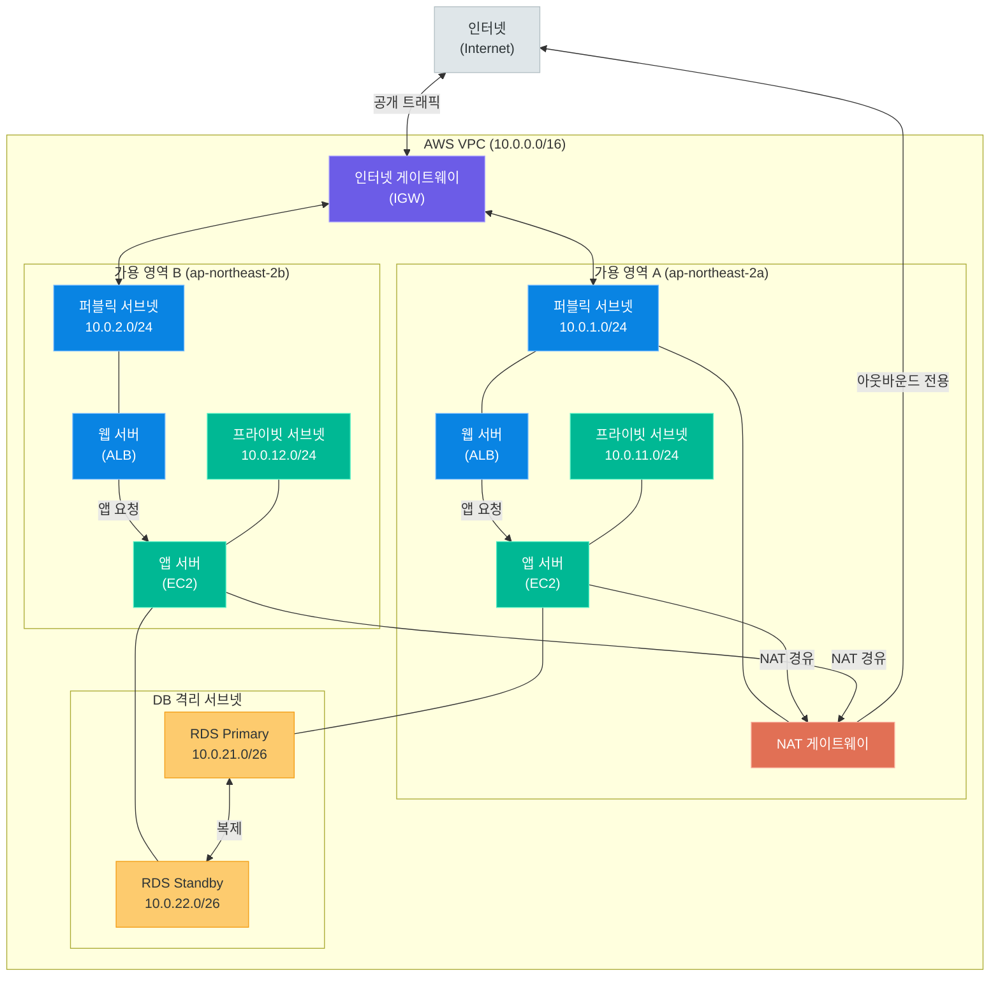
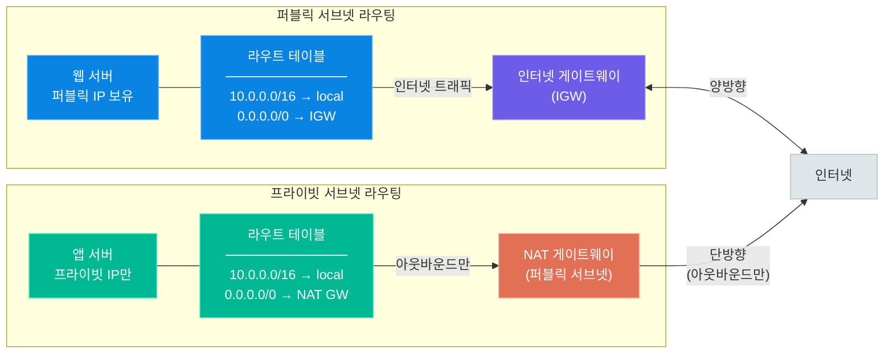
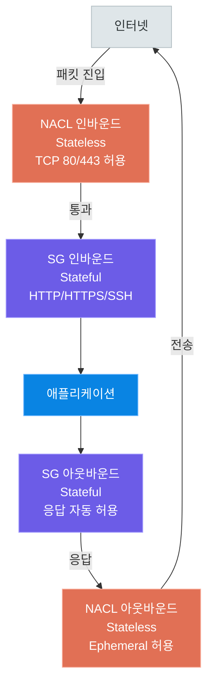
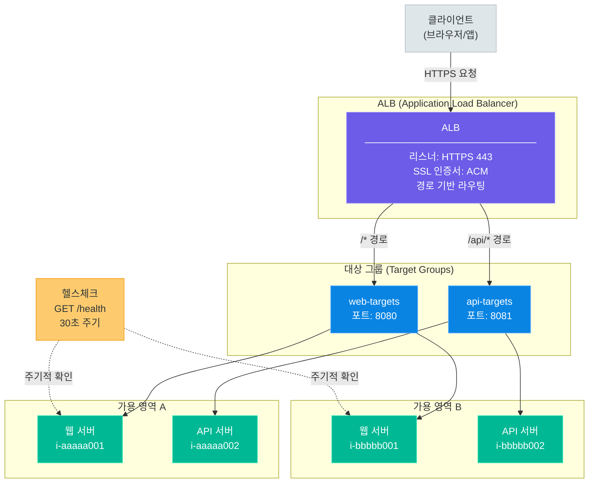
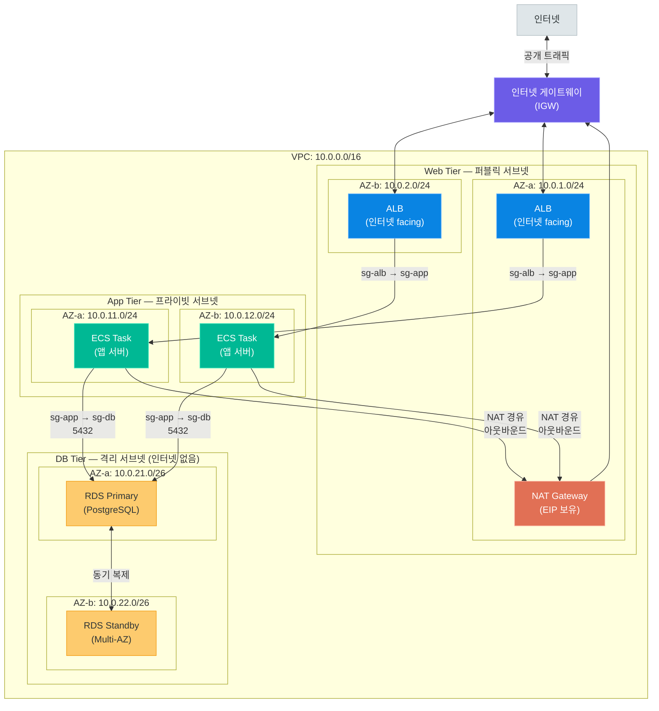

# 네트워킹과 VPC

> AWS 가상 사설 네트워크의 핵심 — VPC 설계, 서브넷팅, 라우팅, 보안 그룹, NACL, 로드 밸런서, 3-tier 아키텍처까지 실전 완전 정복

---

## 1. VPC 개요

### 가상 사설 네트워크란 무엇인가

**Amazon VPC(Virtual Private Cloud)**는 AWS 클라우드 안에 논리적으로 격리된 나만의 네트워크 공간을 만드는 서비스입니다. 마치 회사 사무실에 설치된 사내 네트워크처럼, 인터넷과 분리된 프라이빗 환경에서 AWS 리소스를 배치하고 운영할 수 있습니다.

```
인터넷 (Public Internet)
         │
         │  IGW (인터넷 게이트웨이)
         │
┌────────────────────────────────────────────┐
│  AWS VPC (10.0.0.0/16)                     │
│                                            │
│  ┌─────────────────┐  ┌─────────────────┐  │
│  │ 퍼블릭 서브넷   │  │ 프라이빗 서브넷 │  │
│  │ 10.0.1.0/24     │  │ 10.0.2.0/24     │  │
│  │                 │  │                 │  │
│  │  [웹 서버]      │  │  [앱 서버]      │  │
│  │  [ALB]          │  │  [데이터베이스] │  │
│  └─────────────────┘  └─────────────────┘  │
│                                            │
└────────────────────────────────────────────┘
```

### VPC의 핵심 특징

| 특징 | 설명 |
|------|------|
| **완전한 격리** | 다른 AWS 계정의 VPC와 완전히 분리된 네트워크 환경 제공 |
| **IP 주소 관리** | CIDR 블록으로 원하는 IP 대역을 자유롭게 설계 |
| **계층적 보안** | 보안 그룹(인스턴스 수준) + NACL(서브넷 수준) 이중 방어 |
| **라우팅 제어** | 라우트 테이블로 트래픽 흐름을 정밀하게 제어 |
| **확장성** | 온프레미스 네트워크와 VPN/Direct Connect로 연결 가능 |
| **리전 범위** | VPC는 단일 리전 내에 위치하고 여러 AZ에 걸쳐 확장 가능 |

> **핵심 포인트:** VPC는 AWS 네트워킹의 기반입니다. EC2, RDS, Lambda, ECS 등 거의 모든 서비스가 VPC 안에서 동작하며, 잘 설계된 VPC는 보안, 성능, 비용 모두를 최적화하는 핵심 요소입니다.

---

### CIDR 블록 이해

**CIDR(Classless Inter-Domain Routing)**은 IP 주소와 서브넷 마스크를 결합해 네트워크 범위를 표현하는 방식입니다.

```
10.0.0.0/16 표기법 해석

10.0.0.0   = 네트워크 기준 주소
/16        = 앞의 16비트가 네트워크 부분 (고정)
나머지 16비트 = 호스트 주소 공간

비트 표현:
10.0.0.0 = 00001010.00000000.00000000.00000000
           ├──────────────────┤├──────────────────┤
           네트워크 (16bit 고정)  호스트 (16bit 가변)

사용 가능한 IP 수 = 2^(32-16) = 2^16 = 65,536개
```

**자주 사용하는 VPC CIDR 블록:**

| CIDR 블록 | 주소 수 | 적합한 규모 |
|-----------|---------|-------------|
| `10.0.0.0/16` | 65,536개 | 대규모 프로덕션 환경 |
| `10.0.0.0/20` | 4,096개 | 중규모 서비스 |
| `10.0.0.0/24` | 256개 | 소규모 또는 테스트 환경 |
| `172.16.0.0/16` | 65,536개 | 온프레미스와 분리 필요 시 |
| `192.168.0.0/16` | 65,536개 | 소규모 개인 프로젝트 |

**RFC 1918 프라이빗 IP 대역 (VPC에서 사용):**

| 대역 | 범위 |
|------|------|
| `10.0.0.0/8` | 10.0.0.0 ~ 10.255.255.255 |
| `172.16.0.0/12` | 172.16.0.0 ~ 172.31.255.255 |
| `192.168.0.0/16` | 192.168.0.0 ~ 192.168.255.255 |

---

### 기본 VPC vs 커스텀 VPC

AWS 계정을 생성하면 각 리전에 **기본 VPC(Default VPC)**가 자동으로 만들어집니다.

| 항목 | 기본 VPC | 커스텀 VPC |
|------|----------|------------|
| **생성** | 계정 생성 시 자동 | 직접 설계 및 생성 |
| **CIDR** | 172.31.0.0/16 고정 | 원하는 대역 선택 |
| **서브넷** | 각 AZ에 퍼블릭 서브넷 자동 생성 | 직접 설계 |
| **인터넷 연결** | 기본적으로 인터넷 접속 가능 | 명시적 구성 필요 |
| **보안** | 모든 서브넷이 퍼블릭 (덜 안전) | 계층적 보안 설계 가능 |
| **적합 용도** | 빠른 테스트, 학습 | 프로덕션 환경 |

> **핵심 포인트:** 프로덕션 환경에서는 반드시 커스텀 VPC를 사용하세요. 기본 VPC는 편리하지만 보안 설계가 허술하여 실수로 민감한 리소스를 인터넷에 노출할 위험이 있습니다.

---

### VPC 생성 AWS CLI 예시

```bash
# 1. VPC 생성
aws ec2 create-vpc \
    --cidr-block 10.0.0.0/16 \
    --tag-specifications 'ResourceType=vpc,Tags=[{Key=Name,Value=my-production-vpc}]'

# 출력 예시:
# {
#     "Vpc": {
#         "VpcId": "vpc-0123456789abcdef0",
#         "State": "available",
#         "CidrBlock": "10.0.0.0/16",
#         ...
#     }
# }

# VPC_ID 변수 저장
VPC_ID="vpc-0123456789abcdef0"

# 2. DNS 설정 활성화 (ELB, RDS 등을 위해 필수)
aws ec2 modify-vpc-attribute \
    --vpc-id $VPC_ID \
    --enable-dns-support '{"Value": true}'

aws ec2 modify-vpc-attribute \
    --vpc-id $VPC_ID \
    --enable-dns-hostnames '{"Value": true}'

# 3. VPC 정보 조회
aws ec2 describe-vpcs \
    --vpc-ids $VPC_ID \
    --query 'Vpcs[0].{ID:VpcId,CIDR:CidrBlock,State:State}' \
    --output table

# 4. 모든 VPC 목록 조회
aws ec2 describe-vpcs \
    --query 'Vpcs[*].{ID:VpcId,CIDR:CidrBlock,Default:IsDefault,Name:Tags[?Key==`Name`]|[0].Value}' \
    --output table
```

---

## 2. 서브넷 설계

### 서브넷이란

**서브넷(Subnet)**은 VPC CIDR 블록을 더 작은 단위로 나눈 네트워크 세그먼트입니다. 각 서브넷은 특정 가용 영역(AZ)에 속하며, 서브넷 단위로 라우팅 규칙과 접근 정책을 다르게 적용할 수 있습니다.

### 퍼블릭 vs 프라이빗 서브넷

서브넷을 퍼블릭 또는 프라이빗으로 구분하는 기준은 **인터넷 게이트웨이(IGW)로의 라우팅 경로** 존재 여부입니다.

| 항목 | 퍼블릭 서브넷 | 프라이빗 서브넷 |
|------|---------------|-----------------|
| **인터넷 접근** | 직접 가능 (IGW 경유) | 불가능 (NAT GW 경유로 아웃바운드만) |
| **라우트 테이블** | 0.0.0.0/0 → IGW | 0.0.0.0/0 → NAT GW |
| **퍼블릭 IP** | 자동 할당 가능 | 불가 |
| **배치 리소스** | ALB, Bastion Host, NAT GW | 앱 서버, DB, 내부 API |
| **보안 수준** | 상대적으로 낮음 | 높음 |

> **핵심 포인트:** "퍼블릭/프라이빗"은 서브넷 자체의 속성이 아니라 **라우트 테이블 설정**에 의해 결정됩니다. 라우트 테이블에서 0.0.0.0/0 목적지가 IGW를 가리키면 퍼블릭, NAT GW나 다른 대상을 가리키면 프라이빗입니다.

---

### AZ 분산 배치

고가용성(HA)을 위해 서브넷을 여러 가용 영역에 분산 배치해야 합니다.

```
ap-northeast-2 (서울 리전)
├── ap-northeast-2a (AZ-A)
│   ├── 퍼블릭 서브넷: 10.0.1.0/24
│   └── 프라이빗 서브넷: 10.0.11.0/24
├── ap-northeast-2b (AZ-B)
│   ├── 퍼블릭 서브넷: 10.0.2.0/24
│   └── 프라이빗 서브넷: 10.0.12.0/24
└── ap-northeast-2c (AZ-C)
    ├── 퍼블릭 서브넷: 10.0.3.0/24
    └── 프라이빗 서브넷: 10.0.13.0/24
```

AZ가 장애를 겪어도 다른 AZ의 서브넷에서 서비스가 지속됩니다.

---

### CIDR 계획 — 서브넷팅 계산 예시

VPC CIDR `10.0.0.0/16`을 기반으로 서브넷을 설계하는 과정입니다.

#### /24 서브넷 (256개 주소, 실사용 251개)

```
10.0.0.0/16에서 /24 서브넷 분할

/24 = 호스트 비트 8개 = 2^8 = 256개 IP
      AWS 예약 5개 제외 → 사용 가능 251개

예약 IP (10.0.1.0/24 기준):
  10.0.1.0   - 네트워크 주소
  10.0.1.1   - AWS VPC 라우터
  10.0.1.2   - DNS 서버
  10.0.1.3   - 미래 사용 예약
  10.0.1.255 - 브로드캐스트

생성 가능한 /24 서브넷 수: 256개 (10.0.0.0/24 ~ 10.0.255.0/24)
```

#### /25 서브넷 (128개 주소, 실사용 123개)

```
10.0.1.0/24를 /25로 이분할

10.0.1.0/25   → 10.0.1.0   ~ 10.0.1.127   (128개)
10.0.1.128/25 → 10.0.1.128 ~ 10.0.1.255   (128개)

용도: 소규모 서비스 또는 관리용 서브넷
```

#### /26 서브넷 (64개 주소, 실사용 59개)

```
10.0.1.0/24를 /26으로 사분할

10.0.1.0/26   → 10.0.1.0   ~ 10.0.1.63    (64개)
10.0.1.64/26  → 10.0.1.64  ~ 10.0.1.127   (64개)
10.0.1.128/26 → 10.0.1.128 ~ 10.0.1.191   (64개)
10.0.1.192/26 → 10.0.1.192 ~ 10.0.1.255   (64개)

용도: 격리된 DB 서브넷, 관리 전용 서브넷
```

**서브넷 크기 비교표:**

| CIDR | 총 IP 수 | 사용 가능 IP | 적합 용도 |
|------|----------|-------------|-----------|
| `/20` | 4,096 | 4,091 | 대규모 앱 서버 군집 |
| `/22` | 1,024 | 1,019 | 중규모 서버 팜 |
| `/24` | 256 | 251 | 일반적인 계층별 서브넷 |
| `/25` | 128 | 123 | 소규모 서비스 |
| `/26` | 64 | 59 | DB, 관리 서브넷 |
| `/28` | 16 | 11 | 관리 서브넷, Bastion |

---

### 서브넷 설계 베스트 프랙티스

1. **충분한 IP 공간 확보**: 나중에 CIDR를 변경하기 어려우므로 처음부터 여유 있게 설계
2. **계층별 서브넷 분리**: Web / App / DB 계층을 별도 서브넷으로 분리
3. **최소 2개 AZ 사용**: 단일 AZ 장애에 대비한 이중화
4. **예비 서브넷 확보**: 향후 확장을 위해 CIDR 블록 일부를 미사용으로 남겨둠
5. **명확한 넘버링 규칙**: 예) 10.0.{계층}.0/24 (1x=퍼블릭, 2x=프라이빗, 3x=DB)

### 서브넷 생성 AWS CLI

```bash
# AZ 목록 확인
aws ec2 describe-availability-zones \
    --region ap-northeast-2 \
    --query 'AvailabilityZones[*].{Name:ZoneName,State:State}' \
    --output table

VPC_ID="vpc-0123456789abcdef0"

# 퍼블릭 서브넷 생성 (AZ-a)
aws ec2 create-subnet \
    --vpc-id $VPC_ID \
    --cidr-block 10.0.1.0/24 \
    --availability-zone ap-northeast-2a \
    --tag-specifications 'ResourceType=subnet,Tags=[{Key=Name,Value=public-subnet-2a}]'

# 퍼블릭 서브넷 생성 (AZ-b)
aws ec2 create-subnet \
    --vpc-id $VPC_ID \
    --cidr-block 10.0.2.0/24 \
    --availability-zone ap-northeast-2b \
    --tag-specifications 'ResourceType=subnet,Tags=[{Key=Name,Value=public-subnet-2b}]'

# 프라이빗 서브넷 생성 (AZ-a)
aws ec2 create-subnet \
    --vpc-id $VPC_ID \
    --cidr-block 10.0.11.0/24 \
    --availability-zone ap-northeast-2a \
    --tag-specifications 'ResourceType=subnet,Tags=[{Key=Name,Value=private-subnet-2a}]'

# 프라이빗 서브넷 생성 (AZ-b)
aws ec2 create-subnet \
    --vpc-id $VPC_ID \
    --cidr-block 10.0.12.0/24 \
    --availability-zone ap-northeast-2b \
    --tag-specifications 'ResourceType=subnet,Tags=[{Key=Name,Value=private-subnet-2b}]'

# 퍼블릭 서브넷에서 퍼블릭 IP 자동 할당 활성화
SUBNET_PUBLIC_2A="subnet-xxxxxxxxx"
aws ec2 modify-subnet-attribute \
    --subnet-id $SUBNET_PUBLIC_2A \
    --map-public-ip-on-launch
```

---

### VPC 전체 아키텍처 다이어그램



---

## 3. 라우팅

### 라우트 테이블(Route Table)이란

**라우트 테이블**은 네트워크 패킷이 어디로 이동해야 하는지를 정의하는 규칙 집합입니다. 각 서브넷은 반드시 하나의 라우트 테이블에 연결되어야 합니다.

```
라우트 테이블 예시 (퍼블릭 서브넷용)

목적지(Destination)   대상(Target)        설명
─────────────────    ────────────        ──────────────────────
10.0.0.0/16          local               VPC 내부 통신 (자동)
0.0.0.0/0            igw-0abc1234        모든 외부 트래픽 → IGW
```

```
라우트 테이블 예시 (프라이빗 서브넷용)

목적지(Destination)   대상(Target)        설명
─────────────────    ────────────        ──────────────────────
10.0.0.0/16          local               VPC 내부 통신 (자동)
0.0.0.0/0            nat-0xyz9876        외부 트래픽 → NAT GW
```

### 메인 라우트 테이블 vs 커스텀 라우트 테이블

| 항목 | 메인 라우트 테이블 | 커스텀 라우트 테이블 |
|------|-------------------|---------------------|
| **생성** | VPC 생성 시 자동 생성 | 직접 생성 |
| **기본 연결** | 별도 지정 없는 서브넷에 자동 적용 | 명시적으로 서브넷에 연결 |
| **수정 권장** | 수정 비권장 (기본값 유지 권장) | 목적에 맞게 자유롭게 수정 |
| **삭제** | 삭제 불가 | 서브넷 연결 해제 후 삭제 가능 |

> **핵심 포인트:** 메인 라우트 테이블은 수정하지 말고 기본값(`local` 라우팅만)을 유지하세요. 퍼블릭/프라이빗 서브넷마다 별도의 커스텀 라우트 테이블을 만들어 명시적으로 연결하는 것이 베스트 프랙티스입니다.

---

### 인터넷 게이트웨이(IGW)

**IGW(Internet Gateway)**는 VPC와 인터넷 사이의 관문(Gateway)으로, VPC당 하나만 연결할 수 있으며 자체적으로 수평 확장되어 고가용성을 보장합니다.

```
IGW의 역할:
1. 퍼블릭 IP 주소 ↔ 프라이빗 IP 주소 NAT 변환
2. 인터넷 라우팅 (VPC 외부 트래픽 처리)
3. 대역폭 제한 없음 (관리형 서비스)
4. 추가 비용 없음 (데이터 전송 비용만 발생)
```

```bash
# IGW 생성
aws ec2 create-internet-gateway \
    --tag-specifications 'ResourceType=internet-gateway,Tags=[{Key=Name,Value=my-igw}]'

IGW_ID="igw-0123456789abcdef0"

# VPC에 IGW 연결
aws ec2 attach-internet-gateway \
    --internet-gateway-id $IGW_ID \
    --vpc-id $VPC_ID

# 퍼블릭 라우트 테이블 생성
aws ec2 create-route-table \
    --vpc-id $VPC_ID \
    --tag-specifications 'ResourceType=route-table,Tags=[{Key=Name,Value=public-rtb}]'

PUBLIC_RTB_ID="rtb-xxxxxxxxx"

# 인터넷 라우트 추가 (0.0.0.0/0 → IGW)
aws ec2 create-route \
    --route-table-id $PUBLIC_RTB_ID \
    --destination-cidr-block 0.0.0.0/0 \
    --gateway-id $IGW_ID

# 퍼블릭 서브넷에 라우트 테이블 연결
aws ec2 associate-route-table \
    --route-table-id $PUBLIC_RTB_ID \
    --subnet-id $SUBNET_PUBLIC_2A
```

---

### NAT 게이트웨이

**NAT 게이트웨이(NAT Gateway)**는 프라이빗 서브넷의 인스턴스가 인터넷으로 아웃바운드 트래픽을 보낼 수 있게 해주는 서비스입니다. 인터넷에서 프라이빗 인스턴스로의 인바운드 연결은 차단됩니다.

```
NAT 게이트웨이 동작 방식:

프라이빗 서버 (10.0.11.10)
       │  아웃바운드 요청 (예: yum update)
       ▼
NAT 게이트웨이 (퍼블릭 서브넷, EIP: 52.78.x.x)
       │  소스 IP를 EIP로 변환 후 전달
       ▼
인터넷 게이트웨이 (IGW)
       │
       ▼
인터넷 (yum 미러 서버 등)
```

**NAT 게이트웨이 비용 고려사항:**

| 항목 | 비용 (서울 리전 기준) |
|------|----------------------|
| **시간 요금** | 시간당 약 $0.059 (월 약 $43) |
| **데이터 처리** | GB당 약 $0.059 |
| **주의사항** | AZ별로 NAT GW를 생성해야 고가용성 확보 |
| **절약 팁** | 개발 환경에서는 꺼두거나 NAT 인스턴스 사용 |

> **핵심 포인트:** NAT 게이트웨이는 AZ별로 독립적입니다. 고가용성을 위해 각 AZ의 퍼블릭 서브넷에 NAT GW를 하나씩 두고, 같은 AZ의 프라이빗 서브넷은 해당 AZ의 NAT GW를 사용하도록 라우트 테이블을 구성하세요.

---

### NAT 인스턴스 — NAT 게이트웨이의 저비용 대안

비용이 중요한 개발/테스트 환경에서는 EC2 기반 **NAT 인스턴스**를 활용할 수 있습니다.

| 항목 | NAT 게이트웨이 | NAT 인스턴스 |
|------|---------------|--------------|
| **관리** | AWS 완전 관리형 | 직접 관리 필요 |
| **가용성** | 자동 고가용성 | 단일 장애점 (별도 HA 구성 필요) |
| **비용** | 상대적으로 높음 | 저렴 (t3.micro 등 소형 인스턴스 사용) |
| **대역폭** | 자동 확장 (최대 100Gbps) | 인스턴스 타입에 의존 |
| **설정** | 클릭 한 번 | 소스/목적지 확인 비활성화 필요 |
| **추천 환경** | 프로덕션 | 개발/학습 환경 |

```bash
# NAT 게이트웨이 생성 (탄력적 IP 먼저 할당 필요)
aws ec2 allocate-address --domain vpc  # EIP 할당
EIP_ALLOC_ID="eipalloc-xxxxxxxxx"

aws ec2 create-nat-gateway \
    --subnet-id $SUBNET_PUBLIC_2A \
    --allocation-id $EIP_ALLOC_ID \
    --tag-specifications 'ResourceType=natgateway,Tags=[{Key=Name,Value=nat-gw-2a}]'

NAT_GW_ID="nat-xxxxxxxxx"

# 프라이빗 서브넷용 라우트 테이블에 NAT GW 경로 추가
aws ec2 create-route \
    --route-table-id $PRIVATE_RTB_ID \
    --destination-cidr-block 0.0.0.0/0 \
    --nat-gateway-id $NAT_GW_ID
```

---

### 퍼블릭/프라이빗 서브넷 라우팅 비교 다이어그램



---

## 4. 보안 그룹(Security Group)

### 보안 그룹이란

**보안 그룹(SG, Security Group)**은 EC2 인스턴스에 연결하는 **가상 방화벽**입니다. 인스턴스 수준에서 인바운드(들어오는)와 아웃바운드(나가는) 트래픽을 제어합니다.

```
보안 그룹의 핵심 특성:

[상태 기반(Stateful)]
→ 인바운드 트래픽을 허용하면 해당 연결의 응답 트래픽은
  아웃바운드 규칙과 무관하게 자동으로 허용됨

예시: HTTP 요청 허용 시
인바운드: 클라이언트 80 포트 요청 허용 ✓
아웃바운드: 응답 트래픽 자동 허용 (규칙 없어도 OK) ✓
```

### 보안 그룹 규칙 구성 요소

| 항목 | 설명 | 예시 |
|------|------|------|
| **유형(Type)** | 프로토콜 종류 | HTTP, HTTPS, SSH, 사용자 지정 TCP |
| **프로토콜** | TCP, UDP, ICMP | TCP |
| **포트 범위** | 허용할 포트 번호 | 80, 443, 22, 8080-8090 |
| **소스/대상** | IP 주소 또는 다른 보안 그룹 | 0.0.0.0/0, 10.0.0.0/16, sg-xxxxxx |
| **설명** | 규칙 설명 (선택사항) | "ALB에서의 HTTP 트래픽" |

---

### 웹 서버 보안 그룹 예시

**인바운드 규칙 (웹 서버 SG):**

| 규칙 번호 | 유형 | 프로토콜 | 포트 | 소스 | 설명 |
|-----------|------|----------|------|------|------|
| 1 | HTTP | TCP | 80 | 0.0.0.0/0 | 외부 HTTP 요청 허용 |
| 2 | HTTPS | TCP | 443 | 0.0.0.0/0 | 외부 HTTPS 요청 허용 |
| 3 | SSH | TCP | 22 | 10.0.0.0/16 | VPC 내부에서만 SSH |

**아웃바운드 규칙 (웹 서버 SG):**

| 규칙 번호 | 유형 | 프로토콜 | 포트 | 대상 | 설명 |
|-----------|------|----------|------|------|------|
| 1 | 모든 트래픽 | 전체 | 전체 | 0.0.0.0/0 | 모든 아웃바운드 허용 |

---

### 보안 그룹 체이닝 (SG 참조)

보안 그룹 규칙의 소스/대상에 IP 주소 대신 **다른 보안 그룹 ID**를 참조할 수 있습니다. 이것을 보안 그룹 체이닝이라고 합니다.

```
보안 그룹 체이닝 아키텍처:

ALB (sg-alb)
  ↓ SG 참조 규칙
앱 서버 (sg-app: 인바운드 소스 = sg-alb)
  ↓ SG 참조 규칙
DB (sg-db: 인바운드 소스 = sg-app)

장점:
- IP 주소 하드코딩 불필요
- 인스턴스 추가/삭제 시 자동 반영
- 의도하지 않은 IP 접근 원천 차단
```

```
앱 서버 SG 인바운드 규칙 (SG 참조 방식):

유형   프로토콜  포트   소스        설명
──     ──────    ────   ──────────  ──────────────────
TCP    TCP       8080   sg-alb      ALB SG에서만 허용
TCP    TCP       22     sg-bastion  Bastion SG에서만 SSH

DB SG 인바운드 규칙:
유형   프로토콜  포트   소스        설명
──     ──────    ────   ──────────  ──────────────────
TCP    TCP       5432   sg-app      앱 서버 SG에서만 PostgreSQL
```

---

### 실전 보안 그룹 설계

```bash
# 웹 서버 보안 그룹 생성
aws ec2 create-security-group \
    --group-name "web-server-sg" \
    --description "Web Server Security Group" \
    --vpc-id $VPC_ID \
    --tag-specifications 'ResourceType=security-group,Tags=[{Key=Name,Value=web-sg}]'

WEB_SG_ID="sg-xxxxxxxxx"

# HTTP/HTTPS 인바운드 허용
aws ec2 authorize-security-group-ingress \
    --group-id $WEB_SG_ID \
    --ip-permissions \
        'IpProtocol=tcp,FromPort=80,ToPort=80,IpRanges=[{CidrIp=0.0.0.0/0,Description=HTTP}]' \
        'IpProtocol=tcp,FromPort=443,ToPort=443,IpRanges=[{CidrIp=0.0.0.0/0,Description=HTTPS}]'

# SSH는 VPC 내부에서만 허용
aws ec2 authorize-security-group-ingress \
    --group-id $WEB_SG_ID \
    --protocol tcp \
    --port 22 \
    --cidr 10.0.0.0/16

# 앱 서버 보안 그룹 생성 (ALB SG 참조)
aws ec2 create-security-group \
    --group-name "app-server-sg" \
    --description "App Server Security Group" \
    --vpc-id $VPC_ID

APP_SG_ID="sg-yyyyyyyyy"

# ALB SG에서 8080 포트만 허용 (SG 참조)
aws ec2 authorize-security-group-ingress \
    --group-id $APP_SG_ID \
    --protocol tcp \
    --port 8080 \
    --source-group $WEB_SG_ID

# DB 보안 그룹 생성 (앱 서버 SG 참조)
aws ec2 create-security-group \
    --group-name "db-sg" \
    --description "Database Security Group" \
    --vpc-id $VPC_ID

DB_SG_ID="sg-zzzzzzzzz"

# 앱 서버 SG에서 PostgreSQL 포트만 허용
aws ec2 authorize-security-group-ingress \
    --group-id $DB_SG_ID \
    --protocol tcp \
    --port 5432 \
    --source-group $APP_SG_ID

# 보안 그룹 규칙 조회
aws ec2 describe-security-group-rules \
    --filters Name=group-id,Values=$WEB_SG_ID \
    --query 'SecurityGroupRules[*].{Direction:IsEgress,Protocol:IpProtocol,Port:FromPort,Source:CidrIpv4}' \
    --output table
```

> **핵심 포인트:** 보안 그룹은 **화이트리스트(허용 목록)** 방식으로 동작합니다. 즉, 명시적으로 허용한 트래픽만 통과하고 나머지는 모두 거부됩니다. "거부" 규칙은 만들 수 없으며, 허용 규칙만 추가할 수 있습니다.

---

## 5. NACL (네트워크 ACL)

### NACL이란

**NACL(Network Access Control List)**은 서브넷 경계에서 트래픽을 제어하는 **서브넷 수준의 방화벽**입니다. 보안 그룹이 인스턴스 수준이라면, NACL은 서브넷 전체에 적용됩니다.

```
NACL의 핵심 특성:

[상태 비저장(Stateless)]
→ 인바운드와 아웃바운드 트래픽을 각각 독립적으로 평가
→ 인바운드를 허용해도 아웃바운드를 별도로 허용해야 함

예시: HTTP 트래픽 허용 시
인바운드 규칙: 포트 80 허용 필요 ✓
아웃바운드 규칙: Ephemeral 포트(1024-65535) 허용 필요 ✓
```

---

### SG vs NACL 상세 비교

| 항목 | 보안 그룹 (SG) | NACL |
|------|---------------|------|
| **적용 레벨** | 인스턴스(ENI) 수준 | 서브넷 수준 |
| **상태 관리** | 상태 기반 (Stateful) | 상태 비저장 (Stateless) |
| **규칙 방향** | 인/아웃바운드 각각 정의 | 인/아웃바운드 각각 독립 평가 |
| **규칙 유형** | 허용 규칙만 가능 | 허용 + 거부 규칙 모두 가능 |
| **규칙 적용 순서** | 모든 규칙을 합쳐서 평가 | 번호 순서대로 평가 (낮은 번호 우선) |
| **기본 동작** | 모든 인바운드 거부, 모든 아웃바운드 허용 | 커스텀: 모든 트래픽 거부 / 기본: 허용 |
| **연결 대상** | EC2 인스턴스, ELB, RDS 등 | 서브넷 |
| **VPC당 한도** | 2,500개 (기본값) | 200개 (기본값) |
| **사용 사례** | 세밀한 인스턴스별 접근 제어 | 서브넷 수준 블랙리스트 차단 |

---

### 규칙 번호와 우선순위

NACL 규칙은 **낮은 번호부터 순서대로** 평가하며, 일치하는 규칙을 찾으면 즉시 적용하고 평가를 중단합니다.

```
NACL 인바운드 규칙 평가 순서 예시:

규칙 번호  프로토콜  포트       소스           동작
────────   ────────  ──────     ──────────     ──────
100        TCP       80         0.0.0.0/0      허용 ← 먼저 평가
200        TCP       443        0.0.0.0/0      허용
300        TCP       22         203.0.113.5    거부  ← 특정 IP 차단
*          전체      전체       0.0.0.0/0      거부 ← 최종 기본 거부

패킷이 도착하면:
1. 규칙 100 확인 → HTTP 트래픽이면 즉시 허용 (평가 종료)
2. 아니면 규칙 200 확인 → HTTPS면 즉시 허용
3. 아니면 규칙 300 확인 → 특정 IP의 SSH면 즉시 거부
4. 일치하는 규칙 없으면 *로 거부
```

**규칙 번호 베스트 프랙티스:**

| 번호 범위 | 용도 |
|-----------|------|
| 100 ~ 199 | 허용 규칙 (알려진 서비스) |
| 200 ~ 299 | 허용 규칙 (애플리케이션) |
| 300 ~ 399 | 거부 규칙 (특정 IP 차단) |
| 32766 | 최종 거부 (`*`) |

---

### Ephemeral 포트 (임시 포트)

NACL이 상태 비저장이기 때문에 반드시 이해해야 하는 개념입니다.

```
HTTP 요청/응답 과정 (NACL 시각에서):

클라이언트 (포트: 54,231)  ────→  서버 (포트: 80)
                              요청

클라이언트 (포트: 54,231)  ←────  서버 (포트: 80)
                              응답 (클라이언트 임시 포트로)

NACL 설정 필요:
- 인바운드: TCP 80 허용 (HTTP 요청)
- 아웃바운드: TCP 1024-65535 허용 (Ephemeral 포트 응답)
```

**OS별 Ephemeral 포트 범위:**

| OS | Ephemeral 포트 범위 |
|----|---------------------|
| Linux (최신) | 32768 ~ 60999 |
| Windows | 49152 ~ 65535 |
| 권장 설정 | 1024 ~ 65535 (모두 포함) |

---

### 기본 NACL vs 커스텀 NACL

| 항목 | 기본 NACL | 커스텀 NACL |
|------|-----------|------------|
| **생성** | VPC 생성 시 자동 생성 | 직접 생성 |
| **기본 규칙** | 모든 트래픽 허용 (`*` = Allow) | 모든 트래픽 거부 (`*` = Deny) |
| **서브넷 연결** | 명시적 연결 없는 서브넷에 자동 적용 | 명시적으로 서브넷에 연결 |
| **주의사항** | 수정하지 말 것 (의도치 않은 변경 방지) | 처음부터 필요한 규칙만 추가 |

```bash
# 커스텀 NACL 생성
aws ec2 create-network-acl \
    --vpc-id $VPC_ID \
    --tag-specifications 'ResourceType=network-acl,Tags=[{Key=Name,Value=public-nacl}]'

NACL_ID="acl-xxxxxxxxx"

# 인바운드 HTTP 허용 (규칙 번호 100)
aws ec2 create-network-acl-entry \
    --network-acl-id $NACL_ID \
    --ingress \
    --rule-number 100 \
    --protocol tcp \
    --port-range From=80,To=80 \
    --cidr-block 0.0.0.0/0 \
    --rule-action allow

# 인바운드 HTTPS 허용 (규칙 번호 110)
aws ec2 create-network-acl-entry \
    --network-acl-id $NACL_ID \
    --ingress \
    --rule-number 110 \
    --protocol tcp \
    --port-range From=443,To=443 \
    --cidr-block 0.0.0.0/0 \
    --rule-action allow

# 아웃바운드 Ephemeral 포트 허용 (상태 비저장이므로 필수)
aws ec2 create-network-acl-entry \
    --network-acl-id $NACL_ID \
    --egress \
    --rule-number 100 \
    --protocol tcp \
    --port-range From=1024,To=65535 \
    --cidr-block 0.0.0.0/0 \
    --rule-action allow

# 서브넷에 NACL 연결
aws ec2 replace-network-acl-association \
    --association-id $NACL_ASSOC_ID \
    --network-acl-id $NACL_ID
```

---

### SG vs NACL 계층 구조 다이어그램



---

## 6. ELB (Elastic Load Balancing)

### ELB란

**ELB(Elastic Load Balancer)**는 들어오는 트래픽을 여러 대상(EC2, ECS, Lambda 등)에 자동으로 분산시켜주는 관리형 로드 밸런서 서비스입니다. 고가용성과 수평 확장의 핵심 구성 요소입니다.

```
ELB의 핵심 기능:

1. 트래픽 분산: 여러 서버에 고르게 요청을 분배
2. 헬스 체크: 장애 서버를 자동으로 감지하고 제외
3. SSL 종료: HTTPS를 처리하고 백엔드는 HTTP로 전달
4. 스티키 세션: 동일 클라이언트를 같은 서버로 연결
5. 가용성: 여러 AZ에 걸쳐 자동으로 확장
```

---

### ALB / NLB / CLB 비교

| 항목 | ALB (Application) | NLB (Network) | CLB (Classic) |
|------|------------------|--------------|--------------|
| **레이어** | Layer 7 (HTTP/HTTPS) | Layer 4 (TCP/UDP) | Layer 4/7 혼합 |
| **프로토콜** | HTTP, HTTPS, gRPC, WebSocket | TCP, UDP, TLS | HTTP, HTTPS, TCP |
| **라우팅** | 경로 기반, 호스트 기반, 헤더 기반 | IP+포트 기반 | 라운드로빈 |
| **성능** | 고성능 (초당 수만 req) | 초고성능 (초당 수백만 연결) | 보통 |
| **고정 IP** | 지원 안 함 (DNS) | 지원 (Elastic IP) | 지원 안 함 |
| **WebSocket** | 지원 | 지원 | 제한적 |
| **gRPC** | 지원 | 지원 안 함 | 지원 안 함 |
| **비용** | 중간 | 높음 (LCU 기반) | 낮음 (레거시) |
| **추천** | 웹 서비스, API | 게임, IoT, 금융 | 레거시 시스템 유지보수 |
| **신규 사용 여부** | 권장 | 권장 | 사용 중단 권고 |

> **핵심 포인트:** 신규 서비스에는 ALB(웹/API 서비스) 또는 NLB(네트워크 레벨 처리)를 선택하세요. CLB는 레거시 서비스 지원용이며 신규 개발에는 사용하지 않는 것을 AWS에서 권고합니다.

---

### 대상 그룹(Target Group) 설정

대상 그룹은 로드 밸런서가 트래픽을 전달할 대상들의 집합입니다.

**대상 유형:**

| 대상 유형 | 설명 | 사용 사례 |
|-----------|------|-----------|
| **Instance** | EC2 인스턴스 ID | 전통적인 EC2 기반 서비스 |
| **IP** | IP 주소 (VPC 내부) | 컨테이너, 온프레미스 서버 |
| **Lambda** | Lambda 함수 | 서버리스 API |

```bash
# 대상 그룹 생성
aws elbv2 create-target-group \
    --name my-app-targets \
    --protocol HTTP \
    --port 8080 \
    --vpc-id $VPC_ID \
    --health-check-protocol HTTP \
    --health-check-path /health \
    --health-check-interval-seconds 30 \
    --health-check-timeout-seconds 5 \
    --healthy-threshold-count 2 \
    --unhealthy-threshold-count 3 \
    --target-type instance

TG_ARN="arn:aws:elasticloadbalancing:ap-northeast-2:123456789012:targetgroup/my-app-targets/..."

# 대상 등록 (EC2 인스턴스 추가)
aws elbv2 register-targets \
    --target-group-arn $TG_ARN \
    --targets Id=i-1234567890abcdef0 Id=i-0987654321fedcba0
```

---

### 헬스체크 구성

헬스체크는 대상의 상태를 주기적으로 확인하여 장애 대상을 자동으로 제외합니다.

```
헬스체크 동작 방식:

ALB → GET /health → EC2 인스턴스
                       ↓
               HTTP 200 OK 응답?
                  ↙         ↘
              정상            비정상
        (트래픽 계속 전달)   (트래픽 전달 중단)
                              Unhealthy Threshold 횟수만큼
                              실패 시 대상 그룹에서 제외
```

**헬스체크 주요 파라미터:**

| 파라미터 | 설명 | 권장값 |
|----------|------|--------|
| **프로토콜** | 헬스체크 방법 | HTTP 또는 HTTPS |
| **경로** | 확인할 URL 경로 | `/health` 또는 `/ping` |
| **간격** | 체크 주기 | 30초 |
| **타임아웃** | 응답 대기 시간 | 5초 |
| **정상 임계값** | 연속 성공 횟수 | 2회 |
| **비정상 임계값** | 연속 실패 횟수 | 3회 |

---

### HTTPS 리스너와 ACM 인증서

**HTTPS 리스너**를 구성하면 ALB가 SSL/TLS를 종료(terminate)하고 백엔드로는 HTTP를 전달합니다. **ACM(AWS Certificate Manager)**으로 무료 SSL 인증서를 발급받아 사용할 수 있습니다.

```bash
# ACM 인증서 요청 (DNS 검증 방식)
aws acm request-certificate \
    --domain-name example.com \
    --subject-alternative-names "*.example.com" \
    --validation-method DNS \
    --region ap-northeast-2

CERT_ARN="arn:aws:acm:ap-northeast-2:123456789012:certificate/..."

# ALB 생성
aws elbv2 create-load-balancer \
    --name my-alb \
    --subnets $SUBNET_PUBLIC_2A $SUBNET_PUBLIC_2B \
    --security-groups $WEB_SG_ID \
    --scheme internet-facing \
    --type application \
    --ip-address-type ipv4

ALB_ARN="arn:aws:elasticloadbalancing:..."

# HTTP 리스너 (80) → HTTPS 리다이렉트
aws elbv2 create-listener \
    --load-balancer-arn $ALB_ARN \
    --protocol HTTP \
    --port 80 \
    --default-actions Type=redirect,RedirectConfig='{Protocol=HTTPS,Port=443,StatusCode=HTTP_301}'

# HTTPS 리스너 (443) → 대상 그룹 포워딩
aws elbv2 create-listener \
    --load-balancer-arn $ALB_ARN \
    --protocol HTTPS \
    --port 443 \
    --certificates CertificateArn=$CERT_ARN \
    --ssl-policy ELBSecurityPolicy-TLS13-1-2-2021-06 \
    --default-actions Type=forward,TargetGroupArn=$TG_ARN
```

---

### Path-Based Routing 예시

ALB의 강력한 기능 중 하나는 URL 경로에 따라 다른 대상 그룹으로 트래픽을 라우팅하는 것입니다.

```
URL 경로 기반 라우팅 예시:

https://api.example.com/users/*    → user-service 대상 그룹 (포트 8081)
https://api.example.com/orders/*   → order-service 대상 그룹 (포트 8082)
https://api.example.com/products/* → product-service 대상 그룹 (포트 8083)
https://api.example.com/*          → default 대상 그룹 (기본값)
```

```bash
# 경로 기반 라우팅 규칙 추가
LISTENER_ARN="arn:aws:elasticloadbalancing:..."

# /api/users/* → user-service 대상 그룹
aws elbv2 create-rule \
    --listener-arn $LISTENER_ARN \
    --priority 10 \
    --conditions Field=path-pattern,Values='/api/users/*' \
    --actions Type=forward,TargetGroupArn=$USER_TG_ARN

# /api/orders/* → order-service 대상 그룹
aws elbv2 create-rule \
    --listener-arn $LISTENER_ARN \
    --priority 20 \
    --conditions Field=path-pattern,Values='/api/orders/*' \
    --actions Type=forward,TargetGroupArn=$ORDER_TG_ARN
```

---

### ELB 아키텍처 다이어그램



---

## 7. 3-tier VPC 설계 실습

### 3-tier 아키텍처란

**3-tier 아키텍처**는 웹(Presentation), 애플리케이션(Logic), 데이터베이스(Data) 계층을 물리적으로 분리한 설계 패턴입니다. 보안, 확장성, 유지보수성 측면에서 프로덕션 환경의 표준 아키텍처입니다.

```
3-tier 아키텍처 계층 정의:

┌──────────────────────────────────────┐
│  Web Tier (프레젠테이션 계층)          │
│  - ALB + 퍼블릭 서브넷               │
│  - 인터넷에서 직접 접근 가능          │
├──────────────────────────────────────┤
│  App Tier (비즈니스 로직 계층)         │
│  - ECS/EC2 + 프라이빗 서브넷         │
│  - ALB를 통해서만 접근 가능           │
├──────────────────────────────────────┤
│  DB Tier (데이터 계층)                │
│  - RDS + 격리 서브넷                  │
│  - 앱 계층에서만 접근 가능            │
└──────────────────────────────────────┘
```

---

### CIDR 할당 예시 (VPC: 10.0.0.0/16)

| 계층 | AZ | 서브넷 이름 | CIDR | IP 수 |
|------|-----|------------|------|-------|
| **Web (퍼블릭)** | AZ-a | public-web-2a | 10.0.1.0/24 | 251 |
| **Web (퍼블릭)** | AZ-b | public-web-2b | 10.0.2.0/24 | 251 |
| **App (프라이빗)** | AZ-a | private-app-2a | 10.0.11.0/24 | 251 |
| **App (프라이빗)** | AZ-b | private-app-2b | 10.0.12.0/24 | 251 |
| **DB (격리)** | AZ-a | isolated-db-2a | 10.0.21.0/26 | 59 |
| **DB (격리)** | AZ-b | isolated-db-2b | 10.0.22.0/26 | 59 |
| **관리 (예비)** | AZ-a | mgmt-2a | 10.0.31.0/28 | 11 |
| **미래 확장** | — | — | 10.0.100.0/22 ~ | 확보 |

---

### 보안 그룹 규칙 전체 표

**1. ALB 보안 그룹 (sg-alb)**

| 방향 | 프로토콜 | 포트 | 소스/대상 | 설명 |
|------|----------|------|-----------|------|
| 인바운드 | TCP | 80 | 0.0.0.0/0 | 외부 HTTP 허용 |
| 인바운드 | TCP | 443 | 0.0.0.0/0 | 외부 HTTPS 허용 |
| 아웃바운드 | TCP | 8080 | sg-app | 앱 서버로 전달 |

**2. 앱 서버 보안 그룹 (sg-app)**

| 방향 | 프로토콜 | 포트 | 소스/대상 | 설명 |
|------|----------|------|-----------|------|
| 인바운드 | TCP | 8080 | sg-alb | ALB에서만 허용 |
| 인바운드 | TCP | 22 | sg-bastion | Bastion에서만 SSH |
| 아웃바운드 | TCP | 5432 | sg-db | DB 연결 |
| 아웃바운드 | TCP | 443 | 0.0.0.0/0 | 외부 API 호출 (NAT 경유) |
| 아웃바운드 | TCP | 80 | 0.0.0.0/0 | 패키지 업데이트 (NAT 경유) |

**3. DB 보안 그룹 (sg-db)**

| 방향 | 프로토콜 | 포트 | 소스/대상 | 설명 |
|------|----------|------|-----------|------|
| 인바운드 | TCP | 5432 | sg-app | 앱 서버에서만 PostgreSQL |
| 아웃바운드 | — | — | — | 모든 아웃바운드 거부 |

**4. Bastion Host 보안 그룹 (sg-bastion)**

| 방향 | 프로토콜 | 포트 | 소스/대상 | 설명 |
|------|----------|------|-----------|------|
| 인바운드 | TCP | 22 | 회사 IP/32 | 회사 IP에서만 SSH |
| 아웃바운드 | TCP | 22 | sg-app | 앱 서버로 SSH |

---

### 3-tier 전체 인프라 구축 스크립트

```bash
#!/bin/bash
# 3-tier VPC 전체 인프라 구축 스크립트

REGION="ap-northeast-2"
set -e  # 오류 발생 시 즉시 중단

echo "=== VPC 생성 ==="
VPC_ID=$(aws ec2 create-vpc \
    --cidr-block 10.0.0.0/16 \
    --region $REGION \
    --query 'Vpc.VpcId' --output text)

aws ec2 create-tags --resources $VPC_ID \
    --tags Key=Name,Value=production-vpc Key=Env,Value=production

aws ec2 modify-vpc-attribute --vpc-id $VPC_ID --enable-dns-support '{"Value":true}'
aws ec2 modify-vpc-attribute --vpc-id $VPC_ID --enable-dns-hostnames '{"Value":true}'

echo "VPC 생성 완료: $VPC_ID"

echo "=== 서브넷 생성 ==="
# 퍼블릭 서브넷
PUB_2A=$(aws ec2 create-subnet --vpc-id $VPC_ID \
    --cidr-block 10.0.1.0/24 --availability-zone ${REGION}a \
    --query 'Subnet.SubnetId' --output text)

PUB_2B=$(aws ec2 create-subnet --vpc-id $VPC_ID \
    --cidr-block 10.0.2.0/24 --availability-zone ${REGION}b \
    --query 'Subnet.SubnetId' --output text)

# 프라이빗 앱 서브넷
PRI_APP_2A=$(aws ec2 create-subnet --vpc-id $VPC_ID \
    --cidr-block 10.0.11.0/24 --availability-zone ${REGION}a \
    --query 'Subnet.SubnetId' --output text)

PRI_APP_2B=$(aws ec2 create-subnet --vpc-id $VPC_ID \
    --cidr-block 10.0.12.0/24 --availability-zone ${REGION}b \
    --query 'Subnet.SubnetId' --output text)

# 격리된 DB 서브넷
ISO_DB_2A=$(aws ec2 create-subnet --vpc-id $VPC_ID \
    --cidr-block 10.0.21.0/26 --availability-zone ${REGION}a \
    --query 'Subnet.SubnetId' --output text)

ISO_DB_2B=$(aws ec2 create-subnet --vpc-id $VPC_ID \
    --cidr-block 10.0.22.0/26 --availability-zone ${REGION}b \
    --query 'Subnet.SubnetId' --output text)

# 퍼블릭 서브넷 자동 IP 할당 활성화
aws ec2 modify-subnet-attribute --subnet-id $PUB_2A --map-public-ip-on-launch
aws ec2 modify-subnet-attribute --subnet-id $PUB_2B --map-public-ip-on-launch

echo "서브넷 생성 완료"

echo "=== IGW 생성 및 연결 ==="
IGW_ID=$(aws ec2 create-internet-gateway --query 'InternetGateway.InternetGatewayId' --output text)
aws ec2 attach-internet-gateway --internet-gateway-id $IGW_ID --vpc-id $VPC_ID
echo "IGW: $IGW_ID"

echo "=== EIP 및 NAT GW 생성 (AZ-a) ==="
EIP_ALLOC=$(aws ec2 allocate-address --domain vpc --query 'AllocationId' --output text)
NAT_GW_ID=$(aws ec2 create-nat-gateway \
    --subnet-id $PUB_2A \
    --allocation-id $EIP_ALLOC \
    --query 'NatGateway.NatGatewayId' --output text)

echo "NAT GW 상태 대기 중..."
aws ec2 wait nat-gateway-available --nat-gateway-ids $NAT_GW_ID
echo "NAT GW: $NAT_GW_ID"

echo "=== 라우트 테이블 구성 ==="
# 퍼블릭 라우트 테이블
PUB_RTB=$(aws ec2 create-route-table --vpc-id $VPC_ID --query 'RouteTable.RouteTableId' --output text)
aws ec2 create-route --route-table-id $PUB_RTB --destination-cidr-block 0.0.0.0/0 --gateway-id $IGW_ID
aws ec2 associate-route-table --route-table-id $PUB_RTB --subnet-id $PUB_2A
aws ec2 associate-route-table --route-table-id $PUB_RTB --subnet-id $PUB_2B

# 프라이빗 라우트 테이블 (앱 계층)
PRI_RTB=$(aws ec2 create-route-table --vpc-id $VPC_ID --query 'RouteTable.RouteTableId' --output text)
aws ec2 create-route --route-table-id $PRI_RTB --destination-cidr-block 0.0.0.0/0 --nat-gateway-id $NAT_GW_ID
aws ec2 associate-route-table --route-table-id $PRI_RTB --subnet-id $PRI_APP_2A
aws ec2 associate-route-table --route-table-id $PRI_RTB --subnet-id $PRI_APP_2B

# 격리 라우트 테이블 (DB 계층 - 인터넷 연결 없음)
ISO_RTB=$(aws ec2 create-route-table --vpc-id $VPC_ID --query 'RouteTable.RouteTableId' --output text)
aws ec2 associate-route-table --route-table-id $ISO_RTB --subnet-id $ISO_DB_2A
aws ec2 associate-route-table --route-table-id $ISO_RTB --subnet-id $ISO_DB_2B

echo "라우트 테이블 구성 완료"
echo "=== 인프라 구축 완료 ==="
echo "VPC: $VPC_ID"
echo "퍼블릭 서브넷: $PUB_2A, $PUB_2B"
echo "앱 서브넷: $PRI_APP_2A, $PRI_APP_2B"
echo "DB 서브넷: $ISO_DB_2A, $ISO_DB_2B"
```

---

### 3-tier VPC 아키텍처 다이어그램



---

### 아키텍처 검증 체크리스트

프로덕션 배포 전 반드시 확인해야 할 항목들입니다.

**네트워크 구성 확인:**

| 항목 | 확인 방법 | 목표 상태 |
|------|-----------|-----------|
| VPC CIDR 충돌 없음 | `describe-vpcs` | 다른 VPC/온프레미스와 겹치지 않음 |
| 퍼블릭 서브넷 IGW 연결 | `describe-route-tables` | 0.0.0.0/0 → IGW |
| 프라이빗 서브넷 NAT 연결 | `describe-route-tables` | 0.0.0.0/0 → NAT GW |
| DB 서브넷 인터넷 없음 | `describe-route-tables` | 0.0.0.0/0 경로 없음 |
| 최소 2개 AZ 사용 | 서브넷 목록 확인 | 각 계층에 2개 이상 AZ |

**보안 구성 확인:**

| 항목 | 확인 방법 | 목표 상태 |
|------|-----------|-----------|
| ALB SG 최소 권한 | `describe-security-groups` | 80, 443만 인바운드 허용 |
| 앱 SG ALB만 허용 | `describe-security-group-rules` | 소스: sg-alb |
| DB SG 앱만 허용 | `describe-security-group-rules` | 소스: sg-app |
| SSH 공개 허용 없음 | `describe-security-groups` | 0.0.0.0/0 → 22 없음 |
| DB 아웃바운드 차단 | `describe-security-group-rules` | 아웃바운드 거부 |

---

## 8. 핵심 정리

### 이번 모듈에서 배운 내용

**VPC와 서브넷:**
- VPC는 AWS에서 나만의 격리된 네트워크를 만드는 기반 서비스
- CIDR 블록(`10.0.0.0/16`)으로 IP 주소 공간 설계
- 퍼블릭/프라이빗 서브넷은 라우트 테이블의 IGW 경로 유무로 결정
- AZ 분산 배치로 고가용성 확보

**라우팅:**
- 라우트 테이블이 패킷의 목적지를 결정
- IGW: 양방향 인터넷 통신 (퍼블릭 서브넷)
- NAT GW: 프라이빗 서브넷의 아웃바운드 전용 인터넷 통신
- AZ별 NAT GW 이중화로 가용성 확보

**보안 계층:**
- 보안 그룹(SG): 인스턴스 수준, 상태 기반(Stateful), 허용 규칙만
- NACL: 서브넷 수준, 상태 비저장(Stateless), 허용+거부 모두 가능
- SG 체이닝으로 IP 하드코딩 없이 계층 간 접근 제어
- Ephemeral 포트를 NACL 아웃바운드에 반드시 허용

**로드 밸런서:**
- ALB: Layer 7, HTTP/HTTPS, 경로 기반 라우팅, 웹 서비스 표준
- NLB: Layer 4, TCP/UDP, 초고성능, 고정 IP 필요 시
- 헬스체크로 장애 서버 자동 제외
- ACM으로 무료 SSL 인증서 발급 및 HTTPS 리스너 설정

**3-tier 아키텍처:**
- Web Tier: ALB + 퍼블릭 서브넷 (인터넷 노출)
- App Tier: ECS/EC2 + 프라이빗 서브넷 (NAT 경유 아웃바운드)
- DB Tier: RDS + 격리 서브넷 (인터넷 완전 차단)
- SG 체이닝으로 계층 간 최소 권한 접근 제어

---

### 핵심 개념 요약표

| 구분 | 서비스/개념 | 핵심 특징 | 주요 용도 |
|------|------------|-----------|-----------|
| **격리** | VPC | 논리적 네트워크 격리 | 모든 AWS 리소스의 기반 |
| **주소 지정** | CIDR | 네트워크 범위 표현 | IP 주소 공간 설계 |
| **분리** | 서브넷 | AZ 단위 네트워크 분할 | 계층별 보안 구분 |
| **외부 연결** | IGW | VPC ↔ 인터넷 관문 | 퍼블릭 서브넷 인터넷 연결 |
| **단방향 연결** | NAT GW | 프라이빗 → 인터넷 | 프라이빗 서브넷 업데이트 |
| **경로 제어** | Route Table | 패킷 목적지 결정 | 트래픽 흐름 설계 |
| **인스턴스 방화벽** | Security Group | Stateful, 허용만 | 세밀한 인스턴스 접근 제어 |
| **서브넷 방화벽** | NACL | Stateless, 허용+거부 | 서브넷 수준 블랙리스트 |
| **트래픽 분산** | ALB | Layer 7, 경로 기반 | 웹/API 서비스 표준 |
| **초고성능 분산** | NLB | Layer 4, 고정 IP | 게임, IoT, 금융 서비스 |
| **인증서** | ACM | 무료 SSL 인증서 | HTTPS 리스너 |

---

### 자주 하는 실수와 해결법

| 실수 | 원인 | 해결법 |
|------|------|--------|
| 프라이빗 서버가 인터넷에 안 됨 | NAT GW 없거나 라우트 없음 | 퍼블릭 서브넷에 NAT GW 생성, 라우트 테이블에 0.0.0.0/0 → NAT GW 추가 |
| 서버 간 통신이 안 됨 | SG 인바운드 규칙 누락 | 소스를 상대 SG ID로 참조하는 인바운드 규칙 추가 |
| NACL 설정 후 통신 안 됨 | Ephemeral 포트 미허용 | 아웃바운드에 1024-65535 허용 규칙 추가 |
| ALB → 앱 연결 안 됨 | SG 포트 불일치 | ALB SG 아웃바운드와 앱 SG 인바운드 포트 일치 확인 |
| DB 연결 안 됨 | DB SG 소스 오설정 | DB SG 인바운드 소스를 앱 SG ID로 설정 |
| 고비용 NAT GW | AZ마다 NAT GW 생성 | 개발 환경은 단일 NAT GW 사용, 프로덕션만 AZ별 이중화 |

---

### 다음 단계

이번 모듈에서 VPC의 네트워크 구조와 보안 설계를 완전히 이해했습니다. 다음 모듈에서는 이 VPC 위에서 동작하는 **스토리지 서비스**를 다룹니다.

> 다음 학습: [05_storage_s3_ebs.md](./05_storage_s3_ebs.md)
>
> - **Amazon S3**: 객체 스토리지, 버킷 정책, 버전 관리, 정적 웹 호스팅
> - **Amazon EBS**: 블록 스토리지, 볼륨 타입(gp3, io2), 스냅샷
> - **Amazon EFS**: 공유 파일 스토리지, NFS 마운트, Lambda/ECS 연동
> - **스토리지 계층 설계**: 비용 vs 성능 트레이드오프, 라이프사이클 정책

---
