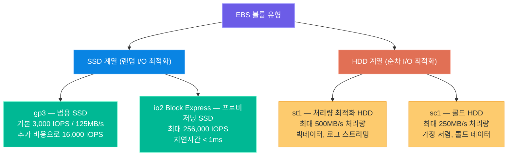
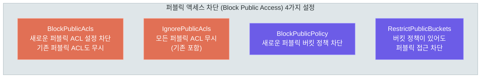
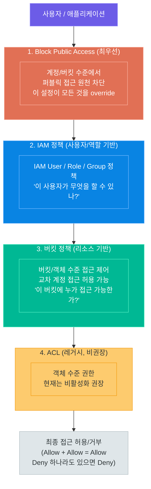
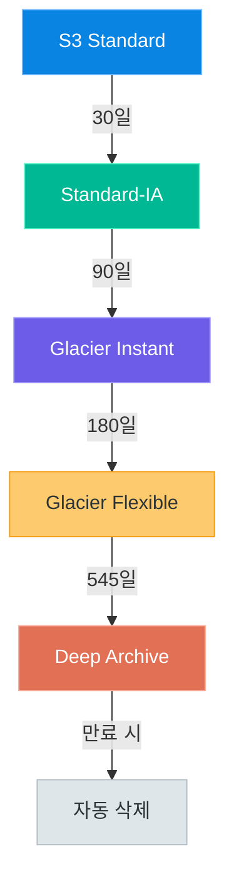
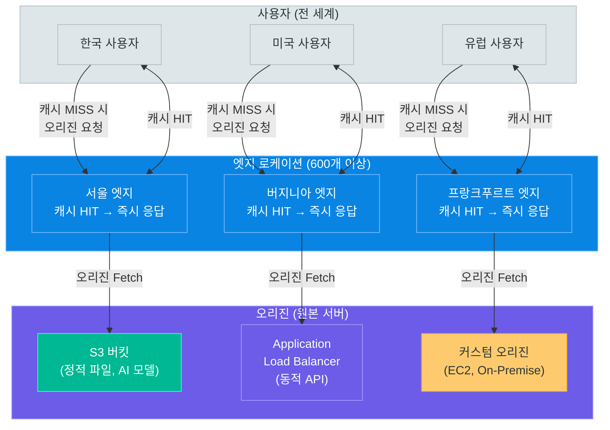

# 스토리지 — EBS와 S3

> AWS 스토리지의 두 축 — 블록 스토리지 EBS의 고성능 활용부터 S3 오브젝트 스토리지 관리, CloudFront CDN 배포까지 완전 정복

---

## 1. EBS 개요

### 블록 스토리지란 무엇인가

**Amazon EBS(Elastic Block Store)**는 EC2 인스턴스에 연결하여 사용하는 네트워크 기반 블록 스토리지입니다. 로컬 하드디스크처럼 파일시스템을 생성하고 데이터를 저장하지만, 실제로는 EC2와 분리된 별도의 스토리지 서버에서 제공됩니다.

```
블록 스토리지 (EBS)                  오브젝트 스토리지 (S3)
─────────────────────────            ──────────────────────────────
파일시스템 마운트 가능               URL 기반 접근
랜덤 읽기/쓰기 (빠름)               순차 읽기 (대용량 최적화)
단일 EC2에 연결 (원칙)              무제한 클라이언트 동시 접근
최대 64TB (io2 Block Express)        사실상 무제한 용량
데이터베이스, OS 부팅 디스크 적합   이미지, 동영상, 로그 적합
```

### EBS의 핵심 특징

| 특징 | 설명 |
|------|------|
| **네트워크 연결** | EC2와 고속 네트워크로 연결, 독립적으로 존재 |
| **가용 영역(AZ) 종속** | 동일 AZ 내의 EC2에만 연결 가능 |
| **스냅샷 지원** | S3에 증분 백업, 교차 리전 복사 가능 |
| **탄력적 볼륨** | 중단 없이 크기·유형·IOPS 변경 가능 |
| **암호화** | AES-256, KMS 키 사용, 투명한 암호화 |
| **다중 연결(io1/io2)** | 최대 16개 EC2 인스턴스에 동시 연결(Multi-Attach) |

> **핵심 포인트:** EBS 볼륨은 EC2 인스턴스가 삭제되더라도 별도로 설정하지 않으면 기본 루트 볼륨은 함께 삭제됩니다. 중요한 데이터 볼륨은 `DeleteOnTermination` 속성을 `false`로 설정하고, 정기적인 스냅샷을 반드시 생성하세요.

---

### EBS 볼륨 유형 비교

AWS는 용도에 맞는 4가지 계열의 EBS 볼륨 유형을 제공합니다.



#### 볼륨 유형 상세 비교표

| 유형 | 분류 | 최대 크기 | IOPS | 처리량 | GB당 월 비용 | 주요 용도 |
|------|------|-----------|------|--------|-------------|-----------|
| **gp3** | SSD (범용) | 16TB | 16,000 IOPS | 1,000MB/s | $0.08 | OS 부팅, 웹 서버, 개발 환경 |
| **gp2** | SSD (범용, 구세대) | 16TB | 16,000 IOPS | 250MB/s | $0.10 | (gp3로 마이그레이션 권장) |
| **io2** | SSD (프로비저닝) | 16TB | 64,000 IOPS | 1,000MB/s | $0.125 | I/O 집중 데이터베이스 |
| **io2 Block Express** | SSD (프로비저닝, 고성능) | 64TB | 256,000 IOPS | 4,000MB/s | $0.125 | SAP HANA, Oracle RAC |
| **io1** | SSD (프로비저닝, 구세대) | 16TB | 64,000 IOPS | 1,000MB/s | $0.125 | (io2로 마이그레이션 권장) |
| **st1** | HDD (처리량 최적화) | 16TB | 500 IOPS | 500MB/s | $0.045 | 빅데이터, Kafka, 로그 |
| **sc1** | HDD (콜드) | 16TB | 250 IOPS | 250MB/s | $0.015 | 아카이브, 저빈도 접근 데이터 |

> **핵심 포인트:** gp3는 gp2보다 20% 저렴하면서 IOPS와 처리량을 독립적으로 설정할 수 있습니다. gp2를 사용 중이라면 gp3로 마이그레이션하는 것만으로도 비용 절감과 성능 개선을 동시에 달성할 수 있습니다.

---

### 볼륨 유형 선택 가이드

```
어떤 EBS 볼륨을 선택할까?

랜덤 I/O가 필요한가?
├── 예 → IOPS가 16,000 미만인가?
│         ├── 예 → gp3 (범용, 비용 효율적)
│         └── 아니오 → io2 / io2 Block Express (고성능 DB)
└── 아니오 → 순차 처리량이 핵심인가?
              ├── 자주 접근 → st1 (처리량 최적화)
              └── 드물게 접근 → sc1 (콜드, 가장 저렴)
```

---

## 2. EBS 실전 운영

### 스냅샷 (Snapshot) — 증분 백업

EBS 스냅샷은 특정 시점의 볼륨 상태를 S3에 저장합니다. 첫 번째 스냅샷은 전체 데이터를 복사하고, 이후 스냅샷은 변경된 블록만 저장하는 **증분 방식**입니다.

```bash
# 스냅샷 생성
aws ec2 create-snapshot \
    --volume-id vol-0abcdef1234567890 \
    --description "Production DB backup $(date +%Y-%m-%d)" \
    --tag-specifications 'ResourceType=snapshot,Tags=[{Key=Name,Value=prod-db-backup}]'

# 스냅샷 목록 조회
aws ec2 describe-snapshots \
    --owner-ids self \
    --query "Snapshots[*].[SnapshotId,VolumeId,StartTime,State,VolumeSize]" \
    --output table

# 스냅샷에서 볼륨 복원
aws ec2 create-volume \
    --snapshot-id snap-0abcdef1234567890 \
    --availability-zone ap-northeast-2a \
    --volume-type gp3

# 스냅샷 교차 리전 복사 (서울 → 오레곤)
aws ec2 copy-snapshot \
    --source-region ap-northeast-2 \
    --source-snapshot-id snap-0abcdef1234567890 \
    --destination-region us-west-2 \
    --description "Cross-region backup" \
    --region us-west-2

# 스냅샷 삭제
aws ec2 delete-snapshot --snapshot-id snap-0abcdef1234567890
```

#### 자동 스냅샷 — Amazon DLM (Data Lifecycle Manager)

```bash
# DLM 정책 생성 (매일 자동 스냅샷)
aws dlm create-lifecycle-policy \
    --description "Daily EBS Snapshot Policy" \
    --state ENABLED \
    --execution-role-arn arn:aws:iam::123456789012:role/AWSDataLifecycleManagerDefaultRole \
    --policy-details '{
        "PolicyType": "EBS_SNAPSHOT_MANAGEMENT",
        "ResourceTypes": ["VOLUME"],
        "TargetTags": [{"Key": "Backup", "Value": "true"}],
        "Schedules": [{
            "Name": "Daily snapshots",
            "CreateRule": {"Interval": 24, "IntervalUnit": "HOURS", "Times": ["03:00"]},
            "RetainRule": {"Count": 7},
            "CopyTags": true
        }]
    }'
```

---

### 암호화 (Encryption)

EBS 암호화는 AWS KMS(Key Management Service)를 사용하며, 데이터 저장 및 네트워크 전송 중 모두 암호화됩니다.

```bash
# 암호화된 볼륨 생성 (기본 KMS 키 사용)
aws ec2 create-volume \
    --size 100 \
    --availability-zone ap-northeast-2a \
    --volume-type gp3 \
    --encrypted

# 암호화된 볼륨 생성 (커스텀 KMS 키 사용)
aws ec2 create-volume \
    --size 100 \
    --availability-zone ap-northeast-2a \
    --volume-type gp3 \
    --encrypted \
    --kms-key-id arn:aws:kms:ap-northeast-2:123456789012:key/mrk-...

# 기본 EBS 암호화 활성화 (리전 전체 설정)
aws ec2 enable-ebs-encryption-by-default --region ap-northeast-2

# 기본 암호화 상태 확인
aws ec2 get-ebs-encryption-by-default --region ap-northeast-2

# 암호화되지 않은 스냅샷을 암호화된 볼륨으로 복원
aws ec2 create-volume \
    --snapshot-id snap-0abcdef1234567890 \
    --availability-zone ap-northeast-2a \
    --encrypted \
    --kms-key-id alias/my-ebs-key
```

> **핵심 포인트:** 계정 수준에서 "기본 EBS 암호화"를 활성화하면 이후 생성되는 모든 EBS 볼륨과 스냅샷이 자동으로 암호화됩니다. 보안 정책 준수가 필요한 환경에서는 이 설정을 반드시 활성화하세요.

---

### IOPS 프로비저닝 (io2 Block Express)

고성능 데이터베이스(Oracle, SAP HANA, MySQL)에는 io2 Block Express를 사용합니다.

```bash
# io2 볼륨 생성 (64,000 IOPS 프로비저닝)
aws ec2 create-volume \
    --size 1000 \
    --availability-zone ap-northeast-2a \
    --volume-type io2 \
    --iops 64000 \
    --encrypted

# io2 Block Express 볼륨 생성 (256,000 IOPS)
# io2 Block Express는 Nitro 기반 EC2에서만 지원
aws ec2 create-volume \
    --size 10000 \
    --availability-zone ap-northeast-2a \
    --volume-type io2 \
    --iops 256000 \
    --multi-attach-enabled \
    --encrypted
```

#### io2 Multi-Attach 설정

```bash
# Multi-Attach 활성화된 볼륨을 두 번째 인스턴스에 연결
# (클러스터 파일시스템, Oracle RAC 등에 활용)
aws ec2 attach-volume \
    --volume-id vol-0abcdef1234567890 \
    --instance-id i-0987654321fedcba0 \
    --device /dev/sdb
```

---

### Elastic Volumes — 볼륨 크기 조정

운영 중단 없이 볼륨 크기, 유형, IOPS를 변경할 수 있습니다.

```bash
# 볼륨 크기 확장 (gp3, 100GB → 200GB)
aws ec2 modify-volume \
    --volume-id vol-0abcdef1234567890 \
    --size 200

# 볼륨 유형 변경 (gp2 → gp3) + IOPS/처리량 설정
aws ec2 modify-volume \
    --volume-id vol-0abcdef1234567890 \
    --volume-type gp3 \
    --iops 6000 \
    --throughput 500

# 변경 상태 확인
aws ec2 describe-volumes-modifications \
    --volume-ids vol-0abcdef1234567890 \
    --query "VolumesModifications[*].[VolumeId,ModificationState,Progress]" \
    --output table
```

볼륨 크기를 변경한 후에는 OS에서 파일시스템을 확장해야 합니다.

```bash
# Linux에서 파일시스템 확장 (ext4)
sudo growpart /dev/xvda 1        # 파티션 확장
sudo resize2fs /dev/xvda1        # ext4 파일시스템 확장

# Linux에서 파일시스템 확장 (xfs)
sudo growpart /dev/nvme0n1 1     # 파티션 확장
sudo xfs_growfs /                 # xfs 파일시스템 확장
```

---

### 볼륨 연결 및 분리

```bash
# 새 볼륨 생성
aws ec2 create-volume \
    --size 50 \
    --availability-zone ap-northeast-2a \
    --volume-type gp3 \
    --tag-specifications 'ResourceType=volume,Tags=[{Key=Name,Value=data-volume}]'

# 볼륨을 EC2에 연결
aws ec2 attach-volume \
    --volume-id vol-0abcdef1234567890 \
    --instance-id i-0123456789abcdef0 \
    --device /dev/sdf

# 연결 후 리눅스에서 마운트
lsblk                             # 볼륨 확인
sudo mkfs -t ext4 /dev/nvme1n1   # 파일시스템 생성 (처음 연결 시)
sudo mkdir -p /data
sudo mount /dev/nvme1n1 /data    # 마운트
echo '/dev/nvme1n1 /data ext4 defaults,nofail 0 2' | sudo tee -a /etc/fstab

# 볼륨 분리 (인스턴스 중지 후 권장)
aws ec2 detach-volume --volume-id vol-0abcdef1234567890

# 볼륨 정보 조회
aws ec2 describe-volumes \
    --volume-ids vol-0abcdef1234567890 \
    --query "Volumes[*].[VolumeId,Size,VolumeType,Iops,State,Attachments[0].InstanceId]" \
    --output table
```

---

## 3. S3 기초

### 오브젝트 스토리지 개념

**Amazon S3(Simple Storage Service)**는 인터넷 어디서나 접근 가능한 오브젝트 스토리지입니다. 파일을 "객체(Object)"로 저장하며, 각 객체는 데이터 + 메타데이터 + 고유한 키로 구성됩니다.

```
블록 스토리지 (EBS)          오브젝트 스토리지 (S3)
─────────────────────        ─────────────────────────────
파일시스템 계층 구조          플랫(Flat) 네임스페이스
inode, 블록 단위             객체(Object) 단위
EC2에 마운트 필요            HTTP/HTTPS URL로 직접 접근
최대 64TB                    사실상 무제한 (객체당 최대 5TB)
빠른 랜덤 읽기/쓰기          대용량 순차 읽기 최적화
수정(Update) 가능            덮어쓰기(Overwrite) 방식
```

### 버킷과 객체 개념

```
S3 구조
────────────────────────────────────────────────────────────
버킷 (Bucket)                         globally unique name
│  버킷 이름: my-ai-model-storage
│  리전: ap-northeast-2
│
├── 객체 (Object)
│     키(Key): models/bert/bert-base-uncased.pth
│     값(Value): [바이너리 데이터, 최대 5TB]
│     메타데이터: Content-Type, 커스텀 태그 등
│     버전 ID: (버전 관리 활성화 시)
│
├── 객체 (Object)
│     키(Key): datasets/train/data_2024.csv
│     값(Value): [CSV 데이터]
│
└── 객체 (Object)
      키(Key): logs/app/2024/01/15/app.log.gz
      값(Value): [압축된 로그]
```

#### 키(Key) 구조 이해

S3의 "폴더"는 실제로 존재하지 않으며, `/`를 포함한 긴 키로 폴더처럼 보이게 합니다.

```
키 예시:
  models/gpt/v1.0/weights.bin   → "폴더처럼 보이지만" 하나의 키
  logs/2024-01-15/app.log       → 날짜 기반 파티셔닝 패턴
  users/12345/profile.jpg       → 사용자 ID 기반 구조
```

### S3 스토리지 클래스

S3는 접근 빈도와 가용성 요구에 따라 7가지 스토리지 클래스를 제공합니다.

| 스토리지 클래스 | 가용성 | 내구성 | 최소 저장 기간 | 검색 지연 | GB당 월 비용 | 적합한 데이터 |
|----------------|--------|--------|--------------|-----------|-------------|--------------|
| **Standard** | 99.99% | 99.999999999% | 없음 | 즉시 | $0.023 | 자주 접근하는 데이터 |
| **Standard-IA** | 99.9% | 99.999999999% | 30일 | 즉시 | $0.0125 | 월 1회 미만 접근 |
| **One Zone-IA** | 99.5% | 99.999999999% | 30일 | 즉시 | $0.01 | 재생성 가능한 비핵심 데이터 |
| **Intelligent-Tiering** | 99.9% | 99.999999999% | 없음 | 즉시 | $0.023~$0.0025 | 접근 패턴이 불규칙한 데이터 |
| **Glacier Instant Retrieval** | 99.9% | 99.999999999% | 90일 | 즉시 | $0.004 | 분기 1회 접근, 즉시 필요 |
| **Glacier Flexible Retrieval** | 99.99% | 99.999999999% | 90일 | 1분~12시간 | $0.0036 | 백업, 연간 1~2회 접근 |
| **Glacier Deep Archive** | 99.99% | 99.999999999% | 180일 | 12~48시간 | $0.00099 | 7~10년 장기 보관 규정 준수 |

> **핵심 포인트:** Intelligent-Tiering은 모니터링 비용(객체당 $0.0025/월)이 추가되지만, 접근 패턴을 자동으로 분석해 30일 미접근 시 Standard-IA, 90일 미접근 시 Archive Instant Access, 180일 이상 미접근 시 Deep Archive로 자동 이동합니다. AI 모델 파일처럼 접근 패턴이 불규칙한 대용량 파일에 효과적입니다.

---

### 기본 S3 작업 — boto3와 AWS CLI

```python
import boto3
from botocore.exceptions import ClientError

# S3 클라이언트 생성
s3_client = boto3.client('s3', region_name='ap-northeast-2')
s3_resource = boto3.resource('s3', region_name='ap-northeast-2')

# ─── 버킷 생성 ───────────────────────────────────────────
s3_client.create_bucket(
    Bucket='my-ai-model-storage',
    CreateBucketConfiguration={'LocationConstraint': 'ap-northeast-2'}
)

# ─── 파일 업로드 ─────────────────────────────────────────
# 방법 1: upload_file (권장, 멀티파트 자동 처리)
s3_client.upload_file(
    Filename='./models/bert-base.pth',
    Bucket='my-ai-model-storage',
    Key='models/bert/bert-base.pth',
    ExtraArgs={
        'ContentType': 'application/octet-stream',
        'StorageClass': 'STANDARD',
        'Metadata': {'version': '1.0', 'framework': 'pytorch'}
    }
)

# 방법 2: put_object (소용량 파일)
with open('./data/config.json', 'rb') as f:
    s3_client.put_object(
        Bucket='my-ai-model-storage',
        Key='configs/model_config.json',
        Body=f,
        ContentType='application/json'
    )

# 방법 3: 대용량 멀티파트 업로드 (5GB 이상)
from boto3.s3.transfer import TransferConfig

config = TransferConfig(
    multipart_threshold=1024 * 25,   # 25MB 이상 시 멀티파트
    max_concurrency=10,               # 동시 업로드 스레드 수
    multipart_chunksize=1024 * 25,   # 청크 크기 25MB
    use_threads=True
)

s3_client.upload_file(
    './models/llama-7b.bin',
    'my-ai-model-storage',
    'models/llama/llama-7b.bin',
    Config=config
)

# ─── 파일 다운로드 ───────────────────────────────────────
# 방법 1: download_file
s3_client.download_file(
    Bucket='my-ai-model-storage',
    Key='models/bert/bert-base.pth',
    Filename='./downloaded/bert-base.pth'
)

# 방법 2: get_object (스트리밍)
response = s3_client.get_object(
    Bucket='my-ai-model-storage',
    Key='configs/model_config.json'
)
config_data = response['Body'].read().decode('utf-8')
print(config_data)

# ─── 객체 목록 조회 ──────────────────────────────────────
# 페이지네이션으로 대량 객체 처리
paginator = s3_client.get_paginator('list_objects_v2')
pages = paginator.paginate(
    Bucket='my-ai-model-storage',
    Prefix='models/'
)

for page in pages:
    for obj in page.get('Contents', []):
        print(f"{obj['Key']:60s} {obj['Size']:>12,d} bytes  {obj['LastModified']}")

# ─── 객체 삭제 ───────────────────────────────────────────
s3_client.delete_object(
    Bucket='my-ai-model-storage',
    Key='models/bert/old-weights.pth'
)

# 복수 객체 일괄 삭제
s3_client.delete_objects(
    Bucket='my-ai-model-storage',
    Delete={
        'Objects': [
            {'Key': 'tmp/file1.txt'},
            {'Key': 'tmp/file2.txt'},
        ]
    }
)
```

```bash
# AWS CLI로 S3 기본 작업
# 버킷 목록
aws s3 ls

# 버킷 내 객체 목록
aws s3 ls s3://my-ai-model-storage/models/ --recursive --human-readable

# 파일 업로드
aws s3 cp ./bert-base.pth s3://my-ai-model-storage/models/bert/bert-base.pth

# 폴더 동기화 (로컬 → S3)
aws s3 sync ./models/ s3://my-ai-model-storage/models/ \
    --storage-class STANDARD_IA \
    --exclude "*.tmp" \
    --delete

# 파일 다운로드
aws s3 cp s3://my-ai-model-storage/models/bert/bert-base.pth ./bert-base.pth

# 버킷 내 용량 조회
aws s3api list-objects-v2 \
    --bucket my-ai-model-storage \
    --query "[sum(Contents[].Size), length(Contents[])]" \
    --output json
```

---

## 4. S3 권한과 정책

### 버킷 정책 (Bucket Policy)

버킷 정책은 JSON 형식으로 버킷 수준의 접근 권한을 정의합니다. IAM 정책과 함께 사용되어 S3 접근을 세밀하게 제어합니다.

#### 예시 1 — 퍼블릭 읽기 허용 (정적 웹사이트)

```json
{
    "Version": "2012-10-17",
    "Statement": [
        {
            "Sid": "PublicReadGetObject",
            "Effect": "Allow",
            "Principal": "*",
            "Action": "s3:GetObject",
            "Resource": "arn:aws:s3:::my-static-website/*"
        }
    ]
}
```

#### 예시 2 — 특정 IP 대역만 허용

```json
{
    "Version": "2012-10-17",
    "Statement": [
        {
            "Sid": "AllowFromOfficeIP",
            "Effect": "Deny",
            "Principal": "*",
            "Action": "s3:*",
            "Resource": [
                "arn:aws:s3:::my-secure-bucket",
                "arn:aws:s3:::my-secure-bucket/*"
            ],
            "Condition": {
                "NotIpAddress": {
                    "aws:SourceIp": [
                        "203.0.113.0/24",
                        "198.51.100.0/24"
                    ]
                }
            }
        }
    ]
}
```

#### 예시 3 — VPC 엔드포인트를 통한 접근만 허용

```json
{
    "Version": "2012-10-17",
    "Statement": [
        {
            "Sid": "AllowVpcEndpointOnly",
            "Effect": "Deny",
            "Principal": "*",
            "Action": "s3:*",
            "Resource": [
                "arn:aws:s3:::my-private-bucket",
                "arn:aws:s3:::my-private-bucket/*"
            ],
            "Condition": {
                "StringNotEquals": {
                    "aws:sourceVpce": "vpce-0abcdef1234567890"
                }
            }
        }
    ]
}
```

```bash
# 버킷 정책 적용
aws s3api put-bucket-policy \
    --bucket my-ai-model-storage \
    --policy file://bucket-policy.json

# 버킷 정책 조회
aws s3api get-bucket-policy \
    --bucket my-ai-model-storage \
    --query Policy \
    --output text | python3 -m json.tool

# 버킷 정책 삭제
aws s3api delete-bucket-policy --bucket my-ai-model-storage
```

---

### ACL (Access Control List) — 레거시

ACL은 객체 수준의 권한 제어 방식으로, 현재는 **버킷 정책 사용을 권장**합니다. 2023년 4월부터 신규 버킷은 기본적으로 ACL이 비활성화됩니다.

| ACL 타입 | 설명 |
|----------|------|
| **private** | 소유자만 접근 (기본값) |
| **public-read** | 누구나 읽기 가능 |
| **public-read-write** | 누구나 읽기/쓰기 가능 (비권장) |
| **aws-exec-read** | EC2에서만 읽기 가능 |
| **authenticated-read** | AWS 인증된 사용자만 읽기 |
| **bucket-owner-read** | 버킷 소유자가 읽기 가능 |
| **bucket-owner-full-control** | 버킷 소유자 전체 제어 |

---

### 퍼블릭 액세스 차단 (Block Public Access)

S3 버킷의 퍼블릭 접근을 방지하는 4가지 설정입니다. **계정 수준**과 **버킷 수준** 모두 설정 가능합니다.



```bash
# 모든 퍼블릭 액세스 차단 (권장 설정)
aws s3api put-public-access-block \
    --bucket my-ai-model-storage \
    --public-access-block-configuration \
        "BlockPublicAcls=true,IgnorePublicAcls=true,BlockPublicPolicy=true,RestrictPublicBuckets=true"

# 현재 퍼블릭 액세스 차단 설정 확인
aws s3api get-public-access-block --bucket my-ai-model-storage
```

---

### Pre-signed URL

Pre-signed URL을 사용하면 인증 없이도 일시적으로 S3 객체에 접근하거나 업로드할 수 있습니다.

```python
import boto3
from datetime import datetime, timedelta

s3_client = boto3.client(
    's3',
    region_name='ap-northeast-2',
    config=boto3.session.Config(signature_version='s3v4')
)

# ─── 다운로드용 Pre-signed URL 생성 ─────────────────────
download_url = s3_client.generate_presigned_url(
    ClientMethod='get_object',
    Params={
        'Bucket': 'my-ai-model-storage',
        'Key': 'models/bert/bert-base.pth',
        'ResponseContentDisposition': 'attachment; filename="bert-base.pth"'
    },
    ExpiresIn=3600   # 1시간 유효 (최대 7일 = 604800초)
)
print(f"다운로드 URL: {download_url}")

# ─── 업로드용 Pre-signed URL 생성 ───────────────────────
# 클라이언트가 S3에 직접 업로드 (서버 부하 없음)
upload_url = s3_client.generate_presigned_url(
    ClientMethod='put_object',
    Params={
        'Bucket': 'my-ai-model-storage',
        'Key': 'uploads/user-dataset.csv',
        'ContentType': 'text/csv'
    },
    ExpiresIn=900   # 15분 유효
)
print(f"업로드 URL: {upload_url}")

# ─── POST 방식 Pre-signed URL (폼 업로드) ────────────────
# HTML 폼에서 직접 업로드 시 사용
presigned_post = s3_client.generate_presigned_post(
    Bucket='my-ai-model-storage',
    Key='uploads/${filename}',   # 변수 사용 가능
    Fields={
        'Content-Type': 'image/jpeg',
        'x-amz-storage-class': 'STANDARD_IA'
    },
    Conditions=[
        ['content-length-range', 1, 10 * 1024 * 1024],  # 최대 10MB
        ['starts-with', '$key', 'uploads/'],
        {'Content-Type': 'image/jpeg'}
    ],
    ExpiresIn=600   # 10분 유효
)

# presigned_post['url']과 presigned_post['fields']를 HTML 폼에 사용
import requests
with open('./photo.jpg', 'rb') as f:
    files = {'file': f}
    response = requests.post(
        presigned_post['url'],
        data=presigned_post['fields'],
        files=files
    )
print(f"업로드 결과: {response.status_code}")  # 204 = 성공
```

---

### S3 접근 제어 계층 구조



---

## 5. S3 고급 기능

### 생명주기 규칙 (Lifecycle Rules)

생명주기 규칙을 사용하면 데이터를 자동으로 저렴한 스토리지 클래스로 전환하거나 삭제할 수 있습니다.



#### 생명주기 규칙 JSON 설정

```json
{
    "Rules": [
        {
            "ID": "AI-Model-Lifecycle",
            "Status": "Enabled",
            "Filter": {
                "Prefix": "models/"
            },
            "Transitions": [
                {
                    "Days": 30,
                    "StorageClass": "STANDARD_IA"
                },
                {
                    "Days": 90,
                    "StorageClass": "GLACIER_IR"
                },
                {
                    "Days": 180,
                    "StorageClass": "GLACIER"
                },
                {
                    "Days": 365,
                    "StorageClass": "DEEP_ARCHIVE"
                }
            ],
            "Expiration": {
                "Days": 1825
            }
        },
        {
            "ID": "Delete-Incomplete-Multipart",
            "Status": "Enabled",
            "Filter": {},
            "AbortIncompleteMultipartUpload": {
                "DaysAfterInitiation": 7
            }
        },
        {
            "ID": "Expire-Old-Versions",
            "Status": "Enabled",
            "Filter": {
                "Prefix": "logs/"
            },
            "NoncurrentVersionExpiration": {
                "NoncurrentDays": 90
            }
        }
    ]
}
```

```bash
# 생명주기 정책 적용
aws s3api put-bucket-lifecycle-configuration \
    --bucket my-ai-model-storage \
    --lifecycle-configuration file://lifecycle.json

# 생명주기 정책 확인
aws s3api get-bucket-lifecycle-configuration \
    --bucket my-ai-model-storage
```

---

### 버전 관리 (Versioning)

버전 관리를 활성화하면 객체를 덮어쓰거나 삭제해도 이전 버전을 복구할 수 있습니다.

```bash
# 버전 관리 활성화
aws s3api put-bucket-versioning \
    --bucket my-ai-model-storage \
    --versioning-configuration Status=Enabled

# 버전 관리 상태 확인
aws s3api get-bucket-versioning --bucket my-ai-model-storage

# 특정 객체의 모든 버전 조회
aws s3api list-object-versions \
    --bucket my-ai-model-storage \
    --prefix "models/bert/bert-base.pth" \
    --query "Versions[*].[VersionId,LastModified,Size]" \
    --output table

# 특정 버전 복원 (이전 버전 다운로드)
aws s3api get-object \
    --bucket my-ai-model-storage \
    --key models/bert/bert-base.pth \
    --version-id "aBcDeFgHiJkLmNoPqRsT" \
    ./restored-bert-base.pth

# MFA Delete 활성화 (중요 데이터 삭제 이중 보호)
aws s3api put-bucket-versioning \
    --bucket my-ai-model-storage \
    --versioning-configuration \
        'Status=Enabled,MFADelete=Enabled' \
    --mfa "arn:aws:iam::123456789012:mfa/user 123456"
```

---

### 정적 웹 호스팅

S3 버킷을 정적 웹사이트 호스팅 서버로 사용할 수 있습니다.

```bash
# 정적 웹 호스팅 설정
aws s3api put-bucket-website \
    --bucket my-static-website.example.com \
    --website-configuration '{
        "IndexDocument": {"Suffix": "index.html"},
        "ErrorDocument": {"Key": "error.html"},
        "RoutingRules": [
            {
                "Condition": {"HttpErrorCodeReturnedEquals": "404"},
                "Redirect": {"ReplaceKeyWith": "404.html"}
            }
        ]
    }'

# 웹사이트 엔드포인트 확인
# http://버킷명.s3-website.ap-northeast-2.amazonaws.com
```

#### CORS 설정 (Cross-Origin Resource Sharing)

```json
{
    "CORSRules": [
        {
            "AllowedHeaders": ["Authorization", "Content-Type"],
            "AllowedMethods": ["GET", "PUT", "POST"],
            "AllowedOrigins": [
                "https://www.example.com",
                "https://app.example.com"
            ],
            "ExposeHeaders": ["ETag"],
            "MaxAgeSeconds": 3000
        }
    ]
}
```

```bash
# CORS 설정 적용
aws s3api put-bucket-cors \
    --bucket my-ai-model-storage \
    --cors-configuration file://cors.json
```

---

### 이벤트 알림 (Event Notifications)

S3 이벤트를 Lambda, SQS, SNS로 전달하여 서버리스 파이프라인을 구축할 수 있습니다.

```python
# Lambda 함수 — S3에 이미지 업로드 시 자동 처리
import boto3
import json
from PIL import Image
import io

s3_client = boto3.client('s3')

def lambda_handler(event, context):
    """S3 이벤트 처리 — 이미지 업로드 시 썸네일 생성"""
    for record in event['Records']:
        bucket = record['s3']['bucket']['name']
        key = record['s3']['object']['key']

        print(f"처리 중: s3://{bucket}/{key}")

        # 원본 이미지 다운로드
        response = s3_client.get_object(Bucket=bucket, Key=key)
        image_data = response['Body'].read()

        # 썸네일 생성
        image = Image.open(io.BytesIO(image_data))
        image.thumbnail((200, 200))

        # 썸네일 업로드
        buffer = io.BytesIO()
        image.save(buffer, format='JPEG', quality=85)
        buffer.seek(0)

        thumbnail_key = key.replace('uploads/', 'thumbnails/')
        s3_client.put_object(
            Bucket=bucket,
            Key=thumbnail_key,
            Body=buffer,
            ContentType='image/jpeg'
        )

        print(f"썸네일 생성 완료: s3://{bucket}/{thumbnail_key}")

    return {'statusCode': 200, 'body': 'Success'}
```

```bash
# S3 이벤트 알림 설정 (Lambda 트리거)
aws s3api put-bucket-notification-configuration \
    --bucket my-ai-model-storage \
    --notification-configuration '{
        "LambdaFunctionConfigurations": [
            {
                "LambdaFunctionArn": "arn:aws:lambda:ap-northeast-2:123456789012:function:ProcessUpload",
                "Events": ["s3:ObjectCreated:*"],
                "Filter": {
                    "Key": {
                        "FilterRules": [
                            {"Name": "prefix", "Value": "uploads/"},
                            {"Name": "suffix", "Value": ".jpg"}
                        ]
                    }
                }
            }
        ],
        "QueueConfigurations": [
            {
                "QueueArn": "arn:aws:sqs:ap-northeast-2:123456789012:DataProcessingQueue",
                "Events": ["s3:ObjectCreated:Put"],
                "Filter": {
                    "Key": {
                        "FilterRules": [
                            {"Name": "prefix", "Value": "datasets/"}
                        ]
                    }
                }
            }
        ]
    }'
```

---

### S3 Transfer Acceleration

Transfer Acceleration은 CloudFront의 엣지 네트워크를 경유해 글로벌 업로드 속도를 향상시킵니다.

```bash
# Transfer Acceleration 활성화
aws s3api put-bucket-accelerate-configuration \
    --bucket my-ai-model-storage \
    --accelerate-configuration Status=Enabled

# 가속 엔드포인트 확인
# 기본: my-ai-model-storage.s3.ap-northeast-2.amazonaws.com
# 가속: my-ai-model-storage.s3-accelerate.amazonaws.com
```

```python
# Transfer Acceleration 사용 업로드
s3_client_accelerated = boto3.client(
    's3',
    region_name='ap-northeast-2',
    config=boto3.session.Config(s3={'use_accelerate_endpoint': True})
)

s3_client_accelerated.upload_file(
    './large-dataset.tar.gz',
    'my-ai-model-storage',
    'datasets/large-dataset.tar.gz'
)
```

---

## 6. CloudFront CDN

### CDN이란 무엇인가

**Amazon CloudFront**는 전 세계 600개 이상의 엣지 로케이션(Edge Location)을 통해 콘텐츠를 사용자에게 가까운 위치에서 제공하는 CDN(Content Delivery Network) 서비스입니다.

```
CDN 없이                        CloudFront CDN 활용
─────────────────────────       ─────────────────────────────────
서울 사용자 → 서울 S3: 5ms     서울 사용자 → 서울 엣지: 1ms
도쿄 사용자 → 서울 S3: 50ms    도쿄 사용자 → 도쿄 엣지: 1ms
뉴욕 사용자 → 서울 S3: 180ms   뉴욕 사용자 → 뉴욕 엣지: 2ms
```

### CloudFront 아키텍처



---

### S3 오리진 + OAC 설정

**OAC(Origin Access Control)**는 CloudFront를 통해서만 S3에 접근하도록 강제합니다. 기존 OAI(Origin Access Identity)를 대체하는 최신 방식입니다.

```bash
# 1. CloudFront 배포 생성 (S3 오리진 + OAC)
aws cloudfront create-distribution \
    --distribution-config '{
        "CallerReference": "my-distribution-001",
        "Comment": "AI Model Files Distribution",
        "DefaultCacheBehavior": {
            "ViewerProtocolPolicy": "redirect-to-https",
            "CachePolicyId": "658327ea-f89d-4fab-a63d-7e88639e58f6",
            "OriginRequestPolicyId": "88a5eaf4-2fd4-4709-b370-b4c650ea3fcf",
            "AllowedMethods": {
                "Quantity": 2,
                "Items": ["HEAD", "GET"],
                "CachedMethods": {"Quantity": 2, "Items": ["HEAD", "GET"]}
            },
            "Compress": true,
            "TargetOriginId": "my-s3-origin"
        },
        "Origins": {
            "Quantity": 1,
            "Items": [{
                "Id": "my-s3-origin",
                "DomainName": "my-ai-model-storage.s3.ap-northeast-2.amazonaws.com",
                "S3OriginConfig": {"OriginAccessIdentity": ""},
                "OriginAccessControlId": "ABCDEFGHIJKLMN"
            }]
        },
        "Enabled": true,
        "PriceClass": "PriceClass_200",
        "HttpVersion": "http2and3"
    }'
```

#### OAC를 위한 버킷 정책 설정

```json
{
    "Version": "2012-10-17",
    "Statement": [
        {
            "Sid": "AllowCloudFrontServicePrincipal",
            "Effect": "Allow",
            "Principal": {
                "Service": "cloudfront.amazonaws.com"
            },
            "Action": "s3:GetObject",
            "Resource": "arn:aws:s3:::my-ai-model-storage/*",
            "Condition": {
                "StringEquals": {
                    "AWS:SourceArn": "arn:aws:cloudfront::123456789012:distribution/EDFDVBD6EXAMPLE"
                }
            }
        }
    ]
}
```

---

### 캐시 동작 (Cache Behavior)

```bash
# 캐시 정책별 특성

# 1. 관리형 캐시 정책 (Managed Cache Policies)
# - CachingOptimized: TTL 86400초, 기본 정적 콘텐츠
# - CachingDisabled: TTL 0, 동적 API
# - CachingOptimizedForUncompressedObjects: 압축 미적용

# 커스텀 캐시 정책 생성
aws cloudfront create-cache-policy \
    --cache-policy-config '{
        "Name": "AI-Model-Cache-Policy",
        "Comment": "AI 모델 파일 캐시 정책",
        "DefaultTTL": 86400,
        "MaxTTL": 31536000,
        "MinTTL": 0,
        "ParametersInCacheKeyAndForwardedToOrigin": {
            "EnableAcceptEncodingGzip": true,
            "EnableAcceptEncodingBrotli": true,
            "HeadersConfig": {"HeaderBehavior": "none"},
            "CookiesConfig": {"CookieBehavior": "none"},
            "QueryStringsConfig": {"QueryStringBehavior": "none"}
        }
    }'
```

#### 캐시 무효화 (Invalidation)

```bash
# 특정 파일 무효화
aws cloudfront create-invalidation \
    --distribution-id EDFDVBD6EXAMPLE \
    --paths "/models/bert/bert-base.pth" "/configs/*"

# 전체 무효화 (비용 발생: 월 1,000경로 무료, 이후 $0.005/경로)
aws cloudfront create-invalidation \
    --distribution-id EDFDVBD6EXAMPLE \
    --paths "/*"

# 무효화 상태 확인
aws cloudfront list-invalidations \
    --distribution-id EDFDVBD6EXAMPLE \
    --query "InvalidationList.Items[*].[Id,Status,CreateTime]" \
    --output table
```

---

### HTTPS with ACM

```bash
# 1. ACM에서 SSL 인증서 요청 (반드시 us-east-1 리전)
aws acm request-certificate \
    --domain-name cdn.example.com \
    --subject-alternative-names "*.cdn.example.com" \
    --validation-method DNS \
    --region us-east-1

# 2. DNS 검증 레코드 확인
aws acm describe-certificate \
    --certificate-arn arn:aws:acm:us-east-1:123456789012:certificate/abc \
    --query "Certificate.DomainValidationOptions" \
    --region us-east-1

# 3. 검증 완료 후 CloudFront 배포에 인증서 연결
aws cloudfront update-distribution \
    --id EDFDVBD6EXAMPLE \
    --distribution-config '{
        ...
        "ViewerCertificate": {
            "ACMCertificateArn": "arn:aws:acm:us-east-1:123456789012:certificate/abc",
            "SSLSupportMethod": "sni-only",
            "MinimumProtocolVersion": "TLSv1.2_2021"
        },
        "Aliases": {
            "Quantity": 1,
            "Items": ["cdn.example.com"]
        }
    }'
```

---

### 가격 클래스 (Price Class)

| 가격 클래스 | 포함 리전 | 특징 |
|------------|-----------|------|
| **PriceClass_All** | 전 세계 모든 엣지 | 최저 지연, 최고 비용 |
| **PriceClass_200** | 미주, 유럽, 아시아, 중동, 아프리카 | 비용과 성능 균형 |
| **PriceClass_100** | 미주, 유럽 일부 | 저비용, 아시아 제외 |

---

### AI 모델 파일 배포 활용 사례

CloudFront는 AI 모델 파일 배포에 특히 효과적입니다.

```python
import boto3

class AIModelDistributor:
    """AI 모델 파일을 CloudFront로 배포하는 유틸리티"""

    def __init__(self, bucket_name: str, distribution_domain: str):
        self.s3 = boto3.client('s3', region_name='ap-northeast-2')
        self.cf = boto3.client('cloudfront')
        self.bucket_name = bucket_name
        self.distribution_domain = distribution_domain

    def upload_model(self, local_path: str, model_key: str, version: str):
        """모델 파일 업로드 및 메타데이터 설정"""
        self.s3.upload_file(
            local_path,
            self.bucket_name,
            model_key,
            ExtraArgs={
                'ContentType': 'application/octet-stream',
                'CacheControl': 'public, max-age=31536000, immutable',
                'Metadata': {
                    'model-version': version,
                    'upload-date': '2024-01-15'
                }
            }
        )
        print(f"모델 업로드 완료: {model_key}")

    def get_model_url(self, model_key: str) -> str:
        """CloudFront URL 반환"""
        return f"https://{self.distribution_domain}/{model_key}"

    def get_presigned_download_url(self, model_key: str, expires: int = 3600) -> str:
        """일시적 다운로드 URL 생성 (인증된 사용자용)"""
        return self.s3.generate_presigned_url(
            'get_object',
            Params={'Bucket': self.bucket_name, 'Key': model_key},
            ExpiresIn=expires
        )

    def invalidate_cache(self, distribution_id: str, paths: list):
        """모델 업데이트 후 캐시 무효화"""
        self.cf.create_invalidation(
            DistributionId=distribution_id,
            InvalidationBatch={
                'Paths': {'Quantity': len(paths), 'Items': paths},
                'CallerReference': str(boto3.session.Session().region_name)
            }
        )
        print(f"캐시 무효화 요청 완료: {paths}")


# 사용 예시
distributor = AIModelDistributor(
    bucket_name='my-ai-model-storage',
    distribution_domain='d1234567890.cloudfront.net'
)

# 모델 업로드
distributor.upload_model(
    local_path='./models/gpt2-fine-tuned.pth',
    model_key='models/gpt2/v2.0/gpt2-fine-tuned.pth',
    version='2.0.0'
)

# CloudFront URL로 모델 접근
model_url = distributor.get_model_url('models/gpt2/v2.0/gpt2-fine-tuned.pth')
print(f"모델 다운로드 URL: {model_url}")
```

---

## 7. 핵심 정리

### 개념 요약표

| 서비스 | 유형 | 최대 용량 | 주요 특징 | 주요 용도 |
|--------|------|-----------|-----------|-----------|
| **EBS gp3** | 블록 스토리지 | 16TB | 3,000 IOPS 기본, 독립 IOPS/처리량 설정 | OS 부팅 디스크, 웹 서버 |
| **EBS io2** | 블록 스토리지 | 64TB (Block Express) | 256,000 IOPS, 지연 < 1ms | 고성능 DB (Oracle, SAP) |
| **EBS st1** | 블록 스토리지 | 16TB | 500MB/s 처리량 | 빅데이터, 로그 스트리밍 |
| **EBS sc1** | 블록 스토리지 | 16TB | 250MB/s, 최저가 | 콜드 데이터 보관 |
| **S3 Standard** | 오브젝트 | 무제한 | 99.99% 가용성, 11 9's 내구성 | 자주 접근하는 데이터 |
| **S3 Standard-IA** | 오브젝트 | 무제한 | 낮은 저장 비용, 검색 비용 발생 | 월 1회 미만 접근 |
| **S3 Glacier DA** | 오브젝트 | 무제한 | 12~48시간 검색, 최저가 | 규정 준수 장기 보관 |
| **CloudFront** | CDN | - | 600개 엣지, HTTPS, WAF 통합 | 전 세계 콘텐츠 배포 |

---

### 스토리지 선택 가이드 (의사결정 표)

| 요구 사항 | 선택 스토리지 | 근거 |
|-----------|--------------|------|
| EC2 OS 디스크 | EBS gp3 | 범용 SSD, 비용 효율 |
| MySQL / PostgreSQL 데이터 파일 | EBS gp3 또는 io2 | IOPS에 따라 선택 |
| Oracle RAC, SAP HANA | EBS io2 Block Express | 256,000 IOPS, 다중 연결 |
| Hadoop, Spark 중간 결과 | EBS st1 | 순차 처리량 최적화 |
| 아카이브 백업 | EBS sc1 또는 S3 Glacier | 콜드 데이터, 저비용 |
| 이미지, 동영상 파일 | S3 Standard | 무제한 확장, URL 접근 |
| AI 모델 파일 배포 | S3 + CloudFront | 글로벌 엣지 캐싱 |
| 로그 장기 보관 | S3 생명주기 → Glacier | 자동 클래스 전환 |
| 정적 웹사이트 | S3 + CloudFront | 서버 불필요, 저비용 |
| 인증된 사용자 일시적 공유 | S3 Pre-signed URL | 만료 시간 설정 |

---

### 주요 비용 최적화 포인트

```
EBS 비용 최적화
├── gp2 → gp3 마이그레이션: 20% 절감
├── 미사용 볼륨 스냅샷 후 삭제
├── gp3 IOPS: 3,000 이하로 유지 (기본 포함)
└── 스냅샷 생명주기 정책으로 오래된 스냅샷 자동 삭제

S3 비용 최적화
├── 생명주기 규칙: Standard → IA → Glacier 자동 전환
├── Intelligent-Tiering: 접근 패턴 불규칙 데이터
├── 불완전 멀티파트 업로드 자동 중단 설정
└── S3 Storage Lens로 전체 버킷 사용 현황 분석

CloudFront 비용 최적화
├── 적절한 PriceClass 선택 (아시아만 서비스 시 PriceClass_200)
├── 캐시 적중률(HIT Ratio) 향상으로 오리진 요청 감소
├── 무효화는 최소화 (1,000경로/월 무료)
└── 압축(gzip/brotli) 활성화로 전송 데이터 감소
```

---

### 다음 단계

이번 모듈에서는 AWS의 핵심 스토리지 서비스인 EBS와 S3, 그리고 CloudFront CDN을 학습했습니다. 블록 스토리지와 오브젝트 스토리지의 차이를 이해하고, 볼륨 유형 선택, 생명주기 관리, CDN 배포까지 실전 운영에 필요한 내용을 다뤘습니다.

다음 파일: [06_docker_containerization.md](06_docker_containerization.md)

다음 학습에서는 **Docker 컨테이너화**를 다룹니다. AI 애플리케이션을 Docker 이미지로 패키징하고, docker-compose로 멀티 컨테이너 환경을 구성하며, AWS ECR에 이미지를 저장하고 배포하는 방법을 학습합니다. EBS를 Docker 볼륨으로 활용하고 S3와 연동하는 패턴도 살펴봅니다.

---
