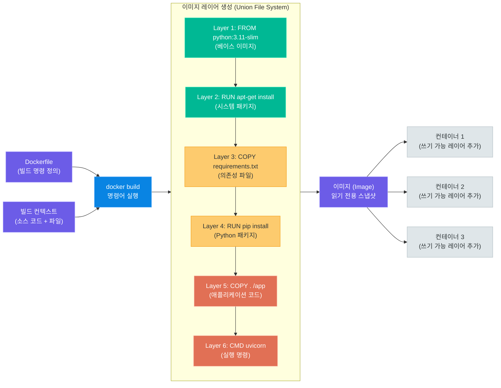
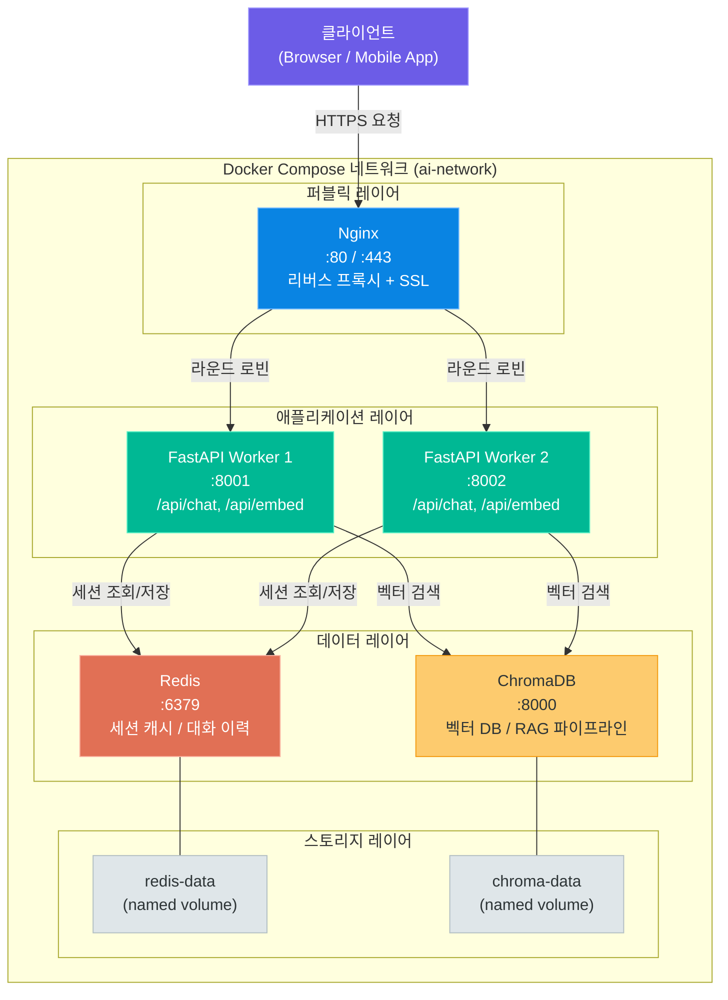
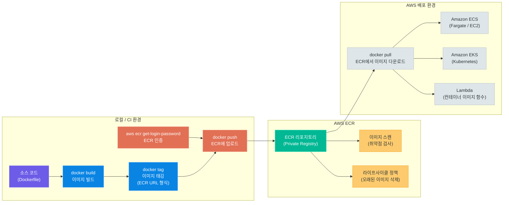

# Docker 컨테이너화

> "한 번 빌드하면 어디서든 실행된다" — 컨테이너 기술의 핵심 철학부터 Dockerfile 작성, Docker Compose 멀티 컨테이너 구성, AWS ECR을 이용한 이미지 배포까지 생성형 AI 애플리케이션의 컨테이너화 전략을 완전 정복합니다

---

## 1. 컨테이너 vs 가상 머신

### 가상화의 두 가지 방식

소프트웨어를 어디서든 동일하게 실행하려면 **환경 격리(isolation)**가 필요합니다. 개발 노트북에서는 정상 작동하지만 운영 서버에서 오류가 나는 "나는 내 컴퓨터에서는 되는데…" 현상을 막으려면 애플리케이션이 동작하는 환경 자체를 패키징해야 합니다.

환경 격리를 달성하는 방법은 크게 두 가지입니다. **하이퍼바이저 기반 가상 머신(VM)**과 **컨테이너 런타임 기반 컨테이너**입니다.

```mermaid
graph TB
    subgraph VM["가상 머신 (VM) 아키텍처"]
        direction TB
        HW1["하드웨어\n(CPU / RAM / Disk)"]:::hardware
        OS1["호스트 OS\n(Linux / Windows)"]:::hostos
        HV["하이퍼바이저\n(VMware / KVM / Hyper-V)"]:::hypervisor
        GOS1["게스트 OS\n(Ubuntu)"]:::guestos
        GOS2["게스트 OS\n(CentOS)"]:::guestos
        GOS3["게스트 OS\n(Windows)"]:::guestos
        APP1["App A"]:::app
        APP2["App B"]:::app
        APP3["App C"]:::app
        HW1 --> OS1 --> HV
        HV --> GOS1 --> APP1
        HV --> GOS2 --> APP2
        HV --> GOS3 --> APP3
    end

    subgraph CT["컨테이너 아키텍처"]
        direction TB
        HW2["하드웨어\n(CPU / RAM / Disk)"]:::hardware
        OS2["호스트 OS\n(Linux 커널)"]:::hostos
        CR["컨테이너 런타임\n(Docker / containerd)"]:::runtime
        C1["컨테이너 A\n(App + Libs)"]:::container
        C2["컨테이너 B\n(App + Libs)"]:::container
        C3["컨테이너 C\n(App + Libs)"]:::container
        HW2 --> OS2 --> CR
        CR --> C1
        CR --> C2
        CR --> C3
    end

    classDef hardware fill:#6c5ce7,stroke:#a29bfe,color:#fff
    classDef hostos fill:#0984e3,stroke:#74b9ff,color:#fff
    classDef hypervisor fill:#e17055,stroke:#fab1a0,color:#fff
    classDef runtime fill:#00b894,stroke:#55efc4,color:#fff
    classDef guestos fill:#fdcb6e,stroke:#f39c12,color:#2d3436
    classDef app fill:#dfe6e9,stroke:#b2bec3,color:#2d3436
    classDef container fill:#dfe6e9,stroke:#b2bec3,color:#2d3436
```



**가상 머신(Virtual Machine)**은 하이퍼바이저가 물리 하드웨어를 가상화하여 여러 개의 독립된 가상 컴퓨터를 만들어냅니다. 각 VM은 독립된 운영체제(게스트 OS)를 포함하므로 완전한 격리를 제공하지만, 그만큼 무겁습니다.

**컨테이너(Container)**는 호스트 OS의 커널을 공유하면서 프로세스 격리 기술(Linux 네임스페이스, cgroups)을 사용합니다. 게스트 OS가 없으므로 훨씬 가볍고 빠르게 시작합니다.

### 성능 비교

| 비교 항목 | 가상 머신 (VM) | 컨테이너 |
|-----------|--------------|---------|
| **시작 시간** | 수십 초 ~ 수 분 | 수백 밀리초 ~ 수 초 |
| **메모리 오버헤드** | 게스트 OS당 수백 MB ~ 수 GB | 수 MB ~ 수십 MB |
| **이미지 크기** | 수 GB (OS 포함) | 수 MB ~ 수백 MB |
| **격리 수준** | 하드웨어 수준 (강한 격리) | OS 프로세스 수준 (적절한 격리) |
| **성능 오버헤드** | CPU·메모리 모두 가상화 비용 발생 | 거의 네이티브 수준 성능 |
| **보안** | 강한 격리로 높은 보안 | 커널 공유로 상대적으로 낮음 |
| **이식성** | 하이퍼바이저 종속 | 어떤 컨테이너 런타임에서도 동작 |
| **밀도** | 호스트 1대에 수십 개 | 호스트 1대에 수백 ~ 수천 개 |
| **적합한 용도** | 다중 OS 환경, 강한 격리 필요 시 | 마이크로서비스, CI/CD, 빠른 배포 |

> **핵심 포인트:** VM과 컨테이너는 경쟁 관계가 아니라 보완 관계입니다. 실제 클라우드 환경에서는 EC2 VM 위에서 컨테이너를 실행하는 방식이 가장 일반적입니다. VM이 제공하는 강한 격리 위에서 컨테이너의 가벼움과 빠른 배포를 함께 누립니다.

### 왜 컨테이너인가

**1. 일관된 환경 (Consistent Environment)**

"내 로컬에서는 되는데"라는 말이 사라집니다. 컨테이너는 애플리케이션 코드, 런타임, 라이브러리, 환경 변수, 설정 파일을 하나의 패키지로 묶습니다. 개발 노트북, CI 서버, 운영 클라우드 어디서든 동일한 이미지로 실행됩니다.

**2. 빠른 배포 (Fast Deployment)**

수 초 안에 새 버전 배포와 롤백이 가능합니다. 전통적인 배포 방식처럼 서버에 SSH로 접속해 의존성을 설치하고 프로세스를 재시작하는 과정이 필요 없습니다.

**3. 리소스 효율 (Resource Efficiency)**

게스트 OS가 없으므로 같은 하드웨어에서 훨씬 많은 애플리케이션을 실행할 수 있습니다. 마이크로서비스 아키텍처에서 각 서비스를 독립 컨테이너로 실행할 때 특히 유리합니다.

**4. 스케일링 용이성**

컨테이너는 불변(Immutable) 아티팩트입니다. 같은 이미지로 컨테이너를 10개, 100개 복제하는 것이 간단합니다. Kubernetes나 AWS ECS 같은 오케스트레이션 도구와 결합하면 자동 스케일링이 가능합니다.

**5. 생성형 AI 개발에서의 장점**

AI 모델은 특정 버전의 PyTorch, CUDA, 라이브러리에 강하게 의존합니다. 컨테이너화하면 모델과 의존성을 함께 패키징하여 환경 불일치로 인한 오류를 원천 차단합니다.

### Docker의 역사

| 연도 | 사건 |
|------|------|
| **2008년** | Linux cgroups(컨트롤 그룹) 커널 통합 — 컨테이너 기반 격리의 기반 기술 |
| **2010년** | dotCloud(Solomon Hykes가 창업한 PaaS 회사) 설립 |
| **2013년 3월** | PyCon 2013에서 Docker 오픈소스로 공개 — 단 5분 데모로 폭발적 반응 |
| **2014년** | Docker Hub 출시, Docker Inc. 설립, Docker 1.0 릴리스 |
| **2015년** | Docker Compose, Docker Swarm 출시; OCI(Open Container Initiative) 표준화 시작 |
| **2016년** | Kubernetes 1.0 릴리스 — 컨테이너 오케스트레이션 생태계 확장 |
| **2017년** | Docker Enterprise 출시, containerd를 CNCF에 기증 |
| **2019년** | Docker Inc. 엔터프라이즈 사업 부문 Mirantis에 매각 |
| **2020년~** | Docker Desktop 유료화 논쟁, Podman·nerdctl 등 대안 등장 |
| **2022년~** | BuildKit, Docker Scout 등 보안·최적화 기능 강화 |

Solomon Hykes는 2013년 PyCon 발표에서 "왜 배포가 이렇게 어려워야 하나?"라는 질문을 던졌고, Docker는 그 답으로 탄생했습니다. 오늘날 Docker는 컨테이너 기술의 대명사가 되었으며, 컨테이너 이미지 형식은 OCI 표준으로 자리잡았습니다.

---

## 2. Docker 기초

### 3대 핵심 개념

Docker의 세계는 세 가지 핵심 개념으로 이해할 수 있습니다.

**이미지 (Image)**

이미지는 컨테이너를 만들기 위한 읽기 전용 템플릿입니다. 레이어(Layer) 구조로 이루어져 있으며, 각 레이어는 Dockerfile의 명령어 하나에 대응합니다. 이미지 자체는 실행되지 않습니다 — 실행되는 것은 이미지로부터 생성된 컨테이너입니다.

```
이미지 = 레시피 (설계도)
컨테이너 = 요리 결과물 (실행 중인 인스턴스)
```

**컨테이너 (Container)**

이미지를 실행한 인스턴스입니다. 하나의 이미지에서 여러 컨테이너를 동시에 실행할 수 있습니다. 컨테이너는 자체 파일시스템, 네트워크, 프로세스 공간을 가집니다. 컨테이너를 삭제하면 컨테이너 내에서 변경된 데이터는 사라집니다(볼륨을 사용하지 않는 경우).

**레지스트리 (Registry)**

이미지를 저장하고 배포하는 중앙 저장소입니다. Docker Hub가 가장 유명한 공개 레지스트리이며, AWS ECR, Google GCR, GitHub Container Registry 같은 프라이빗 레지스트리도 있습니다.

```
로컬 빌드 → 레지스트리에 Push → 서버에서 Pull → 컨테이너 실행
```

### 주요 Docker 명령어

| 명령어 | 설명 | 자주 쓰는 예시 |
|--------|------|--------------|
| `docker run` | 이미지로 컨테이너 생성 및 실행 | `docker run -d -p 8000:8000 my-api` |
| `docker build` | Dockerfile로 이미지 빌드 | `docker build -t my-api:latest .` |
| `docker push` | 레지스트리에 이미지 업로드 | `docker push myrepo/my-api:latest` |
| `docker pull` | 레지스트리에서 이미지 다운로드 | `docker pull python:3.11-slim` |
| `docker exec` | 실행 중인 컨테이너 내부 명령 실행 | `docker exec -it myapp bash` |
| `docker logs` | 컨테이너 로그 출력 | `docker logs -f --tail=100 myapp` |
| `docker ps` | 실행 중인 컨테이너 목록 | `docker ps -a` (전체 목록) |
| `docker stop` | 컨테이너 정상 종료 (SIGTERM) | `docker stop myapp` |
| `docker rm` | 컨테이너 삭제 | `docker rm -f myapp` |
| `docker images` | 로컬 이미지 목록 | `docker images \| grep my-api` |
| `docker rmi` | 이미지 삭제 | `docker rmi my-api:old` |
| `docker inspect` | 컨테이너/이미지 상세 정보 | `docker inspect myapp` |
| `docker stats` | 컨테이너 리소스 사용량 모니터링 | `docker stats --no-stream` |
| `docker system prune` | 사용하지 않는 리소스 정리 | `docker system prune -af` |

### docker run 주요 옵션

`docker run`은 가장 자주 사용하는 명령어입니다. 다양한 옵션을 이해해야 컨테이너를 원하는 대로 실행할 수 있습니다.

| 옵션 | 설명 | 예시 |
|------|------|------|
| `-d` | 백그라운드(detached) 모드로 실행 | `docker run -d nginx` |
| `-p host:container` | 포트 포워딩 | `docker run -p 8080:8000 myapi` |
| `-v host:container` | 볼륨(디렉토리) 마운트 | `docker run -v /data:/app/data myapi` |
| `-e KEY=VALUE` | 환경 변수 설정 | `docker run -e DATABASE_URL=... myapi` |
| `--name` | 컨테이너 이름 지정 | `docker run --name myapp myapi` |
| `--network` | 네트워크 연결 | `docker run --network mynet myapi` |
| `--rm` | 종료 시 자동 삭제 | `docker run --rm myapi python test.py` |
| `-it` | 인터랙티브 + TTY (터미널 접속) | `docker run -it python:3.11 bash` |
| `--env-file` | 파일에서 환경 변수 로드 | `docker run --env-file .env myapi` |
| `--memory` | 메모리 제한 | `docker run --memory=512m myapi` |
| `--cpus` | CPU 제한 | `docker run --cpus=1.5 myapi` |
| `--restart` | 재시작 정책 | `docker run --restart=always myapi` |

```bash
# 종합 예시: FastAPI 앱 실행
docker run \
  --name fastapi-app \
  -d \
  -p 8000:8000 \
  -v $(pwd)/data:/app/data \
  -e DATABASE_URL=postgresql://user:pass@db:5432/mydb \
  -e OPENAI_API_KEY=sk-... \
  --memory=1g \
  --restart=unless-stopped \
  my-fastapi:latest
```

---

## 3. Dockerfile 작성

### Dockerfile 주요 지시어

Dockerfile은 이미지를 빌드하기 위한 명령어 스크립트입니다. 각 명령어(지시어)는 이미지 레이어 하나를 생성합니다.

| 지시어 | 설명 | 예시 |
|--------|------|------|
| `FROM` | 베이스 이미지 지정 (반드시 첫 번째) | `FROM python:3.11-slim` |
| `RUN` | 빌드 시 실행할 쉘 명령어 | `RUN pip install -r requirements.txt` |
| `COPY` | 호스트 파일을 이미지로 복사 | `COPY . /app` |
| `ADD` | COPY 확장판 (URL, tar 압축 해제 가능) | `ADD model.tar.gz /models/` |
| `WORKDIR` | 작업 디렉토리 설정 | `WORKDIR /app` |
| `EXPOSE` | 컨테이너가 사용할 포트 문서화 | `EXPOSE 8000` |
| `CMD` | 컨테이너 시작 시 기본 명령어 (오버라이드 가능) | `CMD ["uvicorn", "main:app"]` |
| `ENTRYPOINT` | 컨테이너 시작 시 고정 명령어 | `ENTRYPOINT ["python", "main.py"]` |
| `ARG` | 빌드 시 전달받는 인수 | `ARG MODEL_VERSION=v1` |
| `ENV` | 환경 변수 설정 (컨테이너 실행 시에도 유지) | `ENV PYTHONPATH=/app` |
| `LABEL` | 이미지 메타데이터 추가 | `LABEL version="1.0"` |
| `USER` | 이후 명령어를 실행할 사용자 지정 | `USER appuser` |
| `VOLUME` | 마운트 포인트 지정 | `VOLUME ["/app/data"]` |
| `HEALTHCHECK` | 헬스 체크 명령어 | `HEALTHCHECK CMD curl -f http://localhost/health` |

### Docker 이미지 빌드 프로세스



### 레이어 캐싱 최적화 — 순서가 중요합니다

Docker는 이미지를 레이어 단위로 캐싱합니다. 특정 레이어가 변경되면 그 이하 모든 레이어가 다시 빌드됩니다. 따라서 **자주 변경되는 파일일수록 Dockerfile의 아래에** 배치해야 캐시 효율이 높아집니다.

**나쁜 예시 — 캐시를 활용하지 못함:**

```dockerfile
# 소스 코드를 먼저 복사하면 코드가 바뀔 때마다
# pip install이 매번 처음부터 실행됩니다 (느림!)
FROM python:3.11-slim

COPY . /app           # 코드 변경 시 이 레이어 무효화
WORKDIR /app
RUN pip install -r requirements.txt  # 매번 재실행
CMD ["uvicorn", "main:app", "--host", "0.0.0.0"]
```

**좋은 예시 — 캐시 최대 활용:**

```dockerfile
FROM python:3.11-slim

WORKDIR /app

# 1) 의존성 파일만 먼저 복사 (변경 빈도: 낮음)
COPY requirements.txt .

# 2) 의존성 설치 — requirements.txt가 바뀌지 않으면 캐시 재사용
RUN pip install --no-cache-dir -r requirements.txt

# 3) 소스 코드는 마지막에 복사 (변경 빈도: 높음)
COPY . .

CMD ["uvicorn", "main:app", "--host", "0.0.0.0", "--port", "8000"]
```

### 멀티스테이지 빌드 (Builder Pattern)

멀티스테이지 빌드는 빌드 도구와 런타임 의존성을 분리하여 최종 이미지 크기를 크게 줄이는 기법입니다. 빌드 단계에서만 필요한 컴파일러, 개발 도구 등이 최종 이미지에 포함되지 않습니다.

```dockerfile
# ============================================================
# Stage 1: 빌드 스테이지 (builder)
# ============================================================
FROM python:3.11 AS builder

WORKDIR /build

# 시스템 빌드 의존성 설치
RUN apt-get update && apt-get install -y \
    build-essential \
    libffi-dev \
    && rm -rf /var/lib/apt/lists/*

# Python 의존성 빌드 (wheel 생성)
COPY requirements.txt .
RUN pip wheel --no-cache-dir --wheel-dir=/wheels -r requirements.txt

# ============================================================
# Stage 2: 런타임 스테이지 (final)
# ============================================================
FROM python:3.11-slim AS final

WORKDIR /app

# 빌더에서 빌드된 wheel 파일만 복사 (빌드 도구는 제외)
COPY --from=builder /wheels /wheels
RUN pip install --no-cache-dir --find-links=/wheels /wheels/* \
    && rm -rf /wheels

# 애플리케이션 코드 복사
COPY . .

# 보안: 비루트 사용자 생성 및 전환
RUN useradd -m -u 1000 appuser \
    && chown -R appuser:appuser /app
USER appuser

EXPOSE 8000
CMD ["uvicorn", "main:app", "--host", "0.0.0.0", "--port", "8000"]
```

멀티스테이지 빌드의 효과:
- 전체 Python 이미지(~900MB) → slim + wheels만 (~150MB)
- 빌드 도구가 최종 이미지에 포함되지 않아 보안 취약점 감소

### Python AI 앱 Dockerfile 전체 예제

FastAPI + 생성형 AI 의존성을 포함한 실전 Dockerfile입니다.

```dockerfile
# ============================================================
# FastAPI + 생성형 AI 애플리케이션 Dockerfile
# 대상: Python 3.11, FastAPI, LangChain, sentence-transformers
# ============================================================

# ---- Stage 1: 의존성 빌더 ----
FROM python:3.11-slim AS builder

WORKDIR /build

# 빌드에 필요한 시스템 패키지
RUN apt-get update && apt-get install -y --no-install-recommends \
    build-essential \
    gcc \
    g++ \
    libffi-dev \
    libssl-dev \
    && rm -rf /var/lib/apt/lists/*

# requirements 파일 복사 후 wheel 빌드
COPY requirements.txt .
RUN pip install --upgrade pip \
    && pip wheel --no-cache-dir --wheel-dir=/wheels -r requirements.txt

# ---- Stage 2: 런타임 이미지 ----
FROM python:3.11-slim AS runtime

# 레이블 (이미지 메타데이터)
LABEL maintainer="ai-team@example.com" \
      version="1.0.0" \
      description="GenAI FastAPI Application"

# 런타임에 필요한 시스템 패키지만 설치
RUN apt-get update && apt-get install -y --no-install-recommends \
    curl \
    libgomp1 \
    && rm -rf /var/lib/apt/lists/*

WORKDIR /app

# 빌더에서 빌드된 wheel 설치
COPY --from=builder /wheels /wheels
RUN pip install --no-cache-dir --find-links=/wheels /wheels/* \
    && rm -rf /wheels

# 비루트 사용자 생성
RUN useradd -m -u 1000 -s /bin/bash appuser \
    && mkdir -p /app/data /app/models /app/logs \
    && chown -R appuser:appuser /app

# 애플리케이션 코드 복사
COPY --chown=appuser:appuser app/ ./app/
COPY --chown=appuser:appuser main.py .

# 환경 변수 기본값 설정
ENV PYTHONPATH=/app \
    PYTHONDONTWRITEBYTECODE=1 \
    PYTHONUNBUFFERED=1 \
    PORT=8000 \
    WORKERS=1

# 모델 파일 볼륨 마운트 포인트
VOLUME ["/app/models", "/app/data"]

# 포트 노출
EXPOSE 8000

# 헬스 체크
HEALTHCHECK --interval=30s --timeout=10s --start-period=60s --retries=3 \
    CMD curl -f http://localhost:8000/health || exit 1

# 비루트 사용자로 전환
USER appuser

# 시작 명령어 (uvicorn)
CMD ["sh", "-c", "uvicorn main:app --host 0.0.0.0 --port ${PORT} --workers ${WORKERS}"]
```

**requirements.txt 예시:**

```text
fastapi==0.111.0
uvicorn[standard]==0.30.1
pydantic==2.7.4
langchain==0.2.6
langchain-openai==0.1.14
langchain-community==0.2.6
chromadb==0.5.3
sentence-transformers==3.0.1
redis==5.0.7
boto3==1.34.139
python-multipart==0.0.9
httpx==0.27.0
```

**이미지 빌드 및 실행:**

```bash
# 이미지 빌드
docker build -t genai-api:latest .

# 빌드 시 ARG 전달
docker build \
  --build-arg MODEL_VERSION=v2 \
  -t genai-api:v2 .

# 빌드 결과 확인
docker images genai-api

# 컨테이너 실행 (개발 환경)
docker run -d \
  --name genai-api \
  -p 8000:8000 \
  -v $(pwd)/models:/app/models \
  -v $(pwd)/data:/app/data \
  --env-file .env \
  genai-api:latest

# 로그 확인
docker logs -f genai-api

# 컨테이너 내부 접속 (디버깅)
docker exec -it genai-api bash
```

---

## 4. Docker Compose

### Docker Compose란

Docker Compose는 여러 컨테이너로 구성된 애플리케이션을 단일 YAML 파일(`docker-compose.yml`)로 정의하고 관리하는 도구입니다. 모듈 06에서 기본 개념을 소개했지만, 여기서는 프로덕션 수준의 멀티 컨테이너 구성을 심층적으로 다룹니다.

생성형 AI 애플리케이션의 전형적인 구성요소는 다음과 같습니다.
- **FastAPI**: AI 추론 API 서버
- **Redis**: 대화 이력 캐싱, 세션 관리
- **ChromaDB**: 벡터 데이터베이스 (RAG 파이프라인)
- **Nginx**: 리버스 프록시, 로드밸런서, HTTPS 종료



### docker-compose.yml 전체 예제

```yaml
# docker-compose.yml
# GenAI 풀스택 애플리케이션 - Docker Compose 설정
# 버전: Compose 파일 형식 v3.9 (Docker Engine 19.03.0+ 필요)

version: "3.9"

# ============================================================
# 서비스 정의
# ============================================================
services:

  # ----------------------------------------------------------
  # 1. Nginx - 리버스 프록시
  # ----------------------------------------------------------
  nginx:
    image: nginx:1.25-alpine
    container_name: genai-nginx
    ports:
      - "80:80"
      - "443:443"
    volumes:
      - ./nginx/nginx.conf:/etc/nginx/nginx.conf:ro
      - ./nginx/ssl:/etc/nginx/ssl:ro
      - nginx-logs:/var/log/nginx
    depends_on:
      fastapi-1:
        condition: service_healthy
      fastapi-2:
        condition: service_healthy
    restart: unless-stopped
    networks:
      - ai-network
    profiles:
      - production
      - full

  # ----------------------------------------------------------
  # 2. FastAPI - AI 추론 서버 (스케일 아웃 가능)
  # ----------------------------------------------------------
  fastapi-1:
    build:
      context: .
      dockerfile: Dockerfile
      target: runtime          # 멀티스테이지 중 runtime 스테이지 사용
      args:
        - BUILD_ENV=production
    container_name: genai-api-1
    image: genai-api:latest
    ports:
      - "8001:8000"            # 호스트:컨테이너 (직접 접근용, 개발 시)
    env_file:
      - .env                   # 공통 환경 변수
      - .env.production        # 환경별 오버라이드
    environment:
      - WORKER_ID=1
      - REDIS_URL=redis://redis:6379/0
      - CHROMA_HOST=chromadb
      - CHROMA_PORT=8000
    volumes:
      - model-cache:/app/models     # 모델 파일 영속화
      - ./app:/app/app:ro           # 개발 시 핫 리로드용 (프로덕션에서는 제거)
    depends_on:
      redis:
        condition: service_healthy
      chromadb:
        condition: service_healthy
    healthcheck:
      test: ["CMD", "curl", "-f", "http://localhost:8000/health"]
      interval: 30s
      timeout: 10s
      retries: 3
      start_period: 60s           # AI 모델 로딩 시간 여유
    restart: unless-stopped
    networks:
      - ai-network
    deploy:
      resources:
        limits:
          memory: 2g
          cpus: "1.5"
        reservations:
          memory: 512m

  fastapi-2:
    extends:
      service: fastapi-1           # fastapi-1 설정 상속
    container_name: genai-api-2
    ports:
      - "8002:8000"
    environment:
      - WORKER_ID=2
      - REDIS_URL=redis://redis:6379/0
      - CHROMA_HOST=chromadb
      - CHROMA_PORT=8000
    profiles:
      - production
      - full

  # ----------------------------------------------------------
  # 3. Redis - 세션 캐시 및 대화 이력
  # ----------------------------------------------------------
  redis:
    image: redis:7.2-alpine
    container_name: genai-redis
    command: >
      redis-server
      --appendonly yes
      --appendfsync everysec
      --maxmemory 512mb
      --maxmemory-policy allkeys-lru
    ports:
      - "6379:6379"              # 개발 시 직접 접근용
    volumes:
      - redis-data:/data
    healthcheck:
      test: ["CMD", "redis-cli", "ping"]
      interval: 10s
      timeout: 5s
      retries: 5
    restart: unless-stopped
    networks:
      - ai-network

  # ----------------------------------------------------------
  # 4. ChromaDB - 벡터 데이터베이스
  # ----------------------------------------------------------
  chromadb:
    image: chromadb/chroma:0.5.3
    container_name: genai-chromadb
    ports:
      - "8000:8000"
    environment:
      - CHROMA_SERVER_AUTH_CREDENTIALS_FILE=/chroma/auth/server.htpasswd
      - CHROMA_SERVER_AUTH_PROVIDER=chromadb.auth.basic.BasicAuthServerProvider
      - ANONYMIZED_TELEMETRY=false
      - ALLOW_RESET=false
    volumes:
      - chroma-data:/chroma/chroma
      - ./chroma/auth:/chroma/auth:ro
    healthcheck:
      test: ["CMD", "curl", "-f", "http://localhost:8000/api/v1/heartbeat"]
      interval: 30s
      timeout: 10s
      retries: 3
      start_period: 30s
    restart: unless-stopped
    networks:
      - ai-network

# ============================================================
# 볼륨 정의 (named volumes — 컨테이너 삭제 후에도 데이터 유지)
# ============================================================
volumes:
  redis-data:
    driver: local
    labels:
      com.genai.description: "Redis 세션 및 캐시 데이터"
  chroma-data:
    driver: local
    labels:
      com.genai.description: "ChromaDB 벡터 인덱스 데이터"
  model-cache:
    driver: local
    labels:
      com.genai.description: "AI 모델 파일 캐시"
  nginx-logs:
    driver: local

# ============================================================
# 네트워크 정의
# ============================================================
networks:
  ai-network:
    driver: bridge
    name: genai-ai-network
    ipam:
      config:
        - subnet: 172.20.0.0/16
```

### Nginx 설정 파일 예시

```nginx
# nginx/nginx.conf
events {
    worker_connections 1024;
}

http {
    upstream fastapi_backend {
        least_conn;                      # 최소 연결 수 라운드 로빈
        server fastapi-1:8000;
        server fastapi-2:8000;
    }

    server {
        listen 80;
        server_name _;

        location /api/ {
            proxy_pass http://fastapi_backend;
            proxy_set_header Host $host;
            proxy_set_header X-Real-IP $remote_addr;
            proxy_read_timeout 120s;     # AI 추론 대기 시간 여유
        }

        location /health {
            access_log off;
            return 200 "OK\n";
        }
    }
}
```

### Docker Compose 주요 명령어

```bash
# 서비스 시작 (백그라운드)
docker compose up -d

# 특정 서비스만 시작
docker compose up -d redis chromadb

# 빌드 후 시작
docker compose up -d --build

# 로그 확인 (모든 서비스)
docker compose logs -f

# 특정 서비스 로그
docker compose logs -f fastapi-1

# 서비스 상태 확인
docker compose ps

# 서비스 중지 (컨테이너와 네트워크 제거, 볼륨 유지)
docker compose down

# 볼륨까지 제거 (데이터 삭제 — 주의!)
docker compose down -v

# 특정 서비스만 재시작
docker compose restart fastapi-1

# 서비스 스케일 조정
docker compose up -d --scale fastapi-1=3

# 컨테이너 내부 명령 실행
docker compose exec fastapi-1 bash

# 프로파일 활성화
docker compose --profile production up -d
```

### depends_on과 healthcheck

`depends_on`만으로는 의존 서비스가 완전히 준비된 것을 보장하지 않습니다. 컨테이너가 시작된 것과 서비스가 준비된 것은 다릅니다. `condition: service_healthy`와 `healthcheck`를 함께 사용해야 합니다.

```yaml
# 잘못된 예 — redis가 시작만 되면 바로 진행 (준비 안 됐을 수 있음)
depends_on:
  - redis

# 올바른 예 — redis가 healthy 상태일 때 진행
depends_on:
  redis:
    condition: service_healthy
```

### 프로파일 (Profiles)

프로파일을 사용하면 환경(개발/프로덕션)에 따라 서비스를 선택적으로 실행할 수 있습니다.

```yaml
services:
  fastapi-1:
    # profiles 없음 = 항상 실행
    image: genai-api:latest

  fastapi-2:
    profiles:
      - production    # docker compose --profile production up 시에만 실행
      - full

  nginx:
    profiles:
      - production
      - full

  # 개발용 도구 서비스
  adminer:           # 데이터베이스 웹 UI
    image: adminer
    profiles:
      - dev
    ports:
      - "8080:8080"
```

```bash
# 개발 환경 (기본 서비스 + 개발 도구)
docker compose --profile dev up -d

# 프로덕션 환경 (전체 서비스)
docker compose --profile production up -d
```

---

## 5. Docker 네트워크와 볼륨

### 네트워크 드라이버 비교

Docker는 다양한 네트워크 드라이버를 제공하며, 용도에 따라 적합한 드라이버를 선택해야 합니다.

| 드라이버 | 특성 | 적합한 용도 |
|---------|------|------------|
| **bridge** | 기본 드라이버. 가상 네트워크 인터페이스를 통해 컨테이너 간 통신. 호스트와 격리됨 | 단일 호스트 멀티 컨테이너 앱 (가장 일반적) |
| **host** | 컨테이너가 호스트 네트워크를 직접 사용. 포트 포워딩 없이 호스트 포트 직접 사용 | 네트워크 성능이 중요한 경우, 디버깅 |
| **overlay** | 여러 Docker 호스트에 걸친 네트워크. Swarm / Kubernetes 클러스터용 | 멀티 호스트 분산 환경 |
| **macvlan** | 컨테이너에 MAC 주소 부여. 물리 네트워크에 직접 연결된 것처럼 동작 | 레거시 앱, 네트워크 모니터링 도구 |
| **none** | 네트워크 인터페이스 없음. 완전히 격리됨 | 네트워크가 불필요한 배치 작업 |
| **ipvlan** | macvlan과 유사하지만 Layer 3 수준에서 동작 | 컨테이너 수가 많을 때 MAC 주소 제한 회피 |

```bash
# 네트워크 생성
docker network create \
  --driver bridge \
  --subnet 172.20.0.0/16 \
  --gateway 172.20.0.1 \
  ai-network

# 네트워크 목록 확인
docker network ls

# 네트워크 상세 정보 (어떤 컨테이너가 연결됐는지 확인)
docker network inspect ai-network

# 컨테이너를 네트워크에 연결
docker network connect ai-network my-container

# 네트워크 삭제 (연결된 컨테이너 없을 때)
docker network rm ai-network
```

### 서비스 디스커버리 (DNS 기반)

Docker 사용자 정의 네트워크에서는 **컨테이너 이름이 곧 DNS 호스트명**으로 동작합니다. IP 주소를 하드코딩할 필요 없이 서비스 이름으로 통신합니다.

```python
# FastAPI 앱에서 Redis 연결 시
# IP 주소가 아닌 서비스 이름 사용
import redis

r = redis.Redis(
    host="redis",      # docker-compose의 서비스 이름
    port=6379,
    decode_responses=True
)

# ChromaDB 연결
import chromadb
client = chromadb.HttpClient(
    host="chromadb",   # docker-compose의 서비스 이름
    port=8000
)
```

### 볼륨 유형 비교

| 볼륨 유형 | 설명 | 적합한 용도 |
|-----------|------|------------|
| **Named Volume** | Docker가 관리하는 영속 볼륨. `/var/lib/docker/volumes/`에 저장 | 데이터베이스, 모델 파일, 영속 데이터 |
| **Bind Mount** | 호스트 경로를 컨테이너에 직접 마운트 | 개발 시 소스 코드 실시간 반영 |
| **tmpfs Mount** | 메모리 기반 임시 저장소. 컨테이너 종료 시 삭제 | 민감 정보, 임시 파일, 고속 I/O |

```yaml
services:
  fastapi:
    volumes:
      # Named Volume (영속 데이터)
      - model-cache:/app/models

      # Bind Mount (개발용 소스 코드)
      - ./app:/app/app:ro          # :ro = 읽기 전용

      # tmpfs (민감한 임시 파일)
      - type: tmpfs
        target: /tmp/secrets

volumes:
  model-cache:     # Named Volume 정의
```

```bash
# Named Volume 명령어
docker volume create model-cache
docker volume ls
docker volume inspect model-cache
docker volume rm model-cache

# 볼륨 데이터 백업
docker run --rm \
  -v model-cache:/data \
  -v $(pwd):/backup \
  alpine tar czf /backup/model-cache-backup.tar.gz /data

# 볼륨 데이터 복원
docker run --rm \
  -v model-cache:/data \
  -v $(pwd):/backup \
  alpine tar xzf /backup/model-cache-backup.tar.gz -C /
```

### 데이터 영속화 전략

AI 애플리케이션에서는 다음 데이터를 영속화해야 합니다.

| 데이터 유형 | 영속화 방법 | 비고 |
|------------|------------|------|
| AI 모델 파일 | Named Volume 또는 S3 + 초기화 스크립트 | 수백 MB ~ 수 GB |
| 벡터 인덱스 (ChromaDB) | Named Volume | 재인덱싱 비용이 크므로 반드시 영속화 |
| Redis 세션 데이터 | Named Volume + AOF 활성화 | 재시작 후 복구 가능 |
| 애플리케이션 로그 | Named Volume 또는 CloudWatch | 감사/디버깅 목적 |
| 사용자 업로드 파일 | S3 (컨테이너 외부) | 컨테이너가 Stateless 유지 |

> **핵심 포인트:** 컨테이너 자체는 Stateless(무상태)로 유지해야 합니다. 상태(State)는 볼륨 또는 외부 서비스(S3, RDS 등)에 저장하세요. 그래야만 컨테이너를 자유롭게 생성하고 삭제할 수 있으며, 오케스트레이션 도구가 컨테이너를 다른 호스트로 이동시킬 때도 데이터를 잃지 않습니다.

---

## 6. ECR (Elastic Container Registry)

### ECR이란

**Amazon ECR(Elastic Container Registry)**은 AWS가 제공하는 완전 관리형 Docker 컨테이너 이미지 레지스트리입니다. Docker Hub 같은 퍼블릭 레지스트리와 달리 VPC 내에서 프라이빗으로 운영되며, IAM으로 세밀한 접근 제어가 가능합니다.

ECR의 주요 장점:
- AWS IAM 기반 인증 (별도 자격증명 관리 불필요)
- ECS, EKS, Lambda와 네이티브 통합
- 이미지 취약점 자동 스캔
- 라이프사이클 정책으로 오래된 이미지 자동 삭제
- VPC 내 트래픽으로 데이터 전송 비용 절감

### ECR 전체 워크플로우



### ECR 리포지토리 생성 (AWS CLI)

```bash
# ============================================================
# 1. ECR 리포지토리 생성
# ============================================================
aws ecr create-repository \
  --repository-name genai-api \
  --region ap-northeast-2 \
  --image-tag-mutability MUTABLE \
  --image-scanning-configuration scanOnPush=true \
  --encryption-configuration encryptionType=AES256

# 리포지토리 목록 확인
aws ecr describe-repositories --region ap-northeast-2

# 리포지토리 URI 조회 (스크립트에서 사용)
ECR_URI=$(aws ecr describe-repositories \
  --repository-names genai-api \
  --region ap-northeast-2 \
  --query 'repositories[0].repositoryUri' \
  --output text)

echo "ECR URI: $ECR_URI"
# 출력 예: 123456789012.dkr.ecr.ap-northeast-2.amazonaws.com/genai-api
```

### ECR 로그인

```bash
# ============================================================
# 2. Docker를 ECR에 인증
# ============================================================

# AWS 계정 ID 조회
AWS_ACCOUNT_ID=$(aws sts get-caller-identity --query Account --output text)
AWS_REGION="ap-northeast-2"

# ECR 로그인 (토큰 유효 기간: 12시간)
aws ecr get-login-password --region $AWS_REGION | \
  docker login --username AWS --password-stdin \
  ${AWS_ACCOUNT_ID}.dkr.ecr.${AWS_REGION}.amazonaws.com

# 성공 시 출력: Login Succeeded
```

### 이미지 태깅 전략

태깅 전략은 이미지 버전 관리와 배포 추적에 중요합니다.

| 태깅 전략 | 예시 | 장점 | 단점 |
|----------|------|------|------|
| **latest** | `my-api:latest` | 간단 | 어떤 버전인지 불분명, 롤백 어려움 |
| **Git SHA** | `my-api:a3f92bc` | 정확한 코드 추적 | 가독성 낮음 |
| **Semantic Versioning** | `my-api:1.2.3` | 명확한 버전 관리 | 수동 관리 필요 |
| **날짜+빌드** | `my-api:20260420-001` | 시간 순서 명확 | 코드와 연결 불분명 |
| **환경+SHA** | `my-api:prod-a3f92bc` | 환경과 버전 모두 명시 | 태그가 많아짐 |

**권장 전략: 멀티 태그**

```bash
# Git SHA 기반 태그 (불변 — 변경 불가)
GIT_SHA=$(git rev-parse --short HEAD)

# 버전 태그 (예: package.json 또는 pyproject.toml에서 읽기)
VERSION="1.2.3"

# ECR 기본 URL
ECR_URL="${AWS_ACCOUNT_ID}.dkr.ecr.${AWS_REGION}.amazonaws.com/genai-api"

# 이미지 빌드
docker build -t genai-api:local .

# 여러 태그로 태깅
docker tag genai-api:local ${ECR_URL}:latest
docker tag genai-api:local ${ECR_URL}:${VERSION}
docker tag genai-api:local ${ECR_URL}:${GIT_SHA}
docker tag genai-api:local ${ECR_URL}:prod-${GIT_SHA}

# 모든 태그 푸시
docker push ${ECR_URL}:latest
docker push ${ECR_URL}:${VERSION}
docker push ${ECR_URL}:${GIT_SHA}
docker push ${ECR_URL}:prod-${GIT_SHA}
```

### 이미지 푸시 및 풀 전체 예시

```bash
# ============================================================
# 3. 이미지 빌드, 태깅, 푸시 (전체 파이프라인)
# ============================================================

#!/bin/bash
set -e  # 오류 시 스크립트 중단

AWS_ACCOUNT_ID=$(aws sts get-caller-identity --query Account --output text)
AWS_REGION="ap-northeast-2"
REPO_NAME="genai-api"
GIT_SHA=$(git rev-parse --short HEAD)
ECR_URL="${AWS_ACCOUNT_ID}.dkr.ecr.${AWS_REGION}.amazonaws.com/${REPO_NAME}"

echo "=== ECR 로그인 ==="
aws ecr get-login-password --region $AWS_REGION | \
  docker login --username AWS --password-stdin \
  ${AWS_ACCOUNT_ID}.dkr.ecr.${AWS_REGION}.amazonaws.com

echo "=== 이미지 빌드 ==="
docker build \
  --platform linux/amd64 \     # ECR/ECS는 amd64 필요
  --cache-from ${ECR_URL}:latest \  # 원격 캐시 활용
  -t genai-api:local .

echo "=== 이미지 태깅 ==="
docker tag genai-api:local ${ECR_URL}:latest
docker tag genai-api:local ${ECR_URL}:${GIT_SHA}

echo "=== ECR에 푸시 ==="
docker push ${ECR_URL}:latest
docker push ${ECR_URL}:${GIT_SHA}

echo "=== 완료: ${ECR_URL}:${GIT_SHA} ==="

# ============================================================
# 4. ECR에서 이미지 풀
# ============================================================

# 특정 버전 풀
docker pull ${ECR_URL}:${GIT_SHA}

# latest 풀
docker pull ${ECR_URL}:latest

# 이미지 목록 조회 (ECR에 있는 이미지 확인)
aws ecr list-images \
  --repository-name ${REPO_NAME} \
  --region ${AWS_REGION} \
  --query 'imageIds[*]' \
  --output table
```

### 라이프사이클 정책 (오래된 이미지 자동 삭제)

ECR에 이미지를 계속 푸시하면 저장 비용이 누적됩니다. 라이프사이클 정책으로 오래된 이미지를 자동 삭제합니다.

```json
{
  "rules": [
    {
      "rulePriority": 1,
      "description": "prod 태그 이미지는 최근 10개만 유지",
      "selection": {
        "tagStatus": "tagged",
        "tagPrefixList": ["prod-"],
        "countType": "imageCountMoreThan",
        "countNumber": 10
      },
      "action": {
        "type": "expire"
      }
    },
    {
      "rulePriority": 2,
      "description": "태그 없는 이미지는 1일 후 삭제",
      "selection": {
        "tagStatus": "untagged",
        "countType": "sinceImagePushed",
        "countUnit": "days",
        "countNumber": 1
      },
      "action": {
        "type": "expire"
      }
    },
    {
      "rulePriority": 3,
      "description": "모든 이미지 최대 30개 유지",
      "selection": {
        "tagStatus": "any",
        "countType": "imageCountMoreThan",
        "countNumber": 30
      },
      "action": {
        "type": "expire"
      }
    }
  ]
}
```

```bash
# 라이프사이클 정책 적용
aws ecr put-lifecycle-policy \
  --repository-name genai-api \
  --region ap-northeast-2 \
  --lifecycle-policy-text file://lifecycle-policy.json

# 정책 확인
aws ecr get-lifecycle-policy \
  --repository-name genai-api \
  --region ap-northeast-2
```

### 이미지 취약점 스캔

ECR은 이미지 푸시 시 자동으로 보안 취약점을 스캔합니다(push 시 스캔 활성화 시).

```bash
# 스캔 결과 조회
aws ecr describe-image-scan-findings \
  --repository-name genai-api \
  --image-id imageTag=latest \
  --region ap-northeast-2 \
  --query 'imageScanFindings.findings' \
  --output table

# Enhanced 스캔 활성화 (Inspector 기반, 더 정밀한 스캔)
aws ecr put-registry-scanning-configuration \
  --scan-type ENHANCED \
  --rules '[{"repositoryFilters":[{"filter":"*","filterType":"WILDCARD"}],"scanFrequency":"CONTINUOUS_SCAN"}]' \
  --region ap-northeast-2
```

---

## 7. 컨테이너 보안과 최적화

### 이미지 경량화 전략

이미지 크기가 작을수록 배포 속도가 빠르고 공격 표면이 줄어듭니다.

| 베이스 이미지 | 크기 | 특성 | 권장 용도 |
|-------------|------|------|---------|
| `python:3.11` | ~900MB | 풀 Debian, 모든 개발 도구 포함 | 개발, 빌드 스테이지 |
| `python:3.11-slim` | ~130MB | 최소 패키지만 포함 | 일반 프로덕션 |
| `python:3.11-alpine` | ~50MB | Alpine Linux, 매우 작음 | 단순 앱 (C 확장 주의) |
| `gcr.io/distroless/python3` | ~50MB | 쉘도 없음, 최소 런타임만 | 고보안 환경 |
| `python:3.11-slim-bookworm` | ~130MB | Debian Bookworm 기반 slim | 최신 slim 권장 |

**Alpine Linux 주의사항**: Alpine은 `musl libc`를 사용하므로 `glibc` 기반으로 컴파일된 C 확장(NumPy, PyTorch 등)이 동작하지 않거나 성능이 저하될 수 있습니다. AI/ML 앱에는 `slim`을 권장합니다.

### 비루트 사용자 실행

컨테이너를 root로 실행하면 컨테이너 탈출 취약점 발생 시 호스트 시스템 전체가 위험합니다.

```dockerfile
# Dockerfile에서 비루트 사용자 설정

FROM python:3.11-slim

WORKDIR /app

# 애플리케이션 코드 및 의존성 설치 (root 권한 필요)
COPY requirements.txt .
RUN pip install --no-cache-dir -r requirements.txt

COPY . .

# UID 1000번 비루트 사용자 생성
RUN useradd \
  --uid 1000 \
  --gid 0 \
  --shell /bin/bash \
  --create-home \
  appuser \
  && chown -R appuser:root /app \
  && chmod -R g=u /app

# 비루트 사용자로 전환 (이후 모든 명령은 appuser 권한)
USER appuser

CMD ["uvicorn", "main:app", "--host", "0.0.0.0", "--port", "8000"]
```

```bash
# 컨테이너 내부 사용자 확인
docker exec myapp whoami
# 출력: appuser (root가 아님)
```

### .dockerignore 작성

`.dockerignore` 파일은 빌드 컨텍스트에서 제외할 파일을 지정합니다. 불필요한 파일이 빌드 컨텍스트에 포함되면 빌드가 느려지고, 민감한 파일이 이미지에 포함될 위험이 있습니다.

```dockerignore
# .dockerignore

# 버전 관리
.git
.gitignore
.github

# Python 캐시
__pycache__
*.py[cod]
*$py.class
*.pyc
.pytest_cache
.mypy_cache
.ruff_cache

# 가상 환경
.venv
venv
env
.env
*.env
.env.*

# 개발 도구 설정
.idea
.vscode
*.code-workspace

# 테스트 / 문서
tests/
docs/
*.md
coverage.xml
.coverage

# Docker 관련 (불필요한 순환 포함 방지)
Dockerfile*
docker-compose*.yml
.dockerignore

# 모델 파일 (큰 파일 — 볼륨으로 마운트하므로 제외)
models/
*.bin
*.safetensors
*.pt
*.pth

# CI/CD
.github/
.gitlab-ci.yml
Jenkinsfile

# macOS
.DS_Store
```

### 보안 스캔 (Trivy)

**Trivy**는 오픈소스 컨테이너 이미지 취약점 스캐너입니다. CI/CD 파이프라인에 통합하면 취약한 이미지가 프로덕션에 배포되는 것을 방지할 수 있습니다.

```bash
# Trivy 설치 (Ubuntu)
sudo apt-get install trivy

# 또는 Docker로 실행
docker run --rm \
  -v /var/run/docker.sock:/var/run/docker.sock \
  -v $HOME/.cache/trivy:/root/.cache/trivy \
  aquasec/trivy:latest image genai-api:latest

# 심각도 필터링 (CRITICAL, HIGH만 표시)
trivy image \
  --severity CRITICAL,HIGH \
  --exit-code 1 \    # 취약점 발견 시 비정상 종료 (CI 실패 유발)
  genai-api:latest

# JSON 형식으로 결과 저장
trivy image \
  --format json \
  --output trivy-report.json \
  genai-api:latest
```

**GitHub Actions CI 통합 예시:**

```yaml
# .github/workflows/docker-security.yml
name: Docker Security Scan

on:
  push:
    branches: [main]

jobs:
  trivy-scan:
    runs-on: ubuntu-latest
    steps:
      - uses: actions/checkout@v4

      - name: Docker 이미지 빌드
        run: docker build -t genai-api:${{ github.sha }} .

      - name: Trivy 취약점 스캔
        uses: aquasecurity/trivy-action@master
        with:
          image-ref: genai-api:${{ github.sha }}
          format: sarif
          output: trivy-results.sarif
          severity: CRITICAL,HIGH
          exit-code: 1

      - name: 스캔 결과 업로드 (GitHub Security 탭)
        uses: github/codeql-action/upload-sarif@v3
        with:
          sarif_file: trivy-results.sarif
```

### 멀티 아키텍처 빌드 (buildx)

AWS ECS(Fargate)는 `linux/amd64` 아키텍처가 필요하지만, M1/M2 Mac은 `linux/arm64`입니다. `docker buildx`로 멀티 아키텍처 이미지를 빌드할 수 있습니다.

```bash
# buildx 빌더 생성 (멀티 아키텍처 지원)
docker buildx create \
  --name multiarch-builder \
  --driver docker-container \
  --use

# 빌더 초기화
docker buildx inspect --bootstrap

# 멀티 아키텍처 빌드 및 ECR에 푸시
docker buildx build \
  --platform linux/amd64,linux/arm64 \
  --tag ${ECR_URL}:latest \
  --push \        # 로컬에 저장하지 않고 바로 레지스트리에 푸시
  .

# amd64만 빌드 (ECS Fargate 용)
docker buildx build \
  --platform linux/amd64 \
  --tag ${ECR_URL}:latest \
  --push \
  .
```

### 실전 최적화 체크리스트

```
이미지 빌드 최적화
  [ ] 멀티스테이지 빌드 사용 (빌더/런타임 분리)
  [ ] requirements.txt를 소스 코드보다 먼저 COPY (캐시 최적화)
  [ ] RUN 명령어 체이닝으로 레이어 수 최소화
  [ ] .dockerignore 파일 작성
  [ ] --no-cache-dir (pip), --no-install-recommends (apt) 옵션 사용
  [ ] 불필요한 파일 삭제 (apt-get clean, rm -rf /var/lib/apt/lists/*)

보안 강화
  [ ] 비루트 사용자(non-root user)로 실행
  [ ] 읽기 전용 파일시스템 마운트 가능한 경우 :ro 사용
  [ ] 민감 정보를 ENV 대신 런타임 시크릿(AWS Secrets Manager)으로 관리
  [ ] Trivy 또는 ECR 스캔으로 취약점 검사
  [ ] 베이스 이미지를 최신 패치 버전으로 정기 업데이트

네트워크 보안
  [ ] 필요한 포트만 EXPOSE
  [ ] 서비스 간 통신에 사용자 정의 네트워크 사용
  [ ] 외부 노출이 불필요한 서비스는 내부 네트워크만 연결

볼륨 및 데이터
  [ ] 영속 데이터는 Named Volume 또는 외부 스토리지 사용
  [ ] 컨테이너 자체는 Stateless 유지
  [ ] 민감한 임시 파일은 tmpfs 사용

운영 편의성
  [ ] HEALTHCHECK 설정
  [ ] 적절한 restart 정책 (unless-stopped 또는 on-failure)
  [ ] 리소스 제한 (--memory, --cpus) 설정
  [ ] 로그 드라이버 설정 (json-file, awslogs 등)
  [ ] 이미지 태그에 Git SHA 포함 (추적 가능성)
```

> **핵심 포인트:** 컨테이너 보안은 이미지 빌드 시점부터 시작합니다. 최소한의 패키지만 포함한 slim 이미지, 비루트 사용자 실행, 정기적인 취약점 스캔 — 이 세 가지만 지켜도 보안 수준이 크게 향상됩니다. AI 모델 서버는 외부 네트워크에 노출되는 경우가 많으므로 특히 중요합니다.

---

## 8. 핵심 정리

### 이번 모듈에서 배운 내용

| 주제 | 핵심 내용 |
|------|---------|
| **컨테이너 vs VM** | 게스트 OS 없이 커널 공유 → 가볍고 빠름. VM과 컨테이너는 보완 관계 |
| **Docker 3대 개념** | 이미지(설계도) → 컨테이너(실행 인스턴스), 레지스트리(저장소) |
| **Dockerfile 최적화** | 레이어 캐싱(자주 변하는 것은 아래), 멀티스테이지 빌드로 이미지 경량화 |
| **Docker Compose** | 멀티 컨테이너 앱을 YAML 하나로 정의. healthcheck + depends_on으로 안정적 시작 순서 |
| **네트워크와 볼륨** | bridge 네트워크에서 DNS로 서비스 디스커버리. Named Volume으로 데이터 영속화 |
| **ECR** | AWS IAM 기반 인증, Git SHA 태깅 전략, 라이프사이클 정책으로 비용 관리 |
| **보안과 최적화** | slim 이미지, 비루트 사용자, Trivy 스캔, .dockerignore, 멀티 아키텍처 빌드 |

### 핵심 명령어 요약

```bash
# 이미지 빌드
docker build -t my-api:latest .
docker buildx build --platform linux/amd64 -t my-api:latest --push .

# 컨테이너 실행
docker run -d -p 8000:8000 --env-file .env --name my-api my-api:latest

# Docker Compose
docker compose up -d --build
docker compose logs -f
docker compose down

# ECR
aws ecr get-login-password --region ap-northeast-2 | docker login --username AWS --password-stdin <ECR_URL>
docker tag my-api:latest <ECR_URL>/my-api:$(git rev-parse --short HEAD)
docker push <ECR_URL>/my-api:$(git rev-parse --short HEAD)

# 보안
trivy image --severity CRITICAL,HIGH my-api:latest
docker run --rm -u 1000:0 my-api:latest
```

### AI 앱 컨테이너화 핵심 원칙

1. **이미지는 불변**: 한번 빌드된 이미지는 변경하지 않습니다. 환경별 설정은 환경 변수로 주입합니다.
2. **컨테이너는 Stateless**: 상태(State)는 볼륨이나 외부 서비스에 저장합니다.
3. **레이어 캐시 전략**: requirements.txt 먼저, 소스 코드는 나중에 COPY합니다.
4. **멀티스테이지 필수**: 빌드 도구와 런타임 분리로 이미지 크기와 보안 취약점을 줄입니다.
5. **보안은 빌드 시부터**: 비루트 사용자, 최소 이미지, 취약점 스캔을 빌드 파이프라인에 통합합니다.

### 다음 단계

이번 모듈에서는 Docker를 이용한 컨테이너화 방법과 ECR을 통한 이미지 관리를 배웠습니다.

다음 모듈 **[07_aws_managed_services.md](07_aws_managed_services.md)**에서는 컨테이너화된 AI 애플리케이션을 AWS의 관리형 서비스에 실제로 배포하는 방법을 학습합니다.

- **ECS(Elastic Container Service)**: Fargate를 이용한 서버리스 컨테이너 실행
- **EKS(Elastic Kubernetes Service)**: 쿠버네티스 기반 컨테이너 오케스트레이션
- **RDS, ElastiCache**: 관리형 데이터베이스와 캐시 서비스
- **ALB(Application Load Balancer)**: 컨테이너 트래픽 분산
- **Auto Scaling**: 부하에 따른 컨테이너 자동 확장/축소

---
