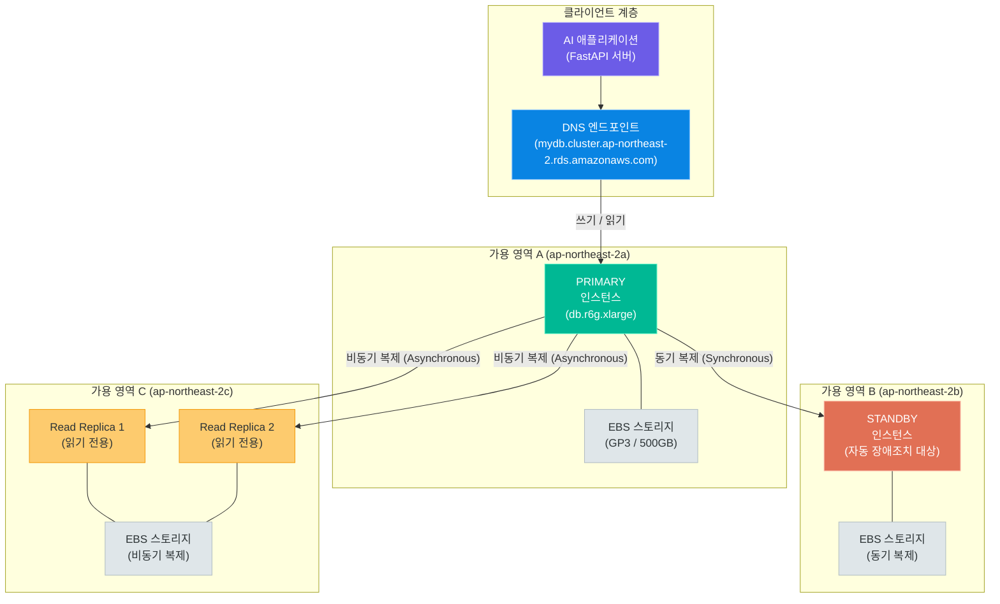
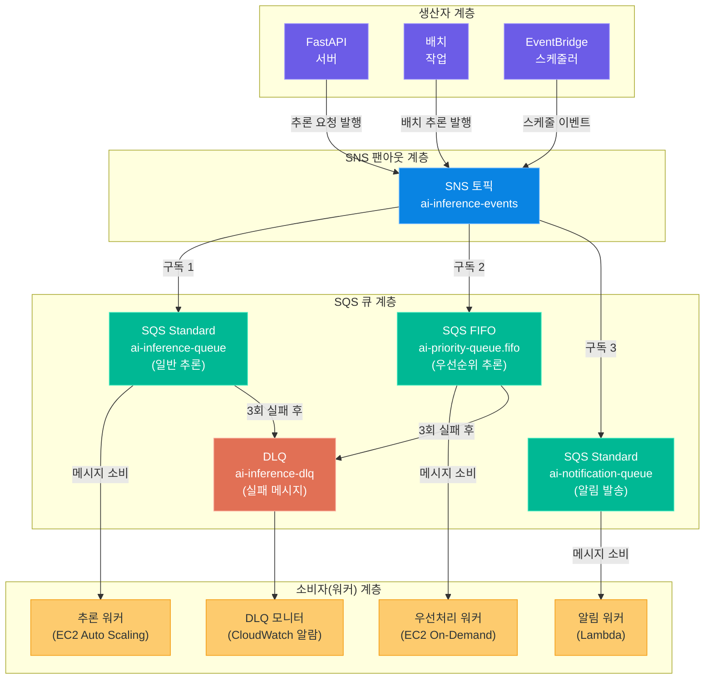
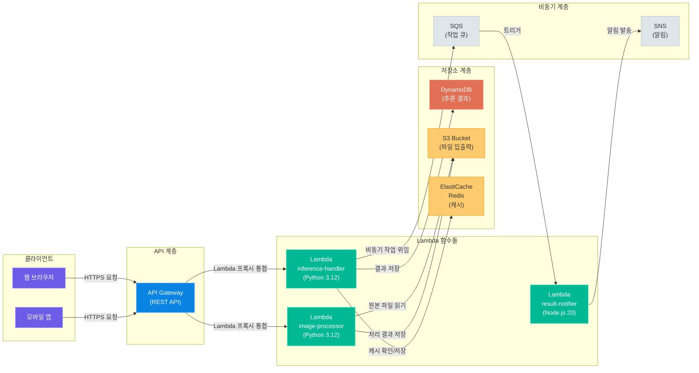
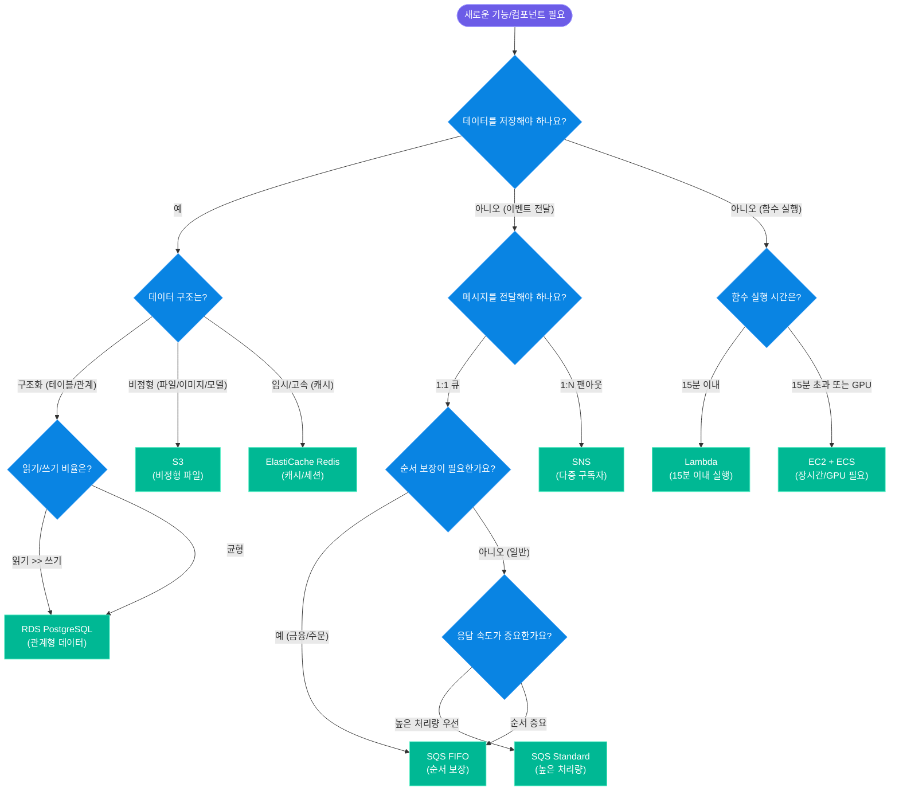

# AWS 관리형 서비스

> 데이터베이스 패치, 캐시 클러스터 구성, 메시지 브로커 운영 — 이 모든 인프라 관리 부담을 AWS에 위임하고, 개발자는 비즈니스 로직에 집중합니다. RDS, ElastiCache, SQS/SNS, Lambda, API Gateway까지 생성형 AI 서비스 아키텍처의 핵심 관리형 서비스를 완전 정복합니다

---

## 1. RDS — 관계형 데이터베이스 서비스

### 관리형 DB가 필요한 이유

EC2 인스턴스 위에 직접 MySQL을 설치하고 운영하면 어떤 일이 벌어질까요? 보안 패치, OS 업그레이드, 백업 스케줄링, 장애 복구, 스토리지 확장 — 이 모든 작업을 직접 처리해야 합니다. 야간에 디스크가 꽉 차거나 마스터 노드가 다운되면 개발자가 직접 대응해야 합니다.

**Amazon RDS(Relational Database Service)**는 이 운영 부담을 AWS가 대신 처리합니다. 개발자는 연결 문자열(Connection String)만 코드에 넣으면 되고, 나머지는 AWS 콘솔과 자동화가 처리합니다.

RDS가 자동으로 관리하는 항목:
- **자동 패치**: OS 및 DB 엔진 보안 패치를 점검 윈도우(Maintenance Window)에 자동 적용
- **자동 백업**: 매일 정해진 시간에 전체 스냅샷, 트랜잭션 로그는 5분 간격으로 지속 백업
- **모니터링**: CloudWatch와 통합된 CPU, IOPS, 연결 수, 복제 지연 메트릭
- **스토리지 자동 확장**: 임계치 도달 시 스토리지를 자동으로 확장(Auto Scaling)
- **Multi-AZ 장애조치**: 프라이머리 장애 시 스탠바이로 자동 전환

### 지원 데이터베이스 엔진

RDS는 6가지 데이터베이스 엔진을 지원합니다.

| 엔진 | 버전 | 라이선스 | 특징 | 추천 용도 |
|------|------|---------|------|---------|
| **MySQL** | 8.0, 5.7 | 오픈소스(GPL) | 가장 널리 사용, 높은 생태계 | 웹 애플리케이션, CMS |
| **PostgreSQL** | 16, 15, 14 | 오픈소스(PostgreSQL) | JSON, 배열, 지리정보 지원 | AI 메타데이터, 복잡한 쿼리 |
| **MariaDB** | 10.11, 10.6 | 오픈소스(GPL) | MySQL 포크, 성능 개선 | MySQL 마이그레이션 |
| **Oracle** | 19c, 21c | 상용 라이선스 | 엔터프라이즈 기능 완비 | 기업 레거시 시스템 |
| **SQL Server** | 2022, 2019 | 상용 라이선스 | Microsoft 생태계 통합 | .NET 기반 애플리케이션 |
| **Aurora** | MySQL/PG 호환 | AWS 전용 | 최대 5배 MySQL 성능 | 고성능 프로덕션 워크로드 |

> **핵심 포인트:** 생성형 AI 서비스에서는 **PostgreSQL**이 가장 많이 선택됩니다. pgvector 익스텐션으로 벡터 유사도 검색이 가능하고, JSONB 타입으로 모델 설정이나 추론 결과의 메타데이터를 유연하게 저장할 수 있습니다.

### Aurora — AWS 전용 고성능 엔진

Amazon Aurora는 AWS가 처음부터 클라우드 환경에 맞게 설계한 데이터베이스 엔진입니다. MySQL과 PostgreSQL과 호환되므로 기존 애플리케이션 코드를 수정하지 않고 마이그레이션할 수 있습니다.

Aurora의 주요 특징:
- **스토리지 자동 확장**: 10GB에서 시작해 128TB까지 자동 확장, 스토리지 용량을 미리 계획할 필요 없음
- **6중 복제**: 3개 가용 영역(AZ)에 걸쳐 6개 데이터 사본을 유지, 최대 2개 AZ 장애에도 데이터 무손실
- **빠른 장애조치**: Multi-AZ보다 장애조치 시간이 짧음(30초 이내 목표)
- **Aurora Serverless v2**: 사용량에 따라 컴퓨팅 용량을 자동 조절, ACU(Aurora Capacity Unit) 단위 과금

### Multi-AZ 배포 — 고가용성의 핵심

Multi-AZ는 RDS의 가장 중요한 고가용성 기능입니다. 프라이머리 DB 인스턴스와 동일한 데이터를 가진 스탠바이(Standby) 인스턴스를 다른 가용 영역에 유지합니다.



**장애조치(Failover) 동작 방식:**
1. RDS가 프라이머리 인스턴스 장애를 감지 (모니터링 주기 약 10~20초)
2. DNS 레코드를 스탠바이 인스턴스의 IP로 자동 변경 (TTL 60초 설정 권장)
3. 애플리케이션은 동일한 DNS 엔드포인트를 사용하므로 코드 변경 없음
4. 전체 장애조치 완료까지 보통 1~2분 소요

### Read Replica — 읽기 부하 분산

AI 서비스에서 추론 결과 조회, 사용자 히스토리 조회 같은 읽기 쿼리는 쓰기 쿼리보다 훨씬 많은 경우가 많습니다. Read Replica는 이 읽기 부하를 분산시킵니다.

Read Replica의 특징:
- 프라이머리에서 **비동기 복제**로 데이터를 받으므로 약간의 지연(Replication Lag) 발생 가능
- 읽기 전용 엔드포인트(Read Endpoint)를 별도로 제공
- 최대 5개의 Read Replica 생성 가능 (Aurora는 최대 15개)
- 리전 간 Read Replica도 지원 — 재해 복구(DR) 및 글로벌 서비스에 활용

```python
# 읽기/쓰기를 다른 DB 연결로 분리하는 패턴
import os
from sqlalchemy import create_engine
from sqlalchemy.orm import sessionmaker

# 쓰기 전용 엔드포인트 (프라이머리)
write_engine = create_engine(
    os.environ["RDS_WRITE_URL"],
    pool_size=10,
    max_overflow=20,
    pool_pre_ping=True,       # 연결 유효성 자동 확인
    pool_recycle=3600,        # 1시간마다 연결 갱신
)

# 읽기 전용 엔드포인트 (Read Replica)
read_engine = create_engine(
    os.environ["RDS_READ_URL"],
    pool_size=20,             # 읽기 연결은 더 많이 허용
    max_overflow=40,
    pool_pre_ping=True,
    pool_recycle=3600,
)

WriteSession = sessionmaker(bind=write_engine)
ReadSession = sessionmaker(bind=read_engine)

def save_inference_result(user_id: str, result: dict):
    """추론 결과 저장 — 쓰기 세션 사용"""
    with WriteSession() as session:
        record = InferenceLog(user_id=user_id, result=result)
        session.add(record)
        session.commit()

def get_user_history(user_id: str, limit: int = 20):
    """사용자 히스토리 조회 — 읽기 세션 사용"""
    with ReadSession() as session:
        return (
            session.query(InferenceLog)
            .filter(InferenceLog.user_id == user_id)
            .order_by(InferenceLog.created_at.desc())
            .limit(limit)
            .all()
        )
```

### 인스턴스 클래스 비교

| 클래스 계열 | CPU | 메모리 | 네트워크 | 적합한 용도 |
|------------|-----|-------|---------|-----------|
| **db.t4g** | 2~8 vCPU | 1~32 GB | 최대 5 Gbps | 개발/테스트 환경 (버스터블) |
| **db.m6g** | 2~64 vCPU | 8~256 GB | 최대 25 Gbps | 범용 프로덕션 워크로드 |
| **db.r6g** | 2~64 vCPU | 16~512 GB | 최대 25 Gbps | 메모리 집약적 쿼리 (AI 메타데이터) |
| **db.x2g** | 4~64 vCPU | 64~1024 GB | 최대 25 Gbps | 인메모리 분석, 대규모 캐시 |

> **핵심 포인트:** AI 서비스에서 추론 결과와 사용자 데이터를 저장하는 RDS는 **db.r6g** 계열을 권장합니다. 메모리가 크면 InnoDB Buffer Pool이 커져 디스크 I/O 없이 자주 조회하는 데이터를 메모리에서 바로 제공할 수 있습니다.

### 백업 및 스냅샷

RDS는 두 가지 백업 메커니즘을 제공합니다.

**자동 백업(Automated Backup):**
- 보존 기간(Retention Period): 0~35일 설정 가능 (0은 비활성화)
- 매일 백업 윈도우 시간에 전체 스냅샷 생성
- 트랜잭션 로그는 5분 간격으로 S3에 업로드
- Point-in-Time Recovery: 보존 기간 내 임의 시점으로 복구 가능

**수동 스냅샷(Manual Snapshot):**
- 원할 때 직접 생성하는 스냅샷
- 자동 백업과 달리 인스턴스 삭제 후에도 영구 보존
- 다른 리전이나 다른 AWS 계정으로 복사 가능
- AI 모델 업데이트 전 DB 스냅샷을 남기면 롤백 기준점으로 활용

### Parameter Group

Parameter Group은 DB 엔진의 동작을 제어하는 설정값 모음입니다. 예를 들어 MySQL의 `innodb_buffer_pool_size`, PostgreSQL의 `max_connections`, `shared_buffers` 같은 설정을 Parameter Group으로 관리합니다.

| 파라미터 | 엔진 | 기본값 | AI 서비스 권장값 | 설명 |
|---------|------|-------|--------------|------|
| `max_connections` | PostgreSQL | 100 | 200~500 | 동시 연결 수 제한 |
| `shared_buffers` | PostgreSQL | 128MB | 메모리의 25% | 공유 버퍼 캐시 크기 |
| `work_mem` | PostgreSQL | 4MB | 16~64MB | 정렬/해시 작업 메모리 |
| `innodb_buffer_pool_size` | MySQL | 128MB | 메모리의 70% | InnoDB 버퍼 풀 크기 |
| `slow_query_log` | MySQL | OFF | ON (1초 이상) | 느린 쿼리 로깅 |

### AI 서비스에서 RDS 활용

생성형 AI 서비스에서 RDS가 저장하는 데이터 유형:

```python
# AI 서비스를 위한 RDS 스키마 예시 (PostgreSQL + SQLAlchemy)
from sqlalchemy import Column, String, Integer, Float, DateTime, JSON
from sqlalchemy.dialects.postgresql import JSONB, UUID
from sqlalchemy.ext.declarative import declarative_base
import uuid

Base = declarative_base()

class InferenceLog(Base):
    """AI 추론 요청 및 결과 기록"""
    __tablename__ = "inference_logs"

    id = Column(UUID(as_uuid=True), primary_key=True, default=uuid.uuid4)
    user_id = Column(String(36), nullable=False, index=True)
    model_id = Column(String(100), nullable=False)          # 사용된 모델 ID
    prompt_tokens = Column(Integer)                          # 입력 토큰 수
    completion_tokens = Column(Integer)                     # 출력 토큰 수
    latency_ms = Column(Float)                              # 응답 지연 시간
    metadata = Column(JSONB, default={})                    # 추가 메타데이터
    created_at = Column(DateTime, server_default="now()")

class ModelRegistry(Base):
    """배포된 AI 모델 레지스트리"""
    __tablename__ = "model_registry"

    id = Column(String(50), primary_key=True)               # 예: "gpt-4o-mini-v1"
    model_type = Column(String(50))                         # 예: "llm", "embedding"
    endpoint_url = Column(String(500))
    config = Column(JSONB, default={})                      # 모델별 설정
    is_active = Column(Integer, default=1)
    created_at = Column(DateTime, server_default="now()")
```

---

## 2. ElastiCache — 인메모리 캐시 서비스

### 캐시가 필요한 이유

데이터베이스 쿼리는 디스크 I/O를 수반합니다. 복잡한 AI 추론 결과 조회, 사용자 프로필 읽기, 자주 사용하는 설정값 로드 — 이 요청들이 매번 RDS를 거치면 응답 속도가 느려지고 DB 부하가 증가합니다.

**ElastiCache**는 데이터를 메모리에 저장하는 완전 관리형 인메모리 캐시 서비스입니다. Redis와 Memcached 두 엔진을 지원하며, 메모리 기반이므로 마이크로초(μs) 단위의 응답 속도를 제공합니다.

### Redis vs Memcached 비교

| 비교 항목 | Redis | Memcached |
|----------|-------|-----------|
| **데이터 구조** | String, Hash, List, Set, Sorted Set, Bitmap, Stream | String (단순 Key-Value만) |
| **데이터 지속성** | RDB 스냅샷 + AOF 로그 (재시작 후에도 데이터 유지) | 없음 (재시작 시 모든 데이터 소멸) |
| **클러스터 모드** | 클러스터 모드 지원 (16,384개 슬롯, 수평 확장) | 다중 노드 지원 (단순 수평 확장) |
| **복제(Replication)** | 마스터-레플리카 복제, 자동 장애조치 | 미지원 |
| **Pub/Sub** | 지원 (메시지 브로드캐스트 가능) | 미지원 |
| **트랜잭션** | MULTI/EXEC로 원자적 명령 묶음 | 미지원 |
| **Lua 스크립트** | 지원 | 미지원 |
| **메모리 정책** | LRU, LFU, TTL 기반 다양한 정책 | LRU 기반 |
| **스레드 모델** | 단일 스레드 (6.0+는 I/O 멀티스레드) | 멀티스레드 |
| **적합한 용도** | 세션, 순위, 큐, 복잡한 캐시 | 단순 오브젝트 캐시, 멀티스레드 필요 시 |

> **핵심 포인트:** 생성형 AI 서비스에서는 **Redis**를 선택하는 것이 거의 항상 맞습니다. 추론 결과 캐싱, 세션 관리, 요청 제한(Rate Limiting), Sorted Set으로 구현하는 순위표까지 Redis의 풍부한 데이터 구조가 필요한 기능들입니다.

### 캐싱 전략

캐시를 어떻게 채우고 어떻게 갱신할지는 서비스 특성에 따라 다릅니다. 대표적인 세 가지 전략입니다.

**1. Cache-Aside (Lazy Loading) — 가장 일반적인 전략**

읽기 요청이 올 때만 캐시를 채웁니다. 캐시 미스(Cache Miss) 시 DB를 조회하고 결과를 캐시에 저장합니다.

```python
import redis
import json
import hashlib
from typing import Optional

redis_client = redis.Redis(
    host="your-cluster.cache.amazonaws.com",
    port=6379,
    ssl=True,
    decode_responses=True,
)

CACHE_TTL = 3600  # 1시간

def get_inference_result_cached(prompt: str, model_id: str) -> Optional[dict]:
    """Cache-Aside 패턴: 캐시 → DB 순서로 조회"""
    # 캐시 키 생성 (프롬프트 해시 + 모델 ID)
    cache_key = f"inference:{model_id}:{hashlib.sha256(prompt.encode()).hexdigest()[:16]}"

    # 1단계: 캐시 조회
    cached = redis_client.get(cache_key)
    if cached:
        return json.loads(cached)  # 캐시 히트

    # 2단계: 캐시 미스 → DB 또는 AI 모델 호출
    result = call_ai_model(prompt, model_id)  # 실제 추론 수행

    # 3단계: 결과를 캐시에 저장 (TTL 설정)
    redis_client.setex(cache_key, CACHE_TTL, json.dumps(result))

    return result

def invalidate_cache(model_id: str):
    """모델 업데이트 시 관련 캐시 전체 무효화"""
    pattern = f"inference:{model_id}:*"
    cursor = 0
    while True:
        cursor, keys = redis_client.scan(cursor, match=pattern, count=100)
        if keys:
            redis_client.delete(*keys)
        if cursor == 0:
            break
```

**2. Write-Through — 쓰기 시점에 캐시 동기화**

데이터를 DB에 쓸 때 캐시도 함께 갱신합니다. 항상 최신 데이터를 캐시에서 읽을 수 있지만, 쓰기 지연이 증가합니다.

```python
def save_user_profile(user_id: str, profile: dict):
    """Write-Through: DB 저장과 동시에 캐시 갱신"""
    cache_key = f"user:profile:{user_id}"

    # DB에 저장
    with WriteSession() as session:
        user = session.query(User).filter(User.id == user_id).first()
        for key, value in profile.items():
            setattr(user, key, value)
        session.commit()

    # 캐시도 즉시 갱신
    redis_client.setex(cache_key, CACHE_TTL, json.dumps(profile))
```

**3. Write-Behind (Write-Back) — 비동기 DB 저장**

캐시에 먼저 쓰고, 나중에 비동기적으로 DB에 반영합니다. 쓰기 성능이 극대화되지만 캐시 장애 시 데이터 손실 가능성이 있습니다. 로그성 데이터나 실시간 카운터에 적합합니다.

```python
import time

def increment_api_usage(user_id: str, tokens_used: int):
    """Write-Behind: Redis에 먼저 집계, 주기적으로 DB에 반영"""
    # Redis에 실시간 카운터 증가
    key = f"usage:{user_id}:{time.strftime('%Y%m%d')}"
    redis_client.incrby(key, tokens_used)
    redis_client.expire(key, 86400 * 2)  # 2일 TTL

    # 별도 배치 작업으로 일 1회 DB에 반영 (Celery 스케줄러 등 활용)
```

### 세션 스토어로 활용

JWT 기반 인증 시스템에서 토큰 블랙리스트나 리프레시 토큰 관리에 Redis를 활용합니다.

```python
def store_refresh_token(user_id: str, refresh_token: str, ttl: int = 2592000):
    """리프레시 토큰 저장 (30일 TTL)"""
    key = f"refresh_token:{user_id}"
    redis_client.setex(key, ttl, refresh_token)

def validate_and_rotate_token(user_id: str, token: str) -> Optional[str]:
    """토큰 검증 및 교체"""
    stored = redis_client.get(f"refresh_token:{user_id}")
    if stored != token:
        return None  # 토큰 불일치 또는 만료

    # 새 토큰 발급 후 갱신
    new_token = generate_refresh_token()
    store_refresh_token(user_id, new_token)
    return new_token

def blacklist_token(jti: str, exp_seconds: int):
    """로그아웃 시 JWT를 블랙리스트에 추가"""
    redis_client.setex(f"blacklist:{jti}", exp_seconds, "1")

def is_token_blacklisted(jti: str) -> bool:
    return redis_client.exists(f"blacklist:{jti}") == 1
```

### AI 추론 결과 캐싱 전략

동일한 프롬프트에 대한 반복 추론은 비용 낭비입니다. 시맨틱 캐싱(Semantic Caching)으로 비슷한 질문도 캐시 히트로 처리할 수 있습니다.

```python
import numpy as np
from sentence_transformers import SentenceTransformer

encoder = SentenceTransformer("all-MiniLM-L6-v2")

def semantic_cache_lookup(prompt: str, threshold: float = 0.95) -> Optional[str]:
    """의미 유사도 기반 캐시 조회"""
    # 현재 프롬프트의 임베딩 계산
    query_embedding = encoder.encode(prompt).tolist()

    # Redis에 저장된 최근 캐시 항목과 유사도 비교
    cached_keys = redis_client.keys("sem_cache:*")
    for key in cached_keys[:50]:  # 최대 50개 비교
        entry = json.loads(redis_client.get(key))
        similarity = np.dot(query_embedding, entry["embedding"]) / (
            np.linalg.norm(query_embedding) * np.linalg.norm(entry["embedding"])
        )
        if similarity >= threshold:
            return entry["response"]  # 유사한 캐시 항목 발견

    return None

def semantic_cache_store(prompt: str, response: str):
    """추론 결과와 임베딩을 함께 캐싱"""
    embedding = encoder.encode(prompt).tolist()
    key = f"sem_cache:{hashlib.sha256(prompt.encode()).hexdigest()[:20]}"
    redis_client.setex(
        key,
        3600,
        json.dumps({"embedding": embedding, "response": response}),
    )
```

---

## 3. SQS/SNS — 메시지 큐와 알림 서비스

### 비동기 처리가 필요한 이유

AI 추론은 시간이 걸립니다. GPT-4 수준의 LLM 호출은 수 초, 이미지 생성 모델은 수십 초가 소요될 수 있습니다. 이 작업을 HTTP 요청 내에서 동기적으로 처리하면 클라이언트는 그 시간 동안 응답을 기다려야 하고, 타임아웃 위험도 생깁니다.

**메시지 큐(Message Queue)**를 사용하면 요청을 즉시 큐에 넣고 "접수되었습니다"를 응답한 뒤, 워커가 비동기로 처리합니다. 클라이언트는 폴링(Polling)이나 웹소켓으로 결과를 나중에 받아갑니다.

### SQS — 표준 큐 vs FIFO 큐

Amazon SQS(Simple Queue Service)는 완전 관리형 메시지 큐 서비스입니다.

| 비교 항목 | Standard Queue | FIFO Queue |
|----------|---------------|-----------|
| **처리량** | 거의 무제한 (초당 수만 건) | 초당 최대 3,000건 (배치 사용 시 300건) |
| **순서 보장** | 최대한 유지하나 미보장 | 정확한 FIFO 순서 보장 |
| **중복 배달** | 가능 (최소 1회 전달) | 정확히 1회 전달 |
| **지연 큐** | 0~15분 지연 설정 | 지원 |
| **메시지 크기** | 최대 256KB | 최대 256KB |
| **보존 기간** | 최대 14일 | 최대 14일 |
| **적합한 용도** | AI 추론 배치, 이메일 발송 | 금융 거래, 주문 처리, 순서 중요한 작업 |

**SQS 주요 설정값:**

| 설정 | 설명 | AI 서비스 권장값 |
|------|------|--------------|
| **가시성 타임아웃 (Visibility Timeout)** | 메시지를 처리하는 동안 다른 소비자에게 숨기는 시간 | 추론 예상 시간의 2~3배 (예: 60~180초) |
| **메시지 보존 기간 (Retention Period)** | 처리되지 않은 메시지 보존 기간 | 4일 (기본값) |
| **지연 큐 (Delay Seconds)** | 메시지가 소비 가능해지기까지의 지연 | 재시도 패턴 구현 시 활용 |
| **데드 레터 큐 (DLQ)** | N회 처리 실패 메시지를 별도 큐로 이동 | 최대 3~5회 재시도 후 DLQ로 |

### SQS Python 코드 예시

```python
import boto3
import json
import time
from typing import Optional

sqs = boto3.client("sqs", region_name="ap-northeast-2")

INFERENCE_QUEUE_URL = "https://sqs.ap-northeast-2.amazonaws.com/123456789/ai-inference-queue"
DLQ_URL = "https://sqs.ap-northeast-2.amazonaws.com/123456789/ai-inference-dlq"

def enqueue_inference_request(
    request_id: str,
    user_id: str,
    prompt: str,
    model_id: str = "gpt-4o-mini",
) -> str:
    """추론 요청을 SQS 큐에 전송"""
    message_body = {
        "request_id": request_id,
        "user_id": user_id,
        "prompt": prompt,
        "model_id": model_id,
        "timestamp": time.time(),
    }

    response = sqs.send_message(
        QueueUrl=INFERENCE_QUEUE_URL,
        MessageBody=json.dumps(message_body),
        MessageAttributes={
            "ModelId": {
                "DataType": "String",
                "StringValue": model_id,
            },
            "Priority": {
                "DataType": "Number",
                "StringValue": "1",
            },
        },
    )

    return response["MessageId"]


def process_inference_queue(max_messages: int = 5):
    """SQS 큐에서 메시지를 꺼내 AI 추론 처리"""
    while True:
        response = sqs.receive_message(
            QueueUrl=INFERENCE_QUEUE_URL,
            MaxNumberOfMessages=max_messages,   # 1~10개 배치 처리
            WaitTimeSeconds=20,                 # Long Polling (빈 큐 시 최대 20초 대기)
            VisibilityTimeout=120,              # 처리 중 다른 워커에게 숨김
            MessageAttributeNames=["All"],
        )

        messages = response.get("Messages", [])
        if not messages:
            continue

        for msg in messages:
            body = json.loads(msg["Body"])
            receipt_handle = msg["ReceiptHandle"]

            try:
                # AI 추론 수행
                result = perform_inference(
                    prompt=body["prompt"],
                    model_id=body["model_id"],
                )

                # 결과를 DB와 캐시에 저장
                save_inference_result(body["request_id"], result)

                # 처리 완료 후 메시지 삭제
                sqs.delete_message(
                    QueueUrl=INFERENCE_QUEUE_URL,
                    ReceiptHandle=receipt_handle,
                )

            except Exception as e:
                # 처리 실패 시 가시성 타임아웃을 0으로 설정하여 즉시 재시도 가능하게
                print(f"처리 실패: {e}. 메시지를 큐에 반환합니다.")
                sqs.change_message_visibility(
                    QueueUrl=INFERENCE_QUEUE_URL,
                    ReceiptHandle=receipt_handle,
                    VisibilityTimeout=0,
                )
```

### SNS — 토픽 기반 발행/구독

Amazon SNS(Simple Notification Service)는 발행/구독(Pub/Sub) 메시지 서비스입니다. 하나의 메시지를 여러 구독자(Subscriber)에게 동시에 전달하는 **팬아웃(Fan-out)** 패턴에 최적화되어 있습니다.

SNS 구독 가능한 대상(Endpoint):
- **SQS**: 다른 큐로 메시지 팬아웃 (가장 일반적)
- **Lambda**: 함수 직접 트리거
- **HTTP/HTTPS**: 외부 웹훅 호출
- **Email**: 알림 이메일 발송
- **SMS**: 문자 메시지 발송
- **Mobile Push**: iOS/Android 푸시 알림

### SQS/SNS 이벤트 드리븐 아키텍처



### AI 비동기 추론 큐 설계 — FastAPI + SQS + Worker

```python
# main.py — FastAPI 엔드포인트
from fastapi import FastAPI, BackgroundTasks
from pydantic import BaseModel
import uuid

app = FastAPI()

class InferenceRequest(BaseModel):
    prompt: str
    model_id: str = "gpt-4o-mini"
    user_id: str

class InferenceResponse(BaseModel):
    request_id: str
    status: str
    message: str

@app.post("/inference/async", response_model=InferenceResponse)
async def submit_inference(request: InferenceRequest):
    """비동기 추론 요청 접수 — 즉시 202 Accepted 반환"""
    request_id = str(uuid.uuid4())

    # SQS에 메시지 전송 (비동기 처리 위임)
    message_id = enqueue_inference_request(
        request_id=request_id,
        user_id=request.user_id,
        prompt=request.prompt,
        model_id=request.model_id,
    )

    # Redis에 처리 상태 초기화
    redis_client.setex(
        f"inference:status:{request_id}",
        3600,
        json.dumps({"status": "queued", "message_id": message_id}),
    )

    return InferenceResponse(
        request_id=request_id,
        status="queued",
        message="추론 요청이 접수되었습니다. request_id로 결과를 조회하세요.",
    )

@app.get("/inference/{request_id}/status")
async def get_inference_status(request_id: str):
    """추론 결과 폴링 엔드포인트"""
    status_data = redis_client.get(f"inference:status:{request_id}")
    if not status_data:
        return {"status": "not_found"}
    return json.loads(status_data)
```

---

## 4. Lambda — 서버리스 함수 서비스

### 서버리스 컴퓨팅 개념

**서버리스(Serverless)**는 서버가 없다는 의미가 아닙니다. 서버는 존재하지만 개발자가 서버를 직접 관리하지 않는다는 의미입니다. AWS Lambda는 코드만 업로드하면 AWS가 실행 환경을 자동으로 구성하고, 요청이 들어올 때만 함수를 실행하며, 실행 시간(ms 단위)과 메모리 사용량에 따라 과금합니다.

Lambda의 핵심 특징:
- **이벤트 기반 실행**: 트리거 이벤트가 있을 때만 함수 실행
- **자동 스케일링**: 동시 요청이 1개든 10,000개든 자동으로 병렬 실행
- **무상태(Stateless)**: 함수 실행 간 상태를 보존하지 않음 (상태는 외부 저장소 사용)
- **과금 단위**: 실행 횟수 + 실행 시간(ms) × 메모리(GB), 요청 100만 건까지 무료

### 지원 런타임

| 런타임 | 버전 | AI/ML 라이브러리 지원 | 추천 용도 |
|-------|------|------------------|---------|
| **Python** | 3.12, 3.11, 3.10 | boto3, OpenAI SDK, LangChain 등 모두 가능 | AI 추론 함수, 데이터 처리 |
| **Node.js** | 20.x, 18.x | AWS SDK, LangChain.js | 웹훅 처리, 경량 API |
| **Java** | 21, 17, 11 | AWS SDK for Java | 기업 애플리케이션 |
| **Go** | 1.x | 낮은 콜드스타트 시간 | 고성능 경량 함수 |
| **Ruby** | 3.2 | 제한적 | 레거시 애플리케이션 |
| **Container Image** | 최대 10GB | 모든 라이브러리 가능 | 대규모 ML 모델, 커스텀 환경 |

### 트리거 종류

Lambda는 다양한 AWS 서비스에서 트리거될 수 있습니다.

| 트리거 | 호출 방식 | 주요 사용 사례 |
|-------|---------|-------------|
| **API Gateway** | 동기 (요청-응답) | REST API, HTTP API 백엔드 |
| **S3** | 비동기 | 파일 업로드 처리, 이미지 리사이징 |
| **SQS** | 배치 폴링 | 메시지 큐 소비, 비동기 처리 |
| **SNS** | 비동기 | 알림 처리, 팬아웃 수신 |
| **EventBridge** | 비동기 | 스케줄 작업, 이벤트 라우팅 |
| **DynamoDB Streams** | 배치 폴링 | 데이터 변경 반응 |
| **Kinesis** | 배치 폴링 | 실시간 스트림 처리 |

### Lambda 서버리스 아키텍처 흐름



### Lambda 함수 핸들러 작성

```python
# lambda_function.py — AI 추론 Lambda 핸들러
import json
import os
import boto3
import redis
import hashlib
from openai import OpenAI

# Lambda 초기화 단계 (콜드스타트 시 1회 실행)
openai_client = OpenAI(api_key=os.environ["OPENAI_API_KEY"])
redis_client = redis.Redis(
    host=os.environ["REDIS_HOST"],
    port=6379,
    ssl=True,
    decode_responses=True,
)

def lambda_handler(event: dict, context) -> dict:
    """
    API Gateway Lambda 프록시 통합 핸들러
    event: API Gateway가 전달하는 HTTP 요청 정보
    context: Lambda 실행 컨텍스트 (남은 시간, 함수명 등)
    """
    try:
        # 요청 본문 파싱
        body = json.loads(event.get("body", "{}"))
        prompt = body.get("prompt", "")
        model_id = body.get("model_id", "gpt-4o-mini")

        if not prompt:
            return _response(400, {"error": "prompt 필드가 필요합니다"})

        # 캐시 확인
        cache_key = f"lambda:inference:{hashlib.sha256(prompt.encode()).hexdigest()[:16]}"
        cached = redis_client.get(cache_key)
        if cached:
            result = json.loads(cached)
            result["cache_hit"] = True
            return _response(200, result)

        # AI 추론 실행
        response = openai_client.chat.completions.create(
            model=model_id,
            messages=[{"role": "user", "content": prompt}],
            max_tokens=1000,
        )

        result = {
            "response": response.choices[0].message.content,
            "model": response.model,
            "usage": {
                "prompt_tokens": response.usage.prompt_tokens,
                "completion_tokens": response.usage.completion_tokens,
            },
            "cache_hit": False,
        }

        # 결과 캐싱 (1시간)
        redis_client.setex(cache_key, 3600, json.dumps(result))

        return _response(200, result)

    except Exception as e:
        print(f"오류 발생: {str(e)}")  # CloudWatch Logs에 기록
        return _response(500, {"error": "내부 서버 오류가 발생했습니다"})


def _response(status_code: int, body: dict) -> dict:
    """API Gateway 응답 포맷 생성 헬퍼"""
    return {
        "statusCode": status_code,
        "headers": {
            "Content-Type": "application/json",
            "Access-Control-Allow-Origin": "*",
        },
        "body": json.dumps(body, ensure_ascii=False),
    }
```

### SQS 트리거 Lambda 핸들러

```python
def sqs_handler(event: dict, context) -> dict:
    """SQS에서 배치로 메시지를 받아 처리하는 핸들러"""
    batch_item_failures = []

    for record in event["Records"]:
        message_id = record["messageId"]
        body = json.loads(record["body"])

        try:
            result = perform_inference(
                prompt=body["prompt"],
                model_id=body["model_id"],
            )
            save_inference_result(body["request_id"], result)

            # Redis에 완료 상태 업데이트
            redis_client.setex(
                f"inference:status:{body['request_id']}",
                3600,
                json.dumps({"status": "completed", "result": result}),
            )

        except Exception as e:
            print(f"메시지 {message_id} 처리 실패: {e}")
            # 실패한 메시지 ID를 반환하면 해당 메시지만 재처리됨 (Partial Batch Response)
            batch_item_failures.append({"itemIdentifier": message_id})

    return {"batchItemFailures": batch_item_failures}
```

### 콜드스타트 — 원인과 완화 방법

**콜드스타트(Cold Start)**는 Lambda 함수가 새로운 컨테이너를 초기화하는 과정에서 발생하는 지연 시간입니다.

콜드스타트 발생 상황:
- 처음 함수를 호출할 때
- 이전 실행 후 일정 시간(약 5~15분) 동안 유휴 상태였을 때
- 동시 실행 인스턴스가 최대치를 초과할 때

콜드스타트 지연 시간 원인:
1. **컨테이너 초기화**: 실행 환경(런타임, 파일시스템) 구성
2. **코드 로딩**: 배포 패키지 다운로드 및 압축 해제
3. **초기화 코드 실행**: 핸들러 외부의 전역 코드 실행 (DB 연결, 모델 로드 등)

| 완화 방법 | 효과 | 비용 |
|---------|------|------|
| **Provisioned Concurrency** | 지정 수만큼 인스턴스를 항상 웜(Warm) 상태로 유지 | 유지 비용 발생 (시간 단위 과금) |
| **패키지 크기 최소화** | 불필요한 의존성 제거 → 로딩 시간 단축 | 없음 |
| **초기화 코드 최적화** | 핸들러 외부 코드 최소화, 지연 로딩 패턴 | 없음 |
| **메모리 증가** | CPU 할당량도 비례 증가 → 초기화 빠름 | 실행 비용 소폭 증가 |
| **ARM(Graviton) 런타임** | x86 대비 콜드스타트 약 10% 감소 | 동일 또는 저렴 |

### 동시성(Concurrency) 설정

| 동시성 유형 | 설명 | 사용 시점 |
|-----------|------|---------|
| **계정 기본 동시성** | 리전당 기본 1,000개 (증가 요청 가능) | 기본 제한 |
| **Reserved Concurrency** | 특정 함수에 동시성 예약 (다른 함수가 가져갈 수 없음) | 중요 함수 보호 또는 제한 |
| **Provisioned Concurrency** | 지정 수만큼 항상 워밍업된 인스턴스 유지 | 콜드스타트 민감한 함수 |

### AI 추론에서 Container Image 방식

경량 모델(transformers, sentence-transformers 등)을 Lambda에서 직접 실행할 때는 기본 배포 패키지(250MB 제한)를 초과하므로 컨테이너 이미지(최대 10GB)를 사용합니다.

```dockerfile
# Dockerfile — Lambda용 ML 컨테이너
FROM public.ecr.aws/lambda/python:3.12

# ML 의존성 설치
RUN pip install --no-cache-dir \
    torch==2.3.0+cpu \
    transformers==4.41.0 \
    sentence-transformers==3.0.0 \
    openai==1.30.0 \
    redis==5.0.4 \
    --extra-index-url https://download.pytorch.org/whl/cpu

# 모델을 이미지에 포함 (콜드스타트 최소화)
RUN python -c "from sentence_transformers import SentenceTransformer; SentenceTransformer('all-MiniLM-L6-v2')"

# 함수 코드 복사
COPY lambda_function.py ${LAMBDA_TASK_ROOT}

CMD ["lambda_function.lambda_handler"]
```

---

## 5. API Gateway — API 관리 서비스

### API Gateway의 역할

**Amazon API Gateway**는 API의 "정문" 역할을 합니다. 클라이언트의 HTTP 요청을 받아 Lambda, EC2, ECS, 외부 HTTP 서비스 등 다양한 백엔드로 라우팅하며, 인증, 스로틀링, 모니터링, 버전 관리를 통합 제공합니다.

### REST API vs HTTP API

API Gateway에는 두 가지 API 타입이 있습니다.

| 비교 항목 | REST API | HTTP API |
|----------|---------|---------|
| **비용** | HTTP API보다 약 3.5배 비쌈 | 더 저렴 (요청 100만 건당 약 $1.00) |
| **지연 시간** | 상대적으로 높음 | 더 낮음 (약 60% 감소) |
| **인증** | Cognito, Lambda Authorizer, IAM, API Key | Cognito, Lambda Authorizer, JWT |
| **사용량 플랜** | 지원 (throttling, quota) | 미지원 |
| **요청 변환** | 지원 (Mapping Template) | 미지원 |
| **캐시** | 지원 (응답 캐싱) | 미지원 |
| **WAF 통합** | 지원 | 미지원 |
| **WebSocket** | 지원 | 미지원 |
| **적합한 용도** | 복잡한 API 관리, 외부 공개 API | 단순 Lambda 연동, 내부 마이크로서비스 |

> **핵심 포인트:** AI 서비스 초기에는 **HTTP API**로 빠르게 구축하고, 사용량 증가나 세밀한 접근 제어가 필요해지면 **REST API**로 마이그레이션하는 전략이 실용적입니다.

### Lambda 프록시 통합

Lambda 프록시 통합을 활성화하면 API Gateway가 HTTP 요청 정보 전체를 Lambda의 `event` 객체로 전달합니다. Lambda 함수가 `statusCode`, `headers`, `body`를 포함한 응답 객체를 반환하면 API Gateway가 이를 그대로 HTTP 응답으로 변환합니다.

```json
// API Gateway가 Lambda에 전달하는 event 구조 예시
{
  "httpMethod": "POST",
  "path": "/inference",
  "headers": {
    "Authorization": "Bearer eyJhbGci...",
    "Content-Type": "application/json"
  },
  "queryStringParameters": {
    "version": "v1"
  },
  "body": "{\"prompt\": \"안녕하세요\", \"model_id\": \"gpt-4o-mini\"}",
  "requestContext": {
    "authorizer": {
      "claims": {
        "sub": "user-123",
        "email": "user@example.com"
      }
    }
  }
}
```

### 인증 방식

| 인증 방식 | 동작 방식 | 적합한 시나리오 |
|---------|---------|-------------|
| **Cognito User Pool** | JWT 토큰을 Cognito User Pool로 검증 | 일반 사용자 인증, 소셜 로그인 연동 |
| **Lambda Authorizer** | 커스텀 Lambda 함수로 토큰 검증 | 외부 IdP, 커스텀 인증 로직 |
| **IAM Authorization** | AWS 서명(SigV4)으로 인증 | AWS 서비스 간 내부 호출 |
| **API Key** | API 키를 헤더로 전달 | B2B API, 파트너 연동 |

```python
# Lambda Authorizer 예시 (토큰 기반)
import json
import os
import jwt  # PyJWT 라이브러리

SECRET_KEY = os.environ["JWT_SECRET"]

def authorizer_handler(event: dict, context) -> dict:
    """
    API Gateway Lambda Authorizer
    token이 유효하면 Allow 정책, 아니면 Deny 정책 반환
    """
    token = event.get("authorizationToken", "").replace("Bearer ", "")
    method_arn = event["methodArn"]

    try:
        payload = jwt.decode(token, SECRET_KEY, algorithms=["HS256"])
        user_id = payload["sub"]
        effect = "Allow"
    except jwt.ExpiredSignatureError:
        effect = "Deny"
        user_id = "unknown"
    except jwt.InvalidTokenError:
        effect = "Deny"
        user_id = "unknown"

    return {
        "principalId": user_id,
        "policyDocument": {
            "Version": "2012-10-17",
            "Statement": [
                {
                    "Action": "execute-api:Invoke",
                    "Effect": effect,
                    "Resource": method_arn,
                }
            ],
        },
        "context": {"userId": user_id},  # Lambda event.requestContext.authorizer.userId로 접근
    }
```

### 사용량 플랜 (Usage Plan)

REST API에서는 API Key와 결합하여 사용량 플랜을 설정합니다.

| 설정 | 설명 | 예시 |
|------|------|------|
| **Throttling Rate** | 초당 최대 요청 수 | 100 req/s |
| **Throttling Burst** | 순간 최대 동시 요청 수 | 500 req |
| **Quota** | 일/주/월 단위 최대 요청 수 | 100,000 req/month |

### 스테이지 관리

```yaml
# serverless.yml (Serverless Framework 예시)
provider:
  name: aws
  runtime: python3.12
  region: ap-northeast-2
  stage: ${opt:stage, 'dev'}  # 배포 시 --stage 옵션으로 지정

functions:
  inference:
    handler: lambda_function.lambda_handler
    environment:
      STAGE: ${self:provider.stage}
      REDIS_HOST: ${ssm:/ai-service/${self:provider.stage}/redis-host}
    events:
      - http:
          path: /inference
          method: post
          cors: true

# dev, staging, prod 스테이지별 독립 배포:
# serverless deploy --stage dev
# serverless deploy --stage staging
# serverless deploy --stage prod
```

### CORS 설정

브라우저 기반 AI 서비스에서 CORS는 필수입니다.

```python
def lambda_handler(event: dict, context) -> dict:
    # OPTIONS 메서드 처리 (프리플라이트 요청)
    if event["httpMethod"] == "OPTIONS":
        return {
            "statusCode": 200,
            "headers": {
                "Access-Control-Allow-Origin": "https://myapp.com",
                "Access-Control-Allow-Methods": "POST, GET, OPTIONS",
                "Access-Control-Allow-Headers": "Content-Type, Authorization",
                "Access-Control-Max-Age": "86400",
            },
            "body": "",
        }

    # 실제 요청 처리
    result = process_request(event)

    return {
        "statusCode": 200,
        "headers": {
            "Content-Type": "application/json",
            "Access-Control-Allow-Origin": "https://myapp.com",
        },
        "body": json.dumps(result, ensure_ascii=False),
    }
```

---

## 6. 관리형 서비스 선택 가이드

### EC2 직접 운영 vs 관리형 서비스 비교

| 비교 항목 | EC2 직접 운영 | 관리형 서비스 |
|----------|------------|------------|
| **운영 부담** | 높음 (패치, 모니터링, 백업 직접 관리) | 낮음 (AWS가 대부분 자동 처리) |
| **초기 설정 비용** | 높음 (인프라 구성, 설정 스크립트 작성) | 낮음 (콘솔 또는 Terraform으로 빠른 구성) |
| **비용 최적화** | 예약 인스턴스, 스팟으로 절감 가능 | 서비스별 요금 구조 (트래픽 적으면 비쌀 수 있음) |
| **유연성** | 높음 (모든 설정 직접 제어) | 낮음 (지원되는 기능 범위 내에서만 설정) |
| **확장성** | 수동 또는 Auto Scaling 직접 구성 | 대부분 자동 확장 내장 |
| **가용성** | 직접 Multi-AZ 설계 필요 | Multi-AZ 옵션 클릭 한 번으로 활성화 |
| **보안 패치** | 직접 적용 (취약점 공지 모니터링 필요) | 자동 적용 (점검 윈도우 내) |
| **적합한 상황** | 레거시 DB 마이그레이션, 특수 설정 필요 시 | 표준 워크로드, 빠른 출시가 중요할 때 |

### 서비스별 적합한 시나리오

| 시나리오 | 추천 서비스 | 이유 |
|---------|-----------|------|
| AI 모델 추론 결과 저장 (구조화 데이터) | RDS PostgreSQL | JSONB 지원, 복잡한 쿼리, pgvector 확장 |
| 추론 결과 캐싱, 세션 관리 | ElastiCache Redis | 마이크로초 응답, 다양한 데이터 구조 |
| 대용량 파일 (모델 가중치, 학습 데이터) | S3 | 무제한 용량, 고내구성 |
| 비동기 AI 추론 작업 큐 | SQS Standard | 높은 처리량, DLQ로 실패 관리 |
| 다중 소비자 이벤트 알림 | SNS + SQS | 팬아웃 패턴, 독립적 처리 |
| 경량 API 백엔드, 웹훅 처리 | Lambda + API Gateway | 서버리스, 트래픽 기반 자동 확장 |
| 상시 실행 AI 서비스 (GPU 필요) | EC2 + ECS | Lambda 메모리/시간 제한 초과, GPU 필요 |
| 실시간 스트림 처리 | Kinesis + Lambda | 실시간 데이터 파이프라인 |

> **핵심 포인트:** "관리형 서비스가 항상 옳다"는 생각은 위험합니다. 트래픽이 일정하게 높다면 EC2에 직접 설치한 Redis가 ElastiCache보다 저렴할 수 있습니다. 서비스 규모, 팀 역량, 운영 비용을 함께 고려해야 합니다.

### 관리형 서비스 선택 플로우차트



### AI 서비스 통합 아키텍처

생성형 AI 서비스에서 관리형 서비스들이 어떻게 조합되는지 실제 아키텍처 예시입니다.

```
사용자 요청 흐름:
브라우저 → API Gateway → Lambda (인증 확인, ElastiCache 캐시 조회)
          ↓ 캐시 미스 시
          → SQS (추론 작업 큐잉) → Worker EC2/Lambda (AI 추론)
          → RDS (결과 저장) + ElastiCache (결과 캐싱)
          → SNS → 사용자 알림 (이메일/푸시)
```

```python
# 통합 아키텍처 — AI 서비스 요청 처리 Lambda
import boto3
import redis
import json
import os
import hashlib
import uuid

sqs_client = boto3.client("sqs")
redis_client = redis.Redis(host=os.environ["REDIS_HOST"], port=6379, ssl=True, decode_responses=True)

INFERENCE_QUEUE = os.environ["INFERENCE_QUEUE_URL"]
CACHE_TTL = 3600

def lambda_handler(event: dict, context) -> dict:
    body = json.loads(event.get("body", "{}"))
    prompt = body["prompt"]
    user_id = event["requestContext"]["authorizer"]["userId"]

    # 1. ElastiCache에서 캐시 조회
    cache_key = f"result:{hashlib.sha256(prompt.encode()).hexdigest()[:20]}"
    cached = redis_client.get(cache_key)
    if cached:
        return _ok(json.loads(cached))

    # 2. SQS로 비동기 추론 위임
    request_id = str(uuid.uuid4())
    sqs_client.send_message(
        QueueUrl=INFERENCE_QUEUE,
        MessageBody=json.dumps({
            "request_id": request_id,
            "user_id": user_id,
            "prompt": prompt,
            "cache_key": cache_key,
        }),
    )

    # 3. 처리 중 상태를 Redis에 기록
    redis_client.setex(
        f"status:{request_id}", 300,
        json.dumps({"status": "processing"}),
    )

    return _ok({"request_id": request_id, "status": "processing"}, status_code=202)

def _ok(body: dict, status_code: int = 200) -> dict:
    return {
        "statusCode": status_code,
        "headers": {"Content-Type": "application/json", "Access-Control-Allow-Origin": "*"},
        "body": json.dumps(body, ensure_ascii=False),
    }
```

---

## 7. 핵심 정리

### 서비스별 핵심 요약

| 서비스 | 카테고리 | 핵심 특징 | AI 서비스 활용 |
|-------|---------|---------|-------------|
| **RDS** | 관계형 DB | Multi-AZ 고가용성, 자동 백업, Read Replica | 사용자 데이터, 추론 로그, 모델 레지스트리 |
| **Aurora** | 관계형 DB | 최대 5배 MySQL 성능, 6중 복제, Serverless v2 | 고성능 프로덕션 DB |
| **ElastiCache Redis** | 인메모리 캐시 | 마이크로초 응답, 풍부한 데이터 구조, Pub/Sub | 추론 결과 캐싱, 세션, Rate Limiting |
| **SQS Standard** | 메시지 큐 | 거의 무제한 처리량, DLQ 지원 | 비동기 AI 추론 큐 |
| **SQS FIFO** | 메시지 큐 | 순서 보장, 정확히 1회 전달 | 순서 중요한 작업 처리 |
| **SNS** | 알림 | 1:N 팬아웃, 다양한 구독 엔드포인트 | 추론 완료 알림, 이벤트 브로드캐스팅 |
| **Lambda** | 서버리스 | 이벤트 기반, 자동 스케일링, ms 과금 | 경량 추론, 웹훅, 데이터 변환 |
| **API Gateway** | API 관리 | 인증, 스로틀링, 스테이지 관리 | AI API 엔드포인트 관리 |

### 서비스 선택 체크리스트

**RDS 선택 전 확인:**
- [ ] 관계형 데이터 모델이 필요한가? (테이블, 조인, 트랜잭션)
- [ ] Multi-AZ 고가용성이 필요한가?
- [ ] 자동 백업 및 Point-in-Time Recovery가 필요한가?
- [ ] Read Replica로 읽기 부하를 분산할 계획인가?

**ElastiCache Redis 선택 전 확인:**
- [ ] 응답 속도를 밀리초 이하로 줄여야 하는가?
- [ ] 세션, 캐시, Rate Limiter 기능이 필요한가?
- [ ] 동일한 요청에 대한 반복 DB 쿼리를 줄여야 하는가?

**SQS/SNS 선택 전 확인:**
- [ ] AI 추론처럼 처리 시간이 긴 작업을 비동기로 처리해야 하는가?
- [ ] 생산자와 소비자의 처리 속도가 다른가? (디커플링 필요)
- [ ] 한 이벤트를 여러 소비자에게 동시에 전달해야 하는가? (SNS 팬아웃)
- [ ] 처리 실패 메시지를 안전하게 보관할 DLQ가 필요한가?

**Lambda 선택 전 확인:**
- [ ] 실행 시간이 15분 이내인가?
- [ ] GPU가 필요하지 않은가?
- [ ] 트래픽이 불규칙하거나 간헐적인가? (서버리스 비용 효율 높음)
- [ ] 이벤트 기반으로 자동 트리거가 필요한가?

**API Gateway 선택 전 확인:**
- [ ] Lambda 또는 HTTP 백엔드를 외부에 노출해야 하는가?
- [ ] API 키 기반 사용량 제한이 필요한가? (REST API)
- [ ] Cognito 또는 커스텀 인증이 필요한가?
- [ ] 스테이지별(dev/staging/prod) 독립 배포가 필요한가?

### 비용 최적화 팁

| 서비스 | 비용 절감 방법 |
|-------|------------|
| **RDS** | Reserved Instance 1년/3년 약정 (최대 72% 절감), 비업무 시간 인스턴스 중지 |
| **ElastiCache** | Reserved Node 약정, 클러스터 노드 크기 최적화 (메모리 사용률 모니터링) |
| **SQS** | 첫 100만 건 무료, Long Polling으로 빈 큐 폴링 횟수 감소 |
| **Lambda** | ARM(Graviton2) 런타임 선택 (최대 20% 비용 절감), 메모리 최적화 |
| **API Gateway** | HTTP API 선택 (REST API 대비 약 70% 저렴), 응답 캐싱 활성화 |

---

### 다음 단계

이번 모듈에서 RDS, ElastiCache, SQS/SNS, Lambda, API Gateway까지 AWS 핵심 관리형 서비스를 학습했습니다. 이제 이 서비스들을 실제 프로덕션 환경에 어떻게 배포하고 운영할지 알아볼 차례입니다.

다음 파일 **[08_deployment_architecture.md](08_deployment_architecture.md)**에서는 다음 내용을 다룹니다:

- **배포 아키텍처 패턴**: Blue/Green 배포, Canary 배포, Rolling 업데이트
- **CI/CD 파이프라인**: CodePipeline, CodeBuild, GitHub Actions와 AWS 통합
- **Infrastructure as Code**: Terraform으로 이번 모듈에서 학습한 관리형 서비스 자동 프로비저닝
- **모니터링과 알람**: CloudWatch 대시보드, 메트릭 기반 Auto Scaling
- **AI 서비스 프로덕션 체크리스트**: 실제 운영 전 반드시 확인해야 할 항목들

---
