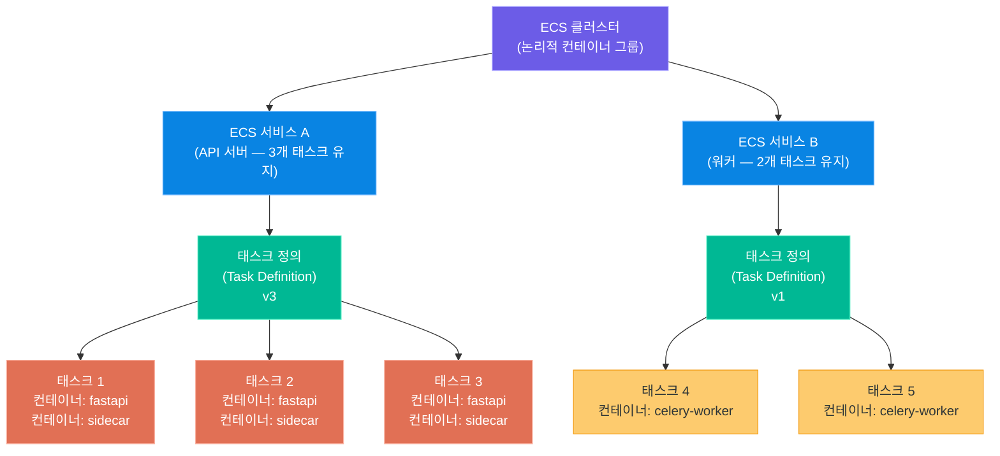
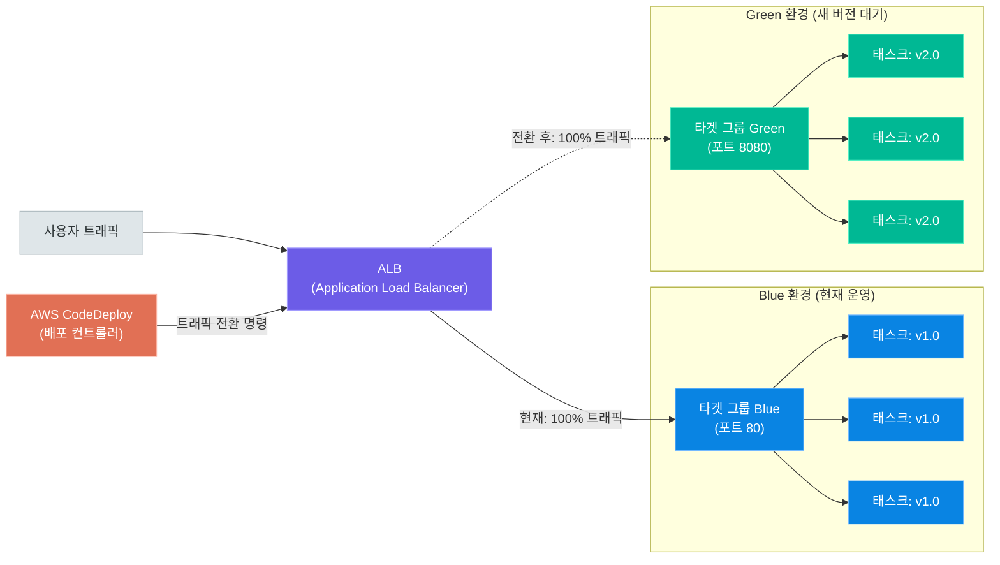
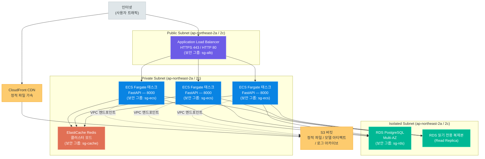
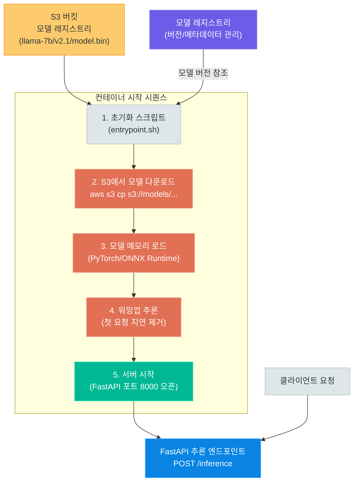

# 배포 아키텍처

> 컨테이너를 클라우드에서 안정적으로 운영하려면 오케스트레이션 플랫폼과 배포 전략이 필요합니다. Amazon ECS와 Fargate를 기반으로 Rolling Update·Blue-Green·Canary 배포 전략, 3-tier 프로덕션 아키텍처, AI 서비스 GPU 배포, 그리고 인프라를 코드로 관리하는 IaC까지 — 실제 서비스를 운영하기 위한 배포 아키텍처 전반을 다룹니다

---

## 1. ECS 기초

### 컨테이너 오케스트레이션의 필요성

단일 서버에서 Docker 컨테이너를 직접 실행하는 것은 개발 환경에서는 충분하지만, 프로덕션 환경에서는 여러 가지 문제가 발생합니다.

- **서버 장애 대응**: 컨테이너가 죽으면 자동으로 재시작해야 합니다
- **트래픽 폭증 대응**: 부하에 따라 컨테이너 수를 동적으로 조절해야 합니다
- **무중단 배포**: 새 버전 배포 시 서비스 중단 없이 교체해야 합니다
- **다중 서버 관리**: 수십 대의 서버에 걸쳐 컨테이너를 균등하게 분산해야 합니다
- **헬스 체크**: 비정상 컨테이너를 감지하고 정상 컨테이너로 교체해야 합니다

**컨테이너 오케스트레이션(Container Orchestration)**은 이런 작업을 자동화하는 시스템입니다. AWS에서는 **Amazon ECS(Elastic Container Service)**가 이 역할을 담당합니다.

### ECS 구성요소



ECS는 네 가지 핵심 개념으로 구성됩니다.

| 구성요소 | 역할 | 비유 |
|---|---|---|
| **클러스터(Cluster)** | 컨테이너가 실행되는 논리적 그룹 (EC2 인스턴스 또는 Fargate 용량 포함) | 공장 부지 |
| **서비스(Service)** | 지정한 수의 태스크를 항상 유지·관리하는 컨트롤러 (로드밸런서 연결, 오토스케일링 담당) | 공장 라인 관리자 |
| **태스크 정의(Task Definition)** | 컨테이너 이미지·CPU·메모리·환경변수·볼륨 등을 기술한 JSON 설계도 (버전 관리됨) | 제품 설계도 |
| **태스크(Task)** | 태스크 정의를 기반으로 실제 실행 중인 컨테이너 인스턴스 | 생산된 제품 |

### EC2 시작 유형 vs Fargate 시작 유형

ECS는 두 가지 시작 유형(Launch Type)을 지원합니다. 어떤 유형을 선택하느냐에 따라 관리 범위와 비용 구조가 크게 달라집니다.

| 항목 | EC2 Launch Type | Fargate Launch Type |
|---|---|---|
| **서버 관리** | EC2 인스턴스 직접 프로비저닝·패치·관리 필요 | AWS가 인프라 완전 관리 (서버리스) |
| **관리 부담** | 높음 — OS 업데이트, 에이전트 설치 필요 | 낮음 — 컨테이너 정의만으로 충분 |
| **비용 구조** | EC2 인스턴스 시간 단위 과금 (여유 용량 낭비 가능) | vCPU·메모리 사용 초 단위 과금 (사용한 만큼만) |
| **GPU 지원** | 지원 (g4dn, g5, p3 등 GPU 인스턴스 사용 가능) | 미지원 (CPU 전용) |
| **스케일링 속도** | 인스턴스 시작 시간(수 분) 병목 가능 | 태스크 시작 시간(수십 초)으로 빠른 스케일 아웃 |
| **커스터마이징** | OS 수준 설정, 특수 드라이버 설치 가능 | 제한적 (컨테이너 레벨만) |
| **적합한 사용 사례** | GPU 추론, 특수 하드웨어 필요, 장기 실행 워크로드 | 일반 웹 API, 마이크로서비스, 배치 작업 |

> **핵심 포인트:** 신규 프로젝트에서 GPU가 필요 없다면 Fargate를 기본 선택으로 삼으세요. 서버 관리 부담이 없어 개발 속도가 빠르고, 사용한 만큼만 비용을 지불하므로 초기 트래픽이 불규칙한 경우 유리합니다.

### 태스크 정의 JSON 예시

태스크 정의는 컨테이너의 모든 실행 설정을 담은 JSON 문서입니다. Fargate 기반 FastAPI 앱의 태스크 정의 예시입니다.

```json
{
  "family": "fastapi-ai-service",
  "networkMode": "awsvpc",
  "requiresCompatibilities": ["FARGATE"],
  "cpu": "1024",
  "memory": "2048",
  "executionRoleArn": "arn:aws:iam::123456789012:role/ecsTaskExecutionRole",
  "taskRoleArn": "arn:aws:iam::123456789012:role/ecsTaskRole",
  "containerDefinitions": [
    {
      "name": "fastapi-app",
      "image": "123456789012.dkr.ecr.ap-northeast-2.amazonaws.com/fastapi-ai:v1.2.0",
      "portMappings": [
        {
          "containerPort": 8000,
          "protocol": "tcp"
        }
      ],
      "environment": [
        { "name": "ENV", "value": "production" },
        { "name": "LOG_LEVEL", "value": "info" }
      ],
      "secrets": [
        {
          "name": "DATABASE_URL",
          "valueFrom": "arn:aws:secretsmanager:ap-northeast-2:123456789012:secret:prod/db-url"
        },
        {
          "name": "OPENAI_API_KEY",
          "valueFrom": "arn:aws:secretsmanager:ap-northeast-2:123456789012:secret:prod/openai-key"
        }
      ],
      "logConfiguration": {
        "logDriver": "awslogs",
        "options": {
          "awslogs-group": "/ecs/fastapi-ai-service",
          "awslogs-region": "ap-northeast-2",
          "awslogs-stream-prefix": "ecs"
        }
      },
      "healthCheck": {
        "command": ["CMD-SHELL", "curl -f http://localhost:8000/health || exit 1"],
        "interval": 30,
        "timeout": 5,
        "retries": 3,
        "startPeriod": 60
      },
      "cpu": 896,
      "memory": 1792,
      "essential": true
    },
    {
      "name": "log-router",
      "image": "amazon/aws-for-fluent-bit:stable",
      "essential": false,
      "firelensConfiguration": {
        "type": "fluentbit"
      },
      "cpu": 128,
      "memory": 256
    }
  ]
}
```

주요 필드를 설명하면 다음과 같습니다.

- **`family`**: 태스크 정의의 이름. 업데이트 시 버전이 자동 증가합니다(v1, v2, v3 ...).
- **`networkMode: awsvpc`**: Fargate 필수 설정. 각 태스크가 독립된 ENI(탄력적 네트워크 인터페이스)와 프라이빗 IP를 갖습니다.
- **`secrets`**: AWS Secrets Manager에서 런타임에 환경변수로 주입. 민감 정보를 이미지나 코드에 포함하지 않습니다.
- **`healthCheck`**: ECS가 태스크 상태를 주기적으로 확인. 실패 시 자동 교체합니다.
- **`log-router`**: FireLens 사이드카 컨테이너. 로그를 CloudWatch·S3·Elasticsearch로 유연하게 라우팅합니다.

---

## 2. Fargate 서버리스 컨테이너

### 서버리스 컨테이너의 장점

**AWS Fargate**는 컨테이너를 실행하는 서버 인프라를 AWS가 완전히 관리하는 서버리스 컨테이너 플랫폼입니다. 개발자는 EC2 인스턴스를 선택·프로비저닝·패치하지 않고 컨테이너의 CPU와 메모리 요구사항만 정의하면 됩니다.

**주요 장점:**

1. **운영 오버헤드 제거**: OS 패치, 보안 업데이트, Docker 에이전트 관리가 불필요합니다
2. **태스크 단위 격리**: 각 Fargate 태스크는 전용 커널을 사용해 다른 고객의 태스크와 완전히 격리됩니다
3. **정밀한 리소스 과금**: 태스크가 실행된 초 단위로 vCPU와 메모리 사용량만 청구됩니다
4. **빠른 스케일**: 새 태스크 시작에 약 30~60초 소요 (EC2 인스턴스 시작 3~5분 대비 빠름)
5. **보안 강화**: 공격 표면이 되는 EC2 관리 레이어가 없어 보안 책임 범위가 좁아집니다

### vCPU / 메모리 조합표

Fargate는 미리 정의된 vCPU와 메모리 조합만 사용할 수 있습니다.

| vCPU | 허용 메모리 범위 | 권장 사용 사례 |
|---|---|---|
| 0.25 vCPU | 512MB, 1GB, 2GB | 경량 API, 단순 크론 작업 |
| 0.5 vCPU | 1GB ~ 4GB | 소규모 웹 서비스, 배치 처리 |
| 1 vCPU | 2GB ~ 8GB | 일반 FastAPI 서버, LLM 프록시 |
| 2 vCPU | 4GB ~ 16GB | 중간 규모 AI 서비스, 데이터 처리 |
| 4 vCPU | 8GB ~ 30GB | 대규모 추론 서버, 멀티모달 처리 |
| 8 vCPU | 16GB ~ 60GB | 고성능 배치 작업, 분산 처리 |
| 16 vCPU | 32GB ~ 120GB | 초대형 배치, ML 전처리 |

> **핵심 포인트:** LLM API를 호출하는 프록시 서버는 1 vCPU / 2GB로 충분하지만, 로컬 모델(예: Llama 7B)을 CPU로 실행한다면 최소 4 vCPU / 16GB가 필요합니다. GPU 추론은 Fargate가 아닌 EC2 Launch Type을 사용해야 합니다.

### FastAPI 앱 ECS Fargate 전체 배포 과정

#### 1단계: ECR 리포지토리 생성 및 이미지 푸시

```bash
# ECR 리포지토리 생성
aws ecr create-repository \
    --repository-name fastapi-ai-service \
    --region ap-northeast-2

# ECR 로그인
aws ecr get-login-password --region ap-northeast-2 | \
    docker login --username AWS \
    --password-stdin 123456789012.dkr.ecr.ap-northeast-2.amazonaws.com

# 이미지 빌드 및 태그
docker build -t fastapi-ai-service:v1.0.0 .
docker tag fastapi-ai-service:v1.0.0 \
    123456789012.dkr.ecr.ap-northeast-2.amazonaws.com/fastapi-ai-service:v1.0.0

# 이미지 푸시
docker push 123456789012.dkr.ecr.ap-northeast-2.amazonaws.com/fastapi-ai-service:v1.0.0
```

#### 2단계: ECS 클러스터 생성

```bash
# Fargate 전용 클러스터 생성
aws ecs create-cluster \
    --cluster-name production-cluster \
    --capacity-providers FARGATE FARGATE_SPOT \
    --default-capacity-provider-strategy \
        capacityProvider=FARGATE,weight=1,base=1 \
        capacityProvider=FARGATE_SPOT,weight=3 \
    --region ap-northeast-2
```

#### 3단계: 태스크 정의 등록

```bash
# task-definition.json 파일 기반으로 등록
aws ecs register-task-definition \
    --cli-input-json file://task-definition.json \
    --region ap-northeast-2
```

#### 4단계: ALB 및 타겟 그룹 생성

```bash
# 타겟 그룹 생성 (IP 모드 — awsvpc 네트워크 필수)
aws elbv2 create-target-group \
    --name fastapi-tg \
    --protocol HTTP \
    --port 8000 \
    --vpc-id vpc-0abc12345 \
    --target-type ip \
    --health-check-path /health \
    --health-check-interval-seconds 30 \
    --healthy-threshold-count 2 \
    --unhealthy-threshold-count 3

# ALB 생성
aws elbv2 create-load-balancer \
    --name fastapi-alb \
    --subnets subnet-public-1a subnet-public-1c \
    --security-groups sg-alb-id \
    --scheme internet-facing \
    --type application

# ALB 리스너 생성 (80 포트 → 타겟 그룹 포워딩)
aws elbv2 create-listener \
    --load-balancer-arn arn:aws:elasticloadbalancing:... \
    --protocol HTTP \
    --port 80 \
    --default-actions Type=forward,TargetGroupArn=arn:aws:elasticloadbalancing:...
```

#### 5단계: ECS 서비스 생성

```bash
aws ecs create-service \
    --cluster production-cluster \
    --service-name fastapi-ai-service \
    --task-definition fastapi-ai-service:1 \
    --desired-count 3 \
    --launch-type FARGATE \
    --network-configuration "awsvpcConfiguration={
        subnets=[subnet-private-1a,subnet-private-1c],
        securityGroups=[sg-ecs-tasks],
        assignPublicIp=DISABLED
    }" \
    --load-balancers "targetGroupArn=arn:aws:elasticloadbalancing:...,
        containerName=fastapi-app,containerPort=8000" \
    --deployment-configuration "minimumHealthyPercent=100,maximumPercent=200" \
    --enable-execute-command \
    --region ap-northeast-2
```

#### 서비스 업데이트 (새 버전 배포)

```bash
# 새 이미지로 서비스 강제 업데이트
aws ecs update-service \
    --cluster production-cluster \
    --service fastapi-ai-service \
    --task-definition fastapi-ai-service:2 \
    --force-new-deployment \
    --region ap-northeast-2

# 배포 상태 확인
aws ecs describe-services \
    --cluster production-cluster \
    --services fastapi-ai-service \
    --query 'services[0].deployments' \
    --region ap-northeast-2
```

---

## 3. 배포 전략

### 배포 전략 개요

새 버전의 애플리케이션을 운영 환경에 배포할 때 가장 중요한 것은 **서비스 안정성**입니다. 배포 중 오류가 발생했을 때 얼마나 빨리 감지하고, 얼마나 빨리 이전 버전으로 돌아갈 수 있는지가 핵심입니다.

ECS가 지원하는 세 가지 배포 전략을 살펴봅니다.

### Rolling Update (롤링 업데이트)

롤링 업데이트는 ECS 서비스의 **기본 배포 방식**입니다. 기존 태스크를 점진적으로 새 버전으로 교체합니다.

**동작 방식:**
1. ECS가 `maximumPercent` 설정에 따라 새 태스크를 추가로 시작합니다
2. 새 태스크가 헬스 체크를 통과하면 기존 태스크를 종료합니다
3. `minimumHealthyPercent`를 유지하면서 위 과정을 반복합니다

```bash
# 롤링 업데이트 설정 예시
# desired-count=4, minimumHealthyPercent=50, maximumPercent=150 설정 시:
# - 최소 2개 태스크는 항상 정상 유지
# - 최대 6개 태스크까지 동시 실행 가능 (신구 혼합)

aws ecs update-service \
    --cluster production-cluster \
    --service fastapi-ai-service \
    --deployment-configuration \
        "minimumHealthyPercent=50,maximumPercent=150" \
    --task-definition fastapi-ai-service:2
```

### Blue-Green 배포

Blue-Green 배포는 **두 개의 동일한 환경**을 유지하면서 ALB의 트래픽을 한 번에 전환하는 방식입니다. AWS CodeDeploy와 ECS를 연동하여 구현합니다.



**CodeDeploy 배포 그룹 설정:**

```bash
# CodeDeploy 애플리케이션 생성
aws deploy create-application \
    --application-name fastapi-ai-app \
    --compute-platform ECS

# 배포 그룹 생성
aws deploy create-deployment-group \
    --application-name fastapi-ai-app \
    --deployment-group-name production \
    --deployment-config-name CodeDeployDefault.ECSAllAtOnce \
    --ecs-services clusterName=production-cluster,serviceName=fastapi-ai-service \
    --load-balancer-info "targetGroupPairInfoList=[{
        targetGroups=[{name=fastapi-tg-blue},{name=fastapi-tg-green}],
        prodTrafficRoute={listenerArns=[arn:aws:elasticloadbalancing:...]},
        testTrafficRoute={listenerArns=[arn:aws:elasticloadbalancing:...]}
    }]" \
    --service-role-arn arn:aws:iam::123456789012:role/CodeDeployRoleForECS
```

**즉시 롤백:**

```bash
# CodeDeploy 콘솔 또는 CLI에서 즉시 롤백
aws deploy stop-deployment \
    --deployment-id d-ABCDEF123 \
    --auto-rollback-enabled

# 또는 이전 버전으로 새 배포 실행
aws deploy create-deployment \
    --application-name fastapi-ai-app \
    --deployment-group-name production \
    --revision '{"revisionType":"AppSpecContent","appSpecContent":{"content":"{...이전 버전 AppSpec...}"}}'
```

### Canary 배포

Canary 배포는 새 버전에 소량의 트래픽만 먼저 보내 안정성을 검증한 뒤 점진적으로 늘려가는 방식입니다.

```bash
# CodeDeploy Canary 설정 예시 (10% → 90% 단계적 전환)
# CodeDeployDefault.ECSCanary10Percent5Minutes:
# 1단계: Green으로 10% 트래픽 전환
# 5분 대기 후 오류 없으면 2단계: Green으로 100% 전환

aws deploy create-deployment \
    --application-name fastapi-ai-app \
    --deployment-group-name production \
    --deployment-config-name CodeDeployDefault.ECSCanary10Percent5Minutes \
    --revision file://appspec.yml
```

### 배포 전략 상세 비교표

| 항목 | Rolling Update | Blue-Green | Canary |
|---|---|---|---|
| **다운타임** | 없음 (최소 헬시 유지) | 없음 (순간 전환) | 없음 |
| **롤백 속도** | 느림 (재배포 필요, 수 분) | 매우 빠름 (트래픽 전환, 초 단위) | 빠름 (가중치 조정) |
| **비용** | 낮음 (추가 인프라 없음) | 높음 (2배 인프라 일시 운영) | 중간 (소량 추가 인프라) |
| **복잡도** | 낮음 (ECS 기본 기능) | 높음 (CodeDeploy 연동 필요) | 높음 (모니터링·자동화 필요) |
| **배포 시간** | 중간 (태스크 순차 교체) | 빠름 (Green 준비 후 즉시 전환) | 느림 (관찰 대기 시간 포함) |
| **위험 노출** | 전체 사용자 (점진적) | 없음 → 전체 (전환 즉시) | 소수 → 전체 (단계적) |
| **DB 마이그레이션** | 주의 필요 (신구 버전 공존) | 주의 필요 (전환 전 마이그레이션) | 주의 필요 |
| **적합한 경우** | 단순 버그 픽스, 낮은 위험 변경 | 대규모 기능 출시, 즉시 롤백 필요 | 신기능 A/B 테스트, 점진적 검증 |

> **핵심 포인트:** 프로덕션 AI 서비스에서는 모델 교체 시 Blue-Green 배포를 권장합니다. 새 모델(Green)의 응답 품질을 테스트 트래픽으로 먼저 검증한 뒤, 문제가 없으면 한 번에 전환하고 문제가 있으면 즉시 이전 모델(Blue)로 복귀할 수 있습니다.

---

## 4. 3-tier 프로덕션 아키텍처

### 아키텍처 전체 구성



### 서브넷 설계

3-tier 아키텍처에서 각 레이어는 독립된 서브넷에 배치됩니다.

| 레이어 | 서브넷 타입 | 인터넷 게이트웨이 | 목적 |
|---|---|---|---|
| **ALB (프론트엔드)** | Public Subnet | 직접 연결 | 인터넷 트래픽 수신 |
| **ECS Fargate (미들웨어)** | Private Subnet | NAT 게이트웨이 경유 | 앱 로직 실행, 외부 API 호출 |
| **RDS / ElastiCache (백엔드)** | Isolated Subnet | 없음 | 데이터 저장, ECS에서만 접근 |

```bash
# VPC 및 서브넷 생성 예시
aws ec2 create-vpc --cidr-block 10.0.0.0/16 --tag-specifications \
    'ResourceType=vpc,Tags=[{Key=Name,Value=production-vpc}]'

# Public Subnet (AZ-a, AZ-c)
aws ec2 create-subnet --vpc-id vpc-xxx \
    --cidr-block 10.0.0.0/24 --availability-zone ap-northeast-2a \
    --tag-specifications 'ResourceType=subnet,Tags=[{Key=Name,Value=public-1a}]'

aws ec2 create-subnet --vpc-id vpc-xxx \
    --cidr-block 10.0.1.0/24 --availability-zone ap-northeast-2c \
    --tag-specifications 'ResourceType=subnet,Tags=[{Key=Name,Value=public-1c}]'

# Private Subnet (ECS용)
aws ec2 create-subnet --vpc-id vpc-xxx \
    --cidr-block 10.0.10.0/24 --availability-zone ap-northeast-2a \
    --tag-specifications 'ResourceType=subnet,Tags=[{Key=Name,Value=private-ecs-1a}]'

# Isolated Subnet (DB용 — 라우팅 테이블에 NAT 없음)
aws ec2 create-subnet --vpc-id vpc-xxx \
    --cidr-block 10.0.20.0/24 --availability-zone ap-northeast-2a \
    --tag-specifications 'ResourceType=subnet,Tags=[{Key=Name,Value=isolated-db-1a}]'
```

### 보안 그룹 체이닝

보안 그룹 체이닝은 각 레이어가 **인접한 레이어에서만 접근 가능**하도록 설정하는 패턴입니다.

```bash
# sg-alb: 인터넷에서 HTTPS/HTTP만 허용
aws ec2 create-security-group --group-name sg-alb \
    --description "ALB Security Group" --vpc-id vpc-xxx
aws ec2 authorize-security-group-ingress --group-id sg-alb-id \
    --protocol tcp --port 443 --cidr 0.0.0.0/0
aws ec2 authorize-security-group-ingress --group-id sg-alb-id \
    --protocol tcp --port 80 --cidr 0.0.0.0/0

# sg-ecs: ALB 보안 그룹에서 8000 포트만 허용
aws ec2 create-security-group --group-name sg-ecs \
    --description "ECS Tasks Security Group" --vpc-id vpc-xxx
aws ec2 authorize-security-group-ingress --group-id sg-ecs-id \
    --protocol tcp --port 8000 --source-group sg-alb-id

# sg-rds: ECS 보안 그룹에서 5432 포트만 허용
aws ec2 create-security-group --group-name sg-rds \
    --description "RDS Security Group" --vpc-id vpc-xxx
aws ec2 authorize-security-group-ingress --group-id sg-rds-id \
    --protocol tcp --port 5432 --source-group sg-ecs-id

# sg-cache: ECS 보안 그룹에서 6379 포트만 허용
aws ec2 create-security-group --group-name sg-cache \
    --description "ElastiCache Security Group" --vpc-id vpc-xxx
aws ec2 authorize-security-group-ingress --group-id sg-cache-id \
    --protocol tcp --port 6379 --source-group sg-ecs-id
```

이 설정으로 인터넷에서 RDS나 ElastiCache에 직접 접근하는 것이 원천 차단됩니다.

### 오토스케일링 설정

ECS 서비스 오토스케일링은 CPU 사용률과 메모리 사용률을 기준으로 태스크 수를 자동 조정합니다.

```bash
# Application Auto Scaling 타겟 등록
aws application-autoscaling register-scalable-target \
    --service-namespace ecs \
    --resource-id service/production-cluster/fastapi-ai-service \
    --scalable-dimension ecs:service:DesiredCount \
    --min-capacity 2 \
    --max-capacity 20

# CPU 사용률 기반 스케일링 정책 (목표: 70%)
aws application-autoscaling put-scaling-policy \
    --policy-name cpu-scaling-policy \
    --service-namespace ecs \
    --resource-id service/production-cluster/fastapi-ai-service \
    --scalable-dimension ecs:service:DesiredCount \
    --policy-type TargetTrackingScaling \
    --target-tracking-scaling-policy-configuration '{
        "TargetValue": 70.0,
        "PredefinedMetricSpecification": {
            "PredefinedMetricType": "ECSServiceAverageCPUUtilization"
        },
        "ScaleOutCooldown": 60,
        "ScaleInCooldown": 300
    }'

# 메모리 사용률 기반 스케일링 정책 (목표: 75%)
aws application-autoscaling put-scaling-policy \
    --policy-name memory-scaling-policy \
    --service-namespace ecs \
    --resource-id service/production-cluster/fastapi-ai-service \
    --scalable-dimension ecs:service:DesiredCount \
    --policy-type TargetTrackingScaling \
    --target-tracking-scaling-policy-configuration '{
        "TargetValue": 75.0,
        "PredefinedMetricSpecification": {
            "PredefinedMetricType": "ECSServiceAverageMemoryUtilization"
        },
        "ScaleOutCooldown": 60,
        "ScaleInCooldown": 300
    }'
```

**스케일링 파라미터 설명:**

- **`ScaleOutCooldown: 60`**: 스케일 아웃 후 60초 동안 추가 스케일 아웃 없음 (트래픽 급증 시 빠른 대응)
- **`ScaleInCooldown: 300`**: 스케일 인 후 300초 대기 (불필요한 축소 방지)
- **`min-capacity: 2`**: 최소 2개 태스크 유지 (고가용성 보장)
- **`max-capacity: 20`**: 최대 20개 태스크 (비용 상한 설정)

---

## 5. AI 서비스 배포

### GPU 인스턴스 ECS 배포

AI 추론 서비스에서 GPU를 활용하려면 **EC2 Launch Type**과 GPU 인스턴스를 결합해야 합니다. AWS에서 AI/ML에 주로 사용하는 GPU 인스턴스 유형은 다음과 같습니다.

| 인스턴스 | GPU | GPU 메모리 | vCPU | RAM | 주요 용도 |
|---|---|---|---|---|---|
| **g4dn.xlarge** | NVIDIA T4 × 1 | 16 GB | 4 | 16 GB | 소형 모델 추론, 비용 효율 최우선 |
| **g4dn.2xlarge** | NVIDIA T4 × 1 | 16 GB | 8 | 32 GB | 중형 모델 추론, 배치 처리 |
| **g4dn.12xlarge** | NVIDIA T4 × 4 | 64 GB | 48 | 192 GB | 대형 모델 추론, 고처리량 |
| **g5.xlarge** | NVIDIA A10G × 1 | 24 GB | 4 | 16 GB | 최신 모델, T4 대비 2~3배 성능 |
| **g5.12xlarge** | NVIDIA A10G × 4 | 96 GB | 48 | 192 GB | 70B급 대형 모델 추론 |
| **p3.2xlarge** | NVIDIA V100 × 1 | 16 GB | 8 | 61 GB | 학습 및 고정밀 추론 |

**GPU 지원 ECS 클러스터 구성:**

```bash
# GPU 지원 AMI를 사용하는 EC2 Auto Scaling Group 기반 클러스터 생성
# ECS 최적화 GPU AMI: ami-xxxxxxxxxxxxxxxxx (리전별 상이)

# 시작 템플릿 생성 (ECS 에이전트 자동 등록)
aws ec2 create-launch-template \
    --launch-template-name ecs-gpu-template \
    --launch-template-data '{
        "ImageId": "ami-ecs-optimized-gpu",
        "InstanceType": "g4dn.xlarge",
        "IamInstanceProfile": {"Name": "ecsInstanceRole"},
        "SecurityGroupIds": ["sg-ecs-gpu"],
        "UserData": "'"$(base64 <<'EOF'
#!/bin/bash
echo ECS_CLUSTER=ai-gpu-cluster >> /etc/ecs/ecs.config
echo ECS_ENABLE_GPU_SUPPORT=true >> /etc/ecs/ecs.config
EOF
)"'"
    }'

# GPU 클러스터 생성
aws ecs create-cluster \
    --cluster-name ai-gpu-cluster \
    --capacity-providers gpu-capacity-provider
```

**GPU 태스크 정의 (resourceRequirements 필드):**

```json
{
  "family": "ai-inference-gpu",
  "networkMode": "awsvpc",
  "requiresCompatibilities": ["EC2"],
  "cpu": "4096",
  "memory": "15000",
  "containerDefinitions": [
    {
      "name": "inference-server",
      "image": "123456789012.dkr.ecr.ap-northeast-2.amazonaws.com/ai-inference:latest",
      "resourceRequirements": [
        {
          "type": "GPU",
          "value": "1"
        }
      ],
      "portMappings": [
        { "containerPort": 8000, "protocol": "tcp" }
      ],
      "environment": [
        { "name": "MODEL_NAME", "value": "llama-7b-chat" },
        { "name": "CUDA_VISIBLE_DEVICES", "value": "0" },
        { "name": "MAX_BATCH_SIZE", "value": "8" }
      ],
      "mountPoints": [
        {
          "sourceVolume": "model-cache",
          "containerPath": "/models",
          "readOnly": true
        }
      ],
      "linuxParameters": {
        "sharedMemorySize": 8192
      }
    }
  ],
  "volumes": [
    {
      "name": "model-cache",
      "host": {
        "sourcePath": "/opt/ml/models"
      }
    }
  ]
}
```

### 모델 서빙 패턴



**컨테이너 시작 스크립트 (entrypoint.sh):**

```bash
#!/bin/bash
set -e

MODEL_NAME=${MODEL_NAME:-"llama-7b-chat"}
MODEL_VERSION=${MODEL_VERSION:-"v2.1"}
S3_MODEL_PATH="s3://my-model-registry/${MODEL_NAME}/${MODEL_VERSION}/"
LOCAL_MODEL_PATH="/models/${MODEL_NAME}"

echo "[1/4] 모델 다운로드 시작: ${S3_MODEL_PATH}"
mkdir -p ${LOCAL_MODEL_PATH}

# 이미 다운로드된 경우 스킵 (EC2 호스트 볼륨 캐싱)
if [ ! -f "${LOCAL_MODEL_PATH}/config.json" ]; then
    aws s3 sync ${S3_MODEL_PATH} ${LOCAL_MODEL_PATH} \
        --no-progress \
        --only-show-errors
    echo "[1/4] 모델 다운로드 완료"
else
    echo "[1/4] 캐시된 모델 사용"
fi

echo "[2/4] FastAPI 서버 시작"
exec uvicorn app.main:app \
    --host 0.0.0.0 \
    --port 8000 \
    --workers 1 \
    --log-level info
```

**FastAPI + PyTorch 추론 서버 핵심 코드:**

```python
from fastapi import FastAPI, HTTPException
from pydantic import BaseModel
import torch
from transformers import AutoTokenizer, AutoModelForCausalLM
import os

app = FastAPI(title="AI Inference Service")

MODEL_PATH = f"/models/{os.getenv('MODEL_NAME', 'llama-7b-chat')}"
model = None
tokenizer = None

@app.on_event("startup")
async def load_model():
    global model, tokenizer
    print(f"모델 로딩 중: {MODEL_PATH}")
    tokenizer = AutoTokenizer.from_pretrained(MODEL_PATH)
    model = AutoModelForCausalLM.from_pretrained(
        MODEL_PATH,
        torch_dtype=torch.float16,
        device_map="auto"        # GPU 자동 할당
    )
    model.eval()
    print("모델 로딩 완료")

class InferenceRequest(BaseModel):
    prompt: str
    max_tokens: int = 512
    temperature: float = 0.7

@app.post("/inference")
async def inference(request: InferenceRequest):
    if model is None:
        raise HTTPException(status_code=503, detail="모델 로딩 중")

    inputs = tokenizer(request.prompt, return_tensors="pt").to(model.device)
    with torch.no_grad():
        outputs = model.generate(
            **inputs,
            max_new_tokens=request.max_tokens,
            temperature=request.temperature,
            do_sample=True
        )
    result = tokenizer.decode(outputs[0], skip_special_tokens=True)
    return {"result": result[len(request.prompt):].strip()}

@app.get("/health")
async def health():
    return {"status": "healthy", "model_loaded": model is not None}
```

### GPU 기반 오토스케일링

GPU 추론 서버는 CPU 사용률보다 **GPU 활용률**이나 **요청 큐 깊이**를 기준으로 스케일링하는 것이 더 정확합니다.

```bash
# SQS 큐 깊이 기반 스케일링 (추론 요청을 SQS로 받는 경우)
aws application-autoscaling put-scaling-policy \
    --policy-name sqs-depth-scaling \
    --service-namespace ecs \
    --resource-id service/ai-gpu-cluster/inference-service \
    --scalable-dimension ecs:service:DesiredCount \
    --policy-type TargetTrackingScaling \
    --target-tracking-scaling-policy-configuration '{
        "TargetValue": 10.0,
        "CustomizedMetricSpecification": {
            "MetricName": "ApproximateNumberOfMessagesVisible",
            "Namespace": "AWS/SQS",
            "Dimensions": [{"Name": "QueueName", "Value": "inference-queue"}],
            "Statistic": "Average"
        },
        "ScaleOutCooldown": 120,
        "ScaleInCooldown": 600
    }'
```

**GPU 활용률 CloudWatch 커스텀 메트릭 전송:**

```python
import boto3
import subprocess
import time

cloudwatch = boto3.client("cloudwatch", region_name="ap-northeast-2")

def get_gpu_utilization():
    """nvidia-smi로 GPU 활용률 조회"""
    result = subprocess.run(
        ["nvidia-smi", "--query-gpu=utilization.gpu", "--format=csv,noheader,nounits"],
        capture_output=True, text=True
    )
    return float(result.stdout.strip())

def push_gpu_metric():
    utilization = get_gpu_utilization()
    cloudwatch.put_metric_data(
        Namespace="Custom/ECS",
        MetricData=[{
            "MetricName": "GPUUtilization",
            "Value": utilization,
            "Unit": "Percent",
            "Dimensions": [
                {"Name": "ServiceName", "Value": "inference-service"},
                {"Name": "ClusterName", "Value": "ai-gpu-cluster"}
            ]
        }]
    )
```

### 비용 최적화 — Spot + On-Demand 혼합

GPU 인스턴스는 비용이 높기 때문에 **Spot 인스턴스**와 **On-Demand 인스턴스**를 혼합하여 비용을 절감합니다.

| 전략 | On-Demand 비율 | Spot 비율 | 비용 절감 | 안정성 | 적합한 워크로드 |
|---|---|---|---|---|---|
| **On-Demand 전용** | 100% | 0% | 기준 (0%) | 최고 | 프로덕션 핵심 서비스 |
| **혼합 (권장)** | 30% | 70% | ~50% | 높음 | 일반 AI 추론 서비스 |
| **Spot 전용** | 0% | 100% | ~70% | 낮음 | 배치 처리, 개발 환경 |

```bash
# EC2 Auto Scaling Group에서 혼합 정책 설정
aws autoscaling create-auto-scaling-group \
    --auto-scaling-group-name ai-inference-asg \
    --mixed-instances-policy '{
        "LaunchTemplate": {
            "LaunchTemplateSpecification": {
                "LaunchTemplateName": "ecs-gpu-template",
                "Version": "$Latest"
            },
            "Overrides": [
                {"InstanceType": "g4dn.xlarge"},
                {"InstanceType": "g4dn.2xlarge"},
                {"InstanceType": "g5.xlarge"}
            ]
        },
        "InstancesDistribution": {
            "OnDemandBaseCapacity": 2,
            "OnDemandPercentageAboveBaseCapacity": 30,
            "SpotAllocationStrategy": "capacity-optimized"
        }
    }' \
    --min-size 2 \
    --max-size 10 \
    --vpc-zone-identifier "subnet-private-1a,subnet-private-1c"
```

---

## 6. 인프라 as Code

### IaC의 필요성

수동으로 AWS 콘솔에서 리소스를 만들면 처음에는 빠르지만, 시간이 지남에 따라 문제가 누적됩니다.

| 문제 | 수동 관리 | IaC(Infrastructure as Code) |
|---|---|---|
| **재현성** | 같은 환경 재현이 어려움 (클릭 순서, 설정 누락) | 코드 실행만으로 동일 환경 재현 |
| **버전 관리** | 변경 이력 추적 불가 | Git으로 변경 이력 완전 추적 |
| **협업** | 팀원이 무엇을 바꿨는지 알 수 없음 | PR 리뷰로 인프라 변경 검토 |
| **멀티 환경** | 개발/스테이징/프로덕션 설정 차이 발생 | 변수만 바꿔 동일 코드로 모든 환경 생성 |
| **재해 복구** | 장애 시 처음부터 수동 재구성 | 코드 실행으로 수 분 내 전체 재구성 |
| **감사** | 누가 무엇을 바꿨는지 추적 어려움 | 코드 커밋 이력으로 완전한 감사 가능 |

### CloudFormation

AWS 네이티브 IaC 도구로 YAML 또는 JSON 템플릿을 사용합니다.

```yaml
# cloudformation/ecs-service.yaml
AWSTemplateFormatVersion: '2010-09-09'
Description: 'FastAPI AI Service ECS 배포'

Parameters:
  Environment:
    Type: String
    AllowedValues: [development, staging, production]
  ImageUri:
    Type: String
    Description: ECR 이미지 URI
  DesiredCount:
    Type: Number
    Default: 2

Resources:
  # ECS 태스크 정의
  TaskDefinition:
    Type: AWS::ECS::TaskDefinition
    Properties:
      Family: !Sub 'fastapi-ai-${Environment}'
      NetworkMode: awsvpc
      RequiresCompatibilities: [FARGATE]
      Cpu: '1024'
      Memory: '2048'
      ExecutionRoleArn: !GetAtt ECSTaskExecutionRole.Arn
      ContainerDefinitions:
        - Name: fastapi-app
          Image: !Ref ImageUri
          PortMappings:
            - ContainerPort: 8000
          LogConfiguration:
            LogDriver: awslogs
            Options:
              awslogs-group: !Ref LogGroup
              awslogs-region: !Ref AWS::Region
              awslogs-stream-prefix: ecs

  # ECS 서비스
  ECSService:
    Type: AWS::ECS::Service
    DependsOn: ALBListener
    Properties:
      Cluster: !Ref ECSCluster
      TaskDefinition: !Ref TaskDefinition
      DesiredCount: !Ref DesiredCount
      LaunchType: FARGATE
      NetworkConfiguration:
        AwsvpcConfiguration:
          Subnets: !Ref PrivateSubnets
          SecurityGroups: [!Ref ECSSecurityGroup]
          AssignPublicIp: DISABLED
      LoadBalancers:
        - ContainerName: fastapi-app
          ContainerPort: 8000
          TargetGroupArn: !Ref TargetGroup
      DeploymentConfiguration:
        MinimumHealthyPercent: 100
        MaximumPercent: 200

  # CloudWatch 로그 그룹
  LogGroup:
    Type: AWS::Logs::LogGroup
    Properties:
      LogGroupName: !Sub '/ecs/fastapi-ai-${Environment}'
      RetentionInDays: 30

Outputs:
  ServiceArn:
    Value: !Ref ECSService
  LoadBalancerDNS:
    Value: !GetAtt ALB.DNSName
```

**CloudFormation 스택 배포:**

```bash
# 스택 생성
aws cloudformation create-stack \
    --stack-name fastapi-ai-production \
    --template-body file://cloudformation/ecs-service.yaml \
    --parameters \
        ParameterKey=Environment,ParameterValue=production \
        ParameterKey=ImageUri,ParameterValue=123456789012.dkr.ecr.ap-northeast-2.amazonaws.com/fastapi-ai:v1.0.0 \
        ParameterKey=DesiredCount,ParameterValue=3 \
    --capabilities CAPABILITY_IAM \
    --region ap-northeast-2

# 배포 상태 확인
aws cloudformation wait stack-create-complete \
    --stack-name fastapi-ai-production

# 스택 업데이트
aws cloudformation update-stack \
    --stack-name fastapi-ai-production \
    --template-body file://cloudformation/ecs-service.yaml \
    --parameters \
        ParameterKey=ImageUri,ParameterValue=123456789012.dkr.ecr.ap-northeast-2.amazonaws.com/fastapi-ai:v1.1.0 \
    --capabilities CAPABILITY_IAM
```

### Terraform

HashiCorp의 오픈소스 IaC 도구로 HCL(HashiCorp Configuration Language) 문법을 사용합니다. 멀티 클라우드를 지원하고 커뮤니티 생태계가 풍부합니다.

**Terraform 기본 구조:**

```hcl
# terraform/main.tf

# Provider 설정 (AWS 연동)
terraform {
  required_version = ">= 1.5.0"
  required_providers {
    aws = {
      source  = "hashicorp/aws"
      version = "~> 5.0"
    }
  }
  # 원격 상태 저장 (S3 + DynamoDB 잠금)
  backend "s3" {
    bucket         = "my-terraform-state"
    key            = "production/ecs/terraform.tfstate"
    region         = "ap-northeast-2"
    dynamodb_table = "terraform-state-lock"
  }
}

provider "aws" {
  region = var.aws_region
}

# 변수 정의
variable "aws_region" {
  description = "AWS 리전"
  type        = string
  default     = "ap-northeast-2"
}

variable "environment" {
  description = "배포 환경"
  type        = string
}

variable "image_uri" {
  description = "ECR 이미지 URI"
  type        = string
}
```

**Terraform ECS 리소스 예시:**

```hcl
# terraform/ecs.tf

# ECS 클러스터
resource "aws_ecs_cluster" "main" {
  name = "${var.environment}-cluster"

  setting {
    name  = "containerInsights"
    value = "enabled"
  }

  tags = {
    Environment = var.environment
    ManagedBy   = "terraform"
  }
}

# CloudWatch 로그 그룹
resource "aws_cloudwatch_log_group" "ecs" {
  name              = "/ecs/fastapi-ai-${var.environment}"
  retention_in_days = 30
}

# ECS 태스크 정의
resource "aws_ecs_task_definition" "fastapi" {
  family                   = "fastapi-ai-${var.environment}"
  network_mode             = "awsvpc"
  requires_compatibilities = ["FARGATE"]
  cpu                      = "1024"
  memory                   = "2048"
  execution_role_arn       = aws_iam_role.ecs_task_execution.arn
  task_role_arn            = aws_iam_role.ecs_task.arn

  container_definitions = jsonencode([
    {
      name  = "fastapi-app"
      image = var.image_uri

      portMappings = [
        {
          containerPort = 8000
          protocol      = "tcp"
        }
      ]

      environment = [
        { name = "ENV", value = var.environment }
      ]

      logConfiguration = {
        logDriver = "awslogs"
        options = {
          "awslogs-group"         = aws_cloudwatch_log_group.ecs.name
          "awslogs-region"        = var.aws_region
          "awslogs-stream-prefix" = "ecs"
        }
      }

      healthCheck = {
        command     = ["CMD-SHELL", "curl -f http://localhost:8000/health || exit 1"]
        interval    = 30
        timeout     = 5
        retries     = 3
        startPeriod = 60
      }
    }
  ])
}

# ECS 서비스
resource "aws_ecs_service" "fastapi" {
  name            = "fastapi-ai-service"
  cluster         = aws_ecs_cluster.main.id
  task_definition = aws_ecs_task_definition.fastapi.arn
  desired_count   = 3
  launch_type     = "FARGATE"

  network_configuration {
    subnets          = var.private_subnet_ids
    security_groups  = [aws_security_group.ecs.id]
    assign_public_ip = false
  }

  load_balancer {
    target_group_arn = aws_lb_target_group.main.arn
    container_name   = "fastapi-app"
    container_port   = 8000
  }

  deployment_minimum_healthy_percent = 100
  deployment_maximum_percent         = 200

  # 오토스케일링과 충돌 방지
  lifecycle {
    ignore_changes = [desired_count]
  }

  depends_on = [aws_lb_listener.main]
}

# 오토스케일링
resource "aws_appautoscaling_target" "ecs" {
  max_capacity       = 20
  min_capacity       = 2
  resource_id        = "service/${aws_ecs_cluster.main.name}/${aws_ecs_service.fastapi.name}"
  scalable_dimension = "ecs:service:DesiredCount"
  service_namespace  = "ecs"
}

resource "aws_appautoscaling_policy" "cpu" {
  name               = "cpu-autoscaling"
  policy_type        = "TargetTrackingScaling"
  resource_id        = aws_appautoscaling_target.ecs.resource_id
  scalable_dimension = aws_appautoscaling_target.ecs.scalable_dimension
  service_namespace  = aws_appautoscaling_target.ecs.service_namespace

  target_tracking_scaling_policy_configuration {
    predefined_metric_specification {
      predefined_metric_type = "ECSServiceAverageCPUUtilization"
    }
    target_value       = 70.0
    scale_in_cooldown  = 300
    scale_out_cooldown = 60
  }
}
```

**Terraform 워크플로우:**

```bash
# 초기화 (provider 다운로드, 백엔드 설정)
terraform init

# 변경 계획 미리 보기
terraform plan \
    -var="environment=production" \
    -var="image_uri=123456789012.dkr.ecr.ap-northeast-2.amazonaws.com/fastapi-ai:v1.0.0"

# 실제 적용 (승인 필요)
terraform apply \
    -var="environment=production" \
    -var="image_uri=123456789012.dkr.ecr.ap-northeast-2.amazonaws.com/fastapi-ai:v1.0.0"

# 특정 리소스만 업데이트
terraform apply \
    -target=aws_ecs_service.fastapi \
    -var="environment=production"

# 리소스 상태 확인
terraform state list
terraform state show aws_ecs_service.fastapi

# 인프라 삭제 (주의)
terraform destroy -var="environment=staging"
```

### CloudFormation vs Terraform 비교

| 항목 | CloudFormation | Terraform |
|---|---|---|
| **제공사** | AWS 네이티브 | HashiCorp (오픈소스) |
| **지원 클라우드** | AWS 전용 | AWS, GCP, Azure, 기타 100+ |
| **문법** | YAML / JSON | HCL (HashiCorp Configuration Language) |
| **상태 관리** | AWS가 자동 관리 | S3 + DynamoDB 별도 구성 필요 |
| **드리프트 감지** | 지원 (자동) | `terraform refresh` 수동 실행 |
| **모듈화** | 중첩 스택(Nested Stack) | 모듈(Module) — 생태계 풍부 |
| **학습 곡선** | AWS 경험자에게 직관적 | 별도 HCL 학습 필요 |
| **커뮤니티** | AWS 공식 문서 중심 | Terraform Registry — 모듈 수천 개 |
| **적합한 경우** | AWS 단일 클라우드, 빠른 시작 | 멀티 클라우드, 대규모 팀 협업 |

> **핵심 포인트:** 팀이 AWS에만 집중한다면 CloudFormation이 관리 오버헤드가 낮습니다. 멀티 클라우드 전략이나 이미 Terraform에 익숙한 팀이라면 Terraform의 풍부한 모듈 생태계와 일관된 문법이 장점입니다. AWS CDK(Cloud Development Kit)는 Python/TypeScript로 CloudFormation을 생성하는 대안도 있습니다.

---

## 7. 핵심 정리

### 주요 개념 요약

| 주제 | 핵심 내용 |
|---|---|
| **ECS 구성요소** | 클러스터(논리적 그룹) → 서비스(태스크 유지 관리) → 태스크 정의(설계도) → 태스크(실행 인스턴스) |
| **Fargate** | 서버 관리 없이 컨테이너 실행. vCPU/메모리 사용 초 단위 과금. GPU 미지원 |
| **EC2 Launch Type** | GPU 인스턴스 활용 시 필수. 인프라 직접 관리. 커스터마이징 자유도 높음 |
| **Rolling Update** | 기본 배포 방식. 점진적 교체. 롤백 느림. 단순 변경에 적합 |
| **Blue-Green** | ALB 트래픽 즉시 전환. 빠른 롤백. 비용 2배. 대규모 출시에 적합 |
| **Canary** | 소량 트래픽 먼저 검증. 점진적 확대. 신기능 A/B 테스트에 적합 |
| **3-tier 아키텍처** | ALB(Public) + ECS Fargate(Private) + RDS/Cache(Isolated). 보안 그룹 체이닝 |
| **AI GPU 배포** | EC2 g4dn/g5 인스턴스 + ECS EC2 Launch Type. Spot 혼합으로 비용 절감 |
| **모델 관리** | S3에 모델 파일 저장. 컨테이너 시작 시 다운로드. 버전 태그로 관리 |
| **IaC** | CloudFormation(AWS 네이티브, YAML) 또는 Terraform(HCL, 멀티 클라우드) |

### 배포 전략 선택 가이드

```
변경 내용이 크고 즉시 롤백이 중요한가?
├── Yes → Blue-Green 배포 (CodeDeploy 연동)
└── No
    ├── 신기능을 소수 사용자에게 먼저 검증하고 싶은가?
    │   ├── Yes → Canary 배포 (가중치 기반 트래픽 분배)
    │   └── No → Rolling Update (기본, 단순 버그 픽스)
    │
    └── AI 모델을 교체하는 배포인가?
        ├── Yes → Blue-Green (응답 품질 검증 후 전환)
        └── No → 서비스 특성에 따라 선택
```

### 아키텍처 설계 체크리스트

프로덕션 AI 서비스 배포 전 점검 사항입니다.

- [ ] ECS 서비스 `desired_count` >= 2 (단일 장애점 제거)
- [ ] ALB 헬스 체크 경로(`/health`) 구현 및 응답 확인
- [ ] 태스크 정의에서 민감 정보를 Secrets Manager에서 주입
- [ ] CloudWatch 로그 그룹 보존 기간 설정
- [ ] 보안 그룹 체이닝으로 최소 권한 원칙 적용
- [ ] Private Subnet에 ECS 태스크 배치 (인터넷 직접 노출 금지)
- [ ] RDS Multi-AZ 활성화 (데이터 고가용성)
- [ ] ElastiCache 레플리케이션 그룹 구성
- [ ] 오토스케일링 최솟값/최댓값 설정 (비용 상한 제어)
- [ ] IaC로 전체 인프라 코드화 (Git 관리)

### 다음 단계

배포 아키텍처가 완성되면 운영 중인 서비스의 **상태를 지속적으로 관찰하고 비용을 최적화**하는 것이 중요합니다. 다음 파일에서는 CloudWatch 모니터링, 알람 설정, X-Ray 분산 추적, 그리고 AWS Cost Explorer를 활용한 비용 분석까지 다룹니다.

➡ **다음**: [09_monitoring_and_cost.md](./09_monitoring_and_cost.md) — 모니터링과 비용 최적화

---
