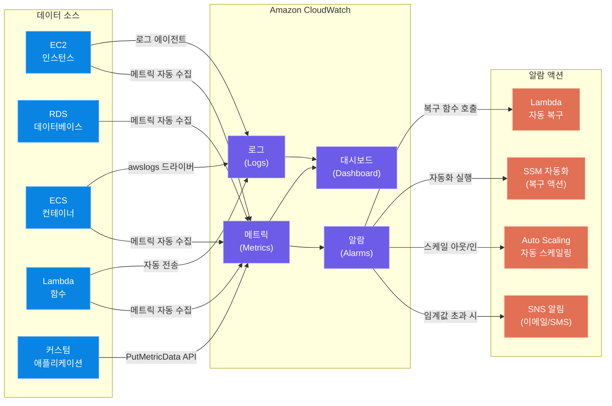
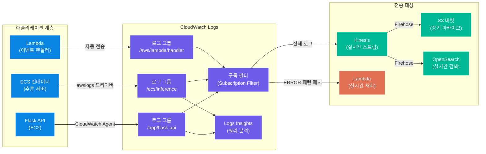
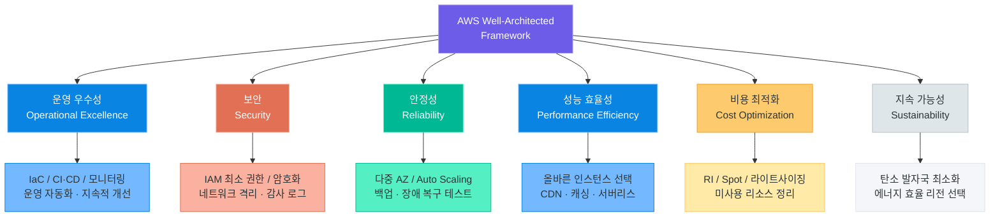

# 모니터링과 비용 관리

> 클라우드 서비스는 배포로 끝나지 않습니다. CloudWatch를 이용한 실시간 모니터링, 로그 파이프라인 구성, 비용 추적과 최적화, 그리고 AWS Well-Architected Framework의 6대 기둥까지 — 운영 단계에서 실질적으로 필요한 모든 지식을 이 마지막 강의에서 완성합니다.

---

## 1. CloudWatch — 클라우드 모니터링의 중심

### CloudWatch란 무엇인가

AWS에서 실행되는 모든 서비스는 CPU 사용률, 네트워크 트래픽, 오류 수, 레이턴시 등 수많은 **메트릭(Metric)**을 실시간으로 발생시킵니다. AWS CloudWatch는 이 메트릭을 수집·저장·시각화·알람하는 통합 모니터링 서비스입니다.

"서버가 느려졌다", "배치 작업이 실패했다", "AI 추론 비용이 갑자기 치솟았다"는 상황을 **사람이 직접 발견하기 전에 자동으로 감지하고 조치**하는 것이 CloudWatch의 핵심 역할입니다.



### 핵심 서비스별 메트릭

CloudWatch는 AWS 서비스마다 자동으로 메트릭을 수집합니다. 생성형 AI 풀스택 서비스에서 가장 중요한 세 가지 서비스의 핵심 메트릭을 살펴봅니다.

#### EC2 인스턴스 메트릭

| 메트릭 이름 | 설명 | 권장 임계값 | 단위 |
|------------|------|-----------|------|
| `CPUUtilization` | CPU 사용률 | > 80% 시 알람 | % |
| `NetworkIn` | 인바운드 네트워크 트래픽 | 서비스별 기준 설정 | Bytes |
| `NetworkOut` | 아웃바운드 네트워크 트래픽 | 서비스별 기준 설정 | Bytes |
| `DiskReadOps` | EBS 디스크 읽기 작업 수 | I/O 병목 감지용 | Count |
| `DiskWriteOps` | EBS 디스크 쓰기 작업 수 | I/O 병목 감지용 | Count |
| `StatusCheckFailed` | 인스턴스 상태 점검 실패 | > 0 이면 즉시 알람 | Count |
| `NetworkPacketsIn` | 수신 패킷 수 | DDoS 감지 활용 | Count |

> **핵심 포인트:** EC2의 메모리 사용률(`MemoryUtilization`)과 디스크 사용량(`DiskSpaceUsed`)은 기본 메트릭에 포함되지 않습니다. CloudWatch Agent를 설치해야 수집됩니다. AI 모델 서버는 메모리를 대량으로 사용하므로 반드시 에이전트를 통해 메모리 메트릭을 수집하세요.

#### RDS 데이터베이스 메트릭

| 메트릭 이름 | 설명 | 권장 임계값 | 단위 |
|------------|------|-----------|------|
| `DatabaseConnections` | 현재 연결 수 | max_connections의 80% | Count |
| `ReadIOPS` | 초당 읽기 I/O 작업 수 | 프로비저닝 IOPS 기준 | Count/s |
| `WriteIOPS` | 초당 쓰기 I/O 작업 수 | 프로비저닝 IOPS 기준 | Count/s |
| `FreeStorageSpace` | 남은 저장 공간 | < 10GB 시 알람 | Bytes |
| `CPUUtilization` | DB 인스턴스 CPU | > 80% 시 알람 | % |
| `ReadLatency` | 읽기 지연 시간 | > 20ms 시 알람 | Seconds |
| `WriteLatency` | 쓰기 지연 시간 | > 10ms 시 알람 | Seconds |
| `FreeableMemory` | 사용 가능한 메모리 | < 256MB 시 알람 | Bytes |

#### ECS 컨테이너 메트릭

| 메트릭 이름 | 설명 | 권장 임계값 | 단위 |
|------------|------|-----------|------|
| `CPUUtilization` | 서비스 평균 CPU 사용률 | > 70% 시 스케일 아웃 | % |
| `MemoryUtilization` | 서비스 평균 메모리 사용률 | > 80% 시 알람 | % |
| `RunningTaskCount` | 실행 중인 태스크 수 | 최소값 미달 시 알람 | Count |
| `PendingTaskCount` | 배치 대기 중인 태스크 수 | > 0 지속 시 알람 | Count |

### 네임스페이스와 차원 (Namespace & Dimension)

CloudWatch 메트릭은 **네임스페이스(Namespace)**와 **차원(Dimension)**으로 구조화됩니다.

**네임스페이스**는 메트릭의 카테고리입니다. AWS 서비스는 자신만의 네임스페이스를 사용하고, 커스텀 메트릭은 자신만의 네임스페이스를 직접 정의합니다.

```
AWS/EC2           → EC2 인스턴스 메트릭
AWS/RDS           → RDS 데이터베이스 메트릭
AWS/ECS           → ECS 컨테이너 메트릭
AWS/Lambda        → Lambda 함수 메트릭
AWS/ApplicationELB → ALB 로드밸런서 메트릭
MyApp/Inference   → 직접 정의한 커스텀 네임스페이스
```

**차원(Dimension)**은 메트릭을 더 세밀하게 식별하는 키-값 쌍입니다. 예를 들어 EC2의 `CPUUtilization`은 `InstanceId=i-0a1b2c3d4e5f` 차원으로 특정 인스턴스를 지정합니다.

```bash
# AWS CLI로 특정 EC2 인스턴스의 CPU 메트릭 조회
aws cloudwatch get-metric-statistics \
    --namespace AWS/EC2 \
    --metric-name CPUUtilization \
    --dimensions Name=InstanceId,Value=i-0a1b2c3d4e5f6g7h8 \
    --start-time 2026-04-21T00:00:00Z \
    --end-time 2026-04-21T23:59:59Z \
    --period 3600 \
    --statistics Average \
    --output table
```

차원을 조합하면 더 구체적인 필터링이 가능합니다. ECS에서는 `ClusterName`과 `ServiceName` 두 차원을 함께 사용해 특정 클러스터의 특정 서비스만 선택합니다.

### 알람 (CloudWatch Alarms)

알람은 메트릭 값이 특정 조건을 충족할 때 자동으로 액션을 실행합니다. 알람을 구성하는 네 가지 핵심 요소가 있습니다.

| 요소 | 설명 | 예시 |
|------|------|------|
| **임계값 (Threshold)** | 알람이 발생하는 메트릭 값 기준 | CPU > 80% |
| **기간 (Period)** | 메트릭을 집계하는 시간 단위 | 300초 (5분) |
| **평가 기간 (Evaluation Periods)** | 알람 조건을 몇 번 연속 충족해야 하는가 | 3회 연속 |
| **액션 (Action)** | 알람 상태 시 실행할 동작 | SNS 알림, Auto Scaling |

알람 상태는 세 가지입니다.
- **OK**: 메트릭이 임계값 이하
- **ALARM**: 임계값을 초과하여 평가 기간을 충족
- **INSUFFICIENT_DATA**: 데이터가 충분하지 않아 판단 불가

```bash
# EC2 CPU 알람 생성 (AWS CLI)
aws cloudwatch put-metric-alarm \
    --alarm-name "EC2-High-CPU-i-0a1b2c3d" \
    --alarm-description "AI 추론 서버 CPU 사용률 80% 초과" \
    --namespace AWS/EC2 \
    --metric-name CPUUtilization \
    --dimensions Name=InstanceId,Value=i-0a1b2c3d4e5f6g7h8 \
    --statistic Average \
    --period 300 \
    --evaluation-periods 3 \
    --threshold 80 \
    --comparison-operator GreaterThanThreshold \
    --alarm-actions arn:aws:sns:ap-northeast-2:123456789012:ops-alert \
    --ok-actions arn:aws:sns:ap-northeast-2:123456789012:ops-alert \
    --treat-missing-data missing

# RDS 연결 수 알람 생성
aws cloudwatch put-metric-alarm \
    --alarm-name "RDS-High-Connections" \
    --alarm-description "RDS 최대 연결의 80% 초과" \
    --namespace AWS/RDS \
    --metric-name DatabaseConnections \
    --dimensions Name=DBInstanceIdentifier,Value=my-prod-db \
    --statistic Average \
    --period 60 \
    --evaluation-periods 5 \
    --threshold 800 \
    --comparison-operator GreaterThanThreshold \
    --alarm-actions arn:aws:sns:ap-northeast-2:123456789012:ops-alert

# 알람 상태 목록 확인
aws cloudwatch describe-alarms \
    --alarm-name-prefix "EC2-" \
    --state-value ALARM \
    --output table
```

### 대시보드 구성

CloudWatch 대시보드는 여러 메트릭을 하나의 화면에 모아 볼 수 있는 시각화 도구입니다. AWS CLI로 JSON 기반 대시보드를 코드로 관리할 수 있습니다.

```bash
# 대시보드 생성 (JSON body로 위젯 정의)
aws cloudwatch put-dashboard \
    --dashboard-name "AI-Service-Overview" \
    --dashboard-body '{
        "widgets": [
            {
                "type": "metric",
                "x": 0, "y": 0, "width": 12, "height": 6,
                "properties": {
                    "title": "EC2 CPU 사용률 (AI 추론 서버)",
                    "metrics": [
                        ["AWS/EC2", "CPUUtilization",
                         "InstanceId", "i-0a1b2c3d4e5f6g7h8",
                         {"label": "추론 서버", "color": "#6c5ce7"}]
                    ],
                    "period": 300,
                    "stat": "Average",
                    "view": "timeSeries",
                    "yAxis": {"left": {"min": 0, "max": 100}},
                    "annotations": {
                        "horizontal": [{"value": 80, "color": "#e17055", "label": "경고 임계값"}]
                    }
                }
            },
            {
                "type": "metric",
                "x": 12, "y": 0, "width": 12, "height": 6,
                "properties": {
                    "title": "AI 추론 레이턴시 (커스텀 메트릭)",
                    "metrics": [
                        ["MyApp/Inference", "InferenceLatency",
                         "ModelName", "llm-v2",
                         {"label": "P99 레이턴시", "stat": "p99", "color": "#0984e3"}],
                        ["MyApp/Inference", "InferenceLatency",
                         "ModelName", "llm-v2",
                         {"label": "평균 레이턴시", "stat": "Average", "color": "#00b894"}]
                    ],
                    "period": 60,
                    "view": "timeSeries"
                }
            }
        ]
    }'
```

### 커스텀 메트릭 — boto3로 AI 추론 레이턴시 전송

AWS 서비스 기본 메트릭만으로는 부족합니다. AI 모델의 추론 레이턴시, 토큰 처리량, 모델 정확도 같은 **비즈니스·애플리케이션 레벨 지표**는 직접 코드에서 CloudWatch로 전송해야 합니다.

```python
import boto3
import time
import json
from datetime import datetime, timezone
from functools import wraps

# CloudWatch 클라이언트 초기화
cloudwatch = boto3.client('cloudwatch', region_name='ap-northeast-2')

def send_inference_metrics(model_name: str, latency_ms: float,
                           token_count: int, success: bool):
    """AI 추론 메트릭을 CloudWatch에 전송합니다."""
    timestamp = datetime.now(timezone.utc)

    metrics = [
        {
            'MetricName': 'InferenceLatency',
            'Dimensions': [
                {'Name': 'ModelName', 'Value': model_name},
                {'Name': 'Environment', 'Value': 'production'}
            ],
            'Timestamp': timestamp,
            'Value': latency_ms,
            'Unit': 'Milliseconds'
        },
        {
            'MetricName': 'TokensGenerated',
            'Dimensions': [
                {'Name': 'ModelName', 'Value': model_name},
                {'Name': 'Environment', 'Value': 'production'}
            ],
            'Timestamp': timestamp,
            'Value': token_count,
            'Unit': 'Count'
        },
        {
            'MetricName': 'InferenceSuccessCount' if success else 'InferenceErrorCount',
            'Dimensions': [
                {'Name': 'ModelName', 'Value': model_name}
            ],
            'Timestamp': timestamp,
            'Value': 1,
            'Unit': 'Count'
        }
    ]

    try:
        cloudwatch.put_metric_data(
            Namespace='MyApp/Inference',
            MetricData=metrics
        )
    except Exception as e:
        print(f"메트릭 전송 실패: {e}")


def monitor_inference(model_name: str):
    """AI 추론 함수에 적용하는 모니터링 데코레이터."""
    def decorator(func):
        @wraps(func)
        def wrapper(*args, **kwargs):
            start_time = time.time()
            success = True
            token_count = 0
            try:
                result = func(*args, **kwargs)
                # 결과에서 토큰 수 추출 (모델 응답 구조에 따라 조정)
                if isinstance(result, dict):
                    token_count = result.get('usage', {}).get('total_tokens', 0)
                return result
            except Exception as e:
                success = False
                raise
            finally:
                latency_ms = (time.time() - start_time) * 1000
                send_inference_metrics(model_name, latency_ms, token_count, success)
        return wrapper
    return decorator


# 실제 사용 예시
@monitor_inference(model_name="llm-v2")
def call_llm(prompt: str) -> dict:
    """LLM 추론 함수 — 실제 모델 호출 로직."""
    # 여기서 실제 모델 API 호출
    import random, time
    time.sleep(random.uniform(0.1, 0.5))  # 시뮬레이션
    return {
        "response": "생성된 텍스트...",
        "usage": {"total_tokens": random.randint(100, 500)}
    }


# 배치로 여러 메트릭을 한 번에 전송하는 방법 (API 비용 절감)
def send_batch_metrics(metric_buffer: list):
    """최대 20개 메트릭을 배치로 전송합니다 (CloudWatch 제한)."""
    for i in range(0, len(metric_buffer), 20):
        batch = metric_buffer[i:i+20]
        cloudwatch.put_metric_data(
            Namespace='MyApp/Inference',
            MetricData=batch
        )
        print(f"배치 {i//20 + 1}: {len(batch)}개 메트릭 전송 완료")
```

> **핵심 포인트:** `put_metric_data` API는 한 번에 최대 20개 메트릭을 전송할 수 있습니다. 고빈도 추론 서버에서는 메트릭을 메모리에 버퍼링했다가 배치로 전송하면 API 호출 비용과 횟수를 줄일 수 있습니다. 또한 커스텀 메트릭은 기본 메트릭(5분)과 달리 고해상도 메트릭(1초 단위)으로도 저장할 수 있지만 비용이 3배 높습니다.

---

## 2. 로그 관리 — CloudWatch Logs

### 로그 관리 파이프라인 아키텍처



### 로그 그룹과 로그 스트림

CloudWatch Logs의 데이터 구조는 두 계층으로 나뉩니다.

**로그 그룹(Log Group)**은 같은 목적을 가진 로그를 묶는 단위입니다. 보존 기간 설정, 구독 필터, IAM 권한이 로그 그룹 단위로 적용됩니다.

**로그 스트림(Log Stream)**은 로그 그룹 내의 개별 소스입니다. EC2 인스턴스 한 대가 하나의 로그 스트림이 되고, ECS 태스크 하나가 하나의 로그 스트림이 됩니다.

```
/app/flask-api                          ← 로그 그룹
  ├── i-0a1b2c3d4e5f6g7h8/app.log      ← 로그 스트림 (인스턴스 A)
  ├── i-0z9y8x7w6v5u4t3s/app.log      ← 로그 스트림 (인스턴스 B)
  └── i-0q1w2e3r4t5y6u7i/app.log      ← 로그 스트림 (인스턴스 C)

/ecs/inference                          ← 로그 그룹
  ├── inference/inference/abc123def456  ← 로그 스트림 (태스크 A)
  └── inference/inference/xyz789uvw012  ← 로그 스트림 (태스크 B)
```

### CloudWatch Agent 설치

EC2 인스턴스에서 로그와 고급 메트릭을 수집하려면 CloudWatch Agent를 설치해야 합니다.

```bash
# Amazon Linux 2 / Amazon Linux 2023에 설치
sudo yum install -y amazon-cloudwatch-agent

# Ubuntu에 설치
wget https://s3.amazonaws.com/amazoncloudwatch-agent/ubuntu/amd64/latest/amazon-cloudwatch-agent.deb
sudo dpkg -i -E ./amazon-cloudwatch-agent.deb

# 설정 파일 생성 (대화형 마법사)
sudo /opt/aws/amazon-cloudwatch-agent/bin/amazon-cloudwatch-agent-config-wizard
```

에이전트 설정 파일 예시 (`/opt/aws/amazon-cloudwatch-agent/etc/amazon-cloudwatch-agent.json`):

```json
{
    "agent": {
        "metrics_collection_interval": 60,
        "run_as_user": "root"
    },
    "logs": {
        "logs_collected": {
            "files": {
                "collect_list": [
                    {
                        "file_path": "/var/log/app/flask.log",
                        "log_group_name": "/app/flask-api",
                        "log_stream_name": "{instance_id}/flask.log",
                        "timezone": "Asia/Seoul",
                        "timestamp_format": "%Y-%m-%d %H:%M:%S"
                    },
                    {
                        "file_path": "/var/log/app/inference.log",
                        "log_group_name": "/app/inference",
                        "log_stream_name": "{instance_id}/inference.log",
                        "multi_line_start_pattern": "^[0-9]{4}-[0-9]{2}-[0-9]{2}"
                    }
                ]
            }
        }
    },
    "metrics": {
        "namespace": "MyApp/System",
        "metrics_collected": {
            "mem": {
                "measurement": ["mem_used_percent"],
                "metrics_collection_interval": 60
            },
            "disk": {
                "measurement": ["disk_used_percent"],
                "resources": ["/", "/data"],
                "metrics_collection_interval": 300
            }
        }
    }
}
```

```bash
# 에이전트 시작
sudo /opt/aws/amazon-cloudwatch-agent/bin/amazon-cloudwatch-agent-ctl \
    -a fetch-config \
    -m ec2 \
    -s \
    -c file:/opt/aws/amazon-cloudwatch-agent/etc/amazon-cloudwatch-agent.json

# 에이전트 상태 확인
sudo /opt/aws/amazon-cloudwatch-agent/bin/amazon-cloudwatch-agent-ctl \
    -a status
```

### 필터 패턴 (Filter Patterns)

CloudWatch Logs의 필터 패턴을 이용하면 로그에서 특정 조건에 맞는 메시지만 추출할 수 있습니다.

**기본 텍스트 필터**

```
ERROR                           # "ERROR" 단어 포함
"ERROR" "timeout"               # "ERROR"와 "timeout" 모두 포함 (AND)
?ERROR ?WARN                    # "ERROR" 또는 "WARN" 포함 (OR)
-DEBUG                          # "DEBUG" 제외
"Inference" -"SUCCESS"         # "Inference" 포함, "SUCCESS" 제외
```

**JSON 로그 필터** (구조화된 JSON 로그에 적용)

```
{ $.level = "ERROR" }                          # level 필드가 ERROR인 로그
{ $.latency_ms > 1000 }                        # 레이턴시 1초 초과
{ $.model_name = "llm-v2" && $.error = true } # 특정 모델 오류
{ $.status_code = 5* }                         # 5xx 오류 응답
{ $.user_id EXISTS }                           # user_id 필드가 있는 로그
```

```bash
# CLI로 메트릭 필터 생성 (ERROR 로그 수를 메트릭으로 변환)
aws logs put-metric-filter \
    --log-group-name "/app/flask-api" \
    --filter-name "ErrorCount" \
    --filter-pattern "ERROR" \
    --metric-transformations \
        metricName=ErrorCount,metricNamespace=MyApp/Logs,metricValue=1,unit=Count

# JSON 로그에서 레이턴시 추출하여 메트릭 생성
aws logs put-metric-filter \
    --log-group-name "/app/inference" \
    --filter-name "InferenceLatency" \
    --filter-pattern "{ $.event = \"inference_complete\" }" \
    --metric-transformations \
        metricName=P99Latency,metricNamespace=MyApp/Logs,metricValue='$.latency_ms',unit=Milliseconds
```

### Log Insights 쿼리 문법

CloudWatch Log Insights는 로그 그룹에 SQL과 유사한 쿼리를 실행하는 분석 도구입니다. 수십억 건의 로그도 수 초 만에 집계할 수 있습니다.

```sql
-- 최근 1시간 내 ERROR 로그 TOP 10
fields @timestamp, @message, @logStream
| filter @message like /ERROR/
| sort @timestamp desc
| limit 10

-- 5분 단위 오류 수 시계열 집계
fields @timestamp, @message
| filter @message like /ERROR/
| stats count(*) as error_count by bin(5m) as time_window
| sort time_window asc

-- JSON 로그: 모델별 평균 레이턴시 (상위 5개 모델)
fields @timestamp, model_name, latency_ms
| filter event = "inference_complete"
| stats avg(latency_ms) as avg_latency,
        max(latency_ms) as max_latency,
        count(*) as request_count
        by model_name
| sort avg_latency desc
| limit 5

-- HTTP 상태 코드별 요청 분포
fields @timestamp, status_code, path, method
| stats count(*) as count by status_code
| sort count desc

-- P99 레이턴시 계산 (백분위수)
fields @timestamp, latency_ms
| filter event = "inference_complete"
| stats pct(latency_ms, 99) as p99,
        pct(latency_ms, 95) as p95,
        pct(latency_ms, 50) as p50
        by bin(1h)

-- 특정 사용자의 오류 패턴 추적
fields @timestamp, user_id, error_type, @message
| filter level = "ERROR" and user_id = "user-12345"
| sort @timestamp asc
```

```bash
# CLI로 Log Insights 쿼리 실행
QUERY_ID=$(aws logs start-query \
    --log-group-name "/app/flask-api" \
    --start-time $(date -d "1 hour ago" +%s) \
    --end-time $(date +%s) \
    --query-string 'fields @timestamp, @message | filter @message like /ERROR/ | limit 20' \
    --query queryId)

# 결과 조회
aws logs get-query-results --query-id $QUERY_ID
```

### 로그 보존 기간 설정

기본적으로 CloudWatch Logs는 로그를 **영구 보존**합니다. 스토리지 비용이 계속 증가하므로 보존 기간을 반드시 설정해야 합니다.

```bash
# 로그 그룹 보존 기간 설정 (30일)
aws logs put-retention-policy \
    --log-group-name "/app/flask-api" \
    --retention-in-days 30

# 보존 기간 설정 가능 값 (일):
# 1, 3, 5, 7, 14, 30, 60, 90, 120, 150, 180, 365, 400, 545, 731, 1096, 1827, 2192, 2557, 2922, 3288, 3653

# 로그 그룹 목록과 보존 기간 확인
aws logs describe-log-groups \
    --query 'logGroups[*].[logGroupName,retentionInDays,storedBytes]' \
    --output table

# 모든 로그 그룹에 일괄 적용하는 스크립트
for GROUP in $(aws logs describe-log-groups --query 'logGroups[*].logGroupName' --output text); do
    aws logs put-retention-policy \
        --log-group-name "$GROUP" \
        --retention-in-days 90
    echo "설정 완료: $GROUP"
done
```

| 로그 유형 | 권장 보존 기간 | 이유 |
|----------|-------------|------|
| 애플리케이션 오류 로그 | 90일 | 장애 분석, 패턴 파악 |
| 접근 로그 (Access Log) | 30일 | 보안 감사, 단기 분석 |
| 디버그 로그 | 7일 | 개발 목적, 볼륨 큼 |
| 감사 로그 (Audit Log) | 365일 이상 | 컴플라이언스 요구사항 |
| Lambda 함수 로그 | 30일 | 함수 실행 추적 |

### 구독 필터 — 로그 실시간 전송

구독 필터(Subscription Filter)를 사용하면 로그 그룹의 데이터를 실시간으로 Lambda, Kinesis, OpenSearch 등으로 전달할 수 있습니다.

```bash
# Lambda로 ERROR 로그 실시간 전송
aws logs put-subscription-filter \
    --log-group-name "/app/flask-api" \
    --filter-name "ErrorToLambda" \
    --filter-pattern "ERROR" \
    --destination-arn arn:aws:lambda:ap-northeast-2:123456789012:function:log-alert-handler

# Kinesis Data Firehose로 전체 로그 전송 (S3 아카이브)
aws logs put-subscription-filter \
    --log-group-name "/app/inference" \
    --filter-name "AllLogsToFirehose" \
    --filter-pattern "" \
    --destination-arn arn:aws:firehose:ap-northeast-2:123456789012:deliverystream/log-archive-stream
```

> **핵심 포인트:** 로그 그룹당 구독 필터는 최대 2개입니다. 실시간 알람용(Lambda)과 장기 보관용(Kinesis→S3) 두 가지를 운영하는 것이 일반적인 패턴입니다. 로그 데이터를 S3에 아카이빙하면 CloudWatch Logs보다 훨씬 저렴하게 장기 보관할 수 있습니다.

---

## 3. 비용 관리 — 클라우드 지출 통제

### AWS Cost Explorer

Cost Explorer는 AWS 사용 비용을 시각화하고 분석하는 서비스입니다. 최대 13개월의 과거 데이터를 일별·월별로 확인하고, 향후 12개월의 비용을 예측합니다.

```bash
# Cost Explorer API로 일별 비용 조회 (최근 30일)
aws ce get-cost-and-usage \
    --time-period Start=2026-03-22,End=2026-04-21 \
    --granularity DAILY \
    --metrics BlendedCost \
    --group-by Type=DIMENSION,Key=SERVICE \
    --output table

# 서비스별 비용 요약 (이번 달)
aws ce get-cost-and-usage \
    --time-period Start=2026-04-01,End=2026-04-21 \
    --granularity MONTHLY \
    --metrics BlendedCost UsageQuantity \
    --group-by Type=DIMENSION,Key=SERVICE \
    --filter '{"Dimensions": {"Key": "SERVICE", "Values": ["Amazon EC2", "Amazon RDS", "Amazon S3"]}}' \
    --output json

# 태그별 비용 조회 (Environment 태그 기준)
aws ce get-cost-and-usage \
    --time-period Start=2026-04-01,End=2026-04-21 \
    --granularity MONTHLY \
    --metrics BlendedCost \
    --group-by Type=TAG,Key=Environment
```

### Billing 알람 — 예산 초과 알림 설정

예상치 못한 비용 폭발을 막기 위해 Billing 알람을 반드시 설정해야 합니다. Billing 메트릭은 **us-east-1 리전**에서만 조회됩니다.

```bash
# 월 총 비용 알람 (USD 100 초과 시 알림)
aws cloudwatch put-metric-alarm \
    --region us-east-1 \
    --alarm-name "MonthlyBilling-100USD" \
    --alarm-description "월 AWS 비용이 $100을 초과했습니다" \
    --namespace AWS/Billing \
    --metric-name EstimatedCharges \
    --dimensions Name=Currency,Value=USD \
    --statistic Maximum \
    --period 86400 \
    --evaluation-periods 1 \
    --threshold 100 \
    --comparison-operator GreaterThanThreshold \
    --alarm-actions arn:aws:sns:us-east-1:123456789012:billing-alert

# EC2 서비스별 비용 알람
aws cloudwatch put-metric-alarm \
    --region us-east-1 \
    --alarm-name "EC2-Billing-50USD" \
    --alarm-description "EC2 비용이 $50을 초과했습니다" \
    --namespace AWS/Billing \
    --metric-name EstimatedCharges \
    --dimensions Name=Currency,Value=USD Name=ServiceName,Value="Amazon EC2" \
    --statistic Maximum \
    --period 86400 \
    --evaluation-periods 1 \
    --threshold 50 \
    --comparison-operator GreaterThanThreshold \
    --alarm-actions arn:aws:sns:us-east-1:123456789012:billing-alert
```

> **핵심 포인트:** Billing 알람을 사용하려면 AWS 계정의 Billing 콘솔에서 "Receive Billing Alerts" 옵션을 먼저 활성화해야 합니다. 한 번 활성화하면 비활성화할 수 없으므로 신규 계정이라면 가장 먼저 설정해두세요.

### 태그 기반 비용 추적 — 태그 전략

태그(Tag)는 AWS 리소스에 붙이는 키-값 레이블입니다. 체계적인 태그 전략을 세우면 "이 비용이 어떤 팀의, 어떤 서비스의, 어떤 환경의 비용인가"를 정확하게 추적할 수 있습니다.

**권장 태그 키 체계:**

| 태그 키 | 설명 | 예시 값 |
|--------|------|--------|
| `Environment` | 배포 환경 | `production`, `staging`, `development` |
| `Team` | 담당 팀 | `ai-platform`, `backend`, `data-engineering` |
| `Service` | 서비스명 | `inference-api`, `training-pipeline`, `chatbot` |
| `Project` | 프로젝트명 | `genai-v2`, `rag-system`, `finetune-job` |
| `Owner` | 담당자 | `suhyun.park`, `jiwon.kim` |
| `CostCenter` | 비용 센터 코드 | `CC-001`, `CC-AI-PLATFORM` |

```bash
# EC2 인스턴스에 태그 적용
aws ec2 create-tags \
    --resources i-0a1b2c3d4e5f6g7h8 \
    --tags \
        Key=Environment,Value=production \
        Key=Team,Value=ai-platform \
        Key=Service,Value=inference-api \
        Key=Project,Value=genai-v2

# 태그로 리소스 그룹 생성
aws resourcegroupstaggingapi create-group \
    --name "production-ai-resources" \
    --tags Environment=production,Team=ai-platform

# 태그 없는 EC2 인스턴스 찾기 (비용 추적 누락 방지)
aws resourcegroupstaggingapi get-resources \
    --resource-type-filters ec2:instance \
    --tags-per-page 100 \
    --query 'ResourceTagMappingList[?Tags==`[]`].ResourceARN' \
    --output table
```

**Cost Allocation Tags 활성화:**

```bash
# 비용 배분 태그 활성화 (Billing 콘솔에서 활성화 후 24시간 후 반영)
aws ce create-cost-category-definition \
    --name "팀별 비용 분류" \
    --rule-version "CostCategoryExpression.v1" \
    --rules '[
        {
            "Value": "AI Platform 팀",
            "Rule": {
                "Tags": {
                    "Key": "Team",
                    "Values": ["ai-platform"],
                    "MatchOptions": ["EQUALS"]
                }
            }
        },
        {
            "Value": "Backend 팀",
            "Rule": {
                "Tags": {
                    "Key": "Team",
                    "Values": ["backend"],
                    "MatchOptions": ["EQUALS"]
                }
            }
        }
    ]'
```

### AWS Budgets — 월별 예산 설정

AWS Budgets는 예산 목표를 설정하고 실제 비용 또는 예측 비용이 임계값에 도달하면 알림을 전송합니다. Cost Explorer가 과거를 분석한다면, Budgets는 미래를 통제합니다.

```bash
# 월별 총 비용 예산 설정 ($200/월, 80%·100% 도달 시 알림)
aws budgets create-budget \
    --account-id 123456789012 \
    --budget '{
        "BudgetName": "Monthly-Total-Budget",
        "BudgetLimit": {
            "Amount": "200",
            "Unit": "USD"
        },
        "TimeUnit": "MONTHLY",
        "BudgetType": "COST",
        "CostFilters": {},
        "CostTypes": {
            "IncludeTax": true,
            "IncludeSubscription": true,
            "UseBlended": false
        }
    }' \
    --notifications-with-subscribers '[
        {
            "Notification": {
                "NotificationType": "ACTUAL",
                "ComparisonOperator": "GREATER_THAN",
                "Threshold": 80,
                "ThresholdType": "PERCENTAGE"
            },
            "Subscribers": [
                {"SubscriptionType": "EMAIL", "Address": "team@example.com"}
            ]
        },
        {
            "Notification": {
                "NotificationType": "FORECASTED",
                "ComparisonOperator": "GREATER_THAN",
                "Threshold": 100,
                "ThresholdType": "PERCENTAGE"
            },
            "Subscribers": [
                {"SubscriptionType": "EMAIL", "Address": "team@example.com"},
                {"SubscriptionType": "SNS", "Address": "arn:aws:sns:ap-northeast-2:123456789012:billing-alert"}
            ]
        }
    ]'

# AI 서비스(SageMaker) 전용 예산 설정
aws budgets create-budget \
    --account-id 123456789012 \
    --budget '{
        "BudgetName": "SageMaker-Monthly-Budget",
        "BudgetLimit": {"Amount": "500", "Unit": "USD"},
        "TimeUnit": "MONTHLY",
        "BudgetType": "COST",
        "CostFilters": {
            "Service": ["Amazon SageMaker"]
        }
    }' \
    --notifications-with-subscribers '[
        {
            "Notification": {
                "NotificationType": "ACTUAL",
                "ComparisonOperator": "GREATER_THAN",
                "Threshold": 90,
                "ThresholdType": "PERCENTAGE"
            },
            "Subscribers": [
                {"SubscriptionType": "EMAIL", "Address": "ml-team@example.com"}
            ]
        }
    ]'
```

**예산 유형 비교:**

| 예산 유형 | 설명 | 적합한 상황 |
|----------|------|-----------|
| 비용 예산 (Cost Budget) | 실제 지출 금액 기준 | 월별 총 비용 통제 |
| 사용량 예산 (Usage Budget) | 리소스 사용량 기준 | EC2 시간, S3 GB 단위 |
| RI 활용률 예산 | Reserved Instance 활용률 | RI 낭비 방지 |
| Savings Plans 활용률 | Savings Plans 활용률 | SP 낭비 방지 |

---

## 4. 비용 최적화 전략

### Reserved Instance — 장기 약정으로 절감

Reserved Instance(RI)는 1년 또는 3년 기간을 약정하는 대신 온디맨드 가격 대비 최대 72%를 절감하는 구매 방식입니다. 24시간 지속 운영하는 프로덕션 서버에 적합합니다.

| 구매 옵션 | 선결제 방식 | 절감율 (1년) | 절감율 (3년) |
|----------|-----------|-----------|-----------|
| 표준 RI (Standard RI) | 전체 선결제 | 최대 40% | 최대 62% |
| 표준 RI (Standard RI) | 부분 선결제 | 최대 38% | 최대 59% |
| 표준 RI (Standard RI) | 선결제 없음 | 최대 35% | 최대 54% |
| 전환 가능 RI (Convertible RI) | 전체 선결제 | 최대 31% | 최대 54% |
| 전환 가능 RI (Convertible RI) | 선결제 없음 | 최대 24% | 최대 46% |

```bash
# RI 구매 추천 조회 (과거 사용량 기반)
aws ce get-reservation-purchase-recommendation \
    --service "Amazon EC2" \
    --lookback-period-in-days SIXTY_DAYS \
    --term-in-years ONE_YEAR \
    --payment-option PARTIAL_UPFRONT \
    --output table

# 현재 RI 활용률 확인
aws ce get-reservation-utilization \
    --time-period Start=2026-04-01,End=2026-04-21 \
    --granularity MONTHLY
```

> **핵심 포인트:** AI 추론 서버처럼 트래픽이 예측 가능하고 24시간 운영하는 서버는 표준 RI가 최선입니다. 반면 모델 학습처럼 일시적이고 중단 가능한 워크로드는 스팟 인스턴스가 적합합니다. 두 가지를 혼합하는 것이 현실적인 비용 최적화 전략입니다.

### Spot Instance 활용 — AI 학습과 배치 처리

Spot Instance는 AWS의 여유 EC2 용량을 경매 방식으로 최대 90% 저렴하게 사용하는 방식입니다. 다만 언제든 2분 전 통보 후 회수될 수 있습니다.

**Spot Instance가 적합한 AI 워크로드:**

| 워크로드 유형 | 적합도 | 이유 |
|-------------|--------|------|
| 딥러닝 모델 훈련 (체크포인트 지원) | 매우 적합 | 중단 후 재시작 가능 |
| 대규모 데이터 전처리 | 매우 적합 | 배치 처리, 중단 후 재실행 가능 |
| 하이퍼파라미터 탐색 | 적합 | 독립적인 실험 단위 |
| 실시간 AI 추론 API | 부적합 | 갑작스런 중단이 서비스에 영향 |
| RAG 인덱싱 파이프라인 | 적합 | 멱등성 보장 가능 |

```bash
# Spot 인스턴스 요청 (GPU 인스턴스 학습용)
aws ec2 request-spot-instances \
    --spot-price "1.50" \
    --instance-count 2 \
    --type "one-time" \
    --launch-specification '{
        "ImageId": "ami-0c9c942bd7bf113a2",
        "InstanceType": "g4dn.xlarge",
        "KeyName": "my-key-pair",
        "SecurityGroupIds": ["sg-0a1b2c3d"],
        "SubnetId": "subnet-0e1f2g3h",
        "IamInstanceProfile": {"Name": "EC2-Training-Role"},
        "UserData": "'"$(base64 -w 0 training-startup.sh)"'"
    }'

# Spot 인스턴스 중단 알림 처리 (인스턴스 내부에서 실행)
TOKEN=$(curl -s -X PUT "http://169.254.169.254/latest/api/token" \
    -H "X-aws-ec2-metadata-token-ttl-seconds: 21600")

# 2분 대기 시간 알림 확인 스크립트 (학습 코드와 함께 실행)
while true; do
    STATUS=$(curl -s -H "X-aws-ec2-metadata-token: $TOKEN" \
        http://169.254.169.254/latest/meta-data/spot/termination-time 2>/dev/null)
    if [ -n "$STATUS" ]; then
        echo "Spot 인스턴스 회수 예정: $STATUS — 체크포인트 저장 중..."
        # 체크포인트 저장 및 S3 업로드 트리거
        python save_checkpoint.py --emergency
        break
    fi
    sleep 5
done
```

### Savings Plans — 유연한 절감 계획

Savings Plans는 RI보다 유연한 약정 방식입니다. 특정 인스턴스 유형이 아닌 **시간당 사용량(USD/hour)**을 약정하므로 인스턴스 유형과 리전을 자유롭게 변경할 수 있습니다.

| Savings Plans 유형 | 적용 범위 | 최대 절감율 |
|------------------|---------|-----------|
| Compute Savings Plans | EC2, Lambda, Fargate 모두 적용 | 최대 66% |
| EC2 Instance Savings Plans | 특정 인스턴스 패밀리 | 최대 72% |
| SageMaker Savings Plans | SageMaker 학습·추론 | 최대 64% |

```bash
# Savings Plans 구매 추천 조회
aws ce get-savings-plans-purchase-recommendation \
    --savings-plans-type COMPUTE_SP \
    --term-in-years ONE_YEAR \
    --payment-option NO_UPFRONT \
    --lookback-period-in-days SIXTY_DAYS

# 현재 Savings Plans 활용률
aws ce get-savings-plans-utilization \
    --time-period Start=2026-04-01,End=2026-04-21
```

### 리소스 라이트사이징 — CloudWatch 기반 분석

**라이트사이징(Right-sizing)**은 실제 사용량에 비해 과도하게 할당된 리소스를 적절한 크기로 조정하는 작업입니다. CloudWatch 메트릭이 핵심 근거 데이터입니다.

```bash
# 최근 14일간 CPU 평균 사용률이 10% 미만인 EC2 인스턴스 찾기
aws cloudwatch get-metric-statistics \
    --namespace AWS/EC2 \
    --metric-name CPUUtilization \
    --dimensions Name=InstanceId,Value=i-0a1b2c3d4e5f6g7h8 \
    --start-time $(date -d "14 days ago" -u +%Y-%m-%dT%H:%M:%SZ) \
    --end-time $(date -u +%Y-%m-%dT%H:%M:%SZ) \
    --period 1209600 \
    --statistics Average Maximum

# AWS Compute Optimizer 추천 조회 (자동 라이트사이징 분석)
aws compute-optimizer get-ec2-instance-recommendations \
    --filters Name=Finding,Values=OVER_PROVISIONED \
    --output table
```

**라이트사이징 의사결정 기준:**

| 메트릭 상태 | 판단 | 조치 |
|-----------|------|------|
| CPU 평균 < 10%, Max < 40% | 명백한 과잉 프로비저닝 | 1~2단계 다운사이즈 |
| CPU 평균 10~40% | 적절하거나 약간 여유 있음 | 현상 유지 또는 소폭 조정 |
| CPU 평균 > 70% | 부족할 가능성 | 업사이즈 또는 Auto Scaling 검토 |
| 메모리 > 85% | 메모리 병목 위험 | 메모리 최적화 인스턴스 검토 |

### 미사용 리소스 정리

```bash
# 연결되지 않은(Unattached) EBS 볼륨 찾기
aws ec2 describe-volumes \
    --filters Name=status,Values=available \
    --query 'Volumes[*].[VolumeId,Size,CreateTime,Tags]' \
    --output table

# 미사용 탄력적 IP(EIP) 찾기 (연결 안 된 EIP는 시간당 요금 부과)
aws ec2 describe-addresses \
    --query 'Addresses[?AssociationId==`null`].[PublicIp,AllocationId]' \
    --output table

# 오래된 EBS 스냅샷 찾기 (180일 이상)
aws ec2 describe-snapshots \
    --owner-ids self \
    --query 'Snapshots[?StartTime<`2025-10-21`].[SnapshotId,VolumeSize,StartTime,Description]' \
    --output table

# 사용하지 않는 로드밸런서 확인 (요청 수 0인 ALB)
aws elbv2 describe-load-balancers \
    --query 'LoadBalancers[*].[LoadBalancerArn,LoadBalancerName,State.Code]' \
    --output table
```

### AI 서비스 비용 최적화 전략 — GPU 사용률 기반 스케줄링

GPU 인스턴스는 일반 인스턴스 대비 10~30배 비쌉니다. 비즈니스 시간 외에는 자동으로 종료하는 스케줄링이 핵심 비용 절감 수단입니다.

```python
import boto3
from datetime import datetime

def schedule_gpu_instances(action: str):
    """
    GPU 추론 서버의 스케줄 기반 시작/종료.

    - 평일 08:00~22:00 KST: 실행 (14시간)
    - 평일 22:00~08:00 KST: 종료 (10시간)
    - 주말: 전체 종료
    비용 절감: 온디맨드 대비 약 40~60% 절감
    """
    ec2 = boto3.client('ec2', region_name='ap-northeast-2')

    # GPU 서버 식별 태그
    gpu_servers = ec2.describe_instances(
        Filters=[
            {'Name': 'tag:Service', 'Values': ['inference-api']},
            {'Name': 'tag:Environment', 'Values': ['production']},
            {'Name': 'instance-state-name',
             'Values': ['running'] if action == 'stop' else ['stopped']}
        ]
    )

    instance_ids = [
        i['InstanceId']
        for r in gpu_servers['Reservations']
        for i in r['Instances']
    ]

    if not instance_ids:
        print(f"[{datetime.now()}] {action} 대상 GPU 인스턴스 없음")
        return

    if action == 'stop':
        ec2.stop_instances(InstanceIds=instance_ids)
        print(f"[{datetime.now()}] GPU 인스턴스 종료: {instance_ids}")
    elif action == 'start':
        ec2.start_instances(InstanceIds=instance_ids)
        print(f"[{datetime.now()}] GPU 인스턴스 시작: {instance_ids}")

    # CloudWatch에 스케줄링 이벤트 메트릭 전송
    cloudwatch = boto3.client('cloudwatch', region_name='ap-northeast-2')
    cloudwatch.put_metric_data(
        Namespace='MyApp/Cost',
        MetricData=[{
            'MetricName': f'GPUInstance{action.capitalize()}Count',
            'Value': len(instance_ids),
            'Unit': 'Count'
        }]
    )


# EventBridge(CloudWatch Events) 규칙으로 자동화
# - cron(0 23 ? * MON-FRI *) → UTC 23:00 = KST 08:00 → start
# - cron(0 13 ? * MON-FRI *) → UTC 13:00 = KST 22:00 → stop
# - cron(0 13 ? * SAT *)     → UTC 토요일 13:00 = KST 22:00 → stop (금요일 밤 대신)
```

**AI 서비스별 비용 최적화 전략 요약:**

| 전략 | 절감 효과 | 적용 대상 |
|------|---------|---------|
| 비업무시간 GPU 서버 종료 | 40~60% | 추론 서버, 학습 서버 |
| Spot Instance 학습 | 60~90% | 모델 학습, 데이터 전처리 |
| SageMaker Savings Plans | 최대 64% | SageMaker 상시 운영 |
| 모델 캐싱 (응답 캐시) | 30~70% | 동일 쿼리 반복 비율 높은 서비스 |
| 모델 양자화 (Quantization) | 50~75% GPU 메모리 감소 | LLM 서빙, 이미지 생성 모델 |
| 배치 추론 (실시간 대신) | 70~80% 처리량 향상 | 비실시간 분석 파이프라인 |
| 적절한 인스턴스 선택 | 20~40% | GPU 종류(A100→T4) 비용 차이 활용 |

---

## 5. Well-Architected Framework — 6대 기둥

### Well-Architected Framework란

AWS Well-Architected Framework는 AWS가 수천 개의 고객 아키텍처를 검토하며 쌓은 경험을 집약한 **클라우드 아키텍처 설계 원칙 모음**입니다. 2015년 4개 기둥으로 시작해 현재 6개 기둥으로 발전했습니다.



### 기둥 1 — 운영 우수성 (Operational Excellence)

운영 우수성은 **"시스템이 스스로 진단하고, 자동으로 복구하며, 지속적으로 개선되는"** 능력입니다.

**핵심 설계 원칙:**

| 원칙 | 설명 |
|------|------|
| 코드로 운영 (Operations as Code) | IaC(Terraform, CDK)로 인프라 버전 관리 |
| 작고 가역적인 변경 | 대규모 일괄 배포 대신 소규모 점진적 배포 |
| 운영 절차 정기 개선 | 장애 후 사후 분석(Post-Mortem)으로 프로세스 개선 |
| 실패 예측 | 카오스 엔지니어링으로 장애 사전 시뮬레이션 |
| 실패에서 학습 | 무결점 문화가 아닌 학습 문화 구축 |

**AI 서비스 적용 예시:**
- CloudWatch 알람 + SNS로 추론 오류 즉시 감지 및 온콜 알림
- GitHub Actions CI/CD로 모델 서빙 코드 자동 배포
- Lambda 자동화로 이상 감지 시 인스턴스 자동 교체
- 주간 GameDay(장애 시뮬레이션) 훈련으로 복구 절차 숙달

### 기둥 2 — 보안 (Security)

보안은 **"데이터, 시스템, 자산을 위험으로부터 보호하면서 비즈니스 가치를 제공하는"** 능력입니다.

**핵심 설계 원칙:**

| 원칙 | 설명 |
|------|------|
| 강력한 자격 증명 기반 | MFA 필수, 루트 계정 잠금, IAM 역할 기반 접근 |
| 추적 가능성 확보 | CloudTrail, Config, VPC Flow Logs 전체 활성화 |
| 모든 계층에 보안 적용 | 네트워크, OS, 애플리케이션, 데이터 각 계층 보안 |
| 보안 모범 사례 자동화 | AWS Config Rules로 규정 준수 자동 점검 |
| 전송·저장 데이터 보호 | TLS 1.2+, KMS 암호화 |
| 최소 권한 원칙 | 필요한 최소한의 권한만 부여 |

**AI 서비스 적용 예시:**
- 모델 가중치 파일을 KMS 암호화 S3 버킷에 저장
- 추론 API에 JWT 인증 + API Gateway WAF 적용
- VPC 프라이빗 서브넷에서만 모델 서버 실행
- Secrets Manager로 API 키 안전 관리 (하드코딩 금지)

### 기둥 3 — 안정성 (Reliability)

안정성은 **"의도한 기능을 의도한 시점에 올바르게 수행하고, 장애에서 자동으로 복구하는"** 능력입니다.

**핵심 설계 원칙:**

| 원칙 | 설명 |
|------|------|
| 장애 자동 복구 | CloudWatch 알람 + Auto Scaling으로 자가 치유 |
| 복구 절차 테스트 | 재난 복구(DR) 훈련 정기 실시 |
| 수평 확장 | 단일 대형 서버 대신 다수의 소형 서버 |
| 용량 추정 불필요 | Auto Scaling으로 수요에 따른 자동 조정 |
| 자동화로 변경 관리 | 수동 변경 최소화 |

**AI 서비스 적용 예시:**
- Multi-AZ RDS로 데이터베이스 고가용성 확보
- ECS Service Auto Scaling으로 추론 서버 자동 증감
- S3에 모델 가중치 버전 관리 및 자동 롤백
- 회로 차단기(Circuit Breaker) 패턴으로 연쇄 장애 방지

### 기둥 4 — 성능 효율성 (Performance Efficiency)

성능 효율성은 **"요구사항에 맞게 컴퓨팅 리소스를 효율적으로 사용하고, 기술 발전에 따라 효율을 유지하는"** 능력입니다.

**핵심 설계 원칙:**

| 원칙 | 설명 |
|------|------|
| 최신 기술 활용 | 새로운 인스턴스 유형, 관리형 서비스 우선 사용 |
| 글로벌 수 분 내 배포 | CloudFront, 멀티 리전 배포 |
| 서버리스 우선 | Lambda, Fargate로 인프라 관리 부담 감소 |
| 실험 문화 | A/B 테스트로 최적 아키텍처 탐색 |
| 기계적 공감 | 하드웨어 특성(GPU 메모리 계층, 네트워크 대역폭) 이해 |

**AI 서비스 적용 예시:**
- Graviton3 기반 추론 서버로 x86 대비 40% 성능 향상
- ElastiCache로 자주 요청되는 AI 응답 캐싱
- CloudFront로 정적 AI 결과물(이미지, 문서) CDN 배포
- 모델 양자화(INT8)로 GPU 메모리 절반 절감

### 기둥 5 — 비용 최적화 (Cost Optimization)

비용 최적화는 **"불필요한 지출을 피하고, 가장 저렴한 방식으로 비즈니스 가치를 실현하는"** 능력입니다.

**핵심 설계 원칙:**

| 원칙 | 설명 |
|------|------|
| 클라우드 재무 관리 | 엔지니어가 비용을 인식하는 문화 구축 |
| 소비 모델 채택 | 필요할 때만 사용하고, 사용한 만큼만 지불 |
| 전체 효율 측정 | 사용자 가치 대비 지출 비용 측정 |
| 차별화 없는 작업 제거 | 관리형 서비스 활용, 인프라 운영 비용 제거 |
| 지출 분석·귀속 | 태그 기반 팀·서비스별 비용 추적 |

**AI 서비스 적용 예시:**
- 토큰당 비용 지표를 대시보드로 실시간 추적
- 모델 캐시로 LLM API 호출 비용 절감
- SageMaker Serverless Inference로 저트래픽 모델 비용 최적화

### 기둥 6 — 지속 가능성 (Sustainability)

지속 가능성은 2021년 추가된 가장 새로운 기둥으로, **"클라우드 워크로드의 환경적 영향을 최소화하는"** 원칙입니다.

**핵심 설계 원칙:**

| 원칙 | 설명 |
|------|------|
| 영향 이해 | 워크로드의 탄소 발자국 측정 |
| 지속 가능성 목표 수립 | 에너지 효율 목표 설정 및 추적 |
| 활용률 극대화 | 유휴 리소스 제거, 높은 활용률 유지 |
| 효율적인 하드웨어·소프트웨어 채택 | 에너지 효율 높은 인스턴스 선택 |
| 관리형 서비스 사용 | AWS의 공유 인프라로 효율 향상 |
| 클라우드 인프라 리전 선택 | 재생에너지 비율 높은 리전 우선 |

**AI 서비스 적용 예시:**
- AWS 탄소 발자국 도구(Customer Carbon Footprint Tool)로 AI 워크로드 탄소량 추적
- 재생에너지 100% 리전(eu-west-1, ca-central-1) 우선 사용
- 배치 추론으로 GPU 유휴 시간 최소화
- 모델 증류(Distillation)로 더 작고 효율적인 모델 활용

**Well-Architected Review 수행 방법:**

```bash
# AWS Well-Architected Tool로 워크로드 검토 시작
aws wellarchitected create-workload \
    --workload-name "GenAI-Production-Service" \
    --description "생성형 AI 추론 서비스 프로덕션 워크로드" \
    --environment PRODUCTION \
    --aws-regions '["ap-northeast-2"]' \
    --lenses '["wellarchitected"]' \
    --review-owner "team@example.com"

# 워크로드 목록 조회
aws wellarchitected list-workloads --output table
```

> **핵심 포인트:** Well-Architected Framework는 점수를 매기는 시험이 아니라 **지속적인 개선을 위한 나침반**입니다. 처음부터 모든 기둥을 완벽하게 구현하려 하지 말고, 현재 가장 취약한 기둥을 파악하여 우선순위를 정해 단계적으로 개선하세요.

---

## 6. 핵심 정리

### 모니터링 체크리스트

운영 환경에 서비스를 배포하기 전, 아래 항목을 반드시 확인하세요.

| 항목 | 확인 | 비고 |
|------|:----:|------|
| EC2 CPU/메모리 알람 설정 | ☐ | 메모리는 CloudWatch Agent 필요 |
| RDS 연결 수 / 스토리지 알람 설정 | ☐ | FreeStorageSpace < 10GB 경고 |
| ECS CPU/메모리 알람 설정 | ☐ | 서비스 단위 Auto Scaling 연동 |
| 커스텀 메트릭 (레이턴시, 오류율) 전송 | ☐ | boto3 PutMetricData |
| CloudWatch 대시보드 구성 | ☐ | 팀 전원이 한눈에 볼 수 있도록 |
| 로그 그룹 생성 및 보존 기간 설정 | ☐ | 기본 무제한 → 명시적 설정 필수 |
| CloudWatch Agent 설치 (EC2) | ☐ | 메모리/디스크 메트릭 수집 |
| 오류 로그 → SNS 알림 구성 | ☐ | 메트릭 필터 + 알람 + SNS |
| 로그 장기 보관 (S3 아카이브) | ☐ | 구독 필터 → Kinesis → S3 |
| CloudWatch Logs Insights 쿼리 준비 | ☐ | 자주 쓰는 쿼리 저장해두기 |

### 비용 관리 체크리스트

| 항목 | 확인 | 비고 |
|------|:----:|------|
| Billing 알람 활성화 (us-east-1) | ☐ | 월 총비용 50%, 80%, 100% 기준 |
| AWS Budgets 월별 예산 설정 | ☐ | 예측 비용 100% 도달 시 경고 |
| Cost Allocation Tags 활성화 | ☐ | Environment / Team / Service 필수 |
| 모든 리소스 태그 적용 | ☐ | 태그 없는 리소스 = 비용 미추적 |
| Cost Explorer 정기 검토 (월 1회) | ☐ | 전월 대비 급증 서비스 확인 |
| 미사용 리소스 점검 (월 1회) | ☐ | 미연결 EIP, EBS, 스냅샷 |
| RI / Savings Plans 적용 검토 | ☐ | 60일 이상 운영 후 구매 검토 |
| GPU 서버 스케줄링 설정 | ☐ | 비업무시간 자동 종료 |
| Compute Optimizer 추천 검토 | ☐ | 라이트사이징 기회 발굴 |
| SageMaker Serverless Inference 검토 | ☐ | 저트래픽 모델 비용 최적화 |

### 07 모듈 전체 요약

07 모듈 **"클라우드 컴퓨팅"**에서 다룬 9개 강의의 핵심 내용을 정리합니다.

| 강의 | 주제 | 핵심 개념 |
|------|------|---------|
| 01 | 클라우드 컴퓨팅 기초 | IaaS/PaaS/SaaS, 온디맨드, 글로벌 인프라 |
| 02 | AWS 개요와 IAM | 계정 구조, IAM 사용자/역할/정책, MFA |
| 03 | EC2 심화 | 인스턴스 유형, AMI, 키페어, 보안 그룹, Auto Scaling |
| 04 | 네트워킹과 VPC | VPC, 서브넷, 라우팅, NAT, ALB |
| 05 | 스토리지 (S3, EBS) | S3 버킷, 객체 스토리지, EBS 볼륨, 스냅샷 |
| 06 | Docker 컨테이너화 | Dockerfile, Docker Compose, ECR, ECS |
| 07 | (결번) | — |
| 08 | (결번) | — |
| 09 | 모니터링과 비용 관리 | CloudWatch, 로그 관리, 비용 최적화, Well-Architected |

07 모듈을 통해 여러분은 다음 능력을 갖추었습니다.

- **설계 능력**: VPC 기반 멀티 계층 아키텍처를 직접 설계할 수 있습니다
- **구축 능력**: EC2, RDS, ECS, S3, ALB를 조합해 생성형 AI 서비스를 배포할 수 있습니다
- **운영 능력**: CloudWatch 모니터링과 알람으로 서비스 건강 상태를 실시간으로 추적할 수 있습니다
- **최적화 능력**: 비용 분석 도구와 Well-Architected Framework를 활용해 서비스를 지속적으로 개선할 수 있습니다

### 다음 단계

> 다음 모듈인 **08 모듈 (팀 프로젝트)**에서는 지금까지 배운 모든 기술을 통합합니다. 클라우드에 배포한 서비스를 팀 프로젝트로 실전 경험을 쌓는 단계로 진행합니다. 팀을 구성하고 실제 생성형 AI 서비스를 기획부터 배포, 모니터링까지 전 과정을 직접 수행하며 풀스택 AI 엔지니어로서의 역량을 완성합니다.

07 모듈 클라우드 컴퓨팅 과정을 모두 완료하셨습니다. 클라우드 기초 개념부터 시작해 EC2, 네트워킹, 스토리지, 컨테이너, 그리고 모니터링과 비용 관리까지 — 생성형 AI 풀스택 서비스를 클라우드에서 안정적으로 운영하는 데 필요한 핵심 기술을 체계적으로 익혔습니다. 이제 이 지식을 바탕으로 팀 프로젝트에서 실전 경험을 쌓아 진정한 풀스택 AI 엔지니어로 성장하시기 바랍니다.

---
