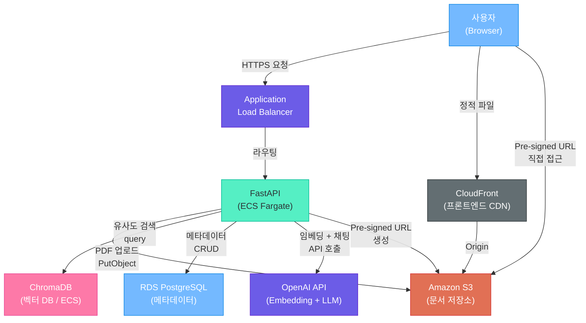
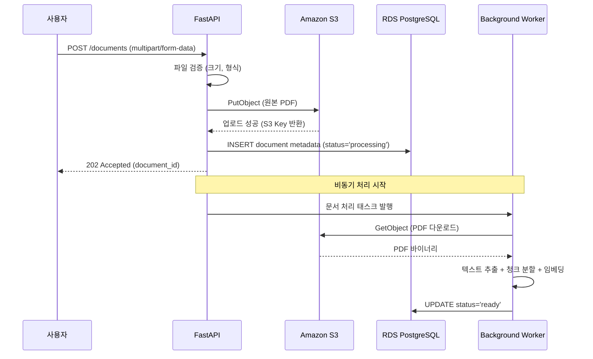
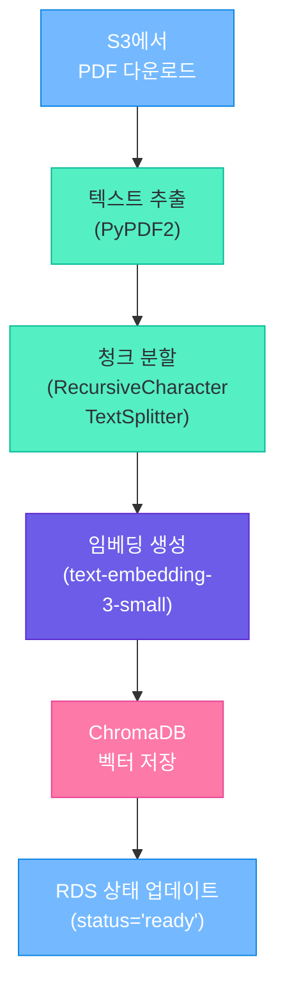
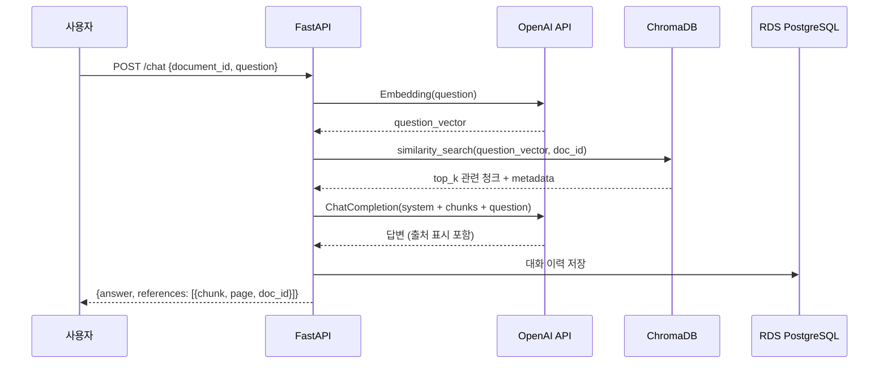
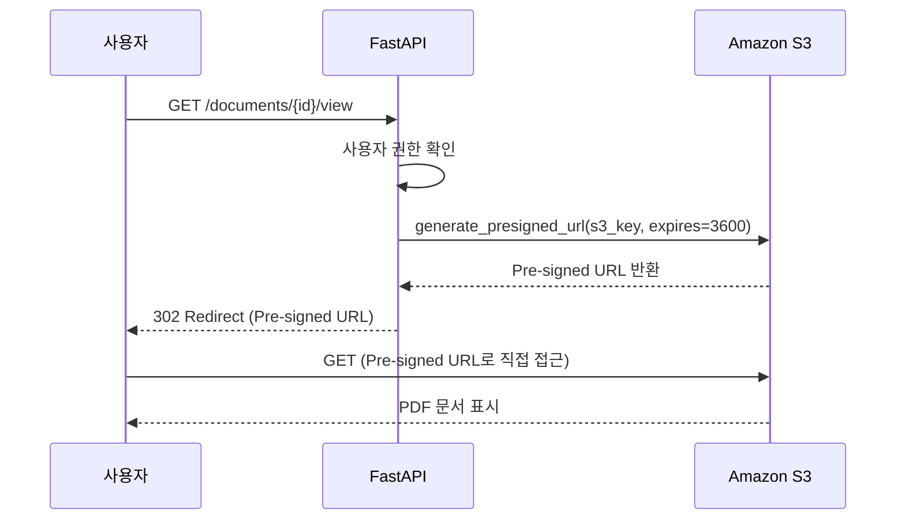
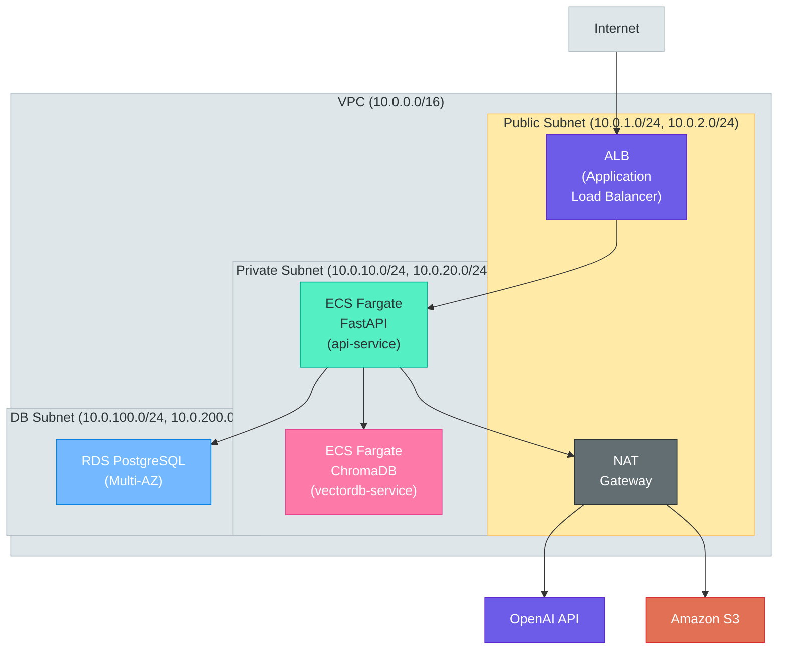
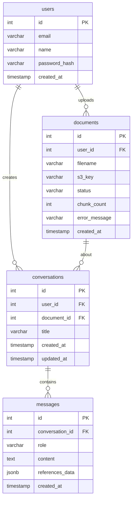
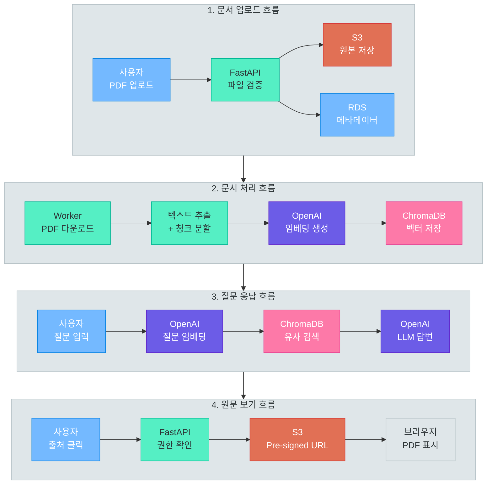

# 클라우드 RAG 애플리케이션 설계

> 배운 모든 것을 하나로 — 웹 개발, 데이터베이스, 생성형 AI, 클라우드 인프라를 결합하여 PDF 문서 기반 RAG Q&A 서비스를 설계합니다. S3 업로드부터 벡터 검색, LLM 응답 생성, Pre-signed URL 원문 보기까지 실전 아키텍처의 전체 흐름을 완성합니다.

---

## 1. 프로젝트 개요

### 만들어볼 서비스

**DocChat** — PDF 문서를 업로드하면 AI가 문서 내용을 기반으로 질문에 답변하는 서비스입니다.

회사 내부 규정집, 기술 문서, 논문 등을 업로드하고 자연어로 질문하면 문서 내용에서 관련 정보를 찾아 답변합니다. 답변에는 참고 출처가 포함되어, 사용자가 출처를 클릭하면 원본 PDF 문서를 직접 확인할 수 있습니다.

이 프로젝트는 실제로 동작하는 전체 코드를 작성하는 것이 아니라, **아키텍처 설계와 핵심 코드 흐름**에 집중합니다. 각 단계에서 어떤 기술이 왜 사용되는지, 데이터가 어떻게 흘러가는지를 이해하는 것이 목표입니다.

### 핵심 기능

| 순서 | 기능 | 설명 |
|:----:|------|------|
| 1 | 문서 업로드 | 사용자가 PDF를 업로드하면 S3에 안전하게 저장 |
| 2 | 문서 처리 | 텍스트 추출 → 청크 분할 → 벡터 임베딩 → ChromaDB 저장 |
| 3 | 질문 응답 | RAG 파이프라인으로 관련 청크 검색 → LLM이 답변 생성 → 참고 출처 표시 |
| 4 | 원문 보기 | Pre-signed URL로 S3의 원본 PDF에 임시 접근 허용 |

### 전체 아키텍처

이 다이어그램은 DocChat 서비스의 전체 구성요소와 데이터 흐름을 보여줍니다. 사용자 요청이 ALB를 거쳐 FastAPI로 전달되고, 문서는 S3에 저장되며, 벡터 검색과 LLM 호출을 통해 답변이 생성됩니다.



### 이 프로젝트에서 사용하는 기술 스택

DocChat은 전체 과정에서 학습한 기술을 통합합니다. 각 기술이 어떤 모듈에서 학습했는지 함께 정리합니다.

| 기술 | 역할 | 학습 모듈 |
|------|------|-----------|
| **FastAPI** | 백엔드 REST API 서버 | 03 Python 웹 개발 |
| **Pydantic** | 요청/응답 데이터 검증 | 03 Python 웹 개발 |
| **PostgreSQL** | 문서 메타데이터, 대화 이력 저장 | 04 데이터베이스 |
| **SQLAlchemy** | ORM을 통한 DB 접근 | 04 데이터베이스 |
| **OpenAI API** | 텍스트 임베딩 + LLM 답변 생성 | 05 GenAI 고급 |
| **LangChain** | RAG 파이프라인 구성 | 05 GenAI 고급 |
| **ChromaDB** | 벡터 유사도 검색 | 05 GenAI 고급 |
| **Docker** | 애플리케이션 컨테이너화 | 07 클라우드 |
| **Amazon S3** | PDF 문서 원본 저장소 | 07 클라우드 |
| **ECS Fargate** | 컨테이너 서버리스 실행 | 07 클라우드 |
| **ALB** | HTTPS 트래픽 로드밸런싱 | 07 클라우드 |
| **RDS** | 관리형 PostgreSQL 데이터베이스 | 07 클라우드 |
| **CloudWatch** | 로그 수집 및 모니터링 | 07 클라우드 |

> **핵심 포인트:** 하나의 서비스를 설계하는 데 웹 프레임워크, 데이터베이스, AI, 클라우드 인프라가 모두 필요합니다. 각 기술을 개별적으로 아는 것과 이들을 **하나의 아키텍처로 통합**하는 것은 전혀 다른 역량입니다. 이 설계 과정을 통해 그 통합 역량을 갖추게 됩니다.

---

## 2. 문서 업로드 흐름

### 업로드 시퀀스 다이어그램

사용자가 PDF 파일을 업로드하면 FastAPI가 파일을 검증하고, S3에 저장한 뒤, 메타데이터를 RDS에 기록합니다. 문서 처리는 비동기로 진행되어 사용자는 즉시 응답을 받습니다.



### FastAPI 업로드 엔드포인트

업로드 API의 핵심 흐름입니다. 파일 검증, S3 업로드, 메타데이터 저장, 비동기 처리 시작이 순차적으로 진행됩니다.

```python
from uuid import uuid4
from fastapi import APIRouter, File, UploadFile, HTTPException, Depends, BackgroundTasks
from sqlalchemy.ext.asyncio import AsyncSession

router = APIRouter()

@router.post("/documents", status_code=202)
async def upload_document(
    file: UploadFile = File(...),
    background_tasks: BackgroundTasks = BackgroundTasks(),
    db: AsyncSession = Depends(get_db),
    s3: S3Client = Depends(get_s3_client),
    current_user: User = Depends(get_current_user),
):
    """PDF 문서를 업로드하고 비동기 처리를 시작합니다."""

    # 1. 파일 검증
    if not file.filename.endswith('.pdf'):
        raise HTTPException(400, "PDF 파일만 업로드 가능합니다")
    if file.size > 50 * 1024 * 1024:  # 50MB 제한
        raise HTTPException(400, "파일 크기는 50MB 이하여야 합니다")

    # 2. S3 업로드 — UUID 기반 경로로 파일명 충돌 방지
    s3_key = f"documents/{uuid4()}/{file.filename}"
    await s3.upload_fileobj(file.file, BUCKET_NAME, s3_key)

    # 3. 메타데이터를 RDS에 저장
    document = Document(
        filename=file.filename,
        s3_key=s3_key,
        status="processing",
        uploaded_by=current_user.id,
    )
    db.add(document)
    await db.commit()
    await db.refresh(document)

    # 4. 비동기 문서 처리 시작 (Background Task)
    background_tasks.add_task(process_document, document.id)

    return {"document_id": document.id, "status": "processing"}
```

### S3 버킷 설정

문서 저장소로 사용하는 S3 버킷은 보안과 비용 최적화를 모두 고려하여 설정합니다.

| 설정 항목 | 값 | 이유 |
|----------|-----|------|
| **퍼블릭 액세스** | 전체 차단 (Block All Public Access) | Pre-signed URL로만 접근 허용 |
| **기본 암호화** | SSE-S3 (AES-256) | 저장 데이터 자동 암호화 |
| **버전 관리** | 활성화 | 실수로 삭제해도 복원 가능 |
| **생명주기 정책** | 90일 후 IA, 365일 후 Glacier | 오래된 문서 자동 비용 절감 |
| **CORS 설정** | FastAPI 도메인만 허용 | 브라우저 직접 업로드 시 필요 |

> **핵심 포인트:** S3 버킷은 반드시 퍼블릭 액세스를 차단하세요. 문서에 접근해야 할 때는 Pre-signed URL을 생성하여 시간 제한이 있는 임시 접근 권한을 부여합니다. CORS 설정에서 `AllowedOrigins`를 FastAPI 도메인으로 제한하여 브라우저 직접 업로드 시 보안을 확보합니다.

---

## 3. 문서 처리 파이프라인

### 처리 흐름

업로드된 PDF 문서는 다음 파이프라인을 통해 벡터 데이터베이스에 저장됩니다. 각 단계가 순차적으로 실행되며, 최종적으로 문서 상태가 `ready`로 변경됩니다.



### 문서 처리 코드

아래는 문서 처리 파이프라인의 핵심 코드입니다. S3에서 PDF를 다운로드하고, 텍스트를 추출하여 청크로 분할한 뒤, 임베딩을 생성하여 ChromaDB에 저장합니다.

```python
import io
from langchain.text_splitter import RecursiveCharacterTextSplitter
from pypdf import PdfReader

async def process_document(document_id: int):
    """비동기 문서 처리 — S3에서 PDF를 받아 벡터 DB에 저장합니다."""
    async with get_db_session() as db:
        doc = await db.get(Document, document_id)

        try:
            # 1. S3에서 PDF 다운로드
            response = await s3.get_object(Bucket=BUCKET_NAME, Key=doc.s3_key)
            pdf_bytes = await response['Body'].read()

            # 2. 텍스트 추출 (페이지 번호 보존)
            reader = PdfReader(io.BytesIO(pdf_bytes))
            pages = []
            for page_num, page in enumerate(reader.pages, start=1):
                text = page.extract_text()
                if text.strip():
                    pages.append({"text": text, "page": page_num})

            # 3. 청크 분할
            splitter = RecursiveCharacterTextSplitter(
                chunk_size=500,
                chunk_overlap=50,
                separators=["\n\n", "\n", ". ", " ", ""]
            )

            chunks = []
            for page_info in pages:
                page_chunks = splitter.split_text(page_info["text"])
                for chunk_text in page_chunks:
                    chunks.append({
                        "text": chunk_text,
                        "page": page_info["page"],
                        "doc_id": document_id,
                    })

            # 4. 임베딩 생성 + ChromaDB 저장
            collection = chroma_client.get_or_create_collection("documents")
            collection.add(
                documents=[c["text"] for c in chunks],
                metadatas=[{"doc_id": c["doc_id"], "page": c["page"]} for c in chunks],
                ids=[f"{document_id}_chunk_{i}" for i in range(len(chunks))],
            )

            # 5. 상태 업데이트
            doc.status = "ready"
            doc.chunk_count = len(chunks)
            await db.commit()

        except Exception as e:
            doc.status = "failed"
            doc.error_message = str(e)
            await db.commit()
            raise
```

### 청크 전략 비교

청크 크기와 오버랩 설정은 RAG 검색 품질에 직접적인 영향을 줍니다. 프로젝트 특성에 맞는 전략을 선택해야 합니다.

| 청크 크기 | 오버랩 | 장점 | 단점 | 적합한 문서 유형 |
|----------|--------|------|------|----------------|
| 200자 | 20자 | 정밀한 검색, 구체적 답변 | 맥락 부족, 청크 수 많음 | FAQ, 용어 사전 |
| **500자** | **50자** | 맥락과 정밀도의 균형 | 범용적, 튜닝 필요 | **일반 문서 (권장)** |
| 1000자 | 100자 | 풍부한 맥락, 연속성 유지 | 검색 노이즈 증가 | 논문, 기술 문서 |
| 2000자 | 200자 | 전체 맥락 보존 | 토큰 비용 증가, 정밀도 저하 | 장문 보고서 |

> **핵심 포인트:** 청크 크기 500자, 오버랩 50자는 대부분의 비즈니스 문서에 적합한 기본값입니다. 하지만 최적의 설정은 문서 유형에 따라 다릅니다. 실제 운영에서는 다양한 설정으로 실험하고, 사용자 피드백을 기반으로 조정해야 합니다.

---

## 4. RAG 기반 질문 응답

### 질의 응답 시퀀스 다이어그램

사용자가 질문을 입력하면 질문을 임베딩하고, ChromaDB에서 유사한 청크를 검색한 뒤, LLM이 검색된 맥락을 기반으로 답변을 생성합니다.



### RAG 응답 생성 코드

질문-응답 API의 핵심 흐름입니다. 질문 임베딩, 유사 청크 검색, LLM 응답 생성, 참고 출처 구성이 순차적으로 실행됩니다.

```python
from pydantic import BaseModel
from openai import AsyncOpenAI

openai_client = AsyncOpenAI()

class ChatRequest(BaseModel):
    document_id: int
    question: str

class Reference(BaseModel):
    chunk_text: str
    page: int
    document_id: int

class ChatResponse(BaseModel):
    answer: str
    references: list[Reference]

@router.post("/chat", response_model=ChatResponse)
async def chat(request: ChatRequest, db: AsyncSession = Depends(get_db)):
    """문서 기반 질문에 RAG로 답변합니다."""

    # 1. 질문 임베딩
    q_embedding = await openai_client.embeddings.create(
        input=request.question,
        model="text-embedding-3-small",
    )

    # 2. ChromaDB에서 유사 청크 검색
    collection = chroma_client.get_collection("documents")
    results = collection.query(
        query_embeddings=[q_embedding.data[0].embedding],
        where={"doc_id": request.document_id},
        n_results=5,
    )

    # 3. LLM 응답 생성 — 검색된 청크를 컨텍스트로 전달
    context_parts = []
    for i, doc in enumerate(results["documents"][0]):
        page = results["metadatas"][0][i]["page"]
        context_parts.append(f"[출처 {i+1}] (p.{page})\n{doc}")
    context = "\n---\n".join(context_parts)

    response = await openai_client.chat.completions.create(
        model="gpt-4o-mini",
        messages=[
            {"role": "system", "content": SYSTEM_PROMPT},
            {"role": "user", "content": f"Context:\n{context}\n\nQuestion: {request.question}"},
        ],
        temperature=0.3,
    )

    # 4. 참고 출처 구성
    references = [
        Reference(
            chunk_text=doc[:100] + "..." if len(doc) > 100 else doc,
            page=meta["page"],
            document_id=meta["doc_id"],
        )
        for doc, meta in zip(results["documents"][0], results["metadatas"][0])
    ]

    # 5. 대화 이력 저장
    message = Message(
        conversation_id=request.document_id,
        role="assistant",
        content=response.choices[0].message.content,
        references=[r.model_dump() for r in references],
    )
    db.add(message)
    await db.commit()

    return ChatResponse(
        answer=response.choices[0].message.content,
        references=references,
    )
```

### 프롬프트 설계

LLM이 문서 내용만을 기반으로 답변하고, 출처를 명확하게 표시하도록 시스템 프롬프트를 설계합니다.

```python
SYSTEM_PROMPT = """당신은 문서 기반 Q&A 어시스턴트입니다. 다음 규칙을 반드시 지켜주세요:

1. 제공된 Context(문맥) 정보만을 기반으로 답변하세요.
2. 답변에 사용한 정보의 출처를 [출처 1], [출처 2] 형식으로 반드시 표시하세요.
3. Context에서 관련 내용을 찾을 수 없는 경우, 반드시 다음과 같이 답변하세요:
   "제공된 문서에서 관련 내용을 찾을 수 없습니다."
4. 추측하거나 Context에 없는 정보를 만들어내지 마세요.
5. 답변은 명확하고 구조화된 한국어로 작성하세요.
6. 여러 출처에서 정보를 조합하는 경우, 각 정보마다 출처를 개별적으로 표시하세요.

답변 형식 예시:
퇴직금은 1년 이상 근속한 직원에게 지급됩니다 [출처 1].
계산 방식은 30일분의 평균임금에 근속연수를 곱한 금액입니다 [출처 2]."""
```

프롬프트 설계에서 중요한 원칙 세 가지입니다.

| 원칙 | 설명 | 효과 |
|------|------|------|
| **근거 기반 답변** | Context 정보만 사용하도록 제한 | 환각(Hallucination) 방지 |
| **출처 명시** | [출처 N] 마커로 참조 표시 강제 | 답변의 신뢰성 확보 |
| **모름 응답 허용** | 정보가 없으면 솔직하게 답변 | 잘못된 정보 전달 방지 |

### 응답 예시

실제 API 응답은 다음과 같은 JSON 구조로 반환됩니다.

```json
{
    "answer": "퇴직금은 1년 이상 근속한 직원에게 지급됩니다 [출처 1]. 계산 방식은 30일분의 평균임금에 근속연수를 곱한 금액입니다 [출처 2]. 단, 수습 기간은 근속연수에 포함되지 않습니다 [출처 3].",
    "references": [
        {
            "chunk_text": "퇴직금 지급 조건: 1년 이상 계속 근로한 근로자에게 퇴직금을 지급한다...",
            "page": 15,
            "document_id": 42
        },
        {
            "chunk_text": "퇴직금 산정 기준: 30일분의 평균임금에 근속연수를 곱하여 산출한다...",
            "page": 16,
            "document_id": 42
        },
        {
            "chunk_text": "수습 기간 관련 규정: 수습 기간(최대 3개월)은 퇴직금 산정을 위한...",
            "page": 17,
            "document_id": 42
        }
    ]
}
```

> **핵심 포인트:** RAG 시스템에서 가장 중요한 것은 **검색 품질**입니다. LLM이 아무리 뛰어나도 관련 없는 청크가 검색되면 좋은 답변을 생성할 수 없습니다. 청크 분할 전략, 임베딩 모델 선택, 유사도 검색 파라미터(n_results)를 실험적으로 최적화해야 합니다.

---

## 5. 원문 보기: Pre-signed URL

### Pre-signed URL이란

S3 버킷은 Private으로 설정되어 외부에서 직접 접근할 수 없습니다. 하지만 사용자가 원본 문서를 확인해야 하는 경우가 있습니다. 이때 **Pre-signed URL**을 사용합니다.

Pre-signed URL은 S3 객체에 **시간 제한 접근 권한**을 부여하는 서명된 URL입니다. URL 자체에 인증 정보(Signature)와 만료 시간(Expires)이 포함되어 있어, 이 URL을 가진 사람은 별도의 AWS 자격 증명 없이도 해당 객체에 접근할 수 있습니다.

```
일반 S3 URL:     https://bucket.s3.amazonaws.com/doc/report.pdf → 403 Forbidden
Pre-signed URL:  https://bucket.s3.amazonaws.com/doc/report.pdf
                   ?X-Amz-Algorithm=AWS4-HMAC-SHA256
                   &X-Amz-Expires=3600&X-Amz-Signature=a1b2c3...
                 → 200 OK (1시간 동안 유효)
```

### Pre-signed URL 흐름

사용자가 참고 출처의 "원문 보기" 링크를 클릭하면, FastAPI가 Pre-signed URL을 생성하고 사용자를 해당 URL로 리다이렉트합니다. 사용자는 S3에서 직접 PDF를 다운로드합니다.



### Pre-signed URL 생성 코드

```python
import boto3
from fastapi.responses import RedirectResponse

s3_client = boto3.client('s3', region_name='ap-northeast-2')

@router.get("/documents/{document_id}/view")
async def view_document(
    document_id: int,
    db: AsyncSession = Depends(get_db),
    current_user: User = Depends(get_current_user),
):
    """Pre-signed URL을 생성하여 원본 PDF에 임시 접근을 허용합니다."""

    # 1. 문서 조회 및 권한 확인
    document = await db.get(Document, document_id)
    if not document:
        raise HTTPException(404, "문서를 찾을 수 없습니다")
    if document.uploaded_by != current_user.id:
        raise HTTPException(403, "이 문서에 접근할 권한이 없습니다")

    # 2. Pre-signed URL 생성 (1시간 유효)
    presigned_url = s3_client.generate_presigned_url(
        'get_object',
        Params={
            'Bucket': BUCKET_NAME,
            'Key': document.s3_key,
            'ResponseContentType': 'application/pdf',
        },
        ExpiresIn=3600,  # 1시간 = 3600초
    )

    # 3. 사용자를 Pre-signed URL로 리다이렉트
    return RedirectResponse(url=presigned_url)


```

### Pre-signed URL 보안 가이드

| 보안 항목 | 설정 | 이유 |
|----------|------|------|
| **만료 시간 — 문서 보기** | 3600초 (1시간) | 사용자가 문서를 읽을 충분한 시간 |
| **만료 시간 — 다운로드** | 900초 (15분) | 다운로드는 빠르게 완료되므로 짧게 설정 |
| **HTTPS 강제** | 버킷 정책에 `aws:SecureTransport` 조건 추가 | URL 스니핑을 통한 탈취 방지 |
| **IP 제한** | VPN/사내망 IP만 허용 (선택) | 외부 유출 시 접근 불가 |
| **최소 권한** | `s3:GetObject`만 부여 | 삭제, 수정 등 다른 작업 불가 |

HTTPS를 강제하려면 버킷 정책에 `"Condition": {"Bool": {"aws:SecureTransport": "false"}}`로 HTTP 접근을 Deny하는 Statement를 추가합니다.

### 사용자 경험 — 답변에서 원문 보기까지

사용자가 실제로 경험하는 화면 흐름입니다. 답변의 출처를 클릭하면 Pre-signed URL을 통해 원본 PDF를 브라우저에서 바로 확인할 수 있습니다.

```
┌──────────────────────────────────────────────────┐
│  DocChat - AI 문서 Q&A                            │
│                                                  │
│  [문서] 회사 인사규정.pdf  (처리완료)              │
│                                                  │
│  사용자: "퇴직금 계산 방법이 어떻게 되나요?"       │
│                                                  │
│  AI: 퇴직금은 1년 이상 근속한 직원에게             │
│      지급됩니다 [출처 1]. 계산 방식은              │
│      30일분의 평균임금에 근속연수를 곱한           │
│      금액입니다 [출처 2].                         │
│                                                  │
│  참고 출처:                                       │
│  [출처 1] p.15 - 퇴직금 지급 조건  [원문보기]     │
│  [출처 2] p.16 - 퇴직금 산정 기준  [원문보기]     │
│                                                  │
│  * "원문보기" 클릭 → Pre-signed URL로 PDF 열림    │
│  * 링크는 1시간 동안 유효합니다                    │
└──────────────────────────────────────────────────┘
```

> **핵심 포인트:** Pre-signed URL의 핵심 가치는 **보안과 편의성의 균형**입니다. 버킷은 Private으로 유지하여 무단 접근을 차단하면서도, 인증된 사용자에게는 시간 제한이 있는 임시 접근 권한을 부여합니다. AWS SDK가 URL에 서명을 자동으로 포함시키므로 별도의 인증 서버 구축이 필요 없습니다.

---

## 6. AWS 인프라 구성

### VPC 네트워크 설계

DocChat 서비스의 네트워크는 3계층 구조로 설계합니다. ALB는 Public Subnet에, 애플리케이션 컨테이너는 Private Subnet에, 데이터베이스는 DB Subnet에 배치하여 보안을 강화합니다.



**네트워크 설계 요약:**

| 계층 | 서브넷 | 배치 리소스 | 인터넷 접근 |
|------|--------|-----------|------------|
| Public | 10.0.1.0/24, 10.0.2.0/24 | ALB, NAT Gateway | 직접 가능 (Internet Gateway) |
| Private | 10.0.10.0/24, 10.0.20.0/24 | FastAPI ECS, ChromaDB ECS | NAT Gateway 경유 (아웃바운드만) |
| DB | 10.0.100.0/24, 10.0.200.0/24 | RDS PostgreSQL | 불가 (Private Subnet에서만 접근) |

### ECS 서비스 구성

| 서비스 | 컨테이너 이미지 | CPU | Memory | 오토스케일링 | 최소/최대 태스크 |
|--------|---------------|-----|--------|------------|----------------|
| **api-service** | FastAPI 앱 | 1 vCPU | 2 GB | 요청 수 기반 (ALB RequestCount) | 2 / 10 |
| **vectordb-service** | ChromaDB | 2 vCPU | 4 GB | 고정 (스케일링 없음) | 1 / 1 |

api-service는 트래픽에 따라 자동으로 태스크 수가 조절되고, vectordb-service는 벡터 DB의 데이터 일관성을 위해 단일 인스턴스로 운영합니다.

### Docker Compose — 로컬 개발 환경

클라우드에 배포하기 전에 로컬에서 전체 서비스를 테스트할 수 있는 Docker Compose 설정입니다.

```yaml
version: '3.8'
services:
  api:
    build: .
    ports: ["8000:8000"]
    environment:
      - DATABASE_URL=postgresql+asyncpg://docchat:${DB_PASSWORD}@db:5432/docchat
      - S3_BUCKET=${S3_BUCKET_NAME}
      - OPENAI_API_KEY=${OPENAI_API_KEY}
      - CHROMA_HOST=chromadb
      - CHROMA_PORT=8000
    depends_on: [db, chromadb]

  chromadb:
    image: chromadb/chroma:latest
    ports: ["8100:8000"]
    volumes: ["chroma_data:/chroma/chroma"]
    environment:
      - IS_PERSISTENT=TRUE

  db:
    image: postgres:16
    environment:
      POSTGRES_DB: docchat
      POSTGRES_USER: docchat
      POSTGRES_PASSWORD: ${DB_PASSWORD}
    ports: ["5432:5432"]
    volumes: ["pg_data:/var/lib/postgresql/data"]

volumes:
  chroma_data:
  pg_data:
```

### S3 + CloudFront 구성

| 구성 요소 | 역할 | 비고 |
|----------|------|------|
| **S3 버킷** | PDF 문서 원본 저장 | Private 버킷, Pre-signed URL로만 접근 |
| **CloudFront** | 프론트엔드 정적 파일 배포 (Optional) | React/Vue SPA 배포용 |
| **Pre-signed URL** | S3에 직접 접근 | CloudFront를 경유하지 않음 |

Pre-signed URL은 S3 직접 접근 방식이므로 CloudFront와는 별개입니다. CloudFront는 프론트엔드 애플리케이션(HTML, CSS, JS)을 배포할 때 사용합니다.

> **핵심 포인트:** Private Subnet의 ECS 태스크가 S3, OpenAI API 등 외부 서비스에 접근하려면 **NAT Gateway**가 필요합니다. NAT Gateway는 월 약 $35의 고정 비용이 발생하므로 비용 계획에 반드시 포함하세요. 또한 S3는 VPC Endpoint를 사용하면 NAT Gateway 없이도 접근할 수 있어 비용을 절감할 수 있습니다.

---

## 7. 데이터베이스 설계

### ERD (Entity Relationship Diagram)

DocChat의 데이터베이스는 사용자, 문서, 대화, 메시지 4개의 핵심 테이블로 구성됩니다.



### 핵심 테이블 DDL

```sql
-- 사용자 테이블
CREATE TABLE users (
    id SERIAL PRIMARY KEY,
    email VARCHAR(255) UNIQUE NOT NULL,
    name VARCHAR(100) NOT NULL,
    password_hash VARCHAR(255) NOT NULL,
    created_at TIMESTAMP DEFAULT CURRENT_TIMESTAMP
);

-- 문서 테이블
CREATE TABLE documents (
    id SERIAL PRIMARY KEY,
    user_id INTEGER NOT NULL REFERENCES users(id),
    filename VARCHAR(500) NOT NULL,
    s3_key VARCHAR(1000) NOT NULL UNIQUE,
    status VARCHAR(20) NOT NULL DEFAULT 'processing',
    chunk_count INTEGER DEFAULT 0,
    error_message TEXT,
    created_at TIMESTAMP DEFAULT CURRENT_TIMESTAMP,
    CONSTRAINT chk_status CHECK (status IN ('processing', 'ready', 'failed'))
);

CREATE INDEX idx_documents_user_id ON documents(user_id);
CREATE INDEX idx_documents_status ON documents(status);

-- 대화 테이블
CREATE TABLE conversations (
    id SERIAL PRIMARY KEY,
    user_id INTEGER NOT NULL REFERENCES users(id),
    document_id INTEGER NOT NULL REFERENCES documents(id),
    title VARCHAR(200),
    created_at TIMESTAMP DEFAULT CURRENT_TIMESTAMP,
    updated_at TIMESTAMP DEFAULT CURRENT_TIMESTAMP
);

CREATE INDEX idx_conversations_user_id ON conversations(user_id);
CREATE INDEX idx_conversations_document_id ON conversations(document_id);

-- 메시지 테이블
CREATE TABLE messages (
    id SERIAL PRIMARY KEY,
    conversation_id INTEGER NOT NULL REFERENCES conversations(id) ON DELETE CASCADE,
    role VARCHAR(20) NOT NULL,
    content TEXT NOT NULL,
    references_data JSONB,
    created_at TIMESTAMP DEFAULT CURRENT_TIMESTAMP,
    CONSTRAINT chk_role CHECK (role IN ('user', 'assistant', 'system'))
);

CREATE INDEX idx_messages_conversation_id ON messages(conversation_id);
CREATE INDEX idx_messages_created_at ON messages(created_at);
```

> **핵심 포인트:** `references_data` 컬럼에 JSONB 타입을 사용합니다. 참고 출처의 구조가 유동적일 수 있고, PostgreSQL의 JSONB는 인덱싱과 쿼리가 가능하여 유연성과 성능을 모두 확보할 수 있습니다. SQLAlchemy ORM 모델은 이 DDL을 기반으로 `Column`, `relationship`, `ForeignKey`를 매핑하여 구성합니다.

---

## 8. 모니터링과 운영

### CloudWatch 대시보드 설계

DocChat 서비스 운영에 필요한 주요 모니터링 항목입니다. 서비스 건강 상태, 성능, 비용을 한눈에 파악할 수 있도록 대시보드를 구성합니다.

| 카테고리 | 메트릭 | 임계값 | 알람 액션 |
|---------|--------|--------|----------|
| **API 성능** | 응답 시간 (p50, p95, p99) | p99 > 5초 | SNS 알림 |
| **API 성능** | 5xx 오류율 | > 1% | SNS 알림 + PagerDuty |
| **문서 처리** | 문서 처리 시간 | > 120초 | SNS 알림 |
| **문서 처리** | 처리 실패율 | > 5% | SNS 알림 |
| **RAG 품질** | 벡터 검색 relevance score 평균 | < 0.3 | 로그 기록 |
| **인프라** | ECS CPU 사용률 | > 70% | Auto Scaling |
| **인프라** | ECS 메모리 사용률 | > 80% | SNS 알림 |
| **인프라** | RDS 연결 수 | > 80% max_connections | SNS 알림 |
| **외부 API** | OpenAI API 호출 횟수 | 일 10,000회 초과 | SNS 알림 |
| **외부 API** | OpenAI API 레이턴시 | > 10초 | 로그 기록 |
| **스토리지** | S3 Pre-signed URL 요청 횟수 | 비정상 급증 감지 | SNS 알림 |
| **비용** | 일별 OpenAI API 비용 | > $5/일 | SNS 알림 |

### 커스텀 메트릭 전송

기본 AWS 메트릭으로는 RAG 품질과 API 비용을 추적할 수 없습니다. 애플리케이션 코드에서 CloudWatch로 커스텀 메트릭을 직접 전송합니다.

```python
import boto3
from datetime import datetime, timezone

cloudwatch = boto3.client('cloudwatch', region_name='ap-northeast-2')

def send_rag_metrics(
    latency_ms: float,
    relevance_score: float,
    token_count: int,
    document_id: int,
):
    """RAG 파이프라인 실행 후 품질 및 성능 메트릭을 CloudWatch에 전송합니다."""
    timestamp = datetime.now(timezone.utc)

    cloudwatch.put_metric_data(
        Namespace='DocChat/RAG',
        MetricData=[
            {
                'MetricName': 'QueryLatency',
                'Timestamp': timestamp,
                'Value': latency_ms,
                'Unit': 'Milliseconds',
            },
            {
                'MetricName': 'RelevanceScore',
                'Timestamp': timestamp,
                'Value': relevance_score,
                'Unit': 'None',
            },
            {
                'MetricName': 'TokensUsed',
                'Timestamp': timestamp,
                'Value': token_count,
                'Unit': 'Count',
            },
        ],
    )
```

### 로그 구조화

모든 로그는 JSON 형식(`structlog` 등 활용)으로 출력하여 CloudWatch Logs Insights에서 효율적으로 분석할 수 있게 합니다. `document_uploaded`, `rag_query_completed`, `document_processing_failed` 등의 이벤트를 정의하고, `document_id`, `latency_ms`, `relevance_scores` 등의 필드를 포함하면 Logs Insights에서 다음과 같은 분석이 가능합니다.

```sql
-- RAG 질의 응답 평균 레이턴시 (5분 단위)
fields @timestamp, latency_ms
| filter event = "rag_query_completed"
| stats avg(latency_ms) as avg_latency,
        pct(latency_ms, 99) as p99_latency,
        count(*) as query_count
        by bin(5m)
| sort @timestamp asc
```

### 비용 예측

DocChat 서비스의 월간 예상 비용입니다. 중소 규모(일 100건 질의, 10건 문서 업로드) 기준으로 산출했습니다.

| 서비스 | 사양 | 월 비용 (예상) |
|--------|------|:-------------:|
| ECS Fargate (API) | 1 vCPU, 2GB x 2대 (24/7) | ~$60 |
| ECS Fargate (ChromaDB) | 2 vCPU, 4GB x 1대 (24/7) | ~$70 |
| RDS PostgreSQL | db.t3.micro, Multi-AZ 없음 | ~$15 |
| S3 | 100GB 저장 + 전송 | ~$5 |
| ALB | 1 ALB + LCU 요금 | ~$20 |
| OpenAI API | 임베딩 + GPT-4o-mini (일 100건) | ~$30 |
| NAT Gateway | 1 NAT + 데이터 전송 | ~$35 |
| CloudWatch | 로그 + 커스텀 메트릭 | ~$5 |
| **합계** | | **~$240/월** |

비용 절감 방법:

| 절감 전략 | 예상 절감액 | 비고 |
|----------|:----------:|------|
| S3 VPC Endpoint 사용 | ~$30/월 | NAT Gateway 대신 S3 무료 접근 |
| RDS Reserved Instance (1년) | ~$5/월 | 장기 약정 할인 |
| Fargate Spot (ChromaDB) | ~$30/월 | 중단 가능한 워크로드에 적용 |
| GPT-4o-mini 응답 캐싱 | ~$10/월 | 동일 질문 반복 시 캐시 히트 |

> **핵심 포인트:** 월 $240 중 NAT Gateway($35)가 의외로 큰 비중을 차지합니다. S3 접근에는 **VPC Endpoint(Gateway 타입, 무료)**를 반드시 설정하세요. 또한 OpenAI API 비용은 사용량에 비례하여 급격하게 증가할 수 있으므로, 일별 비용 알람을 설정하는 것이 중요합니다.

---

## 9. 핵심 정리

### 전체 데이터 흐름 요약

DocChat 서비스의 전체 데이터 흐름을 한눈에 정리합니다. 문서 업로드부터 질문 응답, 원문 보기까지 세 가지 주요 흐름이 있습니다.



### 아키텍처 설계 체크리스트

프로젝트를 실제로 구현할 때 각 단계별로 확인해야 할 항목을 정리합니다.

| 카테고리 | 항목 | 확인 |
|---------|------|:----:|
| **프론트엔드** | 파일 업로드 UI, 채팅 인터페이스, 원문 보기 링크 | ☐ |
| **백엔드 API** | POST /documents (업로드), POST /chat (RAG), GET /documents/{id}/view (Pre-signed URL) | ☐ |
| **백엔드 API** | JWT 인증 미들웨어 | ☐ |
| **문서 처리** | PDF 텍스트 추출 → 청크 분할 (500자/50자 오버랩) → 임베딩 → ChromaDB 저장 | ☐ |
| **RAG** | 시스템 프롬프트 설계 (출처 표시 강제), 유사도 검색 파라미터 튜닝 | ☐ |
| **데이터베이스** | ERD 및 테이블 생성, 인덱스 설정 (user_id, status, created_at) | ☐ |
| **인프라** | VPC 3-tier 구성, ECS Fargate, S3 (Private), ALB, RDS | ☐ |
| **모니터링** | CloudWatch 대시보드, 커스텀 메트릭, Billing 알람 | ☐ |
| **보안** | S3 퍼블릭 차단, HTTPS 강제, 환경 변수 API 키 관리 | ☐ |

### 확장 가능한 개선 사항

DocChat의 기본 아키텍처가 완성된 후, 다음과 같은 개선을 단계적으로 적용할 수 있습니다.

| 개선 사항 | 기술 | 효과 |
|----------|------|------|
| **비동기 문서 처리 큐** | Amazon SQS + Lambda | 대량 문서 업로드 시 안정적 처리 |
| **응답 캐싱** | ElastiCache (Redis) | 동일 질문 반복 시 즉시 응답, API 비용 절감 |
| **멀티 문서 크로스 검색** | ChromaDB where 조건 확장 | 여러 문서를 동시에 검색하여 종합 답변 |
| **사용자 피드백 수집** | 좋아요/싫어요 버튼 + RDS 저장 | 검색 품질 개선을 위한 데이터 축적 |
| **스트리밍 응답** | SSE (Server-Sent Events) | 답변이 실시간으로 타이핑되는 UX |
| **문서 형식 확장** | DOCX, PPT, HWP 파서 추가 | PDF 외 다양한 문서 형식 지원 |
| **하이브리드 검색** | 벡터 검색 + BM25 키워드 검색 | 의미 검색과 키워드 검색의 장점 결합 |
| **Re-ranking** | Cross-encoder 모델 | 초기 검색 결과를 재정렬하여 정확도 향상 |

이 과정에서 배운 기술들을 조합하면 DocChat과 같은 실전 서비스를 설계하고 구현할 수 있습니다. 중요한 것은 한 번에 완벽한 시스템을 만드는 것이 아니라, **핵심 기능부터 시작하여 점진적으로 개선**해 나가는 것입니다. 먼저 로컬 환경에서 Docker Compose로 동작을 확인하고, 이후 AWS에 단계적으로 배포하면서 모니터링과 비용 최적화를 적용하는 순서로 진행하세요.

---

> **이전 강의:** [모니터링과 비용 관리](09_monitoring_and_cost.md)
