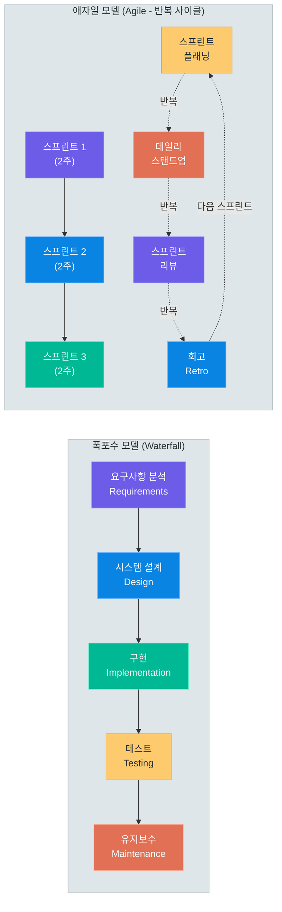
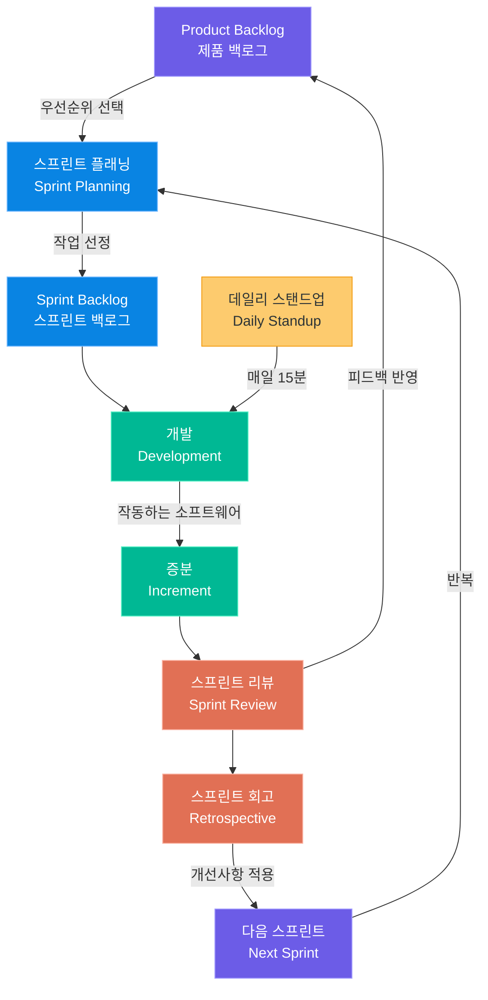
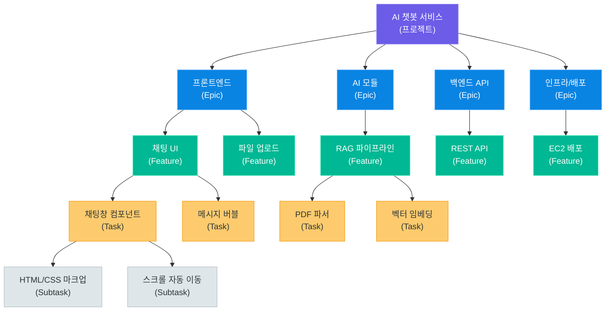
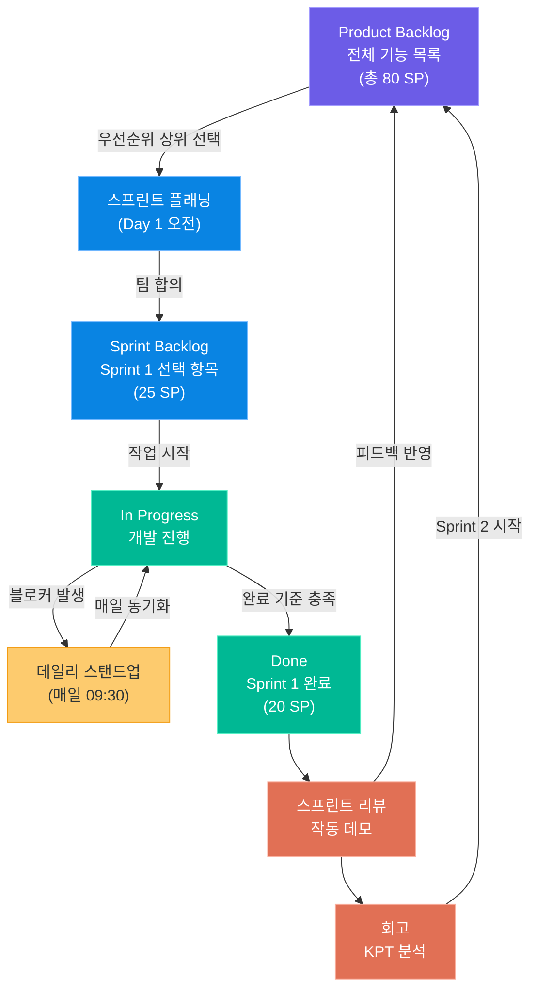

# 프로젝트 관리 방법론

> 12일 84시간 팀 프로젝트를 성공적으로 완수하기 위한 소프트웨어 개발 방법론의 이론과 실전 — 애자일/스크럼/칸반부터 WBS 작성, 간트 차트, 스프린트 플래닝까지 4~5인 AI 서비스 개발팀이 바로 적용할 수 있는 프로젝트 관리 완전 가이드

---

## 1. 소프트웨어 개발 방법론

### 방법론이란 무엇인가

소프트웨어 개발 방법론(Software Development Methodology)이란 소프트웨어를 어떤 순서와 방식으로 만들 것인가에 대한 **체계화된 접근법**입니다. 팀의 규모, 프로젝트의 성격, 요구사항의 확실성, 납기 일정 등 다양한 요인에 따라 적합한 방법론이 달라집니다.

방법론이 없는 팀은 각자 다른 방식으로 일하게 되어 협업 효율이 급격히 떨어집니다. 반면 팀 상황에 맞지 않는 방법론을 억지로 적용하면 오히려 생산성을 해칩니다. 핵심은 **팀의 상황을 정확히 파악하고 적합한 방법론을 선택하거나 조합**하는 것입니다.

---

### 폭포수 모델 (Waterfall)

폭포수 모델은 1970년대부터 사용된 전통적인 개발 방법론으로, 이름처럼 각 단계가 폭포처럼 순차적으로 흘러내립니다. 이전 단계가 완전히 완료되어야 다음 단계로 진행할 수 있습니다.

#### 폭포수 모델의 5단계

**1단계: 요구사항 분석 (Requirements Analysis)**

고객 또는 이해관계자로부터 시스템이 무엇을 해야 하는지를 수집하고 문서화합니다. 이 단계에서 요구사항 명세서(SRS: Software Requirements Specification)를 작성하며, 이후 모든 단계의 기준이 됩니다. 요구사항이 명확하지 않으면 이후 단계 전체가 흔들리기 때문에 가장 중요한 단계 중 하나입니다.

**2단계: 시스템 설계 (System Design)**

요구사항을 바탕으로 시스템 아키텍처, 데이터베이스 스키마, UI/UX 설계, API 설계 등을 수행합니다. 상위 수준 설계(High-Level Design)와 상세 설계(Low-Level Design)로 나뉘며, 개발자가 실제 코드를 작성하기 전 청사진(Blueprint)을 만드는 단계입니다.

**3단계: 구현 (Implementation)**

설계 문서를 기반으로 실제 코드를 작성합니다. 개발자들은 각자 맡은 모듈을 구현하며, 단위 테스트(Unit Test)를 병행합니다. 폭포수 모델에서는 이 단계가 시작되면 요구사항 변경이 매우 어렵습니다.

**4단계: 테스트 (Testing)**

구현된 소프트웨어가 요구사항을 충족하는지 검증합니다. 통합 테스트, 시스템 테스트, 사용자 수락 테스트(UAT)를 순서대로 진행합니다. 버그가 발견되면 구현 단계로 돌아가 수정 후 재테스트합니다.

**5단계: 유지보수 (Maintenance)**

소프트웨어가 배포된 후 발생하는 버그 수정, 성능 개선, 새로운 기능 추가 등을 담당합니다. 실제로 소프트웨어 비용의 60~80%가 유지보수에 사용된다는 연구 결과가 있습니다.



---

### 애자일 방법론 (Agile)

애자일(Agile)은 2001년 17명의 소프트웨어 개발자들이 모여 발표한 **애자일 선언문(Agile Manifesto)**에 기반한 개발 철학이자 방법론 군(群)입니다. 폭포수 모델의 경직성을 극복하고 변화에 빠르게 대응하는 것을 핵심 가치로 삼습니다.

#### 애자일 4가지 핵심 가치

| 우선하는 것 | vs | 덜 중요한 것 |
|---|:---:|---|
| **개인과 상호작용** | > | 프로세스와 도구 |
| **작동하는 소프트웨어** | > | 포괄적인 문서 |
| **고객과의 협력** | > | 계약 협상 |
| **변화에 대응** | > | 계획 따르기 |

> **핵심 포인트:** 애자일 선언문은 "오른쪽에 있는 것들도 가치가 있다"고 명시합니다. 문서와 계획을 무시하는 것이 아니라, 왼쪽의 것들을 더 높이 평가한다는 의미입니다.

#### 애자일 12원칙 요약

| 번호 | 원칙 | 핵심 의미 |
|:---:|---|---|
| 1 | 고객 만족 최우선 | 가치 있는 소프트웨어를 지속적으로 조기 제공 |
| 2 | 변화 환영 | 개발 후반부라도 요구사항 변경을 수용 |
| 3 | 자주 작동 소프트웨어 제공 | 2주~2개월 주기의 짧은 딜리버리 선호 |
| 4 | 매일 협업 | 비즈니스와 개발자가 함께 일함 |
| 5 | 동기 부여된 팀 | 신뢰와 지원 속에서 팀이 일하도록 환경 조성 |
| 6 | 대면 대화 | 정보 전달의 가장 효율적인 방법 |
| 7 | 작동 소프트웨어가 척도 | 진척의 주요 기준은 작동하는 소프트웨어 |
| 8 | 지속 가능한 개발 | 일정한 속도 유지, 무리한 야근 지양 |
| 9 | 기술적 탁월성 | 좋은 설계와 기술적 품질이 민첩성을 높임 |
| 10 | 단순성 | 하지 않아도 되는 일의 양을 최대화 |
| 11 | 자기조직화 팀 | 최고의 아키텍처/요구사항/설계는 자기조직화 팀에서 나옴 |
| 12 | 정기적 반성 | 팀이 어떻게 더 효과적이 될지 정기적으로 성찰 |

---

### 폭포수 vs 애자일 비교표

| 비교 항목 | 폭포수 (Waterfall) | 애자일 (Agile) |
|---|---|---|
| **개발 방식** | 순차적, 단방향 | 반복적, 점진적 |
| **요구사항 변경** | 매우 어려움 (비용 급증) | 언제든 수용 가능 |
| **고객 참여** | 초기 요구사항 수집 시만 | 전체 개발 과정에 지속 참여 |
| **결과물 확인** | 프로젝트 완료 시 | 매 스프린트마다 확인 |
| **위험 관리** | 후반부에 위험 집중 | 초기부터 지속적으로 완화 |
| **문서화** | 상세한 사전 문서 필수 | 꼭 필요한 문서만 |
| **팀 구조** | 역할 분리, 수직적 | 다기능팀, 자기조직화 |
| **테스트 시점** | 구현 완료 후 | 개발과 동시 진행 |
| **계획의 유연성** | 초기에 확정, 변경 어려움 | 스프린트 단위로 재계획 |
| **적합한 프로젝트 규모** | 대형, 장기 프로젝트 | 중소형, 단기~중기 |
| **적합한 요구사항 특성** | 명확하고 고정된 요구사항 | 불확실하고 변화 가능한 요구사항 |
| **대표 사례** | 항공기 소프트웨어, 정부 시스템 | 스타트업, 웹/앱 서비스 |

---

### 언제 어떤 방법론이 적합한가

**폭포수가 유리한 경우**

- 요구사항이 명확하게 정의되어 있고 변경 가능성이 낮을 때
- 규제가 엄격한 산업 (항공, 의료, 국방)에서 완전한 문서화가 필요할 때
- 팀 규모가 크고 지리적으로 분산되어 있을 때
- 계약 기반으로 명확한 납품 범위가 정해진 경우

**애자일이 유리한 경우**

- 요구사항이 자주 바뀌거나 초기에 완전히 파악하기 어려울 때
- 빠른 시장 출시(Time-to-Market)가 중요할 때
- 고객이 개발 과정에 적극적으로 참여할 수 있는 환경일 때
- 4~10인 이하의 소규모 팀에서 작업할 때
- **AI 서비스 개발**: 모델 성능이 실제로 써봐야 파악되고, 사용자 피드백이 중요한 경우

> **핵심 포인트:** 이번 팀 프로젝트는 12일이라는 짧은 기간 안에 AI 서비스를 완성해야 합니다. 요구사항은 개발하며 구체화되고, 팀 규모는 4~5인으로 작으며, 매일 진척 상황을 확인해야 합니다. 이는 애자일, 특히 스크럼(Scrum)이 최적인 환경입니다.

---

## 2. Scrum 프레임워크

### 스크럼이란

스크럼(Scrum)은 애자일 방법론을 구현하는 가장 대표적인 **프레임워크**입니다. 럭비에서 선수들이 팀을 이루어 스크럼을 짜는 것처럼, 작은 팀이 협력하여 복잡한 문제를 해결하는 방식을 소프트웨어 개발에 적용했습니다.

스크럼은 특정 기술이나 도구가 아니라 **역할(Roles), 이벤트(Events), 산출물(Artifacts)** 세 가지 요소로 구성됩니다.



---

### 스크럼의 3가지 역할 (Scrum Roles)

#### Product Owner (PO) — 제품 책임자

Product Owner는 제품의 **비전과 가치를 책임지는** 역할입니다. 팀 프로젝트에서는 보통 팀장 또는 서비스 기획 담당자가 맡습니다.

**핵심 책임**
- **Product Backlog 관리**: 해야 할 모든 작업 목록을 생성하고 최신 상태로 유지
- **우선순위 결정**: 비즈니스 가치, 위험도, 의존성을 고려하여 백로그 항목의 우선순위 설정
- **수락 기준 정의**: 각 User Story의 완료 기준을 명확히 정의
- **이해관계자 소통**: 팀 외부(강사, 클라이언트 역할)와의 소통 창구

| PO의 해야 할 일 | PO의 하지 말아야 할 일 |
|---|---|
| 백로그 우선순위를 매일 검토 | 개발팀에 구체적인 구현 방법 지시 |
| 스프린트 리뷰에서 결과 검토 | 스프린트 도중 목표 변경 |
| "완료"의 기준을 명확히 정의 | 백로그 없이 구두로만 요청 |
| 이해관계자 피드백 수집 | 팀의 역량을 무시한 과도한 요구 |

#### Scrum Master (SM) — 스크럼 마스터

Scrum Master는 팀이 **스크럼 프레임워크를 올바르게 이해하고 실행**하도록 돕는 서번트 리더(Servant Leader)입니다. 관리자가 아니라 코치이자 촉진자(Facilitator) 역할입니다.

**핵심 책임**
- **프로세스 가디언**: 스크럼의 이벤트가 제대로 진행되도록 진행 및 시간 관리
- **장애물 제거**: 팀의 생산성을 방해하는 요소(블로커)를 식별하고 제거
- **팀 보호**: 외부 방해나 범위 초과 요청으로부터 개발팀을 보호
- **지속적 개선**: 회고를 통해 팀의 프로세스를 지속적으로 개선

#### Development Team — 개발팀

Development Team은 실제로 제품을 만드는 **자기조직화된 다기능팀**입니다. 팀 프로젝트에서는 나머지 3~4인이 개발팀을 구성합니다.

**핵심 특성**
- **자기조직화(Self-Organizing)**: 어떻게 작업을 나누고 진행할지 스스로 결정
- **다기능(Cross-Functional)**: 프론트엔드, 백엔드, AI/ML, 인프라 등 다양한 역량 보유
- **집단 책임**: 개인이 아닌 팀 전체가 스프린트 목표에 대한 책임을 공유
- **3~9인 규모**: 너무 작으면 역량이 부족하고, 너무 크면 조율 비용 증가

> **핵심 포인트:** 4~5인 팀에서는 역할이 겹칠 수 있습니다. PO와 SM을 한 명이 겸직하거나, 스프린트마다 SM을 돌아가며 맡는 방식도 효과적입니다. 중요한 것은 역할의 명칭이 아니라 각 역할의 **책임이 명확히 부여되는 것**입니다.

---

### 스크럼의 5가지 이벤트 (Scrum Events)

#### 1. 스프린트 (Sprint)

스프린트는 스크럼의 **심장**입니다. 1~4주의 고정된 기간 동안 하나의 "완료된 증분(Increment)"을 만들어내는 반복 주기입니다. 팀 프로젝트에서는 **4일짜리 스프린트 3회** 또는 **3일짜리 스프린트 4회**를 운영합니다.

- 스프린트 기간은 시작 후 변경하지 않습니다
- 스프린트 목표(Sprint Goal)는 하나로 명확하게 정합니다
- 스프린트 도중 목표 달성이 불가능해지면 PO는 스프린트를 취소할 수 있습니다

#### 2. 스프린트 플래닝 (Sprint Planning)

스프린트 시작 시 팀 전체가 모여 **이번 스프린트에 무엇을 할지** 계획합니다.

| 구분 | 내용 |
|---|---|
| **참여자** | PO + SM + Development Team 전원 |
| **시간** | 스프린트 기간의 최대 8시간 (2주 스프린트 기준) / 팀 프로젝트: 1~2시간 |
| **산출물** | 스프린트 백로그, 스프린트 목표 |
| **주요 질문** | "이번 스프린트에서 무엇을 완료할 수 있는가?" / "어떻게 할 것인가?" |

#### 3. 데일리 스탠드업 (Daily Standup / Daily Scrum)

매일 같은 시간, 같은 장소에서 **15분** 이내로 진행하는 팀 동기화 회의입니다. 스탠드업이라는 이름처럼 서서 진행하면 회의가 길어지는 것을 방지할 수 있습니다.

**3가지 질문**
1. 어제 무엇을 했는가? (Yesterday I worked on...)
2. 오늘 무엇을 할 것인가? (Today I will work on...)
3. 진행을 막는 장애물이 있는가? (Blockers: ...)

**운영 팁 (12일 프로젝트용)**
- 매일 오전 9시 또는 9시 30분에 고정 진행
- 상세한 문제 해결은 스탠드업 이후 관련자끼리 별도 논의
- 번다운 차트를 화면에 띄워놓고 진행
- SM이 블로커를 기록하고 당일 중으로 해결 시도

#### 4. 스프린트 리뷰 (Sprint Review)

스프린트가 끝나면 팀이 **완성한 것을 시연**하고 이해관계자로부터 피드백을 받습니다.

| 구분 | 내용 |
|---|---|
| **참여자** | PO + SM + Dev Team + 이해관계자 (강사 포함) |
| **시간** | 스프린트 기간의 최대 4시간 / 팀 프로젝트: 30분~1시간 |
| **형식** | 실제 작동하는 소프트웨어 시연 (문서 발표 X) |
| **산출물** | 수정된 Product Backlog, 다음 스프린트 방향 |

#### 5. 스프린트 회고 (Sprint Retrospective)

스프린트 리뷰 직후, **팀 내부에서** 프로세스와 협업 방식을 돌아보는 시간입니다.

**회고 3가지 질문 (Keep-Problem-Try 방식)**
- **Keep**: 잘 되었던 것은 무엇인가? 계속 유지할 것은?
- **Problem**: 문제가 있었던 것은 무엇인가? 개선이 필요한 것은?
- **Try**: 다음 스프린트에서 시도해볼 것은?

---

### 스크럼의 3가지 산출물 (Scrum Artifacts)

#### Product Backlog (제품 백로그)

Product Backlog는 제품에 필요한 **모든 작업 항목의 우선순위 목록**입니다. 살아있는 문서(Living Document)로서 언제든 추가, 수정, 삭제될 수 있습니다.

**User Story 형식으로 작성:**
```
나는 [사용자 유형]으로서
[목표/원하는 것]을 하고 싶습니다
왜냐하면 [이유/가치] 때문입니다

수락 기준:
- [ ] 조건 1
- [ ] 조건 2
- [ ] 조건 3
```

**예시 (AI 챗봇 프로젝트):**
```
나는 사용자로서
내가 업로드한 PDF 파일에 대해 질문을 할 수 있기를 원합니다
왜냐하면 긴 문서를 직접 읽지 않고도 필요한 정보를 빠르게 찾고 싶기 때문입니다

수락 기준:
- [ ] PDF 파일 업로드 기능이 동작한다
- [ ] 업로드된 파일에서 텍스트가 추출된다
- [ ] 질문에 대한 답변이 5초 이내에 반환된다
- [ ] 답변에 출처 페이지 번호가 표시된다
```

#### Sprint Backlog (스프린트 백로그)

현재 스프린트에서 완료할 Product Backlog 항목과, 그 항목들을 구현하기 위한 **세부 작업 목록**입니다. 개발팀이 스스로 만들고 업데이트합니다.

#### Increment (증분)

스프린트가 끝날 때마다 만들어지는 **완료된, 실제로 사용 가능한 소프트웨어**입니다. "완료의 정의(Definition of Done)"를 만족해야 합니다.

**완료의 정의 예시 (팀 프로젝트용):**
- [ ] 기능이 수락 기준을 100% 충족한다
- [ ] 코드가 GitHub에 Push되고 PR이 승인되었다
- [ ] 기본 에러 처리가 구현되었다
- [ ] README에 해당 기능 사용법이 업데이트되었다
- [ ] 다른 팀원이 로컬에서 실행할 수 있다

---

## 3. 칸반 (Kanban)

### 칸반이란

칸반(Kanban)은 일본어로 "간판" 또는 "시각적 신호"를 의미합니다. 원래 도요타 자동차의 린(Lean) 생산 방식에서 유래했으며, 소프트웨어 개발에 적용된 것은 2000년대 초반입니다.

스크럼이 **시간 박스(스프린트)** 기반이라면, 칸반은 **흐름(Flow)** 기반입니다. 정해진 반복 주기가 없고, 작업이 완료되면 다음 작업을 당겨(Pull)서 진행합니다.

---

### 칸반 보드 구성

칸반 보드는 작업의 상태를 **시각적으로** 표현하는 도구입니다.

| Backlog | To Do | In Progress | Review | Done |
|:---:|:---:|:---:|:---:|:---:|
| 아이디어/요청 대기 | 이번 주 할 일 | 현재 진행 중 | 검토/테스트 중 | 완료 |
| [카드] | [카드] | [카드] | [카드] | [카드] |
| [카드] | [카드] | **WIP: 2** | **WIP: 1** | |
| [카드] | | | | |

**각 컬럼의 역할**
- **Backlog**: 아직 우선순위가 결정되지 않은 모든 아이디어와 요청
- **To Do**: 이번 주기에 처리하기로 결정된 작업 대기열
- **In Progress**: 현재 작업 중인 항목 (WIP 제한 적용)
- **Review**: 코드 리뷰, QA 테스트 등 완료 전 검증 단계
- **Done**: 완료의 정의를 충족하여 완전히 완료된 작업

---

### WIP (Work In Progress) 제한

WIP 제한은 **동시에 진행할 수 있는 작업의 최대 개수**를 정하는 칸반의 핵심 원칙입니다.

**WIP 제한이 필요한 이유**
- 멀티태스킹은 생산성을 낮춥니다. 연구에 따르면 동시에 2개의 프로젝트를 진행하면 각각에 집중할 수 있는 시간이 40%씩 감소합니다
- WIP가 많을수록 각 작업의 완료까지 걸리는 시간(Cycle Time)이 증가합니다
- 병목(Bottleneck)이 어디에 있는지 명확하게 드러납니다

**WIP 제한 설정 방법**
- 팀원 수의 1~2배로 시작 (4인 팀 → In Progress WIP: 4~6)
- Review 단계는 더 낮게 설정 (WIP: 2~3)
- 실제 운영하며 조정

**WIP 제한의 효과**

| 상황 | WIP 제한 없음 | WIP 제한 있음 |
|---|---|---|
| 작업 수 | 10개 동시 진행 | 최대 4개 동시 진행 |
| 집중도 | 분산됨 | 집중됨 |
| 완료 속도 | 느림 (모두 반쯤 완료 상태) | 빠름 (순차적으로 완료) |
| 병목 발견 | 어려움 | 쉽게 보임 |

---

### 흐름 관리: Lead Time과 Cycle Time

**Lead Time (리드 타임)**
- 정의: 고객이 요청한 시점부터 완료되어 전달되기까지의 총 시간
- 측정: 카드가 Backlog에 생성된 시점 → Done으로 이동한 시점
- 고객이 경험하는 대기 시간

**Cycle Time (사이클 타임)**
- 정의: 실제로 작업을 시작한 시점부터 완료까지 걸린 시간
- 측정: 카드가 In Progress로 이동한 시점 → Done으로 이동한 시점
- 팀의 실제 생산성을 나타냄

```
요청 발생 ───────────────────────────── 완료
│                          │               │
│←────── Lead Time ────────────────────►│
│         (전체 대기 시간)               │
         │←── Cycle Time ────►│
         │  (실제 작업 시간)  │
         작업 시작            완료
```

---

### 스크럼 vs 칸반 비교표

| 비교 항목 | 스크럼 (Scrum) | 칸반 (Kanban) |
|---|---|---|
| **반복 주기** | 고정된 스프린트 (1~4주) | 지속적인 흐름 (주기 없음) |
| **역할 정의** | PO, SM, Dev Team 명확히 구분 | 역할 구분 없음 |
| **변경 시점** | 스프린트 시작 전에만 변경 | 언제든지 우선순위 변경 가능 |
| **WIP 제한** | 간접적 (스프린트 용량으로 제한) | 명시적 WIP 제한 |
| **측정 지표** | 벨로시티, 번다운 차트 | Lead Time, Cycle Time, Throughput |
| **리트로스펙티브** | 스프린트마다 필수 | 선택적 |
| **계획 주기** | 스프린트 플래닝 | 지속적 (백로그 정제) |
| **적합한 팀** | 신규 팀, 명확한 목표 | 성숙한 팀, 지속적 운영 |
| **적합한 작업 유형** | 기능 개발, 프로젝트 | 운영/유지보수, 고객 지원 |

---

### Scrumban: 스크럼과 칸반의 결합

Scrumban은 스크럼의 구조(스프린트, 역할)와 칸반의 흐름 관리(WIP 제한, 시각화)를 결합한 하이브리드 접근법입니다.

**팀 프로젝트에서의 Scrumban 적용 예시**
- 스크럼의 이벤트(플래닝, 스탠드업, 리뷰, 회고)는 유지
- 칸반 보드를 사용하여 작업 상태를 시각화
- In Progress에 WIP 제한을 적용하여 집중도 향상
- 스프린트 중 긴급 버그가 발생하면 칸반 방식으로 즉시 처리

> **핵심 포인트:** 12일 팀 프로젝트에서는 스크럼 기반의 Scrumban 방식을 권장합니다. 4일 스프린트 3회를 기본으로 하되, 칸반 보드(GitHub Projects 또는 Notion)를 사용하여 일일 작업 흐름을 관리하면 협업 효율이 크게 높아집니다.

---

## 4. WBS (Work Breakdown Structure)

### WBS란 무엇인가

WBS(작업 분해 구조, Work Breakdown Structure)는 프로젝트의 전체 범위를 **관리 가능한 작은 단위로 계층적으로 분해**한 것입니다. 큰 목표를 점점 더 작은 작업 단위로 쪼개어, 모든 팀원이 무엇을 해야 하는지 명확히 이해하고 추적할 수 있게 합니다.

---

### WBS 작업 분해 기법

**100% 규칙 (100% Rule)**
- WBS의 각 수준에서 하위 항목들의 합은 상위 항목의 100%를 구성해야 합니다
- 누락된 작업이 없고, 중복된 작업도 없어야 합니다
- 예: "AI 챗봇 개발" = 프론트엔드(25%) + 백엔드(35%) + AI 모듈(30%) + 인프라(10%) = 100%

**상호 배타성 (Mutually Exclusive)**
- 각 작업 항목은 서로 겹치지 않아야 합니다
- "사용자 인증 개발"과 "로그인 페이지 개발"이 별도로 존재하면 범위가 중복됩니다
- 같은 작업이 두 사람에게 배정되는 것을 방지합니다

---

### WBS 계층 구조



**WBS 계층 정의**

| 계층 | 이름 | 설명 | 예시 |
|:---:|---|---|---|
| L0 | **프로젝트** | 전체 프로젝트 | AI 챗봇 서비스 |
| L1 | **Epic** | 주요 기능 영역 | 프론트엔드, 백엔드, AI 모듈 |
| L2 | **Feature** | 구체적인 기능 | 채팅 UI, RAG 파이프라인 |
| L3 | **Task** | 개별 작업 단위 | PDF 파서 구현 |
| L4 | **Subtask** | 세부 실행 항목 | PyPDF2로 텍스트 추출 코드 작성 |

---

### 작업 산정 방법

#### 스토리 포인트 (Story Points)

스토리 포인트는 작업의 **복잡도, 불확실성, 노력**을 상대적으로 나타내는 단위입니다. 시간이 아닌 상대적 크기를 표현합니다.

**피보나치 스케일 (Fibonacci Scale)**

피보나치 수열(1, 2, 3, 5, 8, 13, 21...)을 사용하는 이유는 숫자가 커질수록 불확실성도 커진다는 것을 자연스럽게 반영하기 때문입니다. 1과 2의 차이는 확신할 수 있지만, 20과 21의 차이는 의미가 없습니다.

| 스토리 포인트 | 의미 | 예시 작업 |
|:---:|---|---|
| **1** | 매우 작음, 30분~1시간 | 버튼 색상 변경, 텍스트 수정 |
| **2** | 작음, 반나절 | 간단한 API 엔드포인트 추가 |
| **3** | 보통, 하루 | 기본 로그인 기능 구현 |
| **5** | 큼, 2~3일 | PDF 업로드 및 파싱 기능 |
| **8** | 매우 큼, 3~5일 | RAG 파이프라인 전체 구현 |
| **13** | 불확실성 높음, 분해 필요 | 분해 후 재산정 권장 |
| **21+** | 에픽 수준, 즉시 분해 | 반드시 더 작은 단위로 쪼갤 것 |

#### 시간 기반 산정 vs 스토리 포인트 비교

| 항목 | 시간 기반 산정 | 스토리 포인트 |
|---|---|---|
| **장점** | 직관적, 일정 계산 용이 | 개인 역량 차이 무관, 상대적 크기 표현 |
| **단점** | 개인마다 시간 개념이 다름 | 처음에 추상적으로 느껴짐 |
| **적합한 상황** | 독립 작업, 명확한 작업 | 팀 작업, 불확실한 작업 |
| **팀 학습 곡선** | 낮음 | 중간 (몇 번 해보면 익숙해짐) |

> **핵심 포인트:** 12일 팀 프로젝트에서는 스토리 포인트와 시간 기반 산정을 함께 사용하는 것을 권장합니다. 스토리 포인트로 상대적 크기를 합의하고, 이를 실제 시간으로 환산하여 일정에 반영합니다.

---

### AI 프로젝트 WBS 예시 (AI 챗봇 서비스, 12일)

| Epic | Feature | Task | 담당자 | 스토리 포인트 | 스프린트 |
|---|---|---|---|:---:|:---:|
| **프론트엔드** | 채팅 UI | 채팅창 컴포넌트 개발 | A | 3 | 1 |
| | | 메시지 버블 (사용자/AI 구분) | A | 2 | 1 |
| | | 스트리밍 응답 표시 | A | 3 | 2 |
| | 파일 업로드 UI | 드래그앤드롭 파일 업로드 | A | 3 | 1 |
| | | 업로드 진행률 표시 | A | 2 | 2 |
| **백엔드 API** | 채팅 API | 채팅 엔드포인트 (/chat) | B | 3 | 1 |
| | | 스트리밍 응답 (SSE) | B | 5 | 2 |
| | | 대화 히스토리 관리 | B | 3 | 2 |
| | 파일 API | 파일 업로드 엔드포인트 | B | 2 | 1 |
| | | 파일 파싱 및 저장 | C | 3 | 1 |
| **AI 모듈** | RAG 파이프라인 | PDF 텍스트 청크 분할 | C | 3 | 1 |
| | | 임베딩 생성 및 저장 | C | 3 | 1 |
| | | 벡터 유사도 검색 | C | 3 | 2 |
| | | LLM 답변 생성 프롬프트 | C | 2 | 2 |
| | | 출처 인용 기능 | C | 2 | 2 |
| **인프라** | 개발 환경 | Docker Compose 설정 | D | 3 | 1 |
| | | 환경변수 관리 (.env) | D | 1 | 1 |
| | 배포 | EC2 서버 설정 | D | 3 | 2 |
| | | Nginx 리버스 프록시 | D | 2 | 3 |
| | | HTTPS 인증서 설정 | D | 2 | 3 |

---

## 5. 간트 차트 (Gantt Chart)

### 간트 차트란

간트 차트(Gantt Chart)는 헨리 간트(Henry Gantt)가 1910년대에 개발한 **막대형 일정 관리 도구**입니다. 프로젝트의 작업 목록을 세로축에, 시간을 가로축에 배치하여 각 작업의 시작/종료 시점과 진행 상황을 한눈에 파악할 수 있습니다.

---

### 일정 계획 수립 방법

**1단계: 작업 목록 완성**
WBS에서 도출한 Task/Subtask 수준의 작업 목록을 준비합니다.

**2단계: 작업 기간 산정**
각 작업에 필요한 기간을 산정합니다. 낙관적 추정과 비관적 추정의 평균을 사용하거나, 팀 경험을 기반으로 합의합니다.

**3단계: 의존성 파악**
작업 간의 선후 관계를 파악합니다.

**4단계: 담당자 배정**
각 작업에 담당자를 배정하고 과부하(Over-allocation) 여부를 확인합니다.

**5단계: 마일스톤 설정**
프로젝트의 중요 시점을 마일스톤으로 표시합니다.

---

### 작업 간 의존성 유형

| 의존성 유형 | 약어 | 설명 | 예시 |
|---|:---:|---|---|
| **Finish-to-Start** | FS | A가 완료되어야 B가 시작됨 (가장 일반적) | DB 설계 완료 → API 개발 시작 |
| **Start-to-Start** | SS | A가 시작되어야 B가 시작됨 | 개발 시작 → 테스트 케이스 작성 시작 |
| **Finish-to-Finish** | FF | A가 완료되어야 B가 완료됨 | 개발 완료 → 문서 작성 완료 |
| **Start-to-Finish** | SF | A가 시작되어야 B가 완료됨 (드문 경우) | 새 시스템 가동 → 구 시스템 종료 |

---

### 크리티컬 패스 (Critical Path)

크리티컬 패스(Critical Path)는 프로젝트를 완료하는 데 **가장 긴 경로**로, 여기에 있는 작업이 지연되면 전체 프로젝트가 지연됩니다.

**크리티컬 패스 파악 방법**
1. 모든 작업의 시작/완료 시점을 계산합니다 (Forward Pass)
2. 거꾸로 계산하여 각 작업의 여유 시간(Float)을 구합니다 (Backward Pass)
3. Float가 0인 작업들이 크리티컬 패스를 구성합니다

**팀 프로젝트 적용 팁**
- RAG 파이프라인 구현 → API 통합 → 프론트엔드 연결이 보통 크리티컬 패스
- 크리티컬 패스의 작업에 팀의 핵심 인력을 배치
- 크리티컬 패스 외 작업에 여유 시간(Buffer)이 얼마나 있는지 파악

---

### 마일스톤 설정 (12일 프로젝트 예시)

| 마일스톤 | 목표일 | 완료 기준 |
|---|:---:|---|
| M0: 킥오프 완료 | Day 1 | 서비스 기획서 확정, 팀 역할 분담 완료 |
| M1: 환경 설정 완료 | Day 2 | 개발 환경 구성, Git 저장소 설정 완료 |
| M2: MVP 백엔드 완료 | Day 5 | 핵심 API 동작, DB 연결 완료 |
| M3: MVP 통합 완료 | Day 8 | 프론트엔드-백엔드-AI 모듈 연동 완료 |
| M4: 베타 버전 배포 | Day 10 | EC2에 서비스 배포, 기본 기능 동작 |
| M5: 최종 발표 | Day 12 | 발표 자료 완성, 데모 준비 완료 |

---

### 간트 차트 도구 소개

| 도구 | 특징 | 무료 여부 | 팀 협업 |
|---|---|:---:|:---:|
| **GitHub Projects** | Git 연동, 이슈 기반 관리 | 무료 | 우수 |
| **Notion** | 타임라인 뷰, 자유로운 커스텀 | 무료(제한) | 우수 |
| **Jira** | 스크럼 전용 기능, 강력한 리포팅 | 유료(소규모 무료) | 우수 |
| **Trello** | 간단한 칸반 보드, 직관적 | 무료(제한) | 보통 |
| **Asana** | 타임라인 + 워크플로우 자동화 | 유료(제한 무료) | 우수 |
| **GanttProject** | 데스크톱 앱, 간트 차트 특화 | 무료 | 미흡 |

> **핵심 포인트:** 팀 프로젝트에서는 **GitHub Projects**를 기본으로 사용할 것을 권장합니다. 코드 저장소와 같은 플랫폼에서 이슈(작업), 마일스톤, 칸반 보드를 모두 관리할 수 있어 컨텍스트 스위칭 없이 작업 관리가 가능합니다.

---

### 간트 차트 읽는 법

**기본 구성 요소**
- **막대(Bar)**: 작업의 기간을 나타냄. 막대 길이 = 작업 기간
- **색상**: 담당자별 또는 Epic별로 구분하는 데 사용
- **마일스톤**: 다이아몬드(◆) 기호로 표시
- **의존성 화살표**: 작업 간 선후 관계를 나타내는 선
- **진행률**: 막대 내부의 음영으로 완료 비율 표시
- **오늘 날짜선**: 수직 선으로 현재 날짜 표시

**실제 읽기 예시**
```
작업명         | 1  2  3  4  5  6  7  8  9  10 11 12
기획/설계      | ████                                 ← Day 1~2, 팀A
환경 설정      |    ██                                ← Day 2~3, 팀D
백엔드 개발    |       ████████                       ← Day 3~6, 팀B
AI 모듈 개발   |       ████████                       ← Day 3~6, 팀C
프론트 개발    |          ██████████                  ← Day 4~8, 팀A
통합 테스트    |                   ████               ← Day 7~9 (FS 의존)
배포           |                       ████           ← Day 9~10
발표 준비      |                          █████       ← Day 10~12
                                    ◆              ◆  ← 마일스톤
```

---

## 6. 스프린트 플래닝 실전

### 스프린트 플래닝 전 준비사항

스프린트 플래닝을 효과적으로 진행하려면 다음 사항이 사전에 준비되어야 합니다:

1. **정제된 Product Backlog**: User Story가 작성되고 우선순위가 결정된 상태
2. **팀 벨로시티 파악**: 이전 스프린트의 완료 스토리 포인트 수 (첫 스프린트는 추정)
3. **팀 가용 시간 확인**: 스프린트 기간 중 각 팀원의 실제 작업 가능 시간
4. **완료의 정의 합의**: 팀 전체가 동의한 DoD(Definition of Done)

---

### 플래닝 포커 (Planning Poker)

플래닝 포커는 팀 전체가 **각자의 추정을 동시에 공개**하여 합의된 스토리 포인트를 도출하는 기법입니다. 한 사람의 의견에 다른 사람이 영향받는 앵커링(Anchoring) 효과를 방지합니다.

**진행 방법**

1. PO가 User Story를 읽고 설명합니다
2. 팀원이 질문을 통해 내용을 명확히 파악합니다
3. 각자 카드를 선택하고 동시에 공개합니다 (1, 2, 3, 5, 8, 13, 21, ?, ∞)
4. 가장 높은 수와 가장 낮은 수를 선택한 사람이 이유를 설명합니다
5. 합의될 때까지 반복하거나 다수결로 결정합니다

**온라인 플래닝 포커 도구**
- Scrum Poker Online (scrumpoker-online.org)
- Planning Poker (planningpokeronline.com)
- Jira 내장 Planning Poker 플러그인
- Slack + 이모지 투표 (간이 방법)

---

### 벨로시티 (Velocity) 측정과 활용

벨로시티(Velocity)는 팀이 **하나의 스프린트에서 완료한 스토리 포인트의 합계**입니다. 이를 통해 미래 스프린트의 용량(Capacity)을 예측할 수 있습니다.

**벨로시티 계산 예시**

| 스프린트 | 계획 SP | 완료 SP | 벨로시티 |
|:---:|:---:|:---:|:---:|
| Sprint 1 | 25 | 18 | 18 |
| Sprint 2 | 20 | 22 | 22 |
| Sprint 3 | 22 | 20 | 20 |
| **평균** | | | **20** |

**벨로시티 활용**
- 평균 벨로시티 = 20 SP/스프린트
- Sprint 4 계획 시 약 20 SP를 목표로 설정
- 남은 백로그가 80 SP라면, 완료까지 약 4 스프린트 소요 예상

**첫 스프린트 벨로시티 추정 방법 (팀 프로젝트)**
- 팀원 수 × 하루 작업 가능 SP × 스프린트 기간
- 4인 팀 × 3 SP/일 × 4일 = 48 SP (이상적)
- 실제는 50~60% 적용: 약 20~30 SP 목표 (초기 세팅, 학습 시간 포함)

---

### 2주 스프린트 예시: AI 챗봇 프로젝트 (12일 → 4일 스프린트 × 3회)



**Sprint 1 (Day 1~4): 기반 구축**

| 작업 | 담당 | SP | 상태 |
|---|---|:---:|:---:|
| 서비스 기획 확정 | 팀 전체 | 2 | - |
| 개발 환경 (Docker) | D | 3 | - |
| DB 스키마 설계 | B | 2 | - |
| 기본 FastAPI 구조 | B | 3 | - |
| PDF 파싱 모듈 | C | 3 | - |
| 임베딩 생성 모듈 | C | 3 | - |
| 채팅 UI 기본 구조 | A | 3 | - |
| 파일 업로드 UI | A | 3 | - |
| GitHub Actions CI | D | 2 | - |
| **Sprint 1 합계** | | **24** | |

**Sprint 2 (Day 5~8): 핵심 기능 구현**

| 작업 | 담당 | SP | 상태 |
|---|---|:---:|:---:|
| 벡터 검색 구현 | C | 3 | - |
| RAG 체인 조합 | C | 5 | - |
| 채팅 API 엔드포인트 | B | 3 | - |
| 스트리밍 응답 (SSE) | B | 5 | - |
| 채팅 UI - API 연동 | A | 3 | - |
| 스트리밍 응답 표시 | A | 3 | - |
| 대화 히스토리 | B | 2 | - |
| **Sprint 2 합계** | | **24** | |

**Sprint 3 (Day 9~12): 통합, 배포, 발표**

| 작업 | 담당 | SP | 상태 |
|---|---|:---:|:---:|
| 통합 테스트 | 팀 전체 | 3 | - |
| EC2 배포 | D | 3 | - |
| Nginx 설정 | D | 2 | - |
| 버그 수정 | B, C | 3 | - |
| UI 폴리싱 | A | 2 | - |
| 발표 자료 작성 | 팀 전체 | 3 | - |
| 최종 데모 준비 | 팀 전체 | 2 | - |
| **Sprint 3 합계** | | **18** | |

---

### 번다운 차트 (Burndown Chart)

번다운 차트(Burndown Chart)는 스프린트 내 **남은 작업량의 변화**를 시각화한 그래프입니다. 이상적인 번다운 선과 실제 진행 선을 비교하여 스프린트가 계획대로 진행되는지 파악합니다.

**번다운 차트 읽는 법**

```
남은       25 SP ●
스토리      20 SP |  ●(이상적)
포인트      15 SP |     ●----●(실제)
(SP)        10 SP |          ●
             5 SP |              ●
             0 SP |_________________●
                   D1 D2 D3 D4 (일차)

●----● 이상적 번다운 (계획대로)
●----● 실제 번다운

· 실제 선이 이상적 선 위에 있으면: 예정보다 느린 진행 (위험 신호)
· 실제 선이 이상적 선 아래에 있으면: 예정보다 빠른 진행 (양호)
· 갑자기 올라가는 구간: 새로운 작업 추가 또는 산정 오류
```

**번다운 차트 운영 팁**
- 매일 스탠드업 후 업데이트하여 팀 전체가 볼 수 있는 곳에 게시
- GitHub Projects, Jira, 또는 구글 스프레드시트로 쉽게 만들 수 있음
- Sprint 2일차까지 이상적 선과 크게 차이나면 즉시 SM이 개입

---

### 스토리 포인트 vs 시간 환산 가이드 (팀 프로젝트용)

4인 팀 기준, 4일 스프린트 (1일 = 약 7시간 작업 기준)

| 스토리 포인트 | 예상 작업 시간 | 팀원 1명 기준 |
|:---:|---|---|
| 1 | 1~2시간 | 반나절 미만 |
| 2 | 2~4시간 | 반나절 |
| 3 | 4~8시간 | 하루 |
| 5 | 1~2일 | 1.5일 내외 |
| 8 | 2~3일 | 3일 내외 |
| 13 | 3~5일 | 분해 권장 |

---

## 7. 핵심 정리

### 방법론 선택 가이드

| 상황 | 권장 방법론 | 이유 |
|---|---|---|
| 12일 팀 프로젝트, AI 서비스 | **스크럼 기반 Scrumban** | 짧은 주기, 피드백 반영, 시각적 관리 |
| 요구사항이 명확하고 고정됨 | 폭포수 | 순차적 진행으로 예측 가능성 높음 |
| 운영/유지보수 업무 | 칸반 | 지속적 흐름, 긴급 작업 처리 유연 |
| 요구사항이 계속 변함 | 애자일 (스크럼/XP) | 반복 주기로 빠른 피드백 반영 |
| 초보 팀 + 명확한 구조 필요 | 스크럼 | 역할/이벤트/산출물이 명확히 정의됨 |

---

### 12일 프로젝트 시작 체크리스트

**D-1 (킥오프 전)**
- [ ] 팀 역할 분담 완료 (PO, SM, Dev Team)
- [ ] GitHub Organization/Repository 생성 및 팀원 초대
- [ ] GitHub Projects 보드 생성 (Backlog/To Do/In Progress/Review/Done)
- [ ] 개발 환경 설정 완료 (각자 로컬에서 Hello World 실행 가능)
- [ ] 소통 채널 확정 (Slack/Discord/카카오톡)

**D1 (Sprint 1 시작일)**
- [ ] 서비스 기획서 초안 작성 (다음 파일: `02_service_planning.md` 참조)
- [ ] Product Backlog 작성 (User Story 형식, 최소 15개)
- [ ] 스토리 포인트 산정 완료 (플래닝 포커)
- [ ] Sprint 1 목표 합의
- [ ] Sprint Backlog 선정 및 담당자 배정
- [ ] 데일리 스탠드업 시간/방식 확정

**매 스프린트 시작 시**
- [ ] 이전 스프린트 회고 완료 (KPT)
- [ ] 벨로시티 측정 및 기록
- [ ] Product Backlog 정제 및 우선순위 재검토
- [ ] 이번 스프린트 목표 합의
- [ ] Sprint Backlog 확정

**매 스프린트 종료 시**
- [ ] 완성된 기능 데모 시연 (작동하는 소프트웨어)
- [ ] 완료 기준(DoD) 충족 여부 확인
- [ ] 번다운 차트 최종 업데이트
- [ ] 회고 진행 (30분 이내)
- [ ] 미완료 항목 Product Backlog로 복귀

---

### 자주 발생하는 문제와 해결 방법

| 문제 상황 | 원인 | 해결 방법 |
|---|---|---|
| 스프린트 목표를 못 달성 | 과도한 스토리 포인트 계획 | 벨로시티 데이터로 현실적 계획 수립 |
| 특정 팀원에게 작업 집중 | 불균형한 작업 배분 | 플래닝 시 작업량 분산, 페어 프로그래밍 |
| 회의가 길어짐 | 시간 제한 미설정 | 타임박스(Time-box) 엄격히 적용 |
| 블로커 해결이 늦음 | SM의 적극적 개입 부족 | 블로커 24시간 이내 해결 원칙 |
| 코드 충돌 빈번 | Git 브랜치 전략 미흡 | 기능별 브랜치, 소규모 PR 권장 |
| 요구사항 범위 확장 | Scope Creep | PO가 스프린트 중 신규 요청 통제 |
| 마지막 날 통합 문제 | 통합 테스트 지연 | 매 스프린트마다 통합 및 배포 시도 |

---

### 핵심 개념 한눈에 보기

| 개념 | 핵심 정의 | 팀 프로젝트 적용 |
|---|---|---|
| **스크럼** | 역할/이벤트/산출물로 구성된 애자일 프레임워크 | 4일 스프린트 × 3회 운영 |
| **스프린트** | 가치를 만들어내는 고정된 반복 주기 | Day 1~4 / 5~8 / 9~12 |
| **Product Backlog** | 우선순위가 정해진 전체 작업 목록 | GitHub Issues로 관리 |
| **스토리 포인트** | 작업 복잡도의 상대적 단위 (피보나치) | 1~8 SP 범위로 관리 |
| **벨로시티** | 스프린트당 완료한 스토리 포인트 | 평균으로 다음 스프린트 계획 |
| **WIP 제한** | 동시 진행 작업의 최대 개수 | In Progress: 팀원 수 이하 |
| **번다운 차트** | 남은 작업량의 일별 변화 그래프 | 매일 스탠드업 후 업데이트 |
| **크리티컬 패스** | 프로젝트 완료를 결정하는 최장 경로 | RAG→API→UI 연동 순서 |
| **회고 (Retro)** | 팀 프로세스 개선을 위한 정기 반성 | 스프린트 종료 후 30분 |

---

### 다음 단계

프로젝트 관리 방법론을 이해했다면, 이제 실제로 팀 프로젝트의 서비스를 기획할 차례입니다.

다음 파일인 **`02_service_planning.md`** 에서는 다음 내용을 다룹니다:

- **서비스 아이디어 발굴**: 문제 정의, 페르소나 설정, HMW 질문법
- **린 캔버스**: 1페이지로 비즈니스 모델 정리
- **사용자 스토리 맵**: 사용자 여정 기반 기능 도출
- **MVP 범위 결정**: 12일 안에 구현 가능한 핵심 기능 선정
- **기술 스택 선택**: 팀 역량에 맞는 기술 선택 가이드
- **서비스 기획서 작성**: 발표와 개발 모두에 활용되는 기획 문서 템플릿

> **핵심 포인트:** 방법론은 수단이지 목적이 아닙니다. 완벽한 스크럼 의식보다 **팀이 함께 잘 작동하는 것**이 더 중요합니다. 처음에는 기본 틀을 따르되, 팀 상황에 맞게 유연하게 조정하세요. 12일이라는 짧은 시간 안에 실제로 작동하는 AI 서비스를 만드는 것이 최종 목표입니다.

---
