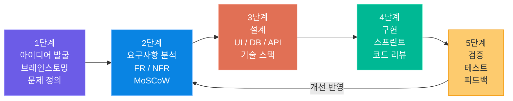
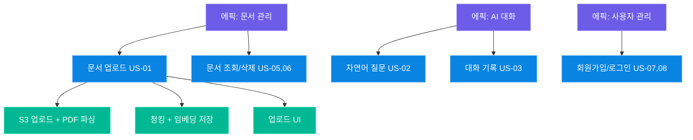
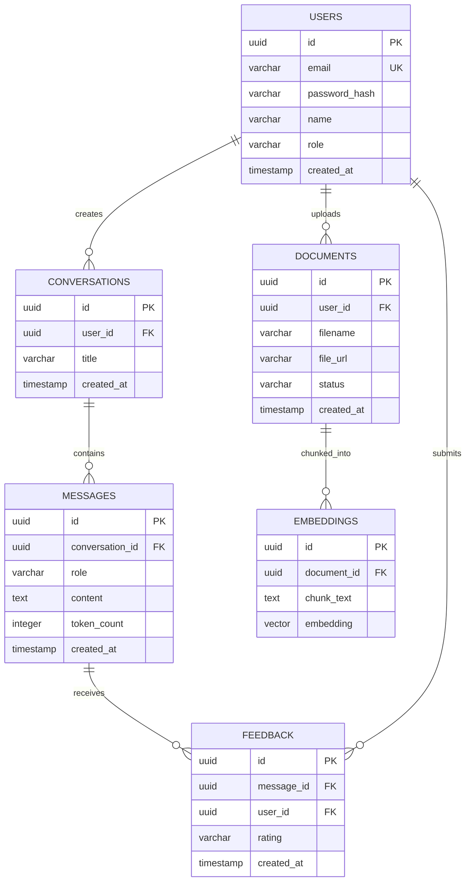
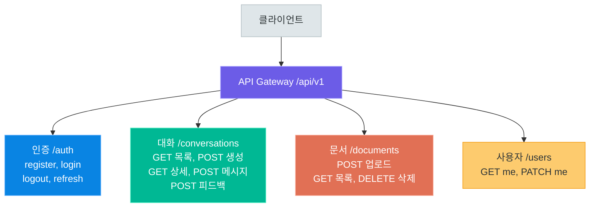

# 서비스 기획

> 좋은 코드보다 올바른 방향이 먼저입니다. 팀 프로젝트에서 서비스를 기획하는 전 과정 — 아이디어 발굴부터 요구사항 분석, 유저 스토리 작성, 와이어프레임 설계, ERD 모델링, API 설계, 기술 스택 결정까지 — AI 챗봇 서비스 예시를 통해 실전적으로 학습합니다

---

## 1. 서비스 기획 프로세스

### 기획이 왜 중요한가?

소프트웨어 개발에서 가장 비용이 많이 드는 실수는 **잘못된 것을 완벽하게 만드는 것**입니다. 구현 단계에서 방향이 틀렸음을 발견하면 지금까지 작성한 코드를 버려야 할 수 있습니다. 기획 단계에 투자하는 시간은 구현 단계의 시간 낭비를 막아주는 보험입니다.

팀 프로젝트에서 기획의 역할은 단순히 문서를 만드는 것이 아닙니다. 팀원 모두가 **같은 목표를 보고 있는지** 확인하는 과정입니다. 기획 문서가 없으면 각자의 머릿속에서 서로 다른 서비스가 만들어지고, 통합 단계에서 충돌이 발생합니다.

### 서비스 기획 5단계

AI 챗봇 서비스를 예시로 전체 기획 프로세스를 살펴봅니다.



> **핵심 포인트:** 기획 프로세스는 직선이 아니라 사이클입니다. 검증 단계에서 얻은 피드백은 다음 스프린트의 요구사항으로 반영됩니다. 이 반복 주기를 짧게 유지할수록 방향 수정 비용이 줄어듭니다.

### 각 단계의 산출물

단계마다 구체적인 산출물이 존재해야 합니다. 산출물이 없으면 다음 단계로 진행할 준비가 되지 않은 것입니다.

| 단계 | 주요 활동 | 산출물 | 담당 |
|---|---|---|---|
| **아이디어 발굴** | 브레인스토밍, 문제 정의, 시장 조사 | 아이디어 문서, 문제 정의서 | 전체 팀 |
| **요구사항 분석** | 기능/비기능 요구사항 도출, 우선순위 결정 | 요구사항 명세서(SRS) | PO / 전체 팀 |
| **설계** | UI 와이어프레임, ERD, API 명세서, 기술 스택 결정 | 와이어프레임, ERD, OpenAPI YAML | 각 파트 담당 |
| **구현** | 스프린트별 기능 개발, 코드 리뷰, 통합 테스트 | 소스 코드, PR, 테스트 코드 | 개발팀 전체 |
| **검증** | 사용자 테스트, 버그 수정, 성능 측정, 발표 | 테스트 결과 보고서, 최종 발표 자료 | 전체 팀 |

### 1단계: 아이디어 발굴

좋은 아이디어는 **해결할 문제**에서 시작합니다. "AI 챗봇을 만들자"는 솔루션 중심 사고입니다. "사용자가 긴 문서에서 원하는 정보를 찾는 데 너무 많은 시간을 쓴다"는 문제 중심 사고입니다.

**브레인스토밍 기법:**
- **How Might We(HMW)**: "어떻게 하면 우리가 사용자가 문서에서 답을 쉽게 찾도록 도울 수 있을까?"
- **5 Whys**: 표면적 증상에서 시작하여 근본 원인까지 다섯 번의 "왜?"를 반복
- **Pain Point 인터뷰**: 잠재 사용자(동료, 지인)를 5~10명 인터뷰하여 불편함 수집
- **경쟁 서비스 분석**: 유사 서비스의 리뷰, 단점, 미충족 니즈 파악

**문제 정의서 예시 (AI 챗봇 서비스):**

```
문제: 회사 내 방대한 내부 문서(정책, 매뉴얼, 보고서)에서 필요한 정보를
     찾으려면 평균 20분 이상이 소요되며, 문서를 읽어도 이해가 어렵다.

영향을 받는 사람: 신입 사원, 현업 담당자, 고객 지원팀

현재 해결책: 검색 엔진(키워드 매칭), 선임에게 직접 질문

현재 해결책의 한계: 키워드가 맞지 않으면 검색 실패, 선임의 시간 낭비

우리의 솔루션: 내부 문서를 학습한 AI 챗봇으로 자연어 질문에 즉시 답변
```

---

## 2. 요구사항 분석

### 기능 요구사항 vs 비기능 요구사항

요구사항은 크게 두 가지로 나뉩니다. **기능 요구사항(Functional Requirement, FR)**은 시스템이 무엇을 해야 하는지를 정의하고, **비기능 요구사항(Non-Functional Requirement, NFR)**은 시스템이 어떻게 동작해야 하는지를 정의합니다.

| 구분 | 정의 | 예시 (AI 챗봇 서비스) |
|---|---|---|
| **기능 요구사항 (FR)** | 시스템이 수행해야 할 구체적인 동작 | 사용자는 텍스트로 질문을 입력할 수 있다 |
| **비기능 요구사항 (NFR)** | 시스템의 품질, 성능, 제약 조건 | 응답 시간이 3초를 초과해서는 안 된다 |

NFR은 다시 세 가지 카테고리로 세분화됩니다.

**성능(Performance):**
- 동시 사용자 100명 기준 응답 시간 3초 이내
- 문서 업로드 처리 시간 30초 이내 (50MB 이하)
- API 가용성 99.5% 이상 (월간 기준 약 3.6시간 다운타임 허용)

**보안(Security):**
- 사용자 인증: JWT 기반 토큰 인증, 만료 시간 1시간
- 민감 데이터(비밀번호) bcrypt 해싱 저장
- API 키는 환경 변수로 관리, 소스 코드에 미포함
- HTTPS 전용 통신

**확장성(Scalability):**
- 수평 확장 가능한 Stateless API 설계
- 사용자 수 증가 시 DB 읽기 부하를 처리할 Read Replica 연결 지원
- 벡터 DB는 최소 1만 개 이상의 문서 청크 저장 가능

### MoSCoW 우선순위

모든 기능을 동시에 구현할 수 없습니다. MoSCoW 기법으로 팀이 먼저 무엇에 집중할지 합의합니다.

| 등급 | 의미 | AI 챗봇 서비스 예시 |
|---|---|---|
| **Must Have** | 반드시 있어야 동작하는 핵심 기능. 없으면 출시 불가 | 사용자 로그인/로그아웃, 문서 업로드, 자연어 질문 응답, 대화 기록 저장 |
| **Should Have** | 중요하지만 없어도 MVP는 동작. 2순위 구현 대상 | 대화 내보내기(PDF), 문서 삭제, 응답 만족도 피드백, 관리자 대시보드 |
| **Could Have** | 있으면 좋지만 우선순위 낮음. 시간이 남으면 구현 | 다크 모드, 대화 공유 링크, 다국어 지원, 음성 입력 |
| **Won't Have** | 이번 버전에서는 구현하지 않음. 명시적으로 제외 | 모바일 앱, 실시간 협업 편집, 자체 LLM 학습 |

> **핵심 포인트:** "Won't Have"를 명시하는 것이 중요합니다. 팀원 중 누군가가 "그거 왜 안 만들어요?"라고 물었을 때, 기획 문서에 명시된 근거로 대화할 수 있습니다. 합의 없이 빠진 기능은 오해를 낳습니다.

### 요구사항 명세서 양식

각 요구사항은 추적 가능하도록 고유 ID를 부여합니다.

```
요구사항 명세서 (Software Requirements Specification)
프로젝트명: AI 문서 챗봇 서비스
버전: 1.0.0
작성일: 2026-04-21
작성자: 기획팀 전체

─────────────────────────────────────────────────────
ID    | 분류 | 요구사항 내용                          | 우선순위 | 상태
─────────────────────────────────────────────────────
FR-01 | FR   | 사용자는 이메일과 비밀번호로 회원가입   | Must     | 완료
FR-02 | FR   | 사용자는 JWT 토큰으로 로그인            | Must     | 완료
FR-03 | FR   | 사용자는 PDF/TXT 파일을 업로드          | Must     | 진행중
FR-04 | FR   | 사용자는 자연어로 질문을 입력            | Must     | 대기
FR-05 | FR   | 시스템은 RAG로 문서 기반 답변 생성      | Must     | 대기
FR-06 | FR   | 사용자는 대화 기록을 조회               | Must     | 대기
FR-07 | FR   | 사용자는 응답에 피드백(좋아요/싫어요) 제출 | Should  | 대기
FR-08 | FR   | 관리자는 전체 사용자 목록 조회          | Should   | 대기
─────────────────────────────────────────────────────
NFR-01| NFR  | 동시 사용자 100명 기준 응답 3초 이내   | Must     | 대기
NFR-02| NFR  | 사용자 비밀번호 bcrypt 해싱 저장        | Must     | 완료
NFR-03| NFR  | API 가용성 99.5% 이상                  | Should   | 대기
─────────────────────────────────────────────────────
```

---

## 3. 유저 스토리

### 유저 스토리란?

유저 스토리(User Story)는 **사용자 관점에서 기능을 서술**하는 방식입니다. 기술 명세가 아니라, 사용자가 왜 이 기능이 필요한지에 초점을 맞춥니다.

**기본 형식:**
```
As a [사용자 유형],
I want [원하는 기능/행동],
So that [얻을 수 있는 가치/이유].
```

**AI 챗봇 서비스 유저 스토리 예시:**

```
US-01: 문서 업로드
As a 회사 직원 (일반 사용자),
I want PDF 형식의 사내 매뉴얼을 업로드하고 싶습니다,
So that AI가 해당 문서 내용을 기반으로 내 질문에 답해줄 수 있습니다.

US-02: 자연어 질문
As a 신입 사원,
I want 자연어로 "휴가 신청은 어떻게 하나요?"라고 질문하고 싶습니다,
So that 긴 문서를 처음부터 읽지 않아도 즉시 답을 얻을 수 있습니다.

US-03: 대화 기록 조회
As a 반복 이용자,
I want 이전에 나눈 대화 기록을 다시 볼 수 있고 싶습니다,
So that 이미 찾은 정보를 다시 질문하는 시간을 낭비하지 않아도 됩니다.

US-04: 피드백 제출
As a 사용자,
I want 응답에 좋아요/싫어요 피드백을 남길 수 있고 싶습니다,
So that 서비스 품질이 지속적으로 개선될 수 있습니다.
```

### 인수 조건 (Acceptance Criteria)

유저 스토리만으로는 개발자가 "완료"의 기준을 알기 어렵습니다. **인수 조건(Acceptance Criteria)**은 Given-When-Then 형식으로 완료 기준을 명확히 합니다.

**US-01 문서 업로드 인수 조건:**

```
시나리오 1: PDF 파일 정상 업로드
  Given  로그인한 사용자가 대시보드에 있을 때
  When   10MB 이하의 PDF 파일을 업로드 폼에 드래그 앤 드롭하면
  Then   "문서 처리 중..." 로딩 표시가 나타나고
         처리 완료 후 문서 목록에 파일명이 표시되어야 한다.

시나리오 2: 지원하지 않는 파일 형식
  Given  로그인한 사용자가 대시보드에 있을 때
  When   .hwp 형식의 파일을 업로드하면
  Then   "지원하지 않는 파일 형식입니다 (PDF, TXT만 허용)"
         라는 에러 메시지가 표시되어야 한다.

시나리오 3: 파일 크기 초과
  Given  로그인한 사용자가 대시보드에 있을 때
  When   50MB를 초과하는 파일을 업로드하면
  Then   "파일 크기는 50MB를 초과할 수 없습니다"
         라는 에러 메시지가 표시되어야 한다.
```

### INVEST 원칙

좋은 유저 스토리는 INVEST 원칙을 따릅니다.

| 원칙 | 의미 | 나쁜 예시 | 좋은 예시 |
|---|---|---|---|
| **I**ndependent | 다른 스토리에 독립적 | "로그인 후 채팅 가능" (의존성) | "사용자는 질문을 입력할 수 있다" |
| **N**egotiable | 협상 가능 (확정 계약 아님) | 픽셀 단위 UI 사양 | 기능의 목적과 가치 중심 서술 |
| **V**aluable | 사용자에게 가치 있음 | "데이터베이스 인덱스 추가" | "검색 속도가 빨라져 응답이 즉시 표시됨" |
| **E**stimable | 추정 가능한 크기 | "AI 기능 전체 구현" (너무 큼) | "문서 1건 업로드 및 청킹 처리" |
| **S**mall | 한 스프린트 내 완료 가능 | "챗봇 서비스 구축" | "채팅 메시지 전송 및 AI 응답 표시" |
| **T**estable | 테스트 가능한 기준 | "빠르게 응답한다" | "응답 시간 3초 이내" |

### 에픽 → 스토리 → 태스크 분해



태스크는 1~2일 내에 완료할 수 있는 단위로 분해합니다. 태스크가 3일을 넘어가면 더 작게 쪼갭니다.

> **핵심 포인트:** 에픽은 방향, 스토리는 기능, 태스크는 작업 단위입니다. 스프린트 계획 시에는 태스크 단위로 담당자를 배정하고 예상 시간을 산정합니다. 유저 스토리는 "무엇을, 왜"를, 태스크는 "어떻게"를 기술합니다.

---

## 4. 와이어프레임과 화면 설계

### 로우파이 vs 하이파이 프로토타입

와이어프레임의 충실도(fidelity)는 목적에 따라 다르게 선택합니다.

| 항목 | 로우파이 (Low-Fidelity) | 하이파이 (High-Fidelity) |
|---|---|---|
| **도구** | 종이, 화이트보드, 마커 | Figma, Sketch, Adobe XD |
| **제작 시간** | 수 분 ~ 수십 분 | 수 시간 ~ 수 일 |
| **포함 내용** | 레이아웃, 요소 배치, 흐름 | 색상, 폰트, 실제 데이터, 인터랙션 |
| **주요 용도** | 초기 아이디어 검증, 팀 내 토론 | 개발팀 핸드오프, 사용자 테스트 |
| **수정 비용** | 매우 낮음 (지우개로 해결) | 높음 (시간 투자 필요) |
| **피드백 집중** | 흐름과 기능 구조 | 시각 디자인과 인터랙션 |

**팀 프로젝트 권장 순서:**
1. 화이트보드에 로우파이 스케치로 아이디어 공유 (1-2시간)
2. 팀 내 합의 후 Figma로 중간 충실도 와이어프레임 제작 (반나절)
3. 기능 구현 후 필요 시 하이파이 목업으로 완성 (선택)

### 화면 흐름도

화면 흐름도(Screen Flow)는 사용자가 서비스 내에서 어떤 경로로 이동하는지 보여줍니다.

```
[랜딩 페이지]
    │
    ├── [회원가입] ──────────────── [이메일 인증] → [로그인]
    │
    └── [로그인]
           │
           ▼
    [대시보드] ───── [문서 관리]
           │              │
           │         [업로드 모달]
           │         [문서 목록]
           │         [문서 삭제 확인]
           │
           └── [채팅 인터페이스]
                      │
                 [새 대화 시작]
                 [기존 대화 목록]
                 [대화 내용 보기]
                 [피드백 제출]
                      │
                 [설정 페이지]
                 [프로필 수정]
                 [로그아웃]
```

### 핵심 화면 목록

| 화면 | 주요 컴포넌트 | 핵심 기능 | 우선순위 |
|---|---|---|---|
| **로그인 / 회원가입** | 이메일 입력, 비밀번호 입력, 소셜 로그인 버튼 | 인증, 세션 관리 | Must |
| **대시보드** | 최근 대화 목록, 문서 수 통계, 빠른 질문 입력 | 전체 현황 파악, 빠른 진입 | Must |
| **채팅 인터페이스** | 메시지 버블, 입력창, 출처 표시, 피드백 버튼 | AI 질의응답 핵심 | Must |
| **문서 관리** | 파일 드래그앤드롭, 업로드 진행 바, 문서 목록 | 문서 업로드/삭제 | Must |
| **설정** | 프로필, 비밀번호 변경, 알림 설정 | 계정 관리 | Should |

### Figma 소개와 기본 사용법

Figma는 브라우저 기반 UI/UX 디자인 도구로, 팀 협업에 최적화되어 있습니다. 계정만 있으면 무료로 사용할 수 있습니다.

**기본 개념:**
- **Frame**: 화면 하나를 나타내는 캔버스 단위 (iPhone 15, Desktop 1440 등 프리셋 제공)
- **Component**: 재사용 가능한 UI 요소 (버튼, 카드, 네비게이션 바 등)
- **Auto Layout**: 컴포넌트 내 요소들의 간격과 정렬을 자동 관리
- **Prototype**: 화면 간 연결과 인터랙션을 정의하여 클릭 가능한 목업 제작

**팀 프로젝트에서 Figma 활용 방법:**
1. 팀원 모두를 동일 Figma 파일에 Editor로 초대
2. 페이지를 역할별로 분리: "와이어프레임", "디자인", "컴포넌트"
3. 컴포넌트를 먼저 정의하고 각 화면에서 인스턴스로 사용
4. 주석(Comment) 기능으로 피드백 교환

### 디자인 시스템 개념

팀 프로젝트에서 디자인 시스템은 **색상, 폰트, 간격, 컴포넌트**를 팀 전체가 공유하는 규칙 모음입니다. 개발자가 CSS를 작성할 때 일관성을 유지하는 데 도움이 됩니다.

**AI 챗봇 서비스 미니 디자인 시스템 예시:**

```css
/* 색상 팔레트 */
--color-primary:    #6c5ce7;  /* 주요 액션 (버튼, 링크) */
--color-secondary:  #0984e3;  /* 보조 액션 */
--color-success:    #00b894;  /* 성공, 완료 상태 */
--color-warning:    #fdcb6e;  /* 주의, 진행 중 */
--color-danger:     #e17055;  /* 오류, 삭제 */
--color-text:       #2d3436;  /* 본문 텍스트 */
--color-bg:         #f8f9fa;  /* 배경 */

/* 타이포그래피 */
--font-heading:     'Pretendard', sans-serif;
--font-body:        'Pretendard', sans-serif;
--font-size-xl:     24px;     /* 페이지 제목 */
--font-size-lg:     18px;     /* 섹션 제목 */
--font-size-md:     16px;     /* 본문 */
--font-size-sm:     14px;     /* 보조 텍스트 */

/* 간격 */
--spacing-xs:       4px;
--spacing-sm:       8px;
--spacing-md:       16px;
--spacing-lg:       24px;
--spacing-xl:       48px;

/* 둥글기 */
--radius-sm:        4px;
--radius-md:        8px;
--radius-lg:        16px;
--radius-full:      9999px;   /* 완전한 원 또는 pill */
```

---

## 5. ERD와 데이터 모델링

### 엔티티/속성/관계 복습

ERD(Entity-Relationship Diagram)는 데이터베이스 설계의 청사진입니다. 세 가지 핵심 요소로 구성됩니다.

- **엔티티(Entity)**: 데이터를 저장할 대상 (테이블). 예: `Users`, `Messages`
- **속성(Attribute)**: 엔티티의 특성 (컬럼). 예: `user_id`, `email`, `created_at`
- **관계(Relationship)**: 엔티티 간의 연관성. 예: 사용자 1명이 여러 대화를 가질 수 있다 (1:N)

### AI 챗봇 서비스 ERD



### 정규화 결정: 성능 vs 일관성

정규화는 데이터 중복을 줄이지만, 과도한 정규화는 JOIN 쿼리 증가로 성능을 저하시킬 수 있습니다.

| 결정 사항 | 정규화 선택 | 비정규화 선택 | AI 챗봇 서비스 선택 |
|---|---|---|---|
| **대화 제목** | `MESSAGES`에서 매번 첫 메시지 조회 | `CONVERSATIONS.title`에 직접 저장 | 비정규화 — 목록 조회 빈번 |
| **파일 정보** | 별도 `FILES` 테이블 참조 | `DOCUMENTS`에 모두 포함 | `DOCUMENTS`에 통합 — 관계 단순 |
| **사용자 이름** | `USERS` JOIN | `MESSAGES`에 `user_name` 컬럼 추가 | JOIN 사용 — 일관성 우선 |
| **임베딩 벡터** | RDB에 저장 | 전용 벡터 DB (ChromaDB/Pinecone) | 벡터 DB 분리 — 유사도 검색 최적화 |

### 인덱스 설계

자주 사용되는 쿼리 패턴을 분석하여 인덱스를 설계합니다.

```sql
-- 사용자별 대화 목록 조회 (빈번)
CREATE INDEX idx_conversations_user_id
    ON conversations(user_id, updated_at DESC);

-- 대화별 메시지 조회 (빈번)
CREATE INDEX idx_messages_conversation_id
    ON messages(conversation_id, created_at ASC);

-- 이메일로 사용자 조회 (로그인 시)
CREATE UNIQUE INDEX idx_users_email
    ON users(email);

-- 문서별 임베딩 청크 조회
CREATE INDEX idx_embeddings_document_id
    ON embeddings(document_id, chunk_index ASC);

-- 메시지별 피드백 조회
CREATE INDEX idx_feedback_message_id
    ON feedback(message_id);
```

> **핵심 포인트:** 인덱스는 읽기 성능을 높이지만 쓰기 성능을 낮추고 스토리지를 추가로 사용합니다. WHERE 절, ORDER BY 절, JOIN 조건에 자주 등장하는 컬럼에만 선별적으로 생성합니다.

---

## 6. API 설계

### RESTful 설계 원칙

REST(Representational State Transfer)는 HTTP를 최대한 활용하는 API 설계 방식입니다. 핵심 원칙은 **리소스 중심** 설계입니다.

| 원칙 | 내용 | 잘못된 예 | 올바른 예 |
|---|---|---|---|
| **리소스 중심** | URL은 동사가 아니라 명사(리소스)로 표현 | `POST /createUser` | `POST /users` |
| **HTTP 메서드 활용** | 행위는 메서드로, 대상은 URL로 분리 | `POST /deleteMessage` | `DELETE /messages/{id}` |
| **복수 명사 사용** | 컬렉션은 복수형으로 표현 | `/user`, `/document` | `/users`, `/documents` |
| **계층 구조** | 관계는 중첩 경로로 표현 | `/getMessagesOfConv?id=1` | `/conversations/1/messages` |
| **상태 코드 준수** | 결과를 HTTP 상태 코드로 전달 | 항상 200 반환 후 에러 본문 | 404, 422, 500 등 적절히 사용 |

**HTTP 메서드와 CRUD 매핑:**

| HTTP 메서드 | CRUD | 의미 | 예시 |
|---|---|---|---|
| `GET` | Read | 리소스 조회 | `GET /conversations` — 내 대화 목록 |
| `POST` | Create | 리소스 생성 | `POST /conversations` — 새 대화 시작 |
| `PUT` | Update (전체) | 리소스 전체 교체 | `PUT /users/me` — 프로필 전체 수정 |
| `PATCH` | Update (부분) | 리소스 일부 수정 | `PATCH /conversations/{id}` — 제목만 수정 |
| `DELETE` | Delete | 리소스 삭제 | `DELETE /documents/{id}` — 문서 삭제 |

### HTTP 상태 코드

| 코드 | 의미 | 사용 시점 |
|---|---|---|
| `200 OK` | 성공 | GET, PUT, PATCH 성공 |
| `201 Created` | 생성 성공 | POST로 리소스 생성 완료 |
| `204 No Content` | 성공 (응답 본문 없음) | DELETE 성공 |
| `400 Bad Request` | 잘못된 요청 | 유효성 검사 실패, 필수 파라미터 누락 |
| `401 Unauthorized` | 인증 실패 | 토큰 없음, 만료, 유효하지 않음 |
| `403 Forbidden` | 권한 없음 | 인증은 됐지만 해당 리소스 접근 권한 없음 |
| `404 Not Found` | 리소스 없음 | 존재하지 않는 ID 조회 |
| `422 Unprocessable Entity` | 의미론적 오류 | 형식은 맞지만 값이 잘못됨 |
| `429 Too Many Requests` | 요청 한도 초과 | Rate Limit 초과 |
| `500 Internal Server Error` | 서버 오류 | 예상치 못한 서버 에러 |

### API 설계 개요



### OpenAPI/Swagger 스펙 YAML 예시

OpenAPI 명세서는 API 문서와 코드 생성의 표준 형식입니다. FastAPI는 자동으로 OpenAPI 스펙을 생성합니다.

```yaml
openapi: 3.0.3
info:
  title: AI 문서 챗봇 API
  version: 1.0.0
  description: 사내 문서 기반 AI 질의응답 서비스 API

servers:
  - url: https://api.ai-chatbot.example.com/api/v1
    description: 프로덕션 서버
  - url: http://localhost:8000/api/v1
    description: 로컬 개발 서버

security:
  - BearerAuth: []

components:
  securitySchemes:
    BearerAuth:
      type: http
      scheme: bearer
      bearerFormat: JWT

  schemas:
    MessageRequest:
      type: object
      required: [content]
      properties:
        content:
          type: string
          minLength: 1
          maxLength: 2000
          example: "휴가 신청 절차가 어떻게 되나요?"

    MessageResponse:
      type: object
      properties:
        id:
          type: string
          format: uuid
        role:
          type: string
          enum: [assistant]
        content:
          type: string
          example: "휴가 신청은 HR 시스템에서 ..."
        source_docs:
          type: array
          items:
            type: object
            properties:
              document_id:
                type: string
                format: uuid
              filename:
                type: string
              chunk_text:
                type: string
        created_at:
          type: string
          format: date-time

    ErrorResponse:
      type: object
      properties:
        error:
          type: object
          properties:
            code:
              type: string
              example: "DOCUMENT_NOT_FOUND"
            message:
              type: string
              example: "요청한 문서를 찾을 수 없습니다."
            details:
              type: object

paths:
  /conversations/{conversation_id}/messages:
    post:
      summary: 메시지 전송 및 AI 응답 수신
      tags: [대화]
      parameters:
        - name: conversation_id
          in: path
          required: true
          schema:
            type: string
            format: uuid
      requestBody:
        required: true
        content:
          application/json:
            schema:
              $ref: '#/components/schemas/MessageRequest'
      responses:
        '200':
          description: AI 응답 성공
          content:
            application/json:
              schema:
                $ref: '#/components/schemas/MessageResponse'
        '401':
          description: 인증 토큰 없음 또는 만료
          content:
            application/json:
              schema:
                $ref: '#/components/schemas/ErrorResponse'
        '404':
          description: 대화 없음
          content:
            application/json:
              schema:
                $ref: '#/components/schemas/ErrorResponse'
```

### 에러 응답 표준화

모든 에러는 일관된 형식으로 반환합니다. 클라이언트가 에러를 예측 가능하게 처리할 수 있도록 합니다.

```json
{
  "error": {
    "code": "VALIDATION_ERROR",
    "message": "입력 값이 유효하지 않습니다.",
    "details": {
      "field": "content",
      "issue": "2000자를 초과하는 메시지는 허용되지 않습니다."
    },
    "request_id": "req_01HZ9XKWQM3RNPJ4V8GCBS7YD",
    "timestamp": "2026-04-21T10:30:00Z"
  }
}
```

**표준 에러 코드 목록:**

| 에러 코드 | HTTP 상태 | 발생 상황 |
|---|---|---|
| `VALIDATION_ERROR` | 422 | 입력 유효성 검사 실패 |
| `UNAUTHORIZED` | 401 | 인증 토큰 없음 또는 만료 |
| `FORBIDDEN` | 403 | 리소스 접근 권한 없음 |
| `NOT_FOUND` | 404 | 리소스 존재하지 않음 |
| `RATE_LIMIT_EXCEEDED` | 429 | 분당 요청 한도 초과 |
| `LLM_ERROR` | 502 | LLM API 응답 실패 |
| `INTERNAL_ERROR` | 500 | 예상치 못한 서버 오류 |

### API 버전 관리

API가 공개된 후 하위 호환성을 깨는 변경이 필요할 때 버전을 올립니다.

**버전 관리 방식 비교:**

| 방식 | 예시 | 장점 | 단점 |
|---|---|---|---|
| **URL 경로** | `/api/v1/users`, `/api/v2/users` | 직관적, 캐싱 용이 | URL이 길어짐 |
| **헤더** | `Accept: application/vnd.api+json;version=2` | URL 클린 | 브라우저 테스트 불편 |
| **쿼리 파라미터** | `/api/users?version=2` | 구현 쉬움 | REST 원칙 위반 |

팀 프로젝트에서는 **URL 경로 방식** (`/api/v1/`)을 권장합니다. 가장 직관적이고 디버깅이 쉽습니다.

> **핵심 포인트:** 첫 버전부터 `/api/v1/` prefix를 붙여두세요. 나중에 버전 관리를 추가하려면 기존 클라이언트 코드를 모두 수정해야 합니다. 초기 설계 비용은 매우 저렴합니다.

---

## 7. 기술 스택 결정

### 기술 스택 옵션 비교

기술 스택은 팀의 역량, 프로젝트 요구사항, 생태계 성숙도를 종합적으로 고려하여 결정합니다.

**프론트엔드:**

| 기술 | 특징 | 학습 난이도 | AI 서비스 적합성 |
|---|---|---|---|
| **React** | SPA, 컴포넌트 기반, 넓은 생태계 | 중간 | 높음 — 복잡한 UI 구성 가능 |
| **Next.js** | React 기반, SSR/SSG, 파일 기반 라우팅 | 중간 | 매우 높음 — SEO + 서버 기능 |
| **Streamlit** | Python 기반, 데이터 앱 특화, 빠른 프로토타이핑 | 낮음 | 중간 — AI 데모에 최적, 커스터마이징 제한 |

**백엔드:**

| 기술 | 특징 | 성능 | AI 서비스 적합성 |
|---|---|---|---|
| **FastAPI** | Python, 비동기, 자동 OpenAPI 문서, 타입 힌트 | 높음 | 매우 높음 — LangChain 등 AI 라이브러리와 자연스러운 통합 |
| **Flask** | Python, 경량, 유연, 넓은 레퍼런스 | 중간 | 높음 — 간단한 서비스에 적합 |
| **Django** | Python, 풀스택, ORM, 관리자 UI 포함 | 중간 | 중간 — 많은 기능이 필요 없는 AI 서비스에는 과함 |

**데이터베이스:**

| 기술 | 유형 | 특징 | AI 서비스 적합성 |
|---|---|---|---|
| **PostgreSQL** | RDBMS | ACID 준수, JSON 지원, pgvector 확장 | 매우 높음 — 사용자/대화/문서 데이터 |
| **MySQL** | RDBMS | 안정적, 레퍼런스 많음 | 높음 — 일반적인 관계형 데이터 |
| **MongoDB** | NoSQL (문서) | 유연한 스키마, JSON 네이티브 | 중간 — 정형화되지 않은 메타데이터 |

**벡터 데이터베이스:**

| 기술 | 배포 방식 | 특징 | 팀 프로젝트 적합성 |
|---|---|---|---|
| **ChromaDB** | 로컬 / 클라우드 | Python 네이티브, 설치 쉬움, 무료 | 매우 높음 — 학습/프로토타입에 최적 |
| **Pinecone** | 클라우드 SaaS | 관리형, 확장성 뛰어남, 무료 플랜 제한 | 중간 — 프로덕션 목표 시 고려 |
| **Weaviate** | 자체 호스팅 / 클라우드 | 멀티모달, GraphQL 지원 | 중간 — 설정 복잡도 있음 |

**인프라:**

| 기술 | 특징 | 비용 | 팀 프로젝트 적합성 |
|---|---|---|---|
| **Docker + Docker Compose** | 로컬 개발, 환경 통일, 무료 | 없음 | 매우 높음 — 필수 |
| **AWS ECS + Fargate** | 서버리스 컨테이너, 자동 스케일링 | 종량제 | 높음 — 배포 자동화 |
| **AWS EC2** | 직접 관리, GPU 지원 | 시간당 과금 | 중간 — 관리 부담 있음 |
| **Render / Railway** | PaaS, 간단한 배포 | 무료 플랜 있음 | 높음 — 인프라 학습 없이 빠른 배포 |

### 의사결정 매트릭스

팀의 역량과 프로젝트 요구사항을 점수화하여 객관적으로 기술 스택을 선택합니다.

| 평가 기준 | 가중치 | FastAPI + Next.js | Flask + React | FastAPI + Streamlit |
|---|---|---|---|---|
| 팀 역량 (학습 비용) | 30% | 3점 | 4점 | 5점 |
| 요구사항 충족도 | 30% | 5점 | 4점 | 3점 |
| 생태계/레퍼런스 | 20% | 4점 | 5점 | 3점 |
| 개발 속도 | 20% | 4점 | 3점 | 5점 |
| **가중 합계** | 100% | **4.0** | **4.0** | **3.9** |

이처럼 점수가 비슷할 경우에는 팀 내 토론을 통해 최종 결정합니다. 수치가 의사결정을 대체하는 것이 아니라, 토론의 근거를 제공하는 것이 목적입니다.

### AI 챗봇 서비스 권장 기술 스택

팀 프로젝트(45일 과정)에서 AI 문서 챗봇 서비스를 구현한다면 아래 스택을 권장합니다.

```
프론트엔드:  Next.js 14 (App Router)
             TailwindCSS (스타일링)
             Zustand (전역 상태 관리)

백엔드:      FastAPI (Python 3.11)
             SQLAlchemy 2.0 (ORM)
             Alembic (마이그레이션)
             LangChain (RAG 파이프라인)

데이터베이스: PostgreSQL 15 (주 데이터베이스)
              ChromaDB (벡터 데이터베이스)
              Redis (세션 캐시, Rate Limiting)

AI:          OpenAI GPT-4o (LLM)
              text-embedding-3-small (임베딩)

인프라:       Docker + Docker Compose (개발 환경)
              AWS ECS + Fargate (프로덕션)
              AWS S3 (문서 파일 저장)
              AWS RDS PostgreSQL (관리형 DB)
              GitHub Actions (CI/CD)
```

> **핵심 포인트:** 기술 스택 선택에서 가장 중요한 기준은 **팀원 중 가장 경험이 부족한 사람이 따라올 수 있는가**입니다. 최신 기술이 항상 최선이 아닙니다. 팀이 빠르게 익히고 함께 진행할 수 있는 스택이 최선입니다.

---

## 8. 핵심 정리

### 서비스 기획 체크리스트

팀 프로젝트를 시작하기 전에 아래 체크리스트를 완료했는지 확인하세요. 모든 항목이 완료되어야 구현 단계로 진행할 준비가 된 것입니다.

**아이디어 발굴 단계:**
- [ ] 해결할 문제를 한 문장으로 정의했다
- [ ] 타겟 사용자(페르소나)를 명확히 정의했다
- [ ] 유사 서비스와 차별점을 분석했다
- [ ] 팀원 모두가 문제 정의에 동의했다

**요구사항 분석 단계:**
- [ ] 기능 요구사항(FR)을 ID 기반으로 목록화했다
- [ ] 비기능 요구사항(NFR: 성능/보안/확장성)을 수치로 정의했다
- [ ] MoSCoW 우선순위를 적용하여 MVP 범위를 정했다
- [ ] 요구사항 명세서(SRS)를 팀 공유 문서에 작성했다

**설계 단계:**
- [ ] 핵심 화면 와이어프레임을 Figma(또는 화이트보드)에 작성했다
- [ ] 화면 흐름도(Screen Flow)를 그렸다
- [ ] ERD를 작성하고 팀원 리뷰를 완료했다
- [ ] API 엔드포인트 목록과 요청/응답 스키마를 정의했다
- [ ] 기술 스택을 합의하고 의사결정 근거를 기록했다

**유저 스토리 단계:**
- [ ] 에픽을 정의했다
- [ ] 각 에픽을 INVEST 원칙에 맞는 유저 스토리로 분해했다
- [ ] 핵심 유저 스토리에 인수 조건(Given-When-Then)을 작성했다
- [ ] 스토리를 태스크로 분해하고 담당자를 배정했다

### 기획 산출물 요약

| 산출물 | 도구 | 위치 |
|---|---|---|
| 문제 정의서 | Google Docs / Notion | 팀 공유 드라이브 |
| 요구사항 명세서 (SRS) | Notion / Confluence | 팀 공유 드라이브 |
| 유저 스토리 + 백로그 | GitHub Issues / Jira | GitHub 리포지토리 |
| 와이어프레임 | Figma | Figma 팀 프로젝트 |
| ERD | dbdiagram.io / Mermaid | 문서 또는 리포지토리 |
| API 명세서 | Swagger UI / Notion | 리포지토리 `/docs` 폴더 |
| 기술 스택 문서 | README.md | 리포지토리 루트 |

### 팀 프로젝트 기획 타임라인 예시

```
Day 1 (오전): 아이디어 브레인스토밍, 문제 정의 합의
Day 1 (오후): 유사 서비스 분석, 타겟 사용자 정의
Day 2 (오전): 요구사항 도출, MoSCoW 우선순위 결정
Day 2 (오후): 와이어프레임 스케치 (로우파이)
Day 3 (오전): ERD 설계, API 엔드포인트 목록 작성
Day 3 (오후): 기술 스택 결정, 개발 환경 세팅 시작
Day 4~      : 구현 스프린트 시작
```

### 다음 단계

서비스 기획이 완료되었다면, 이제 팀이 함께 효율적으로 코드를 작성하고 협업하는 방법을 배울 차례입니다.

다음 학습 내용: **[협업과 Git 전략](03_collaboration_and_git.md)**

- Git 브랜치 전략 (GitHub Flow, Git Flow)
- Pull Request 기반 코드 리뷰 워크플로우
- 커밋 메시지 컨벤션과 커밋 단위 설계
- 팀 개발 환경 통일 (`.env`, Docker Compose)
- 충돌(Conflict) 해결 전략

---
