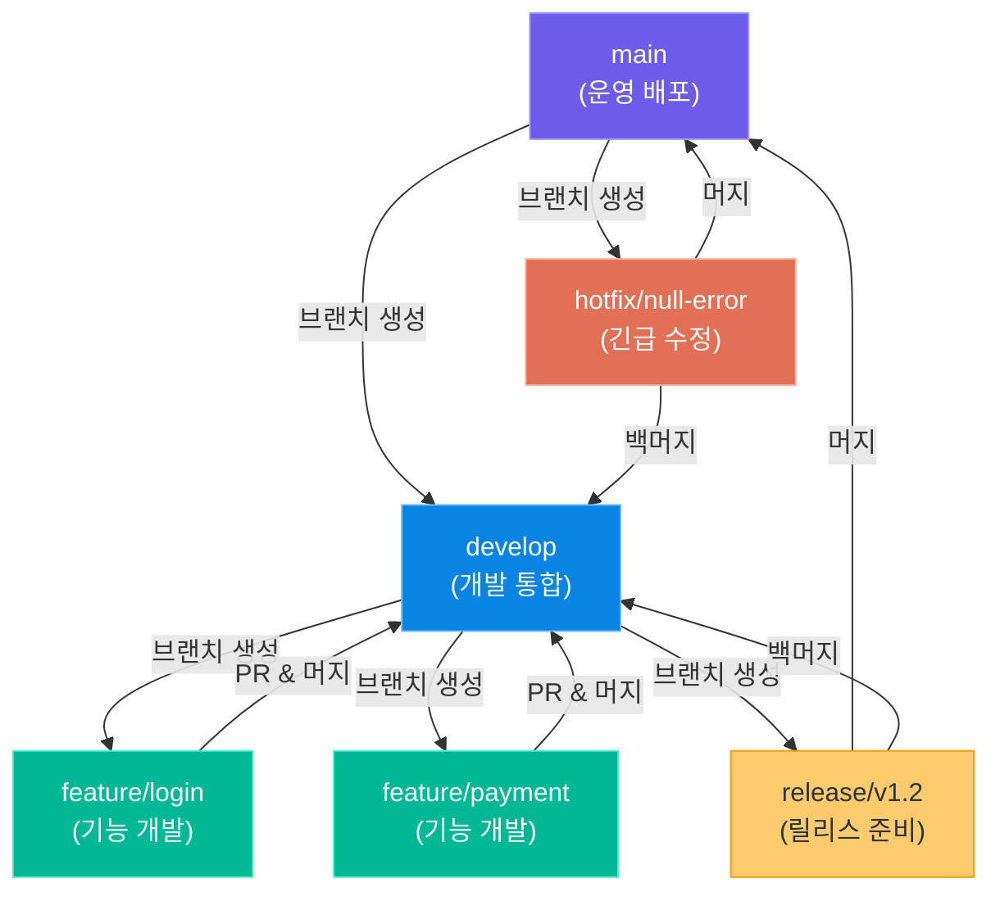
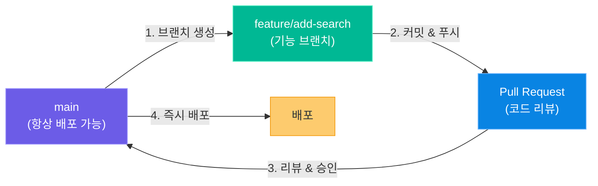
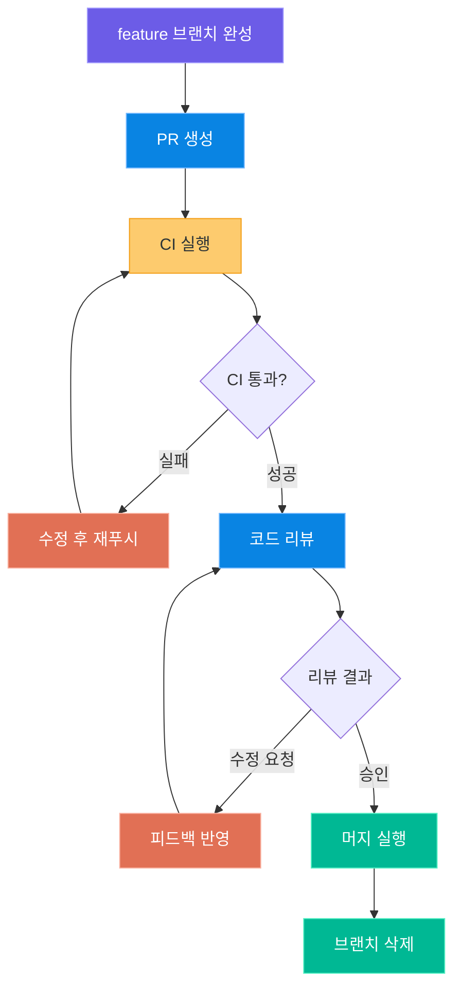
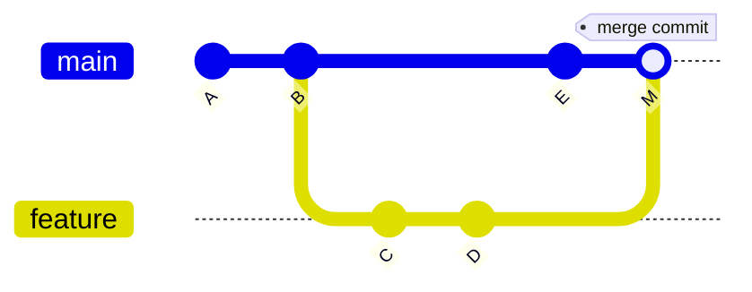
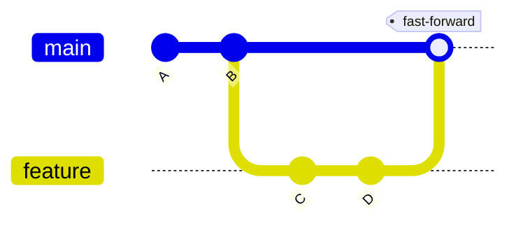
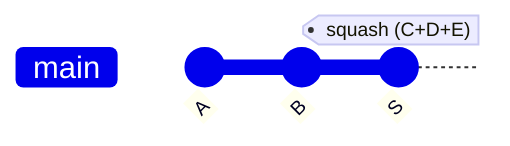
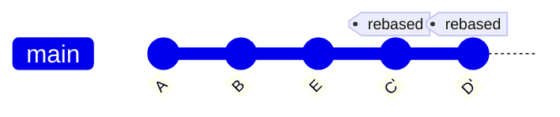

# 협업과 Git 워크플로

> 혼자 개발할 때와 팀으로 개발할 때는 완전히 다른 규칙이 필요합니다.
> 이 장에서는 팀 프로젝트에서 효과적으로 협업하기 위한 Git 워크플로 전략,
> 브랜치 관리, 커밋 컨벤션, PR 프로세스, 코드 리뷰 문화를 학습합니다.
> Git 기본 명령어는 **모듈 02**에서 학습했으므로, 이 장에서는 팀 협업 관점에 집중합니다.

---

## 1. Git 워크플로 전략

### 왜 워크플로가 필요한가?

여러 명이 하나의 코드베이스를 동시에 수정하면 다음과 같은 문제가 발생합니다.

- **충돌(Conflict)**: A와 B가 같은 파일을 동시에 수정
- **불안정한 메인 브랜치**: 미완성 기능이 main에 올라가 서비스 장애 발생
- **추적 불가능한 변경**: 누가, 왜, 무엇을 바꿨는지 알 수 없음
- **롤백 불가**: 문제 발생 시 이전 상태로 돌아가기 어려움

Git 워크플로는 이러한 문제를 방지하는 **팀의 공통 약속**입니다.

### 대표적인 3가지 워크플로

#### Git Flow (Vincent Driessen 모델)

2010년 Vincent Driessen이 제안한 모델로, 명확한 브랜치 구조와 릴리스 관리가 특징입니다.



> **핵심 포인트:** Git Flow는 버전 관리가 중요하고 릴리스 주기가 긴 프로젝트(모바일 앱, 패키지 라이브러리)에 적합합니다. 다만 브랜치가 많아 복잡해질 수 있습니다.

#### GitHub Flow (간소화된 모델)

GitHub이 제안한 단순한 워크플로로, main 브랜치 하나와 feature 브랜치만 사용합니다.



#### Trunk-Based Development (구글/페이스북 스타일)

모든 개발자가 하루에 여러 번 메인 브랜치(trunk)에 직접 커밋하거나 매우 단기간의 feature 브랜치를 사용하는 방식입니다. 강력한 CI/CD 파이프라인과 Feature Flag가 필수입니다.

### 워크플로 비교표

| 항목 | Git Flow | GitHub Flow | Trunk-Based |
|------|----------|-------------|-------------|
| **복잡도** | 높음 (브랜치 多) | 낮음 | 매우 낮음 |
| **팀 규모** | 중~대형 (10명 이상) | 소~중형 (2~15명) | 대형 (경험 많은 팀) |
| **릴리스 주기** | 주기적 (2주~월별) | 지속적 (수시) | 지속적 (일 수십 회) |
| **CI/CD 호환성** | 보통 | 높음 | 매우 높음 |
| **롤백 용이성** | 쉬움 (버전 태그) | 보통 | Feature Flag 필요 |
| **브랜치 수명** | 장기 (develop 상시) | 단기 (기능 완료 후 삭제) | 매우 단기 (1~2일) |
| **적합한 프로젝트** | 앱/라이브러리 배포 | 웹 서비스 | 대규모 서비스 |

### 팀 프로젝트에 추천하는 워크플로

이 과정의 팀 프로젝트는 **GitHub Flow를 기반**으로 하되, main과 develop 브랜치를 분리하는 **경량 Git Flow**를 사용합니다.

```
main (운영/발표용) ← develop (통합 개발) ← feature/* (개인 기능 개발)
```

- 수강생 팀은 보통 3~6명으로 소규모이므로 복잡한 Git Flow보다 단순한 구조가 적합합니다.
- develop 브랜치를 두어 main의 안정성을 보장합니다.
- feature 브랜치에서 개발 후 PR로 develop에 머지합니다.

---

## 2. 브랜치 전략

### 브랜치 역할과 수명

| 브랜치 | 역할 | 수명 | 직접 커밋 | 머지 대상 |
|--------|------|------|----------|----------|
| **main** | 운영 배포, 발표용 안정 코드 | 영구 | 금지 | develop, hotfix |
| **develop** | 다음 버전 개발 통합 브랜치 | 영구 | 금지 | feature, release |
| **feature/** | 개별 기능 개발 | 단기 (기능 완료까지) | 허용 | develop |
| **release/** | 릴리스 전 최종 검증 및 버그 수정 | 단기 (릴리스까지) | 허용 | main, develop |
| **hotfix/** | 운영 중 긴급 버그 수정 | 매우 단기 | 허용 | main, develop |

### 브랜치 네이밍 컨벤션

브랜치 이름은 **타입/이슈번호-간략한설명** 형식을 따릅니다.

```bash
# 기능 개발 브랜치
feature/ISSUE-123-add-login
feature/ISSUE-124-oauth-kakao
feature/ISSUE-125-user-profile-page

# 버그 수정 브랜치
fix/ISSUE-456-null-pointer-error
fix/ISSUE-457-login-redirect-loop

# 긴급 수정 브랜치 (운영 배포된 버그)
hotfix/ISSUE-789-payment-crash
hotfix/critical-security-patch

# 릴리스 브랜치
release/v1.0.0
release/v1.1.0-beta

# 문서/설정 작업
docs/ISSUE-100-update-readme
chore/ISSUE-101-update-dependencies
```

> **핵심 포인트:** 이슈 번호를 브랜치 이름에 포함하면 GitHub에서 브랜치와 이슈가 자동으로 연결됩니다. 나중에 PR에서 이슈를 닫을 때도 쉽게 추적할 수 있습니다.

### 브랜치 생성 및 관리 명령어

```bash
# develop 브랜치에서 feature 브랜치 생성
git checkout develop
git pull origin develop
git checkout -b feature/ISSUE-123-add-login

# 작업 후 원격에 푸시
git push origin feature/ISSUE-123-add-login

# 원격 브랜치 목록 확인
git branch -r

# 머지 완료 후 로컬 브랜치 삭제
git branch -d feature/ISSUE-123-add-login

# 원격 브랜치 삭제
git push origin --delete feature/ISSUE-123-add-login

# 불필요한 원격 브랜치 참조 정리
git fetch --prune
```

### 브랜치 보호 규칙 (Branch Protection Rules)

GitHub 레포지토리 설정에서 중요 브랜치를 보호할 수 있습니다.

**main 브랜치 보호 설정 (Settings → Branches → Add rule)**

```
Branch name pattern: main

[v] Require a pull request before merging
    [v] Require approvals: 1 (최소 1명 리뷰 필요)
    [v] Dismiss stale pull request approvals when new commits are pushed
    [v] Require review from Code Owners

[v] Require status checks to pass before merging
    [v] Require branches to be up to date before merging
    Status checks: CI/CD pipeline, lint, test

[v] Include administrators (관리자도 규칙 적용)
[v] Restrict who can push to matching branches
```

**develop 브랜치 보호 설정**

```
Branch name pattern: develop

[v] Require a pull request before merging
    [v] Require approvals: 1
[v] Require status checks to pass before merging
```

---

## 3. 커밋 컨벤션

### Conventional Commits 형식

**Conventional Commits**는 커밋 메시지를 기계와 사람 모두 이해할 수 있도록 표준화한 스펙입니다. 자동 changelog 생성과 시맨틱 버전 자동화가 가능합니다.

```
<type>(<scope>): <description>

[optional body]

[optional footer]
```

**기본 예시**

```bash
feat(auth): 카카오 OAuth 로그인 기능 추가

feat(api): 상품 검색 엔드포인트 구현

fix(auth): 로그아웃 후 세션이 남아있는 버그 수정

docs(readme): 로컬 환경 설정 방법 추가

style(ui): 버튼 컴포넌트 들여쓰기 수정

refactor(user): 사용자 서비스 레이어 리팩토링

test(payment): 결제 모듈 단위 테스트 추가

chore(deps): requests 라이브러리 2.31.0으로 업데이트
```

### Type 목록

| Type | 사용 상황 | 예시 |
|------|----------|------|
| **feat** | 새로운 기능 추가 | 로그인 기능, 검색 API |
| **fix** | 버그 수정 | Null 오류, 잘못된 계산 수정 |
| **docs** | 문서 변경 (README, 주석 등) | API 문서, 주석 추가 |
| **style** | 코드 포맷 변경 (로직 변경 없음) | 들여쓰기, 세미콜론 추가 |
| **refactor** | 기능 변경 없는 코드 구조 개선 | 함수 분리, 변수명 개선 |
| **test** | 테스트 코드 추가/수정 | 단위 테스트, 통합 테스트 |
| **chore** | 빌드/설정 변경, 패키지 업데이트 | 의존성 업데이트, CI 설정 |
| **perf** | 성능 개선 | 쿼리 최적화, 캐싱 추가 |
| **ci** | CI/CD 설정 변경 | GitHub Actions 워크플로 |
| **build** | 빌드 시스템 변경 | Dockerfile, webpack 설정 |
| **revert** | 이전 커밋 되돌리기 | `revert: feat(auth): ...` |

### 커밋 메시지 작성법

좋은 커밋 메시지는 **무엇을(What)** 보다 **왜(Why)**를 설명합니다.

```
# 나쁜 예 - 무엇을 했는지만 설명
fix: 버그 수정
feat: 기능 추가
update: 코드 수정

# 좋은 예 - 왜 했는지를 설명
fix(auth): 토큰 만료 시 자동 로그아웃 처리

세션 토큰이 만료된 상태에서 API 호출 시 401 에러가
발생해도 사용자가 로그인 페이지로 리다이렉트되지 않는
문제를 수정했습니다.

axios 인터셉터에 401 응답 처리 로직을 추가하여
토큰 만료 시 자동으로 로그아웃 후 리다이렉트합니다.

Closes #456
```

**커밋 메시지 형식 규칙**

```
1. 제목 (Subject Line)
   - 50자 이내
   - 명령형으로 작성 ("수정했다" X → "수정" O)
   - 마침표 없음
   - type(scope): description 형식 유지

2. 빈 줄 (Blank Line)
   - 제목과 본문 사이 반드시 빈 줄 삽입

3. 본문 (Body) - 선택사항
   - 72자에서 줄바꿈
   - 변경 이유와 배경 설명
   - 이전 동작 vs 새로운 동작 설명

4. 푸터 (Footer) - 선택사항
   - 이슈 참조: Closes #123, Fixes #456, Refs #789
   - BREAKING CHANGE 명시
```

### 자동 Changelog 생성

Conventional Commits 형식을 따르면 `standard-version` 또는 `semantic-release` 도구로 CHANGELOG.md를 자동 생성할 수 있습니다.

```bash
# standard-version 설치
npm install -g standard-version

# 버전 업데이트 및 changelog 생성
standard-version

# 결과 예시 CHANGELOG.md
# [1.2.0] - 2026-04-21
# ### Features
# - auth: 카카오 OAuth 로그인 기능 추가 (#PR-123)
# - api: 상품 검색 엔드포인트 구현 (#PR-124)
# ### Bug Fixes
# - auth: 토큰 만료 시 자동 로그아웃 처리 (#PR-125)
```

### Gitmoji 소개

**Gitmoji**는 이모지를 활용해 커밋 타입을 시각적으로 표현하는 방식입니다. Conventional Commits와 함께 사용하거나 독립적으로 사용합니다.

| 이모지 | 의미 | Conventional 대응 |
|--------|------|------------------|
| ✨ `:sparkles:` | 새 기능 | feat |
| 🐛 `:bug:` | 버그 수정 | fix |
| 📝 `:memo:` | 문서 작업 | docs |
| ♻️ `:recycle:` | 리팩토링 | refactor |
| ✅ `:white_check_mark:` | 테스트 추가 | test |
| 🔧 `:wrench:` | 설정 변경 | chore |
| 🚀 `:rocket:` | 배포/성능 개선 | perf |
| 🔒 `:lock:` | 보안 수정 | fix(security) |

```bash
# gitmoji CLI 사용
npm install -g gitmoji-cli
gitmoji -c  # 대화형 커밋 작성
```

> **핵심 포인트:** 팀에서 Conventional Commits를 사용하기로 결정했다면, `commitlint` + `husky` 조합으로 형식에 맞지 않는 커밋을 자동으로 거부할 수 있습니다. 이를 통해 컨벤션 준수를 강제할 수 있습니다.

### commitlint 설정 예시

```bash
# 설치
npm install --save-dev @commitlint/cli @commitlint/config-conventional husky

# commitlint.config.js
module.exports = {
  extends: ['@commitlint/config-conventional'],
  rules: {
    'type-enum': [2, 'always', [
      'feat', 'fix', 'docs', 'style', 'refactor', 'test', 'chore', 'perf', 'ci', 'build', 'revert'
    ]],
    'subject-max-length': [2, 'always', 50],
  }
};

# .husky/commit-msg
npx --no -- commitlint --edit $1
```

---

## 4. PR(Pull Request) 프로세스

### PR 리뷰 흐름



### PR 생성 가이드

**PR 제목 작성 규칙**

```
# 형식: [타입] 간략한 설명 (#이슈번호)
[FEAT] 카카오 OAuth 로그인 기능 구현 (#123)
[FIX] 결제 후 재고 감소 미처리 버그 수정 (#456)
[REFACTOR] 사용자 서비스 레이어 구조 개선 (#789)
```

### PR 템플릿

프로젝트 루트에 `.github/pull_request_template.md` 파일을 생성하면 PR 작성 시 자동으로 템플릿이 적용됩니다.

```markdown
## 개요

이 PR에서 변경한 내용을 간략하게 설명해주세요.

## 관련 이슈

Closes #이슈번호

## 변경 사항

- [ ] 변경 사항 1
- [ ] 변경 사항 2
- [ ] 변경 사항 3

## 테스트 방법

변경 사항을 테스트하는 방법을 단계별로 설명해주세요.

1. `git checkout feature/ISSUE-123-add-login`
2. `docker-compose up -d`
3. `http://localhost:8000/login` 접속
4. 카카오 로그인 버튼 클릭 → 정상 로그인 확인

## 스크린샷 (UI 변경 시)

| 변경 전 | 변경 후 |
|--------|--------|
| 이전 화면 첨부 | 변경 후 화면 첨부 |

## 체크리스트

- [ ] 코드가 팀 컨벤션을 따르고 있나요?
- [ ] 자기 코드를 직접 리뷰했나요? (Self-review)
- [ ] 주석이 필요한 복잡한 로직에 주석을 달았나요?
- [ ] 문서 업데이트가 필요한 경우 반영했나요?
- [ ] 새로운 의존성이 추가된 경우 팀에 공유했나요?
- [ ] 테스트 코드를 작성했나요?

## 리뷰어에게

리뷰어가 집중해서 봐야 할 부분이나 궁금한 점을 적어주세요.
```

### CODEOWNERS 설정

`.github/CODEOWNERS` 파일로 파일별 자동 리뷰어를 지정합니다.

```
# .github/CODEOWNERS
# 형식: 경로 패턴  @GitHub아이디 또는 @조직/팀

# 전체 코드의 기본 리뷰어
*                   @team-lead

# 백엔드 코드는 백엔드 팀이 리뷰
/backend/           @backend-team-member1 @backend-team-member2

# 프론트엔드 코드는 프론트엔드 팀이 리뷰
/frontend/          @frontend-team-member1

# CI/CD 설정은 DevOps 담당자가 리뷰
/.github/           @devops-member
/docker-compose.yml @devops-member
Dockerfile          @devops-member

# 데이터베이스 마이그레이션은 DBA가 리뷰
/migrations/        @db-admin

# 보안 관련 코드
/backend/auth/      @security-lead @team-lead
```

### Draft PR 활용

개발 중인 작업을 팀과 공유하거나 피드백을 초기에 받고 싶을 때 **Draft PR**을 사용합니다.

```
Draft PR 활용 시나리오:
1. 구현 방향이 맞는지 초기에 확인받고 싶을 때
2. CI 결과를 확인하면서 개발할 때
3. 리뷰받을 준비가 됐을 때 "Ready for review"로 전환
4. 큰 작업을 분할하여 진행 상황을 공유할 때
```

```bash
# GitHub CLI로 Draft PR 생성
gh pr create --draft --title "[WIP] 결제 모듈 구현" --body "작업 진행 중입니다"

# Draft → Ready for Review 전환
gh pr ready
```

---

## 5. 코드 리뷰 문화

### 리뷰에서 확인할 사항

좋은 코드 리뷰는 단순히 버그를 찾는 것이 아닙니다. 다음 네 가지 관점에서 코드를 검토합니다.

**1. 로직 정확성**
- 요구사항을 올바르게 구현했는가?
- 엣지 케이스(빈 값, 최대값, 동시 요청)를 처리했는가?
- 에러 처리가 적절한가?

**2. 보안**
- SQL 인젝션, XSS, CSRF 취약점은 없는가?
- 민감한 정보(비밀번호, API 키)가 코드에 하드코딩되지 않았는가?
- 인증/인가 로직이 올바른가?

**3. 성능**
- N+1 쿼리 문제가 없는가?
- 불필요한 반복 연산이 없는가?
- 적절한 인덱스를 사용하는가?

**4. 가독성**
- 변수명과 함수명이 의도를 명확하게 표현하는가?
- 함수가 너무 길거나 복잡하지 않은가? (단일 책임 원칙)
- 주석이 "무엇을"이 아닌 "왜"를 설명하는가?

### 건설적 피드백 작성법

코드 리뷰는 코드를 리뷰하는 것이지 사람을 평가하는 것이 아닙니다.

```markdown
# 나쁜 피드백 예시
이게 뭔가요? 왜 이렇게 짰어요?
이 방식은 틀렸습니다. 다시 하세요.

# 좋은 피드백 예시 (NVC 기반 - 관찰, 이유, 제안)

## 제안형 표현 사용
"이 부분을 ~하면 어떨까요?"
"~하면 더 명확할 것 같습니다."
"제 생각에는 ~가 더 좋을 것 같은데, 혹시 이렇게 한 이유가 있으신가요?"

## 이유 설명 포함
"이 쿼리는 N+1 문제가 발생할 수 있어요.
 `select_related('user')`를 추가하면 쿼리를 줄일 수 있습니다."

## 칭찬도 함께
"이 에러 처리 방식 정말 깔끔하네요! 배워야겠어요."
"이 함수 분리 방식이 훨씬 읽기 편해졌습니다."

## 필수/선택 구분
"[필수] 여기서 None 체크가 없으면 운영에서 오류가 납니다."
"[선택] 개인적으로는 리스트 컴프리헨션이 더 Pythonic해 보입니다."
"[질문] 이 로직을 선택한 이유가 있나요? 궁금해서요."
```

### 리뷰 체크리스트 표

| 카테고리 | 확인 항목 | 중요도 |
|----------|----------|--------|
| **기능** | 요구사항을 모두 구현했는가? | 필수 |
| **기능** | 엣지 케이스를 처리했는가? | 필수 |
| **보안** | 입력값 검증이 있는가? | 필수 |
| **보안** | 민감 정보가 노출되지 않는가? | 필수 |
| **성능** | 데이터베이스 쿼리가 최적화되었는가? | 중요 |
| **성능** | 불필요한 API 호출이 없는가? | 중요 |
| **가독성** | 변수/함수명이 명확한가? | 중요 |
| **가독성** | 복잡한 로직에 주석이 있는가? | 선택 |
| **테스트** | 주요 로직에 테스트가 있는가? | 중요 |
| **테스트** | 기존 테스트가 모두 통과하는가? | 필수 |
| **문서** | API 변경 시 문서가 업데이트되었는가? | 중요 |
| **컨벤션** | 팀 코딩 스타일을 따르는가? | 중요 |

### PR 크기 가이드라인

> **핵심 포인트:** PR이 클수록 리뷰 품질이 낮아집니다. 연구에 따르면 200줄 이상의 변경에서는 버그 발견율이 급격히 떨어집니다.

| PR 크기 | 변경 줄 수 | 리뷰 시간 | 권장 여부 |
|---------|----------|----------|----------|
| XS | 1 ~ 50줄 | 5분 이내 | 이상적 |
| S | 51 ~ 200줄 | 30분 이내 | 권장 |
| M | 201 ~ 400줄 | 1시간 이내 | 허용 |
| L | 401 ~ 800줄 | 2시간 이상 | 지양 |
| XL | 800줄 이상 | 반나절 이상 | 분할 필요 |

```
PR을 작게 유지하는 방법:
1. 기능을 작은 단위로 분할하여 개발
2. 리팩토링 PR과 기능 PR을 분리
3. 테스트 PR을 별도로 생성
4. UI 변경과 로직 변경을 분리
```

---

## 6. 머지 전략

### 머지 방식 3가지 비교

#### Merge Commit (Fast-Forward 아님)

두 브랜치의 히스토리를 모두 보존하면서 **머지 커밋(M)**을 생성합니다.



#### Fast-Forward Merge

main에 추가 커밋이 없으면, 포인터만 앞으로 이동합니다. 머지 커밋이 생기지 않습니다.



#### Squash and Merge

feature의 여러 커밋을 **하나의 커밋(S)**으로 압축하여 main에 추가합니다.



> feature 브랜치의 C, D, E 커밋이 하나의 S 커밋으로 합쳐져 main에 깔끔하게 들어갑니다.

#### Rebase and Merge

feature 커밋들을 main 끝으로 **재배치**하여 선형 히스토리를 만듭니다.



> 원래 C, D는 B에서 분기했지만, rebase 후 E 뒤에 C', D'로 재배치됩니다. 히스토리가 일직선이 됩니다.

### 머지 전략 비교표

| 항목 | Merge Commit | Squash and Merge | Rebase and Merge |
|------|-------------|-----------------|-----------------|
| **히스토리** | 브랜치 히스토리 전체 보존 | 단일 커밋으로 압축 | 선형 히스토리 |
| **커밋 수** | 증가 (머지 커밋 추가) | 최소화 (1개) | feature 커밋 수 유지 |
| **추적성** | 높음 (어떤 브랜치에서 왔는지 명확) | 낮음 (상세 커밋 사라짐) | 중간 |
| **git log 가독성** | 복잡 (분기점 많음) | 깔끔 | 깔끔 |
| **충돌 위험** | 낮음 | 낮음 | 높음 (재배치 과정) |
| **권장 상황** | 장기 feature 브랜치 | 작은 기능, WIP 커밋 多 | 오픈소스 기여 |

**팀 프로젝트 권장 설정**
- **develop ← feature**: Squash and Merge (feature 브랜치의 WIP 커밋을 정리)
- **main ← develop**: Merge Commit (릴리스 이력을 명확하게 보존)

### 컨플릭트 해결 절차

컨플릭트는 두 브랜치가 같은 파일의 같은 줄을 서로 다르게 수정했을 때 발생합니다.

```bash
# 1. 원격 최신 상태 가져오기
git fetch origin

# 2. develop 브랜치 최신화
git checkout develop
git pull origin develop

# 3. 내 feature 브랜치로 이동
git checkout feature/ISSUE-123-add-login

# 4. develop 변경사항을 내 브랜치에 머지
git merge develop

# 5. 컨플릭트 파일 확인
git status
# both modified: backend/auth/views.py 라고 표시됨

# 6. 컨플릭트 파일 수동 수정
# 에디터에서 <<<<<<, =======, >>>>>>> 마커를 보고 수정
# <<<<<<< HEAD (내 변경)
# 내 코드
# =======
# 상대방 코드
# >>>>>>> develop (develop의 변경)

# 7. 수정 완료 후 스테이징
git add backend/auth/views.py

# 8. 머지 완료 커밋
git commit -m "merge: develop 변경사항 통합"

# 9. 원격에 푸시
git push origin feature/ISSUE-123-add-login
```

### 자주 발생하는 컨플릭트 시나리오와 해결법

**시나리오 1: 같은 파일 동시 수정**

```
상황: A는 models.py에 User 필드 추가, B도 같은 파일에 Product 필드 추가
해결: 두 변경사항을 모두 포함하도록 수동 병합
     → 서로 다른 필드이므로 두 변경을 모두 유지
```

**시나리오 2: 파일 삭제 vs 수정 충돌**

```bash
# 상황: A가 old_utils.py를 삭제, B가 old_utils.py를 수정
# Git 메시지: CONFLICT (modify/delete): old_utils.py

# 해결: 파일이 여전히 필요하다면 유지, 아니면 삭제 확정
git rm old_utils.py  # 삭제로 결정
# 또는
git add old_utils.py  # 유지로 결정
```

**시나리오 3: requirements.txt 충돌**

```
상황: A가 fastapi 추가, B가 sqlalchemy 추가 → 둘 다 requirements.txt 수정
해결: 두 패키지를 모두 포함하고 알파벳 순서로 정렬
     → 실제 내용이 충돌하는 게 아니므로 쉽게 해결
```

**시나리오 4: package.json 버전 충돌**

```json
// A의 변경
"axios": "^1.4.0"

// B의 변경
"axios": "^1.5.0"

// 해결: 더 높은 버전 채택 (하위 호환성 확인 후)
"axios": "^1.5.0"
```

### 머지 관련 유용한 명령어

```bash
# 머지 전 충돌 예상 파일 미리 확인
git merge --no-commit --no-ff develop
git merge --abort  # 머지 취소

# 특정 커밋만 가져오기 (cherry-pick)
git cherry-pick a1b2c3d4

# 잘못된 머지 되돌리기
git revert -m 1 HEAD  # 머지 커밋 되돌리기

# 브랜치 간 차이 확인
git diff develop...feature/ISSUE-123-add-login

# 공통 조상 커밋 찾기
git merge-base develop feature/ISSUE-123-add-login
```

---

## 7. 핵심 정리

### 워크플로 선택 가이드

팀의 상황에 맞는 워크플로를 선택합니다.

| 상황 | 추천 워크플로 | 이유 |
|------|-------------|------|
| 3~6명 팀, 수업 프로젝트 | 경량 Git Flow (main + develop + feature) | 단순하면서도 main 안정성 보장 |
| 2명 이하 소규모 | GitHub Flow | 빠른 개발, 오버엔지니어링 방지 |
| 7명 이상, CI/CD 갖춤 | Git Flow 또는 Trunk-Based | 체계적인 릴리스 관리 가능 |
| 주기적 버전 릴리스 필요 | Git Flow | release 브랜치로 릴리스 관리 |
| 배포 자동화 완비 | Trunk-Based Development | 최빠른 개발 사이클 |

### 팀 규칙 설정 체크리스트

팀 프로젝트 시작 시 다음 사항을 합의하고 문서화합니다.

**1단계: 브랜치 전략 합의**
- [ ] 워크플로 선택 (Git Flow / GitHub Flow / 경량 Git Flow)
- [ ] 브랜치 네이밍 컨벤션 결정
- [ ] main/develop 브랜치 보호 규칙 설정
- [ ] 브랜치 보호 규칙 GitHub에 적용

**2단계: 커밋 컨벤션 합의**
- [ ] Conventional Commits 형식 채택 여부
- [ ] 사용할 type 목록 결정
- [ ] commitlint 도구 도입 여부
- [ ] 커밋 메시지 언어 결정 (한국어 / 영어)

**3단계: PR 프로세스 합의**
- [ ] PR 템플릿 작성 및 `.github/pull_request_template.md` 등록
- [ ] CODEOWNERS 파일 작성
- [ ] 최소 승인자 수 결정 (1명 / 2명)
- [ ] PR 크기 제한 합의 (400줄 이하 권장)
- [ ] 리뷰 응답 시간 합의 (예: 24시간 이내)

**4단계: 머지 전략 합의**
- [ ] feature → develop 머지 방식 결정 (Squash 권장)
- [ ] develop → main 머지 방식 결정 (Merge Commit 권장)
- [ ] 컨플릭트 발생 시 대응 프로세스 공유

**5단계: 코드 리뷰 문화 합의**
- [ ] 리뷰 체크리스트 공유
- [ ] 건설적 피드백 가이드라인 공유
- [ ] 셀프 리뷰 의무화 여부 결정

### 핵심 명령어 요약

```bash
# 브랜치 생성 및 이동
git checkout -b feature/ISSUE-123-add-login

# 변경사항 스테이징 및 커밋
git add -p  # 변경사항 청크 단위 선택적 스테이징 (권장)
git commit -m "feat(auth): 카카오 OAuth 로그인 기능 추가"

# 원격 브랜치 푸시
git push origin feature/ISSUE-123-add-login

# develop 최신화 후 내 브랜치에 반영 (자주 실행)
git fetch origin
git merge origin/develop

# PR 생성 (GitHub CLI)
gh pr create --base develop --title "[FEAT] 카카오 OAuth 로그인 (#123)" --body "..."

# PR 목록 확인
gh pr list

# 특정 PR 체크아웃하여 로컬 테스트
gh pr checkout 123
```

### 이번 장에서 배운 내용 요약

| 주제 | 핵심 내용 |
|------|----------|
| **Git 워크플로** | Git Flow, GitHub Flow, Trunk-Based 중 팀 상황에 맞게 선택 |
| **브랜치 전략** | 역할별 브랜치 분리, 네이밍 컨벤션, 보호 규칙 |
| **커밋 컨벤션** | Conventional Commits: type(scope): description |
| **PR 프로세스** | 템플릿, CODEOWNERS, Draft PR 활용 |
| **코드 리뷰** | 로직/보안/성능/가독성 관점, 건설적 피드백, PR 크기 제한 |
| **머지 전략** | Squash(feature→develop), Merge Commit(develop→main) |

### 다음 단계

이번 장에서 Git 워크플로와 협업 프로세스의 기반을 배웠습니다.
다음 장에서는 GitHub Issues와 프로젝트 관리 도구를 활용하여
체계적으로 팀 작업을 계획하고 추적하는 방법을 학습합니다.

➡️ **다음 파일**: [`04_issue_management.md`](./04_issue_management.md)
- GitHub Issues 생성 및 관리
- 이슈 템플릿 설정
- GitHub Projects 보드 활용 (칸반)
- 마일스톤과 스프린트 계획
- 이슈와 PR의 연동 자동화

---
