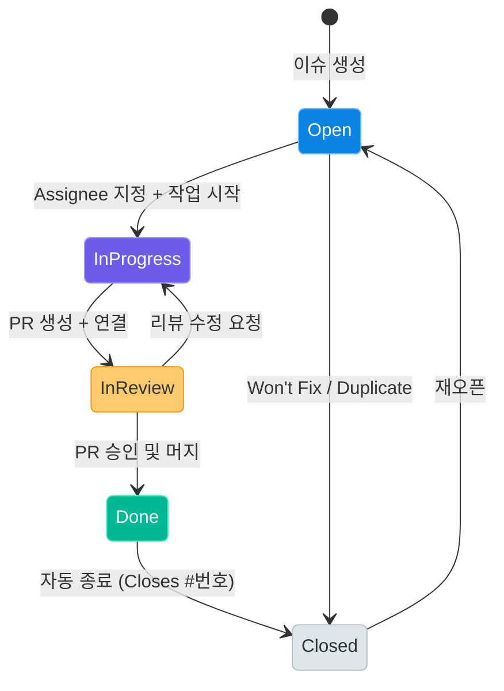
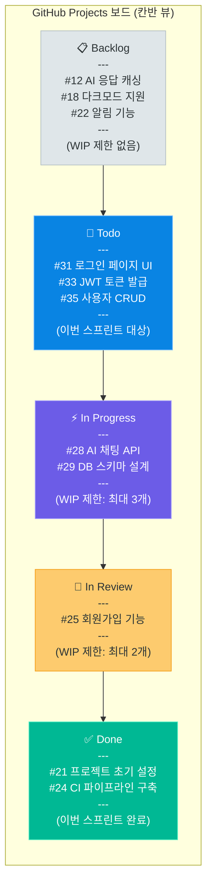
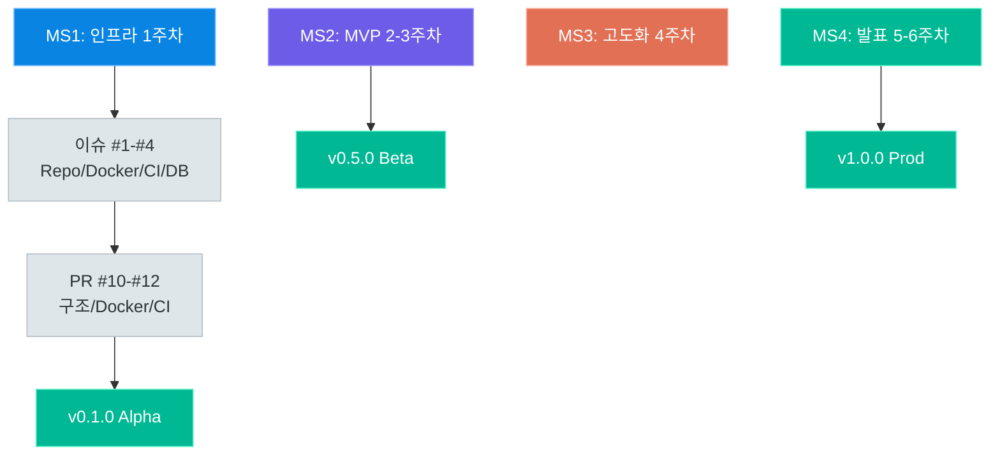
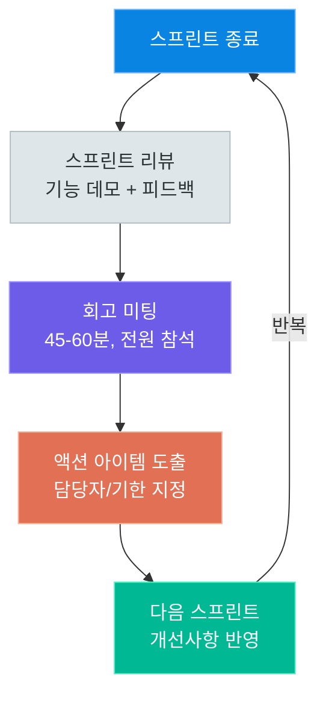

# 이슈 관리

> 코드를 작성하는 것만큼 중요한 것이 '무엇을 만들고 있는지'를 팀 전체가 공유하는 일입니다. GitHub Issues와 Projects를 활용한 체계적인 이슈 관리, 마일스톤과 릴리스 계획, 스프린트 회고와 팀 문서화까지 — 협업 프로젝트를 성공으로 이끄는 이슈 관리의 전 과정을 이 강의에서 배웁니다.

---

## 1. 이슈 관리의 중요성

### 왜 이슈를 체계적으로 관리해야 하는가

소프트웨어 개발은 혼자 하는 작업이 아닙니다. 4~6명이 함께 45일간 프로젝트를 진행하면, 수백 개의 작업이 동시에 진행되고, 수십 개의 버그가 발견되며, 기획이 여러 차례 수정됩니다. 이 모든 정보를 카카오톡 메시지나 구두 전달로 관리하려고 하면 반드시 실패합니다.

체계적인 이슈 관리가 제공하는 네 가지 핵심 가치를 살펴봅니다.

#### 진행 상황 추적 (Progress Tracking)

"지금 팀 전체가 어떤 작업을 하고 있는가?"라는 질문에 즉시 답할 수 있어야 합니다. 이슈 보드를 열면 누가 무엇을 하고 있는지, 어디서 막혔는지, 언제 끝날 예정인지가 한눈에 보여야 합니다. 매일 아침 스탠드업 미팅에서 "어제 뭐 했어요?"가 아니라 이슈 보드를 보며 "이 이슈 어제 완료됐군요, 오늘 리뷰하겠습니다"로 시작하는 팀이 효율적인 팀입니다.

#### 지식 축적 (Knowledge Accumulation)

팀원 중 한 명이 퇴사하거나, 새 팀원이 합류할 때 "이건 왜 이렇게 구현했나요?"라는 질문에 대답하려면 이슈와 커밋 히스토리가 살아있어야 합니다. 이슈에는 왜 이 기능이 필요했는지, 어떤 대안을 검토했는지, 어떤 결정을 내렸는지가 기록됩니다. 이는 팀의 집단 지성이자 살아있는 문서입니다.

#### 책임 할당 (Accountability)

"누가 이 작업을 책임지고 있는가?"가 명확해야 합니다. Assignee 기능으로 특정 이슈의 담당자를 지정하면, 진행 지연 시 책임을 추궁하는 것이 아니라 **블로킹 요인을 파악하고 팀이 도울 수 있는지**를 빠르게 확인할 수 있습니다.

#### 우선순위 관리 (Priority Management)

모든 이슈가 동등하게 중요하지 않습니다. 서비스가 다운되는 Critical 버그와 UI 색상을 조정하는 Low 작업이 같은 우선순위로 대기하면 안 됩니다. 라벨과 마일스톤을 통해 지금 당장 해야 할 것과 나중에 해도 되는 것을 구분합니다.

### 이슈 없이 작업하면 생기는 문제점

| 문제 유형 | 구체적 상황 | 결과 |
|----------|-----------|------|
| **중복 작업** | A와 B가 같은 기능을 각자 구현 | 코드 충돌, 시간 낭비 |
| **누락 작업** | 아무도 기억 못 하는 기능이 배포 전날 발견 | 야근, 품질 저하 |
| **컨텍스트 손실** | "이 버그 고쳤어요?"를 10번 물어봄 | 커뮤니케이션 비용 급증 |
| **범위 크리프** | 요청이 구두로만 전달되어 끝없이 추가 | 일정 지연, 번아웃 |
| **책임 불명확** | "그건 제 담당이 아닌 줄 알았어요" | 신뢰 손상, 팀 갈등 |
| **진행률 불투명** | PM이 데모 직전에 진행률 0%를 확인 | 프로젝트 실패 |

> **핵심 포인트:** 이슈 관리는 관료적 절차가 아닙니다. "기록하는 데 시간을 쓰면 코딩할 시간이 없다"는 생각은 잘못된 것입니다. 이슈 하나를 30초 만에 작성하면, 팀 전체의 커뮤니케이션 비용을 수 시간 절약할 수 있습니다.

---

## 2. GitHub Issues

### 이슈란 무엇인가

GitHub Issues는 버그 리포트, 기능 요청, 작업 항목, 토론 등 프로젝트와 관련된 모든 주제를 추적하는 도구입니다. 각 이슈는 고유한 번호(#1, #2, ...)를 가지며, 커밋 메시지나 PR 설명에서 `#123`으로 참조할 수 있습니다.



### 이슈 템플릿 설계

이슈 템플릿은 `.github/ISSUE_TEMPLATE/` 디렉토리에 YAML 파일로 정의합니다. 팀 프로젝트에서 반드시 준비해야 할 3가지 템플릿을 소개합니다.

#### 템플릿 1: Bug Report (버그 리포트)

버그 리포트는 재현 가능한 정보를 최대한 많이 담아야 합니다. 개발자가 바로 재현하고 수정할 수 있도록 구조화합니다.

```yaml
# .github/ISSUE_TEMPLATE/bug_report.yml
name: "버그 리포트"
description: "서비스에서 발견된 버그를 신고합니다"
title: "[BUG] "
labels: ["type:bug", "status:triage"]
assignees: []

body:
  - type: markdown
    attributes:
      value: |
        버그를 발견해 주셔서 감사합니다. 아래 항목을 최대한 상세히 작성해 주세요.

  - type: textarea
    id: description
    attributes:
      label: "버그 설명"
      description: "어떤 문제가 발생했나요?"
      placeholder: "로그인 버튼을 클릭하면 500 에러가 발생합니다."
    validations:
      required: true

  - type: textarea
    id: reproduction
    attributes:
      label: "재현 단계"
      description: "버그를 재현하는 방법을 단계별로 설명해 주세요."
      placeholder: |
        1. 메인 페이지로 이동합니다.
        2. '로그인' 버튼을 클릭합니다.
        3. 이메일과 비밀번호를 입력합니다.
        4. '로그인' 버튼을 클릭합니다.
        5. 500 Internal Server Error 페이지가 표시됩니다.
    validations:
      required: true

  - type: textarea
    id: expected
    attributes:
      label: "예상 동작"
      description: "정상적으로 작동할 때 어떤 결과가 나와야 하나요?"
      placeholder: "로그인 성공 후 대시보드 페이지로 이동해야 합니다."
    validations:
      required: true

  - type: textarea
    id: actual
    attributes:
      label: "실제 동작"
      description: "실제로는 어떤 결과가 나왔나요?"
      placeholder: "500 Internal Server Error가 발생하며 페이지가 흰 화면으로 변합니다."
    validations:
      required: true

  - type: textarea
    id: environment
    attributes:
      label: "환경 정보"
      placeholder: |
        - OS: Ubuntu 22.04 / macOS 14.0 / Windows 11
        - 브라우저: Chrome 123.0
        - Python 버전: 3.11.0
        - 서비스 URL: https://staging.example.com
    validations:
      required: false

  - type: textarea
    id: logs
    attributes:
      label: "로그 / 스크린샷"
      description: "관련 에러 로그나 스크린샷을 첨부해 주세요."
      render: shell
    validations:
      required: false

  - type: dropdown
    id: priority
    attributes:
      label: "심각도"
      options:
        - "Critical - 서비스 전체가 동작하지 않음"
        - "High - 주요 기능이 동작하지 않음"
        - "Medium - 일부 기능에 문제가 있음"
        - "Low - 경미한 문제 또는 불편함"
    validations:
      required: true
```

#### 템플릿 2: Feature Request (기능 요청)

새로운 기능을 요청할 때는 비즈니스 맥락과 기술적 구현 방향을 함께 제시해야 합니다.

```yaml
# .github/ISSUE_TEMPLATE/feature_request.yml
name: "기능 요청"
description: "새로운 기능이나 개선사항을 제안합니다"
title: "[FEAT] "
labels: ["type:feature", "status:triage"]
assignees: []

body:
  - type: markdown
    attributes:
      value: |
        좋은 아이디어를 제안해 주셔서 감사합니다. 기능의 배경과 목적을 명확히 설명해 주세요.

  - type: textarea
    id: background
    attributes:
      label: "배경 및 문제 상황"
      description: "이 기능이 왜 필요한가요? 어떤 문제를 해결하나요?"
      placeholder: |
        현재 사용자는 AI 답변을 복사하려면 전체 텍스트를 드래그해야 합니다.
        모바일에서는 이 작업이 매우 불편합니다.
    validations:
      required: true

  - type: textarea
    id: proposal
    attributes:
      label: "제안하는 해결책"
      description: "어떤 기능을 구현하면 문제가 해결될까요?"
      placeholder: |
        각 AI 답변 카드 우측 상단에 '복사' 버튼을 추가합니다.
        클릭 시 클립보드에 텍스트가 복사되고, 버튼이 '✓ 복사됨'으로 2초간 변경됩니다.
    validations:
      required: true

  - type: textarea
    id: alternatives
    attributes:
      label: "검토한 대안"
      description: "다른 방법은 없었나요? 왜 이 방법을 선택했나요?"
      placeholder: |
        대안 1: 더블 클릭으로 전체 선택 → 모바일 지원이 불명확
        대안 2: 우클릭 컨텍스트 메뉴 → 모바일에서 지원 안 됨
        제안한 방법이 가장 직관적이고 크로스 플랫폼 호환성이 높습니다.
    validations:
      required: false

  - type: textarea
    id: acceptance_criteria
    attributes:
      label: "완료 조건 (Acceptance Criteria)"
      description: "이 기능이 완성되었다고 판단하는 기준은 무엇인가요?"
      placeholder: |
        - [ ] PC/모바일 브라우저에서 복사 버튼이 표시된다
        - [ ] 클릭 시 클립보드에 텍스트가 정상 복사된다
        - [ ] 복사 후 2초간 성공 피드백이 표시된다
        - [ ] 스크린 리더 사용자도 사용 가능하다 (aria-label 제공)
    validations:
      required: true

  - type: dropdown
    id: priority
    attributes:
      label: "우선순위"
      options:
        - "High - 이번 스프린트에 반드시 필요"
        - "Medium - 다음 스프린트에 포함 가능"
        - "Low - 여유가 될 때 처리"
    validations:
      required: true
```

#### 템플릿 3: Task (작업 항목)

기능 구현, 리팩토링, 문서 작성 등 일반적인 개발 작업을 위한 템플릿입니다.

```yaml
# .github/ISSUE_TEMPLATE/task.yml
name: "작업 항목"
description: "개발 작업, 리팩토링, 문서화 등의 작업을 등록합니다"
title: "[TASK] "
labels: ["type:task"]
assignees: []

body:
  - type: textarea
    id: description
    attributes:
      label: "작업 설명"
      description: "어떤 작업을 해야 하나요?"
      placeholder: |
        사용자 인증 모듈을 JWT에서 세션 기반으로 마이그레이션합니다.
        보안 감사 결과에 따른 조치사항입니다.
    validations:
      required: true

  - type: textarea
    id: done_criteria
    attributes:
      label: "완료 조건"
      description: "작업이 완료된 것을 어떻게 확인하나요?"
      placeholder: |
        - [ ] 기존 JWT 관련 코드 제거
        - [ ] 세션 미들웨어 설정 완료
        - [ ] 기존 테스트 케이스 모두 통과
        - [ ] 새로운 세션 관련 테스트 추가
        - [ ] 마이그레이션 가이드 문서 작성
    validations:
      required: true

  - type: textarea
    id: related_issues
    attributes:
      label: "관련 이슈"
      description: "이 작업과 연관된 이슈나 PR이 있나요?"
      placeholder: |
        - 관련 이슈: #42 (보안 취약점 발견)
        - 선행 작업: #38 (데이터베이스 스키마 수정) 완료 후 진행
        - 후속 작업: #51 (API 문서 업데이트)
    validations:
      required: false

  - type: input
    id: estimate
    attributes:
      label: "예상 소요 시간"
      placeholder: "예: 4시간, 2일"
    validations:
      required: false
```

### 라벨 체계 설계

라벨은 이슈를 분류하고 필터링하는 핵심 수단입니다. 세 가지 축으로 라벨 체계를 설계합니다.

#### type: 이슈 유형

| 라벨 이름 | 색상 | 설명 |
|----------|------|------|
| `type:bug` | `#e17055` (빨강) | 버그, 오류, 예상치 못한 동작 |
| `type:feature` | `#0984e3` (파랑) | 새로운 기능 추가 |
| `type:docs` | `#6c5ce7` (보라) | 문서 작성, 주석 개선 |
| `type:refactor` | `#fdcb6e` (노랑) | 기능 변경 없는 코드 개선 |
| `type:test` | `#00b894` (초록) | 테스트 코드 추가/수정 |
| `type:chore` | `#dfe6e9` (회색) | 빌드, CI/CD, 의존성 관리 |

#### priority: 우선순위

| 라벨 이름 | 색상 | 설명 | 대응 시간 |
|----------|------|------|---------|
| `priority:critical` | `#d63031` (진빨강) | 서비스 중단 수준의 심각한 문제 | 즉시 |
| `priority:high` | `#e17055` (주황) | 주요 기능 장애, 이번 스프린트 필수 | 24시간 내 |
| `priority:medium` | `#fdcb6e` (노랑) | 일반적인 버그나 기능 | 다음 스프린트 |
| `priority:low` | `#00b894` (초록) | 있으면 좋은 개선사항 | 여유 시 |

#### status: 진행 상태

| 라벨 이름 | 설명 |
|----------|------|
| `status:triage` | 분류 및 검토 필요 |
| `status:in-progress` | 현재 작업 중 |
| `status:review` | PR 리뷰 진행 중 |
| `status:blocked` | 다른 이슈나 외부 요인으로 차단됨 |
| `status:wont-fix` | 수정하지 않기로 결정 |
| `status:duplicate` | 중복 이슈 |

라벨은 GitHub CLI로 일괄 생성할 수 있습니다.

```bash
# GitHub CLI로 라벨 일괄 생성
gh label create "type:bug"      --color "e17055" --description "버그 및 오류"
gh label create "type:feature"  --color "0984e3" --description "새로운 기능"
gh label create "type:docs"     --color "6c5ce7" --description "문서 작성"
gh label create "type:refactor" --color "fdcb6e" --description "코드 개선"
gh label create "type:test"     --color "00b894" --description "테스트 코드"
gh label create "type:chore"    --color "dfe6e9" --description "빌드 및 설정"

gh label create "priority:critical" --color "d63031" --description "즉시 처리 필요"
gh label create "priority:high"     --color "e17055" --description "높은 우선순위"
gh label create "priority:medium"   --color "fdcb6e" --description "중간 우선순위"
gh label create "priority:low"      --color "00b894" --description "낮은 우선순위"

gh label create "status:triage"      --color "b2bec3" --description "분류 필요"
gh label create "status:in-progress" --color "6c5ce7" --description "작업 중"
gh label create "status:review"      --color "fdcb6e" --description "리뷰 중"
gh label create "status:blocked"     --color "d63031" --description "차단됨"
```

### Assignee와 멘션 활용

**Assignee(담당자)**는 이슈의 직접 책임자입니다. 하나의 이슈에 여러 명을 지정할 수 있지만, 책임이 분산되므로 가급적 한 명이 주담당자가 되도록 합니다.

**멘션(@)**은 특정 팀원의 주의를 끌 때 사용합니다. 이슈 댓글에서 `@username`을 입력하면 해당 팀원에게 알림이 전송됩니다.

```markdown
<!-- 이슈 댓글 작성 예시 -->

## 진행 상황 업데이트

백엔드 API 구현 완료했습니다.

@frontend-dev 프론트엔드 연동 시 `Authorization: Bearer {token}` 헤더가 필요합니다.
API 명세는 [여기](./docs/api.md)를 참고해 주세요.

블로킹 이슈: #45 (JWT 시크릿 키 환경변수 설정)가 먼저 완료되어야 합니다.
@devops-lead 환경변수 설정 부탁드립니다!

관련 PR: #52
```

**이슈와 PR 연결:** PR 설명에 `Closes #이슈번호`를 작성하면 PR이 머지될 때 해당 이슈가 자동으로 닫힙니다.

```markdown
## PR 설명 예시

### 변경 사항
- 사용자 프로필 편집 API 구현 (PUT /api/users/{id})
- 프로필 이미지 업로드 기능 추가 (S3 연동)

### 테스트 방법
1. `docker-compose up` 실행
2. Swagger UI에서 PUT /api/users/1 호출
3. 응답 200 확인

Closes #34
Related to #28
```

---

## 3. GitHub Projects

### 프로젝트 보드란 무엇인가

GitHub Projects는 이슈와 PR을 시각적으로 관리하는 프로젝트 관리 도구입니다. 칸반 보드, 테이블, 로드맵 등 다양한 뷰를 지원하며, 팀 전체의 작업 흐름을 한눈에 파악할 수 있습니다.



### 프로젝트 보드 생성

1. GitHub 리포지토리 페이지에서 **Projects** 탭 클릭
2. **New project** 버튼 클릭
3. **Board** 템플릿 선택 (칸반 뷰)
4. 프로젝트 이름 입력 (예: `Sprint 1 - 핵심 기능 개발`)
5. **Create** 클릭

기본 제공되는 열(Todo, In Progress, Done)에 **Backlog**와 **In Review**를 추가합니다.

### 칸반 뷰 설정

#### 열(Column) 설정

각 열에는 의미 있는 이름과 함께 WIP(Work In Progress) 제한을 설정합니다.

| 열 이름 | 설명 | WIP 제한 |
|--------|------|---------|
| **Backlog** | 언젠가 할 모든 작업 | 제한 없음 |
| **Todo** | 현재 스프린트에서 할 작업 | 스프린트 용량의 120% |
| **In Progress** | 현재 진행 중인 작업 | 팀원 수 × 1.5 |
| **In Review** | PR 생성 후 리뷰 대기 중 | 팀원 수 |
| **Done** | 이번 스프린트에서 완료된 작업 | 제한 없음 |

> **핵심 포인트:** WIP 제한은 멀티태스킹을 방지하고 흐름을 개선하는 핵심 원칙입니다. "In Progress"가 10개라면 실제로는 아무것도 진행되지 않는 것과 같습니다. 팀원 4명이라면 동시에 최대 6개(4 × 1.5)의 작업이 진행 중이어야 합니다.

#### WIP 제한 초과 시 대응

WIP 제한이 초과되면 새 작업을 시작하기 전에 기존 작업을 완료하거나, 막힌 작업을 팀이 함께 해결해야 합니다.

```
WIP 제한 초과 시 행동 순서:
1. In Review 상태의 PR을 먼저 리뷰한다
2. Blocked 상태의 이슈를 함께 해결한다
3. 가장 오래된 In Progress 이슈를 완료한다
4. 그 후에 새로운 작업을 시작한다
```

### 테이블 뷰와 필드 커스텀

테이블 뷰는 스프레드시트처럼 이슈 목록을 관리할 수 있습니다. 다음 필드를 커스텀 필드로 추가합니다.

| 필드 이름 | 필드 타입 | 옵션/설명 |
|---------|---------|---------|
| **Status** | 단일 선택 | Backlog / Todo / In Progress / In Review / Done |
| **Priority** | 단일 선택 | Critical / High / Medium / Low |
| **Sprint** | 반복(Iteration) | Sprint 1, Sprint 2, Sprint 3 (1주 단위) |
| **Size** | 단일 선택 | XS(1h) / S(2h) / M(4h) / L(1d) / XL(2d+) |
| **Assignee** | 기본 제공 | 담당자 |
| **Labels** | 기본 제공 | 이슈 라벨 |

#### 스토리 포인트 대신 사이즈 사용

스크럼에서는 스토리 포인트를 사용하지만, 소규모 팀 프로젝트에서는 **티셔츠 사이즈(XS/S/M/L/XL)**가 더 직관적입니다. 각 크기는 예상 소요 시간에 해당합니다.

```
XS = 1시간 이하  (예: 오타 수정, 색상 변경)
S  = 2시간       (예: 간단한 API 엔드포인트 1개)
M  = 4시간       (예: CRUD 기능 구현)
L  = 1일         (예: 복잡한 비즈니스 로직 구현)
XL = 2일 이상    (예: 아키텍처 변경, 대규모 리팩토링)
```

### 자동화 규칙

GitHub Projects의 자동화 기능으로 수동 작업을 최소화합니다.

#### 기본 자동화 규칙 설정

```yaml
# 자동화 규칙 1: 이슈가 열리면 → Backlog로 이동
trigger: issue_opened
action: move_to_column
target: Backlog

# 자동화 규칙 2: 이슈에 Assignee 지정 → In Progress로 이동
trigger: issue_assigned
action: move_to_column
target: In Progress

# 자동화 규칙 3: PR이 열리면 → In Review로 이동
trigger: pull_request_opened
action: move_to_column
target: In Review

# 자동화 규칙 4: PR이 머지되면 → Done으로 이동 (연결된 이슈 포함)
trigger: pull_request_merged
action: move_to_column
target: Done

# 자동화 규칙 5: 이슈가 닫히면 → Done으로 이동
trigger: issue_closed
action: move_to_column
target: Done
```

#### GitHub Actions를 활용한 고급 자동화

```yaml
# .github/workflows/project-automation.yml
name: Project Automation

on:
  issues:
    types: [opened, assigned, closed]
  pull_request:
    types: [opened, closed, review_requested]

jobs:
  update-project:
    runs-on: ubuntu-latest
    steps:
      - name: Add issue to project when opened
        if: github.event_name == 'issues' && github.event.action == 'opened'
        uses: actions/add-to-project@v0.5.0
        with:
          project-url: https://github.com/orgs/YOUR_ORG/projects/1
          github-token: ${{ secrets.PROJECT_TOKEN }}

      - name: Set status to In Progress when assigned
        if: >
          github.event_name == 'issues' &&
          github.event.action == 'assigned'
        run: |
          echo "이슈 #${{ github.event.issue.number }}이(가) ${{ github.event.assignee.login }}에게 할당됨"
          # GitHub CLI를 사용하여 프로젝트 필드 업데이트
          gh project item-edit \
            --project-id $PROJECT_ID \
            --id $ITEM_ID \
            --field-id $STATUS_FIELD_ID \
            --single-select-option-id $IN_PROGRESS_OPTION_ID
        env:
          GH_TOKEN: ${{ secrets.PROJECT_TOKEN }}
```

### 필터와 그룹화

Projects에서 원하는 정보를 빠르게 찾는 방법입니다.

```
# 내가 담당한 이슈만 보기
assignee:@me

# 이번 스프린트의 In Progress 이슈만 보기
sprint:"Sprint 2" status:"In Progress"

# 높은 우선순위 미완료 이슈만 보기
priority:high -status:Done

# 특정 라벨의 이슈만 보기
label:"type:bug"

# 완료되지 않은 이슈 중 S/M 사이즈만 보기
-status:Done size:S,M
```

**그룹화(Group by)** 기능으로 이슈를 다양한 기준으로 묶어 볼 수 있습니다.

- **담당자별 그룹화**: 팀원 각자의 워크로드 확인
- **우선순위별 그룹화**: Critical/High 작업 집중 처리
- **스프린트별 그룹화**: 스프린트 완료율 추적
- **라벨별 그룹화**: 버그 vs 기능 vs 문서 작업 비율 확인

---

## 4. 마일스톤과 릴리스

### 마일스톤이란 무엇인가

마일스톤(Milestone)은 특정 날짜까지 완료해야 할 이슈들의 묶음입니다. 프로젝트의 주요 목표 지점을 나타내며, 진행률을 백분율로 확인할 수 있습니다.



### 마일스톤 설정 방법

1. GitHub 리포지토리 → **Issues** → **Milestones** → **New milestone**
2. 다음 정보를 입력합니다.

| 항목 | 설명 | 예시 |
|-----|------|------|
| **Title** | 마일스톤 이름 | `v0.1.0 - MVP Alpha` |
| **Due date** | 목표 완료일 | `2026-05-07` |
| **Description** | 이 마일스톤의 목표 | `기본 인프라 구성 및 핵심 API 구현 완료` |

3. 이슈 생성 또는 편집 시 **Milestone** 드롭다운에서 해당 마일스톤 선택

### 진행률 추적

마일스톤 페이지에서는 **완료된 이슈 수 / 전체 이슈 수**로 진행률을 자동 계산합니다.

```
마일스톤 진행률 예시:
v0.1.0 - MVP Alpha
━━━━━━━━━━━━━━━━━━━░░░░░░  67%

완료: 8개 이슈
미완료: 4개 이슈
마감일까지: 3일 남음
```

이슈를 닫으면(Close) 자동으로 진행률이 올라갑니다. 마감일이 지났는데 진행률이 100%가 아니라면 빨간색 경고가 표시됩니다.

### Semantic Versioning (시맨틱 버저닝)

소프트웨어 버전은 **MAJOR.MINOR.PATCH** 형식을 따릅니다.

```
버전 형식: MAJOR.MINOR.PATCH
예시: 2.4.1

MAJOR: 하위 호환성이 없는 API 변경 (Breaking Change)
       이전 버전과 호환되지 않는 큰 변경
       예) v1.x.x → v2.0.0

MINOR: 하위 호환성을 유지하는 새 기능 추가
       기존 기능은 그대로, 새 기능 추가
       예) v1.3.0 → v1.4.0

PATCH: 하위 호환성을 유지하는 버그 수정
       기능 변화 없이 버그만 수정
       예) v1.4.2 → v1.4.3
```

팀 프로젝트에서의 버전 규칙 예시.

| 버전 | 시점 | 내용 |
|-----|------|------|
| `v0.1.0` | 1주차 완료 | 프로젝트 초기 설정, CI 구축 |
| `v0.2.0` | 2주차 완료 | 사용자 인증 기능 구현 |
| `v0.3.0` | 3주차 완료 | AI 채팅 핵심 기능 구현 |
| `v0.9.0` | 4주차 완료 | 베타 버전, 전체 기능 완성 |
| `v1.0.0` | 최종 발표 | 프로덕션 릴리스 |

### git tag 관리

```bash
# 태그 생성 (annotated tag 권장)
git tag -a v0.1.0 -m "Alpha: 기초 인프라 구성 완료

- GitHub Actions CI 파이프라인 설정
- Docker Compose 개발 환경 구성
- 데이터베이스 초기 스키마 적용
- FastAPI 기본 구조 설정"

# 태그를 원격 저장소에 푸시
git push origin v0.1.0

# 모든 태그 푸시
git push origin --tags

# 태그 목록 확인
git tag -l

# 태그 정보 확인
git show v0.1.0

# 특정 태그로 체크아웃 (읽기 전용)
git checkout v0.1.0

# 태그 삭제 (원격)
git push origin --delete v0.1.0
```

### 릴리스 노트 작성

GitHub에서 태그를 기반으로 릴리스를 생성하고 릴리스 노트를 작성합니다.

**자동 생성 기능 활용:**

```yaml
# .github/release.yml - 자동 릴리스 노트 카테고리 설정
changelog:
  exclude:
    labels:
      - ignore-for-release
  categories:
    - title: "새로운 기능"
      labels:
        - "type:feature"
    - title: "버그 수정"
      labels:
        - "type:bug"
    - title: "문서 개선"
      labels:
        - "type:docs"
    - title: "성능 개선"
      labels:
        - "type:refactor"
    - title: "기타 변경사항"
```

**릴리스 노트 템플릿:**

```markdown
## v0.3.0 - AI 채팅 핵심 기능 구현 (2026-05-21)

### 새로운 기능
- AI 채팅 API 구현 (OpenAI GPT-4o 연동) (#28)
- 채팅 히스토리 저장 및 조회 기능 (#31)
- 스트리밍 응답 지원 (#33)

### 버그 수정
- 로그인 토큰 만료 시 무한 루프 문제 수정 (#35)
- 모바일에서 채팅 입력창 키보드 겹침 현상 수정 (#37)

### 성능 개선
- Redis 캐싱 적용으로 응답 속도 40% 개선 (#39)

### 업그레이드 방법
```bash
git pull origin main
docker-compose down && docker-compose up -d
python manage.py migrate
```

### 다음 버전 예고 (v0.4.0)
- 멀티모달 이미지 업로드 지원
- 팀별 채팅방 분리 기능
```

---

## 5. 스프린트 회고

### 회고란 무엇인가

스프린트 회고(Retrospective)는 팀이 일정 주기로 모여 **"우리는 어떻게 일하고 있는가?"**를 점검하는 시간입니다. 코드 품질이 아닌 **팀의 일하는 방식**을 개선하는 것이 목적입니다.



### KPT 프레임워크

KPT는 **Keep(유지), Problem(문제), Try(시도)**의 약자로, 가장 널리 사용되는 회고 프레임워크입니다.

| 구분 | 질문 | 예시 |
|-----|------|------|
| **Keep** | 잘 되고 있어서 계속해야 할 것은? | 매일 아침 10분 스탠드업이 효과적이었다 |
| **Problem** | 문제가 되었거나 개선이 필요한 것은? | PR 리뷰가 3일 이상 지연되는 경우가 많다 |
| **Try** | 다음 스프린트에 새로 시도해 볼 것은? | PR 리뷰는 24시간 내 첫 피드백 규칙 도입 |

#### KPT 진행 방법

```
1단계 - 개인 아이템 작성 (10분)
   - 각자 포스트잇(또는 Google Jamboard)에 KPT 작성
   - 익명으로 작성 권장 (솔직한 의견 유도)

2단계 - 공유 및 그룹화 (15분)
   - 한 명씩 아이템을 발표하며 보드에 붙이기
   - 유사한 아이템끼리 그룹화
   - 질문과 명확화 허용, 토론은 다음 단계에서

3단계 - 우선순위 투표 (5분)
   - Problem 아이템에 각자 3개 투표권 사용
   - 투표 수가 많은 순서로 정렬

4단계 - Try 아이디어 도출 (15분)
   - 상위 2~3개 Problem에 대한 Try 아이템 브레인스토밍
   - 실현 가능하고 측정 가능한 아이디어 선정

5단계 - 액션 아이템 확정 (5분)
   - 다음 스프린트에 실행할 Try 2~3개 선정
   - 담당자와 완료 기준 명확히 지정
```

### 4Ls 프레임워크

4Ls는 **Liked(좋았던 것), Learned(배운 것), Lacked(부족했던 것), Longed For(바라는 것)**의 약자로, KPT보다 학습에 초점을 맞춘 프레임워크입니다.

| 구분 | 핵심 질문 | 초점 |
|-----|---------|------|
| **Liked** | 좋았던 것은 무엇인가? | 긍정적 경험, 잘 된 점 |
| **Learned** | 무엇을 새로 배웠는가? | 기술적/협업적 학습 |
| **Lacked** | 무엇이 부족했는가? | 개선이 필요한 자원/역량/프로세스 |
| **Longed For** | 어떤 것이 있었으면 했는가? | 바라는 도구/환경/지원 |

> **핵심 포인트:** KPT는 프로세스 개선에, 4Ls는 팀 학습과 성장에 더 적합합니다. 프로젝트 초반에는 KPT로 일하는 방식을 정비하고, 중반 이후에는 4Ls로 팀의 성장을 추적하는 것이 효과적입니다.

### 회고 진행의 핵심 원칙

#### 타임박싱(Timeboxing)

회고 미팅은 반드시 시간을 정해두고 진행합니다. 타임박싱이 없으면 특정 주제에 너무 많은 시간을 쓰거나, 감정적인 토론으로 흘러갈 수 있습니다.

```
권장 회고 타임박스 (총 60분):
┌─────────────────────────────────┐
│ 체크인 / 분위기 조성     5분    │
│ 지난 회고 액션 아이템 검토  5분 │
│ 개인 아이템 작성         10분   │
│ 공유 및 그룹화           15분   │
│ 투표 및 우선순위 선정     5분   │
│ 토론 및 Try 도출         15분   │
│ 액션 아이템 확정          5분   │
└─────────────────────────────────┘
```

#### 익명 투표

민감한 주제(팀원 간 갈등, 팀 리더의 의사결정 등)를 다룰 때는 익명 투표 도구를 활용합니다.

```
익명 투표 도구:
- Google Forms (간단한 설문)
- Mentimeter (실시간 투표 및 워드클라우드)
- FigJam (시각적 협업 보드)
- Retrium (전용 회고 도구)
```

### GitHub Discussion을 활용한 회고 템플릿

```markdown
<!-- GitHub Discussion에 게시 -->
## 스프린트 2 회고 (2026-05-14 ~ 2026-05-21)

### 참석자
- @alice (퍼실리테이터)
- @bob, @charlie, @diana, @edward

---

## Keep (계속 유지할 것)

### [K1] 매일 아침 10분 스탠드업
**투표: ⭐⭐⭐⭐⭐ (5표)**
- 어제 한 일, 오늘 할 일, 블로킹 요인을 공유하는 스탠드업이 팀 동기화에 효과적이었습니다.

### [K2] PR에 스크린샷 첨부 관행
**투표: ⭐⭐⭐ (3표)**
- UI 관련 PR에 변경 전/후 스크린샷을 첨부하니 리뷰가 훨씬 빨라졌습니다.

---

## Problem (개선이 필요한 것)

### [P1] PR 리뷰 지연
**투표: ⭐⭐⭐⭐⭐ (5표)**
- 이번 스프린트에서 PR이 평균 2.5일 동안 리뷰되지 않고 대기했습니다.
- 리뷰 대기 중 다른 작업이 블로킹되는 상황이 4회 발생했습니다.

### [P2] 이슈 설명 불충분
**투표: ⭐⭐⭐ (3표)**
- 이슈를 받은 담당자가 추가 질문을 3회 이상 해야 하는 경우가 있었습니다.
- 완료 조건(Acceptance Criteria)이 없는 이슈가 40%를 넘었습니다.

---

## Try (다음 스프린트에 시도할 것)

### [T1] PR 리뷰 24시간 규칙 도입 ← [P1] 해결책
**담당자: @alice (모니터링)**
**완료 기준: 스프린트 종료 시 평균 리뷰 대기 시간 1일 이하**
- PR 생성 후 24시간 내에 최소 1명이 첫 피드백을 제공합니다.
- 매일 스탠드업에서 24시간 이상 된 PR 리스트를 확인합니다.

### [T2] 이슈 템플릿 필수 필드 강화 ← [P2] 해결책
**담당자: @bob (템플릿 수정)**
**완료 기준: 완료 조건 없는 이슈 0건 달성**
- Task 이슈 템플릿에서 완료 조건(Acceptance Criteria) 필드를 required로 변경합니다.

---

## 액션 아이템 이슈
- [ ] #78 PR 리뷰 24시간 규칙 팀 문서 추가 (@alice)
- [ ] #79 이슈 템플릿 완료 조건 필드 required 설정 (@bob)
```

### 액션 아이템 추적

회고에서 나온 Try 아이템은 반드시 GitHub Issues에 등록하고 다음 스프린트의 마일스톤에 포함시킵니다.

```
액션 아이템 기준 (SMART 원칙):
Specific   - 구체적: "PR 리뷰를 빨리 한다" (X) → "24시간 내 첫 피드백" (O)
Measurable - 측정 가능: 완료 여부를 숫자로 확인 가능해야 함
Achievable - 달성 가능: 이번 스프린트 내에 실행 가능한 범위
Relevant   - 관련성: 팀의 실제 문제를 해결하는 것이어야 함
Time-bound - 기한: 다음 회고일까지 완료
```

---

## 6. 프로젝트 문서화

### 왜 문서화가 중요한가

"코드는 거짓말하지 않지만, 왜 그렇게 작성했는지는 알려주지 않는다." 좋은 문서는 팀원의 온보딩 속도를 높이고, 기술 부채를 줄이며, 프로젝트의 지속 가능성을 높입니다.

### README 구조

README는 프로젝트의 첫인상입니다. 처음 리포지토리를 방문하는 사람이 30초 안에 "이 프로젝트가 무엇인지"를 이해할 수 있어야 합니다.

```markdown
<!-- README.md 템플릿 -->

<div align="center">
  <h1>🤖 AI Chat Assistant</h1>
  <p>생성형 AI 기반 멀티턴 채팅 서비스</p>

  <!-- 뱃지 -->
  
  
  
  
</div>

---

## 프로젝트 소개

AI Chat Assistant는 OpenAI GPT-4o 모델을 활용한 웹 기반 채팅 서비스입니다.
멀티턴 대화, 채팅 히스토리 저장, 마크다운 렌더링을 지원합니다.

> **데모**: https://ai-chat-demo.example.com
> **API 문서**: https://ai-chat-demo.example.com/docs

---

## 시작하기 (Getting Started)

### 사전 요구사항

- Python 3.11 이상
- Docker & Docker Compose
- OpenAI API 키

### 설치 및 실행

```bash
# 1. 리포지토리 클론
git clone https://github.com/your-team/ai-chat-assistant.git
cd ai-chat-assistant

# 2. 환경 변수 설정
cp .env.example .env
# .env 파일에서 OPENAI_API_KEY 설정

# 3. Docker로 실행
docker-compose up -d

# 4. 서비스 확인
open http://localhost:8000
```

### 개발 환경 설정

```bash
# 가상환경 생성 및 활성화
python -m venv venv
source venv/bin/activate  # Windows: venv\Scripts\activate

# 의존성 설치
pip install -r requirements-dev.txt

# 개발 서버 실행
uvicorn app.main:app --reload --port 8000
```

---

## 기술 스택

### Backend
| 기술 | 버전 | 역할 |
|-----|------|------|
| Python | 3.11 | 주 개발 언어 |
| FastAPI | 0.104 | REST API 프레임워크 |
| SQLAlchemy | 2.0 | ORM |
| PostgreSQL | 15 | 메인 데이터베이스 |
| Redis | 7 | 캐싱 및 세션 |

### Frontend
| 기술 | 버전 | 역할 |
|-----|------|------|
| React | 18 | UI 라이브러리 |
| TypeScript | 5 | 타입 안전성 |
| Tailwind CSS | 3 | 스타일링 |

### AI / Infrastructure
| 기술 | 역할 |
|-----|------|
| OpenAI GPT-4o | AI 채팅 엔진 |
| AWS EC2 | 서버 호스팅 |
| AWS S3 | 파일 스토리지 |
| GitHub Actions | CI/CD |

---

## 프로젝트 구조

```
ai-chat-assistant/
├── app/
│   ├── api/          # API 라우터
│   ├── core/         # 설정, 보안, 의존성
│   ├── models/       # DB 모델
│   ├── schemas/      # Pydantic 스키마
│   ├── services/     # 비즈니스 로직
│   └── main.py       # 앱 진입점
├── frontend/         # React 프론트엔드
├── tests/            # 테스트 코드
├── docker-compose.yml
├── Dockerfile
└── README.md
```

---

## 팀원 (Team)

| 이름 | 역할 | GitHub |
|-----|------|--------|
| 김민준 | 팀장, Backend | [@minjun-kim](https://github.com/minjun-kim) |
| 이서연 | Frontend | [@seoyeon-lee](https://github.com/seoyeon-lee) |
| 박지호 | AI 엔지니어 | [@jiho-park](https://github.com/jiho-park) |
| 최다은 | DevOps | [@daeun-choi](https://github.com/daeun-choi) |

---

## 라이선스

이 프로젝트는 [MIT 라이선스](LICENSE) 하에 공개됩니다.
```

### GitHub Wiki 활용

GitHub Wiki는 프로젝트의 상세 문서를 관리하는 공간입니다. README에는 담기 어려운 긴 내용을 Wiki에 정리합니다.

#### 권장 Wiki 페이지 구성

```
Wiki 페이지 목록:
├── Home (홈)
│   └── Wiki 전체 목차 및 네비게이션
│
├── 설계 문서 (Design Docs)
│   ├── 시스템 아키텍처
│   ├── 데이터베이스 ERD
│   ├── API 설계 원칙
│   └── 보안 정책
│
├── 개발 가이드 (Development Guide)
│   ├── 개발 환경 셋업
│   ├── 코딩 컨벤션
│   ├── 브랜치 전략
│   └── 배포 프로세스
│
├── 회의록 (Meeting Notes)
│   ├── 2026-05-07 킥오프 미팅
│   ├── 2026-05-14 스프린트 1 리뷰
│   └── 2026-05-21 스프린트 2 리뷰
│
└── 온보딩 (Onboarding)
    ├── 새 팀원 가이드
    └── 환경 변수 가이드
```

### ADR (Architecture Decision Record)

중요한 아키텍처 결정을 기록하는 형식입니다. "왜 이 기술을 선택했는가?"라는 질문에 답합니다.

```markdown
<!-- docs/adr/001-database-selection.md -->

# ADR 001: 데이터베이스 선택 - PostgreSQL vs MySQL

## 상태 (Status)
Accepted (2026-05-08)

## 배경 (Context)
AI 채팅 서비스를 개발하기 위해 관계형 데이터베이스 시스템을 선택해야 합니다.
주요 요구사항은 다음과 같습니다.
- JSON 데이터 저장 (채팅 히스토리, AI 응답 메타데이터)
- 텍스트 검색 기능 (채팅 기록 검색)
- 팀의 학습 곡선 최소화

## 결정 (Decision)
**PostgreSQL 15**를 사용합니다.

## 근거 (Rationale)

| 기준 | PostgreSQL | MySQL |
|-----|-----------|-------|
| JSON 지원 | JSONB (인덱스 지원) | JSON (제한적) |
| 전문 검색 | 내장 FTS 지원 | 별도 설정 필요 |
| 트랜잭션 | ACID 완전 지원 | 기본 지원 |
| 팀 경험 | 3명 경험 있음 | 1명 경험 있음 |

## 결과 (Consequences)
- 긍정: JSON 쿼리와 전문 검색을 단순하게 구현 가능
- 긍정: 팀 내 경험자가 많아 초기 설정이 빠름
- 부정: MySQL보다 메모리 사용량이 약간 높음
- 부정: 일부 호스팅 서비스에서 MySQL이 기본값이라 별도 설정 필요

## 대안 (Alternatives Considered)
- **MySQL 8.0**: 더 낮은 메모리 사용, 하지만 JSON 지원이 제한적
- **MongoDB**: JSON이 자연스럽지만, 팀 학습 비용이 높고 트랜잭션이 복잡
```

### CONTRIBUTING.md

새로운 기여자가 프로젝트에 참여하는 방법을 안내합니다.

```markdown
<!-- CONTRIBUTING.md -->

# 기여 가이드 (Contributing Guide)

AI Chat Assistant 프로젝트에 기여해 주셔서 감사합니다!
이 문서는 프로젝트에 기여하는 방법을 설명합니다.

## 시작하기

1. **이슈 확인**: 작업 전 관련 이슈가 있는지 확인하고, 없으면 새로 생성합니다.
2. **브랜치 생성**: `feature/기능명` 또는 `fix/버그명` 형식으로 브랜치를 생성합니다.
3. **작업 완료 후 PR 생성**: PR 설명에 `Closes #이슈번호`를 포함합니다.

## 브랜치 네이밍 규칙

```
feature/user-authentication      # 새로운 기능
fix/login-button-click-bug       # 버그 수정
docs/api-documentation           # 문서 작성
refactor/auth-module             # 리팩토링
test/user-service-unit-tests     # 테스트 추가
chore/update-dependencies        # 의존성 업데이트
```

## 커밋 메시지 규칙 (Conventional Commits)

```
<type>(<scope>): <subject>

<body>

<footer>
```

**Type 종류:**

| type | 설명 |
|------|------|
| `feat` | 새로운 기능 |
| `fix` | 버그 수정 |
| `docs` | 문서 수정 |
| `refactor` | 코드 리팩토링 |
| `test` | 테스트 코드 |
| `chore` | 빌드, CI/CD 설정 |

**예시:**

```
feat(auth): JWT 토큰 자동 갱신 기능 추가

만료 10분 전에 토큰을 자동으로 갱신하도록 axios interceptor를 구현했습니다.

Closes #34
```

## 코드 리뷰 기준

PR 리뷰어는 다음 항목을 확인합니다.

- [ ] 비즈니스 로직이 올바르게 구현되었는가
- [ ] 코딩 컨벤션이 준수되었는가
- [ ] 테스트 코드가 포함되었는가 (커버리지 80% 이상)
- [ ] 환경 변수나 시크릿이 하드코딩되지 않았는가
- [ ] API 변경이 있을 경우 문서가 업데이트되었는가

## PR 크기 가이드

큰 PR은 리뷰하기 어렵습니다. 가능하면 다음 기준을 지킵니다.

| 크기 | 변경 라인 수 | 권장 여부 |
|-----|-----------|---------|
| Small | 50줄 이하 | 권장 |
| Medium | 50~200줄 | 적절 |
| Large | 200~500줄 | 주의 |
| XL | 500줄 이상 | 분할 요청 |
```

---

## 7. 핵심 정리

### 이슈 관리 체크리스트

프로젝트를 시작할 때 한 번, 매 스프린트 시작 시 확인합니다.

#### 프로젝트 초기 설정 체크리스트

| 항목 | 완료 여부 |
|-----|---------|
| GitHub Issues 템플릿 3종 설정 (Bug/Feature/Task) | ☐ |
| 라벨 체계 설계 및 일괄 생성 | ☐ |
| GitHub Projects 보드 생성 및 열 설정 | ☐ |
| 자동화 규칙 설정 (이슈 생성 → Backlog, PR 머지 → Done) | ☐ |
| 테이블 뷰 커스텀 필드 설정 (Status/Priority/Sprint/Size) | ☐ |
| 마일스톤 생성 (스프린트 단위) | ☐ |
| README.md 기본 구조 작성 | ☐ |
| CONTRIBUTING.md 작성 | ☐ |
| 브랜치 보호 규칙 설정 (PR 리뷰 1명 이상 필수) | ☐ |
| 첫 번째 ADR 작성 (주요 기술 스택 결정) | ☐ |

#### 매 스프린트 체크리스트

| 항목 | 스프린트 시작 | 스프린트 중 | 스프린트 종료 |
|-----|:---------:|:--------:|:---------:|
| 이슈에 Milestone 연결 | ☐ | | |
| 이슈에 Size 추정 | ☐ | | |
| 이슈에 Assignee 지정 | ☐ | | |
| WIP 제한 준수 확인 | | ☐ (매일) | |
| 블로킹 이슈 해소 | | ☐ (매일) | |
| 스프린트 리뷰 준비 | | | ☐ |
| 회고 미팅 진행 (KPT) | | | ☐ |
| 액션 아이템 이슈 등록 | | | ☐ |
| 릴리스 태그 생성 | | | ☐ |
| 릴리스 노트 작성 | | | ☐ |

### 팀 프로젝트 이슈 관리 핵심 원칙 요약

```
원칙 1: 모든 작업은 이슈로 시작하고 이슈로 끝난다
         코드를 한 줄도 작성하기 전에 이슈를 열어라.

원칙 2: 이슈는 작게, 명확하게
         "전체 인증 시스템 구현"이 아니라 "로그인 API 구현 (POST /auth/login)"처럼.

원칙 3: WIP 제한을 지켜라
         동시에 많은 작업을 시작하면 결국 아무것도 완료되지 않는다.

원칙 4: PR은 이슈와 연결한다
         `Closes #번호`를 PR에 항상 포함시켜라.

원칙 5: 회고는 사람이 아닌 프로세스를 개선하는 시간이다
         회고에서 팀원을 비난하는 것은 금물. 시스템과 방법을 바꿔라.

원칙 6: 문서는 늦게 작성할수록 정확도가 떨어진다
         작업하면서 바로 기록하는 습관을 들여라.
```

### 배운 내용 요약

| 주제 | 핵심 내용 |
|-----|---------|
| **이슈 관리의 중요성** | 진행 추적, 지식 축적, 책임 할당, 우선순위 관리 |
| **GitHub Issues** | 템플릿 3종, 라벨 체계(type/priority/status), Assignee와 멘션 |
| **GitHub Projects** | 칸반 보드, WIP 제한, 테이블 뷰, 자동화 규칙 |
| **마일스톤과 릴리스** | 마일스톤 설정, Semantic Versioning, git tag, 릴리스 노트 |
| **스프린트 회고** | KPT 프레임워크, 4Ls, 타임박싱, 액션 아이템 |
| **프로젝트 문서화** | README 구조, GitHub Wiki, ADR, CONTRIBUTING.md |

### 다음 단계

이제 팀 프로젝트를 체계적으로 관리하는 방법을 배웠습니다. 다음 강의에서는 작성한 코드를 자동으로 테스트하고 배포하는 **CI/CD 파이프라인**을 구축합니다. 이슈가 완료되고 PR이 머지될 때마다 자동으로 테스트가 실행되고 서버에 배포되는 파이프라인을 GitHub Actions로 구현합니다.

➡ 다음 강의: [CI/CD 기초](./05_cicd_fundamentals.md)

---
