# 프로젝트 주제와 평가

> 45일 생성형 AI 풀스택 개발 과정의 최종 관문 — 팀 프로젝트 주제 선정부터 MVP 정의, 12일 개발 일정, 발표 전략, 평가 기준, 그리고 수료 이후의 성장 경로까지. 이 문서는 여러분이 만들어온 모든 것을 하나로 엮어 세상에 내놓는 가이드입니다.

---

## 1. 프로젝트 주제 선정

### 좋은 주제란 무엇인가

팀 프로젝트 주제는 단순히 "재미있을 것 같아서" 또는 "기술적으로 멋져 보여서" 고르면 안 됩니다. 주제는 팀의 역량, 주어진 시간, 그리고 포트폴리오로서의 가치를 동시에 고려해서 선택해야 합니다. 좋은 주제는 팀원 모두가 마지막 날까지 동기 부여를 느낄 수 있는 주제입니다.

> **핵심 포인트:** 아무리 멋진 아이디어라도 12일 안에 완성할 수 없다면 나쁜 주제입니다. 처음부터 현실적인 범위를 정의하는 것이 성공의 첫 번째 조건입니다.

---

### 주제 선정 기준

좋은 팀 프로젝트 주제는 다섯 가지 기준을 충족해야 합니다.

#### 기술적 실현 가능성

- 팀원 중 적어도 한 명이 핵심 기술 스택을 경험한 적 있어야 합니다
- 사용할 API나 라이브러리의 문서가 충분히 갖춰져 있어야 합니다
- 외부 의존성(서드파티 서비스, 유료 API 등)은 최소화하거나 대안을 준비해야 합니다
- "이론적으로 가능하다"가 아니라 "실제로 구현해본 사람이 있다"는 수준이어야 합니다

#### 12일 내 완성 가능한 범위

- 핵심 기능(Core Feature) 3개 이내로 정의할 수 있어야 합니다
- 각 기능은 하루 이틀 안에 구현 가능한 수준이어야 합니다
- "발표 데모에서 동작하는 것"을 기준으로 범위를 설정해야 합니다
- 완성도가 낮은 10개 기능보다 완성도 높은 3개 기능이 더 좋습니다

#### 팀원 역량 적합성

- 프론트엔드, 백엔드, AI 엔지니어링 역할을 모두 활용할 수 있어야 합니다
- 팀원 개인의 강점이 녹아들 수 있는 주제여야 합니다
- 아무도 모르는 새로운 기술 스택을 프로젝트 기간에 처음부터 배우는 것은 위험합니다
- 이 과정에서 배운 기술(LLM API, 벡터 DB, RAG, 파인튜닝 등)을 활용해야 합니다

#### 포트폴리오 가치

- 취업 또는 프리랜서 활동에서 "이런 걸 만들었습니다"로 설명할 수 있어야 합니다
- 실제 사용 사례(Use Case)가 명확해야 합니다 — "누가, 왜 쓰는가?"
- 기술 블로그나 GitHub README에서 2~3줄로 매력적으로 소개할 수 있어야 합니다
- 데모 영상이나 라이브 데모가 가능한 주제여야 합니다

#### AI 기술 활용도

- 생성형 AI가 단순한 부가 기능이 아니라 핵심 가치를 만들어야 합니다
- LLM, 임베딩, 멀티모달, 에이전트 중 하나 이상을 실질적으로 활용해야 합니다
- "ChatGPT API만 호출하는" 수준이 아니라 RAG, 파인튜닝, 프롬프트 엔지니어링 등의 심도 있는 활용이 필요합니다

---

### 주제 검증 체크리스트

주제를 정하기 전에 아래 체크리스트를 팀 전원이 함께 검토합니다.

| 검증 항목 | 확인 질문 | OK 기준 |
|----------|---------|--------|
| **핵심 기능** | 데모에서 반드시 동작해야 하는 기능 3개를 나열할 수 있는가? | 3개 이내, 구체적 |
| **기술 스택** | 사용할 주요 라이브러리/API를 팀원이 경험했는가? | 1명 이상 경험 |
| **데이터** | 필요한 학습 데이터나 샘플 데이터를 12시간 내에 확보할 수 있는가? | 준비 가능 |
| **외부 의존성** | 유료 API 비용 예산이 확인되었는가? | 예산 확보 |
| **차별점** | 기존 서비스와 비교해 어떤 점이 다른가? | 1가지 이상 |
| **발표 시나리오** | 10분 발표에서 무엇을 보여줄지 지금 말할 수 있는가? | 시나리오 존재 |
| **팀 역할** | 모든 팀원이 기여할 역할이 명확한가? | 역할 전원 배정 |
| **MVP 정의** | 6일 안에 완성되는 최소 기능이 정의되어 있는가? | 문서 존재 |

---

### 주제 선정 프로세스

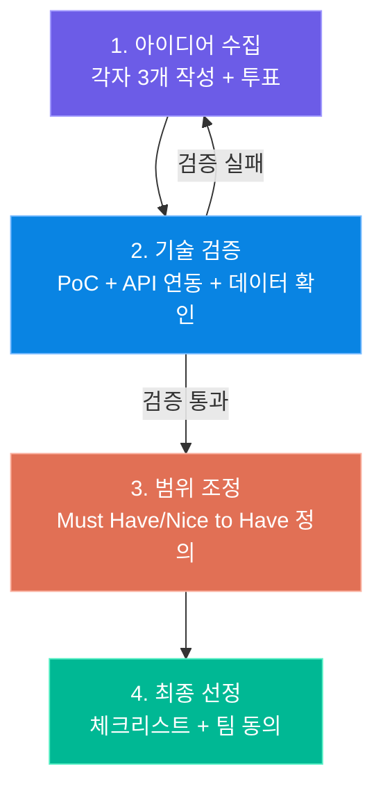

---

### 범위 조정과 MVP 정의

MVP(Minimum Viable Product)는 "사용자에게 핵심 가치를 전달하면서도 가장 적은 기능으로 이루어진 제품"입니다. 팀 프로젝트에서는 MVP를 먼저 완성하고, 시간이 남으면 추가 기능을 붙이는 전략이 유일하게 안전합니다.

**MVP 정의 방법 — 사용자 스토리로 시작하기**

```
"[사용자 유형]은 [목표]를 달성하기 위해 [기능]을 사용할 수 있다."
```

예시:
- "취업 준비생은 자신의 이력서를 분석받기 위해 PDF를 업로드할 수 있다."
- "이력서를 업로드하면 AI가 강점, 약점, 개선 제안을 제공한다."
- "분석 결과를 PDF로 다운로드할 수 있다."

이 세 문장이 MVP입니다. 이력서 비교, 채용공고 매칭, 자동 수정 제안 등은 MVP 이후 기능입니다.

| 구분 | 기능 | Day |
|-----|-----|-----|
| **MVP (Must Have)** | PDF 업로드 | Day 3 |
| **MVP (Must Have)** | AI 분석 결과 표시 | Day 5 |
| **MVP (Must Have)** | 결과 저장/조회 | Day 7 |
| **Should Have** | 채용공고 매칭 | Day 9 |
| **Nice to Have** | 자동 수정 제안 | Day 10 |
| **Won't Have** | 면접 준비 기능 | 다음 버전 |

---

## 2. 프로젝트 주제 아이디어

이 과정에서 배운 기술을 조합하면 만들 수 있는 서비스는 무궁무진합니다. 세 가지 카테고리로 나누어 구체적인 주제 아이디어와 아키텍처를 소개합니다.

---

### 카테고리 A: 일상 생활 AI 서비스

일상에서 사람들이 반복적으로 하는 작업을 AI로 대체하거나 보조하는 서비스입니다.

#### A-1. 이력서 기반 채용 매칭 플랫폼

> 잡코리아/사람인의 채용공고를 크롤링하고, 이미지형 JD를 GPT Vision으로 파싱하여, 사용자 이력서와 AI 매칭하는 서비스

**핵심 시나리오:**
1. 채용공고 크롤링 → 이미지 JD는 GPT-4o Vision으로 텍스트 추출
2. 사용자 이력서 업로드 → AI가 경력/기술/역량 파싱
3. 이력서 ↔ JD 임베딩 비교 → 매칭도 점수
4. 자연어 검색: "3년차 백엔드 개발자가 갈 수 있는 AI 회사" → 관련 공고 검색
5. 새 공고 등록 시 회원에게 맞춤 추천 알림

**유저 플로우:**

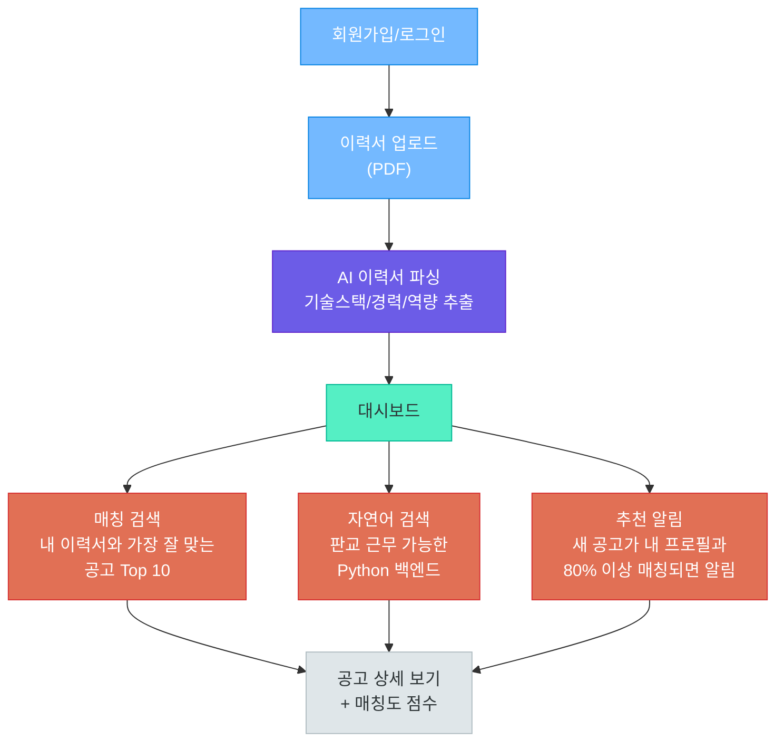

**아키텍처:**

```mermaid
flowchart LR
    subgraph crawl["크롤링 파이프라인"]
        CR["크롤러<br/>(스케줄러)"]:::blue --> JOB["잡코리아<br/>사람인"]:::light
        JOB --> IMGJD["이미지 JD"]:::light
        IMGJD --> VISION["GPT-4o Vision"]:::purple
        VISION --> TXTJD["텍스트 JD"]:::light
        TXTJD --> EMB1["임베딩 변환"]:::purple
        EMB1 --> VDB["벡터 DB<br/>(pgvector)"]:::green
    end

    subgraph user["사용자 파이프라인"]
        USR["사용자"]:::blue --> API["FastAPI"]:::orange
        API --> PARSE["이력서 파싱<br/>(LLM)"]:::purple
        PARSE --> EMB2["임베딩 변환"]:::purple
        EMB2 --> VDB
        VDB --> RESULT["매칭 결과"]:::green
        RESULT --> USR
    end

    style CR fill:#74b9ff,stroke:#0984e3,color:#fff
    style JOB fill:#dfe6e9,stroke:#b2bec3,color:#2d3436
    style IMGJD fill:#dfe6e9,stroke:#b2bec3,color:#2d3436
    style VISION fill:#6c5ce7,stroke:#5f27cd,color:#fff
    style TXTJD fill:#dfe6e9,stroke:#b2bec3,color:#2d3436
    style EMB1 fill:#6c5ce7,stroke:#5f27cd,color:#fff
    style VDB fill:#55efc4,stroke:#00b894,color:#2d3436
    style USR fill:#74b9ff,stroke:#0984e3,color:#fff
    style API fill:#e17055,stroke:#d63031,color:#fff
    style PARSE fill:#6c5ce7,stroke:#5f27cd,color:#fff
    style EMB2 fill:#6c5ce7,stroke:#5f27cd,color:#fff
    style RESULT fill:#55efc4,stroke:#00b894,color:#2d3436
```

**핵심 기술:** 웹 크롤링(BeautifulSoup/Selenium), GPT-4o Vision(이미지→텍스트), 임베딩+벡터DB(pgvector/ChromaDB), FastAPI, React

**난이도:** ★★★ | **AI 활용:** 멀티모달 + RAG + 임베딩 매칭

---

#### A-2. AI 문서 Q&A 챗봇

> PDF, 워드 문서를 업로드하면 RAG 기반으로 질문에 답변하고, 출처와 원문 링크를 제공

(이 과정의 07_cloud/10_cloud_rag_application.md에서 아키텍처를 상세히 다루고 있습니다)

- MVP: PDF 업로드 → 청크 → 벡터DB → RAG 답변 + 출처
- **난이도:** ★★☆ | **AI 활용:** RAG

---

#### A-3. AI 건강/식단 관리 도우미

> 음식 사진 촬영 → GPT Vision으로 음식 인식 → 영양 성분 분석 → 일일 칼로리/영양소 추적

**유저 플로우:**


**난이도:** ★★☆ | **AI 활용:** 멀티모달(이미지 인식)

---

#### A-4. 여행 일정 AI 플래너

> "부산 2박3일, 맛집 중심, 예산 50만원" 같은 자연어로 여행 일정을 자동 생성

- 관광지/맛집 데이터 크롤링 + 벡터DB
- LLM으로 일정 최적화 (동선, 시간, 예산)
- 지도 API 연동 (카카오맵)

**난이도:** ★★☆ | **AI 활용:** RAG + 에이전트

---

#### A-5. 중고거래 가격 분석 봇

> 당근마켓/중고나라에서 특정 상품의 시세를 분석하고, 적정 가격을 AI가 추천

- 크롤링 → 가격 데이터 수집 → 시세 분석
- "갤럭시 S24 256GB 얼마에 올리면 될까?" → AI 가격 추천
- 가격 변동 추이 시각화

**난이도:** ★★☆ | **AI 활용:** 데이터 분석 + LLM

---

### 카테고리 B: 업무 자동화 서비스

반복적인 업무를 AI로 자동화하여 시간과 비용을 절약하는 서비스입니다.

#### B-1. 영수증/청구서 자동 가계부

> 영수증 사진 → GPT-4o Vision으로 파싱 → 항목별 분류 → 가계부 자동 기록 → 엑셀/PDF 리포트 내보내기

**유저 플로우:**

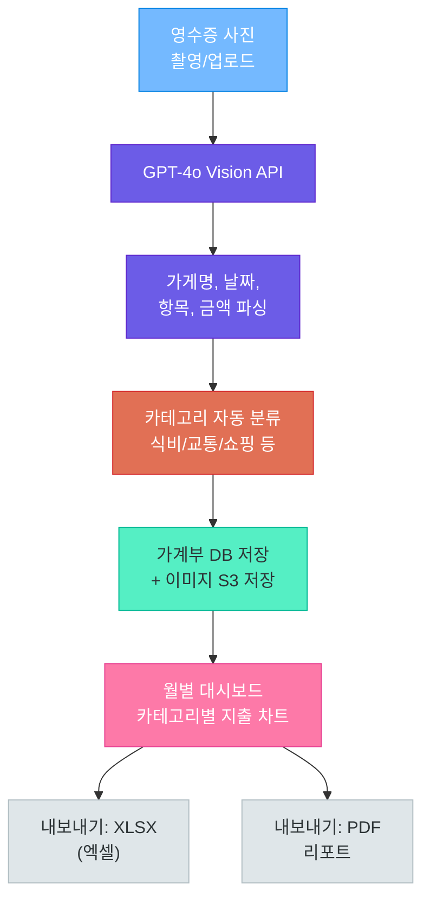

**아키텍처:**

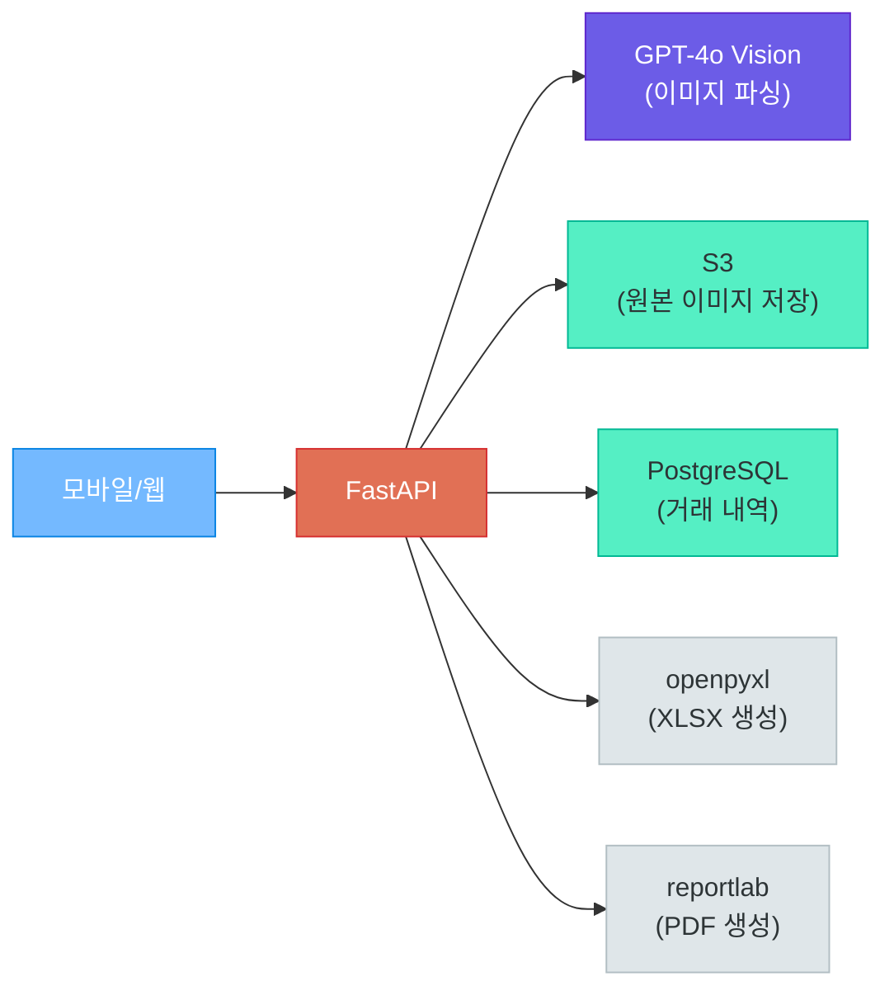

**핵심 코드 스니펫 -- GPT Vision으로 영수증 파싱:**

```python
response = await openai.chat.completions.create(
    model="gpt-4o",
    messages=[{
        "role": "user",
        "content": [
            {
                "type": "text",
                "text": (
                    "이 영수증을 JSON으로 파싱해주세요: "
                    "{store, date, items: [{name, price, quantity}], total}"
                ),
            },
            {
                "type": "image_url",
                "image_url": {
                    "url": f"data:image/jpeg;base64,{base64_image}"
                },
            },
        ],
    }],
    response_format={"type": "json_object"},
)
```

**내보내기 기능:**
- XLSX: openpyxl로 월별 시트, 카테고리별 합계, 차트 포함
- PDF: 월간 지출 리포트 (카테고리 차트 + 상세 내역)

**난이도:** ★★☆ | **AI 활용:** 멀티모달(이미지 파싱) + 구조화 출력

---

#### B-2. 견적서/인보이스 자동 처리

> 다양한 형식의 견적서(PDF, 이미지, 엑셀)를 업로드하면 AI가 표준 포맷으로 정리하고, 매입/매출을 자동 분류

**시나리오:**
- 거래처별 다른 형식의 견적서 → AI가 통일된 JSON 구조로 파싱
- 매입/매출 자동 분류 및 거래처별 원장 관리
- 월말 정산 리포트 자동 생성

**유저 플로우:**

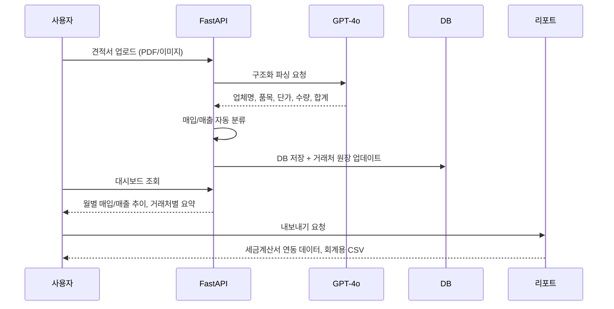

**난이도:** ★★★ | **AI 활용:** 멀티모달 + 구조화 출력 + 문서 분류

---

#### B-3. AI 회의록 작성 및 액션 아이템 추적

> 회의 음성 → Whisper STT → AI 요약 → 액션 아이템 자동 추출 → 이슈 트래커 연동

**유저 플로우:**

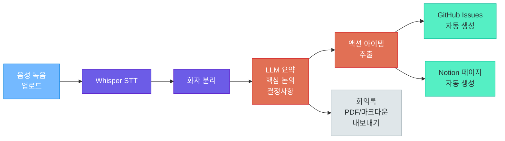

**난이도:** ★★★ | **AI 활용:** STT + LLM 요약 + 에이전트(이슈 생성)

---

#### B-4. 자연어 데이터 분석 에이전트

> "이번 달 매출이 가장 높은 상품 TOP 5 보여줘" → SQL 변환 → 자동 차트 생성

- Natural Language to SQL
- 결과를 Plotly/Chart.js로 자동 시각화
- 정기 리포트 자동 생성 스케줄링

**난이도:** ★★★ | **AI 활용:** Text-to-SQL + 에이전트

---

#### B-5. AI 이메일/문서 분류 자동화

> 매일 수백 건 들어오는 이메일이나 문서를 AI가 카테고리별로 분류, 우선순위 설정, 요약

**난이도:** ★★☆ | **AI 활용:** 텍스트 분류 + 요약

---

### 카테고리 C: MCP 기반 AI 도구 및 에이전트 서비스

MCP(Model Context Protocol)를 활용해 AI가 로컬 시스템, 외부 서비스와 직접 상호작용하는 서비스입니다.

#### C-1. 로컬 파일 AI 비서 (MCP)

> 내 컴퓨터의 파일을 자연어로 검색하고, 정리하고, 관리하는 MCP 기반 AI 비서

**시나리오:**
- "지난주에 작업한 프로젝트 기획서 어디 있어?" → 파일 시스템 검색 → 결과 반환
- "다운로드 폴더에서 1개월 이상 된 파일 정리해줘" → 파일 이동/삭제
- "이 폴더의 문서들을 주제별로 분류해줘" → AI 분류 → 폴더 생성 → 이동

**아키텍처:**

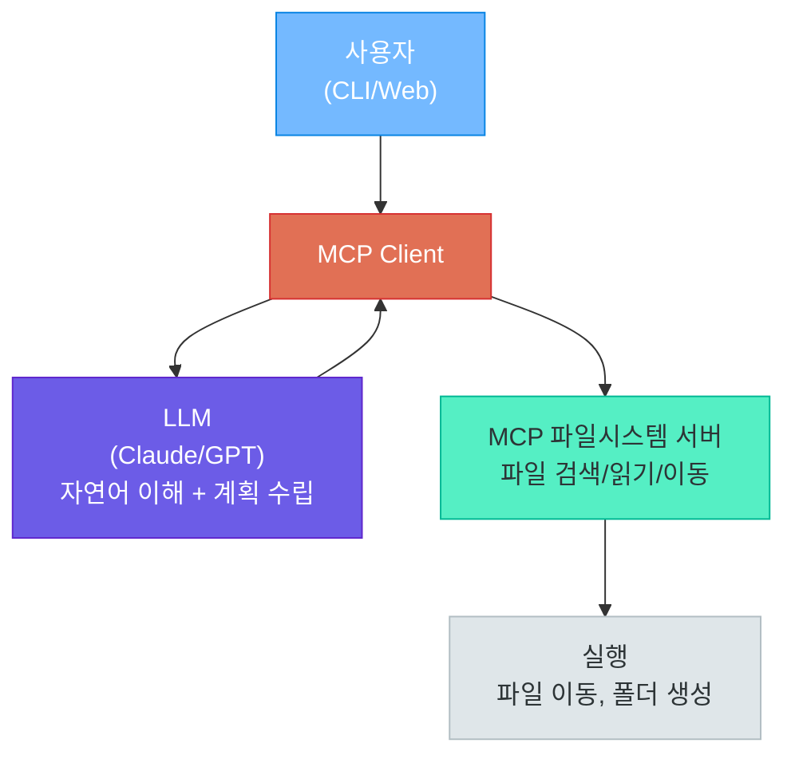

**MCP 서버 도구 예시:**

| 도구(Tool) | 설명 |
|-----------|------|
| `search_files(query, path)` | 파일명/내용 검색 |
| `read_file(path)` | 파일 내용 읽기 |
| `move_file(src, dest)` | 파일 이동 |
| `create_folder(path)` | 폴더 생성 |
| `list_files(path, filter)` | 파일 목록 조회 |
| `get_file_info(path)` | 파일 메타데이터 (크기, 수정일 등) |

**난이도:** ★★★ | **AI 활용:** MCP + 에이전트 + Tool Use

---

#### C-2. AI 코드 리뷰/문서화 에이전트 (MCP)

> MCP로 GitHub 저장소에 접근하여 PR 코드를 분석하고, 자동 리뷰 + 문서 생성

- MCP GitHub 서버: PR 조회, 파일 읽기, 코멘트 작성
- MCP 파일시스템 서버: 로컬 프로젝트 구조 분석
- LLM: 코드 분석, 개선 제안, API 문서 자동 생성

**난이도:** ★★★ | **AI 활용:** MCP + 코드 분석 + 에이전트

---

#### C-3. 멀티 서비스 업무 자동화 에이전트 (MCP)

> Slack + 구글 캘린더 + Notion + 이메일을 MCP로 연결하여, 자연어로 업무를 지시하는 AI 비서

**시나리오:**
- "내일 오후 2시에 팀 미팅 잡아줘. Slack에 알려주고 Notion에 의제 페이지도 만들어"
  → MCP 캘린더 서버: 일정 생성
  → MCP Slack 서버: 채널에 공지
  → MCP Notion 서버: 미팅 문서 생성

**아키텍처:**

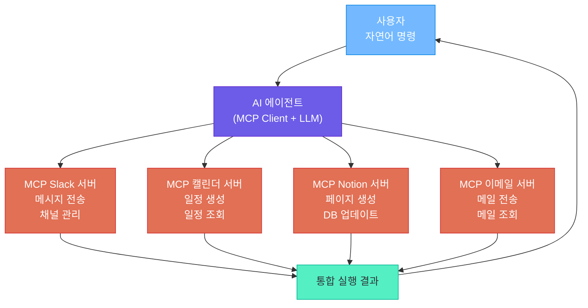

**난이도:** ★★★ | **AI 활용:** MCP + 멀티 에이전트

---

#### C-4. AI 모니터링 & 장애 대응 에이전트

> 서버 상태를 모니터링하다가 장애를 감지하면 자동으로 원인을 분석하고 대응하는 에이전트

- MCP 서버 모니터링: 헬스체크, 로그 조회, 메트릭 수집
- 장애 감지 → AI가 로그 분석 → 원인 추론 → 자동 복구(재시작) 또는 알림
- Slack/Teams 알림 + 장애 리포트 자동 생성

**난이도:** ★★★ | **AI 활용:** MCP + 에이전트 + 자동화

---

### 주제 선택 가이드

| # | 주제 | 카테고리 | 난이도 | AI 활용 깊이 | 포트폴리오 가치 |
|---|-----|---------|-------|------------|-------------|
| A-1 | 이력서 기반 채용 매칭 | 일상 생활 | ★★★ | 멀티모달+RAG+임베딩 | 매우 높음 |
| A-2 | AI 문서 Q&A 챗봇 | 일상 생활 | ★★☆ | RAG | 높음 |
| A-3 | 건강/식단 관리 도우미 | 일상 생활 | ★★☆ | 멀티모달 | 높음 |
| A-4 | 여행 일정 AI 플래너 | 일상 생활 | ★★☆ | RAG+에이전트 | 높음 |
| A-5 | 중고거래 가격 분석 | 일상 생활 | ★★☆ | 데이터분석+LLM | 중간 |
| B-1 | 영수증 자동 가계부 | 업무 자동화 | ★★☆ | 멀티모달+구조화 | 매우 높음 |
| B-2 | 견적서/인보이스 처리 | 업무 자동화 | ★★★ | 멀티모달+문서분류 | 매우 높음 |
| B-3 | AI 회의록 작성 | 업무 자동화 | ★★★ | STT+LLM+에이전트 | 매우 높음 |
| B-4 | 자연어 데이터 분석 | 업무 자동화 | ★★★ | Text-to-SQL+에이전트 | 높음 |
| B-5 | 이메일/문서 분류 | 업무 자동화 | ★★☆ | 분류+요약 | 중간 |
| C-1 | 로컬 파일 AI 비서 | MCP 도구 | ★★★ | MCP+에이전트 | 높음 |
| C-2 | 코드 리뷰 에이전트 | MCP 도구 | ★★★ | MCP+코드분석 | 매우 높음 |
| C-3 | 멀티 서비스 자동화 | MCP 도구 | ★★★ | MCP+멀티에이전트 | 매우 높음 |
| C-4 | 모니터링 장애 대응 | MCP 도구 | ★★★ | MCP+에이전트+자동화 | 높음 |

---

## 3. 팀 구성과 역할 분담

### 팀 구성 원칙

12일 프로젝트에서 4~5인 팀은 각자의 강점을 활용하면서 전체 시스템을 함께 이해해야 합니다. 한 사람이 모든 것을 아는 '슈퍼맨'에 의존하는 팀은 그 사람이 빠지는 순간 무너집니다. 크로스 펑셔널(Cross-Functional) 협업이 핵심입니다.

> **핵심 포인트:** 역할을 분담하더라도 "프론트엔드 담당자는 AI를 몰라도 된다"는 생각은 금물입니다. 모든 팀원이 전체 아키텍처를 이해하고 필요 시 서로의 영역을 도울 수 있어야 합니다.

---

### 역할별 주요 책임

#### 프론트엔드 엔지니어

**핵심 책임**
- React / Next.js 기반 사용자 인터페이스 개발
- API 연동 및 상태 관리 (Zustand, Context API)
- 반응형 UI, 로딩/에러 상태 처리
- 사용자 경험(UX) 설계 및 피드백 반영

**발표 기여**
- 데모 시연 주도 (가장 눈에 보이는 부분)
- UI/UX 디자인 결정 설명

#### 백엔드 엔지니어

**핵심 책임**
- FastAPI 기반 REST API / WebSocket 서버 개발
- 데이터베이스 설계 및 ORM 구현
- 인증/인가 (JWT, OAuth)
- 비동기 작업 처리 (Celery, BackgroundTasks)

**발표 기여**
- API 설계 및 데이터 흐름 설명
- 성능 최적화 결과 공유

#### AI 엔지니어

**핵심 책임**
- LLM API 통합 (프롬프트 엔지니어링)
- RAG 파이프라인 설계 및 구현
- 임베딩 모델 선택 및 벡터 DB 연동
- AI 응답 품질 평가 및 개선

**발표 기여**
- AI 아키텍처 설명
- 프롬프트 전략 및 개선 과정 공유

#### 인프라·DevOps 엔지니어

**핵심 책임**
- Docker 컨테이너화 및 docker-compose 구성
- CI/CD 파이프라인 설정 (GitHub Actions)
- 클라우드 배포 (AWS / GCP / Railway)
- 모니터링 및 로그 수집

**발표 기여**
- 배포 아키텍처 다이어그램 설명
- 운영 안정성 지표 공유

#### 팀 리더 (PM)

**핵심 책임**
- 스프린트 계획 및 데일리 스탠드업 진행
- 이슈 관리 및 우선순위 결정
- 팀원 간 의사소통 조율
- 위험 요소 사전 파악 및 대응

**발표 기여**
- 발표 전체 진행 및 마무리
- 팀 회고 및 배운 점 공유

---

### 역할 분담 매트릭스 (RACI)

RACI 매트릭스는 각 작업에 대해 누가 실행(Responsible), 책임(Accountable), 자문(Consulted), 정보 공유(Informed) 대상인지를 명시합니다.

| 작업 항목 | 팀 리더 | 프론트 | 백엔드 | AI | 인프라 |
|---------|--------|--------|--------|----|----|
| 요구사항 정의 | **A** | C | C | C | I |
| API 설계 | C | C | **R/A** | C | I |
| UI/UX 설계 | I | **R/A** | C | I | I |
| AI 파이프라인 | I | I | C | **R/A** | I |
| DB 스키마 | C | I | **R/A** | C | I |
| Docker 설정 | I | I | C | I | **R/A** |
| CI/CD 구성 | I | I | I | I | **R/A** |
| 코드 리뷰 | C | **R** | **R** | **R** | **R** |
| 발표 자료 제작 | **A** | R | R | R | R |
| 최종 배포 | **A** | C | C | C | **R** |

`R: Responsible(실행)` `A: Accountable(최종 책임)` `C: Consulted(자문)` `I: Informed(정보 공유)`

---

### 크로스 펑셔널 협업 실천 방법

**데일리 스탠드업 (매일 10분)**
- 어제 한 일 / 오늘 할 일 / 블로킹 이슈
- 역할 경계를 넘어 도움 요청 가능 분위기 형성

**코드 리뷰 문화**
- PR은 반드시 다른 역할의 팀원이 한 명 이상 리뷰
- "이 API가 왜 이렇게 설계됐는지" 서로 이해하기

**공유 문서 (Notion / Confluence)**
- API 명세서, 아키텍처 다이어그램은 모두가 접근 가능
- 결정 사항은 반드시 문서에 기록

---

## 4. 개발 일정 수립

### 12일 타임라인 개요

12일은 짧습니다. 계획 없이 시작하면 마지막 3일에 패닉 상태가 됩니다. Day 1부터 각 날짜에 무엇을 완성해야 하는지 명확히 정의해두어야 합니다.

```mermaid
gantt
    title 12일 타임라인
    dateFormat D
    axisFormat Day %d

    section 기획
    주제 선정 + 설계  :done, p1, 1, 2d

    section 환경
    환경 설정 + API   :active, e1, 3, 2d

    section 개발
    Sprint 1          :crit, d1, 5, 2d
    Sprint 2          :crit, d2, 7, 2d

    section 테스트
    통합 테스트 + QA  :t1, 9, 2d

    section 배포
    배포 + 문서화     :dp1, 11, 1d

    section 발표
    발표 준비 + 발표  :pr1, 12, 1d
```

---

### 일별 상세 계획

#### Day 1~2: 기획 및 설계

**Day 1 — 팀 구성과 주제 선정**

| 시간 | 활동 | 산출물 |
|-----|-----|-------|
| 오전 | 팀 아이스브레이킹, 역할 분담 | RACI 매트릭스 |
| 오전 | 주제 브레인스토밍 (각자 3개 제안) | 아이디어 목록 |
| 오후 | 주제 검증 체크리스트 작성 | 체크리스트 결과 |
| 오후 | MVP 정의 및 사용자 스토리 작성 | MVP 문서 |
| 오후 | GitHub 저장소 생성, 브랜치 전략 합의 | GitHub Repo |

**Day 2 — 설계**

| 시간 | 활동 | 산출물 |
|-----|-----|-------|
| 오전 | 시스템 아키텍처 다이어그램 작성 | 아키텍처 문서 |
| 오전 | API 명세서 작성 (Swagger 기준) | API Spec |
| 오후 | 데이터베이스 스키마 설계 | ERD |
| 오후 | UI 와이어프레임 작성 | Figma / draw.io |
| 오후 | 이슈 생성 및 마일스톤 설정 | GitHub Issues |

---

#### Day 3~4: 환경 구축 및 기본 구현

**Day 3 — 개발 환경 설정**

- `docker-compose.yml` 작성 (DB, Redis, API 서버)
- 프론트엔드 프로젝트 초기화 (Create React App / Next.js)
- 백엔드 프로젝트 초기화 (FastAPI + 라우터 구조)
- CI/CD 파이프라인 설정 (GitHub Actions)
- 환경 변수 관리 (.env 파일, 시크릿 설정)

**Day 4 — 기본 구현**

- 사용자 인증 기능 (회원가입/로그인/JWT)
- 기본 CRUD API 구현
- 프론트엔드 라우팅 및 레이아웃 설정
- LLM API 연동 테스트 (Hello World 수준)
- **마일스톤 체크: 팀 전원이 로컬에서 앱을 실행할 수 있어야 합니다**

---

#### Day 5~8: 핵심 기능 개발

이 4일이 프로젝트의 핵심입니다. MVP의 모든 기능을 이 기간 안에 구현해야 합니다.

**Day 5~6 — Sprint 1: AI 파이프라인 구현**

- LLM 프롬프트 엔지니어링
- RAG 파이프라인 (문서 처리, 임베딩, 벡터 검색)
- AI 응답을 프론트엔드에 표시하는 End-to-End 연결
- **마일스톤 체크: AI 기능의 기본 동작이 확인되어야 합니다**

**Day 7~8 — Sprint 2: 나머지 핵심 기능**

- Should Have 기능 구현
- 에러 처리 및 엣지 케이스 대응
- 프론트엔드 UI 개선
- 성능 최적화 (응답 캐싱, 비동기 처리)
- **마일스톤 체크: MVP 기능이 모두 동작해야 합니다**

---

#### Day 9~10: 통합 테스트 및 QA

**Day 9 — 통합 테스트**

- End-to-End 시나리오 테스트
- API 부하 테스트 (locust 또는 k6)
- 크로스 브라우저 테스트
- 보안 취약점 기본 점검 (SQL Injection, XSS)

**Day 10 — 버그 수정 및 폴리싱**

- Day 9 발견 버그 수정
- UI/UX 개선 (빈 상태, 로딩 상태, 에러 메시지)
- 코드 정리 및 주석 작성
- **마일스톤 체크: 데모 시나리오를 처음부터 끝까지 에러 없이 실행할 수 있어야 합니다**

---

#### Day 11: 배포 및 문서화

**배포 체크리스트**

- [ ] 프로덕션 환경 변수 설정
- [ ] 데이터베이스 마이그레이션
- [ ] SSL/TLS 인증서 설정
- [ ] 로그 수집 설정
- [ ] 헬스체크 엔드포인트 확인
- [ ] 배포 후 전체 기능 재테스트

**문서화 체크리스트**

- [ ] GitHub README (프로젝트 소개, 설치 방법, 스크린샷)
- [ ] API 문서 (Swagger UI 확인)
- [ ] 아키텍처 다이어그램 최신화
- [ ] 팀원 기여 내역 정리

---

#### Day 12: 발표 준비 및 최종 발표

**오전 — 리허설**

- 발표 자료 최종 검토
- 데모 시나리오 3회 이상 리허설
- Q&A 예상 질문 준비
- 백업 영상 준비

**오후 — 최종 발표**

- 팀별 10분 발표 + 5분 Q&A
- 발표 후 동료 평가
- 강사 피드백

---

### 마일스톤 요약

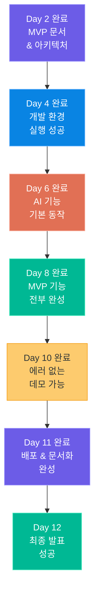

---

## 5. 발표와 시연

### 발표 구조 (10분)

10분은 짧습니다. 팀의 노력을 10분 안에 압축하려면 정교한 구성이 필요합니다.

| 순서 | 내용 | 시간 | 담당 |
|-----|-----|-----|-----|
| 1 | 문제 정의 — "누가, 왜 필요한가?" | 2분 | 팀 리더 |
| 2 | 아키텍처 소개 — "어떻게 만들었는가?" | 2분 | AI/백엔드 |
| 3 | 라이브 데모 — "실제로 동작한다" | 4분 | 프론트엔드 |
| 4 | 팀 회고 — "배운 점과 한계" | 2분 | 팀 리더 |

#### 문제 정의 (2분) — 스토리텔링으로 시작하기

"저희 팀은 OOO 문제를 해결하고 싶었습니다"로 시작하는 것보다 스토리로 시작하는 것이 효과적입니다.

```
"채용 담당자는 하루에 200개의 이력서를 검토합니다.
그 중 70%는 직무와 맞지 않아 10초 만에 탈락합니다.
구직자는 열심히 썼지만 왜 탈락했는지조차 모릅니다.
저희는 이 문제를 AI로 해결했습니다."
```

#### 아키텍처 소개 (2분) — 한 장의 다이어그램

복잡한 설명 대신 하나의 아키텍처 다이어그램을 보여주며 데이터 흐름을 3~4단계로 설명합니다.

- 사용자 → 프론트엔드 → API 서버 → AI 파이프라인 → 결과 반환

기술 스택 슬라이드를 따로 만들기보다 아키텍처 다이어그램에 기술 이름을 포함시키는 것이 더 효율적입니다.

#### 라이브 데모 (4분) — 이것이 전부다

발표의 70%는 데모입니다. 기능 설명을 길게 하는 것보다 실제로 동작하는 모습을 보여주는 것이 10배 더 효과적입니다.

데모 4분 시나리오 예시:
- 00:00 — 서비스 메인 화면 오픈, 간단한 소개
- 00:30 — 핵심 기능 입력 (이력서 업로드 / 질문 입력 / 이미지 업로드)
- 01:30 — AI 처리 과정 설명 (로딩 중에 아키텍처 한 줄 설명)
- 02:30 — 결과 표시 및 기능 설명
- 03:30 — 추가 기능 시연 (Should Have 기능 한 가지)

#### 팀 회고 (2분) — 솔직함이 강점

"모든 기능을 완벽하게 구현했습니다"보다 "이런 기술적 한계를 발견했고, 이렇게 대응했습니다"가 더 신뢰를 줍니다.

- 기술적으로 어려웠던 점 한 가지와 해결 방법
- MVP에서 제외한 기능과 이유
- 다음에는 이렇게 하고 싶다는 방향

---

### 데모 준비

> **핵심 포인트:** 라이브 데모는 반드시 실패합니다. 한 번도 실패하지 않았다면 리허설이 부족한 것입니다. 실패를 가정하고 백업 플랜을 준비하는 팀이 프로답니다.

**데모 시나리오 스크립트 작성**

```
[발표자] 시나리오 스크립트 예시:

"안녕하세요, 데모를 시작하겠습니다.
저는 취업 준비생 '김철수'가 서비스를 처음 사용하는 시나리오를 보여드리겠습니다.

(화면: 로그인 페이지)
먼저 회원가입 없이 Google 로그인으로 바로 시작할 수 있습니다.

(화면: 메인 대시보드)
업로드 버튼을 클릭하고... 이력서 PDF를 드래그합니다.

(파일 업로드 후 로딩 중)
현재 AI가 이력서를 파싱하고 핵심 역량을 추출하고 있습니다.
내부적으로는 Claude API를 호출해 경력 요약, 기술 스택 분류, 성취 지표를 분석합니다.

(결과 표시)
약 3초 후 분석 결과가 나타납니다..."
```

**백업 영상 준비**

- 인터넷 연결 장애 대비: 미리 녹화된 데모 영상 (최소 화질 720p)
- 서비스 장애 대비: 정적 스크린샷 슬라이드
- API 키 과금 대비: 캐시된 응답 결과를 반환하는 목업 모드

**에러 대비 체크리스트**

- [ ] API 키 잔액 확인 (발표 당일 오전)
- [ ] 데이터베이스 연결 테스트
- [ ] 발표 PC에서 직접 실행 테스트 (발표 1시간 전)
- [ ] 브라우저 캐시 삭제 및 쿠키 초기화
- [ ] 시연용 계정에 샘플 데이터 사전 입력

---

### 포트폴리오 연결

발표가 끝나도 프로젝트의 생명은 계속됩니다. GitHub, 기술 블로그, 이력서에 프로젝트를 잘 연결하면 취업 활동에서 강력한 무기가 됩니다.

**GitHub README 구성 요소**

```markdown
# 프로젝트 이름

> 한 줄 설명

## 데모
[라이브 데모 링크] | [데모 영상]

## 스크린샷
(UI 캡처 이미지 2~3장)

## 기술 스택
(뱃지 형태로 시각화)

## 주요 기능
- 기능 1
- 기능 2

## 아키텍처
(다이어그램 이미지)

## 설치 및 실행
(복사해서 바로 실행 가능한 명령어)

## 팀원
(역할과 GitHub 링크)
```

**기술 블로그 포스트 주제**

- "12일 만에 AI 서비스를 만든 방법"
- "RAG 파이프라인 구현하면서 배운 것들"
- "팀 프로젝트에서 협업하며 겪은 시행착오"
- "프롬프트 엔지니어링으로 AI 응답 품질을 높인 방법"

**이력서 프로젝트 섹션 작성 예시**

```
[프로젝트명] | 팀 프로젝트 (4인) | 2025.05
- LangChain + Claude API를 활용한 RAG 기반 문서 Q&A 챗봇 개발
- FastAPI 백엔드 설계 및 Chroma 벡터 DB 연동 담당
- 답변 정확도 87% 달성 (자체 평가 기준)
- GitHub: [링크] | 데모: [링크]
```

---

## 6. 평가 기준

### 평가 영역 개요

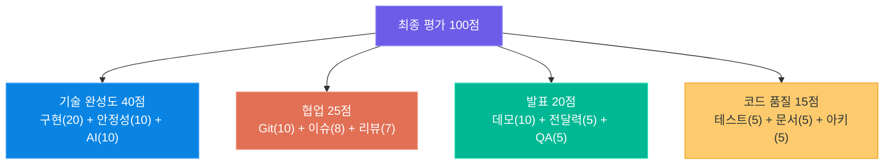

---

### 평가 루브릭 상세

#### 기술 완성도 (40점)

**기능 구현 완성도 (20점)**

| 등급 | 점수 | 기준 |
|-----|-----|-----|
| 상 | 18~20 | MVP 기능이 모두 구현되고 Should Have 기능 2개 이상 추가 구현, 실제 사용 가능한 수준 |
| 중 | 12~17 | MVP 기능이 대부분 구현되었으나 일부 기능이 미완성이거나 불안정 |
| 하 | 0~11 | MVP 기능의 절반 이하 구현, 데모가 어렵거나 불가능 |

**에러 처리 및 안정성 (10점)**

| 등급 | 점수 | 기준 |
|-----|-----|-----|
| 상 | 9~10 | 잘못된 입력, API 오류, 네트워크 장애 등 주요 에러 케이스가 모두 처리되어 앱이 크래시되지 않음 |
| 중 | 6~8 | 주요 에러 처리는 되어 있으나 일부 엣지 케이스에서 앱이 멈추거나 빈 화면이 표시됨 |
| 하 | 0~5 | 에러 처리가 거의 없어 잘못된 입력 시 앱이 크래시되거나 의미 없는 에러 메시지 표시 |

**AI 기술 활용 깊이 (10점)**

| 등급 | 점수 | 기준 |
|-----|-----|-----|
| 상 | 9~10 | RAG, 파인튜닝, 에이전트, 멀티모달 등 심화 AI 기술을 적절히 적용하고 결과물이 유의미함 |
| 중 | 6~8 | LLM API를 프롬프트 엔지니어링과 함께 활용하고 응답 품질 개선 노력이 보임 |
| 하 | 0~5 | LLM API를 기본 수준으로만 호출하거나 AI의 역할이 서비스의 핵심 가치와 연결되지 않음 |

---

#### 협업 (25점)

**Git 활용 (10점)**

| 등급 | 점수 | 기준 |
|-----|-----|-----|
| 상 | 9~10 | 브랜치 전략(feature/fix/release)이 일관되게 사용되고 모든 팀원의 커밋이 균등하게 분포. 커밋 메시지가 명확 |
| 중 | 6~8 | 브랜치 전략이 대부분 지켜지고 커밋이 의미 있으나 일부 팀원의 기여가 편중되어 있음 |
| 하 | 0~5 | main 브랜치에 직접 커밋하거나 브랜치 전략 없이 작업. 커밋 메시지가 불명확 |

**이슈 관리 (8점)**

| 등급 | 점수 | 기준 |
|-----|-----|-----|
| 상 | 7~8 | 모든 작업이 이슈로 등록되고, 담당자/마일스톤/라벨이 설정. 진행 상황이 보드에서 실시간 확인 가능 |
| 중 | 4~6 | 주요 작업은 이슈로 관리되나 세부 작업은 구두로 처리. 이슈 보드가 부분적으로 활용됨 |
| 하 | 0~3 | 이슈 관리 없이 카카오톡이나 구두로만 협업. GitHub Issues가 거의 비어 있음 |

**코드 리뷰 (7점)**

| 등급 | 점수 | 기준 |
|-----|-----|-----|
| 상 | 6~7 | 모든 PR에 최소 1명 이상의 리뷰가 있고, 리뷰 댓글이 구체적이며 리뷰 후 개선이 이루어짐 |
| 중 | 3~5 | 주요 PR에는 리뷰가 있으나 일부 PR이 리뷰 없이 머지됨. 리뷰 댓글이 형식적인 수준 |
| 하 | 0~2 | PR 리뷰가 거의 없거나 Approve만 하고 실질적인 피드백이 없음 |

---

#### 발표 (20점)

**데모 품질 (10점)**

| 등급 | 점수 | 기준 |
|-----|-----|-----|
| 상 | 9~10 | 라이브 데모가 에러 없이 시나리오대로 진행되고 핵심 가치가 명확히 전달됨 |
| 중 | 6~8 | 데모 중 경미한 오류가 있으나 전체적으로 기능이 시연됨. 또는 영상 데모를 사용함 |
| 하 | 0~5 | 데모가 실패하거나 스크린샷만 보여줌. 핵심 기능이 시연되지 않음 |

**전달력 (5점)**

| 등급 | 점수 | 기준 |
|-----|-----|-----|
| 상 | 5 | 발표 흐름이 자연스럽고 청중이 서비스 가치를 명확히 이해할 수 있음. 시간 내 완료 |
| 중 | 3~4 | 발표 내용은 충실하나 일부 설명이 불명확하거나 시간이 초과됨 |
| 하 | 0~2 | 발표 흐름이 불명확하고 청중이 서비스 목적을 이해하기 어려움 |

**Q&A 대응 (5점)**

| 등급 | 점수 | 기준 |
|-----|-----|-----|
| 상 | 5 | 기술적 질문에 정확하게 답변하고 모르는 경우 솔직하게 인정하며 대안을 제시함 |
| 중 | 3~4 | 대부분의 질문에 답변하나 일부 기술 질문에 대한 답변이 부정확하거나 불충분함 |
| 하 | 0~2 | 기술적 질문에 대부분 답변하지 못하거나 잘못된 정보를 제공함 |

---

#### 코드 품질 (15점)

**테스트 (5점)**

| 등급 | 점수 | 기준 |
|-----|-----|-----|
| 상 | 5 | 핵심 비즈니스 로직에 단위 테스트가 있고 pytest 또는 Jest로 실행 가능. CI에서 자동 실행됨 |
| 중 | 3~4 | 일부 기능에 테스트가 있으나 핵심 로직 커버리지가 낮음 |
| 하 | 0~2 | 테스트 코드가 거의 없음 |

**문서화 (5점)**

| 등급 | 점수 | 기준 |
|-----|-----|-----|
| 상 | 5 | README가 충실하고 API 문서(Swagger)가 완비. 설치 및 실행 가이드를 따라 5분 내 실행 가능 |
| 중 | 3~4 | README가 있으나 일부 정보가 누락되거나 오래됨. Swagger가 부분적으로 작성됨 |
| 하 | 0~2 | README가 없거나 내용이 거의 없음. API 문서 미작성 |

**아키텍처 설계 (5점)**

| 등급 | 점수 | 기준 |
|-----|-----|-----|
| 상 | 5 | 관심사 분리가 명확하고 레이어드 아키텍처 또는 클린 아키텍처를 적용. 확장 가능한 구조 |
| 중 | 3~4 | 기본적인 구조 분리가 되어 있으나 일부 레이어 간 의존성이 과도하게 결합됨 |
| 하 | 0~2 | 한 파일에 모든 코드가 혼재하거나 책임 분리가 되지 않아 유지보수가 어려운 구조 |

---

## 7. 핵심 정리 — 45일 과정을 마치며

### 프로젝트 성공 체크리스트

발표 당일 아침, 다음 체크리스트를 팀 전원이 함께 확인합니다.

**기술 체크**

- [ ] 프로덕션 서버가 정상적으로 동작한다
- [ ] API 키 잔액이 충분하다
- [ ] 데이터베이스에 샘플 데이터가 입력되어 있다
- [ ] 데모 시나리오를 처음부터 끝까지 오류 없이 실행할 수 있다
- [ ] 백업 영상이 준비되어 있다

**발표 체크**

- [ ] 발표 자료가 최신 상태다
- [ ] 팀원 모두 발표 내용을 숙지하고 있다
- [ ] 예상 Q&A 답변이 준비되어 있다
- [ ] 발표 시간이 10분 이내다 (리허설 기준)

**포트폴리오 체크**

- [ ] GitHub README가 완성되어 있다
- [ ] 라이브 데모 URL이 공개 접근 가능하다
- [ ] 스크린샷/데모 영상이 README에 포함되어 있다
- [ ] 팀원 각자의 이력서에 프로젝트가 추가되어 있다

---

### 45일 과정 전체 회고

여러분은 지난 45일 동안 단순히 코드를 배운 것이 아닙니다. **생성형 AI 시대의 풀스택 개발자**로 거듭나는 여정을 걸어왔습니다. 각 모듈이 어떻게 연결되어 있는지 돌아봅니다.

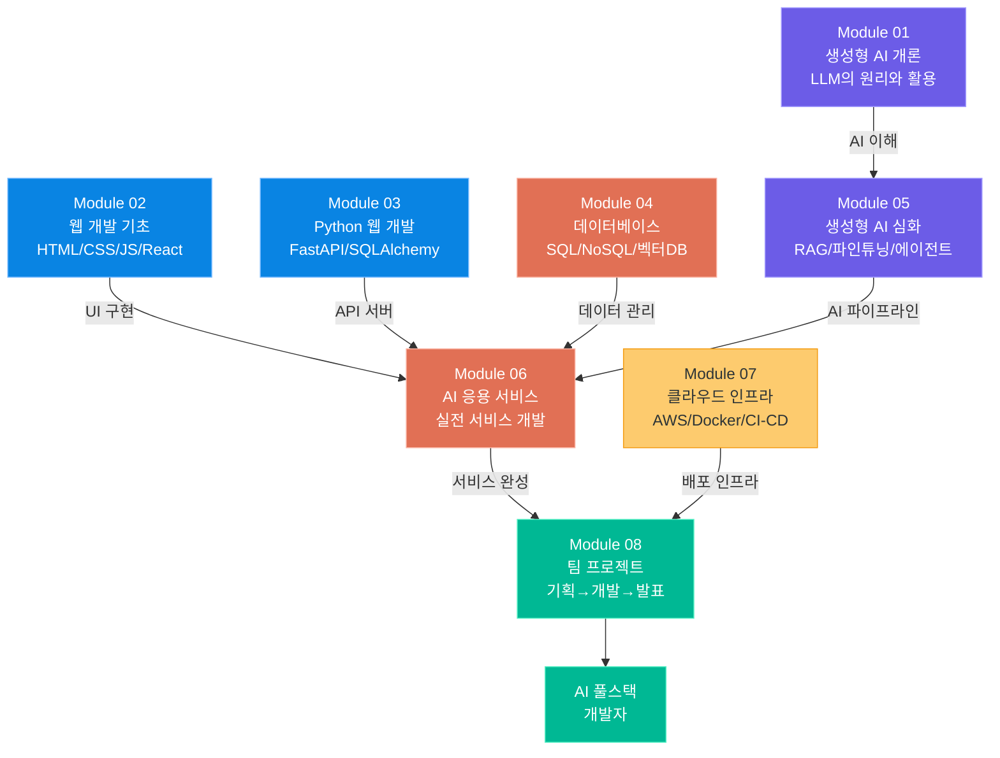

**Module 01 — 생성형 AI 개론**에서 LLM이 무엇인지, 어떤 원리로 동작하는지 배웠습니다. 처음엔 막연하게 느껴졌던 "트랜스포머", "임베딩", "컨텍스트 윈도우" 같은 개념들이 이제는 여러분의 코드에 녹아들어 있습니다.

**Module 02 — 웹 개발 기초**에서 익힌 HTML, CSS, JavaScript, React는 팀 프로젝트 프론트엔드의 토대가 되었습니다. 버튼 하나를 만드는 것부터 시작해 이제는 AI 응답을 스트리밍으로 받아 화면에 타이핑 효과로 표시하는 UI를 만들 수 있습니다.

**Module 03 — Python 웹 개발**에서 FastAPI로 배운 REST API 설계, SQLAlchemy ORM, JWT 인증은 팀 프로젝트 백엔드 전체를 떠받치고 있습니다.

**Module 04 — 데이터베이스**에서 SQL과 NoSQL의 차이를 배우고, 벡터 데이터베이스의 개념을 이해했습니다. RAG 파이프라인에서 임베딩을 저장하고 검색하는 핵심 기술이 여기서 나왔습니다.

**Module 05 — 생성형 AI 심화**에서 RAG, 파인튜닝, LLM 에이전트, 프롬프트 엔지니어링을 깊이 배웠습니다. 이 모듈이 프로젝트에서 AI 엔지니어링의 핵심을 담당합니다.

**Module 06 — AI 응용 서비스**에서는 코드 리뷰 자동화, 채점 서비스, 추론 SaaS 등 실전 서비스 패턴을 배웠습니다. 이론이 실제 제품으로 어떻게 변환되는지 체험했습니다.

**Module 07 — 클라우드 인프라**에서 Docker, GitHub Actions, AWS, 모니터링을 배워 팀 프로젝트를 인터넷에 실제로 배포할 수 있게 되었습니다.

**Module 08 — 팀 프로젝트**에서는 이 모든 것을 하나로 엮어 실제 팀을 이루어 서비스를 만들었습니다. 기술적인 완성도만큼이나 협업, 커뮤니케이션, 일정 관리가 중요하다는 것을 몸으로 배웠습니다.

---

### 수료 후 성장 경로

45일은 시작입니다. 이제 어떤 길을 걸어갈지, 그 경로를 함께 살펴봅니다.

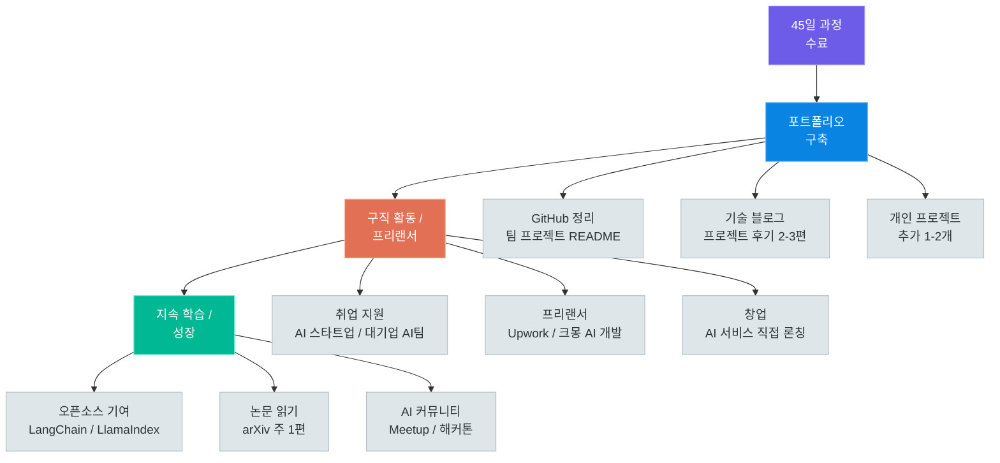

#### 포트폴리오 구축 (수료 후 1~2개월)

수료 직후에는 팀 프로젝트를 최대한 깔끔하게 정리하는 것이 최우선입니다.

- **GitHub 프로필 정리**: README.md에 기술 스택, 프로젝트 목록, 연락처 추가
- **팀 프로젝트 README 보강**: 스크린샷, 아키텍처 다이어그램, 사용 방법 완비
- **기술 블로그 개설**: 벨로그(velog.io) 또는 개인 도메인 블로그에 프로젝트 후기 작성
- **개인 사이드 프로젝트**: 혼자서도 AI 서비스를 만들 수 있음을 증명하는 1개 추가 프로젝트

#### 구직 활동 (수료 후 2~4개월)

- **AI 스타트업**: 속도감 있는 실무 경험, AI를 핵심 제품으로 사용하는 회사
- **대기업 AI팀**: 안정성과 체계적인 기술 환경, LLMOps, MLOps 경험 가능
- **IT 서비스 기업**: 백엔드/풀스택 포지션에서 AI 프로젝트 경험 어필
- **프리랜서**: Upwork, 크몽에서 챗봇, 자동화, AI 서비스 개발 수주

이력서에는 반드시 다음을 포함합니다:
- 사용한 AI 기술 (RAG, 파인튜닝, 프롬프트 엔지니어링 등)
- 정량적 성과 (응답 속도 X초, 정확도 X%, 사용자 X명)
- GitHub 링크와 라이브 데모 URL

#### 지속 학습 (장기)

AI 분야는 6개월마다 패러다임이 바뀝니다. 멈추면 뒤처집니다.

| 학습 영역 | 방법 | 주기 |
|---------|-----|-----|
| 최신 모델 동향 | Hugging Face 블로그, ArXiv Daily | 매주 |
| 새로운 프레임워크 | LangGraph, LlamaIndex, AutoGen | 분기별 |
| 오픈소스 기여 | 문서 번역, 이슈 해결 | 월 1회 |
| 커뮤니티 참여 | 한국 AI 밋업, 해커톤 | 분기별 |
| 사이드 프로젝트 | AI 서비스 론칭 | 연 1~2개 |

---

### 마무리 인사

45일 전, 여러분 중 많은 분들은 "LLM이 뭔지는 알겠는데 직접 만드는 건 어렵겠지"라고 생각했을 것입니다. 혹은 "AI는 데이터 사이언티스트나 인공지능 전문가만 하는 것"이라고 느꼈을지도 모릅니다.

그런데 지금 여러분은 다릅니다.

프롬프트를 설계하고, 임베딩을 생성하고, 벡터 데이터베이스에 저장하고, RAG 파이프라인을 구축하고, FastAPI 서버로 서비스를 만들고, Docker로 컨테이너화하고, GitHub Actions로 자동 배포하고, 팀과 함께 실제 사용 가능한 AI 서비스를 세상에 내놓았습니다.

이것은 결코 작은 일이 아닙니다.

생성형 AI 풀스택 개발이 요구하는 기술 스택은 넓습니다. 프론트엔드와 백엔드를 모두 이해하고, AI의 동작 원리를 알면서, 클라우드 인프라까지 다룰 수 있는 개발자는 드뭅니다. 여러분은 이제 그 드문 개발자입니다.

AI는 도구입니다. 좋은 도구를 가진 사람이 더 나은 문제를 해결할 수 있습니다. 여러분이 만들 서비스가 누군가의 업무를 10배 빠르게 만들어줄 수도 있고, 접근성의 장벽을 낮추어 더 많은 사람들이 지식에 접근하도록 도울 수도 있으며, 아예 존재하지 않던 새로운 가치를 창출할 수도 있습니다.

팀 프로젝트가 끝이 아닙니다. 이것이 시작입니다.

GitHub README를 업데이트하고, 블로그 포스트를 하나 쓰고, 다음 사이드 프로젝트 아이디어를 메모해두세요. 그렇게 하루하루 쌓이다 보면 1년 뒤의 여러분은 지금보다 훨씬 멀리 가 있을 것입니다.

45일간 함께해주셔서 감사합니다. 앞으로의 여정을 응원합니다.

> **"The best way to predict the future is to build it."**
> — 앨런 케이

---

| 모듈 | 핵심 주제 | 여러분이 얻은 것 |
|-----|---------|--------------|
| Module 01 | 생성형 AI 개론 | LLM 동작 원리의 이해 |
| Module 02 | 웹 개발 기초 | React 기반 프론트엔드 개발 능력 |
| Module 03 | Python 웹 개발 | FastAPI + SQLAlchemy 백엔드 개발 능력 |
| Module 04 | 데이터베이스 | SQL, NoSQL, 벡터DB 설계와 활용 |
| Module 05 | 생성형 AI 심화 | RAG, 파인튜닝, 에이전트 구축 능력 |
| Module 06 | AI 응용 서비스 | 실전 AI 서비스 개발 패턴 |
| Module 07 | 클라우드 인프라 | Docker, CI/CD, 클라우드 배포 능력 |
| Module 08 | 팀 프로젝트 | 협업과 실전 프로젝트 완수 경험 |

수료를 축하드립니다. 이제 여러분은 AI 풀스택 개발자입니다.

---
