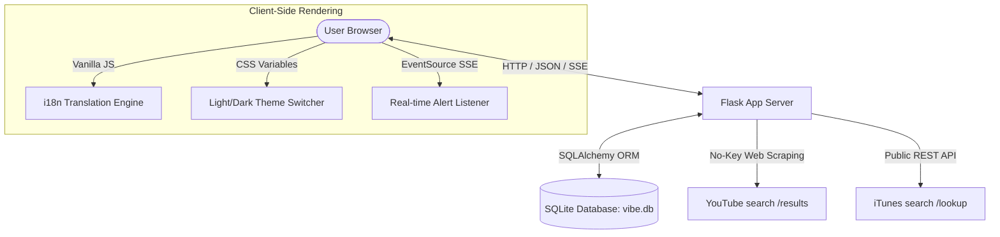

# 🎵 Vibe - Premium Music SNS Platform

> **"음악으로 소통하고, 감성으로 연결되는 공간, Vibe"**  
> Vibe는 음악 및 비디오 URL(주소) 연동과 정밀 메타데이터 수집을 결합하여, 음악에 담긴 개인의 감성과 스토리를 공유하고 실시간으로 소통하는 프리미엄 Glassmorphism 기반 음악 특화 소셜 네트워크 서비스(SNS)입니다.

---

## 📌 1. 서비스 목적 & 주요 기능

Vibe는 음악을 단순히 듣는 행위를 넘어, **음악의 고유 주소(URL) 및 메타데이터를 매핑하여 개인의 무드(Vibe)를 기록하고 공유**함으로써 타인과 깊게 공감할 수 있는 소셜 플레이스를 지향합니다.

### 🌟 7대 프리미엄 핵심 기능
*   **실시간 반응형 음악 검색 (iTunes API)**: 350ms 디바운스(Debounce) 제어를 통해 불필요한 API 트래픽을 차단하고, 전 세계 음원 메타데이터를 실시간으로 탐색합니다.
*   **감성 Vinyl 플레이어 & YouTube MV**: 레코드가 회전하는 아날로그 감성의 Vinyl Player UI를 제공하며, 공식 유튜브 뮤직비디오 주소(URL)를 연동한 인라인 플레이어로 청각과 시각을 동시에 만족시킵니다.
*   **실시간 소셜 알림 (SSE 기술)**: Server-Sent Events 단방향 푸시 스트림을 활용하여, 화면 전환 없이 실시간 댓글 알림 토스트, 효과음 및 네비게이션 배지 카운트 갱신을 완벽히 지원합니다.
*   **해시태그 익스플로러**: 피드와 댓글 내 해시태그(`#chill`, `#새벽감성` 등)를 자동 추출 및 링크화하여, 동일한 분위기를 가진 음악과 사용자를 유기적으로 엮어줍니다.
*   **다국어 지원 (Bilingual i18n)**: 클라이언트 측 번역 엔진을 통해 페이지 새로고침 없이 전체 인터페이스(KO / EN)를 즉각 전환합니다.
*   **프리미엄 테마 스위처 (Frosted Glass)**: HSL 기반 컬러 토큰을 정의하여 부드러운 White Glassmorphism(라이트 모드)과 Dark Cyber-Neon(다크 모드)을 매끄럽게 오갑니다.
*   **어드민 모더레이션 콕핏**: 악성 유저 활동 일시 정지(Suspension), 댓글 검열 및 삭제, DB 캐시 제어를 일괄 수행하는 고기능 관리 대시보드를 갖추고 있습니다.

---

## 🏗️ 2. 시스템 아키텍처 & 흐름도

Vibe는 클라이언트 측의 풍부한 사용자 경험(CSR)과 서버 측 Flask의 경량 무상태(Stateless) 아키텍처, 그리고 관계형 데이터베이스(SQLite)의 영속성 계층이 완벽히 조화를 이룹니다.



---

## 💻 3. 구현 기술 & 기술 스택

| 분류 | 적용 기술 스택 | 도입 목적 & 아키텍처적 이점 |
| :--- | :--- | :--- |
| **Backend** | Python 3.12 / Flask (WSGI) | 가볍고 직관적인 서버 및 RESTful API 환경 구성 |
| **Database** | SQLite 3 / Flask-SQLAlchemy (ORM) | 사용자, 피드, 댓글, 해시태그 맵 및 음악 캐시 데이터 영속화 |
| **Frontend** | Vanilla JS (ES6+) / HTML5 Audio | 외부 플러그인 의존성 없이 디바운스 검색, 플레이어, 비동기 AJAX 통신 구현 |
| **Styling** | Vanilla CSS (Premium Glassmorphic) | Tailwind 의존성 없이 HSL 색상 변수를 활용한 완전 격리형 라이트/다크 테마 및 미세 애니메이션 설계 |
| **Real-time** | SSE (Server-Sent Events) | 웹소켓(WebSocket) 대비 오버헤드가 적고 안정적인 실시간 단방향 브로드캐스트 스트림 구축 |
| **Container** | Docker / python:3.12-slim | 비특권 실행 계정을 탑재하여 보안성이 보장된 초경량 격리 컨테이너 패키징 |

---

## 🔌 4. 외부 API 연동 및 No-Key 스크래핑 설계

타사 API의 까다로운 API Key 발급 절차 및 트래픽 할당량(Quota) 한계를 우회하기 위해 정교하게 고안된 **하이브리드 연동 스케줄**입니다.

### 1) iTunes Search API (완전 공개형 서비스)
*   **동작 원리**: Apple이 음원 마케팅 극대화를 위해 제공하는 완전 개방형 REST API(`https://itunes.apple.com/search`)를 별도의 API Key나 계정 등록 없이 직접 호출합니다.
*   **해상도 보정 기법**: 기본 수신되는 `100x100` 크기의 저화질 앨범 아트 이미지 URL 문자열 패턴을 파싱하여 고화질 `600x600` 이미지 주소로 강제 변환하여 시각적 완성도를 극대화했습니다.

### 2) YouTube MV 비공식 스크래핑 & 로컬 SQLite DB 캐싱 파이프라인
*   **동작 원리**: Google API Key 없이 유튜브 뮤직비디오 링크(주소)를 획득하기 위해, 서버에서 브라우저 헤더(`User-Agent`)를 주입한 뒤 유튜브 검색 결과 페이지(`https://www.youtube.com/results`)에 직접 요청을 보냅니다. 페이지 HTML 소스 내에서 최초 매칭되는 11자리 비디오 고유 코드 패턴을 정규 표현식으로 정밀 추출합니다.
*   **성능 및 안정성 최적화**: 매 페이지 진입 시마다 스크래핑을 수행할 경우 유튜브의 웹 봇 차단 정책에 걸리거나 심각한 대기 시간이 유발됩니다. 이를 방지하기 위해 **최초 검색 성공 시 비디오 ID를 SQLite 데이터베이스 `Song` 테이블 내에 영구 캐싱**합니다. 이후 요청 시에는 데이터베이스에서 직접 읽어와 **네트워크 비용 0ms의 초고속 페이지 렌더링**을 수행합니다.

---

## 🐳 5. Docker 완벽 가동 및 운영 가이드

보안 격리(`Non-root appuser` 계정 권한) 및 초경량 최적화(`urllib` 기반 내장 헬스체크 구현)가 완비된 Docker 배포 환경 가이드입니다.

### 1) Docker 이미지 빌드
> `.dockerignore` 설정에 의해 로컬의 불필요한 빌드 캐시(`__pycache__`)와 로컬 데이터베이스(`vibe.db`)는 안전하게 걸러져 깔끔한 빌드가 수행됩니다.
```bash
docker build -t vibe-music-sns:latest .
```

### 2) 컨테이너 가동 명령어 세트

#### 💡 옵션 A: 일시적인 테스트 구동 (볼륨 마운트 없음)
```bash
docker run -d -p 5000:5000 --name vibe-test-server vibe-music-sns:latest
```

#### 💡 옵션 B: 실서비스용 권장 구동 (호스트 경로 볼륨 마운트로 데이터 영속화)
> 컨테이너가 재시작되거나 파괴되더라도 사용자의 좋아요 상태, 댓글, 캐시된 음악 주소 데이터가 안전하게 호스트 PC에 보존됩니다.
```bash
# 호스트의 "C:/vibe-data" 폴더를 컨테이너 내부 SQLite 인스턴스 경로와 마운트하여 구동
docker run -d \
  -p 5000:5000 \
  -v "C:/vibe-data:/app/instance" \
  --name vibe-production-service \
  --restart always \
  vibe-music-sns:latest
```

### 3) 서비스 유지보수 및 모니터링
```bash
# [상태 점검] 헬스체크 현황 및 포팅 상태 확인
docker ps

# [실시간 로그] 런타임 예외 트레이싱 및 요청 정보 모니터링
docker logs -f vibe-production-service

# [컨테이너 중지] 서비스 안전하게 종료
docker stop vibe-production-service

# [컨테이너 기동] 중지된 서비스 재가동
docker start vibe-production-service

# [자원 정리] 컨테이너 정지 후 제거
docker rm -f vibe-production-service
```
